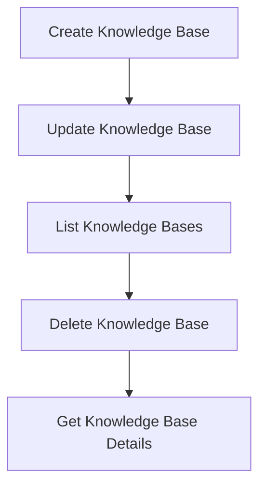
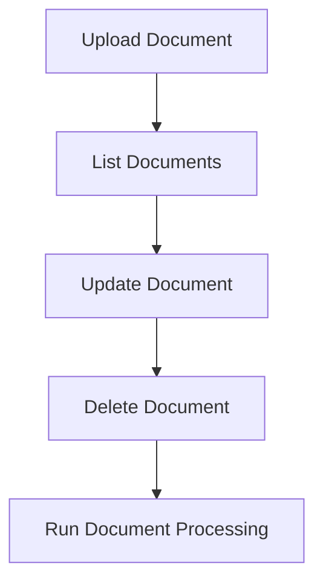
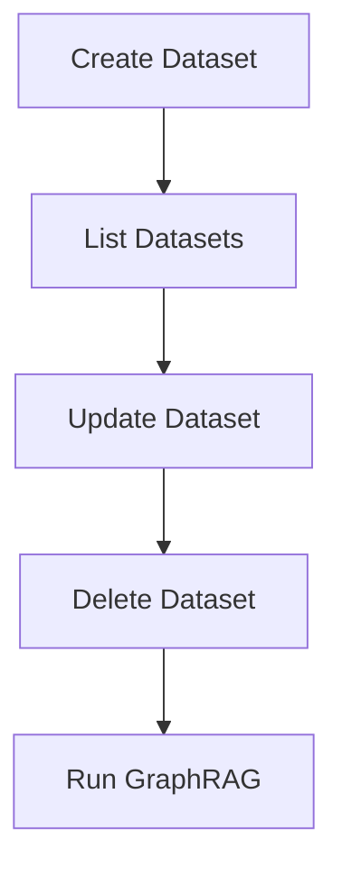
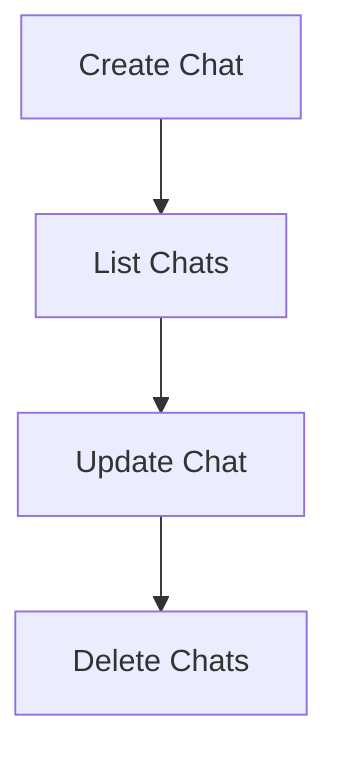
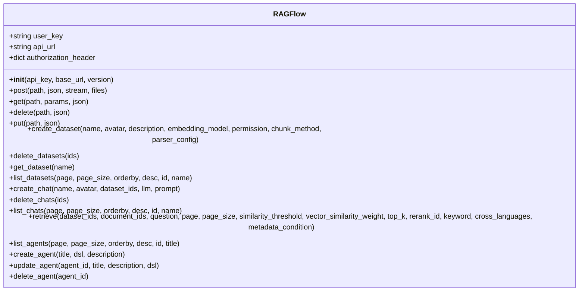
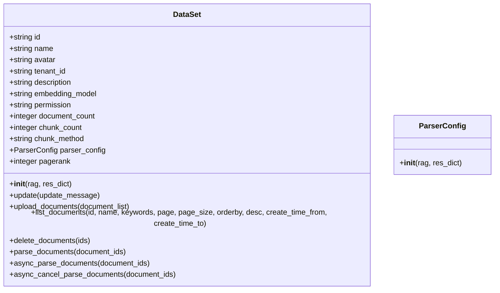
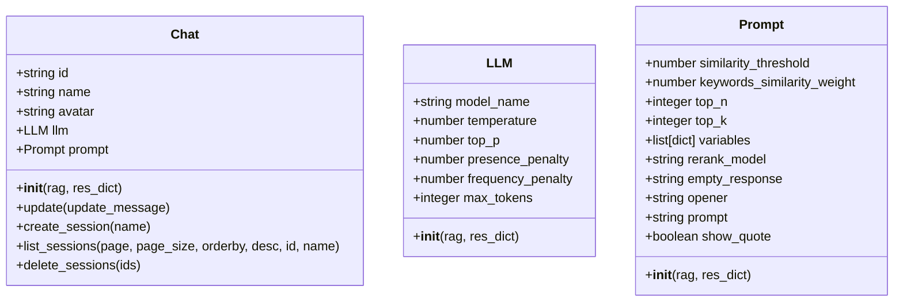

# API Reference

<cite>
**Referenced Files in This Document**   
- [api/apps/__init__.py](file://api/apps/__init__.py)
- [api/apps/kb_app.py](file://api/apps/kb_app.py)
- [api/apps/document_app.py](file://api/apps/document_app.py)
- [api/apps/sdk/dataset.py](file://api/apps/sdk/dataset.py)
- [api/apps/sdk/chat.py](file://api/apps/sdk/chat.py)
- [api/apps/system_app.py](file://api/apps/system_app.py)
- [sdk/python/ragflow_sdk/ragflow.py](file://sdk/python/ragflow_sdk/ragflow.py)
- [sdk/python/ragflow_sdk/modules/dataset.py](file://sdk/python/ragflow_sdk/modules/dataset.py)
- [sdk/python/ragflow_sdk/modules/chat.py](file://sdk/python/ragflow_sdk/modules/chat.py)
- [sdk/python/ragflow_sdk/modules/base.py](file://sdk/python/ragflow_sdk/modules/base.py)
- [api/utils/api_utils.py](file://api/utils/api_utils.py)
- [api/db/services/user_service.py](file://api/db/services/user_service.py)
- [api/db/services/knowledgebase_service.py](file://api/db/services/knowledgebase_service.py)
- [api/db/services/document_service.py](file://api/db/services/document_service.py)
- [api/db/services/dialog_service.py](file://api/db/services/dialog_service.py)
- [api/constants.py](file://api/constants.py)
- [common/constants.py](file://common/constants.py)
</cite>

## Table of Contents
1. [Introduction](#introduction)
2. [HTTP API Endpoints](#http-api-endpoints)
3. [Python SDK Interface](#python-sdk-interface)
4. [Authentication Mechanisms](#authentication-mechanisms)
5. [Rate Limiting and Performance](#rate-limiting-and-performance)
6. [Error Handling](#error-handling)
7. [Practical Examples](#practical-examples)
8. [Client Implementation Guidelines](#client-implementation-guidelines)
9. [Monitoring and Debugging](#monitoring-and-debugging)
10. [Versioning and Compatibility](#versioning-and-compatibility)

## Introduction
RAGFlow provides a comprehensive API for building and managing retrieval-augmented generation (RAG) applications. The API consists of two main components: an HTTP API for direct integration and a Python SDK for programmatic access. This documentation covers all endpoints in the `api/apps/` directory and all classes and methods in the `sdk/python/` directory.

The API enables users to create knowledge bases, upload and manage documents, query data, and manage agents. It supports various authentication methods, rate limiting, and versioning. The Python SDK provides a convenient wrapper around the HTTP API, making it easier to integrate RAGFlow functionality into Python applications.

**Section sources**
- [api/apps/__init__.py](file://api/apps/__init__.py)
- [api/apps/kb_app.py](file://api/apps/kb_app.py)
- [api/apps/document_app.py](file://api/apps/document_app.py)

## HTTP API Endpoints

### Knowledge Base Management
The knowledge base endpoints allow users to create, update, list, and delete knowledge bases.



**Diagram sources**
- [api/apps/kb_app.py](file://api/apps/kb_app.py#L47-L247)

#### Create Knowledge Base
**POST** `/api/v1/kb/create`

Creates a new knowledge base.

**Request Parameters**
- `name`: string (required) - Name of the knowledge base
- `parser_id`: string (optional) - Parser ID for the knowledge base
- `description`: string (optional) - Description of the knowledge base

**Response Schema**
```json
{
  "code": 0,
  "data": {
    "kb_id": "string"
  }
}
```

**Authentication**: Bearer Token  
**Error Codes**: 101 (Invalid request), 109 (Authentication error)

**Section sources**
- [api/apps/kb_app.py](file://api/apps/kb_app.py#L47-L67)

#### Update Knowledge Base
**POST** `/api/v1/kb/update`

Updates an existing knowledge base.

**Request Parameters**
- `kb_id`: string (required) - ID of the knowledge base to update
- `name`: string (optional) - New name for the knowledge base
- `description`: string (optional) - New description for the knowledge base
- `parser_id`: string (optional) - New parser ID for the knowledge base

**Response Schema**
```json
{
  "code": 0,
  "data": {
    "id": "string",
    "name": "string",
    "description": "string",
    "parser_id": "string"
  }
}
```

**Authentication**: Bearer Token  
**Error Codes**: 101 (Invalid request), 109 (Authentication error), 102 (Operation error)

**Section sources**
- [api/apps/kb_app.py](file://api/apps/kb_app.py#L70-L139)

#### List Knowledge Bases
**POST** `/api/v1/kb/list`

Lists knowledge bases with optional filtering.

**Query Parameters**
- `keywords`: string (optional) - Keywords to search for
- `page`: integer (optional) - Page number (default: 0)
- `page_size`: integer (optional) - Number of items per page (default: 0)
- `orderby`: string (optional) - Field to order by (default: "create_time")
- `desc`: boolean (optional) - Order in descending (default: true)

**Request Body**
```json
{
  "owner_ids": ["string"]
}
```

**Response Schema**
```json
{
  "code": 0,
  "data": {
    "kbs": [
      {
        "id": "string",
        "name": "string",
        "description": "string",
        "parser_id": "string",
        "create_time": "integer"
      }
    ],
    "total": "integer"
  }
}
```

**Authentication**: Bearer Token  
**Error Codes**: 101 (Invalid request), 109 (Authentication error)

**Section sources**
- [api/apps/kb_app.py](file://api/apps/kb_app.py#L171-L205)

#### Delete Knowledge Base
**POST** `/api/v1/kb/rm`

Deletes a knowledge base.

**Request Parameters**
- `kb_id`: string (required) - ID of the knowledge base to delete

**Response Schema**
```json
{
  "code": 0,
  "data": true
}
```

**Authentication**: Bearer Token  
**Error Codes**: 101 (Invalid request), 109 (Authentication error), 102 (Operation error)

**Section sources**
- [api/apps/kb_app.py](file://api/apps/kb_app.py#L208-L247)

### Document Management
The document endpoints allow users to upload, list, update, and delete documents within knowledge bases.



**Diagram sources**
- [api/apps/document_app.py](file://api/apps/document_app.py#L50-L398)

#### Upload Document
**POST** `/api/v1/document/upload`

Uploads a document to a knowledge base.

**Request Parameters**
- `kb_id`: string (required) - ID of the knowledge base
- `file`: file (required) - File to upload

**Response Schema**
```json
{
  "code": 0,
  "data": [
    {
      "id": "string",
      "name": "string",
      "size": "integer",
      "type": "string"
    }
  ]
}
```

**Authentication**: Bearer Token  
**Error Codes**: 101 (Invalid request), 109 (Authentication error), 102 (Operation error)

**Section sources**
- [api/apps/document_app.py](file://api/apps/document_app.py#L50-L83)

#### List Documents
**POST** `/api/v1/document/list`

Lists documents in a knowledge base with optional filtering.

**Query Parameters**
- `kb_id`: string (required) - ID of the knowledge base
- `keywords`: string (optional) - Keywords to search for
- `page`: integer (optional) - Page number (default: 0)
- `page_size`: integer (optional) - Number of items per page (default: 0)
- `orderby`: string (optional) - Field to order by (default: "create_time")
- `desc`: boolean (optional) - Order in descending (default: true)
- `create_time_from`: integer (optional) - Filter by creation time from
- `create_time_to`: integer (optional) - Filter by creation time to

**Request Body**
```json
{
  "run_status": ["string"],
  "types": ["string"],
  "suffix": ["string"]
}
```

**Response Schema**
```json
{
  "code": 0,
  "data": {
    "total": "integer",
    "docs": [
      {
        "id": "string",
        "name": "string",
        "size": "integer",
        "type": "string",
        "create_time": "integer",
        "run": "string",
        "progress": "number"
      }
    ]
  }
}
```

**Authentication**: Bearer Token  
**Error Codes**: 101 (Invalid request), 109 (Authentication error)

**Section sources**
- [api/apps/document_app.py](file://api/apps/document_app.py#L209-L269)

#### Run Document Processing
**POST** `/api/v1/document/run`

Starts or stops document processing.

**Request Parameters**
- `doc_ids`: array of strings (required) - IDs of documents to process
- `run`: string (required) - Operation to perform ("0" for stop, "1" for start)
- `delete`: boolean (optional) - Whether to delete existing chunks

**Response Schema**
```json
{
  "code": 0,
  "data": true
}
```

**Authentication**: Bearer Token  
**Error Codes**: 101 (Invalid request), 109 (Authentication error), 102 (Operation error)

**Section sources**
- [api/apps/document_app.py](file://api/apps/document_app.py#L401-L446)

### Dataset Management
The dataset endpoints provide a higher-level interface for managing knowledge bases, with additional features like embedding model selection.



**Diagram sources**
- [api/apps/sdk/dataset.py](file://api/apps/sdk/dataset.py#L55-L481)

#### Create Dataset
**POST** `/api/v1/datasets`

Creates a new dataset (knowledge base).

**Request Body**
```json
{
  "name": "string",
  "avatar": "string",
  "description": "string",
  "embedding_model": "string",
  "permission": "string",
  "chunk_method": "string",
  "parser_config": {}
}
```

**Response Schema**
```json
{
  "code": 0,
  "data": {
    "id": "string",
    "name": "string",
    "description": "string",
    "embedding_model": "string",
    "permission": "string",
    "chunk_method": "string"
  }
}
```

**Authentication**: Bearer Token  
**Error Codes**: 101 (Invalid request), 109 (Authentication error), 102 (Operation error)

**Section sources**
- [api/apps/sdk/dataset.py](file://api/apps/sdk/dataset.py#L55-L155)

#### List Datasets
**GET** `/api/v1/datasets`

Lists datasets with optional filtering.

**Query Parameters**
- `id`: string (optional) - Filter by dataset ID
- `name`: string (optional) - Filter by dataset name
- `page`: integer (optional) - Page number (default: 1)
- `page_size`: integer (optional) - Number of items per page (default: 30)
- `orderby`: string (optional) - Field to order by (default: "create_time")
- `desc`: boolean (optional) - Order in descending (default: true)

**Response Schema**
```json
{
  "code": 0,
  "data": [
    {
      "id": "string",
      "name": "string",
      "description": "string",
      "embedding_model": "string",
      "permission": "string",
      "chunk_method": "string",
      "create_time": "integer"
    }
  ],
  "total": "integer"
}
```

**Authentication**: Bearer Token  
**Error Codes**: 101 (Invalid request), 109 (Authentication error)

**Section sources**
- [api/apps/sdk/dataset.py](file://api/apps/sdk/dataset.py#L386-L480)

### Chat Management
The chat endpoints allow users to create, update, list, and delete chat assistants.



**Diagram sources**
- [api/apps/sdk/chat.py](file://api/apps/sdk/chat.py#L27-L324)

#### Create Chat
**POST** `/api/v1/chats`

Creates a new chat assistant.

**Request Body**
```json
{
  "name": "string",
  "avatar": "string",
  "dataset_ids": ["string"],
  "llm": {
    "model_name": "string",
    "temperature": "number",
    "top_p": "number",
    "presence_penalty": "number",
    "frequency_penalty": "number",
    "max_tokens": "integer"
  },
  "prompt": {
    "similarity_threshold": "number",
    "keywords_similarity_weight": "number",
    "top_n": "integer",
    "top_k": "integer",
    "variables": [
      {
        "key": "string",
        "optional": "boolean"
      }
    ],
    "rerank_model": "string",
    "empty_response": "string",
    "opener": "string",
    "prompt": "string",
    "show_quote": "boolean"
  }
}
```

**Response Schema**
```json
{
  "code": 0,
  "data": {
    "id": "string",
    "name": "string",
    "avatar": "string",
    "dataset_ids": ["string"],
    "llm": {
      "model_name": "string",
      "temperature": "number",
      "top_p": "number",
      "presence_penalty": "number",
      "frequency_penalty": "number",
      "max_tokens": "integer"
    },
    "prompt": {
      "similarity_threshold": "number",
      "keywords_similarity_weight": "number",
      "top_n": "integer",
      "top_k": "integer",
      "variables": [
        {
          "key": "string",
          "optional": "boolean"
        }
      ],
      "rerank_model": "string",
      "empty_response": "string",
      "opener": "string",
      "prompt": "string",
      "show_quote": "boolean"
    }
  }
}
```

**Authentication**: Bearer Token  
**Error Codes**: 101 (Invalid request), 109 (Authentication error), 102 (Operation error)

**Section sources**
- [api/apps/sdk/chat.py](file://api/apps/sdk/chat.py#L27-L141)

#### List Chats
**GET** `/api/v1/chats`

Lists chat assistants with optional filtering.

**Query Parameters**
- `id`: string (optional) - Filter by chat ID
- `name`: string (optional) - Filter by chat name
- `page`: integer (optional) - Page number (default: 1)
- `page_size`: integer (optional) - Number of items per page (default: 30)
- `orderby`: string (optional) - Field to order by (default: "create_time")
- `desc`: boolean (optional) - Order in descending (default: true)

**Response Schema**
```json
{
  "code": 0,
  "data": [
    {
      "id": "string",
      "name": "string",
      "avatar": "string",
      "dataset_ids": ["string"],
      "llm": {
        "model_name": "string",
        "temperature": "number",
        "top_p": "number",
        "presence_penalty": "number",
        "frequency_penalty": "number",
        "max_tokens": "integer"
      },
      "prompt": {
        "similarity_threshold": "number",
        "keywords_similarity_weight": "number",
        "top_n": "integer",
        "top_k": "integer",
        "variables": [
          {
            "key": "string",
            "optional": "boolean"
          }
        ],
        "rerank_model": "string",
        "empty_response": "string",
        "opener": "string",
        "prompt": "string",
        "show_quote": "boolean"
      },
      "create_time": "integer"
    }
  ]
}
```

**Authentication**: Bearer Token  
**Error Codes**: 101 (Invalid request), 109 (Authentication error)

**Section sources**
- [api/apps/sdk/chat.py](file://api/apps/sdk/chat.py#L270-L324)

### System Endpoints
The system endpoints provide information about the API version and system status.

#### Get Version
**GET** `/api/v1/version`

Retrieves the current version of the application.

**Response Schema**
```json
{
  "code": 0,
  "data": {
    "version": "string"
  }
}
```

**Authentication**: Bearer Token  
**Error Codes**: 109 (Authentication error)

**Section sources**
- [api/apps/system_app.py](file://api/apps/system_app.py#L42-L62)

#### Get Status
**GET** `/api/v1/status`

Retrieves the system status.

**Response Schema**
```json
{
  "code": 0,
  "data": {
    "es": {
      "status": "string",
      "message": "string"
    },
    "storage": {
      "status": "string",
      "message": "string"
    },
    "database": {
      "status": "string",
      "message": "string"
    }
  }
}
```

**Authentication**: Bearer Token  
**Error Codes**: 109 (Authentication error)

**Section sources**
- [api/apps/system_app.py](file://api/apps/system_app.py#L65-L104)

## Python SDK Interface

### RAGFlow Class
The main entry point for the Python SDK.



**Diagram sources**
- [sdk/python/ragflow_sdk/ragflow.py](file://sdk/python/ragflow_sdk/ragflow.py#L26-L285)

#### Constructor
```python
def __init__(self, api_key, base_url, version="v1")
```

Initializes a new RAGFlow client.

**Parameters**
- `api_key`: string - API key for authentication
- `base_url`: string - Base URL of the RAGFlow server
- `version`: string - API version (default: "v1")

**Section sources**
- [sdk/python/ragflow_sdk/ragflow.py](file://sdk/python/ragflow_sdk/ragflow.py#L26-L34)

#### create_dataset
```python
def create_dataset(
    self,
    name: str,
    avatar: Optional[str] = None,
    description: Optional[str] = None,
    embedding_model: Optional[str] = None,
    permission: str = "me",
    chunk_method: str = "naive",
    parser_config: Optional[DataSet.ParserConfig] = None,
) -> DataSet
```

Creates a new dataset.

**Parameters**
- `name`: string - Name of the dataset
- `avatar`: string (optional) - Base64-encoded avatar image
- `description`: string (optional) - Description of the dataset
- `embedding_model`: string (optional) - Embedding model name
- `permission`: string (default: "me") - Visibility of the dataset ("me" or "team")
- `chunk_method`: string (default: "naive") - Chunking method
- `parser_config`: DataSet.ParserConfig (optional) - Parser configuration

**Returns**: DataSet - The created dataset

**Section sources**
- [sdk/python/ragflow_sdk/ragflow.py](file://sdk/python/ragflow_sdk/ragflow.py#L51-L76)

#### list_datasets
```python
def list_datasets(
    self,
    page: int = 1,
    page_size: int = 30,
    orderby: str = "create_time",
    desc: bool = True,
    id: str | None = None,
    name: str | None = None
) -> list[DataSet]
```

Lists datasets with optional filtering.

**Parameters**
- `page`: integer (default: 1) - Page number
- `page_size`: integer (default: 30) - Number of items per page
- `orderby`: string (default: "create_time") - Field to order by
- `desc`: boolean (default: True) - Order in descending
- `id`: string (optional) - Filter by dataset ID
- `name`: string (optional) - Filter by dataset name

**Returns**: list[DataSet] - List of datasets

**Section sources**
- [sdk/python/ragflow_sdk/ragflow.py](file://sdk/python/ragflow_sdk/ragflow.py#L90-L108)

#### create_chat
```python
def create_chat(
    self,
    name: str,
    avatar: str = "",
    dataset_ids=None,
    llm: Chat.LLM | None = None,
    prompt: Chat.Prompt | None = None
) -> Chat
```

Creates a new chat assistant.

**Parameters**
- `name`: string - Name of the chat assistant
- `avatar`: string (default: "") - Avatar URL
- `dataset_ids`: list[string] (optional) - List of dataset IDs to use
- `llm`: Chat.LLM (optional) - LLM configuration
- `prompt`: Chat.Prompt (optional) - Prompt configuration

**Returns**: Chat - The created chat assistant

**Section sources**
- [sdk/python/ragflow_sdk/ragflow.py](file://sdk/python/ragflow_sdk/ragflow.py#L110-L160)

#### retrieve
```python
def retrieve(
    self,
    dataset_ids,
    document_ids=None,
    question="",
    page=1,
    page_size=30,
    similarity_threshold=0.2,
    vector_similarity_weight=0.3,
    top_k=1024,
    rerank_id: str | None = None,
    keyword: bool = False,
    cross_languages: list[str]|None = None,
    metadata_condition: dict | None = None,
) -> list[Chunk]
```

Retrieves relevant chunks from datasets.

**Parameters**
- `dataset_ids`: list[string] - List of dataset IDs to search
- `document_ids`: list[string] (optional) - List of document IDs to search
- `question`: string (default: "") - Question to search for
- `page`: integer (default: 1) - Page number
- `page_size`: integer (default: 30) - Number of items per page
- `similarity_threshold`: number (default: 0.2) - Similarity threshold
- `vector_similarity_weight`: number (default: 0.3) - Vector similarity weight
- `top_k`: integer (default: 1024) - Number of top results to return
- `rerank_id`: string (optional) - Rerank model ID
- `keyword`: boolean (default: False) - Whether to use keyword search
- `cross_languages`: list[string] (optional) - List of languages for cross-language search
- `metadata_condition`: dict (optional) - Metadata condition for filtering

**Returns**: list[Chunk] - List of retrieved chunks

**Section sources**
- [sdk/python/ragflow_sdk/ragflow.py](file://sdk/python/ragflow_sdk/ragflow.py#L188-L228)

### DataSet Class
Represents a dataset (knowledge base) in RAGFlow.



**Diagram sources**
- [sdk/python/ragflow_sdk/modules/dataset.py](file://sdk/python/ragflow_sdk/modules/dataset.py#L21-L153)

#### upload_documents
```python
def upload_documents(self, document_list: list[dict])
```

Uploads documents to the dataset.

**Parameters**
- `document_list`: list[dict] - List of documents to upload, each with "display_name" and "blob" keys

**Returns**: list[Document] - List of uploaded documents

**Section sources**
- [sdk/python/ragflow_sdk/modules/dataset.py](file://sdk/python/ragflow_sdk/modules/dataset.py#L53-L64)

#### parse_documents
```python
def parse_documents(self, document_ids)
```

Parses documents in the dataset.

**Parameters**
- `document_ids`: list[string] - List of document IDs to parse

**Returns**: list[tuple] - List of tuples containing document ID, status, chunk count, and token count

**Section sources**
- [sdk/python/ragflow_sdk/modules/dataset.py](file://sdk/python/ragflow_sdk/modules/dataset.py#L139-L146)

### Chat Class
Represents a chat assistant in RAGFlow.



**Diagram sources**
- [sdk/python/ragflow_sdk/modules/chat.py](file://sdk/python/ragflow_sdk/modules/chat.py#L22-L87)

#### create_session
```python
def create_session(self, name: str = "New session") -> Session
```

Creates a new session with the chat assistant.

**Parameters**
- `name`: string (default: "New session") - Name of the session

**Returns**: Session - The created session

**Section sources**
- [sdk/python/ragflow_sdk/modules/chat.py](file://sdk/python/ragflow_sdk/modules/chat.py#L66-L71)

## Authentication Mechanisms
RAGFlow supports multiple authentication mechanisms for API access.

### API Key Authentication
The primary authentication method is API key authentication using Bearer tokens.

**Header**
```
Authorization: Bearer <API_KEY>
```

The API key can be obtained through the RAGFlow UI or by creating a new token via the API.

### Token Generation
API tokens can be generated using the `/api/v1/api/new_token` endpoint.

**POST** `/api/v1/api/new_token`

**Response**
```json
{
  "code": 0,
  "data": {
    "token": "string"
  }
}
```

**Section sources**
- [api/apps/api_app.py](file://api/apps/api_app.py#L26-L32)

### Authentication Flow
1. Obtain an API key from the RAGFlow UI or generate one via the API
2. Include the API key in the Authorization header of all requests
3. The server validates the token and grants access to authorized endpoints

The authentication system uses JWT tokens and validates them against the database. Tokens are associated with a tenant ID, which determines the scope of access.

**Section sources**
- [api/apps/__init__.py](file://api/apps/__init__.py#L114-L143)
- [api/utils/api_utils.py](file://api/utils/api_utils.py#L250-L280)

## Rate Limiting and Performance
RAGFlow implements rate limiting to prevent abuse and ensure system stability.

### Rate Limiting
Rate limiting is implemented at the API level to control the number of requests per user.

**Rate Limit Headers**
- `X-RateLimit-Limit`: The maximum number of requests allowed
- `X-RateLimit-Remaining`: The number of requests remaining
- `X-RateLimit-Reset`: The time when the rate limit will reset

When a rate limit is exceeded, the server returns a 429 status code with a Retry-After header indicating when the client can retry.

### Performance Optimization
To optimize performance when using the RAGFlow API:

1. **Batch Operations**: Use batch endpoints when possible to reduce the number of API calls
2. **Caching**: Implement client-side caching for frequently accessed data
3. **Pagination**: Use pagination for large datasets to reduce response size
4. **Connection Pooling**: Use connection pooling to reduce connection overhead
5. **Asynchronous Processing**: Use asynchronous endpoints for long-running operations

For document processing, consider using the asynchronous methods to avoid timeouts.

**Section sources**
- [common/data_source/utils.py](file://common/data_source/utils.py#L113-L250)
- [sandbox/executor_manager/services/limiter.py](file://sandbox/executor_manager/services/limiter.py#L1-L38)

## Error Handling
RAGFlow provides comprehensive error handling with standardized error codes and messages.

### Error Response Format
All error responses follow the same format:

```json
{
  "code": "integer",
  "message": "string",
  "data": "object" (optional)
}
```

### Common Error Codes
| Code | Message | Description |
|------|---------|-------------|
| 0 | success | Operation completed successfully |
| 101 | Invalid request | The request is malformed or missing required parameters |
| 102 | Operation error | The operation failed due to a business logic error |
| 109 | Authentication error | Authentication failed or token is invalid |
| 401 | Unauthorized | The user does not have permission for the operation |
| 500 | Internal server error | An unexpected error occurred on the server |

### Error Handling Best Practices
1. **Validate Input**: Always validate input parameters before making API calls
2. **Handle Errors Gracefully**: Implement proper error handling in your application
3. **Retry Logic**: Implement retry logic for transient errors (e.g., rate limiting)
4. **Logging**: Log errors for debugging and monitoring purposes
5. **User Feedback**: Provide meaningful error messages to end users

**Section sources**
- [api/utils/api_utils.py](file://api/utils/api_utils.py#L31-L40)
- [common/constants.py](file://common/constants.py#L1-L20)

## Practical Examples

### Creating a Knowledge Base and Uploading Documents
```python
from ragflow_sdk import RAGFlow

# Initialize the client
client = RAGFlow(api_key="your_api_key", base_url="http://localhost:8888")

# Create a dataset
dataset = client.create_dataset(
    name="My Knowledge Base",
    description="A collection of documents about AI",
    chunk_method="naive"
)

# Upload a document
with open("document.pdf", "rb") as f:
    document_list = [{"display_name": "document.pdf", "blob": f.read()}]
    documents = dataset.upload_documents(document_list)

# Parse the documents
dataset.parse_documents([doc.id for doc in documents])
```

**Section sources**
- [sdk/python/ragflow_sdk/ragflow.py](file://sdk/python/ragflow_sdk/ragflow.py#L51-L76)
- [sdk/python/ragflow_sdk/modules/dataset.py](file://sdk/python/ragflow_sdk/modules/dataset.py#L53-L64)

### Creating a Chat Assistant and Querying Data
```python
from ragflow_sdk import RAGFlow

# Initialize the client
client = RAGFlow(api_key="your_api_key", base_url="http://localhost:8888")

# Create a chat assistant
chat = client.create_chat(
    name="AI Assistant",
    dataset_ids=["dataset_id_1", "dataset_id_2"]
)

# Create a session
session = chat.create_session("My Session")

# Retrieve relevant chunks
chunks = client.retrieve(
    dataset_ids=["dataset_id_1", "dataset_id_2"],
    question="What is the capital of France?"
)

# Process the chunks and generate a response
# (Implementation depends on your specific use case)
```

**Section sources**
- [sdk/python/ragflow_sdk/ragflow.py](file://sdk/python/ragflow_sdk/ragflow.py#L110-L160)
- [sdk/python/ragflow_sdk/ragflow.py](file://sdk/python/ragflow_sdk/ragflow.py#L188-L228)

### Managing Agents
```python
from ragflow_sdk import RAGFlow

# Initialize the client
client = RAGFlow(api_key="your_api_key", base_url="http://localhost:8888")

# Create an agent
dsl = {
    "components": {
        "begin": {
            "obj": {
                "component_name": "Begin",
                "params": {}
            }
        }
    },
    "graph": {
        "nodes": [
            {
                "id": "begin",
                "data": {
                    "label": "Begin",
                    "name": "begin"
                }
            }
        ],
        "edges": []
    }
}

client.create_agent(
    title="My Agent",
    dsl=dsl,
    description="An agent for processing documents"
)

# List all agents
agents = client.list_agents()

# Update an agent
client.update_agent(
    agent_id="agent_id_1",
    title="Updated Agent",
    description="An updated description"
)
```

**Section sources**
- [sdk/python/ragflow_sdk/ragflow.py](file://sdk/python/ragflow_sdk/ragflow.py#L250-L285)

## Client Implementation Guidelines

### HTTP Client Configuration
When implementing an HTTP client for RAGFlow, consider the following:

1. **Timeouts**: Set appropriate timeouts for requests, especially for long-running operations like document processing
2. **Retries**: Implement retry logic for transient errors
3. **Connection Pooling**: Use connection pooling to improve performance
4. **Error Handling**: Implement comprehensive error handling
5. **Authentication**: Securely store and manage API keys

### Python SDK Best Practices
When using the Python SDK:

1. **Initialize Once**: Initialize the RAGFlow client once and reuse it
2. **Handle Exceptions**: Wrap SDK calls in try-except blocks
3. **Use Type Hints**: Take advantage of type hints for better code quality
4. **Follow Naming Conventions**: Use consistent naming conventions
5. **Document Your Code**: Add comments and documentation to your code

### Performance Considerations
To optimize performance:

1. **Batch Operations**: Use batch endpoints when possible
2. **Pagination**: Use pagination for large datasets
3. **Caching**: Implement caching for frequently accessed data
4. **Asynchronous Processing**: Use asynchronous methods for long-running operations
5. **Monitor Performance**: Monitor API performance and optimize as needed

**Section sources**
- [sdk/python/ragflow_sdk/ragflow.py](file://sdk/python/ragflow_sdk/ragflow.py#L35-L49)
- [sdk/python/ragflow_sdk/modules/base.py](file://sdk/python/ragflow_sdk/modules/base.py#L41-L55)

## Monitoring and Debugging

### Protocol-Specific Debugging Tools
RAGFlow provides several tools for debugging and monitoring API usage:

1. **Swagger UI**: Accessible at `/apidocs/`, provides an interactive API documentation and testing interface
2. **System Status Endpoint**: `/api/v1/status` provides real-time system health information
3. **Version Endpoint**: `/api/v1/version` returns the current version of the application
4. **Log Files**: Server logs provide detailed information about API requests and responses

### Monitoring Approaches
To effectively monitor RAGFlow API usage:

1. **Log Analysis**: Regularly analyze server logs for errors and performance issues
2. **Performance Metrics**: Monitor response times, error rates, and throughput
3. **Health Checks**: Implement regular health checks using the `/api/v1/status` endpoint
4. **Alerting**: Set up alerts for critical errors or performance degradation
5. **Usage Analytics**: Track API usage patterns to identify optimization opportunities

### Debugging Tips
1. **Enable Verbose Logging**: Enable verbose logging during development
2. **Use Swagger UI**: Test API endpoints using the interactive Swagger UI
3. **Check Headers**: Verify that all required headers are included in requests
4. **Validate Input**: Ensure that input parameters are correctly formatted
5. **Monitor Rate Limits**: Pay attention to rate limit headers and implement appropriate retry logic

**Section sources**
- [api/apps/__init__.py](file://api/apps/__init__.py#L47-L77)
- [api/apps/system_app.py](file://api/apps/system_app.py#L65-L104)

## Versioning and Compatibility

### API Versioning
RAGFlow uses semantic versioning for its API. The current version is v1, accessible at `/api/v1/`.

Future versions will be released at different endpoints (e.g., `/api/v2/`) to ensure backward compatibility.

### Backwards Compatibility
RAGFlow maintains backwards compatibility for existing API endpoints. When changes are made:

1. **Deprecation Notices**: Deprecated endpoints will be marked as such in the documentation
2. **Grace Period**: A grace period will be provided before removing deprecated endpoints
3. **Migration Guides**: Migration guides will be provided for breaking changes

### Migration Guides
When migrating from older versions:

1. **Review Changelog**: Check the release notes for changes
2. **Update Dependencies**: Update the Python SDK to the latest version
3. **Test Thoroughly**: Test your application with the new version
4. **Monitor Performance**: Monitor performance after the upgrade
5. **Report Issues**: Report any issues to the RAGFlow team

**Section sources**
- [api/apps/__init__.py](file://api/apps/__init__.py#L35)
- [docs/release_notes.md](file://docs/release_notes.md)