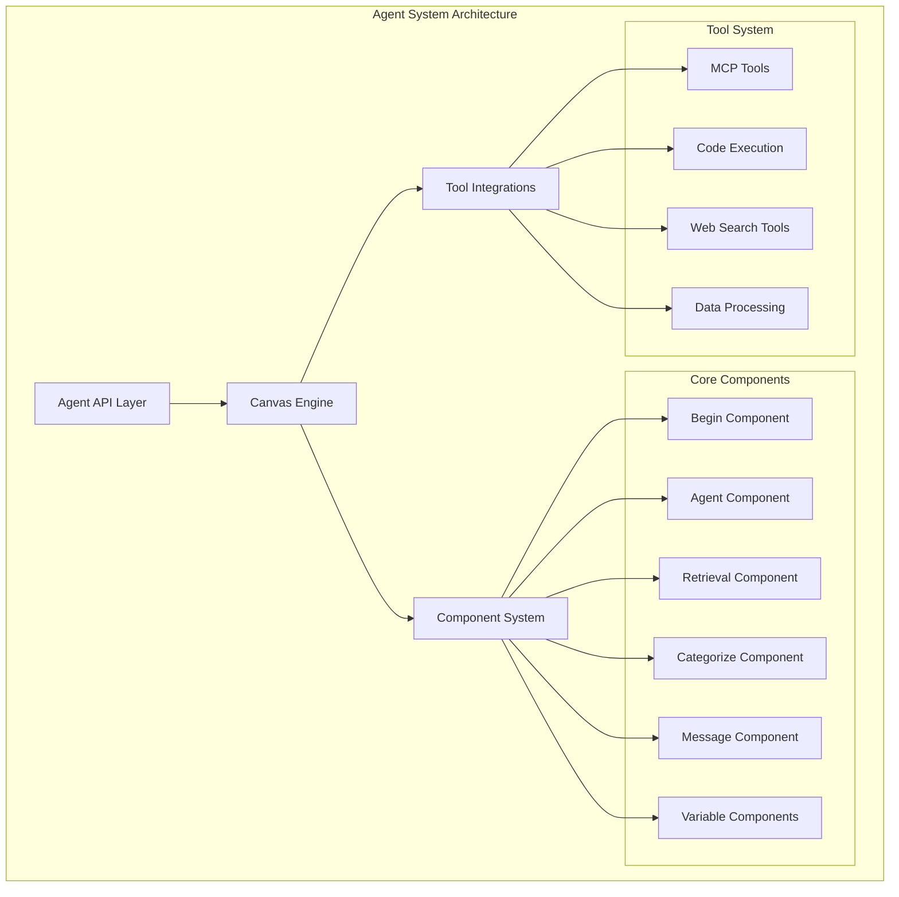
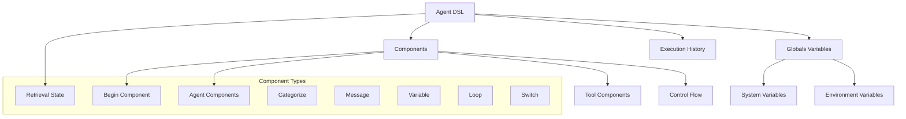
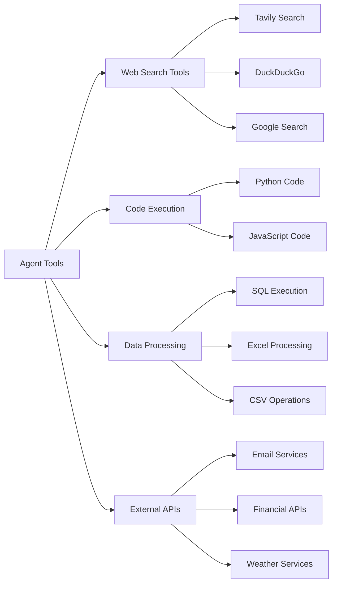
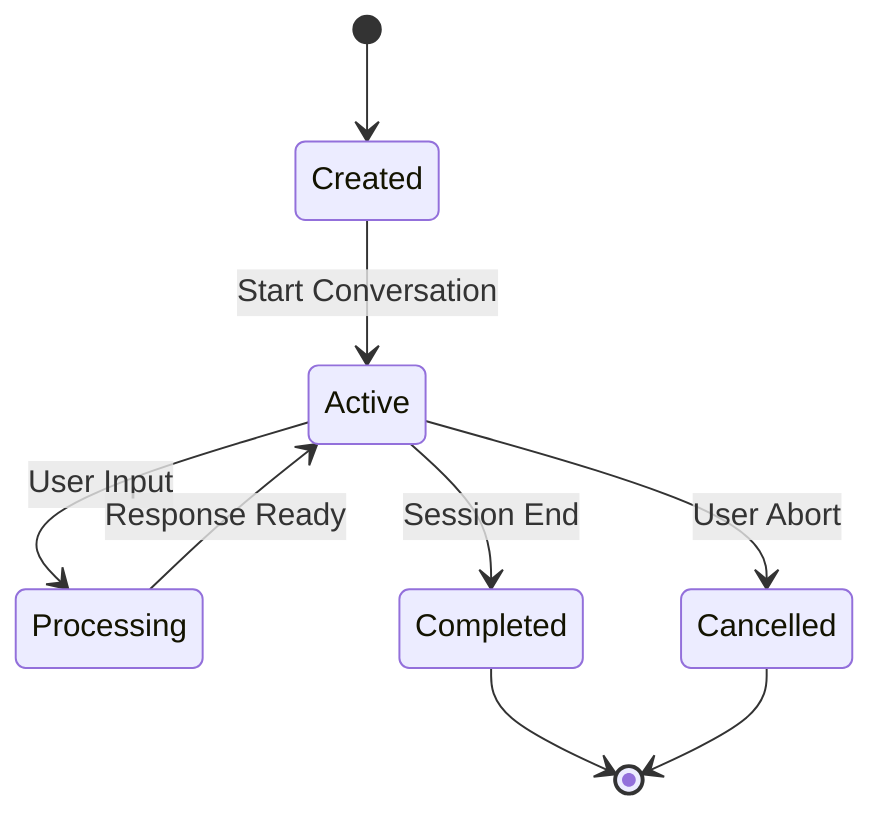
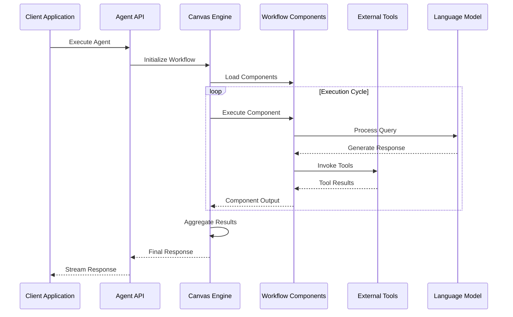
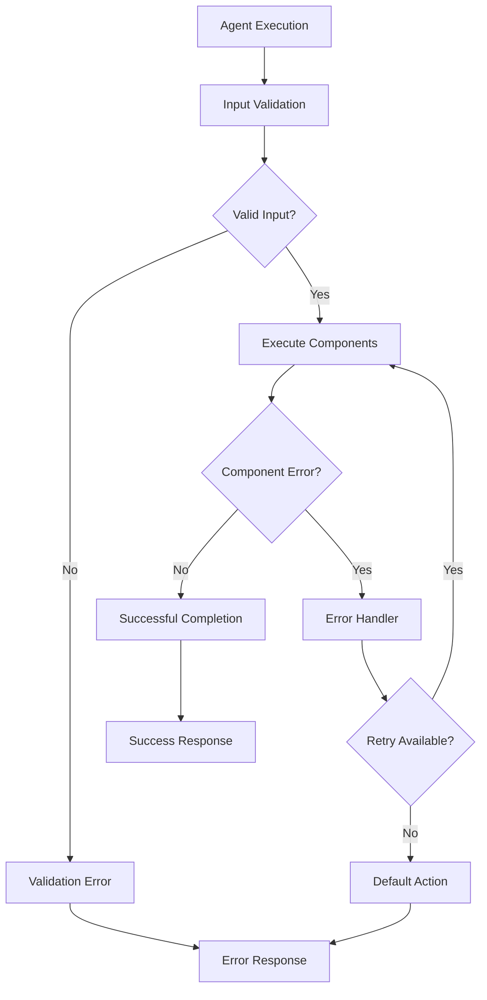
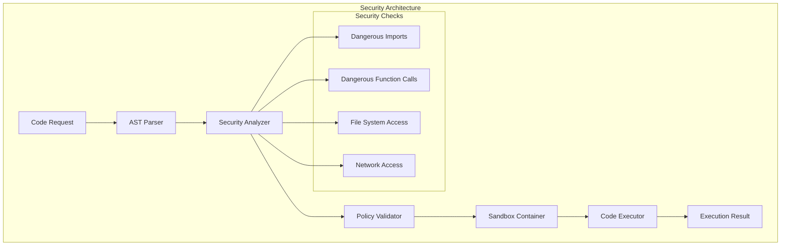

# Agent API Documentation

<cite>
**Referenced Files in This Document**
- [agents.py](file://api/apps/sdk/agents.py)
- [agent.py](file://sdk/python/ragflow_sdk/modules/agent.py)
- [canvas.py](file://agent/canvas.py)
- [base.py](file://agent/component/base.py)
- [code_exec.py](file://agent/tools/code_exec.py)
- [security.py](file://sandbox/executor_manager/services/security.py)
- [session.py](file://api/apps/sdk/session.py)
- [conversation_app.py](file://api/apps/conversation_app.py)
- [customer_service.json](file://agent/templates/customer_service.json)
</cite>

## Table of Contents
1. [Introduction](#introduction)
2. [Agent Architecture Overview](#agent-architecture-overview)
3. [Core API Endpoints](#core-api-endpoints)
4. [Agent Configuration Schema](#agent-configuration-schema)
5. [Tool Integrations](#tool-integrations)
6. [Session Management](#session-management)
7. [Agent Execution Lifecycle](#agent-execution-lifecycle)
8. [Error Handling](#error-handling)
9. [Security Considerations](#security-considerations)
10. [Examples and Usage Patterns](#examples-and-usage-patterns)
11. [Troubleshooting Guide](#troubleshooting-guide)

## Introduction

The RAGFlow Agent API provides a comprehensive framework for creating, managing, and executing intelligent agents with sophisticated tool integrations. Agents are configurable workflows that combine Large Language Models (LLMs), retrieval systems, and various tools to perform complex tasks autonomously or in response to user queries.

Agents operate within a visual workflow system where components are connected in a directed graph, enabling complex reasoning patterns and multi-step processing pipelines. The system supports real-time execution with streaming responses, comprehensive error handling, and robust security measures including sandboxed code execution.

## Agent Architecture Overview

The Agent system is built on a modular component architecture that enables flexible workflow composition and powerful automation capabilities.



**Diagram sources**
- [canvas.py](file://agent/canvas.py#L282-L310)
- [base.py](file://agent/component/base.py#L393-L410)

**Section sources**
- [canvas.py](file://agent/canvas.py#L40-L89)
- [base.py](file://agent/component/base.py#L393-L410)

## Core API Endpoints

### Agent Management Endpoints

#### List Agents
Retrieve a paginated list of agents owned by the authenticated user.

**Endpoint:** `GET /api/v1/agents`

**Parameters:**
- `page` (integer): Page number (default: 1)
- `page_size` (integer): Items per page (default: 30)
- `orderby` (string): Sort field (`update_time`, `create_time`)
- `desc` (boolean): Sort direction (default: true)
- `id` (string): Filter by specific agent ID
- `title` (string): Filter by agent title

**Response:**
```json
{
  "code": 0,
  "data": [
    {
      "id": "agent_id",
      "title": "Customer Support Agent",
      "description": "Intelligent customer service agent",
      "user_id": "tenant_id",
      "create_time": 1640995200,
      "update_time": 1640995200
    }
  ]
}
```

#### Create Agent
Create a new agent with specified configuration and workflow definition.

**Endpoint:** `POST /api/v1/agents`

**Request Body:**
```json
{
  "title": "My Agent",
  "description": "Agent description",
  "dsl": {
    "components": {
      "begin": {
        "obj": {
          "component_name": "Begin",
          "params": {
            "prologue": "Hello, I'm your assistant!",
            "mode": "conversational"
          }
        },
        "downstream": ["categorize"],
        "upstream": []
      }
    },
    "globals": {
      "sys.query": "",
      "sys.user_id": "tenant_id"
    }
  }
}
```

**Response:**
```json
{
  "code": 0,
  "data": true
}
```

#### Update Agent
Modify an existing agent's configuration and workflow.

**Endpoint:** `PUT /api/v1/agents/{agent_id}`

**Request Body:**
```json
{
  "title": "Updated Agent Name",
  "dsl": {
    // Updated DSL configuration
  }
}
```

#### Delete Agent
Remove an agent and all associated sessions.

**Endpoint:** `DELETE /api/v1/agents/{agent_id}`

**Response:**
```json
{
  "code": 0,
  "data": true
}
```

#### Execute Agent via Webhook
Trigger agent execution with webhook payload for immediate processing.

**Endpoint:** `POST /api/v1/webhook/{agent_id}`

**Request Body:**
```json
{
  "query": "User question",
  "files": [],
  "user_id": "tenant_id",
  "id": "agent_id"
}
```

**Response:** Server-Sent Events (SSE) stream with execution progress.

**Section sources**
- [agents.py](file://api/apps/sdk/agents.py#L33-L180)

## Agent Configuration Schema

### Basic Agent Structure

Agents are configured using a Domain Specific Language (DSL) that defines the workflow structure, component parameters, and execution logic.



**Diagram sources**
- [canvas.py](file://agent/canvas.py#L40-L89)

### Component Configuration

Each component in the agent workflow has specific parameters and configuration options:

#### Begin Component
Initializes the agent workflow and sets up conversation context.

**Parameters:**
- `prologue`: Initial greeting message
- `mode`: Execution mode (`conversational`, `analytical`)
- `enablePrologue`: Enable/disable initial greeting
- `inputs`: Predefined input variables

#### Agent Component
Core reasoning component that processes user queries using LLMs.

**Parameters:**
- `llm_id`: LLM provider identifier
- `sys_prompt`: System prompt for the agent
- `temperature`: Randomness parameter (0.0-2.0)
- `max_tokens`: Maximum response length
- `tools`: Enabled tool integrations
- `mcp`: Model Context Protocol tools
- `max_rounds`: Maximum reasoning iterations

#### Retrieval Component
Enables knowledge base search and document retrieval.

**Parameters:**
- `kb_ids`: Knowledge base identifiers
- `query`: Search query template
- `top_k`: Maximum documents to retrieve
- `similarity_threshold`: Similarity cutoff
- `use_kg`: Enable knowledge graph search

#### Categorize Component
Classifies user queries into predefined categories for routing.

**Parameters:**
- `category_description`: Category definitions and routing rules
- `llm_id`: Classification LLM
- `temperature`: Classification randomness

**Section sources**
- [canvas.py](file://agent/canvas.py#L40-L89)
- [customer_service.json](file://agent/templates/customer_service.json#L15-L342)

## Tool Integrations

### Available Tool Categories

The Agent system supports multiple categories of tools for extended functionality:



**Diagram sources**
- [code_exec.py](file://agent/tools/code_exec.py#L126-L145)

### Code Execution Tool

Provides secure sandboxed code execution capabilities with support for multiple programming languages.

**Configuration:**
```json
{
  "component_name": "CodeExec",
  "params": {
    "lang": "python",
    "script": "def main(): return {'result': 'Hello World'}",
    "arguments": {
      "arg1": "value1",
      "arg2": "value2"
    }
  }
}
```

**Security Features:**
- Sandboxed execution environment
- Resource limits and timeouts
- Safe code analysis using AST parsing
- Restricted system access

### MCP (Model Context Protocol) Tools

Enable integration with external tools and services through standardized protocols.

**Supported MCP Servers:**
- GitHub integration
- Database connections
- File system operations
- Custom tool servers

**Section sources**
- [code_exec.py](file://agent/tools/code_exec.py#L126-L145)
- [security.py](file://sandbox/executor_manager/services/security.py#L23-L57)

## Session Management

### Creating Agent Sessions

Sessions represent individual agent execution instances with isolated state and conversation history.

**Endpoint:** `POST /api/v1/agents/{agent_id}/sessions`

**Request:**
```json
{
  "user_id": "tenant_id",
  "name": "Customer Inquiry Session"
}
```

**Response:**
```json
{
  "code": 0,
  "data": {
    "id": "session_id",
    "agent_id": "agent_id",
    "user_id": "tenant_id",
    "name": "Customer Inquiry Session",
    "message": [
      {
        "role": "assistant",
        "content": "Hello! How can I help you today?"
      }
    ],
    "source": "agent",
    "dsl": {...}
  }
}
```

### Session Lifecycle Management



**Diagram sources**
- [session.py](file://api/apps/sdk/session.py#L74-L95)

### Listing and Managing Sessions

**List Sessions:**
```bash
GET /api/v1/agents/{agent_id}/sessions?page=1&page_size=30&orderby=create_time&desc=true
```

**Delete Sessions:**
```bash
DELETE /api/v1/agents/{agent_id}/sessions
Content-Type: application/json
Authorization: Bearer <API_KEY>

{
  "ids": ["session_id_1", "session_id_2"]
}
```

**Section sources**
- [session.py](file://api/apps/sdk/session.py#L74-L95)
- [agent.py](file://sdk/python/ragflow_sdk/modules/agent.py#L69-L94)

## Agent Execution Lifecycle

### Workflow Execution Process

The agent execution follows a structured lifecycle with real-time monitoring and streaming responses.



**Diagram sources**
- [canvas.py](file://agent/canvas.py#L363-L471)

### Real-time Monitoring

The system provides comprehensive monitoring through Server-Sent Events (SSE):

**Event Types:**
- `workflow_started`: Workflow initialization
- `node_started`: Individual component execution start
- `node_finished`: Component execution completion
- `message`: Generated content delivery
- `workflow_finished`: Complete workflow termination

**Example SSE Stream:**
```json
data: {"event": "workflow_started", "data": {"inputs": {"query": "Hello"}}}

data: {"event": "node_started", "data": {"component_name": "Begin"}}

data: {"event": "message", "data": {"content": "Hello! How can I help you?"}}

data: {"event": "workflow_finished", "data": {"outputs": {"content": "..."}}}
```

### Variable System

Agents utilize a sophisticated variable system for data flow and state management:

**Variable Types:**
- `sys.`: System variables (query, user_id, conversation_turns)
- `env.`: Environment variables (configured in agent)
- `{component_id}@variable`: Component output variables

**Variable Resolution:**
The system automatically resolves variable references using pattern matching and value substitution.

**Section sources**
- [canvas.py](file://agent/canvas.py#L363-L471)
- [base.py](file://agent/component/base.py#L165-L256)

## Error Handling

### Error Types and Responses

The Agent system implements comprehensive error handling across all execution stages:



**Diagram sources**
- [base.py](file://agent/component/base.py#L434-L446)

### Common Error Scenarios

**Timeout Errors:**
- Component execution timeout (default: 10 minutes)
- Tool execution timeout
- Network request timeout

**Validation Errors:**
- Invalid agent configuration
- Missing required parameters
- Malformed DSL structure

**Resource Errors:**
- Memory exhaustion
- CPU limit exceeded
- External service unavailable

**Security Errors:**
- Sandbox violation detected
- Unsafe code execution attempted
- Unauthorized API access

### Error Response Format

```json
{
  "code": 500,
  "message": "Component execution failed: Timeout exceeded",
  "data": {
    "component_id": "component_id",
    "error_type": "timeout",
    "elapsed_time": 600.5
  }
}
```

**Section sources**
- [base.py](file://agent/component/base.py#L434-L446)
- [canvas.py](file://agent/canvas.py#L457-L461)

## Security Considerations

### Sandboxed Code Execution

The system implements multiple layers of security for code execution:



**Diagram sources**
- [security.py](file://sandbox/executor_manager/services/security.py#L23-L57)

### Security Measures

**Code Analysis:**
- AST-based static analysis
- Detection of dangerous imports and function calls
- Pattern matching for suspicious operations
- Safe function whitelist enforcement

**Container Isolation:**
- Docker-based sandbox environment
- Resource limits (CPU, memory, disk)
- Network isolation
- File system restrictions

**API Security:**
- Authentication and authorization
- Rate limiting
- Input validation
- Audit logging

### Tool Security

**External Tool Restrictions:**
- API key management and rotation
- Request rate limiting
- Response size limits
- Content filtering

**MCP Security:**
- Server authentication
- Protocol validation
- Resource monitoring

**Section sources**
- [security.py](file://sandbox/executor_manager/services/security.py#L23-L174)
- [code_exec.py](file://agent/tools/code_exec.py#L129-L168)

## Examples and Usage Patterns

### Creating a Multi-Agent Customer Support System

```json
{
  "title": "Customer Support Assistant",
  "description": "Multi-agent system for handling customer inquiries",
  "dsl": {
    "components": {
      "begin": {
        "obj": {
          "component_name": "Begin",
          "params": {
            "prologue": "Hello! I'm your customer support assistant. How can I help you?",
            "mode": "conversational"
          }
        },
        "downstream": ["categorize"],
        "upstream": []
      },
      "categorize": {
        "obj": {
          "component_name": "Categorize",
          "params": {
            "llm_id": "gpt-4o@OpenAI",
            "category_description": {
              "product": {
                "description": "Product-related questions",
                "to": ["product_info"]
              },
              "complaint": {
                "description": "Customer complaints",
                "to": ["empathy_agent"]
              },
              "general": {
                "description": "General inquiries",
                "to": ["casual_agent"]
              }
            }
          }
        },
        "downstream": ["product_info", "empathy_agent", "casual_agent"],
        "upstream": ["begin"]
      }
    }
  }
}
```

### Agent with Code Execution

```json
{
  "components": {
    "analyze_data": {
      "obj": {
        "component_name": "Agent",
        "params": {
          "llm_id": "gpt-4o@OpenAI",
          "sys_prompt": "You are a data analyst. Analyze the provided data and generate insights.",
          "tools": ["code_execution"],
          "max_rounds": 3
        }
      }
    },
    "code_exec": {
      "obj": {
        "component_name": "CodeExec",
        "params": {
          "lang": "python",
          "script": "def main(data): import pandas as pd; df = pd.DataFrame(data); return {'mean': df.mean().to_dict()}"
        }
      }
    }
  }
}
```

### Webhook Integration Example

```bash
curl -X POST "https://api.ragflow.com/api/v1/webhook/{agent_id}" \
  -H "Authorization: Bearer YOUR_API_KEY" \
  -H "Content-Type: application/json" \
  -d '{
    "query": "Analyze sales data for Q1",
    "user_id": "customer_123",
    "files": [
      {
        "id": "file_abc123",
        "name": "sales_data.csv",
        "mime_type": "text/csv"
      }
    ]
  }'
```

**Section sources**
- [customer_service.json](file://agent/templates/customer_service.json#L15-L342)
- [agents.py](file://api/apps/sdk/agents.py#L136-L179)

## Troubleshooting Guide

### Common Issues and Solutions

**Agent Not Found:**
- Verify agent ID exists and belongs to your tenant
- Check authentication token validity
- Ensure proper API endpoint URL

**Workflow Execution Failures:**
- Review component parameter validation
- Check LLM availability and quotas
- Verify tool configuration and credentials

**Timeout Issues:**
- Increase timeout values for long-running operations
- Optimize component logic and reduce complexity
- Monitor resource usage and adjust limits

**Security Violations:**
- Review code execution policies
- Check tool permissions and API keys
- Verify sandbox configuration

### Debugging Tools

**Logging and Monitoring:**
- Enable detailed logging for component execution
- Monitor SSE streams for real-time feedback
- Use audit logs for security analysis

**Testing Strategies:**
- Test individual components in isolation
- Validate DSL structure before deployment
- Use small datasets for initial testing

### Performance Optimization

**Component Optimization:**
- Minimize unnecessary tool calls
- Optimize LLM prompts and parameters
- Use appropriate caching strategies

**Resource Management:**
- Monitor memory usage during execution
- Implement proper cleanup procedures
- Use connection pooling for external services

**Section sources**
- [base.py](file://agent/component/base.py#L434-L446)
- [canvas.py](file://agent/canvas.py#L457-L461)