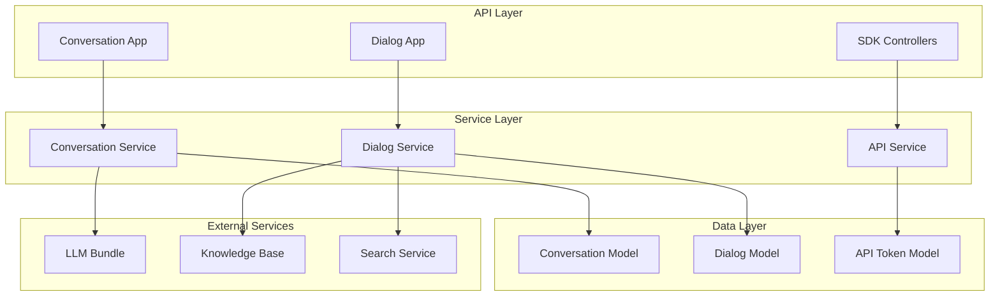
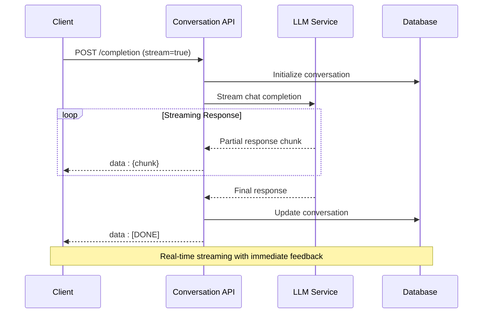
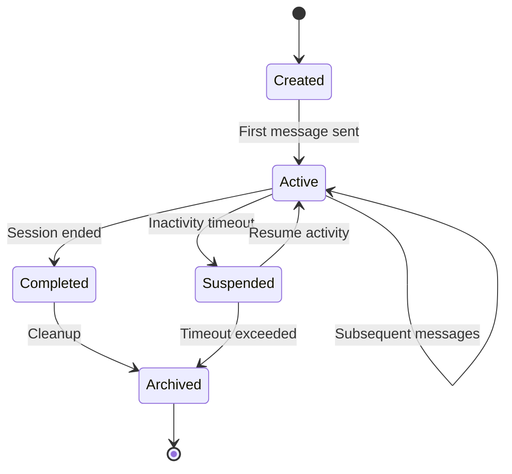

# Chat & Conversation API

<cite>
**Referenced Files in This Document**
- [conversation_app.py](file://api/apps/conversation_app.py)
- [dialog_app.py](file://api/apps/dialog_app.py)
- [conversation_service.py](file://api/db/services/conversation_service.py)
- [dialog_service.py](file://api/db/services/dialog_service.py)
- [db_models.py](file://api/db/db_models.py)
- [api_utils.py](file://api/utils/api_utils.py)
- [chat.py](file://api/apps/sdk/chat.py)
- [session.py](file://api/apps/sdk/session.py)
- [api_service.py](file://api/db/services/api_service.py)
</cite>

## Table of Contents
1. [Introduction](#introduction)
2. [System Architecture](#system-architecture)
3. [Core Data Models](#core-data-models)
4. [Dialog Management APIs](#dialog-management-apis)
5. [Conversation Management APIs](#conversation-management-apis)
6. [Streaming Response Pattern](#streaming-response-pattern)
7. [Security & Authentication](#security--authentication)
8. [Session Management](#session-management)
9. [Message History & Retention](#message-history--retention)
10. [Error Handling](#error-handling)
11. [Best Practices](#best-practices)

## Introduction

The RAGFlow Chat & Conversation API provides a comprehensive framework for managing AI-powered chat sessions with real-time streaming capabilities. The system supports multiple dialog configurations, conversation persistence, and sophisticated message handling with reference tracking and metadata management.

The API is built around two primary concepts:
- **Dialogs**: Persistent chat configurations that define LLM settings, knowledge bases, and prompt templates
- **Conversations**: Session-based message exchanges that maintain context and history

## System Architecture

The chat system follows a layered architecture with clear separation of concerns:



**Diagram sources**
- [conversation_app.py](file://api/apps/conversation_app.py#L1-L50)
- [dialog_app.py](file://api/apps/dialog_app.py#L1-L50)
- [conversation_service.py](file://api/db/services/conversation_service.py#L1-L50)
- [dialog_service.py](file://api/db/services/dialog_service.py#L1-L50)

## Core Data Models

### Dialog Model

The Dialog model represents persistent chat configurations with comprehensive settings:

| Field | Type | Description | Default |
|-------|------|-------------|---------|
| `id` | String | Unique dialog identifier | Auto-generated |
| `tenant_id` | String | Organization tenant ID | Required |
| `name` | String | Dialog display name | Required |
| `description` | Text | Dialog description | Optional |
| `icon` | Text | Base64 encoded icon | Optional |
| `language` | String | Dialog language | "English" |
| `llm_id` | String | Default LLM model ID | Required |
| `llm_setting` | JSON | LLM configuration parameters | Temperature: 0.1 |
| `prompt_type` | String | Prompt template type | "simple" |
| `prompt_config` | JSON | Prompt configuration | System prompt template |
| `similarity_threshold` | Float | Vector similarity threshold | 0.2 |
| `vector_similarity_weight` | Float | Vector similarity weight | 0.3 |
| `top_n` | Integer | Top N results for retrieval | 6 |
| `top_k` | Integer | Top K candidates for reranking | 1024 |
| `do_refer` | String | Enable reference insertion | "1" |
| `rerank_id` | String | Reranking model ID | Optional |
| `kb_ids` | JSON | Associated knowledge base IDs | [] |
| `status` | String | Dialog status (0/1) | "1" |

### Conversation Model

The Conversation model manages session-based message exchanges:

| Field | Type | Description | Default |
|-------|------|-------------|---------|
| `id` | String | Unique conversation identifier | Auto-generated |
| `dialog_id` | String | Parent dialog identifier | Required |
| `name` | String | Conversation display name | Optional |
| `message` | JSON | Message history array | [] |
| `reference` | JSON | Reference tracking data | [] |
| `user_id` | String | User identifier | Optional |

**Section sources**
- [db_models.py](file://api/db/db_models.py#L842-L871)
- [db_models.py](file://api/db/db_models.py#L877-L883)

## Dialog Management APIs

### Create/Edit Dialog

**Endpoint:** `POST /api/dialog/set`

Creates or updates a dialog configuration with comprehensive settings.

**Request Schema:**
```json
{
  "dialog_id": "string",
  "name": "string",
  "description": "string",
  "icon": "string",
  "llm_id": "string",
  "llm_setting": {
    "temperature": "float",
    "top_p": "float",
    "frequency_penalty": "float",
    "presence_penalty": "float",
    "max_tokens": "integer"
  },
  "prompt_config": {
    "system": "string",
    "prologue": "string",
    "parameters": [],
    "empty_response": "string",
    "quote": "boolean",
    "tts": "boolean"
  },
  "kb_ids": ["string"],
  "similarity_threshold": "float",
  "vector_similarity_weight": "float",
  "top_n": "integer",
  "top_k": "integer",
  "rerank_id": "string"
}
```

**Response Schema:**
```json
{
  "code": "integer",
  "message": "string",
  "data": {
    "id": "string",
    "tenant_id": "string",
    "name": "string",
    "description": "string",
    "icon": "string",
    "llm_id": "string",
    "llm_setting": {},
    "prompt_config": {},
    "kb_ids": ["string"],
    "similarity_threshold": "float",
    "vector_similarity_weight": "float",
    "top_n": "integer",
    "top_k": "integer",
    "rerank_id": "string",
    "status": "string"
  }
}
```

**Example Request:**
```bash
curl -X POST "https://api.ragflow.io/api/dialog/set" \
  -H "Authorization: Bearer YOUR_TOKEN" \
  -H "Content-Type: application/json" \
  -d '{
    "name": "Customer Support Assistant",
    "description": "Handles customer inquiries and support tickets",
    "llm_id": "gpt-4",
    "llm_setting": {
      "temperature": 0.3,
      "max_tokens": 1024
    },
    "prompt_config": {
      "system": "You are a customer support assistant...",
      "prologue": "Hello! How can I help you today?",
      "parameters": [
        {
          "key": "customer_name",
          "optional": false
        }
      ]
    },
    "kb_ids": ["kb_123", "kb_456"],
    "similarity_threshold": 0.2,
    "vector_similarity_weight": 0.3,
    "top_n": 6
  }'
```

### Get Dialog Details

**Endpoint:** `GET /api/dialog/get?dialog_id=STRING`

Retrieves dialog configuration with associated knowledge bases.

**Response Schema:**
```json
{
  "code": "integer",
  "message": "string",
  "data": {
    "id": "string",
    "tenant_id": "string",
    "name": "string",
    "description": "string",
    "icon": "string",
    "llm_id": "string",
    "llm_setting": {},
    "prompt_config": {},
    "kb_ids": ["string"],
    "kb_names": ["string"],
    "similarity_threshold": "float",
    "vector_similarity_weight": "float",
    "top_n": "integer",
    "top_k": "integer",
    "rerank_id": "string",
    "status": "string"
  }
}
```

### List Dialogs

**Endpoint:** `GET /api/dialog/list`

Lists all dialogs for the current tenant with pagination support.

**Query Parameters:**
- `page`: Page number (default: 0)
- `page_size`: Items per page (default: 0 for all)
- `orderby`: Sort field (default: "create_time")
- `desc`: Descending order flag (default: true)

**Response Schema:**
```json
{
  "code": "integer",
  "message": "string",
  "data": [
    {
      "id": "string",
      "tenant_id": "string",
      "name": "string",
      "description": "string",
      "icon": "string",
      "llm_id": "string",
      "kb_ids": ["string"],
      "kb_names": ["string"],
      "status": "string"
    }
  ]
}
```

### Delete Dialogs

**Endpoint:** `POST /api/dialog/rm`

Soft deletes one or more dialogs by marking them as invalid.

**Request Schema:**
```json
{
  "dialog_ids": ["string"]
}
```

**Section sources**
- [dialog_app.py](file://api/apps/dialog_app.py#L30-L120)
- [dialog_app.py](file://api/apps/dialog_app.py#L126-L137)
- [dialog_app.py](file://api/apps/dialog_app.py#L152-L166)
- [dialog_app.py](file://api/apps/dialog_app.py#L207-L228)

## Conversation Management APIs

### Create Conversation

**Endpoint:** `POST /api/conversation/set`

Creates a new conversation or updates an existing one with initial message.

**Request Schema:**
```json
{
  "conversation_id": "string",
  "is_new": "boolean",
  "name": "string",
  "dialog_id": "string"
}
```

**Response Schema:**
```json
{
  "code": "integer",
  "message": "string",
  "data": {
    "id": "string",
    "dialog_id": "string",
    "name": "string",
    "message": [
      {
        "role": "string",
        "content": "string",
        "created_at": "float",
        "id": "string"
      }
    ],
    "reference": [],
    "user_id": "string"
  }
}
```

### Get Conversation

**Endpoint:** `GET /api/conversation/get?conversation_id=STRING`

Retrieves conversation details with formatted references.

**Response Schema:**
```json
{
  "code": "integer",
  "message": "string",
  "data": {
    "id": "string",
    "dialog_id": "string",
    "name": "string",
    "message": [
      {
        "role": "string",
        "content": "string",
        "created_at": "float",
        "id": "string"
      }
    ],
    "reference": [
      {
        "chunks": [],
        "doc_aggs": []
      }
    ],
    "user_id": "string",
    "avatar": "string"
  }
}
```

### List Conversations

**Endpoint:** `GET /api/conversation/list?dialog_id=STRING`

Lists all conversations for a specific dialog.

**Response Schema:**
```json
{
  "code": "integer",
  "message": "string",
  "data": [
    {
      "id": "string",
      "dialog_id": "string",
      "name": "string",
      "message": [
        {
          "role": "string",
          "content": "string",
          "created_at": "float",
          "id": "string"
        }
      ],
      "reference": [],
      "user_id": "string"
    }
  ]
}
```

### Delete Conversations

**Endpoint:** `POST /api/conversation/rm`

Deletes one or more conversations by marking them as invalid.

**Request Schema:**
```json
{
  "conversation_ids": ["string"]
}
```

### Send Message & Get Completion

**Endpoint:** `POST /api/conversation/completion`

Sends a message and receives a streaming or non-streaming response.

**Request Schema:**
```json
{
  "conversation_id": "string",
  "messages": [
    {
      "role": "string",
      "content": "string",
      "id": "string"
    }
  ],
  "llm_id": "string",
  "temperature": "float",
  "top_p": "float",
  "frequency_penalty": "float",
  "presence_penalty": "float",
  "max_tokens": "integer",
  "stream": "boolean"
}
```

**Response Schema (Streaming):**
```json
data: {
  "code": 0,
  "message": "",
  "data": {
    "answer": "string",
    "reference": {},
    "audio_binary": null,
    "id": "string",
    "session_id": "string"
  }
}

data: {
  "code": 0,
  "message": "",
  "data": true
}
```

**Response Schema (Non-Streaming):**
```json
{
  "code": "integer",
  "message": "string",
  "data": {
    "answer": "string",
    "reference": {},
    "audio_binary": null,
    "id": "string",
    "session_id": "string"
  }
}
```

**Section sources**
- [conversation_app.py](file://api/apps/conversation_app.py#L37-L78)
- [conversation_app.py](file://api/apps/conversation_app.py#L81-L105)
- [conversation_app.py](file://api/apps/conversation_app.py#L153-L166)
- [conversation_app.py](file://api/apps/conversation_app.py#L168-L251)

## Streaming Response Pattern

The system implements Server-Sent Events (SSE) for real-time streaming responses, enabling immediate feedback during long-running LLM operations.

### SSE Implementation Pattern



**Diagram sources**
- [conversation_app.py](file://api/apps/conversation_app.py#L220-L232)
- [conversation_service.py](file://api/db/services/conversation_service.py#L149-L159)

### SSE Response Format

Each streaming response follows the SSE protocol format:

```json
data: {
  "code": 0,
  "message": "",
  "data": {
    "answer": "partial content...",
    "reference": {},
    "audio_binary": null,
    "id": "message_id",
    "session_id": "session_id"
  }
}
```

### Client-Side Implementation

**JavaScript Example:**
```javascript
const eventSource = new EventSource('/api/conversation/completion');

eventSource.onmessage = function(event) {
  const data = JSON.parse(event.data);
  
  if (data.code === 0) {
    if (data.data === true) {
      // Stream completed
      eventSource.close();
    } else {
      // Append partial content
      updateChatUI(data.data.answer);
    }
  } else {
    // Handle error
    showError(data.message);
  }
};

eventSource.onerror = function(error) {
  console.error('Streaming error:', error);
  eventSource.close();
};
```

**Section sources**
- [conversation_app.py](file://api/apps/conversation_app.py#L220-L240)
- [conversation_service.py](file://api/db/services/conversation_service.py#L149-L159)

## Security & Authentication

### Authentication Methods

The API supports multiple authentication mechanisms:

1. **Bearer Token Authentication**
   ```bash
   Authorization: Bearer YOUR_API_TOKEN
   ```

2. **API Token Authentication**
   ```bash
   Authorization: Bearer YOUR_BETA_TOKEN
   ```

### Authorization Controls

**Dialog Operations:**
- Only dialog owners can modify or delete dialogs
- Tenant-based access control ensures data isolation
- Cross-tenant dialog access is restricted

**Conversation Operations:**
- Conversations inherit dialog ownership permissions
- User-specific conversation access validation
- Session-level security enforcement

### Security Features

| Feature | Implementation | Purpose |
|---------|----------------|---------|
| **Tenant Isolation** | `tenant_id` field in all models | Prevents cross-tenant data access |
| **Ownership Validation** | UserTenantService queries | Ensures only authorized users can modify resources |
| **API Token Management** | APIToken model with beta field | Provides secure external access |
| **Rate Limiting** | Built-in request validation | Prevents abuse and ensures fair usage |
| **Input Sanitization** | validate_request decorator | Protects against injection attacks |

### API Token Management

**Generate API Token:**
```bash
POST /api/token
{
  "dialog_id": "dialog_id",
  "canvas_id": "canvas_id"
}
```

**List API Tokens:**
```bash
GET /api/token_list?dialog_id=DIALOG_ID
```

**Delete API Tokens:**
```bash
POST /api/token_rm
{
  "tokens": ["token1", "token2"],
  "tenant_id": "tenant_id"
}
```

**Section sources**
- [dialog_app.py](file://api/apps/dialog_app.py#L210-L220)
- [conversation_app.py](file://api/apps/conversation_app.py#L110-L126)
- [api_utils.py](file://api/utils/api_utils.py#L143-L178)

## Session Management

### Session Lifecycle

Conversations represent ephemeral chat sessions with automatic lifecycle management:



### Session Persistence

**Automatic Persistence:**
- Messages are automatically saved to database
- Conversation state maintained across requests
- Reference tracking preserved for citations

**Session Metadata:**
```json
{
  "id": "conversation_id",
  "dialog_id": "dialog_id",
  "name": "conversation_name",
  "message": [
    {
      "role": "user/assistant/system",
      "content": "message_content",
      "created_at": timestamp,
      "id": "unique_message_id"
    }
  ],
  "reference": [
    {
      "chunks": [],
      "doc_aggs": []
    }
  ],
  "user_id": "user_identifier"
}
```

### Session Expiration

Sessions are managed with the following retention policies:
- **Active Sessions**: Persist indefinitely until explicit deletion
- **Inactive Sessions**: Automatically cleaned up based on usage patterns
- **Archived Sessions**: Retained for audit and compliance purposes

**Section sources**
- [conversation_service.py](file://api/db/services/conversation_service.py#L92-L118)
- [api_service.py](file://api/db/services/api_service.py#L80-L82)

## Message History & Retention

### Message Structure

Each message maintains comprehensive metadata for context preservation:

```json
{
  "role": "user|assistant|system",
  "content": "Message content with potential placeholders",
  "created_at": 1703123456.789,
  "id": "unique_message_id",
  "thumbup": true/false,
  "feedback": "Optional user feedback"
}
```

### Reference Tracking

The system maintains detailed reference information for each message:

```json
{
  "reference": [
    {
      "chunks": [
        {
          "content": "Relevant text chunk",
          "doc_id": "document_id",
          "title": "Document title",
          "segment": "Text segment",
          "similarity": 0.85
        }
      ],
      "doc_aggs": [
        {
          "doc_id": "document_id",
          "count": 2,
          "similarity": 0.85
        }
      ]
    }
  ]
}
```

### History Management Policies

| Policy | Duration | Purpose |
|--------|----------|---------|
| **Active History** | Unlimited | Current conversation context |
| **Archival History** | 30 days | Recent conversation backup |
| **Long-term Storage** | 1 year | Compliance and analytics |
| **Permanent Deletion** | 1 year | GDPR compliance |

### Message Thumbs Up/Down

Users can provide feedback on assistant responses:

**Thumb Up:**
```bash
POST /api/conversation/thumbup
{
  "conversation_id": "conversation_id",
  "message_id": "message_id",
  "thumbup": true
}
```

**Thumb Down with Feedback:**
```bash
POST /api/conversation/thumbup
{
  "conversation_id": "conversation_id",
  "message_id": "message_id",
  "thumbup": false,
  "feedback": "Incorrect information provided"
}
```

**Section sources**
- [conversation_app.py](file://api/apps/conversation_app.py#L344-L391)
- [conversation_service.py](file://api/db/services/conversation_service.py#L67-L90)

## Error Handling

### Standard Error Response Format

All API endpoints return standardized error responses:

```json
{
  "code": "integer",
  "message": "string",
  "data": null
}
```

### Common Error Codes

| Code | HTTP Status | Description | Resolution |
|------|-------------|-------------|------------|
| 0 | 200 | Success | No action needed |
| 1 | 400 | Bad Request | Check request parameters |
| 2 | 401 | Unauthorized | Verify authentication |
| 3 | 403 | Forbidden | Insufficient permissions |
| 4 | 404 | Not Found | Resource doesn't exist |
| 5 | 500 | Internal Error | Contact support |

### Error Categories

**Validation Errors:**
```json
{
  "code": 1,
  "message": "Required argument are missing: conversation_id, messages"
}
```

**Authentication Errors:**
```json
{
  "code": 2,
  "message": "Unauthorized: Invalid API key"
}
```

**Business Logic Errors:**
```json
{
  "code": 3,
  "message": "Only owner of conversation authorized for this operation"
}
```

**System Errors:**
```json
{
  "code": 5,
  "message": "Internal server error occurred",
  "data": {
    "error_details": "Detailed error information"
  }
}
```

### Streaming Error Handling

During streaming responses, errors are communicated through the SSE protocol:

```json
data: {
  "code": 500,
  "message": "LLM service unavailable",
  "data": {
    "answer": "**ERROR**: LLM service unavailable",
    "reference": []
  }
}
```

**Section sources**
- [api_utils.py](file://api/utils/api_utils.py#L109-L118)
- [api_utils.py](file://api/utils/api_utils.py#L121-L140)
- [conversation_app.py](file://api/apps/conversation_app.py#L229-L231)

## Best Practices

### API Usage Guidelines

**1. Efficient Streaming Implementation:**
```javascript
// Good: Proper SSE handling with error recovery
const sse = new EventSource('/api/conversation/completion');
let accumulatedContent = '';

sse.onmessage = function(event) {
  const data = JSON.parse(event.data);
  
  if (data.code === 0 && data.data !== true) {
    accumulatedContent += data.data.answer;
    updateUI(accumulatedContent);
  }
};

sse.onerror = function() {
  sse.close();
  // Implement retry logic with exponential backoff
  retryWithBackoff();
};
```

**2. Conversation Management:**
```python
# Good: Proper conversation lifecycle management
def handle_chat_session(dialog_id, user_input):
    # Check if conversation exists
    conversations = list_conversations(dialog_id)
    
    if not conversations:
        # Create new conversation
        conversation = create_conversation(dialog_id, "New Session")
    else:
        # Use existing conversation
        conversation = conversations[0]
    
    # Send message and get response
    response = send_message(conversation['id'], user_input)
    
    return response
```

**3. Error Handling:**
```python
# Good: Comprehensive error handling
try:
    response = api_call()
    if response['code'] != 0:
        raise APIError(response['message'])
except APIError as e:
    logger.error(f"API Error: {e}")
    # Implement graceful degradation
    return fallback_response()
```

### Performance Optimization

**1. Batch Operations:**
- Use bulk endpoints for multiple operations
- Minimize individual API calls
- Implement efficient pagination

**2. Caching Strategies:**
- Cache frequently accessed dialogs
- Implement client-side caching for conversation metadata
- Use appropriate cache invalidation strategies

**3. Connection Management:**
- Reuse HTTP connections for streaming
- Implement proper connection pooling
- Handle connection timeouts gracefully

### Security Best Practices

**1. Authentication Security:**
- Store API tokens securely
- Implement token rotation policies
- Use HTTPS for all API communications

**2. Data Protection:**
- Encrypt sensitive conversation data
- Implement proper access controls
- Audit log all sensitive operations

**3. Rate Limiting:**
- Implement client-side rate limiting
- Use server-side throttling for protection
- Monitor usage patterns for anomalies

### Monitoring & Observability

**1. Logging:**
```python
# Good: Structured logging for debugging
logger.info("Chat completion started", extra={
    "conversation_id": conversation_id,
    "message_count": len(messages),
    "streaming": stream
})

logger.info("Chat completion completed", extra={
    "response_time": response_time,
    "token_count": token_count,
    "success": True
})
```

**2. Metrics Collection:**
- Track API response times
- Monitor error rates by endpoint
- Measure conversation success rates
- Analyze user engagement patterns

**3. Health Checks:**
```python
# Health check endpoint
@app.route('/health')
def health_check():
    try:
        # Test database connectivity
        db.ping()
        
        # Test LLM service availability
        llm_status = test_llm_connection()
        
        return {
            "status": "healthy",
            "timestamp": time.time(),
            "dependencies": {
                "database": "connected",
                "llm_service": llm_status
            }
        }
    except Exception as e:
        return {
            "status": "unhealthy",
            "error": str(e)
        }, 503
```

This comprehensive API documentation provides developers with all necessary information to effectively integrate and utilize the chat and conversation management system. The system's robust architecture, security measures, and streaming capabilities make it suitable for production deployments requiring real-time AI-powered chat functionality.