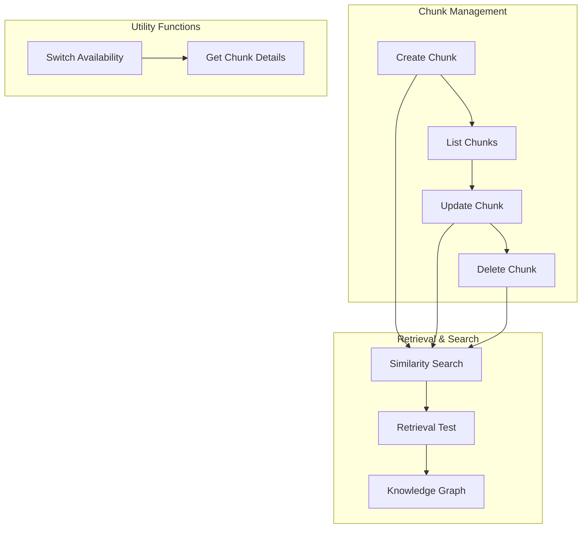
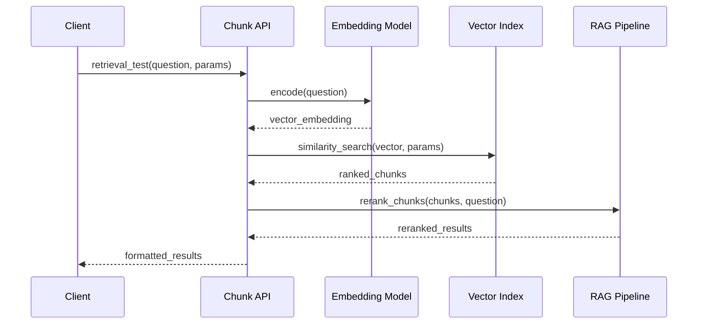
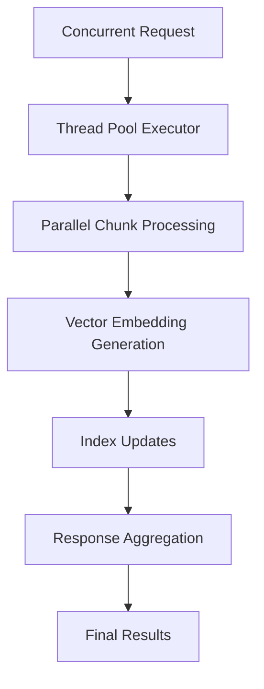
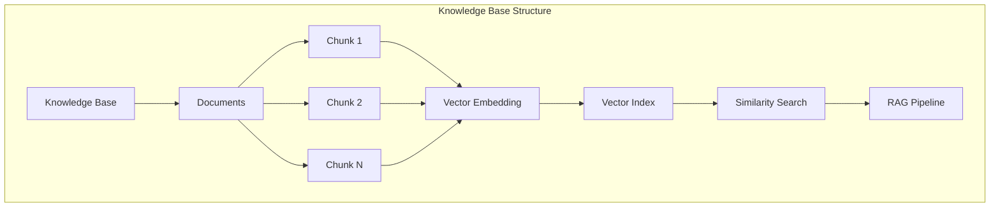
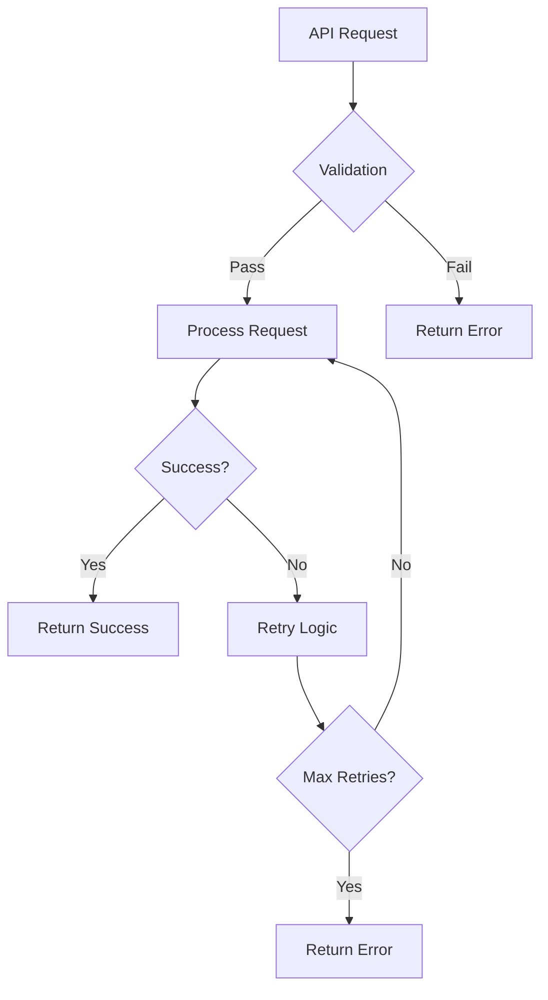

# Chunk API Documentation

<cite>
**Referenced Files in This Document**
- [chunk_app.py](file://api/apps/chunk_app.py)
- [chunk.py](file://sdk\python\ragflow_sdk\modules\chunk.py)
- [search.py](file://rag\nlp\search.py)
- [qa.py](file://rag\app\qa.py)
- [api_app.py](file://api\apps\api_app.py)
- [search_service.py](file://api\db\services\search_service.py)
- [common.py](file://test\testcases\test_http_api\common.py)
- [test_create_chunk.py](file://test\testcases\test_http_api\test_chunk_management_within_dataset\test_create_chunk.py)
- [test_update_chunk.py](file://test\testcases\test_http_api\test_chunk_management_within_dataset\test_update_chunk.py)
- [test_add_chunk.py](file://test\testcases\test_http_api\test_chunk_management_within_dataset\test_add_chunk.py)
</cite>

## Table of Contents
1. [Introduction](#introduction)
2. [API Overview](#api-overview)
3. [Core Operations](#core-operations)
4. [Request Parameters](#request-parameters)
5. [Vector Embeddings and Retrieval](#vector-embeddings-and-retrieval)
6. [Batch Operations](#batch-operations)
7. [Integration with RAG Pipeline](#integration-with-rag-pipeline)
8. [Performance Considerations](#performance-considerations)
9. [Error Handling](#error-handling)
10. [Examples](#examples)

## Introduction

The Chunk API provides comprehensive functionality for managing text chunks within knowledge bases in the RAGFlow system. Chunks represent discrete segments of content that are processed, indexed, and searchable within the knowledge base framework. This API enables CRUD operations on chunks, similarity-based retrieval, and integration with the broader RAG pipeline for intelligent query answering.

Chunks serve as the fundamental building blocks for knowledge representation, containing text content along with metadata, vector embeddings, and contextual information that enables semantic search and retrieval capabilities.

## API Overview

The Chunk API is organized around several core endpoints that handle different aspects of chunk management:



**Diagram sources**
- [chunk_app.py](file://api/apps/chunk_app.py#L41-L416)

**Section sources**
- [chunk_app.py](file://api/apps/chunk_app.py#L1-L50)

## Core Operations

### Create Chunk

Creates a new text chunk within a document, automatically generating vector embeddings and indexing the content.

**Endpoint:** `POST /api/v1/datasets/{dataset_id}/documents/{document_id}/chunks`

**Authentication:** Required (Bearer Token)

**Request Body:**
```json
{
    "content": "Text content of the chunk",
    "important_keywords": ["keyword1", "keyword2"],
    "questions": ["question1", "question2"],
    "available": true
}
```

**Response:**
```json
{
    "code": 0,
    "data": {
        "chunk_id": "generated_chunk_id"
    }
}
```

### List Chunks

Retrieves paginated list of chunks within a document with optional filtering and highlighting.

**Endpoint:** `POST /api/v1/datasets/{dataset_id}/documents/{document_id}/chunks/list`

**Authentication:** Required (Bearer Token)

**Request Body:**
```json
{
    "doc_id": "document_id",
    "page": 1,
    "size": 30,
    "keywords": "search_query",
    "available_int": 1
}
```

**Response:**
```json
{
    "code": 0,
    "data": {
        "total": 100,
        "chunks": [
            {
                "chunk_id": "chunk_id",
                "content_with_weight": "Highlighted content",
                "doc_id": "document_id",
                "important_kwd": ["keyword1"],
                "question_kwd": ["question1"],
                "available_int": 1,
                "positions": [[page_num, left, right, top, bottom]]
            }
        ],
        "doc": {
            "id": "document_id",
            "name": "Document Name",
            "chunk_count": 100
        }
    }
}
```

### Update Chunk

Modifies existing chunk content and metadata.

**Endpoint:** `PUT /api/v1/datasets/{dataset_id}/documents/{document_id}/chunks/{chunk_id}`

**Authentication:** Required (Bearer Token)

**Request Body:**
```json
{
    "content": "Updated content",
    "important_keywords": ["updated_keyword"],
    "available": true
}
```

### Delete Chunk

Removes one or more chunks from the knowledge base.

**Endpoint:** `DELETE /api/v1/datasets/{dataset_id}/documents/{document_id}/chunks`

**Authentication:** Required (Bearer Token)

**Request Body:**
```json
{
    "chunk_ids": ["chunk_id1", "chunk_id2"],
    "doc_id": "document_id"
}
```

**Section sources**
- [chunk_app.py](file://api/apps/chunk_app.py#L41-L221)

## Request Parameters

### Content Parameters

| Parameter | Type | Required | Description |
|-----------|------|----------|-------------|
| `content` | string | Yes | Text content of the chunk |
| `content_with_weight` | string | Auto-generated | Enhanced content with importance weighting |
| `important_kwd` | array[string] | No | List of important keywords for the chunk |
| `question_kwd` | array[string] | No | List of questions associated with the chunk |
| `tag_kwd` | string | No | Tag keywords for classification |
| `tag_feas` | array[float] | No | Feature vectors for tagging |

### Metadata Parameters

| Parameter | Type | Required | Description |
|-----------|------|----------|-------------|
| `available_int` | integer | No | Availability status (1 = available, 0 = unavailable) |
| `create_time` | string | Auto-generated | Creation timestamp |
| `create_timestamp_flt` | float | Auto-generated | Unix timestamp of creation |
| `kb_id` | array[string] | Auto-generated | Knowledge base identifiers |
| `doc_id` | string | Auto-generated | Document identifier |
| `docnm_kwd` | string | Auto-generated | Document name keyword |

### Vector Embedding Parameters

| Parameter | Type | Required | Description |
|-----------|------|----------|-------------|
| `q_{dimension}_vec` | array[float] | Auto-generated | Vector embedding of the chunk |
| `content_ltks` | array[string] | Auto-generated | Tokenized content |
| `content_sm_ltks` | array[string] | Auto-generated | Fine-grained tokenization |
| `important_tks` | array[string] | Auto-generated | Tokenized important keywords |
| `question_tks` | array[string] | Auto-generated | Tokenized questions |

**Section sources**
- [chunk_app.py](file://api/apps/chunk_app.py#L122-L278)

## Vector Embeddings and Retrieval

### Similarity Search Parameters

The retrieval system uses sophisticated similarity search with configurable parameters:

| Parameter | Type | Default | Description |
|-----------|------|---------|-------------|
| `similarity_threshold` | float | 0.2 | Minimum similarity score for inclusion |
| `vector_similarity_weight` | float | 0.3 | Weight for vector similarity in hybrid search |
| `top_k` | integer | 1024 | Maximum number of results to return |
| `highlight` | boolean | false | Enable content highlighting |
| `rerank_id` | string | null | Reranking model identifier |

### Retrieval Process



**Diagram sources**
- [chunk_app.py](file://api/apps/chunk_app.py#L281-L374)
- [search.py](file://rag\nlp\search.py#L359-L458)

### Hybrid Search Implementation

The system employs hybrid search combining:
- **Term-based search** for exact matches and keyword relevance
- **Vector similarity search** for semantic similarity
- **Fusion scoring** to combine multiple signals

**Section sources**
- [search.py](file://rag\nlp\search.py#L120-L458)
- [chunk_app.py](file://api/apps/chunk_app.py#L281-L374)

## Batch Operations

### Creating Multiple Chunks

The system supports efficient batch creation of chunks:

```python
# Example: Batch creation pattern
def batch_create_chunks(document_id, chunks_data):
    results = []
    for chunk_data in chunks_data:
        response = create_chunk(document_id, chunk_data)
        results.append(response)
    return results
```

### Concurrent Operations

The API is designed to handle concurrent operations efficiently:



**Diagram sources**
- [test_add_chunk.py](file://test\testcases\test_http_api\test_chunk_management_within_dataset\test_add_chunk.py#L226-L252)

### Bulk Deletion

Multiple chunks can be deleted in a single operation:

```json
{
    "chunk_ids": ["id1", "id2", "id3"],
    "doc_id": "document_id"
}
```

**Section sources**
- [test_add_chunk.py](file://test\testcases\test_http_api\test_chunk_management_within_dataset\test_add_chunk.py#L226-L252)
- [chunk_app.py](file://api/apps/chunk_app.py#L199-L221)

## Integration with RAG Pipeline

### Knowledge Base Structure

Chunks are integral to the RAG pipeline's knowledge representation:



**Diagram sources**
- [qa.py](file://rag\app\qa.py#L1-L200)

### Query Processing Flow

1. **Query Analysis**: Natural language query is processed and tokenized
2. **Embedding Generation**: Query is converted to vector representation
3. **Similarity Search**: Vector search against indexed chunks
4. **Re-ranking**: Results are re-ranked using multiple criteria
5. **Context Assembly**: Relevant chunks are assembled for response generation

### Document Source Integration

Different document parsers generate chunks with varying characteristics:

| Parser Type | Chunk Characteristics | Use Case |
|-------------|----------------------|----------|
| Naive Parser | Simple text segmentation | General documents |
| QA Parser | Question-answer pairs | FAQ documents |
| Table Parser | Structured table data | Tabular content |
| PDF Parser | Layout-aware chunks | PDF documents |

**Section sources**
- [qa.py](file://rag\app\qa.py#L1-L200)
- [chunk_app.py](file://api/apps/chunk_app.py#L161-L169)

## Performance Considerations

### Pagination Strategies

For large-scale chunk operations, the API implements efficient pagination:

- **Default Page Size**: 30 chunks per page
- **Maximum Page Size**: Configurable up to system limits
- **Offset-based Pagination**: Efficient for deep paging
- **Cursor-based Pagination**: Available for forward-only navigation

### Vector Indexing Performance

- **Batch Processing**: Multiple chunks processed in batches for efficiency
- **Asynchronous Indexing**: Non-blocking index updates
- **Vector Dimension Optimization**: Automatic dimension detection
- **Memory Management**: Efficient vector storage and retrieval

### Large-Scale Operations

For systems with millions of chunks:


**Diagram sources**
- [search.py](file://rag\nlp\search.py#L380-L444)

### Memory and Storage Optimization

- **Vector Compression**: Optional compression for memory efficiency
- **Lazy Loading**: On-demand vector loading for large datasets
- **Index Partitioning**: Horizontal partitioning for scalability
- **Caching Strategies**: Intelligent caching of frequently accessed chunks

**Section sources**
- [search.py](file://rag\nlp\search.py#L380-L444)
- [chunk_app.py](file://api/apps/chunk_app.py#L41-L82)

## Error Handling

### Common Error Codes

| Code | Message | Description |
|------|---------|-------------|
| 100 | "Not Found" | Resource not found |
| 102 | "Permission Denied" | Insufficient permissions |
| 109 | "Authentication Error" | Invalid API key |
| 1213 | "Missing Parameters" | Required parameters missing |

### Chunk-Specific Errors

- **Duplicate Chunk Detection**: Prevents identical content duplication
- **Content Validation**: Ensures content meets minimum length requirements
- **Embedding Generation Failures**: Handles vector generation errors
- **Index Synchronization Issues**: Manages concurrent index updates

### Error Recovery Strategies



**Section sources**
- [chunk_app.py](file://api/apps/chunk_app.py#L83-L119)
- [chunk.py](file://sdk\python\ragflow_sdk\modules\chunk.py#L19-L25)

## Examples

### Manual Chunk Creation

```python
# Basic chunk creation
response = requests.post(
    "http://localhost:9380/api/v1/datasets/{dataset_id}/documents/{document_id}/chunks",
    headers={"Authorization": "Bearer YOUR_API_KEY"},
    json={
        "content": "This is the content of my chunk",
        "important_keywords": ["keyword1", "keyword2"],
        "questions": ["What is this about?", "Why is this important?"]
    }
)
```

### Advanced Retrieval with Parameters

```python
# Sophisticated retrieval with all parameters
response = requests.post(
    "http://localhost:9380/api/v1/retrieval",
    headers={"Authorization": "Bearer YOUR_API_KEY"},
    json={
        "kb_id": ["knowledge_base_id"],
        "question": "What is the main topic?",
        "top_k": 50,
        "similarity_threshold": 0.3,
        "vector_similarity_weight": 0.4,
        "highlight": True,
        "rerank_id": "rerank_model_id",
        "cross_languages": ["en", "zh"]
    }
)
```

### Batch Operations Example

```python
# Batch creation with threading
import concurrent.futures

def create_chunk_batch(document_id, chunks_data):
    with concurrent.futures.ThreadPoolExecutor(max_workers=10) as executor:
        futures = [
            executor.submit(create_chunk, document_id, chunk_data)
            for chunk_data in chunks_data
        ]
        return [future.result() for future in futures]
```

### Chunk Update with Validation

```python
# Safe chunk update with error handling
def update_chunk_safely(chunk, update_data):
    try:
        chunk.update(update_data)
        return {"success": True, "message": "Chunk updated successfully"}
    except ChunkUpdateError as e:
        return {
            "success": False,
            "error_code": e.code,
            "error_message": e.message
        }
```

**Section sources**
- [test_create_chunk.py](file://test\testcases\test_http_api\test_chunk_management_within_dataset\test_create_chunk.py#L1-L100)
- [test_update_chunk.py](file://test\testcases\test_http_api\test_chunk_management_within_dataset\test_update_chunk.py#L1-L100)