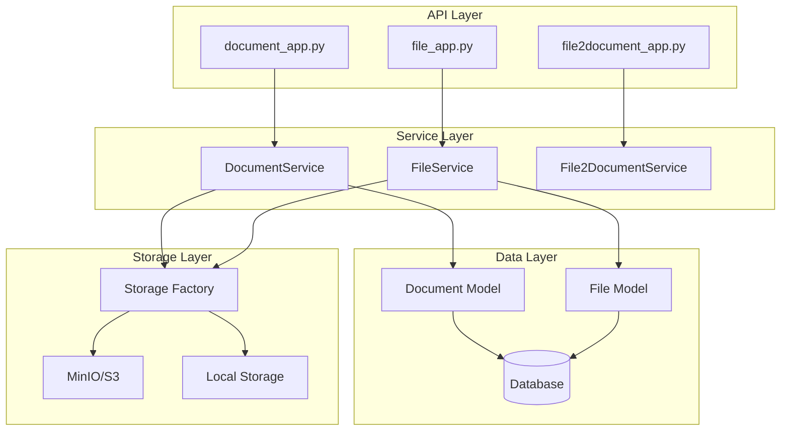
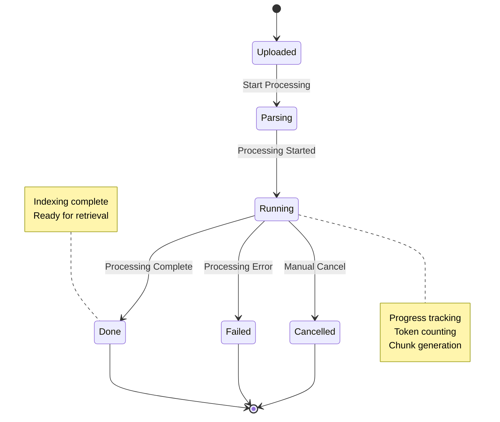

# Document API

<cite>
**Referenced Files in This Document**
- [document_app.py](file://api/apps/document_app.py)
- [file_app.py](file://api/apps/file_app.py)
- [file2document_app.py](file://api/apps/file2document_app.py)
- [db_models.py](file://api/db/db_models.py)
- [document_service.py](file://api/db/services/document_service.py)
- [file_service.py](file://api/db/services/file_service.py)
- [constants.py](file://api/constants.py)
- [common/constants.py](file://common/constants.py)
- [api/constants.py](file://api/constants.py)
- [file_types.py](file://common/data_source/file_types.py)
- [file_utils.py](file://api/utils/file_utils.py)
- [storage_factory.py](file://rag/utils/storage_factory.py)
- [minio_conn.py](file://rag/utils/minio_conn.py)
- [oss_conn.py](file://rag/utils/oss_conn.py)
</cite>

## Table of Contents
1. [Introduction](#introduction)
2. [API Architecture Overview](#api-architecture-overview)
3. [Document Lifecycle Management](#document-lifecycle-management)
4. [File Upload Endpoints](#file-upload-endpoints)
5. [Document Creation and Management](#document-creation-and-management)
6. [Status Tracking and Monitoring](#status-tracking-and-monitoring)
7. [Storage Integration](#storage-integration)
8. [Error Handling and Validation](#error-handling-and-validation)
9. [Examples and Usage Patterns](#examples-and-usage-patterns)
10. [Troubleshooting Guide](#troubleshooting-guide)

## Introduction

The RAGFlow Document API provides comprehensive document management capabilities for building knowledge bases and AI-powered applications. It supports multiple document formats, asynchronous processing workflows, and integrates with cloud storage solutions for scalable document handling.

The API consists of three main application modules:
- **document_app.py**: Core document lifecycle management
- **file_app.py**: File system operations and basic file management
- **file2document_app.py**: Association between files and documents

## API Architecture Overview

The document management system follows a layered architecture with clear separation of concerns:



**Diagram sources**
- [document_app.py](file://api/apps/document_app.py#L1-L50)
- [file_app.py](file://api/apps/file_app.py#L1-L50)
- [file2document_app.py](file://api/apps/file2document_app.py#L1-L50)
- [storage_factory.py](file://rag/utils/storage_factory.py#L1-L16)

**Section sources**
- [document_app.py](file://api/apps/document_app.py#L1-L719)
- [file_app.py](file://api/apps/file_app.py#L1-L454)
- [file2document_app.py](file://api/apps/file2document_app.py#L1-L133)

## Document Lifecycle Management

The document lifecycle encompasses creation, processing, status monitoring, and deletion phases:



### Document States and Status

The system tracks document processing states through the following status codes:

| Status Code | Description | Usage |
|-------------|-------------|-------|
| `0` | UNSTART | Document created but not processed |
| `1` | RUNNING | Currently being processed |
| `2` | CANCEL | Processing cancelled by user |
| `3` | DONE | Processing completed successfully |
| `4` | FAIL | Processing failed |

**Section sources**
- [common/constants.py](file://common/constants.py#L78-L88)
- [document_app.py](file://api/apps/document_app.py#L401-L446)

## File Upload Endpoints

### Basic File Upload

The primary endpoint for uploading documents supports multipart form data with file validation and type detection.

**Endpoint**: `POST /v1/document/upload`

**Request Headers**:
- `Content-Type: multipart/form-data`
- `Authorization: Bearer <token>`

**Form Parameters**:
- `file`: File object (required)
- `kb_id`: Knowledge base ID (required)

**Response**:
```json
{
  "code": 0,
  "message": "success",
  "data": [
    {
      "id": "doc_id_123",
      "name": "document.pdf",
      "size": 1048576,
      "type": "pdf",
      "status": "1",
      "run": "0",
      "progress": 0.0
    }
  ]
}
```

**Multipart Form Structure**:
```
Content-Disposition: form-data; name="file"; filename="document.pdf"
Content-Type: application/pdf

[File Binary Data]
```

### Web Crawl Endpoint

Automatically downloads and processes web content as PDF documents.

**Endpoint**: `POST /v1/document/web_crawl`

**Request Body**:
```json
{
  "kb_id": "knowledge_base_id",
  "name": "Web Page Title",
  "url": "https://example.com/page"
}
```

**Validation Rules**:
- URL must be valid and accessible
- File name length must not exceed 255 bytes
- Knowledge base must exist and be accessible

**Section sources**
- [document_app.py](file://api/apps/document_app.py#L50-L149)

## Document Creation and Management

### Virtual Document Creation

Create empty virtual documents for future content addition.

**Endpoint**: `POST /v1/document/create`

**Request Body**:
```json
{
  "name": "New Document",
  "kb_id": "knowledge_base_id"
}
```

**Response**:
```json
{
  "code": 0,
  "message": "success",
  "data": {
    "id": "doc_id_123",
    "name": "New Document",
    "type": "virtual",
    "size": 0,
    "status": "1"
  }
}
```

### Document Listing and Filtering

Retrieve documents with comprehensive filtering and pagination support.

**Endpoint**: `POST /v1/document/list`

**Query Parameters**:
- `kb_id`: Required knowledge base ID
- `page`: Page number (default: 0)
- `page_size`: Items per page (default: 0 for all)
- `orderby`: Sort field (default: create_time)
- `desc`: Descending order flag (default: true)

**Filter Parameters**:
```json
{
  "keywords": "search_term",
  "run_status": ["0", "1", "2", "3", "4"],
  "types": ["pdf", "doc", "visual", "aural"],
  "suffix": ["pdf", "docx", "png"]
}
```

**Response**:
```json
{
  "code": 0,
  "message": "success",
  "data": {
    "total": 10,
    "docs": [
      {
        "id": "doc_id_123",
        "name": "document.pdf",
        "size": 1048576,
        "type": "pdf",
        "status": "1",
        "run": "3",
        "progress": 100.0,
        "token_num": 1500,
        "chunk_num": 15
      }
    ]
  }
}
```

### Document Operations

#### Rename Document
**Endpoint**: `POST /v1/document/rename`

**Request Body**:
```json
{
  "doc_id": "document_id",
  "name": "renamed_document.pdf"
}
```

#### Change Parser Configuration
**Endpoint**: `POST /v1/document/change_parser`

**Request Body**:
```json
{
  "doc_id": "document_id",
  "parser_id": "paper",
  "parser_config": {
    "pages": [[1, 100]],
    "table_context_size": 2
  }
}
```

#### Set Metadata
**Endpoint**: `POST /v1/document/set_meta`

**Request Body**:
```json
{
  "doc_id": "document_id",
  "meta": "{\"author\": \"John Doe\", \"tags\": [\"important\", \"finance\"]}"
```

**Section sources**
- [document_app.py](file://api/apps/document_app.py#L152-L719)

## Status Tracking and Monitoring

### Processing Status Monitoring

Monitor document processing progress through status endpoints:

**Endpoint**: `POST /v1/document/run`

**Request Body**:
```json
{
  "doc_ids": ["doc_id_1", "doc_id_2"],
  "run": "1",  // Start processing
  "delete": false  // Clear previous data
}
```

**Processing Control**:
- `run=1`: Start processing
- `run=2`: Cancel processing
- `delete=true`: Clear previous processing data

### Status Polling Example

```javascript
// Start document processing
fetch('/v1/document/run', {
  method: 'POST',
  headers: {'Content-Type': 'application/json'},
  body: JSON.stringify({
    doc_ids: ['doc_id_123'],
    run: '1'
  })
})

// Poll for status updates
setInterval(async () => {
  const response = await fetch('/v1/document/list?kb_id=kb_id');
  const data = await response.json();
  
  const doc = data.docs.find(d => d.id === 'doc_id_123');
  console.log(`Progress: ${doc.progress}%`);
  
  if (doc.run === '3') {
    clearInterval(interval);
    console.log('Processing complete!');
  }
}, 1000);
```

**Section sources**
- [document_app.py](file://api/apps/document_app.py#L401-L446)

## Storage Integration

### Supported Storage Backends

The system supports multiple storage backends through a unified interface:

```mermaid
graph LR
SF[Storage Factory] --> MINIO[MinIO/S3]
SF --> AZURE[Azure Blob]
SF --> OSS[Alibaba Cloud OSS]
SF --> LOCAL[Local File System]
MINIO --> BUCKET1[Bucket: documents]
AZURE --> CONTAINER1[Container: uploads]
OSS --> BUCKET2[OSS Bucket]
LOCAL --> PATH1[/var/uploads]
```

**Diagram sources**
- [storage_factory.py](file://rag/utils/storage_factory.py#L1-L16)
- [minio_conn.py](file://rag/utils/minio_conn.py#L43-L81)
- [oss_conn.py](file://rag/utils/oss_conn.py#L70-L111)

### File Type Support

The system supports extensive document formats:

| Category | File Extensions | MIME Types | Parser Support |
|----------|----------------|------------|----------------|
| **PDF Documents** | `.pdf` | `application/pdf` | Full-text extraction |
| **Word Documents** | `.doc`, `.docx` | `application/msword`, `application/vnd.openxmlformats-officedocument.wordprocessingml.document` | Rich text parsing |
| **Presentation** | `.ppt`, `.pptx` | `application/vnd.ms-powerpoint`, `application/vnd.openxmlformats-officedocument.presentationml.presentation` | Slide content extraction |
| **Spreadsheets** | `.xls`, `.xlsx` | `application/vnd.ms-excel`, `application/vnd.openxmlformats-officedocument.spreadsheetml.sheet` | Table extraction |
| **Images** | `.jpg`, `.jpeg`, `.png`, `.gif`, `.bmp` | `image/*` | OCR processing |
| **Audio** | `.mp3`, `.wav`, `.flac` | `audio/*` | Speech-to-text |
| **Text/Markdown** | `.txt`, `.md`, `.json`, `.xml` | `text/*`, `application/json` | Plain text parsing |
| **Email** | `.eml`, `.msg` | `message/rfc822` | Email structure extraction |

### File Size Limits and Cleanup Policies

**Size Limits**:
- Maximum file name length: 255 bytes
- No explicit file size limit (controlled by storage backend)
- Rate limiting based on user tier

**Cleanup Policies**:
- Temporary files automatically cleaned up after processing
- Failed uploads removed from storage
- Archive older documents based on retention policy

**Section sources**
- [file_types.py](file://common/data_source/file_types.py#L1-L39)
- [file_utils.py](file://api/utils/file_utils.py#L40-L54)
- [constants.py](file://api/constants.py#L26-L26)

## Error Handling and Validation

### Common Error Responses

The API returns standardized error responses with appropriate HTTP status codes:

```json
{
  "code": 101,
  "message": "Lack of \"KB ID\"",
  "data": false
}
```

**Error Codes**:

| Code | Description | Common Causes |
|------|-------------|---------------|
| `101` | ARGUMENT_ERROR | Missing required parameters |
| `102` | DATA_ERROR | Invalid data format or constraints |
| `103` | OPERATING_ERROR | Permission or authorization issues |
| `108` | PERMISSION_ERROR | Insufficient privileges |
| `109` | AUTHENTICATION_ERROR | Invalid or expired credentials |
| `400` | BAD_REQUEST | Malformed request |
| `404` | NOT_FOUND | Resource not found |
| `500` | SERVER_ERROR | Internal server error |

### Validation Rules

**File Validation**:
- File name length ≤ 255 bytes
- File must not be empty
- Supported file extensions only
- Valid MIME type detection

**Knowledge Base Validation**:
- KB ID must exist
- User must have access permissions
- Team membership verification

**Document Validation**:
- Unique document names within KB
- Valid parser configuration
- Proper metadata format

**Section sources**
- [document_app.py](file://api/apps/document_app.py#L54-L83)
- [common/constants.py](file://common/constants.py#L41-L57)

## Examples and Usage Patterns

### Complete Document Upload Workflow

```javascript
// 1. Upload file to knowledge base
const formData = new FormData();
formData.append('file', file);
formData.append('kb_id', 'knowledge_base_id');

const uploadResponse = await fetch('/v1/document/upload', {
  method: 'POST',
  headers: {
    'Authorization': 'Bearer ' + token
  },
  body: formData
});

const uploadData = await uploadResponse.json();
const documentId = uploadData.data[0].id;

// 2. Start processing
await fetch('/v1/document/run', {
  method: 'POST',
  headers: {'Content-Type': 'application/json'},
  body: JSON.stringify({
    doc_ids: [documentId],
    run: '1'
  })
});

// 3. Monitor progress
let progress = 0;
while (progress < 100) {
  const listResponse = await fetch(`/v1/document/list?kb_id=knowledge_base_id`);
  const listData = await listResponse.json();
  
  const doc = listData.data.docs.find(d => d.id === documentId);
  progress = doc.progress;
  
  console.log(`Processing: ${progress}%`);
  await new Promise(resolve => setTimeout(resolve, 1000));
}

console.log('Document processing complete!');
```

### Associate File with Knowledge Base

```javascript
// Convert file to document and associate with KB
const response = await fetch('/v1/file2document/convert', {
  method: 'POST',
  headers: {'Content-Type': 'application/json'},
  body: JSON.stringify({
    file_ids: ['file_id_123'],
    kb_ids: ['knowledge_base_id']
  })
});

const result = await response.json();
console.log('Documents created:', result.data);
```

### Batch Document Management

```javascript
// Bulk operations example
const documentIds = ['doc1', 'doc2', 'doc3'];

// Update status for multiple documents
await fetch('/v1/document/change_status', {
  method: 'POST',
  headers: {'Content-Type': 'application/json'},
  body: JSON.stringify({
    doc_ids: documentIds,
    status: '1'  // Enable documents
  })
});

// Delete multiple documents
await fetch('/v1/document/rm', {
  method: 'POST',
  headers: {'Content-Type': 'application/json'},
  body: JSON.stringify({
    doc_id: documentIds
  })
});
```

## Troubleshooting Guide

### Common Issues and Solutions

#### File Upload Failures

**Problem**: "No file part!" error
**Cause**: Missing file in multipart form data
**Solution**: Ensure proper Content-Type header and file parameter name

```javascript
// Correct upload format
const formData = new FormData();
formData.append('file', file);  // Parameter name must be 'file'
formData.append('kb_id', kbId);
```

**Problem**: Unsupported file type
**Cause**: File extension not in supported list
**Solution**: Check supported file types in documentation

#### Processing Failures

**Problem**: Document processing stuck at 0%
**Cause**: Invalid parser configuration or unsupported content
**Solution**: Verify parser settings and file format compatibility

**Problem**: High memory usage during processing
**Cause**: Large documents or concurrent processing
**Solution**: Implement batch processing and monitor resource usage

#### Storage Issues

**Problem**: Files not persisting after upload
**Cause**: Storage backend connectivity issues
**Solution**: Check storage configuration and network connectivity

**Problem**: Slow file downloads
**Cause**: Large file sizes or network latency
**Solution**: Implement streaming downloads and optimize storage configuration

### Debugging Tips

1. **Enable Logging**: Set appropriate log levels for detailed error information
2. **Monitor Progress**: Use status endpoints to track processing stages
3. **Validate Inputs**: Ensure all required parameters are present and valid
4. **Check Permissions**: Verify user access to knowledge base and storage
5. **Test Connectivity**: Validate storage backend connections

**Section sources**
- [document_app.py](file://api/apps/document_app.py#L54-L83)
- [file_app.py](file://api/apps/file_app.py#L42-L119)