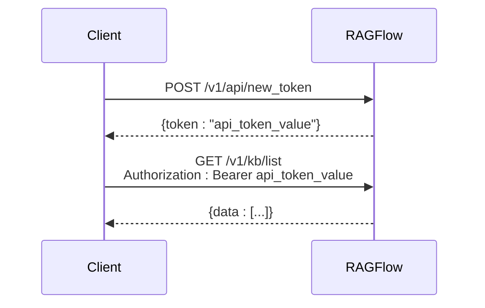
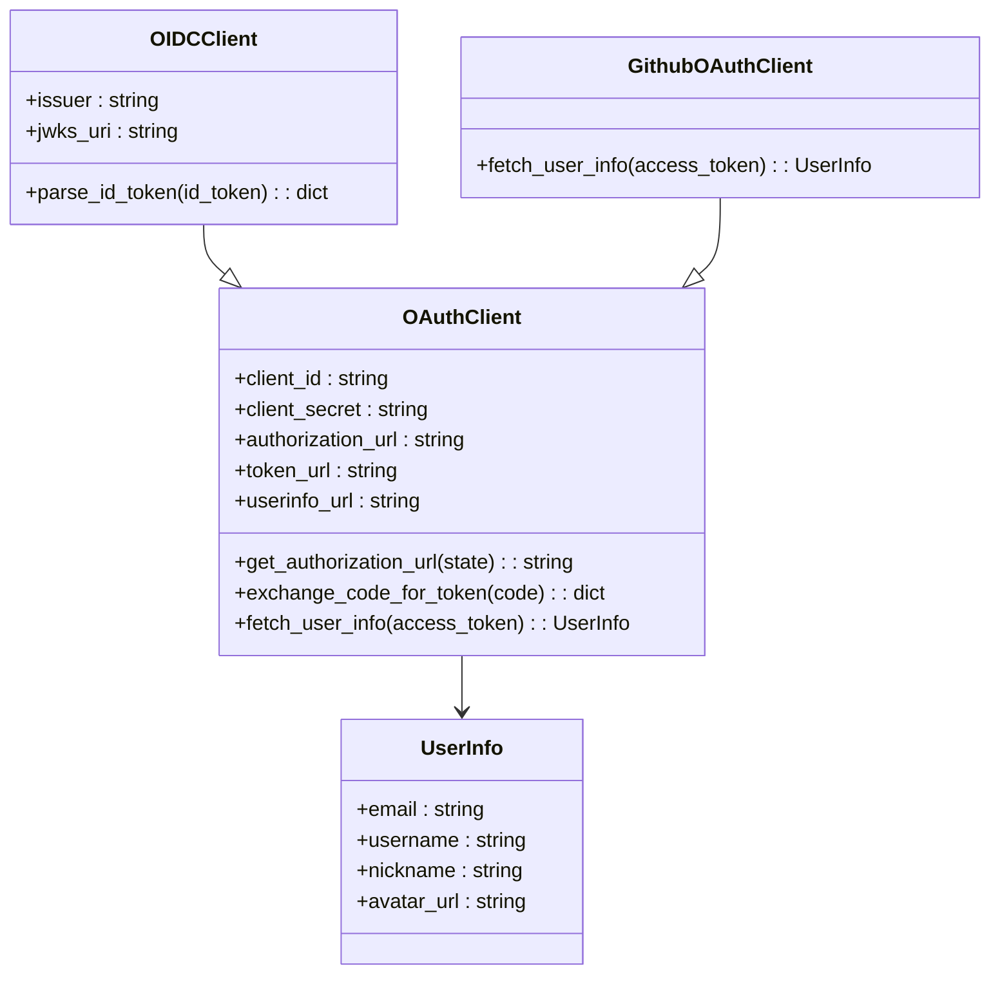
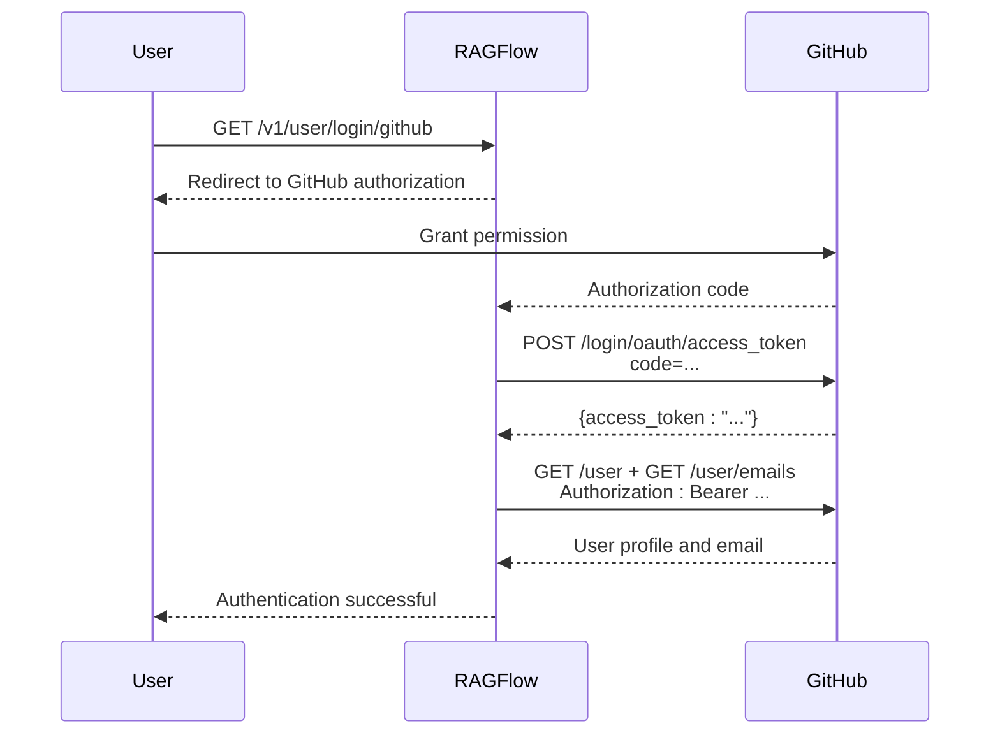

# HTTP API Reference

<cite>
**Referenced Files in This Document**   
- [api_app.py](file://api/apps/api_app.py)
- [kb_app.py](file://api/apps/kb_app.py)
- [document_app.py](file://api/apps/document_app.py)
- [chunk_app.py](file://api/apps/chunk_app.py)
- [conversation_app.py](file://api/apps/conversation_app.py)
- [search_app.py](file://api/apps/search_app.py)
- [user_app.py](file://api/apps/user_app.py)
- [system_app.py](file://api/apps/system_app.py)
- [oauth.py](file://api/apps/auth/oauth.py)
- [oidc.py](file://api/apps/auth/oidc.py)
- [github.py](file://api/apps/auth/github.py)
- [chat.py](file://api/apps/sdk/chat.py)
- [doc.py](file://api/apps/sdk/doc.py)
- [api_utils.py](file://api/utils/api_utils.py)
</cite>

## Table of Contents
1. [Introduction](#introduction)
2. [Authentication](#authentication)
3. [Knowledge Base Management](#knowledge-base-management)
4. [Document Management](#document-management)
5. [Chunk Management](#chunk-management)
6. [Conversation Management](#conversation-management)
7. [Chat Assistant Management](#chat-assistant-management)
8. [Search Application Management](#search-application-management)
9. [User Management](#user-management)
10. [System Information](#system-information)
11. [Error Handling](#error-handling)
12. [Client Implementation Guidelines](#client-implementation-guidelines)

## Introduction
RAGFlow provides a comprehensive HTTP API for managing knowledge bases, documents, chunks, conversations, and chat assistants. This API enables programmatic access to all core RAGFlow functionalities, allowing integration with external systems and custom applications. The API follows RESTful principles with JSON request and response payloads, and supports various authentication methods including API tokens, OAuth, OIDC, and GitHub integration.

The API is organized into several endpoint groups, each corresponding to a specific functional area:
- **Knowledge Base**: Create, update, list, and delete knowledge bases (datasets)
- **Document**: Upload, manage, and process documents within knowledge bases
- **Chunk**: Retrieve, create, update, and delete text chunks from documents
- **Conversation**: Manage chat conversations with AI assistants
- **Chat Assistant**: Create and manage AI chat assistants with custom configurations
- **Search Application**: Manage search applications for AI search functionality
- **User**: Handle user authentication, registration, and profile management
- **System**: Retrieve system status, version, and configuration information

All endpoints require authentication, with most endpoints requiring either API token authentication or session-based authentication. The API supports rate limiting and provides comprehensive error handling with standardized error codes.

**Section sources**
- [api_app.py](file://api/apps/api_app.py#L1-L118)
- [api_utils.py](file://api/utils/api_utils.py#L1-L704)

## Authentication
RAGFlow supports multiple authentication methods to secure API access, including API tokens, OAuth 2.0, OpenID Connect (OIDC), and GitHub integration.

### API Token Authentication
API tokens provide a simple and secure way to authenticate API requests. Tokens can be generated through the API and used in the Authorization header.



**Diagram sources**
- [api_app.py](file://api/apps/api_app.py#L26-L53)
- [system_app.py](file://api/apps/system_app.py#L185-L233)

### OAuth 2.0 and OIDC
RAGFlow supports OAuth 2.0 and OpenID Connect for federated authentication. The system can integrate with various identity providers through a pluggable authentication client architecture.



**Diagram sources**
- [oauth.py](file://api/apps/auth/oauth.py#L21-L152)
- [oidc.py](file://api/apps/auth/oidc.py#L22-L108)
- [github.py](file://api/apps/auth/github.py#L21-L89)

### GitHub Integration
GitHub authentication is supported as a specific implementation of OAuth 2.0, allowing users to sign in with their GitHub accounts.



**Diagram sources**
- [user_app.py](file://api/apps/user_app.py#L269-L355)
- [github.py](file://api/apps/auth/github.py#L21-L89)

### Authentication Endpoints
The following endpoints are available for authentication:

| Endpoint | Method | Description |
|---------|--------|-------------|
| `/v1/user/login` | POST | Authenticate with email and password |
| `/v1/user/login/channels` | GET | Get list of supported authentication channels |
| `/v1/user/login/<channel>` | GET | Initiate OAuth/OIDC login for specified channel |
| `/v1/user/oauth/callback/<channel>` | GET | Handle OAuth/OIDC callback |
| `/v1/user/github_callback` | GET | Handle GitHub OAuth callback (deprecated) |
| `/v1/user/feishu_callback` | GET | Handle Feishu OAuth callback |
| `/v1/user/logout` | GET | Log out current user |

**Section sources**
- [user_app.py](file://api/apps/user_app.py#L64-L486)
- [oauth.py](file://api/apps/auth/oauth.py#L21-L152)
- [oidc.py](file://api/apps/auth/oidc.py#L22-L108)
- [github.py](file://api/apps/auth/github.py#L21-L89)

## Knowledge Base Management
The knowledge base endpoints allow you to create, update, list, and delete knowledge bases (referred to as datasets in the SDK API).

### Create Knowledge Base
Creates a new knowledge base with the specified name and configuration.

**Endpoint**: `POST /v1/kb/create`  
**Authentication**: Session-based (login_required)  
**Request Body**:
```json
{
  "name": "My Knowledge Base",
  "parser_id": "naive",
  "parser_config": {
    "chunk_token_num": 512,
    "delimiter": "\n"
  }
}
```

**Response**:
```json
{
  "code": 0,
  "message": "success",
  "data": {
    "kb_id": "kb_12345"
  }
}
```

**Section sources**
- [kb_app.py](file://api/apps/kb_app.py#L47-L67)

### Update Knowledge Base
Updates an existing knowledge base with new configuration.

**Endpoint**: `POST /v1/kb/update`  
**Authentication**: Session-based (login_required)  
**Request Body**:
```json
{
  "kb_id": "kb_12345",
  "name": "Updated Knowledge Base",
  "description": "Updated description",
  "parser_id": "qa"
}
```

**Response**:
```json
{
  "code": 0,
  "message": "success",
  "data": {
    "id": "kb_12345",
    "name": "Updated Knowledge Base",
    "description": "Updated description",
    "parser_id": "qa",
    "tenant_id": "tenant_123",
    "create_time": 1700000000000,
    "create_date": "2023-11-15 10:00:00"
  }
}
```

**Section sources**
- [kb_app.py](file://api/apps/kb_app.py#L70-L137)

### List Knowledge Bases
Retrieves a list of knowledge bases with filtering and pagination.

**Endpoint**: `POST /v1/kb/list`  
**Authentication**: Session-based (login_required)  
**Query Parameters**:
- `keywords`: Filter by name (partial match)
- `page`: Page number (default: 0)
- `page_size`: Items per page (default: 0, no pagination)
- `orderby`: Field to order by (default: "create_time")
- `desc`: Sort in descending order (default: true)

**Request Body**:
```json
{
  "owner_ids": ["tenant_123"]
}
```

**Response**:
```json
{
  "code": 0,
  "message": "success",
  "data": {
    "kbs": [
      {
        "id": "kb_12345",
        "name": "My Knowledge Base",
        "description": "",
        "parser_id": "naive",
        "parser_config": {
          "chunk_token_num": 512,
          "delimiter": "\n"
        },
        "tenant_id": "tenant_123",
        "create_time": 1700000000000,
        "create_date": "2023-11-15 10:00:00",
        "size": 10240
      }
    ],
    "total": 1
  }
}
```

**Section sources**
- [kb_app.py](file://api/apps/kb_app.py#L171-L203)

### Knowledge Base Details
Retrieves detailed information about a specific knowledge base.

**Endpoint**: `GET /v1/kb/detail`  
**Authentication**: Session-based (login_required)  
**Query Parameters**:
- `kb_id`: Knowledge base ID

**Response**:
```json
{
  "code": 0,
  "message": "success",
  "data": {
    "id": "kb_12345",
    "name": "My Knowledge Base",
    "description": "",
    "parser_id": "naive",
    "parser_config": {
      "chunk_token_num": 512,
      "delimiter": "\n"
    },
    "tenant_id": "tenant_123",
    "create_time": 1700000000000,
    "create_date": "2023-11-15 10:00:00",
    "size": 10240,
    "connectors": []
  }
}
```

**Section sources**
- [kb_app.py](file://api/apps/kb_app.py#L142-L167)

### Delete Knowledge Base
Deletes a knowledge base and all associated documents and chunks.

**Endpoint**: `POST /v1/kb/rm`  
**Authentication**: Session-based (login_required)  
**Request Body**:
```json
{
  "kb_id": "kb_12345"
}
```

**Response**:
```json
{
  "code": 0,
  "message": "success",
  "data": true
}
```

**Section sources**
- [kb_app.py](file://api/apps/kb_app.py#L208-L246)

## Document Management
The document endpoints allow you to upload, manage, and process documents within knowledge bases.

### Upload Document
Uploads a document to a knowledge base.

**Endpoint**: `POST /v1/document/upload`  
**Authentication**: Session-based (login_required)  
**Form Data**:
- `kb_id`: Knowledge base ID
- `file`: File to upload

**Response**:
```json
{
  "code": 0,
  "message": "success",
  "data": [
    {
      "id": "doc_12345",
      "kb_id": "kb_12345",
      "name": "document.pdf",
      "type": "pdf",
      "size": 10240,
      "token_num": 0,
      "chunk_num": 0,
      "progress": 0,
      "progress_msg": "",
      "run": "UNSTART",
      "status": "1",
      "parser_id": "naive",
      "parser_config": {
        "chunk_token_num": 512,
        "delimiter": "\n"
      },
      "create_time": 1700000000000,
      "create_date": "2023-11-15 10:00:00"
    }
  ]
}
```

**Section sources**
- [document_app.py](file://api/apps/document_app.py#L50-L83)

### Web Crawl
Creates a document by crawling a web page.

**Endpoint**: `POST /v1/document/web_crawl`  
**Authentication**: Session-based (login_required)  
**Form Data**:
- `kb_id`: Knowledge base ID
- `name`: Document name
- `url`: URL to crawl

**Response**:
```json
{
  "code": 0,
  "message": "success",
  "data": true
}
```

**Section sources**
- [document_app.py](file://api/apps/document_app.py#L86-L149)

### List Documents
Retrieves a list of documents in a knowledge base with filtering and pagination.

**Endpoint**: `POST /v1/document/list`  
**Authentication**: Session-based (login_required)  
**Query Parameters**:
- `kb_id`: Knowledge base ID
- `keywords`: Filter by name (partial match)
- `page`: Page number (default: 0)
- `page_size`: Items per page (default: 0, no pagination)
- `orderby`: Field to order by (default: "create_time")
- `desc`: Sort in descending order (default: true)
- `create_time_from`: Filter by creation time (Unix timestamp)
- `create_time_to`: Filter by creation time (Unix timestamp)

**Request Body**:
```json
{
  "run_status": ["0", "1", "2", "3", "4"],
  "types": ["pdf", "txt", "docx"],
  "suffix": ["pdf", "txt"]
}
```

**Response**:
```json
{
  "code": 0,
  "message": "success",
  "data": {
    "total": 1,
    "docs": [
      {
        "id": "doc_12345",
        "kb_id": "kb_12345",
        "name": "document.pdf",
        "type": "pdf",
        "size": 10240,
        "token_num": 0,
        "chunk_num": 0,
        "progress": 0,
        "progress_msg": "",
        "run": "UNSTART",
        "status": "1",
        "parser_id": "naive",
        "parser_config": {
          "chunk_token_num": 512,
          "delimiter": "\n"
        },
        "create_time": 1700000000000,
        "create_date": "2023-11-15 10:00:00"
      }
    ]
  }
}
```

**Section sources**
- [document_app.py](file://api/apps/document_app.py#L209-L267)

### Update Document Status
Changes the processing status of one or more documents.

**Endpoint**: `POST /v1/document/change_status`  
**Authentication**: Session-based (login_required)  
**Request Body**:
```json
{
  "doc_ids": ["doc_12345"],
  "status": "1"
}
```

**Response**:
```json
{
  "code": 0,
  "message": "success",
  "data": {
    "doc_12345": {
      "status": "1"
    }
  }
}
```

**Section sources**
- [document_app.py](file://api/apps/document_app.py#L340-L377)

### Run Document Processing
Starts or stops document processing (chunking and embedding).

**Endpoint**: `POST /v1/document/run`  
**Authentication**: Session-based (login_required)  
**Request Body**:
```json
{
  "doc_ids": ["doc_12345"],
  "run": "1",
  "delete": false
}
```

**Response**:
```json
{
  "code": 0,
  "message": "success",
  "data": true
}
```

**Section sources**
- [document_app.py](file://api/apps/document_app.py#L401-L444)

### Rename Document
Renames a document.

**Endpoint**: `POST /v1/document/rename`  
**Authentication**: Session-based (login_required)  
**Request Body**:
```json
{
  "doc_id": "doc_12345",
  "name": "new_name.pdf"
}
```

**Response**:
```json
{
  "code": 0,
  "message": "success",
  "data": true
}
```

**Section sources**
- [document_app.py](file://api/apps/document_app.py#L448-L492)

### Change Document Parser
Changes the parser configuration for a document.

**Endpoint**: `POST /v1/document/change_parser`  
**Authentication**: Session-based (login_required)  
**Request Body**:
```json
{
  "doc_id": "doc_12345",
  "parser_id": "qa",
  "parser_config": {
    "questions": ["What is this document about?"]
  }
}
```

**Response**:
```json
{
  "code": 0,
  "message": "success",
  "data": true
}
```

**Section sources**
- [document_app.py](file://api/apps/document_app.py#L537-L587)

### Delete Document
Deletes one or more documents from a knowledge base.

**Endpoint**: `POST /v1/document/rm`  
**Authentication**: Session-based (login_required)  
**Request Body**:
```json
{
  "doc_id": "doc_12345"
}
```

**Response**:
```json
{
  "code": 0,
  "message": "success",
  "data": true
}
```

**Section sources**
- [document_app.py](file://api/apps/document_app.py#L380-L398)

## Chunk Management
The chunk endpoints allow you to retrieve, create, update, and delete text chunks from documents.

### List Chunks
Retrieves a list of chunks from a document with filtering and pagination.

**Endpoint**: `POST /v1/chunk/list`  
**Authentication**: Session-based (login_required)  
**Request Body**:
```json
{
  "doc_id": "doc_12345",
  "page": 1,
  "size": 30,
  "keywords": "search term",
  "available_int": 1
}
```

**Response**:
```json
{
  "code": 0,
  "message": "success",
  "data": {
    "total": 5,
    "chunks": [
      {
        "chunk_id": "chunk_12345",
        "content_with_weight": "This is a sample chunk.",
        "doc_id": "doc_12345",
        "docnm_kwd": "document.pdf",
        "important_kwd": [],
        "question_kwd": [],
        "image_id": "",
        "available_int": 1,
        "positions": [[0, 10, 20, 30, 40]]
      }
    ],
    "doc": {
      "id": "doc_12345",
      "kb_id": "kb_12345",
      "name": "document.pdf",
      "type": "pdf",
      "size": 10240,
      "token_num": 500,
      "chunk_num": 5,
      "progress": 1,
      "progress_msg": "",
      "run": "DONE",
      "status": "1",
      "parser_id": "naive",
      "parser_config": {
        "chunk_token_num": 512,
        "delimiter": "\n"
      },
      "create_time": 1700000000000,
      "create_date": "2023-11-15 10:00:00"
    }
  }
}
```

**Section sources**
- [chunk_app.py](file://api/apps/chunk_app.py#L41-L83)

### Get Chunk
Retrieves a specific chunk by ID.

**Endpoint**: `GET /v1/chunk/get`  
**Authentication**: Session-based (login_required)  
**Query Parameters**:
- `chunk_id`: Chunk ID

**Response**:
```json
{
  "code": 0,
  "message": "success",
  "data": {
    "id": "chunk_12345",
    "content_with_weight": "This is a sample chunk.",
    "doc_id": "doc_12345",
    "kb_id": ["kb_12345"],
    "docnm_kwd": "document.pdf",
    "title_tks": ["document", "pdf"],
    "content_ltks": ["this", "is", "a", "sample", "chunk"],
    "content_sm_ltks": ["this", "is", "a", "sample", "chunk"],
    "q_384_vec": [0.1, 0.2, ..., 0.3],
    "create_time": "2023-11-15 10:00:00",
    "create_timestamp_flt": 1700000000.0
  }
}
```

**Section sources**
- [chunk_app.py](file://api/apps/chunk_app.py#L90-L115)

### Update Chunk
Updates a chunk's content and metadata.

**Endpoint**: `POST /v1/chunk/set`  
**Authentication**: Session-based (login_required)  
**Request Body**:
```json
{
  "doc_id": "doc_12345",
  "chunk_id": "chunk_12345",
  "content_with_weight": "Updated chunk content.",
  "important_kwd": ["important"],
  "question_kwd": ["What is this?"],
  "available_int": 1
}
```

**Response**:
```json
{
  "code": 0,
  "message": "success",
  "data": true
}
```

**Section sources**
- [chunk_app.py](file://api/apps/chunk_app.py#L122-L175)

### Toggle Chunk Availability
Enables or disables one or more chunks.

**Endpoint**: `POST /v1/chunk/switch`  
**Authentication**: Session-based (login_required)  
**Request Body**:
```json
{
  "doc_id": "doc_12345",
  "chunk_ids": ["chunk_12345"],
  "available_int": 0
}
```

**Response**:
```json
{
  "code": 0,
  "message": "success",
  "data": true
}
```

**Section sources**
- [chunk_app.py](file://api/apps/chunk_app.py#L179-L195)

### Delete Chunks
Deletes one or more chunks.

**Endpoint**: `POST /v1/chunk/rm`  
**Authentication**: Session-based (login_required)  
**Request Body**:
```json
{
  "doc_id": "doc_12345",
  "chunk_ids": ["chunk_12345"]
}
```

**Response**:
```json
{
  "code": 0,
  "message": "success",
  "data": true
}
```

**Section sources**
- [chunk_app.py](file://api/apps/chunk_app.py#L199-L219)

### Create Chunk
Creates a new chunk in a document.

**Endpoint**: `POST /v1/chunk/create`  
**Authentication**: Session-based (login_required)  
**Request Body**:
```json
{
  "doc_id": "doc_12345",
  "content_with_weight": "New chunk content.",
  "important_kwd": ["important"],
  "question_kwd": ["What is this?"]
}
```

**Response**:
```json
{
  "code": 0,
  "message": "success",
  "data": {
    "chunk_id": "chunk_67890"
  }
}
```

**Section sources**
- [chunk_app.py](file://api/apps/chunk_app.py#L223-L277)

### Retrieval Test
Tests retrieval of chunks from a knowledge base.

**Endpoint**: `POST /v1/chunk/retrieval_test`  
**Authentication**: Session-based (login_required)  
**Request Body**:
```json
{
  "kb_id": "kb_12345",
  "question": "What is this document about?",
  "page": 1,
  "size": 30,
  "similarity_threshold": 0.3,
  "vector_similarity_weight": 0.3,
  "top_k": 1024,
  "rerank_id": "BAAI/bge-reranker-v2-m3",
  "highlight": true
}
```

**Response**:
```json
{
  "code": 0,
  "message": "success",
  "data": {
    "total": 5,
    "chunks": [
      {
        "id": "chunk_12345",
        "content_with_weight": "This is a sample chunk.",
        "doc_id": "doc_12345",
        "kb_id": ["kb_12345"],
        "docnm_kwd": "document.pdf",
        "title_tks": ["document", "pdf"],
        "content_ltks": ["this", "is", "a", "sample", "chunk"],
        "content_sm_ltks": ["this", "is", "a", "sample", "chunk"],
        "q_384_vec": [0.1, 0.2, ..., 0.3],
        "similarity": 0.95,
        "vector_similarity": 0.9,
        "keywords_similarity": 0.8,
        "content_ltks": ["this", "is", "a", "sample", "chunk"],
        "content_sm_ltks": ["this", "is", "a", "sample", "chunk"],
        "create_time": "2023-11-15 10:00:00",
        "create_timestamp_flt": 1700000000.0
      }
    ],
    "doc_aggs": [],
    "labels": []
  }
}
```

**Section sources**
- [chunk_app.py](file://api/apps/chunk_app.py#L281-L375)

## Conversation Management
The conversation endpoints allow you to manage chat conversations with AI assistants.

### Create Conversation
Creates a new conversation with an AI assistant.

**Endpoint**: `POST /v1/conversation/set`  
**Authentication**: Session-based (login_required)  
**Request Body**:
```json
{
  "conversation_id": "conv_12345",
  "is_new": true,
  "name": "New Conversation",
  "dialog_id": "dialog_12345"
}
```

**Response**:
```json
{
  "code": 0,
  "message": "success",
  "data": {
    "id": "conv_12345",
    "dialog_id": "dialog_12345",
    "name": "New Conversation",
    "message": [
      {
        "role": "assistant",
        "content": "Hi! I'm your assistant. What can I do for you?"
      }
    ],
    "reference": [],
    "user_id": "user_123",
    "create_time": 1700000000000,
    "create_date": "2023-11-15 10:00:00"
  }
}
```

**Section sources**
- [conversation_app.py](file://api/apps/conversation_app.py#L37-L77)

### Update Conversation
Updates an existing conversation.

**Endpoint**: `POST /v1/conversation/set`  
**Authentication**: Session-based (login_required)  
**Request Body**:
```json
{
  "conversation_id": "conv_12345",
  "is_new": false,
  "name": "Updated Conversation"
}
```

**Response**:
```json
{
  "code": 0,
  "message": "success",
  "data": {
    "id": "conv_12345",
    "dialog_id": "dialog_12345",
    "name": "Updated Conversation",
    "message": [
      {
        "role": "assistant",
        "content": "Hi! I'm your assistant. What can I do for you?"
      }
    ],
    "reference": [],
    "user_id": "user_123",
    "create_time": 1700000000000,
    "create_date": "2023-11-15 10:00:00"
  }
}
```

**Section sources**
- [conversation_app.py](file://api/apps/conversation_app.py#L37-L77)

### Get Conversation
Retrieves a specific conversation.

**Endpoint**: `GET /v1/conversation/get`  
**Authentication**: Session-based (login_required)  
**Query Parameters**:
- `conversation_id`: Conversation ID

**Response**:
```json
{
  "code": 0,
  "message": "success",
  "data": {
    "id": "conv_12345",
    "dialog_id": "dialog_12345",
    "name": "Updated Conversation",
    "message": [
      {
        "role": "assistant",
        "content": "Hi! I'm your assistant. What can I do for you?"
      }
    ],
    "reference": [],
    "user_id": "user_123",
    "create_time": 1700000000000,
    "create_date": "2023-11-15 10:00:00",
    "avatar": "icon_url"
  }
}
```

**Section sources**
- [conversation_app.py](file://api/apps/conversation_app.py#L81-L106)

### List Conversations
Retrieves a list of conversations for a specific dialog.

**Endpoint**: `GET /v1/conversation/list`  
**Authentication**: Session-based (login_required)  
**Query Parameters**:
- `dialog_id`: Dialog ID

**Response**:
```json
{
  "code": 0,
  "message": "success",
  "data": [
    {
      "id": "conv_12345",
      "dialog_id": "dialog_12345",
      "name": "Updated Conversation",
      "message": [
        {
          "role": "assistant",
          "content": "Hi! I'm your assistant. What can I do for you?"
        }
      ],
      "reference": [],
      "user_id": "user_123",
      "create_time": 1700000000000,
      "create_date": "2023-11-15 10:00:00"
    }
  ]
}
```

**Section sources**
- [conversation_app.py](file://api/apps/conversation_app.py#L153-L164)

### Delete Conversations
Deletes one or more conversations.

**Endpoint**: `POST /v1/conversation/rm`  
**Authentication**: Session-based (login_required)  
**Request Body**:
```json
{
  "conversation_ids": ["conv_12345"]
}
```

**Response**:
```json
{
  "code": 0,
  "message": "success",
  "data": true
}
```

**Section sources**
- [conversation_app.py](file://api/apps/conversation_app.py#L131-L149)

### Chat Completion
Sends a message to an AI assistant and receives a response.

**Endpoint**: `POST /v1/conversation/completion`  
**Authentication**: Session-based (login_required)  
**Request Body**:
```json
{
  "conversation_id": "conv_12345",
  "messages": [
    {
      "role": "user",
      "content": "Hello, how are you?"
    }
  ],
  "stream": true
}
```

**Response (Streaming)**:
```json
data:{"code":0,"message":"","data":{"answer":"I'm doing well, thank you for asking! How can I help you today?","reference":[],"message_id":"msg_12345"}}
data:{"code":0,"message":"","data":true}
```

**Response (Non-streaming)**:
```json
{
  "code": 0,
  "message": "success",
  "data": {
    "answer": "I'm doing well, thank you for asking! How can I help you today?",
    "reference": [],
    "message_id": "msg_12345"
  }
}
```

**Section sources**
- [conversation_app.py](file://api/apps/conversation_app.py#L168-L252)

### Delete Message
Deletes a message from a conversation.

**Endpoint**: `POST /v1/conversation/delete_msg`  
**Authentication**: Session-based (login_required)  
**Request Body**:
```json
{
  "conversation_id": "conv_12345",
  "message_id": "msg_12345"
}
```

**Response**:
```json
{
  "code": 0,
  "message": "success",
  "data": {
    "id": "conv_12345",
    "dialog_id": "dialog_12345",
    "name": "Updated Conversation",
    "message": [
      {
        "role": "assistant",
        "content": "Hi! I'm your assistant. What can I do for you?"
      }
    ],
    "reference": [],
    "user_id": "user_123",
    "create_time": 1700000000000,
    "create_date": "2023-11-15 10:00:00"
  }
}
```

**Section sources**
- [conversation_app.py](file://api/apps/conversation_app.py#L344-L364)

### Feedback
Provides feedback on an assistant's response.

**Endpoint**: `POST /v1/conversation/thumbup`  
**Authentication**: Session-based (login_required)  
**Request Body**:
```json
{
  "conversation_id": "conv_12345",
  "message_id": "msg_12345",
  "thumbup": true,
  "feedback": "Great response!"
}
```

**Response**:
```json
{
  "code": 0,
  "message": "success",
  "data": {
    "id": "conv_12345",
    "dialog_id": "dialog_12345",
    "name": "Updated Conversation",
    "message": [
      {
        "role": "assistant",
        "content": "I'm doing well, thank you for asking! How can I help you today?",
        "thumbup": true
      }
    ],
    "reference": [],
    "user_id": "user_123",
    "create_time": 1700000000000,
    "create_date": "2023-11-15 10:00:00"
  }
}
```

**Section sources**
- [conversation_app.py](file://api/apps/conversation_app.py#L367-L391)

### Ask Question
Asks a question about content in one or more knowledge bases.

**Endpoint**: `POST /v1/conversation/ask`  
**Authentication**: Session-based (login_required)  
**Request Body**:
```json
{
  "question": "What is this document about?",
  "kb_ids": ["kb_12345"],
  "search_id": "search_12345"
}
```

**Response (Streaming)**:
```json
data:{"code":0,"message":"","data":{"answer":"This document is about...","reference":[]}}
data:{"code":0,"message":"","data":true}
```

**Section sources**
- [conversation_app.py](file://api/apps/conversation_app.py#L394-L423)

### Generate Mind Map
Generates a mind map for a question about content in knowledge bases.

**Endpoint**: `POST /v1/conversation/mindmap`  
**Authentication**: Session-based (login_required)  
**Request Body**:
```json
{
  "question": "What are the main topics in this document?",
  "kb_ids": ["kb_12345"],
  "search_id": "search_12345"
}
```

**Response**:
```json
{
  "code": 0,
  "message": "success",
  "data": {
    "id": "root",
    "label": "Main Topics",
    "children": [
      {
        "id": "topic_1",
        "label": "Topic 1",
        "children": []
      }
    ]
  }
}
```

**Section sources**
- [conversation_app.py](file://api/apps/conversation_app.py#L426-L441)

### Get Related Questions
Generates related questions for a given question.

**Endpoint**: `POST /v1/conversation/related_questions`  
**Authentication**: Session-based (login_required)  
**Request Body**:
```json
{
  "question": "What is this document about?",
  "search_id": "search_12345"
}
```

**Response**:
```json
{
  "code": 0,
  "message": "success",
  "data": [
    "What are the main points in this document?",
    "Who is the author of this document?",
    "When was this document created?"
  ]
}
```

**Section sources**
- [conversation_app.py](file://api/apps/conversation_app.py#L444-L479)

## Chat Assistant Management
The chat assistant endpoints (SDK API) allow you to create, update, list, and delete AI chat assistants.

### Create Chat Assistant
Creates a new chat assistant with custom configuration.

**Endpoint**: `POST /v1/dify-retrieval/chats`  
**Authentication**: API token (token_required)  
**Request Body**:
```json
{
  "name": "My Assistant",
  "description": "A helpful assistant",
  "avatar": "https://example.com/avatar.png",
  "llm": {
    "model_name": "gpt-3.5-turbo",
    "temperature": 0.7,
    "top_p": 0.9
  },
  "prompt": {
    "system": "You are an intelligent assistant...",
    "opener": "Hi! I'm your assistant. What can I do for you?",
    "variables": [
      {
        "key": "knowledge",
        "optional": false
      }
    ],
    "show_quote": true,
    "refine_multiturn": true
  },
  "dataset_ids": ["kb_12345"]
}
```

**Response**:
```json
{
  "code": 0,
  "message": "success",
  "data": {
    "id": "dialog_12345",
    "name": "My Assistant",
    "description": "A helpful assistant",
    "avatar": "https://example.com/avatar.png",
    "llm": {
      "model_name": "gpt-3.5-turbo",
      "temperature": 0.7,
      "top_p": 0.9,
      "frequency_penalty": 0,
      "presence_penalty": 0,
      "max_tokens": 2048
    },
    "prompt": {
      "system": "You are an intelligent assistant...",
      "opener": "Hi! I'm your assistant. What can I do for you?",
      "variables": [
        {
          "key": "knowledge",
          "optional": false
        }
      ],
      "show_quote": true,
      "refine_multiturn": true,
      "empty_response": "Sorry! No relevant content was found in the knowledge base!",
      "tts": false
    },
    "dataset_ids": ["kb_12345"],
    "similarity_threshold": 0.2,
    "keywords_similarity_weight": 0.7,
    "top_n": 6,
    "rerank_model": ""
  }
}
```

**Section sources**
- [chat.py](file://api/apps/sdk/chat.py#L27-L141)

### Update Chat Assistant
Updates an existing chat assistant.

**Endpoint**: `PUT /v1/dify-retrieval/chats/<chat_id>`  
**Authentication**: API token (token_required)  
**Request Body**:
```json
{
  "name": "Updated Assistant",
  "description": "An updated helpful assistant",
  "llm": {
    "model_name": "gpt-4",
    "temperature": 0.5
  },
  "prompt": {
    "system": "You are an updated intelligent assistant...",
    "opener": "Hi! I'm your updated assistant. What can I do for you?",
    "show_quotation": false
  },
  "dataset_ids": ["kb_12345", "kb_67890"]
}
```

**Response**:
```json
{
  "code": 0,
  "message": "success"
}
```

**Section sources**
- [chat.py](file://api/apps/sdk/chat.py#L144-L224)

### List Chat Assistants
Retrieves a list of chat assistants with filtering and pagination.

**Endpoint**: `GET /v1/dify-retrieval/chats`  
**Authentication**: API token (token_required)  
**Query Parameters**:
- `id`: Filter by assistant ID
- `name`: Filter by assistant name
- `page`: Page number (default: 1)
- `page_size`: Items per page (default: 30)
- `orderby`: Field to order by (default: "create_time")
- `desc`: Sort in descending order (default: true)

**Response**:
```json
{
  "code": 0,
  "message": "success",
  "data": [
    {
      "id": "dialog_12345",
      "name": "My Assistant",
      "description": "A helpful assistant",
      "avatar": "https://example.com/avatar.png",
      "llm": {
        "model_name": "gpt-3.5-turbo",
        "temperature": 0.7,
        "top_p": 0.9,
        "frequency_penalty": 0,
        "presence_penalty": 0,
        "max_tokens": 2048
      },
      "prompt": {
        "system": "You are an intelligent assistant...",
        "opener": "Hi! I'm your assistant. What can I do for you?",
        "variables": [
          {
            "key": "knowledge",
            "optional": false
          }
        ],
        "show_quote": true,
        "refine_multiturn": true,
        "empty_response": "Sorry! No relevant content was found in the knowledge base!",
        "tts": false
      },
      "dataset_ids": ["kb_12345"],
      "similarity_threshold": 0.2,
      "keywords_similarity_weight": 0.7,
      "top_n": 6,
      "rerank_model": "",
      "create_time": 1700000000000,
      "update_time": 1700000000000
    }
  ]
}
```

**Section sources**
- [chat.py](file://api/apps/sdk/chat.py#L270-L324)

### Delete Chat Assistants
Deletes one or more chat assistants.

**Endpoint**: `DELETE /v1/dify-retrieval/chats`  
**Authentication**: API token (token_required)  
**Request Body**:
```json
{
  "ids": ["dialog_12345"]
}
```

**Response**:
```json
{
  "code": 0,
  "message": "success"
}
```

**Section sources**
- [chat.py](file://api/apps/sdk/chat.py#L227-L267)

## Search Application Management
The search application endpoints allow you to create, update, list, and delete search applications for AI search functionality.

### Create Search Application
Creates a new search application.

**Endpoint**: `POST /v1/search_app/create`  
**Authentication**: Session-based (login_required)  
**Request Body**:
```json
{
  "name": "My Search App",
  "description": "A search application",
  "search_config": {
    "kb_ids": ["kb_12345"],
    "llm_id": "gpt-3.5-turbo",
    "rerank_id": "BAAI/bge-reranker-v2-m3",
    "top_k": 1024,
    "top_n": 6,
    "similarity_threshold": 0.2,
    "vector_similarity_weight": 0.3
  }
}
```

**Response**:
```json
{
  "code": 0,
  "message": "success",
  "data": {
    "search_id": "search_12345"
  }
}
```

**Section sources**
- [search_app.py](file://api/apps/search_app.py#L30-L59)

### Update Search Application
Updates an existing search application.

**Endpoint**: `POST /v1/search_app/update`  
**Authentication**: Session-based (login_required)  
**Request Body**:
```json
{
  "search_id": "search_12345",
  "name": "Updated Search App",
  "description": "An updated search application",
  "search_config": {
    "kb_ids": ["kb_12345", "kb_67890"],
    "llm_id": "gpt-4"
  }
}
```

**Response**:
```json
{
  "code": 0,
  "message": "success",
  "data": {
    "id": "search_12345",
    "name": "Updated Search App",
    "description": "An updated search application",
    "tenant_id": "tenant_123",
    "created_by": "user_123",
    "create_time": 1700000000000,
    "create_date": "2023-11-15 10:00:00",
    "search_config": {
      "kb_ids": ["kb_12345", "kb_67890"],
      "llm_id": "gpt-4",
      "rerank_id": "BAAI/bge-reranker-v2-m3",
      "top_k": 1024,
      "top_n": 6,
      "similarity_threshold": 0.2,
      "vector_similarity_weight": 0.3
    }
  }
}
```

**Section sources**
- [search_app.py](file://api/apps/search_app.py#L64-L115)

### Get Search Application Details
Retrieves detailed information about a search application.

**Endpoint**: `GET /v1/search_app/detail`  
**Authentication**: Session-based (login_required)  
**Query Parameters**:
- `search_id`: Search application ID

**Response**:
```json
{
  "code": 0,
  "message": "success",
  "data": {
    "id": "search_12345",
    "name": "Updated Search App",
    "description": "An updated search application",
    "tenant_id": "tenant_123",
    "created_by": "user_123",
    "create_time": 1700000000000,
    "create_date": "2023-11-15 10:00:00",
    "search_config": {
      "kb_ids": ["kb_12345", "kb_67890"],
      "llm_id": "gpt-4",
      "rerank_id": "BAAI/bge-reranker-v2-m3",
      "top_k": 1024,
      "top_n": 6,
      "similarity_threshold": 0.2,
      "vector_similarity_weight": 0.3
    }
  }
}
```

**Section sources**
- [search_app.py](file://api/apps/search_app.py#L121-L137)

### List Search Applications
Retrieves a list of search applications with filtering and pagination.

**Endpoint**: `POST /v1/search_app/list`  
**Authentication**: Session-based (login_required)  
**Query Parameters**:
- `keywords`: Filter by name (partial match)
- `page`: Page number (default: 0)
- `page_size`: Items per page (default: 0, no pagination)
- `orderby`: Field to order by (default: "create_time")
- `desc`: Sort in descending order (default: true)

**Request Body**:
```json
{
  "owner_ids": ["tenant_123"]
}
```

**Response**:
```json
{
  "code": 0,
  "message": "success",
  "data": {
    "search_apps": [
      {
        "id": "search_12345",
        "name": "Updated Search App",
        "description": "An updated search application",
        "tenant_id": "tenant_123",
        "created_by": "user_123",
        "create_time": 1700000000000,
        "create_date": "2023-11-15 10:00:00"
      }
    ],
    "total": 1
  }
}
```

**Section sources**
- [search_app.py](file://api/apps/search_app.py#L141-L168)

### Delete Search Application
Deletes a search application.

**Endpoint**: `POST /v1/search_app/rm`  
**Authentication**: Session-based (login_required)  
**Request Body**:
```json
{
  "search_id": "search_12345"
}
```

**Response**:
```json
{
  "code": 0,
  "message": "success",
  "data": true
}
```

**Section sources**
- [search_app.py](file://api/apps/search_app.py#L173-L187)

## User Management
The user endpoints allow you to handle user authentication, registration, and profile management.

### User Login
Authenticates a user with email and password.

**Endpoint**: `POST /v1/user/login`  
**Request Body**:
```json
{
  "email": "user@example.com",
  "password": "encrypted_password"
}
```

**Response**:
```json
{
  "code": 0,
  "message": "Welcome back!",
  "data": {
    "id": "user_123",
    "email": "user@example.com",
    "nickname": "User",
    "avatar": "",
    "login_channel": "password",
    "last_login_time": "2023-11-15 10:00:00",
    "is_superuser": false,
    "access_token": "access_token_value",
    "create_time": 1700000000000,
    "create_date": "2023-11-15 10:00:00"
  }
}
```

**Section sources**
- [user_app.py](file://api/apps/user_app.py#L64-L137)

### Get Login Channels
Retrieves a list of supported authentication channels.

**Endpoint**: `GET /v1/user/login/channels`  
**Response**:
```json
{
  "code": 0,
  "message": "success",
  "data": [
    {
      "channel": "github",
      "display_name": "GitHub",
      "icon": "sso"
    },
    {
      "channel": "feishu",
      "display_name": "Feishu",
      "icon": "sso"
    }
  ]
}
```

**Section sources**
- [user_app.py](file://api/apps/user_app.py#L140-L158)

### User Registration
Registers a new user.

**Endpoint**: `POST /v1/user/register`  
**Request Body**:
```json
{
  "nickname": "New User",
  "email": "newuser@example.com",
  "password": "encrypted_password"
}
```

**Response**:
```json
{
  "code": 0,
  "message": "New User, welcome aboard!",
  "data": {
    "id": "user_456",
    "email": "newuser@example.com",
    "nickname": "New User",
    "avatar": "",
    "login_channel": "password",
    "last_login_time": "2023-11-15 10:00:00",
    "is_superuser": false,
    "access_token": "access_token_value",
    "create_time": 1700000000000,
    "create_date": "2023-11-15 10:00:00"
  }
}
```

**Section sources**
- [user_app.py](file://api/apps/user_app.py#L667-L758)

### Get User Profile
Retrieves the current user's profile information.

**Endpoint**: `GET /v1/user/info`  
**Authentication**: Session-based (login_required)  
**Response**:
```json
{
  "code": 0,
  "message": "success",
  "data": {
    "id": "user_123",
    "email": "user@example.com",
    "nickname": "User",
    "avatar": "",
    "login_channel": "password",
    "last_login_time": "2023-11-15 10:00:00",
    "is_superuser": false,
    "access_token": "access_token_value",
    "create_time": 1700000000000,
    "create_date": "2023-11-15 10:00:00"
  }
}
```

**Section sources**
- [user_app.py](file://api/apps/user_app.py#L576-L602)

### Update User Settings
Updates the current user's settings.

**Endpoint**: `POST /v1/user/setting`  
**Authentication**: Session-based (login_required)  
**Request Body**:
```json
{
  "nickname": "Updated User",
  "avatar": "https://example.com/new_avatar.png"
}
```

**Response**:
```json
{
  "code": 0,
  "message": "success",
  "data": true
}
```

**Section sources**
- [user_app.py](file://api/apps/user_app.py#L508-L574)

### Get Tenant Information
Retrieves information about the current user's tenant.

**Endpoint**: `GET /v1/user/tenant_info`  
**Authentication**: Session-based (login_required)  
**Response**:
```json
{
  "code": 0,
  "message": "success",
  "data": {
    "id": "tenant_123",
    "name": "User's Kingdom",
    "llm_id": "gpt-3.5-turbo",
    "embd_id": "BAAI/bge-large-en",
    "asr_id": "openai/whisper-1",
    "parser_ids": "naive,qa,table",
    "img2txt_id": "nlpconnect/vit-gpt2-image-captioning",
    "rerank_id": "BAAI/bge-reranker-v2-m3",
    "create_time": 1700000000000,
    "create_date": "2023-11-15 10:00:00"
  }
}
```

**Section sources**
- [user_app.py](file://api/apps/user_app.py#L761-L796)

### User Logout
Logs out the current user.

**Endpoint**: `GET /v1/user/logout`  
**Authentication**: Session-based (login_required)  
**Response**:
```json
{
  "code": 0,
  "message": "success",
  "data": true
}
```

**Section sources**
- [user_app.py](file://api/apps/user_app.py#L486-L505)

## System Information
The system endpoints provide information about the RAGFlow system status, version, and configuration.

### Get Version
Retrieves the current version of RAGFlow.

**Endpoint**: `GET /v1/system/version`  
**Authentication**: Session-based (login_required)  
**Response**:
```json
{
  "code": 0,
  "message": "success",
  "data": "1.0.0"
}
```

**Section sources**
- [system_app.py](file://api/apps/system_app.py#L42-L62)

### Get System Status
Retrieves the current status of the RAGFlow system components.

**Endpoint**: `GET /v1/system/status`  
**Authentication**: Session-based (login_required)  
**Response**:
```json
{
  "code": 0,
  "message": "success",
  "data": {
    "doc_engine": {
      "type": "elasticsearch",
      "status": "green",
      "elapsed": "15.2"
    },
    "storage": {
      "storage": "minio",
      "status": "green",
      "elapsed": "5.1"
    },
    "database": {
      "database": "mysql",
      "status": "green",
      "elapsed": "8.3"
    },
    "redis": {
      "status": "green",
      "elapsed": "2.1"
    },
    "task_executor_heartbeats": {}
  }
}
```

**Section sources**
- [system_app.py](file://api/apps/system_app.py#L65-L171)

### Health Check
Performs a health check on the RAGFlow system.

**Endpoint**: `GET /v1/system/healthz`  
**Response**:
```json
{
  "status": "healthy",
  "checks": {
    "database": {
      "status": "healthy"
    },
    "storage": {
      "status": "healthy"
    },
    "doc_engine": {
      "status": "healthy"
    },
    "redis": {
      "status": "healthy"
    }
  }
}
```

**Section sources**
- [system_app.py](file://api/apps/system_app.py#L174-L177)

### Ping
Simple endpoint to check if the server is responsive.

**Endpoint**: `GET /v1/system/ping`  
**Response**: `pong`

**Section sources**
- [system_app.py](file://api/apps/system_app.py#L180-L182)

### Get System Configuration
Retrieves system configuration settings.

**Endpoint**: `GET /v1/system/config`  
**Response**:
```json
{
  "code": 0,
  "message": "success",
  "data": {
    "registerEnabled": 1
  }
}
```

**Section sources**
- [system_app.py](file://api/apps/system_app.py#L316-L335)

## Error Handling
RAGFlow provides comprehensive error handling with standardized error codes and messages.

### Error Response Format
All error responses follow the same format:
```json
{
  "code": 100,
  "message": "Error description"
}
```

### Error Codes
The following error codes are used throughout the API:

| Code | Name | Description |
|------|------|-------------|
| 0 | SUCCESS | Operation completed successfully |
| 1 | ARGUMENT_ERROR | Invalid or missing arguments |
| 2 | DATA_ERROR | Data-related error (missing, invalid, etc.) |
| 3 | AUTHENTICATION_ERROR | Authentication failed |
| 4 | PERMISSION_ERROR | Insufficient permissions |
| 5 | OPERATING_ERROR | Operation failed |
| 6 | SERVER_ERROR | Internal server error |
| 7 | EXCEPTION_ERROR | Unhandled exception occurred |
| 8 | FORBIDDEN | Access forbidden |
| 9 | UNAUTHORIZED | Unauthorized access |

**Section sources**
- [api_utils.py](file://api/utils/api_utils.py#L33-L34)
- [common/constants.py](file://common/constants.py)

## Client Implementation Guidelines
When implementing clients for the RAGFlow API, consider the following guidelines:

### Authentication Best Practices
- Use API tokens for programmatic access
- Store tokens securely and never expose them in client-side code
- Implement token refresh mechanisms for long-running applications
- Use HTTPS for all API requests

### Rate Limiting
The API may implement rate limiting to prevent abuse. Clients should:
- Implement exponential backoff for retrying failed requests
- Monitor response headers for rate limit information
- Cache responses when appropriate to reduce API calls

### Error Handling
Implement robust error handling:
- Check the `code` field in all responses
- Handle specific error codes appropriately
- Provide meaningful error messages to users
- Implement retry logic for transient errors

### Performance Optimization
- Use pagination for large result sets
- Filter results on the server side when possible
- Batch operations when supported
- Cache frequently accessed data

### Security Considerations
- Validate all input data
- Sanitize output to prevent XSS attacks
- Use secure connections (HTTPS)
- Implement proper access control
- Regularly update dependencies

**Section sources**
- [api_utils.py](file://api/utils/api_utils.py#L1-L704)
- [common/constants.py](file://common/constants.py)