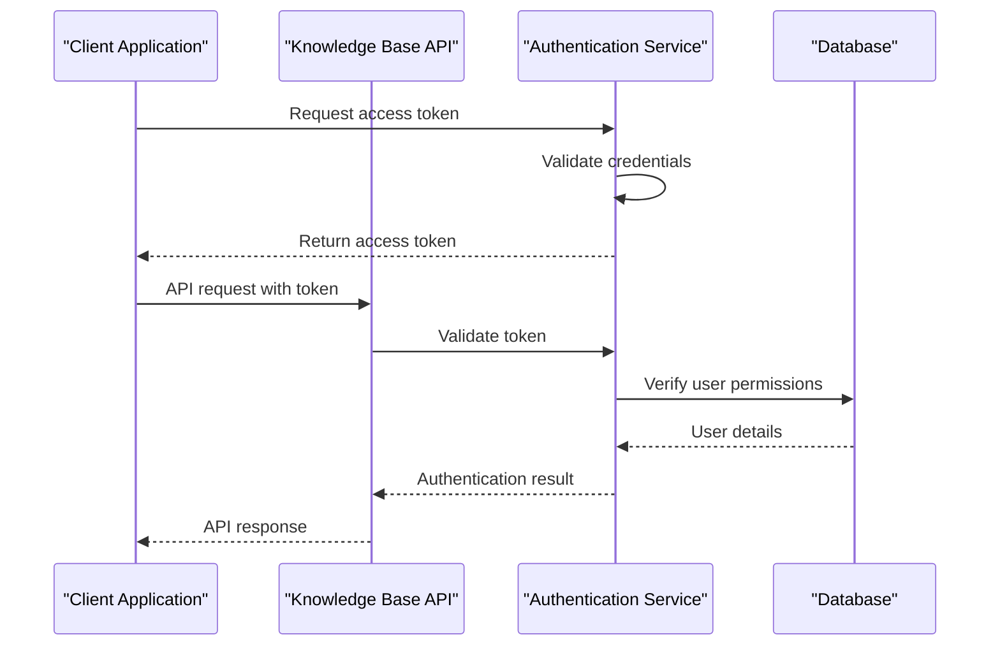
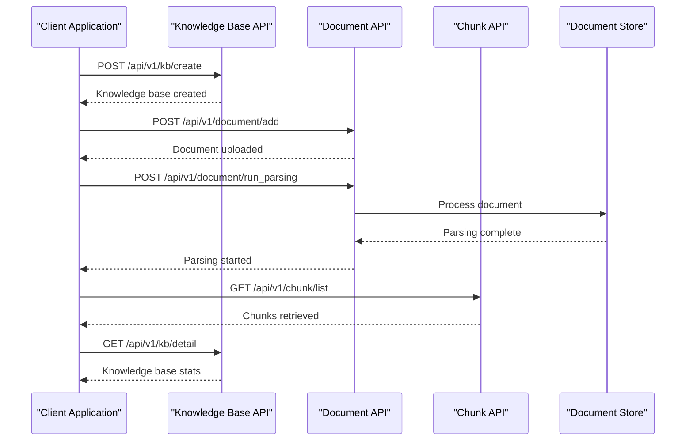
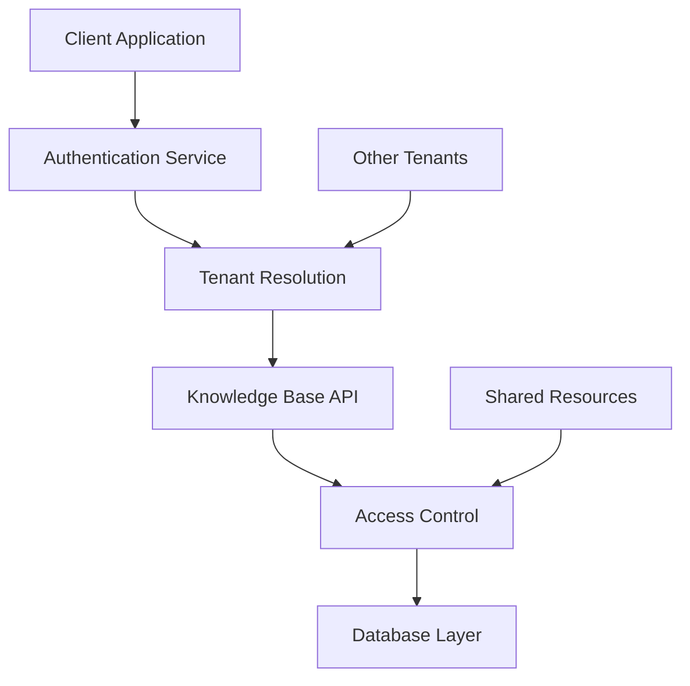

# Knowledge Base API

<cite>
**Referenced Files in This Document**
- [kb_app.py](file://api/apps/kb_app.py)
- [knowledgebase_service.py](file://api/db/services/knowledgebase_service.py)
- [api_utils.py](file://api/utils/api_utils.py)
- [db_models.py](file://api/db/db_models.py)
- [constants.py](file://api/constants.py)
- [chunk_app.py](file://api/apps/chunk_app.py)
- [auth.py](file://admin/server/auth.py)
- [oidc.py](file://api/apps/auth/oidc.py)
- [oauth.py](file://api/apps/auth/oauth.py)
- [test_create_kb.py](file://test/testcases/test_web_api/test_kb_app/test_create_kb.py)
- [test_update_kb.py](file://test/testcases/test_web_api/test_kb_app/test_update_kb.py)
</cite>

## Table of Contents
1. [Introduction](#introduction)
2. [Authentication and Authorization](#authentication-and-authorization)
3. [API Endpoints Overview](#api-endpoints-overview)
4. [Knowledge Base Creation](#knowledge-base-creation)
5. [Knowledge Base Retrieval](#knowledge-base-retrieval)
6. [Knowledge Base Updates](#knowledge-base-updates)
7. [Knowledge Base Deletion](#knowledge-base-deletion)
8. [Tag Management](#tag-management)
9. [Knowledge Graph Operations](#knowledge-graph-operations)
10. [Pipeline Logs Management](#pipeline-logs-management)
11. [Task Management](#task-management)
12. [Error Codes and Responses](#error-codes-and-responses)
13. [Integration Patterns](#integration-patterns)
14. [Performance Considerations](#performance-considerations)
15. [Security Considerations](#security-considerations)

## Introduction

The Knowledge Base API provides comprehensive functionality for managing knowledge bases within the RAGFlow system. Knowledge bases serve as containers for organizing documents, managing parsing configurations, and enabling efficient retrieval-augmented generation (RAG) workflows. This API supports full CRUD operations, advanced configuration options, and integration with document processing pipelines.

The API follows RESTful principles and provides both synchronous and asynchronous operations for optimal performance. All endpoints require authentication and implement role-based access control to ensure secure multi-tenant operations.

## Authentication and Authorization

### Authentication Methods

The Knowledge Base API supports multiple authentication mechanisms:

#### OAuth/OIDC Tokens
```http
Authorization: Bearer <access_token>
```

#### API Tokens
```http
Authorization: <api_token>
```

### Authentication Flow



**Diagram sources**
- [auth.py](file://admin/server/auth.py#L34-L66)
- [oidc.py](file://api/apps/auth/oidc.py#L35-L72)
- [oauth.py](file://api/apps/auth/oauth.py#L39-L80)

### Access Control

The system implements tenant-based access control where:
- **Owner**: Users who created the knowledge base
- **Team Members**: Users in the same tenant with appropriate permissions
- **Public Access**: Configurable public sharing settings

**Section sources**
- [auth.py](file://admin/server/auth.py#L114-L149)
- [api_utils.py](file://api/utils/api_utils.py#L197-L200)

## API Endpoints Overview

The Knowledge Base API provides the following main endpoints organized by functionality:

```mermaid
graph TD
A[Knowledge Base API] --> B[CRUD Operations]
A --> C[Configuration Management]
A --> D[Tag Operations]
A --> E[Graph Operations]
A --> F[Task Management]
A --> G[Log Management]
B --> B1[Create /api/v1/kb/create]
B --> B2[Retrieve /api/v1/kb/detail]
B --> B3[Update /api/v1/kb/update]
B --> B4[Delete /api/v1/kb/rm]
C --> C1[List /api/v1/kb/list]
C --> C2[Basic Info /api/v1/kb/basic_info]
C --> C3[Metadata /api/v1/kb/get_meta]
D --> D1[List Tags /api/v1/kb/{kb_id}/tags]
D --> D2[Remove Tags /api/v1/kb/{kb_id}/rm_tags]
D --> D3[Rename Tags /api/v1/kb/{kb_id}/rename_tag]
E --> E1[Knowledge Graph /api/v1/kb/{kb_id}/knowledge_graph]
E --> E2[Delete Graph /api/v1/kb/{kb_id}/knowledge_graph]
F --> F1[Run GraphRAG /api/v1/kb/run_graphrag]
F --> F2[Trace GraphRAG /api/v1/kb/trace_graphrag]
F --> F3[Run RAPTOR /api/v1/kb/run_raptor]
F --> F4[Trace RAPTOR /api/v1/kb/trace_raptor]
F --> F5[Run MindMap /api/v1/kb/run_mindmap]
F --> F6[Trace MindMap /api/v1/kb/trace_mindmap]
F --> F7[Unbind Task /api/v1/kb/unbind_task]
G --> G1[List Logs /api/v1/kb/list_pipeline_logs]
G --> G2[List Dataset Logs /api/v1/kb/list_pipeline_dataset_logs]
G --> G3[Delete Logs /api/v1/kb/delete_pipeline_logs]
G --> G4[Log Detail /api/v1/kb/pipeline_log_detail]
```

**Diagram sources**
- [kb_app.py](file://api/apps/kb_app.py#L47-L927)

## Knowledge Base Creation

### Endpoint: POST /api/v1/kb/create

Creates a new knowledge base with specified configuration.

#### Request Schema

| Parameter | Type | Required | Description |
|-----------|------|----------|-------------|
| name | string | Yes | Unique name for the knowledge base (1-128 characters) |
| description | string | No | Brief description of the knowledge base |
| parser_id | string | No | Document parsing strategy (default: "naive") |
| embd_id | string | No | Embedding model identifier |
| language | string | No | Content language (ISO code) |
| permission | string | No | Access permission level ("me" or "team") |
| avatar | string | No | Base64 encoded avatar image |
| parser_config | object | No | Advanced parsing configuration |

#### Parser Configuration Options

| Parameter | Type | Range | Description |
|-----------|------|-------|-------------|
| chunk_token_num | integer | 1-100000000 | Maximum tokens per chunk |
| delimiter | string | Any string | Text delimiter for chunking |
| auto_keywords | integer | 0-32 | Automatic keyword extraction count |
| auto_questions | integer | 0-10 | Automatic question generation count |
| filename_embd_weight | float | 0.0-1.0 | Weight for filename embeddings |
| pages | array | Array of page ranges | Specific pages to process |
| graphrag | object | Nested configuration | GraphRAG processing options |
| raptor | object | Nested configuration | RAPTOR processing options |

#### Example Request

```json
{
  "name": "Customer Support Knowledge Base",
  "description": "Contains customer service documentation and FAQs",
  "parser_id": "manual",
  "language": "en",
  "permission": "team",
  "parser_config": {
    "chunk_token_num": 512,
    "auto_keywords": 8,
    "auto_questions": 3,
    "filename_embd_weight": 0.3,
    "graphrag": {
      "use_graphrag": true,
      "method": "general"
    },
    "raptor": {
      "use_raptor": true,
      "max_token": 1024,
      "threshold": 0.7
    }
  }
}
```

#### Response Schema

```json
{
  "code": 0,
  "message": "success",
  "data": {
    "kb_id": "uuid-string"
  }
}
```

**Section sources**
- [kb_app.py](file://api/apps/kb_app.py#L47-L68)
- [knowledgebase_service.py](file://api/db/services/knowledgebase_service.py#L374-L429)

## Knowledge Base Retrieval

### Endpoint: GET /api/v1/kb/detail

Retrieves detailed information about a specific knowledge base.

#### Query Parameters

| Parameter | Type | Required | Description |
|-----------|------|----------|-------------|
| kb_id | string | Yes | Unique identifier of the knowledge base |

#### Response Schema

```json
{
  "code": 0,
  "message": "success",
  "data": {
    "id": "uuid-string",
    "name": "string",
    "description": "string",
    "tenant_id": "uuid-string",
    "created_by": "uuid-string",
    "create_time": 1234567890,
    "update_time": 1234567890,
    "doc_num": 0,
    "token_num": 0,
    "chunk_num": 0,
    "parser_id": "string",
    "embd_id": "string",
    "language": "string",
    "permission": "string",
    "avatar": "string",
    "parser_config": {},
    "pagerank": 0,
    "size": 0,
    "connectors": [],
    "graphrag_task_id": "uuid-string",
    "raptor_task_id": "uuid-string",
    "mindmap_task_id": "uuid-string",
    "graphrag_task_finish_at": "datetime-string",
    "raptor_task_finish_at": "datetime-string",
    "mindmap_task_finish_at": "datetime-string"
  }
}
```

### Endpoint: POST /api/v1/kb/list

Lists knowledge bases with filtering and pagination.

#### Request Body

```json
{
  "owner_ids": ["uuid1", "uuid2"],
  "page": 1,
  "page_size": 20,
  "orderby": "create_time",
  "desc": true,
  "keywords": "search term",
  "parser_id": "naive"
}
```

#### Response Schema

```json
{
  "code": 0,
  "message": "success",
  "data": {
    "kbs": [
      {
        "id": "uuid-string",
        "name": "string",
        "description": "string",
        "tenant_id": "uuid-string",
        "permission": "string",
        "doc_num": 0,
        "token_num": 0,
        "chunk_num": 0,
        "parser_id": "string",
        "embd_id": "string",
        "language": "string",
        "avatar": "string",
        "create_time": 1234567890,
        "update_time": 1234567890
      }
    ],
    "total": 1
  }
}
```

**Section sources**
- [kb_app.py](file://api/apps/kb_app.py#L142-L206)

## Knowledge Base Updates

### Endpoint: POST /api/v1/kb/update

Updates an existing knowledge base configuration.

#### Request Schema

| Parameter | Type | Required | Description |
|-----------|------|----------|-------------|
| kb_id | string | Yes | Knowledge base identifier |
| name | string | Yes | Updated name |
| description | string | Yes | Updated description |
| parser_id | string | Yes | Updated parser configuration |
| connectors | array | No | Associated data connectors |
| Additional parameters | various | No | Other configurable fields |

#### Supported Parameters

| Parameter | Type | Description |
|-----------|------|-------------|
| name | string | Unique knowledge base name |
| description | string | Brief description |
| parser_id | string | Document parsing strategy |
| embd_id | string | Embedding model identifier |
| language | string | Content language |
| permission | string | Access permission level |
| avatar | string | Base64 encoded avatar |
| parser_config | object | Advanced configuration |
| pagerank | integer | PageRank scoring weight |
| connectors | array | Connected data sources |

#### Example Request

```json
{
  "kb_id": "uuid-string",
  "name": "Updated Customer Support KB",
  "description": "Enhanced customer service documentation",
  "parser_id": "manual",
  "embd_id": "BAAI/bge-small-en-v1.5@Builtin",
  "parser_config": {
    "chunk_token_num": 1024,
    "auto_keywords": 12,
    "graphrag": {
      "use_graphrag": true,
      "method": "light"
    }
  },
  "pagerank": 50
}
```

#### Response Schema

```json
{
  "code": 0,
  "message": "success",
  "data": {
    // Complete knowledge base object with updates applied
  }
}
```

**Section sources**
- [kb_app.py](file://api/apps/kb_app.py#L70-L139)
- [knowledgebase_service.py](file://api/db/services/knowledgebase_service.py#L295-L322)

## Knowledge Base Deletion

### Endpoint: POST /api/v1/kb/rm

Permanently deletes a knowledge base and all associated data.

#### Request Schema

| Parameter | Type | Required | Description |
|-----------|------|----------|-------------|
| kb_id | string | Yes | Identifier of knowledge base to delete |

#### Security Considerations

- Only the knowledge base owner can delete it
- All associated documents, chunks, and metadata are permanently removed
- Indexes and storage buckets are cleaned up automatically

#### Response Schema

```json
{
  "code": 0,
  "message": "success",
  "data": true
}
```

**Section sources**
- [kb_app.py](file://api/apps/kb_app.py#L208-L247)

## Tag Management

### List Tags for Knowledge Base

#### Endpoint: GET /api/v1/kb/{kb_id}/tags

Retrieves all tags associated with a knowledge base.

#### Response Schema

```json
{
  "code": 0,
  "message": "success",
  "data": [
    {
      "tag": "customer_service",
      "count": 15
    },
    {
      "tag": "technical_support",
      "count": 8
    }
  ]
}
```

### Remove Tags

#### Endpoint: POST /api/v1/kb/{kb_id}/rm_tags

Removes specified tags from a knowledge base.

#### Request Schema

```json
{
  "tags": ["deprecated_tag", "old_format"]
}
```

### Rename Tags

#### Endpoint: POST /api/v1/kb/{kb_id}/rename_tag

Renames a tag within a knowledge base.

#### Request Schema

```json
{
  "from_tag": "old_tag_name",
  "to_tag": "new_tag_name"
}
```

**Section sources**
- [kb_app.py](file://api/apps/kb_app.py#L250-L323)

## Knowledge Graph Operations

### Retrieve Knowledge Graph

#### Endpoint: GET /api/v1/kb/{kb_id}/knowledge_graph

Fetches the knowledge graph visualization for a knowledge base.

#### Response Schema

```json
{
  "code": 0,
  "message": "success",
  "data": {
    "graph": {
      "nodes": [
        {
          "id": "node1",
          "label": "Entity Name",
          "pagerank": 0.15,
          "size": 10
        }
      ],
      "edges": [
        {
          "source": "node1",
          "target": "node2",
          "weight": 0.8
        }
      ]
    },
    "mind_map": {}
  }
}
```

### Delete Knowledge Graph

#### Endpoint: DELETE /api/v1/kb/{kb_id}/knowledge_graph

Removes the knowledge graph data from a knowledge base.

#### Response Schema

```json
{
  "code": 0,
  "message": "success",
  "data": true
}
```

**Section sources**
- [kb_app.py](file://api/apps/kb_app.py#L325-L378)

## Pipeline Logs Management

### List Pipeline Logs

#### Endpoint: POST /api/v1/kb/list_pipeline_logs

Retrieves processing logs for a knowledge base.

#### Request Body

```json
{
  "operation_status": ["SUCCESS", "FAIL"],
  "types": ["pdf", "docx"],
  "suffix": [".pdf", ".docx"]
}
```

#### Query Parameters

| Parameter | Type | Description |
|-----------|------|-------------|
| kb_id | string | Required knowledge base ID |
| page | integer | Page number (default: 0) |
| page_size | integer | Items per page (default: 0) |
| orderby | string | Sort field (default: "create_time") |
| desc | boolean | Descending order (default: true) |
| keywords | string | Search keywords |
| create_date_from | string | Start date filter |
| create_date_to | string | End date filter |

#### Response Schema

```json
{
  "code": 0,
  "message": "success",
  "data": {
    "total": 100,
    "logs": [
      {
        "id": "uuid-string",
        "doc_id": "uuid-string",
        "task_type": "PARSING",
        "progress": 1.0,
        "progress_msg": "Processing completed",
        "create_time": 1234567890,
        "update_time": 1234567890
      }
    ]
  }
}
```

### List Dataset Logs

#### Endpoint: POST /api/v1/kb/list_pipeline_dataset_logs

Similar to pipeline logs but focused on dataset-level operations.

### Delete Logs

#### Endpoint: POST /api/v1/kb/delete_pipeline_logs

Removes specified pipeline logs.

#### Request Schema

```json
{
  "log_ids": ["log1", "log2", "log3"]
}
```

### Log Detail

#### Endpoint: GET /api/v1/kb/pipeline_log_detail

Retrieves detailed information about a specific pipeline log.

#### Query Parameters

| Parameter | Type | Required | Description |
|-----------|------|----------|-------------|
| log_id | string | Yes | Pipeline log identifier |

**Section sources**
- [kb_app.py](file://api/apps/kb_app.py#L410-L501)

## Task Management

### GraphRAG Operations

#### Run GraphRAG

##### Endpoint: POST /api/v1/kb/run_graphrag

Initiates GraphRAG processing for a knowledge base.

#### Trace GraphRAG

##### Endpoint: GET /api/v1/kb/trace_graphrag

Tracks the progress of GraphRAG processing.

### RAPTOR Operations

#### Run RAPTOR

##### Endpoint: POST /api/v1/kb/run_raptor

Initiates RAPTOR hierarchical processing.

#### Trace RAPTOR

##### Endpoint: GET /api/v1/kb/trace_raptor

Tracks RAPTOR processing progress.

### MindMap Operations

#### Run MindMap

##### Endpoint: POST /api/v1/kb/run_mindmap

Generates mind map visualization.

#### Trace MindMap

##### Endpoint: GET /api/v1/kb/trace_mindmap

Tracks mind map generation progress.

### Unbind Task

#### Endpoint: DELETE /api/v1/kb/unbind_task

Cancels and removes a running task.

#### Query Parameters

| Parameter | Type | Required | Description |
|-----------|------|----------|-------------|
| kb_id | string | Yes | Knowledge base ID |
| pipeline_task_type | string | Yes | Task type (GRAPH_RAG, RAPTOR, MINDMAP) |

**Section sources**
- [kb_app.py](file://api/apps/kb_app.py#L517-L770)

## Error Codes and Responses

### Standard HTTP Status Codes

| Code | Meaning | Description |
|------|---------|-------------|
| 200 | OK | Request successful |
| 400 | Bad Request | Invalid request parameters |
| 401 | Unauthorized | Authentication required or invalid token |
| 403 | Forbidden | Insufficient permissions |
| 404 | Not Found | Resource does not exist |
| 500 | Internal Server Error | Server error occurred |

### RAGFlow-Specific Error Codes

| Code | Message | Description |
|------|---------|-------------|
| 101 | Argument Error | Invalid or missing parameters |
| 102 | Data Error | Data validation or processing error |
| 103 | Operating Error | Operation failed due to business logic |
| 109 | Authentication Error | User not authorized for operation |

### Error Response Format

```json
{
  "code": 102,
  "message": "Dataset name can't be empty.",
  "data": null
}
```

### Common Error Scenarios

#### Authentication Errors
- Invalid or expired tokens
- Insufficient permissions
- User not found

#### Validation Errors
- Name conflicts
- Invalid parameter types
- Missing required fields

#### Business Logic Errors
- Resource ownership violations
- Concurrent modification conflicts
- Processing dependencies

**Section sources**
- [api_utils.py](file://api/utils/api_utils.py#L109-L140)

## Integration Patterns

### Document Upload Workflow



**Diagram sources**
- [kb_app.py](file://api/apps/kb_app.py#L47-L68)
- [chunk_app.py](file://api/apps/chunk_app.py#L41-L88)

### Multi-Tenant Integration



### Batch Processing Pattern

For large-scale document processing:

1. Create knowledge base with optimized configuration
2. Upload documents in batches
3. Monitor parsing progress via logs
4. Apply post-processing tasks (GraphRAG, RAPTOR)
5. Validate results and clean up

**Section sources**
- [knowledgebase_service.py](file://api/db/services/knowledgebase_service.py#L135-L198)

## Performance Considerations

### Chunking Strategies

Different chunking methods impact performance and retrieval quality:

| Method | Use Case | Performance | Quality |
|--------|----------|-------------|---------|
| naive | General text | Fast | Basic |
| book | Structured documents | Medium | Good |
| paper | Academic papers | Medium | Excellent |
| manual | Custom requirements | Variable | High |

### Embedding Model Selection

Choose embedding models based on requirements:

| Model | Size | Speed | Accuracy | Use Case |
|-------|------|-------|----------|----------|
| BAAI/bge-small-en-v1.5 | Small | Fast | Good | Production |
| OpenAI/text-embedding-3-large | Large | Slow | Excellent | High-quality retrieval |

### Pagination and Filtering

For large knowledge bases:

- Use pagination with reasonable page sizes (20-100 items)
- Apply filters early to reduce data transfer
- Consider caching frequently accessed metadata

### Concurrent Operations

The API supports concurrent operations:

- Up to 100 simultaneous knowledge base creations
- Parallel document uploads within knowledge bases
- Concurrent tag operations

**Section sources**
- [constants.py](file://api/constants.py#L25-L27)

## Security Considerations

### Multi-Tenancy Security

The system implements strict tenant isolation:

- Each tenant's knowledge bases are isolated
- Cross-tenant access is prevented
- Permission levels control visibility
- Audit trails maintained for all operations

### Data Protection

- Sensitive data encrypted at rest
- Secure token transmission
- Access logs for compliance
- Regular security audits

### Rate Limiting

While not explicitly documented, the system implements:

- Per-user request limits
- Burst protection
- Resource-based throttling
- Abuse detection mechanisms

### Best Practices

1. **Use API tokens** for automated integrations
2. **Rotate tokens regularly** for security
3. **Validate responses** for unexpected errors
4. **Monitor usage patterns** for anomalies
5. **Implement retry logic** with exponential backoff

**Section sources**
- [knowledgebase_service.py](file://api/db/services/knowledgebase_service.py#L472-L486)