# System & Plugin API

<cite>
**Referenced Files in This Document**   
- [system_app.py](file://api/apps/system_app.py)
- [plugin_app.py](file://api/apps/plugin_app.py)
- [mcp_server_app.py](file://api/apps/mcp_server_app.py)
- [plugin_manager.py](file://plugin/plugin_manager.py)
- [llm_tool_plugin.py](file://plugin/llm_tool_plugin.py)
- [mcp_server_service.py](file://api/db/services/mcp_server_service.py)
- [db_models.py](file://api/db/db_models.py)
- [health_utils.py](file://api/utils/health_utils.py)
- [versions.py](file://common/versions.py)
- [sandbox_security_tests_full.py](file://sandbox/tests/sandbox_security_tests_full.py)
</cite>

## Table of Contents
1. [Introduction](#introduction)
2. [System Management API](#system-management-api)
3. [Plugin Management API](#plugin-management-api)
4. [MCP Server API](#mcp-server-api)
5. [Security and Sandboxing](#security-and-sandboxing)
6. [Integration Examples](#integration-examples)
7. [Conclusion](#conclusion)

## Introduction
This document provides comprehensive API documentation for system and plugin management in the RAGFlow platform. It covers endpoints for retrieving system status, health checks, and version information, as well as APIs for plugin registration, configuration, and lifecycle management. The document details the Model Context Protocol (MCP) server endpoints for tool discovery and execution, provides examples for registering custom MCP servers, and explains how plugins integrate with the core RAGFlow functionality. Security considerations for plugin execution and sandboxing requirements are also addressed.

**Section sources**
- [system_app.py](file://api/apps/system_app.py#L1-L336)
- [plugin_app.py](file://api/apps/plugin_app.py#L1-L31)
- [mcp_server_app.py](file://api/apps/mcp_server_app.py#L1-L443)

## System Management API

### Version Information Endpoint
The `/version` endpoint retrieves the current version of the RAGFlow application. This endpoint requires authentication via API key and returns the version number in the response body.

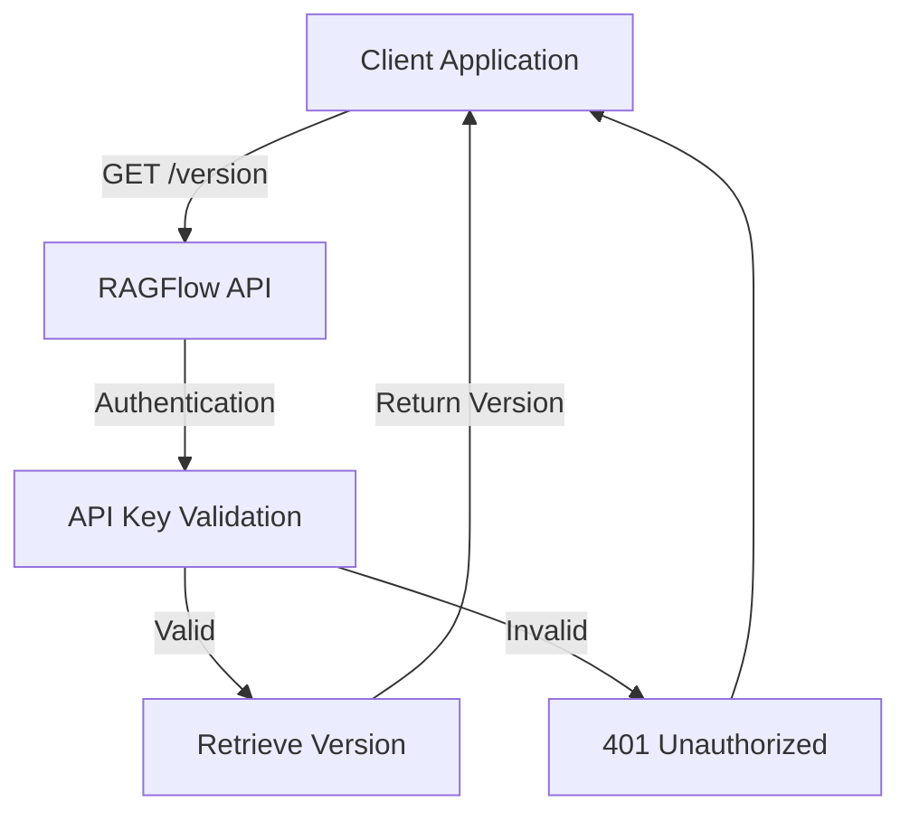

**Diagram sources**
- [system_app.py](file://api/apps/system_app.py#L42-L62)
- [versions.py](file://common/versions.py#L23-L37)

### System Status Endpoint
The `/status` endpoint provides comprehensive system status information, including the health of various components such as the document engine, storage, database, and Redis. This endpoint performs multiple health checks and returns detailed information about each component's status, response time, and any errors encountered.

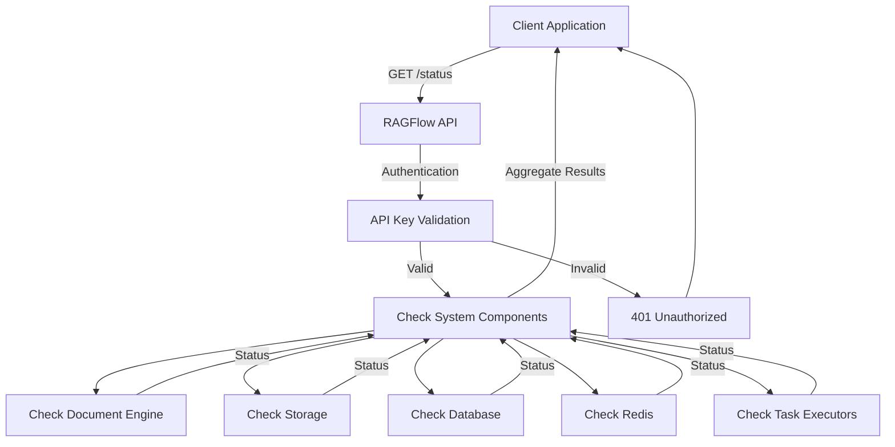

**Diagram sources**
- [system_app.py](file://api/apps/system_app.py#L65-L171)
- [health_utils.py](file://api/utils/health_utils.py#L33-L222)

### Health Check Endpoint
The `/healthz` endpoint performs a comprehensive health check of the system and returns HTTP status 200 if all components are operational, or 500 if any component is failing. This endpoint is designed for use by monitoring systems and load balancers to determine the overall health of the application.

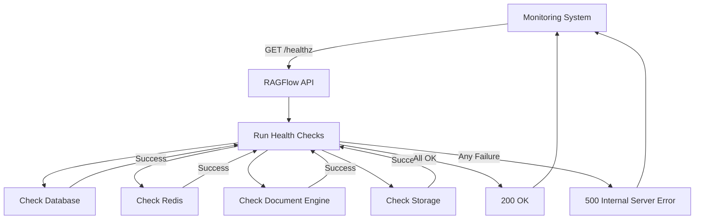

**Diagram sources**
- [system_app.py](file://api/apps/system_app.py#L174-L177)
- [health_utils.py](file://api/utils/health_utils.py#L187-L222)

### System Configuration Endpoint
The `/config` endpoint retrieves system configuration settings, currently including whether user registration is enabled. This endpoint does not require authentication and is accessible to all users.

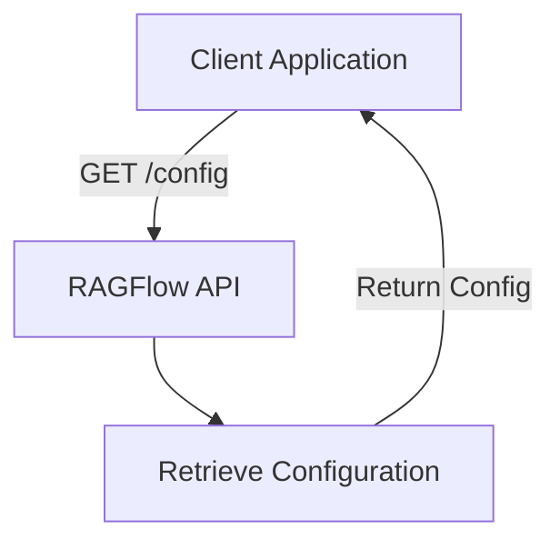

**Diagram sources**
- [system_app.py](file://api/apps/system_app.py#L316-L336)
- [settings.py](file://common/settings.py#L119-L120)

**Section sources**
- [system_app.py](file://api/apps/system_app.py#L42-L336)
- [health_utils.py](file://api/utils/health_utils.py#L1-L223)
- [versions.py](file://common/versions.py#L1-L51)

## Plugin Management API

### LLM Tools Discovery Endpoint
The `/llm_tools` endpoint retrieves metadata for all available LLM tools registered in the system. This endpoint requires authentication and returns a list of tool metadata objects that can be used by LLMs to understand available functions.

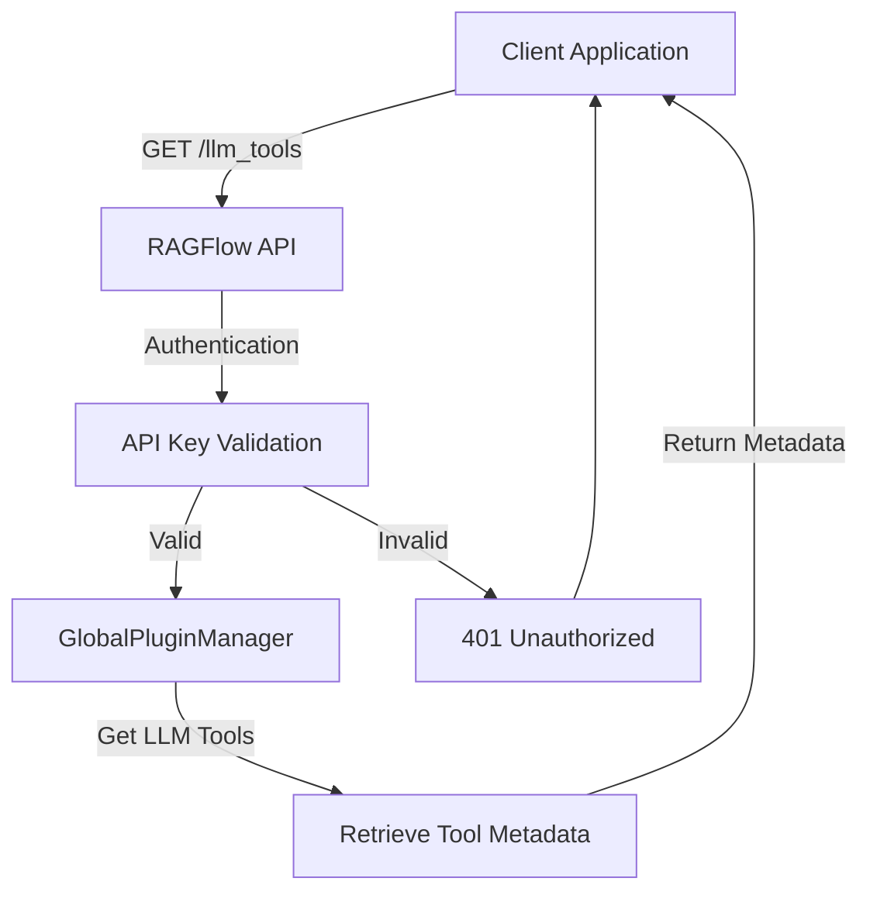

**Diagram sources**
- [plugin_app.py](file://api/apps/plugin_app.py#L24-L31)
- [plugin_manager.py](file://plugin/plugin_manager.py#L30-L31)

### Plugin Architecture
The plugin system in RAGFlow is designed around a modular architecture that allows for the dynamic loading and management of LLM tools. The GlobalPluginManager singleton manages all plugin instances and provides methods for retrieving tools by name or in bulk.

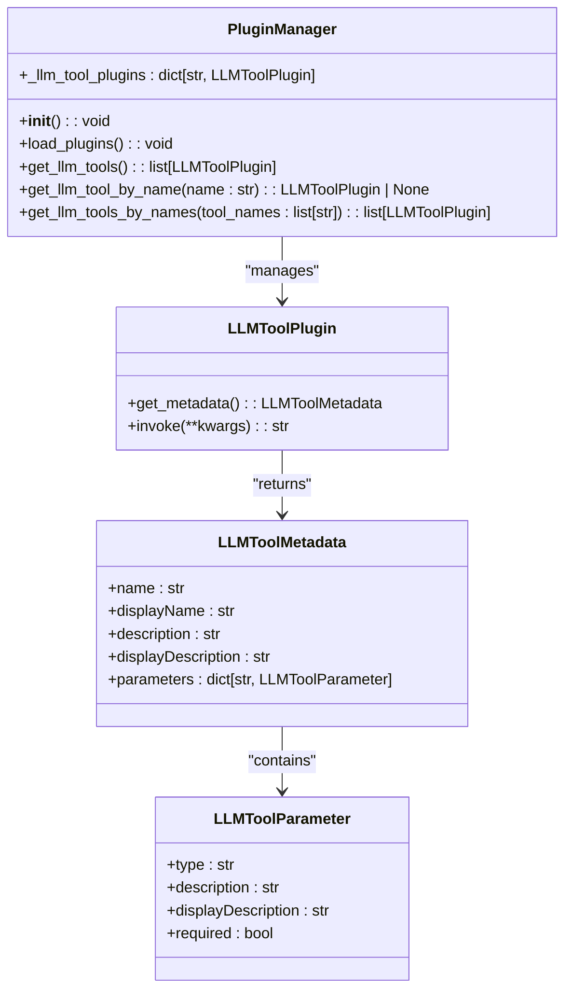

**Diagram sources**
- [plugin_manager.py](file://plugin/plugin_manager.py#L11-L46)
- [llm_tool_plugin.py](file://plugin/llm_tool_plugin.py#L22-L52)

### Plugin Lifecycle Management
Plugins are loaded from the embedded_plugins directory during system initialization. The PluginManager uses the pluginlib library to discover and load plugins, which are then registered and made available through the GlobalPluginManager instance.

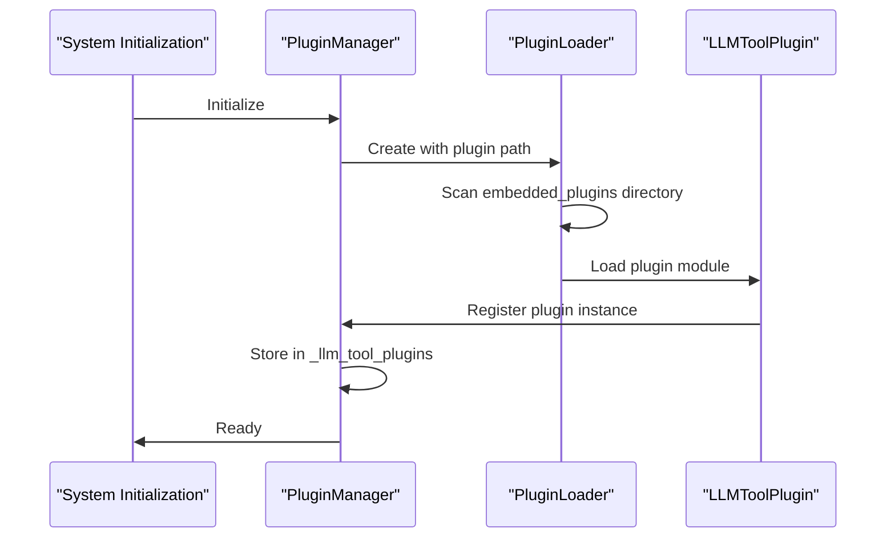

**Diagram sources**
- [plugin_manager.py](file://plugin/plugin_manager.py#L17-L29)
- [__init__.py](file://plugin/__init__.py#L1-L3)

**Section sources**
- [plugin_app.py](file://api/apps/plugin_app.py#L1-L31)
- [plugin_manager.py](file://plugin/plugin_manager.py#L1-L46)
- [llm_tool_plugin.py](file://plugin/llm_tool_plugin.py#L1-L52)

## MCP Server API

### MCP Server Management Endpoints
The MCP (Model Context Protocol) server API provides comprehensive endpoints for managing external tool servers. These endpoints allow users to list, create, update, delete, import, and export MCP server configurations.

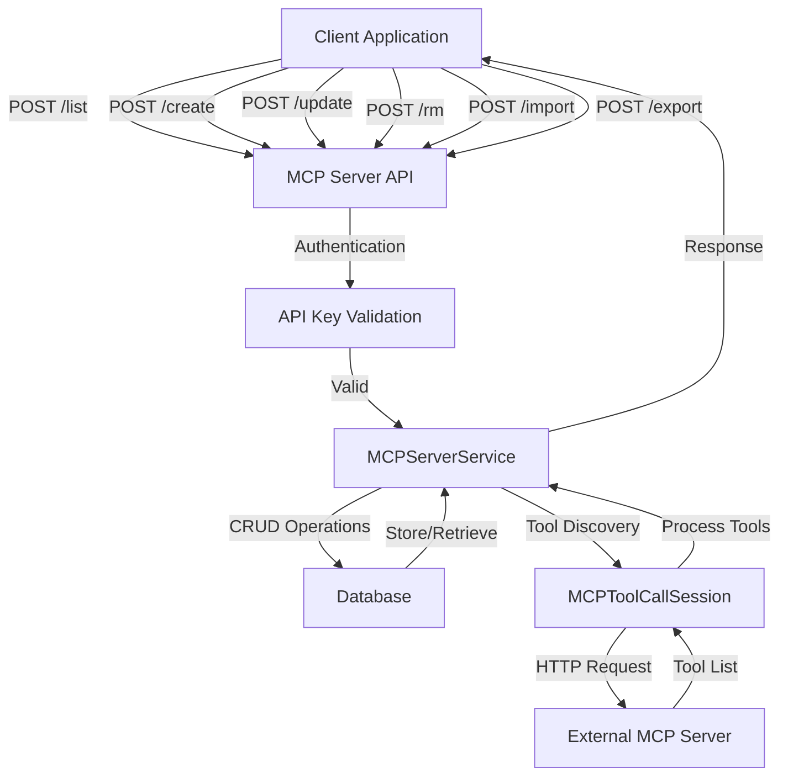

**Diagram sources**
- [mcp_server_app.py](file://api/apps/mcp_server_app.py#L30-L443)
- [mcp_server_service.py](file://api/db/services/mcp_server_service.py#L22-L93)

### MCP Server Data Model
The MCPServer model represents a configured external tool server in the database. Each MCP server has a unique identifier, name, URL, server type, and associated configuration variables and headers.

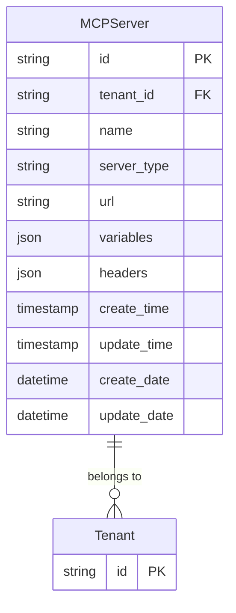

**Diagram sources**
- [db_models.py](file://api/db/db_models.py#L959-L1000)
- [mcp_server_service.py](file://api/db/services/mcp_server_service.py#L22-L93)

### MCP Tool Discovery and Execution
The MCP server API includes endpoints for discovering available tools on registered servers and testing tool execution. When a server is created or updated, the system automatically discovers available tools and caches their metadata.

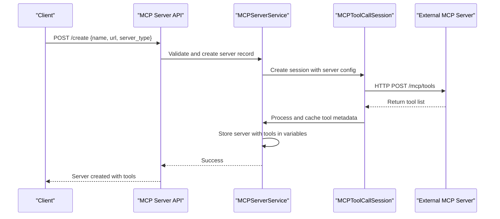

**Diagram sources**
- [mcp_server_app.py](file://api/apps/mcp_server_app.py#L71-L122)
- [mcp_tool_call_conn.py](file://common/mcp_tool_call_conn.py#L42-L206)

### MCP Server Operations
The MCP server API supports various operations including listing servers, retrieving server details, creating new servers, updating existing servers, removing servers, importing multiple servers, and exporting server configurations.

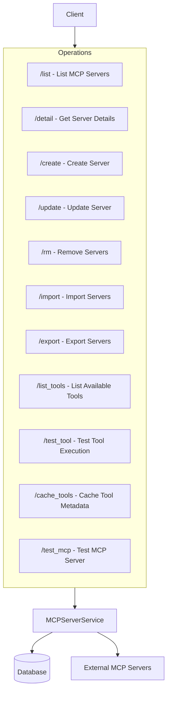

**Diagram sources**
- [mcp_server_app.py](file://api/apps/mcp_server_app.py#L30-L443)
- [mcp_server_service.py](file://api/db/services/mcp_server_service.py#L22-L93)

**Section sources**
- [mcp_server_app.py](file://api/apps/mcp_server_app.py#L1-L443)
- [mcp_server_service.py](file://api/db/services/mcp_server_service.py#L1-L93)
- [db_models.py](file://api/db/db_models.py#L959-L1000)
- [mcp_tool_call_conn.py](file://common/mcp_tool_call_conn.py#L35-L206)

## Security and Sandboxing

### Sandboxing Architecture
The RAGFlow platform includes a secure sandboxing system for executing code in isolated environments. The sandbox uses Docker containers with gVisor for syscall-level sandboxing to prevent malicious code from affecting the host system.

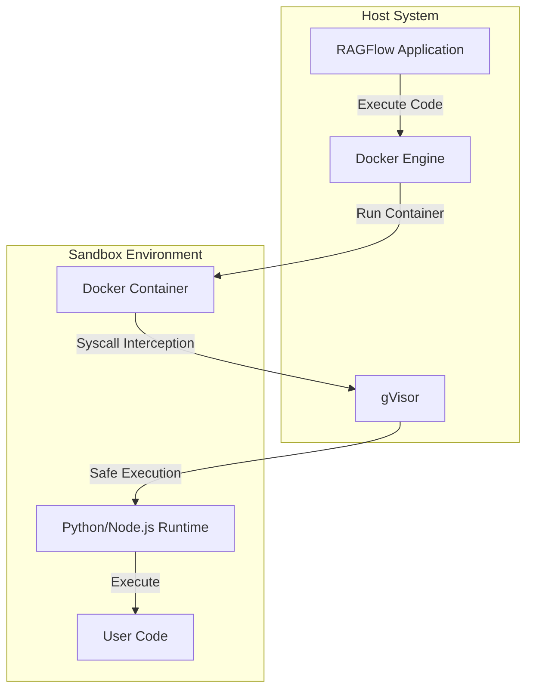

**Diagram sources**
- [sandbox_quickstart.md](file://docs/guides/agent/sandbox_quickstart.md#L1-L33)
- [docker-compose.yml](file://sandbox/docker-compose.yml#L1-L32)

### Sandboxing Configuration
The sandbox environment is configured through environment variables that control resource limits, security settings, and base images for different programming languages.

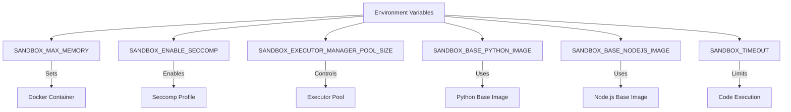

**Diagram sources**
- [.env.example](file://sandbox/.env.example#L1-L9)
- [container.py](file://sandbox/executor_manager/core/container.py#L102-L130)

### Security Testing
The sandbox includes comprehensive security tests to verify that the isolation mechanisms are working correctly and that malicious code cannot escape the container or access unauthorized resources.

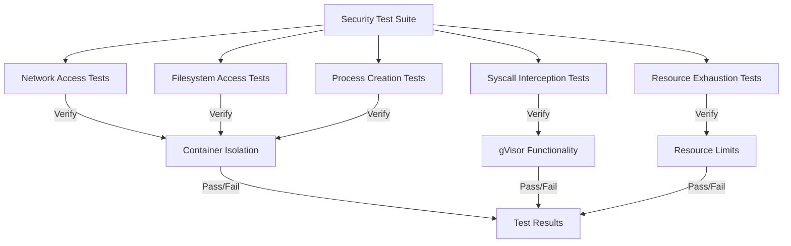

**Diagram sources**
- [sandbox_security_tests_full.py](file://sandbox/tests/sandbox_security_tests_full.py#L381-L415)
- [Makefile](file://sandbox/Makefile#L91-L95)

**Section sources**
- [sandbox_quickstart.md](file://docs/guides/agent/sandbox_quickstart.md#L1-L33)
- [docker-compose.yml](file://sandbox/docker-compose.yml#L1-L32)
- [.env.example](file://sandbox/.env.example#L1-L9)
- [container.py](file://sandbox/executor_manager/core/container.py#L102-L130)
- [sandbox_security_tests_full.py](file://sandbox/tests/sandbox_security_tests_full.py#L1-L415)

## Integration Examples

### Registering a Custom MCP Server
To register a custom MCP server, send a POST request to the `/create` endpoint with the server configuration:

```json
{
  "name": "my-custom-tools",
  "url": "https://my-mcp-server.com",
  "server_type": "openai",
  "headers": {
    "Authorization": "Bearer my-api-key"
  },
  "variables": {
    "api_key": "my-api-key"
  }
}
```

The system will automatically discover available tools on the server and cache their metadata for future use.

### Configuring LLM Tool Plugins
To create a custom LLM tool plugin, extend the LLMToolPlugin class and implement the required methods:

```python
from pluginlib import Parent
from plugin.llm_tool_plugin import LLMToolPlugin

@Parent("llm_tools")
class MyCustomToolPlugin(LLMToolPlugin):
    @classmethod
    def get_metadata(cls):
        return {
            "name": "my_custom_tool",
            "displayName": "My Custom Tool",
            "description": "A custom tool for performing specific tasks",
            "displayDescription": "This tool performs specific tasks",
            "parameters": {
                "input": {
                    "type": "string",
                    "description": "The input for the tool",
                    "displayDescription": "Input for the tool",
                    "required": True
                }
            }
        }
    
    def invoke(self, **kwargs):
        # Implement tool logic here
        input_text = kwargs.get("input", "")
        # Process input and return result
        return f"Processed: {input_text}"
```

### Using the Plugin System
Once a plugin is created, it can be discovered and used through the plugin API:

```python
# Get all available LLM tools
tools = GlobalPluginManager.get_llm_tools()

# Get a specific tool by name
tool = GlobalPluginManager.get_llm_tool_by_name("my_custom_tool")

# Invoke the tool
result = tool.invoke(input="Hello, world!")
```

**Section sources**
- [mcp_server_app.py](file://api/apps/mcp_server_app.py#L71-L122)
- [plugin_manager.py](file://plugin/plugin_manager.py#L30-L31)
- [llm_tool_plugin.py](file://plugin/llm_tool_plugin.py#L22-L52)

## Conclusion
The RAGFlow platform provides a comprehensive API for system and plugin management, enabling users to monitor system health, manage external tool servers through the MCP protocol, and extend functionality through custom plugins. The system includes robust security measures, including a sandboxed execution environment for code execution, ensuring that external tools and user code cannot compromise the integrity of the system. The modular architecture allows for easy integration of new tools and services, making RAGFlow a flexible and extensible platform for AI-powered applications.