# User & Tenant Management API

<cite>
**Referenced Files in This Document**
- [user_app.py](file://api/apps/user_app.py)
- [tenant_app.py](file://api/apps/tenant_app.py)
- [oauth.py](file://api/apps/auth/oauth.py)
- [oidc.py](file://api/apps/auth/oidc.py)
- [github.py](file://api/apps/auth/github.py)
- [__init__.py](file://api/apps/__init__.py)
- [web_utils.py](file://api/utils/web_utils.py)
- [user_service.py](file://api/db/services/user_service.py)
- [tenant_llm_service.py](file://api/db/services/tenant_llm_service.py)
- [db_models.py](file://api/db/db_models.py)
- [settings.py](file://common/settings.py)
</cite>

## Table of Contents
1. [Introduction](#introduction)
2. [System Architecture](#system-architecture)
3. [Authentication & Authorization](#authentication--authorization)
4. [User Management API](#user-management-api)
5. [Tenant Management API](#tenant-management-api)
6. [OAuth & SSO Integration](#oauth--sso-integration)
7. [Security Features](#security-features)
8. [Rate Limiting & Protection](#rate-limiting--protection)
9. [Multi-Tenancy Isolation](#multi-tenancy-isolation)
10. [Error Handling](#error-handling)
11. [Examples & Usage](#examples--usage)

## Introduction

The RAGFlow User & Tenant Management API provides comprehensive functionality for user registration, authentication, profile management, and multi-tenant administration. The system supports multiple authentication methods including OAuth2, OIDC, and GitHub integration, with robust security features including rate limiting, audit logging, and data privacy controls.

The API follows RESTful principles and provides both synchronous and asynchronous endpoints to handle various authentication scenarios efficiently. It implements role-based access control (RBAC) with fine-grained permissions for tenant management operations.

## System Architecture

The user and tenant management system consists of several interconnected components:

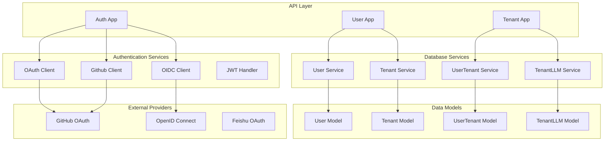

**Diagram sources**
- [user_app.py](file://api/apps/user_app.py#L1-L1015)
- [tenant_app.py](file://api/apps/tenant_app.py#L1-L140)
- [oauth.py](file://api/apps/auth/oauth.py#L1-L152)
- [oidc.py](file://api/apps/auth/oidc.py#L1-L108)

## Authentication & Authorization

### Authentication Flow

The system supports multiple authentication methods with a unified interface:

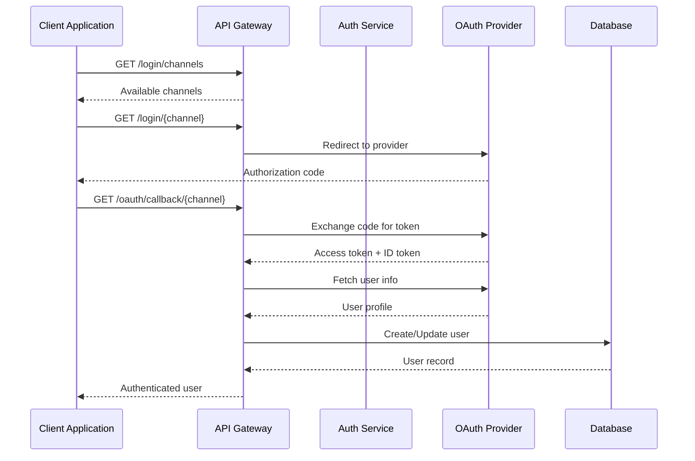

**Diagram sources**
- [user_app.py](file://api/apps/user_app.py#L140-L266)
- [oauth.py](file://api/apps/auth/oauth.py#L48-L152)

### Token Management

The system implements secure token-based authentication with automatic token refresh capabilities:

| Feature | Description | Implementation |
|---------|-------------|----------------|
| Access Tokens | UUID-based tokens for API authentication | Generated during login/register |
| Refresh Tokens | Long-lived tokens for session persistence | Provider-specific implementation |
| Token Validation | JWT-based validation with expiration | Built-in expiration checking |
| Session Management | Secure session handling | Flask-Auth integration |

**Section sources**
- [__init__.py](file://api/apps/__init__.py#L108-L143)
- [user_app.py](file://api/apps/user_app.py#L114-L131)

## User Management API

### User Registration

Register new users with comprehensive validation and automatic tenant creation:

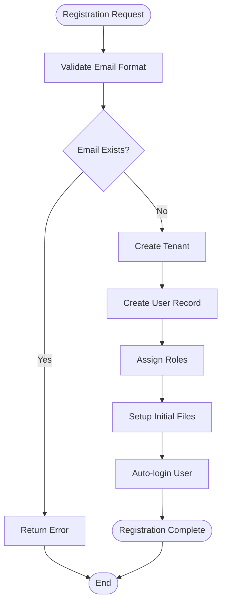

**Diagram sources**
- [user_app.py](file://api/apps/user_app.py#L667-L758)

### User Authentication

Supports multiple authentication methods with fallback mechanisms:

| Endpoint | Method | Description | Authentication |
|----------|--------|-------------|----------------|
| `/login` | POST | Standard email/password login | Password hashing |
| `/login/channels` | GET | List available auth channels | Public |
| `/login/{channel}` | GET | OAuth/OIDC login initiation | OAuth provider |
| `/logout` | GET | User logout | Session termination |

### Profile Management

Manage user profiles with comprehensive update capabilities:

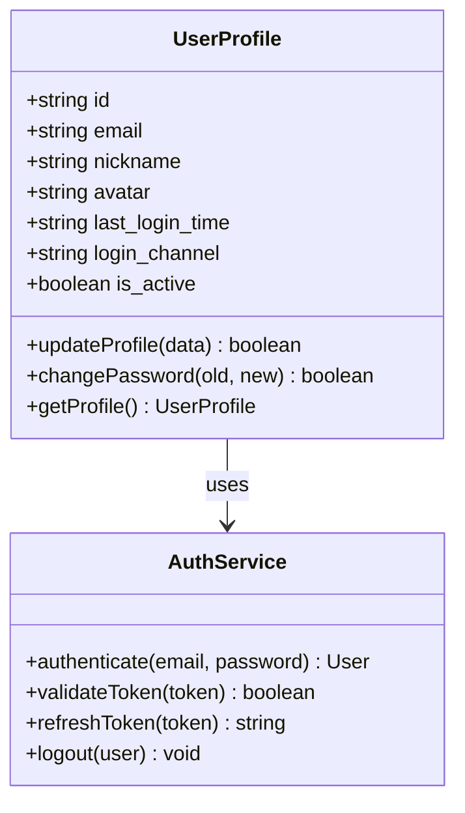

**Diagram sources**
- [user_app.py](file://api/apps/user_app.py#L576-L602)
- [user_service.py](file://api/db/services/user_service.py#L33-L200)

**Section sources**
- [user_app.py](file://api/apps/user_app.py#L667-L758)
- [user_app.py](file://api/apps/user_app.py#L576-L602)

## Tenant Management API

### Tenant Operations

Manage multi-tenant environments with role-based access control:

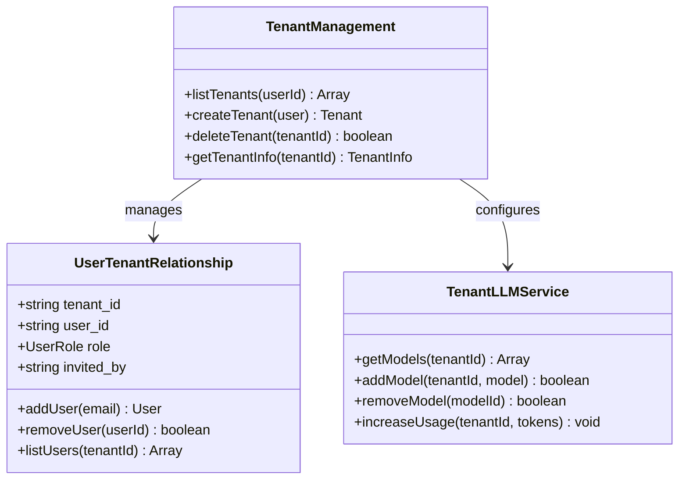

**Diagram sources**
- [tenant_app.py](file://api/apps/tenant_app.py#L30-L140)
- [tenant_llm_service.py](file://api/db/services/tenant_llm_service.py#L32-L200)

### Team Management

Handle user invitations and team membership:

| Endpoint | Method | Description | Permissions |
|----------|--------|-------------|-------------|
| `/{tenant_id}/user/list` | GET | List tenant users | Tenant owner/member |
| `/{tenant_id}/user` | POST | Invite user to tenant | Tenant owner |
| `/{tenant_id}/user/{user_id}` | DELETE | Remove user from tenant | Tenant owner/self |
| `/list` | GET | List user's tenants | Authenticated user |
| `/agree/{tenant_id}` | PUT | Accept tenant invitation | Invited user |

**Section sources**
- [tenant_app.py](file://api/apps/tenant_app.py#L30-L140)

## OAuth & SSO Integration

### Supported Providers

The system supports multiple OAuth providers with unified configuration:

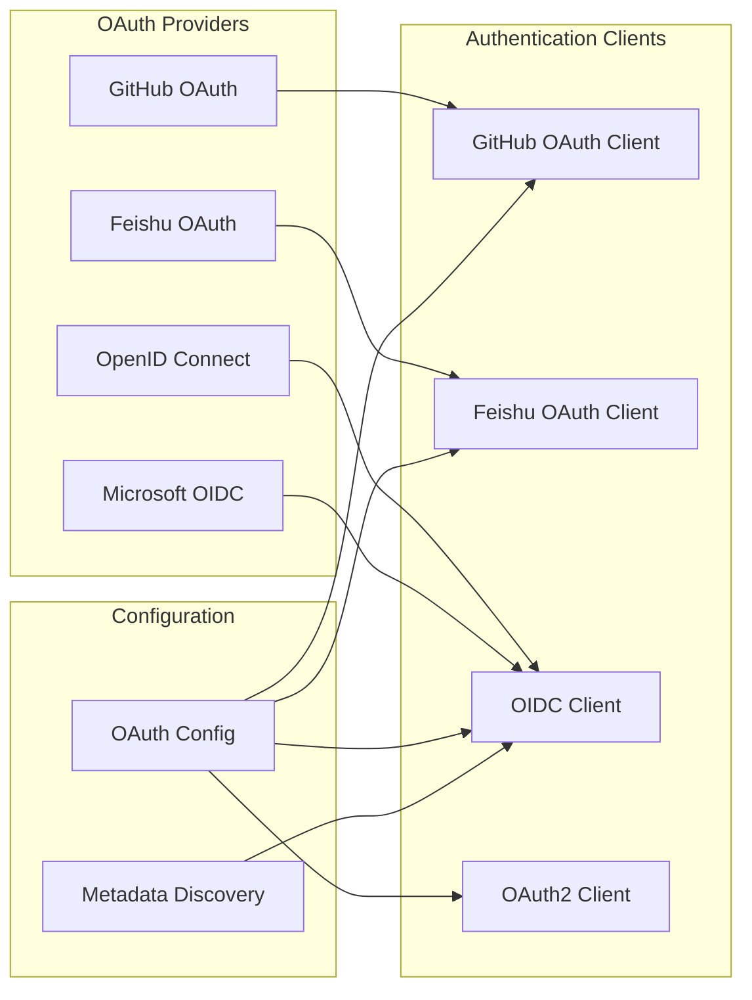

**Diagram sources**
- [oauth.py](file://api/apps/auth/oauth.py#L32-L152)
- [oidc.py](file://api/apps/auth/oidc.py#L22-L108)
- [github.py](file://api/apps/auth/github.py#L21-L89)

### OAuth Configuration

Configure OAuth providers with flexible settings:

| Provider | Type | Configuration Required | Scopes |
|----------|------|----------------------|---------|
| GitHub | OAuth2/GitHub | client_id, client_secret | user:email |
| Feishu | OAuth2 | app_id, app_secret | contact:user.email:readonly |
| OpenID Connect | OIDC | issuer, client_id | openid email profile |
| Custom OAuth | OAuth2 | authorization_url, token_url, userinfo_url | Custom scopes |

### Token Refresh Mechanisms

Implement automatic token refresh for long-running sessions:

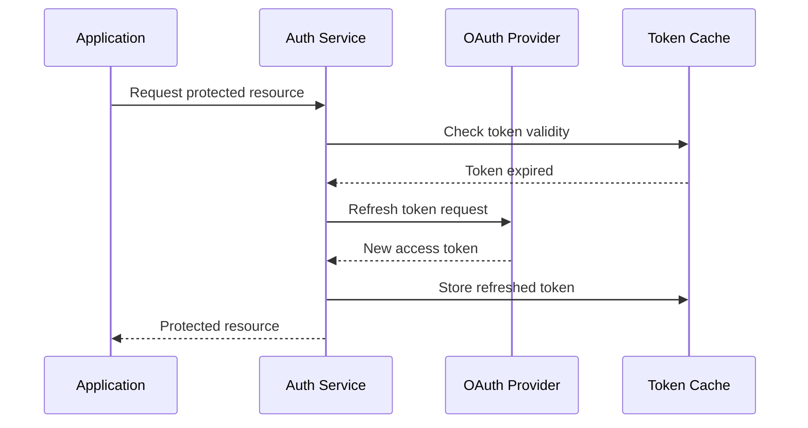

**Diagram sources**
- [oauth.py](file://api/apps/auth/oauth.py#L65-L112)
- [oidc.py](file://api/apps/auth/oidc.py#L60-L86)

**Section sources**
- [oauth.py](file://api/apps/auth/oauth.py#L32-L152)
- [oidc.py](file://api/apps/auth/oidc.py#L22-L108)
- [github.py](file://api/apps/auth/github.py#L21-L89)

## Security Features

### Data Privacy Controls

Implement comprehensive data privacy measures:

| Control | Implementation | Purpose |
|---------|----------------|---------|
| Multi-tenancy Isolation | Database-level separation | Prevent cross-tenant data access |
| Role-Based Access Control | UserTenantRole enumeration | Fine-grained permission management |
| Audit Logging | Operation logging with timestamps | Track all user actions |
| Data Encryption | AES encryption for sensitive data | Protect user information |
| IP Whitelisting | Configurable IP restrictions | Additional security layer |

### Password Policy Enforcement

Enforce strong password policies:

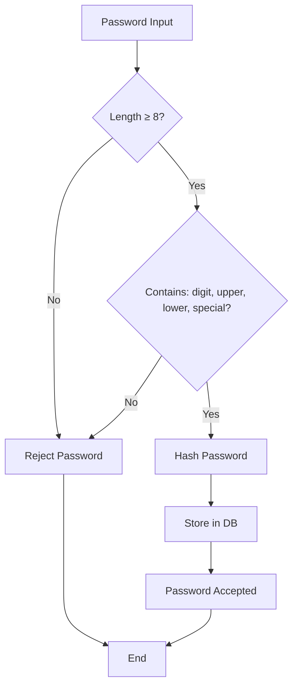

**Diagram sources**
- [user_app.py](file://api/apps/user_app.py#L709-L723)

### Rate Limiting Strategies

Implement multiple layers of rate limiting:

| Protection Level | Threshold | Action | Duration |
|------------------|-----------|--------|----------|
| Login Attempts | 5 attempts | Lock account | 30 minutes |
| API Requests | 100 req/min | Throttle | 1 minute |
| Email Verification | 1 email/hr | Block | 1 hour |
| Token Refresh | 10 req/hr | Block | 1 hour |

**Section sources**
- [web_utils.py](file://api/utils/web_utils.py#L38-L42)
- [user_app.py](file://api/apps/user_app.py#L962-L998)

## Rate Limiting & Protection

### Authentication Rate Limits

Protect against brute force attacks and abuse:

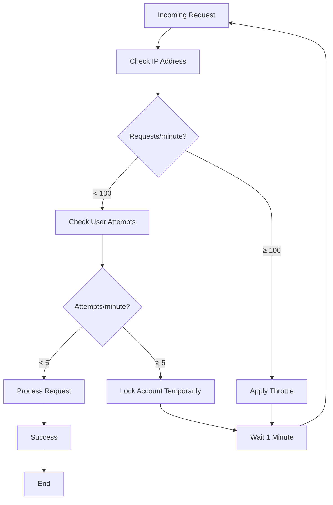

**Diagram sources**
- [web_utils.py](file://api/utils/web_utils.py#L38-L42)
- [user_app.py](file://api/apps/user_app.py#L962-L998)

### OTP & Two-Factor Authentication

Implement time-based one-time passwords:

| Feature | Implementation | Security Level |
|---------|----------------|----------------|
| OTP Generation | SHA256 with salt | Cryptographic strength |
| OTP Expiration | 5-minute TTL | Prevent replay attacks |
| Attempt Limits | 5 attempts per OTP | Brute force protection |
| Resend Cooldown | 60-second cooldown | Abuse prevention |

**Section sources**
- [web_utils.py](file://api/utils/web_utils.py#L38-L42)
- [user_app.py](file://api/apps/user_app.py#L815-L941)

## Multi-Tenancy Isolation

### Tenant Data Separation

Ensure complete isolation between tenants:

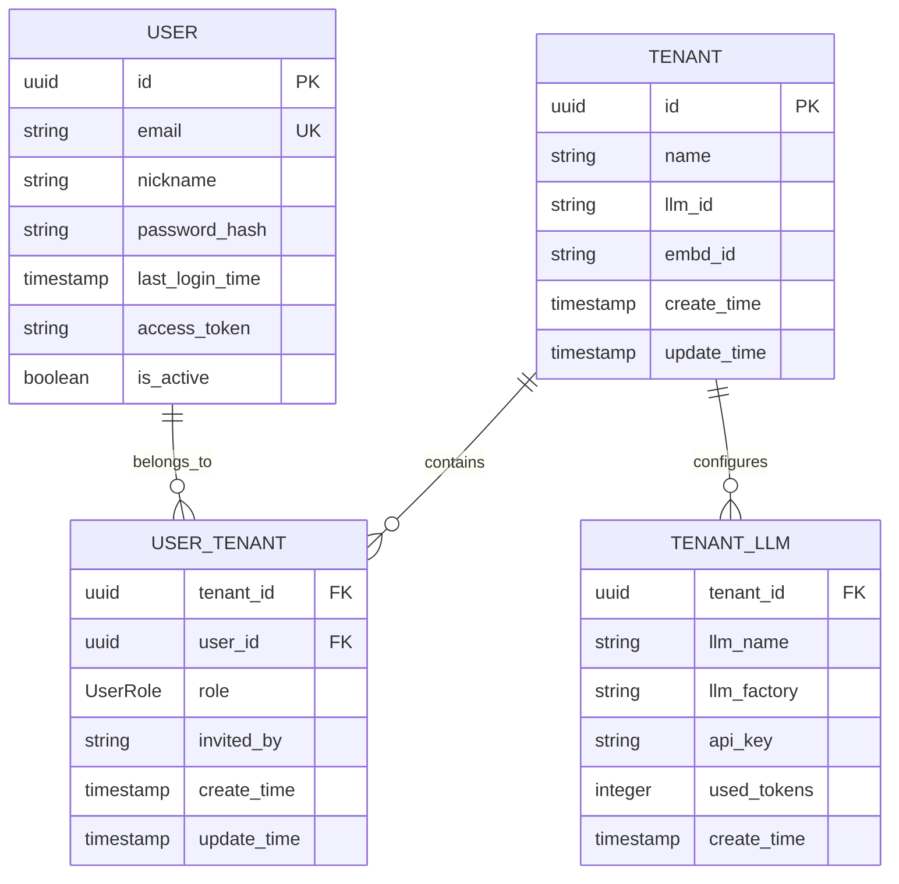

**Diagram sources**
- [db_models.py](file://api/db/db_models.py#L1-L200)
- [tenant_app.py](file://api/apps/tenant_app.py#L169-L211)

### Cross-Tenant Security

Prevent unauthorized access between tenants:

| Security Measure | Implementation | Effectiveness |
|------------------|----------------|---------------|
| Database Isolation | Separate tenant schemas | High |
| Query Filtering | Automatic tenant filtering | High |
| Role Validation | RBAC checks on all operations | Medium |
| Audit Trails | Comprehensive logging | Medium |

**Section sources**
- [tenant_app.py](file://api/apps/tenant_app.py#L30-L140)
- [user_service.py](file://api/db/services/user_service.py#L168-L211)

## Error Handling

### Standardized Error Responses

Provide consistent error handling across all endpoints:

| HTTP Status | Error Code | Description | Example Scenario |
|-------------|------------|-------------|------------------|
| 400 | ARGUMENT_ERROR | Invalid request parameters | Missing required fields |
| 401 | AUTHENTICATION_ERROR | Authentication failed | Invalid credentials |
| 403 | FORBIDDEN | Insufficient permissions | Unauthorized access |
| 429 | TOO_MANY_REQUESTS | Rate limit exceeded | Too many requests |
| 500 | SERVER_ERROR | Internal server error | Unexpected failures |

### Error Recovery Strategies

Implement graceful error handling:

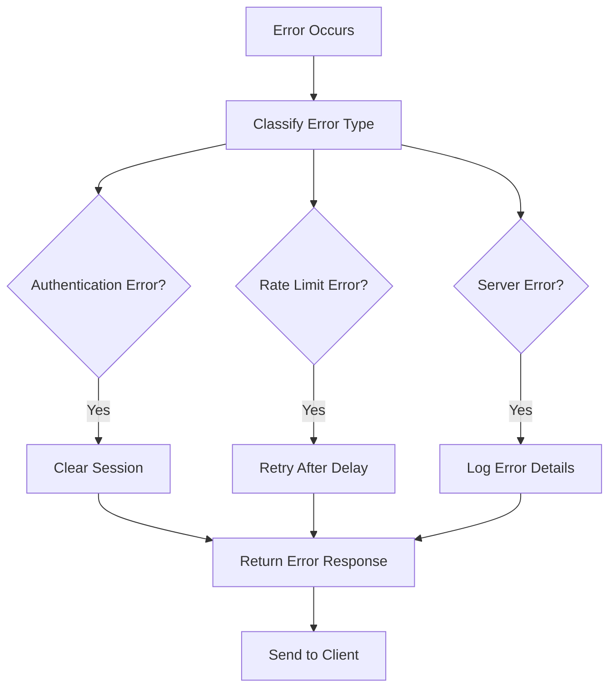

**Diagram sources**
- [user_app.py](file://api/apps/user_app.py#L95-L137)
- [__init__.py](file://api/apps/__init__.py#L108-L143)

**Section sources**
- [user_app.py](file://api/apps/user_app.py#L95-L137)
- [__init__.py](file://api/apps/__init__.py#L108-L143)

## Examples & Usage

### User Login Examples

**Standard Email/Password Login:**
```http
POST /v1/user/login
Content-Type: application/json

{
  "email": "user@example.com",
  "password": "encrypted_password_here"
}
```

**OAuth Login Flow:**
```http
GET /v1/user/login/github
# Redirect to GitHub authorization
```

### Tenant Management Examples

**Invite User to Tenant:**
```http
POST /v1/tenant/{tenant_id}/user
Content-Type: application/json

{
  "email": "newuser@example.com"
}
```

**List Tenant Users:**
```http
GET /v1/tenant/{tenant_id}/user/list
Authorization: Bearer {access_token}
```

### Authentication Examples

**Using Access Token:**
```http
GET /v1/user/info
Authorization: Bearer {access_token}
```

**Using API Key:**
```http
GET /v1/user/info
Authorization: ApiKey {api_key}
```

### Configuration Examples

**OAuth Configuration:**
```yaml
oauth:
  github:
    client_id: "your_client_id"
    client_secret: "your_client_secret"
    redirect_uri: "https://your-app.com/v1/user/oauth/callback/github"
  
  oidc:
    issuer: "https://your-oidc-provider.com"
    client_id: "your_client_id"
    client_secret: "your_client_secret"
```

**Section sources**
- [user_app.py](file://api/apps/user_app.py#L64-L137)
- [tenant_app.py](file://api/apps/tenant_app.py#L30-L140)
- [settings.py](file://common/settings.py#L229-L232)