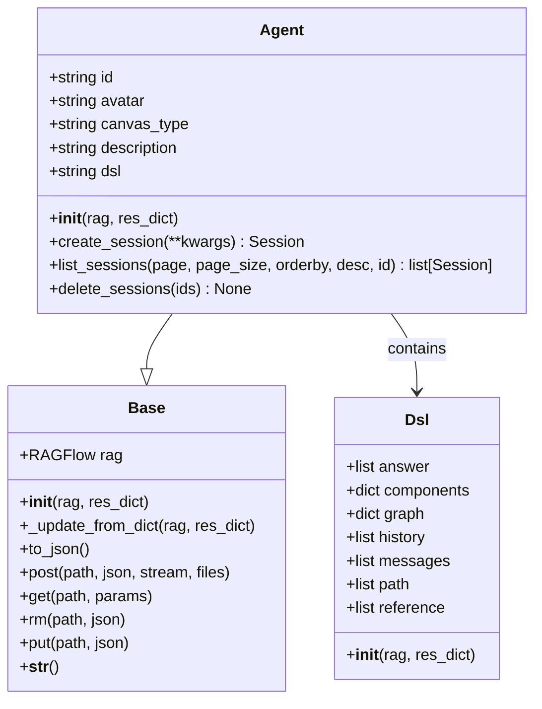
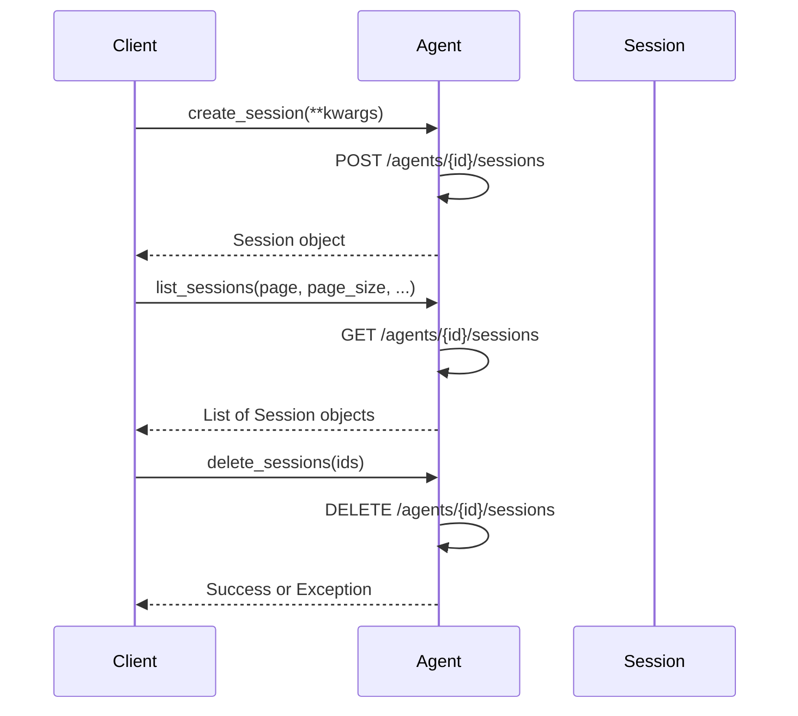
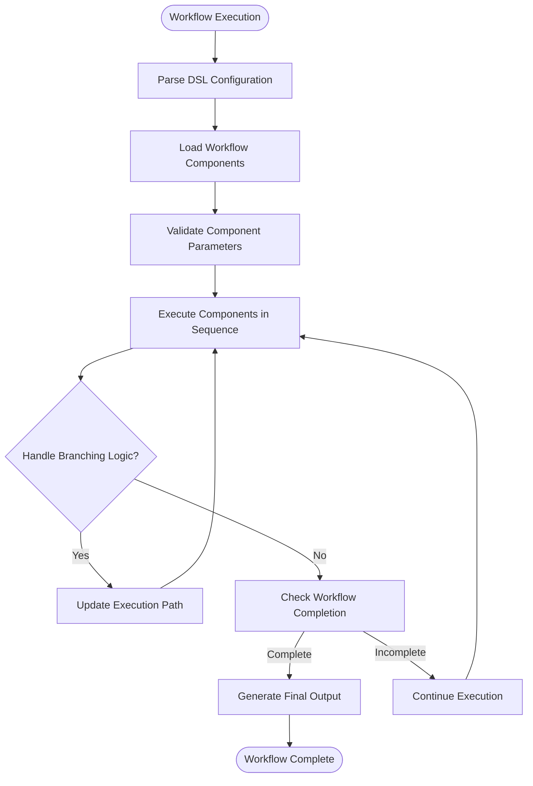
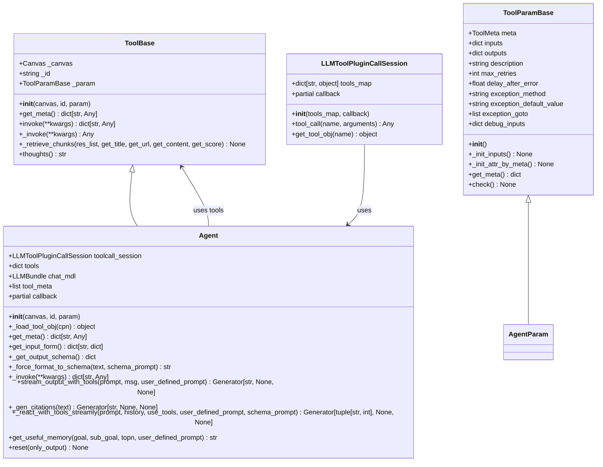
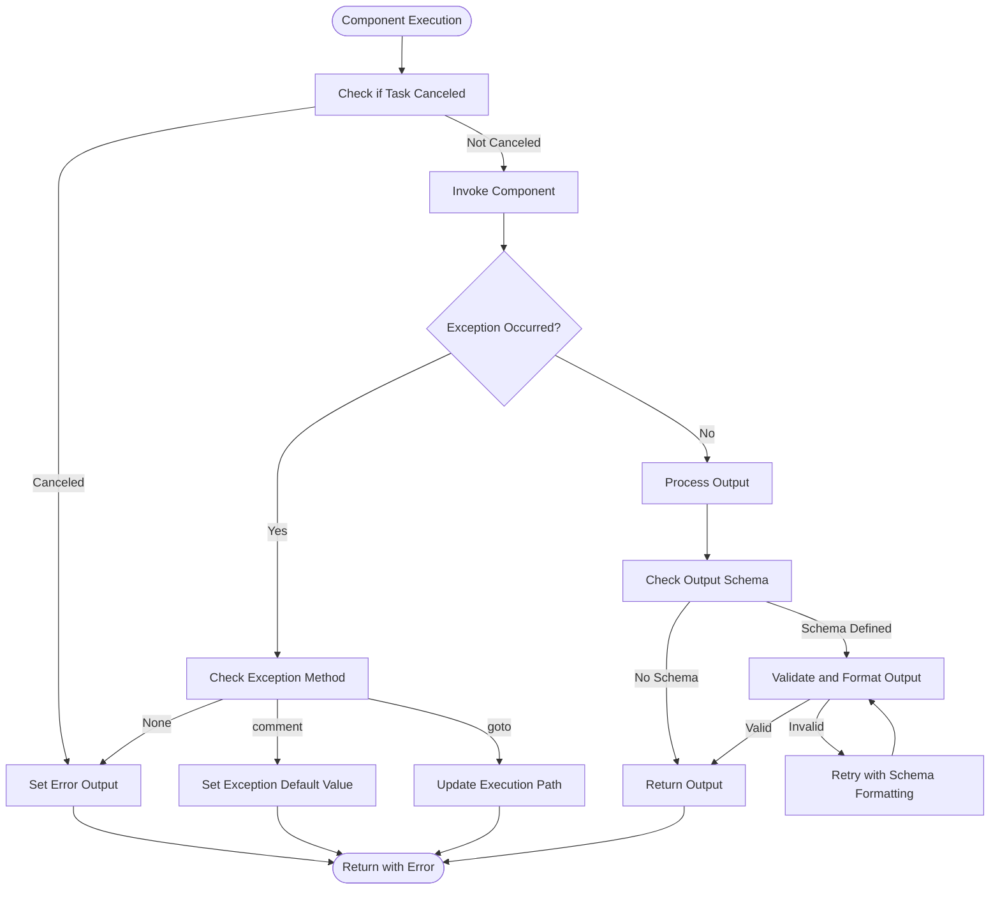

# Agent Module

<cite>
**Referenced Files in This Document**   
- [agent.py](file://sdk/python/ragflow_sdk/modules/agent.py)
- [base.py](file://sdk/python/ragflow_sdk/modules/base.py)
- [session.py](file://sdk/python/ragflow_sdk/modules/session.py)
- [canvas.py](file://agent/canvas.py)
- [agent_with_tools.py](file://agent/component/agent_with_tools.py)
- [retrieval.py](file://agent/tools/retrieval.py)
- [llm.py](file://agent/component/llm.py)
- [customer_service.json](file://agent/templates/customer_service.json)
- [deep_research.json](file://agent/templates/deep_research.json)
</cite>

## Table of Contents
1. [Introduction](#introduction)
2. [Agent Class Implementation](#agent-class-implementation)
3. [Agent Configuration and Parameters](#agent-configuration-and-parameters)
4. [Session Management](#session-management)
5. [Workflow Execution](#workflow-execution)
6. [Integration with Tools and MCP](#integration-with-tools-and-mcp)
7. [Error Handling and Debugging](#error-handling-and-debugging)
8. [Example Usage](#example-usage)
9. [Conclusion](#conclusion)

## Introduction
The Agent module in RAGFlow's Python SDK provides a comprehensive framework for creating and managing intelligent agents capable of complex workflows. This documentation details the implementation of the Agent class, its methods for creation, configuration, execution, and management, and its relationship with other components such as tools, workflows, and Model Context Protocol (MCP). The Agent class serves as the central component for orchestrating multi-step processes, enabling developers to build sophisticated AI-driven applications with ease. This guide provides comprehensive examples and detailed descriptions of parameters, return values, and potential exceptions to assist both beginners and experienced developers in implementing complex agent workflows.

## Agent Class Implementation

The Agent class is the core component of the RAGFlow SDK's agent system, providing methods for agent creation, configuration, and management. It inherits from the Base class and encapsulates agent-specific properties and operations.



**Diagram sources**
- [agent.py](file://sdk/python/ragflow_sdk/modules/agent.py#L21-L94)

**Section sources**
- [agent.py](file://sdk/python/ragflow_sdk/modules/agent.py#L21-L94)

## Agent Configuration and Parameters

The Agent class provides several attributes for configuration and state management. These attributes are initialized from the response dictionary and provide access to agent properties such as ID, avatar, canvas type, description, and DSL (Domain Specific Language) configuration.

The Dsl nested class within Agent contains the workflow definition and execution state, including:
- **answer**: List of answers generated by the agent
- **components**: Dictionary of workflow components with their configurations
- **graph**: Visual representation of the workflow with nodes and edges
- **history**: Conversation history between user and agent
- **messages**: Current messages in the workflow
- **path**: Execution path of the workflow
- **reference**: Reference materials used in the workflow

These parameters enable the agent to maintain state across interactions and provide a structured approach to workflow execution.

**Section sources**
- [agent.py](file://sdk/python/ragflow_sdk/modules/agent.py#L23-L66)

## Session Management

The Agent class provides methods for managing agent sessions, which represent individual conversations or workflow executions. Session management is crucial for maintaining state and context across multiple interactions.



**Diagram sources**
- [agent.py](file://sdk/python/ragflow_sdk/modules/agent.py#L69-L94)

The session management methods include:

### create_session
Creates a new session for the agent with optional parameters.

**Parameters:**
- **kwargs**: Additional parameters for session creation

**Returns:**
- **Session**: A Session object representing the newly created session

**Exceptions:**
- **Exception**: Raised if the API call fails

### list_sessions
Retrieves a list of sessions for the agent with pagination and filtering options.

**Parameters:**
- **page**: Page number (default: 1)
- **page_size**: Number of sessions per page (default: 30)
- **orderby**: Field to order results by (default: "create_time")
- **desc**: Whether to sort in descending order (default: True)
- **id**: Specific session ID to filter by (optional)

**Returns:**
- **list[Session]**: List of Session objects

**Exceptions:**
- **Exception**: Raised if the API call fails

### delete_sessions
Deletes one or more sessions for the agent.

**Parameters:**
- **ids**: List of session IDs to delete (optional, deletes all if None)

**Exceptions:**
- **Exception**: Raised if the API call fails

**Section sources**
- [agent.py](file://sdk/python/ragflow_sdk/modules/agent.py#L69-L94)

## Workflow Execution

The Agent module executes workflows through a sophisticated execution engine implemented in the Canvas class. The workflow execution process involves parsing the DSL (Domain Specific Language) configuration, managing component dependencies, and orchestrating the execution of individual components in the correct order.



**Diagram sources**
- [canvas.py](file://agent/canvas.py#L81-L632)

The execution process begins with the Canvas class loading the DSL configuration and initializing all components. Each component is validated to ensure its parameters are correct before execution. The workflow engine then executes components in the order defined by the path, handling branching logic through conditional components like Categorize and Switch.

During execution, the engine maintains state through various mechanisms:
- **globals**: System-level variables like user ID and conversation turns
- **variables**: Environment variables accessible to components
- **history**: Conversation history between user and agent
- **retrieval**: Retrieved documents and references
- **memory**: Persistent memory across interactions

The execution is event-driven, with the engine yielding events such as "workflow_started", "node_started", "node_finished", "message", and "workflow_finished" to provide real-time feedback on the workflow progress.

**Section sources**
- [canvas.py](file://agent/canvas.py#L81-L632)

## Integration with Tools and MCP

The Agent module integrates with external tools and services through the Model Context Protocol (MCP), enabling agents to perform complex tasks beyond simple text generation. The integration is implemented through specialized component classes that wrap tool functionality.



**Diagram sources**
- [agent_with_tools.py](file://agent/component/agent_with_tools.py#L38-L437)
- [tools/base.py](file://agent/tools/base.py#L65-L176)

The integration architecture consists of several key components:

### ToolBase and ToolParamBase
These base classes provide the foundation for tool integration. ToolParamBase defines the parameter structure for tools, including metadata, inputs, outputs, and error handling configuration. ToolBase implements the execution logic for tools, handling invocation, error management, and result processing.

### LLMToolPluginCallSession
This class manages the execution of multiple tools, providing a unified interface for tool invocation. It maintains a mapping of tool names to tool objects and handles the callback mechanism for tool usage tracking.

### Agent Implementation
The Agent class (specifically AgentWithTools) extends the base functionality to support tool integration. It maintains a collection of tools, manages the tool calling session, and implements the ReAct (Reason+Act) pattern for tool usage.

The ReAct pattern enables the agent to:
1. Analyze the user's request and determine if tool usage is required
2. Select appropriate tools and generate tool calls
3. Execute tool calls and process results
4. Reflect on tool results and determine next steps
5. Generate a final response based on tool results and reasoning

This integration allows agents to perform complex tasks such as web search, document retrieval, code execution, and API calls, significantly expanding their capabilities beyond simple language modeling.

**Section sources**
- [agent_with_tools.py](file://agent/component/agent_with_tools.py#L38-L437)
- [tools/base.py](file://agent/tools/base.py#L65-L176)

## Error Handling and Debugging

The Agent module implements comprehensive error handling and debugging mechanisms to ensure robust workflow execution and facilitate troubleshooting.



**Diagram sources**
- [component/base.py](file://agent/component/base.py#L434-L582)
- [agent_with_tools.py](file://agent/component/agent_with_tools.py#L164-L235)

The error handling system includes several key features:

### Task Cancellation
Components can check if a task has been canceled using the is_canceled() and check_if_canceled() methods. This allows for graceful termination of long-running operations.

### Exception Handling
Components support configurable exception handling through parameters:
- **exception_method**: Determines how exceptions are handled (none, comment, goto)
- **exception_default_value**: Value to return if exception_method is "comment"
- **exception_goto**: List of component IDs to jump to if exception_method is "goto"

### Output Validation
The system validates component outputs against defined schemas, automatically attempting to format invalid outputs to match the expected schema through iterative refinement.

### Debugging Support
Components provide debugging capabilities through the debug() method and maintain debug inputs for troubleshooting.

### Timeout Management
Components are decorated with timeout decorators to prevent infinite execution, with configurable timeout values.

These mechanisms ensure that workflows can handle errors gracefully, provide meaningful feedback to users, and maintain system stability even when individual components fail.

**Section sources**
- [component/base.py](file://agent/component/base.py#L434-L582)
- [agent_with_tools.py](file://agent/component/agent_with_tools.py#L164-L235)

## Example Usage

The following examples demonstrate common usage patterns for the Agent module, showing how to create, configure, and interact with agents.

### Basic Agent Interaction
```python
from ragflow_sdk import RAGFlow, Agent

# Initialize RAGFlow client
rag = RAGFlow(api_key="your_api_key", host="your_host")

# Get an existing agent
agent = rag.get_agent(agent_id="your_agent_id")

# Create a new session
session = agent.create_session()

# Ask a question
for message in session.ask("What is the weather like today?", stream=True):
    print(message.content)
```

### Advanced Agent Configuration
```python
from ragflow_sdk import RAGFlow, Agent

# Initialize RAGFlow client
rag = RAGFlow(api_key="your_api_key", host="your_host")

# Create a custom agent configuration
agent_config = {
    "name": "Research Assistant",
    "description": "An agent specialized in research tasks",
    "dsl": {
        "components": {
            "begin": {
                "obj": {
                    "component_name": "Begin",
                    "params": {
                        "prologue": "Hello! I'm your research assistant. How can I help you today?"
                    }
                },
                "downstream": ["ResearchAgent"],
                "upstream": []
            },
            "ResearchAgent": {
                "obj": {
                    "component_name": "Agent",
                    "params": {
                        "llm_id": "gpt-4",
                        "sys_prompt": "You are a research assistant...",
                        "tools": [
                            {
                                "component_name": "TavilySearch",
                                "params": {
                                    "max_results": 5
                                }
                            }
                        ]
                    }
                },
                "downstream": ["Response"],
                "upstream": ["begin"]
            },
            "Response": {
                "obj": {
                    "component_name": "Message",
                    "params": {
                        "content": ["{ResearchAgent@content}"]
                    }
                },
                "downstream": [],
                "upstream": ["ResearchAgent"]
            }
        },
        "graph": {
            "nodes": [
                {
                    "id": "begin",
                    "data": {
                        "label": "Begin",
                        "name": "begin"
                    },
                    "position": {
                        "x": 50,
                        "y": 200
                    },
                    "type": "beginNode"
                },
                {
                    "id": "ResearchAgent",
                    "data": {
                        "label": "Agent",
                        "name": "ResearchAgent"
                    },
                    "position": {
                        "x": 300,
                        "y": 200
                    },
                    "type": "agentNode"
                },
                {
                    "id": "Response",
                    "data": {
                        "label": "Message",
                        "name": "Response"
                    },
                    "position": {
                        "x": 550,
                        "y": 200
                    },
                    "type": "messageNode"
                }
            ],
            "edges": [
                {
                    "source": "begin",
                    "target": "ResearchAgent",
                    "type": "buttonEdge"
                },
                {
                    "source": "ResearchAgent",
                    "target": "Response",
                    "type": "buttonEdge"
                }
            ]
        }
    }
}

# Create the agent
agent = rag.create_agent(**agent_config)

# Use the agent
session = agent.create_session()
response = session.ask("Find recent studies on climate change impacts")
```

### Multi-Agent Workflow
```python
from ragflow_sdk import RAGFlow, Agent

# Initialize RAGFlow client
rag = RAGFlow(api_key="your_api_key", host="your_host")

# Get the multi-agent workflow
agent = rag.get_agent(agent_id="multi_agent_customer_service")

# Create a session
session = agent.create_session()

# Interact with the multi-agent system
user_query = "I'm having trouble with my account and need immediate assistance"
for message in session.ask(user_query, stream=True):
    if message.role == "assistant":
        print(f"Assistant: {message.content}")
    elif message.reference:
        print(f"References: {message.reference}")
```

These examples illustrate the flexibility and power of the Agent module, showing how to perform basic interactions, create custom agent configurations with specific tools, and work with complex multi-agent workflows.

**Section sources**
- [agent.py](file://sdk/python/ragflow_sdk/modules/agent.py#L69-L94)
- [session.py](file://sdk/python/ragflow_sdk/modules/session.py#L36-L129)
- [customer_service.json](file://agent/templates/customer_service.json#L1-L800)
- [deep_research.json](file://agent/templates/deep_research.json#L1-L504)

## Conclusion
The Agent module in RAGFlow's Python SDK provides a powerful and flexible framework for creating intelligent agents capable of complex workflows. Through its comprehensive API, developers can create, configure, and manage agents with ease, integrating them with various tools and services through the Model Context Protocol (MCP). The module's robust error handling, debugging capabilities, and support for streaming responses make it suitable for building sophisticated AI-driven applications. Whether implementing simple chatbots or complex multi-agent systems, the Agent module offers the tools and flexibility needed to create intelligent, responsive, and capable agents.