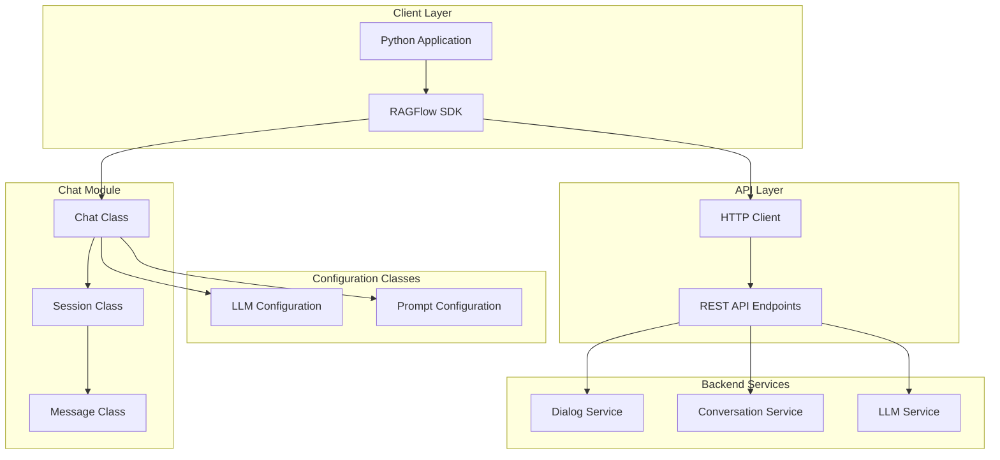
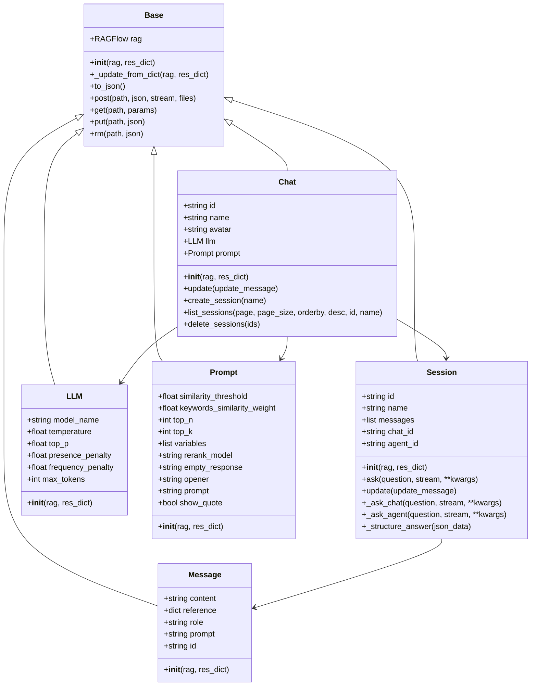
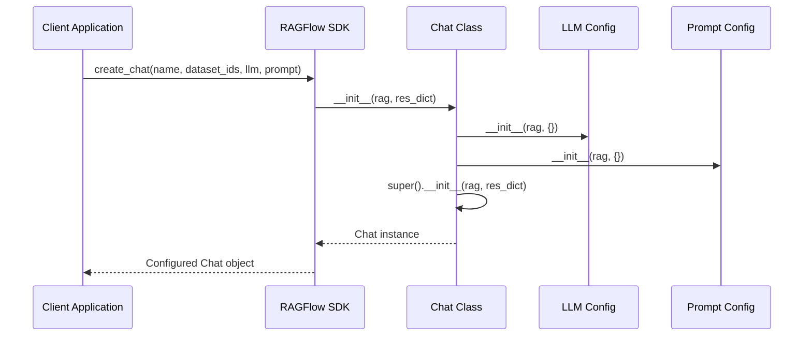
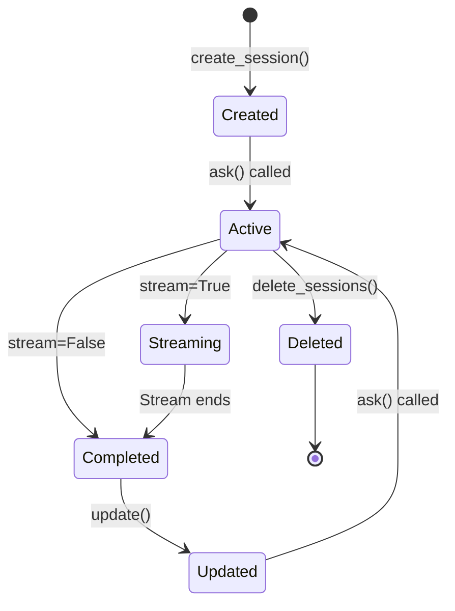
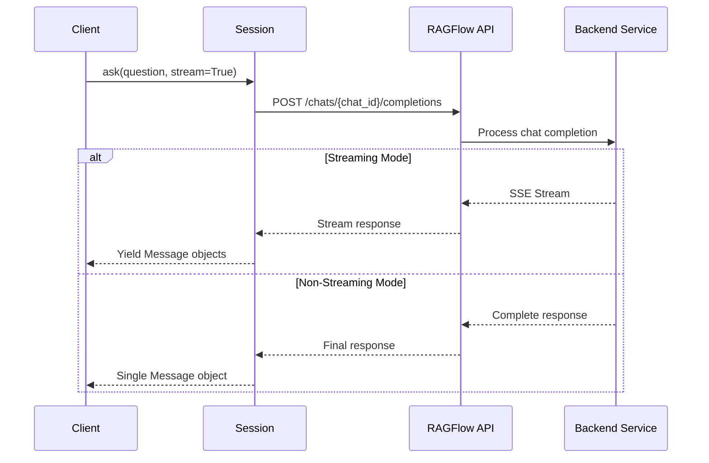
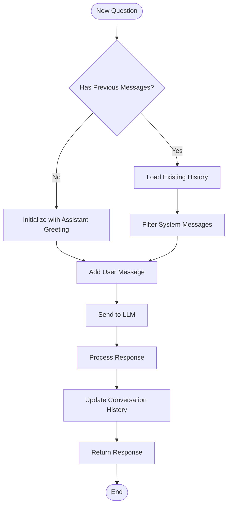
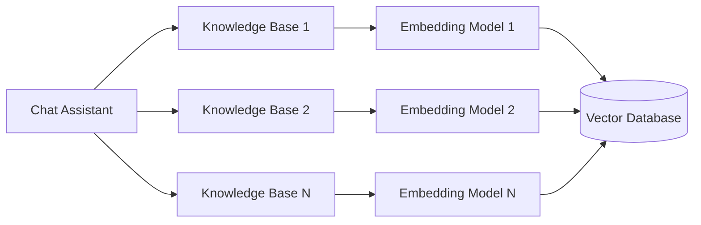
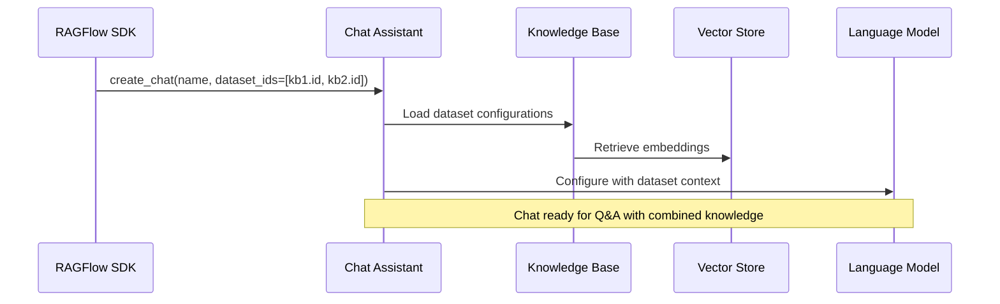
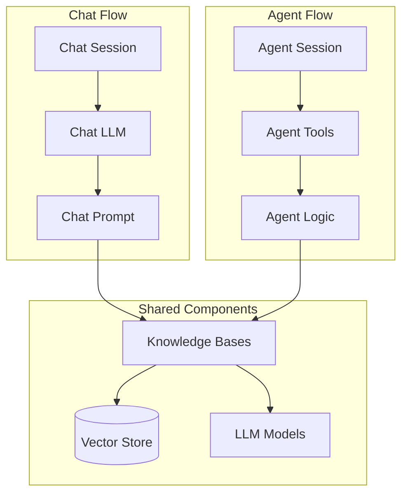
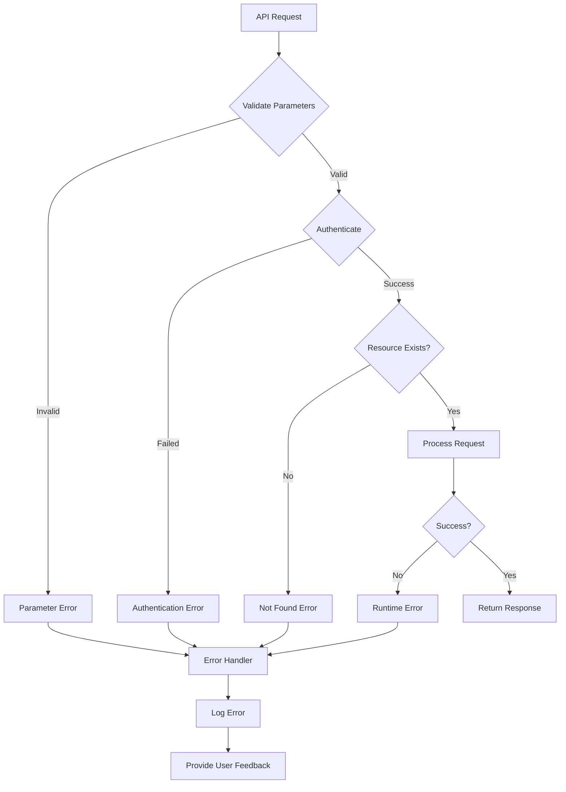

# Chat Module

<cite>
**Referenced Files in This Document**
- [chat.py](file://sdk/python/ragflow_sdk/modules/chat.py)
- [session.py](file://sdk/python/ragflow_sdk/modules/session.py)
- [base.py](file://sdk/python/ragflow_sdk/modules/base.py)
- [ragflow.py](file://sdk/python/ragflow_sdk/ragflow.py)
- [t_chat.py](file://sdk/python/test/test_sdk_api/t_chat.py)
- [t_session.py](file://sdk/python/test/test_sdk_api/t_session.py)
- [conversation_app.py](file://api/apps/conversation_app.py)
- [dialog_app.py](file://api/apps/dialog_app.py)
- [session.py](file://api/apps/sdk/session.py)
</cite>

## Table of Contents
1. [Introduction](#introduction)
2. [Architecture Overview](#architecture-overview)
3. [Core Components](#core-components)
4. [Chat Class Implementation](#chat-class-implementation)
5. [Session Management](#session-management)
6. [Message Exchange Patterns](#message-exchange-patterns)
7. [Configuration and Parameters](#configuration-and-parameters)
8. [Integration Patterns](#integration-patterns)
9. [Error Handling and Exceptions](#error-handling-and-exceptions)
10. [Practical Examples](#practical-examples)
11. [Best Practices](#best-practices)
12. [Troubleshooting Guide](#troubleshooting-guide)

## Introduction

The RAGFlow Python SDK's Chat module provides a comprehensive framework for building AI-powered chat applications with knowledge base integration. The module enables developers to create chat assistants that leverage Retrieval-Augmented Generation (RAG) technology to provide contextually aware responses based on uploaded documents and datasets.

The Chat module consists of several interconnected components that work together to provide seamless conversation experiences:
- **Chat Class**: The main interface for managing chat assistants
- **Session Management**: Handles individual conversation sessions
- **Message Streaming**: Supports real-time response delivery
- **Knowledge Base Integration**: Connects with datasets for context-aware responses
- **Configuration Management**: Controls LLM behavior and prompt engineering

## Architecture Overview

The Chat module follows a layered architecture that separates concerns between API communication, session management, and message processing.



**Diagram sources**
- [ragflow.py](file://sdk/python/ragflow_sdk/ragflow.py#L26-L286)
- [chat.py](file://sdk/python/ragflow_sdk/modules/chat.py#L22-L88)
- [session.py](file://sdk/python/ragflow_sdk/modules/session.py#L21-L129)

## Core Components

The Chat module consists of several key components that work together to provide comprehensive chat functionality:

### Base Class Architecture

All chat-related classes inherit from a common Base class that provides essential functionality for API communication and data serialization.



**Diagram sources**
- [base.py](file://sdk/python/ragflow_sdk/modules/base.py#L18-L59)
- [chat.py](file://sdk/python/ragflow_sdk/modules/chat.py#L22-L88)
- [session.py](file://sdk/python/ragflow_sdk/modules/session.py#L21-L129)

**Section sources**
- [base.py](file://sdk/python/ragflow_sdk/modules/base.py#L18-L59)
- [chat.py](file://sdk/python/ragflow_sdk/modules/chat.py#L22-L88)
- [session.py](file://sdk/python/ragflow_sdk/modules/session.py#L21-L129)

## Chat Class Implementation

The Chat class serves as the primary interface for managing chat assistants within the RAGFlow system. It provides methods for creating, configuring, and managing chat sessions.

### Initialization and Configuration

The Chat class constructor accepts two parameters and initializes various configuration components:



**Diagram sources**
- [chat.py](file://sdk/python/ragflow_sdk/modules/chat.py#L22-L30)
- [ragflow.py](file://sdk/python/ragflow_sdk/ragflow.py#L110-L160)

### Key Methods

#### update Method
Updates chat assistant configuration with new parameters.

**Parameters:**
- `update_message` (dict): Dictionary containing configuration updates

**Returns:** None

**Raises:**
- `Exception`: If the update operation fails

#### create_session Method
Creates a new conversation session within the chat assistant.

**Parameters:**
- `name` (str, optional): Name for the new session. Defaults to "New session"

**Returns:**
- `Session`: New session object

**Raises:**
- `Exception`: If session creation fails

#### list_sessions Method
Retrieves a list of sessions associated with the chat assistant.

**Parameters:**
- `page` (int, optional): Page number for pagination. Defaults to 1
- `page_size` (int, optional): Number of sessions per page. Defaults to 30
- `orderby` (str, optional): Field to sort by. Defaults to "create_time"
- `desc` (bool, optional): Sort order direction. Defaults to True
- `id` (str, optional): Filter by specific session ID
- `name` (str, optional): Filter by session name

**Returns:**
- `list[Session]`: List of session objects

**Raises:**
- `Exception`: If session listing fails

#### delete_sessions Method
Removes one or more sessions from the chat assistant.

**Parameters:**
- `ids` (list[str], optional): List of session IDs to delete. If None, deletes all sessions

**Returns:** None

**Raises:**
- `Exception`: If session deletion fails

**Section sources**
- [chat.py](file://sdk/python/ragflow_sdk/modules/chat.py#L60-L88)

## Session Management

Session management is handled by the Session class, which maintains conversation state and handles message exchanges with the RAGFlow backend.

### Session Types

The Session class supports two types of sessions:
- **Chat Sessions**: Standard chat conversations with knowledge base integration
- **Agent Sessions**: Advanced agent-based conversations with tool integration

### Session Lifecycle



### Message Exchange Flow

The ask() method handles both streaming and non-streaming message exchanges:



**Diagram sources**
- [session.py](file://sdk/python/ragflow_sdk/modules/session.py#L36-L80)
- [session.py](file://api/apps/sdk/session.py#L120-L142)

**Section sources**
- [session.py](file://sdk/python/ragflow_sdk/modules/session.py#L21-L129)

## Message Exchange Patterns

The Chat module supports sophisticated message exchange patterns that enable both real-time and batch interactions.

### Streaming vs Non-Streaming

#### Streaming Mode
Enables real-time response delivery with immediate feedback to users.

**Benefits:**
- Immediate user feedback
- Better perceived performance
- Progressive content delivery
- Cancelable responses

**Implementation:**
- Uses Server-Sent Events (SSE) protocol
- Yields Message objects as they become available
- Supports interruption and cancellation

#### Non-Streaming Mode
Provides complete responses in a single operation.

**Benefits:**
- Simpler client implementation
- Guaranteed complete responses
- Easier error handling
- Batch processing support

### Message Structure

Each message contains comprehensive information about the response:

| Field | Type | Description |
|-------|------|-------------|
| `content` | str | The actual response text |
| `role` | str | Message role ("assistant") |
| `reference` | dict | Source citations and chunks |
| `id` | str | Unique message identifier |
| `prompt` | str | Original prompt used |

### Conversation History Management

The Session class maintains conversation history automatically:



**Diagram sources**
- [session.py](file://sdk/python/ragflow_sdk/modules/session.py#L99-L104)
- [conversation_app.py](file://api/apps/conversation_app.py#L168-L229)

**Section sources**
- [session.py](file://sdk/python/ragflow_sdk/modules/session.py#L36-L80)

## Configuration and Parameters

The Chat module provides extensive configuration options through specialized configuration classes.

### LLM Configuration

The LLM class controls Large Language Model behavior:

| Parameter | Type | Default | Description |
|-----------|------|---------|-------------|
| `model_name` | str | None | LLM model identifier |
| `temperature` | float | 0.1 | Randomness control (0.0-1.0) |
| `top_p` | float | 0.3 | Nucleus sampling threshold |
| `presence_penalty` | float | 0.4 | Penalizes repeated tokens |
| `frequency_penalty` | float | 0.7 | Penalizes frequent tokens |
| `max_tokens` | int | 512 | Maximum response length |

### Prompt Configuration

The Prompt class manages prompt engineering and retrieval settings:

| Parameter | Type | Default | Description |
|-----------|------|---------|-------------|
| `similarity_threshold` | float | 0.2 | Minimum similarity for retrieval |
| `keywords_similarity_weight` | float | 0.7 | Weight for keyword matching |
| `top_n` | int | 8 | Number of chunks to retrieve |
| `top_k` | int | 1024 | Maximum candidates for retrieval |
| `variables` | list | `[{"key": "knowledge", "optional": True}]` | Template variables |
| `rerank_model` | str | "" | Re-ranking model identifier |
| `empty_response` | str | None | Response when no knowledge found |
| `opener` | str | "Hi! I'm your assistant..." | Initial greeting message |
| `show_quote` | bool | True | Whether to show source citations |

### Knowledge Base Integration

Chat assistants can be configured with multiple knowledge bases:



**Diagram sources**
- [ragflow.py](file://sdk/python/ragflow_sdk/ragflow.py#L113-L115)
- [dialog_app.py](file://api/apps/dialog_app.py#L81-L85)

**Section sources**
- [chat.py](file://sdk/python/ragflow_sdk/modules/chat.py#L31-L58)
- [ragflow.py](file://sdk/python/ragflow_sdk/ragflow.py#L110-L160)

## Integration Patterns

The Chat module integrates seamlessly with other RAGFlow SDK components and external systems.

### Dataset Integration

Chat assistants can be connected to multiple datasets for comprehensive knowledge coverage:



**Diagram sources**
- [ragflow.py](file://sdk/python/ragflow_sdk/ragflow.py#L110-L160)

### Agent Integration

The Chat module works alongside the Agent module for complex conversational workflows:



**Diagram sources**
- [session.py](file://sdk/python/ragflow_sdk/modules/session.py#L41-L46)
- [session.py](file://api/apps/sdk/session.py#L445-L483)

### Real-time Integration

The streaming capabilities enable real-time integration with web applications:

| Integration Type | Protocol | Use Case |
|------------------|----------|----------|
| WebSockets | SSE | Live chat interfaces |
| Long Polling | HTTP | Traditional web apps |
| Server Push | HTTP/2 | Modern applications |
| Polling | REST API | Simple integrations |

**Section sources**
- [session.py](file://sdk/python/ragflow_sdk/modules/session.py#L36-L80)
- [ragflow.py](file://sdk/python/ragflow_sdk/ragflow.py#L110-L160)

## Error Handling and Exceptions

The Chat module implements comprehensive error handling to ensure robust operation.

### Common Exception Types

#### Authentication Errors
- **Invalid API Key**: Raised when authentication credentials are invalid
- **Permission Denied**: Occurs when attempting operations without proper access

#### Resource Errors
- **Chat Not Found**: When trying to access non-existent chat assistants
- **Session Not Found**: When operating on deleted or invalid sessions
- **Dataset Not Found**: When knowledge bases are missing or inaccessible

#### Configuration Errors
- **Invalid Parameters**: When required parameters are missing or malformed
- **Model Unavailable**: When specified LLM models are not accessible
- **Knowledge Base Mismatch**: When embedding models don't match

### Error Handling Patterns



### Best Practices for Error Handling

1. **Always Wrap API Calls**: Use try-catch blocks around chat operations
2. **Validate Parameters**: Check required parameters before making requests
3. **Handle Network Issues**: Implement retry logic for transient failures
4. **Log Errors**: Capture detailed error information for debugging
5. **User-Friendly Messages**: Transform technical errors into user-friendly messages

**Section sources**
- [chat.py](file://sdk/python/ragflow_sdk/modules/chat.py#L60-L88)
- [session.py](file://sdk/python/ragflow_sdk/modules/session.py#L113-L119)

## Practical Examples

### Basic Chat Setup

```python
# Initialize RAGFlow SDK
from ragflow_sdk import RAGFlow

rag = RAGFlow(api_key="your-api-key", base_url="http://localhost:9380")

# Create a knowledge base
kb = rag.create_dataset(name="My Knowledge Base")

# Upload documents
with open("document.pdf", "rb") as file:
    blob = file.read()
document = {"display_name": "document.pdf", "blob": blob}
kb.upload_documents([document])

# Create chat assistant
chat = rag.create_chat(
    name="Customer Support Assistant",
    dataset_ids=[kb.id],
    llm=Chat.LLM(
        rag,
        {
            "model_name": "glm-4-flash@ZHIPU-AI",
            "temperature": 0.1,
            "max_tokens": 512
        }
    )
)
```

### Creating and Managing Sessions

```python
# Create a new session
session = chat.create_session(name="Support Session")

# List existing sessions
sessions = chat.list_sessions(
    page=1,
    page_size=10,
    orderby="create_time",
    desc=True
)

# Update session name
session.update({"name": "Updated Support Session"})
```

### Message Exchange with Streaming

```python
# Ask a question with streaming
question = "What are the shipping policies?"
for message in session.ask(question, stream=True):
    print(f"Received: {message.content}")
    if hasattr(message, 'reference') and message.reference:
        print(f"Citations: {len(message.reference)} sources")
```

### Message Exchange without Streaming

```python
# Ask a question without streaming
question = "What are the shipping policies?"
message = next(session.ask(question, stream=False))
print(f"Final Answer: {message.content}")
```

### Advanced Configuration

```python
# Create chat with advanced configuration
advanced_chat = rag.create_chat(
    name="Advanced Assistant",
    dataset_ids=[kb.id],
    llm=Chat.LLM(
        rag,
        {
            "model_name": "glm-4-flash@ZHIPU-AI",
            "temperature": 0.3,
            "top_p": 0.7,
            "max_tokens": 1024,
            "presence_penalty": 0.2,
            "frequency_penalty": 0.5
        }
    ),
    prompt=Chat.Prompt(
        rag,
        {
            "similarity_threshold": 0.3,
            "top_n": 10,
            "top_k": 2048,
            "show_quote": True,
            "opener": "Hello! How can I assist you today?"
        }
    )
)
```

**Section sources**
- [t_chat.py](file://sdk/python/test/test_sdk_api/t_chat.py#L22-L132)
- [t_session.py](file://sdk/python/test/test_sdk_api/t_session.py#L22-L146)

## Best Practices

### Performance Optimization

1. **Session Reuse**: Maintain long-lived sessions for ongoing conversations
2. **Batch Operations**: Group related operations to reduce API calls
3. **Caching**: Implement client-side caching for frequently accessed data
4. **Connection Pooling**: Use persistent connections for high-frequency operations

### Security Considerations

1. **API Key Management**: Store API keys securely using environment variables
2. **Input Validation**: Sanitize user inputs to prevent injection attacks
3. **Access Control**: Implement proper authentication and authorization
4. **Audit Logging**: Log all chat operations for security monitoring

### User Experience Guidelines

1. **Progressive Loading**: Use streaming for better perceived performance
2. **Error Recovery**: Provide graceful fallbacks for failed operations
3. **Context Awareness**: Maintain conversation context across sessions
4. **Accessibility**: Support screen readers and keyboard navigation

### Monitoring and Maintenance

1. **Metrics Collection**: Track response times and success rates
2. **Health Checks**: Monitor API availability and performance
3. **Logging**: Implement comprehensive logging for debugging
4. **Rate Limiting**: Respect API rate limits to avoid service disruption

## Troubleshooting Guide

### Common Issues and Solutions

#### Issue: "Chat not found" Error
**Cause**: Attempting to access a non-existent chat assistant
**Solution**: Verify chat ID exists before performing operations
```python
try:
    chat = rag.list_chats(id="nonexistent-id")
except Exception as e:
    print(f"Chat not found: {e}")
```

#### Issue: "Session not found" Error
**Cause**: Operating on deleted or invalid session
**Solution**: Refresh session list before using session IDs
```python
sessions = chat.list_sessions()
if not sessions:
    session = chat.create_session()
```

#### Issue: Streaming Responses Not Working
**Cause**: Server-side streaming disabled or network issues
**Solution**: Fall back to non-streaming mode
```python
try:
    for message in session.ask(question, stream=True):
        process_message(message)
except Exception:
    # Fallback to non-streaming
    message = next(session.ask(question, stream=False))
    process_message(message)
```

#### Issue: Poor Response Quality
**Cause**: Suboptimal prompt configuration or insufficient knowledge base
**Solution**: Adjust prompt parameters and expand knowledge base
```python
chat.update({
    "prompt": {
        "similarity_threshold": 0.2,
        "top_n": 12,
        "show_quote": True
    }
})
```

### Debugging Techniques

1. **Enable Logging**: Set appropriate log levels for detailed debugging
2. **API Inspection**: Use network inspection tools to monitor requests
3. **Response Analysis**: Examine response structures for unexpected data
4. **Error Context**: Capture surrounding context when errors occur

### Performance Tuning

| Metric | Target | Optimization Strategy |
|--------|--------|----------------------|
| Response Time | < 2 seconds | Reduce top_n, optimize embeddings |
| Throughput | > 100 req/sec | Implement connection pooling |
| Memory Usage | < 500MB | Implement session cleanup |
| Error Rate | < 1% | Add retry logic and circuit breakers |

**Section sources**
- [chat.py](file://sdk/python/ragflow_sdk/modules/chat.py#L60-L88)
- [session.py](file://sdk/python/ragflow_sdk/modules/session.py#L113-L119)