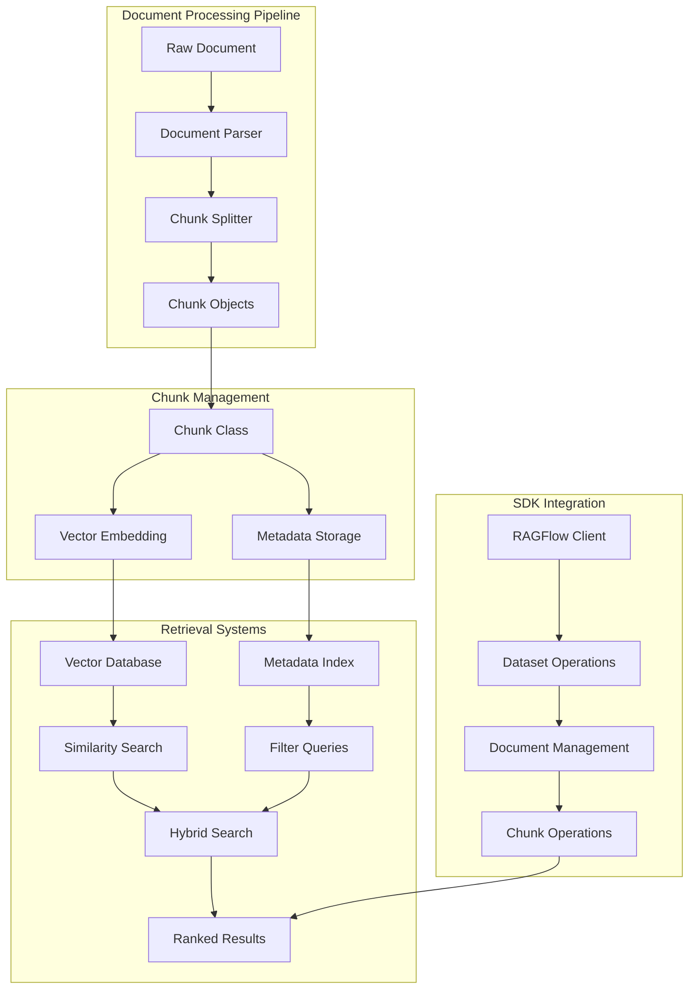
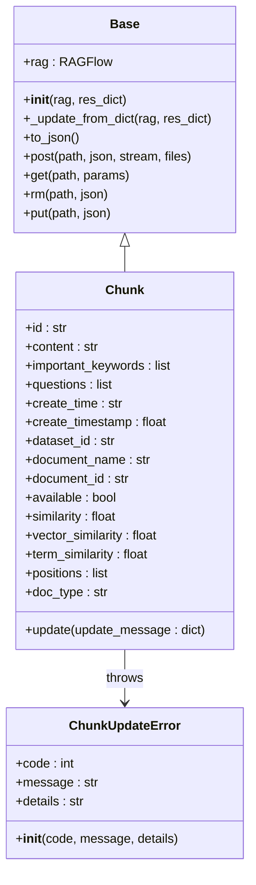
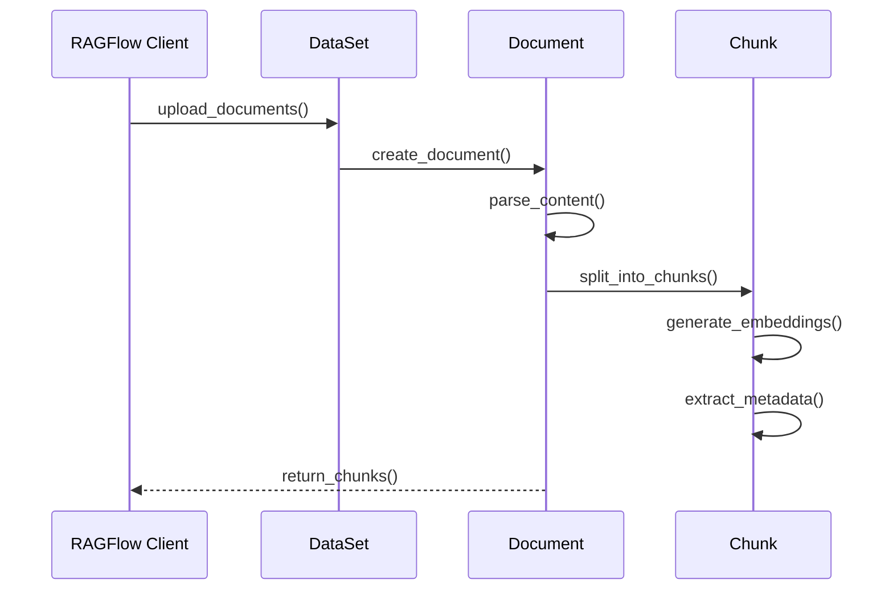
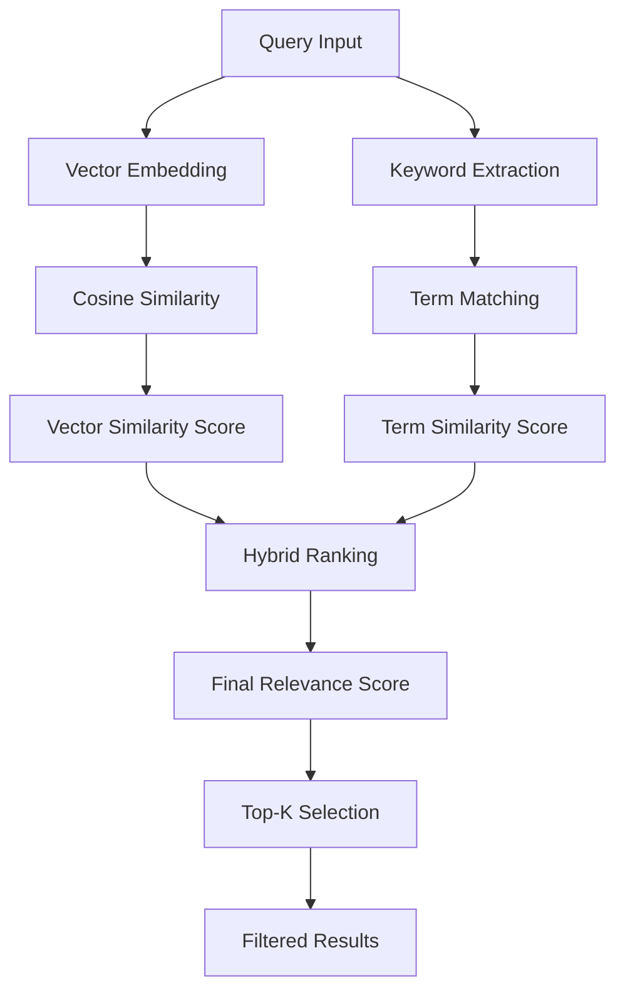
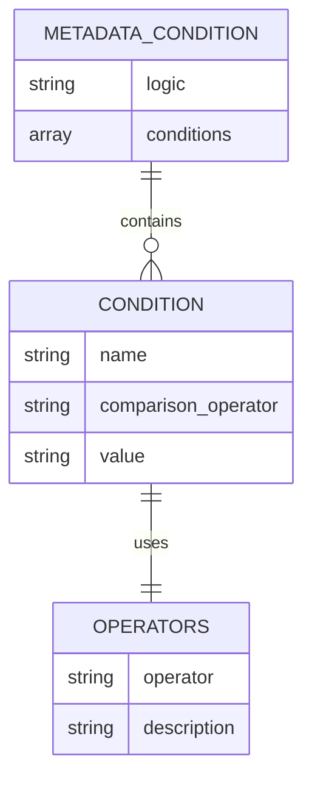

# Chunk Module

<cite>
**Referenced Files in This Document**
- [chunk.py](file://sdk/python/ragflow_sdk/modules/chunk.py)
- [base.py](file://sdk/python/ragflow_sdk/modules/base.py)
- [document.py](file://sdk/python/ragflow_sdk/modules/document.py)
- [dataset.py](file://sdk/python/ragflow_sdk/modules/dataset.py)
- [t_chunk.py](file://sdk/python/test/test_sdk_api/t_chunk.py)
- [search_app.py](file://api/apps/search_app.py)
- [doc.py](file://api/apps/sdk/doc.py)
- [search.py](file://rag/nlp/search.py)
- [query.py](file://rag/nlp/query.py)
- [ob_conn.py](file://rag/utils/ob_conn.py)
- [es_conn.py](file://rag/utils/es_conn.py)
</cite>

## Table of Contents
1. [Introduction](#introduction)
2. [Architecture Overview](#architecture-overview)
3. [Chunk Class Implementation](#chunk-class-implementation)
4. [Core Methods and Properties](#core-methods-and-properties)
5. [Integration with Document Processing](#integration-with-document-processing)
6. [Vector Database and Retrieval Systems](#vector-database-and-retrieval-systems)
7. [Metadata Filtering and Search](#metadata-filtering-and-search)
8. [Performance Optimization](#performance-optimization)
9. [Common Use Cases and Examples](#common-use-cases-and-examples)
10. [Troubleshooting and Best Practices](#troubleshooting-and-best-practices)

## Introduction

The Chunk module in RAGFlow's Python SDK serves as the fundamental building block for managing and retrieving text segments within datasets. Chunks represent discrete portions of documents that are processed, indexed, and searchable within the RAG (Retrieval-Augmented Generation) system. This module provides comprehensive functionality for chunk creation, management, retrieval, and integration with various search and retrieval workflows.

The Chunk class acts as a bridge between raw document content and the sophisticated retrieval systems, enabling efficient semantic search, metadata filtering, and relevance scoring across large document collections.

## Architecture Overview

The Chunk module integrates seamlessly with RAGFlow's document processing pipeline and retrieval infrastructure:



**Diagram sources**
- [chunk.py](file://sdk/python/ragflow_sdk/modules/chunk.py#L26-L56)
- [document.py](file://sdk/python/ragflow_sdk/modules/document.py#L23-L102)
- [dataset.py](file://sdk/python/ragflow_sdk/modules/dataset.py#L21-L154)

## Chunk Class Implementation

The Chunk class inherits from the Base class and provides specialized functionality for chunk management within RAGFlow's system.

### Class Structure



**Diagram sources**
- [chunk.py](file://sdk/python/ragflow_sdk/modules/chunk.py#L25-L56)
- [base.py](file://sdk/python/ragflow_sdk/modules/base.py#L18-L58)

### Constructor and Initialization

The Chunk constructor accepts two parameters:
- `rag`: The RAGFlow client instance
- `res_dict`: A dictionary containing chunk data

During initialization, the class sets up default values for all chunk properties and filters incoming data to ensure only valid fields are retained.

**Section sources**
- [chunk.py](file://sdk/python/ragflow_sdk/modules/chunk.py#L26-L46)

## Core Methods and Properties

### Essential Properties

| Property | Type | Description | Default Value |
|----------|------|-------------|---------------|
| `id` | str | Unique identifier for the chunk | "" |
| `content` | str | Text content of the chunk | "" |
| `important_keywords` | list | Extracted important keywords | [] |
| `questions` | list | Generated questions about the content | [] |
| `create_time` | str | Creation timestamp | "" |
| `create_timestamp` | float | Unix timestamp of creation | 0.0 |
| `dataset_id` | str | Associated dataset identifier | None |
| `document_name` | str | Parent document name | "" |
| `document_id` | str | Parent document identifier | "" |
| `available` | bool | Availability status for retrieval | True |

### Additional Fields for Retrieval Results

| Property | Type | Description | Default Value |
|----------|------|-------------|---------------|
| `similarity` | float | Overall similarity score | 0.0 |
| `vector_similarity` | float | Vector-based similarity | 0.0 |
| `term_similarity` | float | Term-based similarity | 0.0 |
| `positions` | list | Character position coordinates | [] |
| `doc_type` | str | Document type classification | "" |

### Update Method

The `update` method allows modification of chunk properties:

```python
def update(self, update_message: dict):
    res = self.put(f"/datasets/{self.dataset_id}/documents/{self.document_id}/chunks/{self.id}", update_message)
    res = res.json()
    if res.get("code") != 0:
        raise ChunkUpdateError(
            code=res.get("code"),
            message=res.get("message"),
            details=res.get("details")
        )
```

**Section sources**
- [chunk.py](file://sdk/python/ragflow_sdk/modules/chunk.py#L48-L56)

## Integration with Document Processing

### Document-Chunk Relationship

Chunks are created during the document parsing and splitting process. Each document can contain multiple chunks, forming a hierarchical relationship:



**Diagram sources**
- [document.py](file://sdk/python/ragflow_sdk/modules/document.py#L80-L102)
- [dataset.py](file://sdk/python/ragflow_sdk/modules/dataset.py#L53-L64)

### Chunk Creation Workflow

The document processing pipeline creates chunks through several stages:

1. **Content Parsing**: Raw document content is parsed according to the configured parser
2. **Chunk Splitting**: Content is divided into manageable segments based on size or structure
3. **Metadata Extraction**: Important keywords, questions, and positioning information are extracted
4. **Vector Embedding**: Text embeddings are generated for semantic search
5. **Indexing**: Chunks are indexed in vector databases and metadata stores

**Section sources**
- [document.py](file://sdk/python/ragflow_sdk/modules/document.py#L90-L95)

## Vector Database and Retrieval Systems

### Similarity Scoring

RAGFlow employs multiple similarity metrics for chunk retrieval:



**Diagram sources**
- [search.py](file://rag/nlp/search.py#L220-L233)
- [query.py](file://rag/nlp/query.py#L220-L228)

### Retrieval Parameters

The retrieval system supports extensive customization through various parameters:

| Parameter | Type | Description | Range |
|-----------|------|-------------|-------|
| `similarity_threshold` | float | Minimum similarity score | 0.0 - 1.0 |
| `vector_similarity_weight` | float | Weight for vector similarity | 0.0 - 1.0 |
| `top_k` | int | Maximum number of results | 1 - 1000 |
| `page` | int | Page number for pagination | 1+ |
| `page_size` | int | Results per page | 1 - 100 |
| `keyword` | bool | Enable keyword search | true/false |

### Vector Database Integration

RAGFlow supports multiple vector database backends:

- **Elasticsearch**: Full-text and vector search capabilities
- **OpenSearch**: Alternative Elasticsearch-compatible solution
- **OceanBase**: High-performance vector database
- **Infinity**: Specialized vector search engine

**Section sources**
- [ob_conn.py](file://rag/utils/ob_conn.py#L732-L763)
- [es_conn.py](file://rag/utils/es_conn.py#L195-L226)

## Metadata Filtering and Search

### Metadata Condition Structure

The system supports complex metadata filtering using logical operators:



**Diagram sources**
- [doc.py](file://api/apps/sdk/doc.py#L280-L293)

### Available Comparison Operators

| Operator | Description | Example |
|----------|-------------|---------|
| `=` | Equality | `{"name": "author", "operator": "=", "value": "John Doe"}` |
| `!=` | Inequality | `{"name": "status", "operator": "!=", "value": "draft"}` |
| `contains` | Substring match | `{"name": "tags", "operator": "contains", "value": "python"}` |
| `not contains` | Negative substring | `{"name": "category", "operator": "not contains", "value": "spam"}` |

### Filter Implementation

The metadata filtering system processes conditions through a sophisticated evaluation engine that supports both AND and OR logic combinations.

**Section sources**
- [doc.py](file://api/apps/sdk/doc.py#L296-L306)

## Performance Optimization

### Retrieval Performance Factors

Several factors influence chunk retrieval performance:

1. **Index Size**: Larger indices require more memory and processing time
2. **Query Complexity**: Complex metadata filters increase processing overhead
3. **Vector Dimensions**: Higher-dimensional vectors require more computation
4. **Network Latency**: Remote vector databases introduce latency
5. **Caching Strategy**: Effective caching reduces redundant computations

### Optimization Strategies

#### Vector Similarity Weight Tuning

The vector similarity weight controls the balance between semantic and keyword search:

```python
# Optimal weight distribution depends on use case
vector_weight = 0.7  # Emphasize semantic search
term_weight = 0.3    # Support keyword matching
```

#### Pagination and Limiting

Implement efficient pagination to manage large result sets:

```python
# Recommended pagination settings
page = 1
page_size = 30  # Balanced performance and usability
similarity_threshold = 0.2  # Filter low-relevance results
```

#### Batch Processing

For bulk operations, use batch processing to minimize API calls:

```python
# Process multiple chunks efficiently
chunk_ids = [chunk.id for chunk in chunks]
document.delete_chunks(chunk_ids)
```

**Section sources**
- [search.py](file://rag/nlp/search.py#L430-L445)

## Common Use Cases and Examples

### Basic Chunk Retrieval

```python
# Retrieve chunks for a specific question
chunks = client.retrieve(
    question="What is machine learning?",
    dataset_ids=[dataset.id],
    similarity_threshold=0.2,
    vector_similarity_weight=0.7
)
```

### Advanced Filtering

```python
# Filter by metadata conditions
metadata_filter = {
    "logic": "and",
    "conditions": [
        {"name": "author", "comparison_operator": "=", "value": "researcher"},
        {"name": "year", "comparison_operator": ">=", "value": "2020"}
    ]
}

chunks = client.retrieve(
    question="AI applications",
    dataset_ids=[dataset.id],
    metadata_condition=metadata_filter
)
```

### Chunk Management Operations

```python
# List all chunks in a document
chunks = document.list_chunks(page=1, page_size=50)

# Add a new chunk
new_chunk = document.add_chunk(
    content="New content to be indexed",
    important_keywords=["keyword1", "keyword2"],
    questions=["What does this mean?", "Why is this important?"]
)

# Update chunk properties
new_chunk.update({"content": "Updated content"})

# Delete specific chunks
document.delete_chunks([chunk.id for chunk in chunks_to_remove])
```

### Retrieval with Highlighting

```python
# Enable result highlighting for better context
chunks = client.retrieve(
    question="machine learning algorithms",
    dataset_ids=[dataset.id],
    highlight=True,
    similarity_threshold=0.3
)

# Access highlighted content
for chunk in chunks:
    print(f"Original: {chunk.content}")
    print(f"Highlighted: {chunk.highlight}")
```

**Section sources**
- [t_chunk.py](file://sdk/python/test/test_sdk_api/t_chunk.py#L196-L216)

## Troubleshooting and Best Practices

### Common Issues and Solutions

#### Chunk Update Failures

**Problem**: `ChunkUpdateError` exceptions during chunk updates
**Solution**: Verify chunk availability and check for concurrent modifications

```python
try:
    chunk.update({"content": "new content"})
except ChunkUpdateError as e:
    print(f"Update failed: {e.message}")
    # Implement retry logic or fallback
```

#### Low Retrieval Quality

**Problem**: Poor relevance scores or irrelevant results
**Solution**: Adjust similarity thresholds and weights

```python
# Increase similarity threshold for higher quality
similarity_threshold = 0.3  # From default 0.2

# Balance semantic and keyword search
vector_weight = 0.8
term_weight = 0.2
```

#### Performance Issues

**Problem**: Slow retrieval responses
**Solution**: Optimize query parameters and implement caching

```python
# Use appropriate page sizes
page_size = 20  # Instead of large values

# Set reasonable similarity thresholds
similarity_threshold = 0.25

# Consider caching frequently accessed chunks
```

### Best Practices

#### Chunk Content Guidelines

1. **Optimal Size**: Keep chunks between 100-500 tokens for optimal retrieval
2. **Logical Boundaries**: Split content at natural boundaries (paragraphs, sections)
3. **Context Preservation**: Ensure each chunk contains sufficient context
4. **Keyword Density**: Include important keywords for better searchability

#### Metadata Management

1. **Consistent Naming**: Use standardized metadata field names
2. **Hierarchical Structure**: Organize metadata in logical categories
3. **Validation**: Implement metadata validation to prevent errors
4. **Documentation**: Document custom metadata fields for team collaboration

#### Retrieval Optimization

1. **Query Engineering**: Craft precise, focused search queries
2. **Parameter Tuning**: Experiment with similarity weights and thresholds
3. **Monitoring**: Track retrieval performance metrics
4. **Feedback Loop**: Incorporate user feedback into system tuning

### Error Handling Patterns

```python
def robust_chunk_retrieval(client, question, dataset_id):
    try:
        chunks = client.retrieve(
            question=question,
            dataset_ids=[dataset_id],
            similarity_threshold=0.2,
            top_k=10
        )
        return chunks
    except Exception as e:
        logging.error(f"Retrieval failed: {e}")
        # Implement fallback strategy
        return client.retrieve(
            question=question,
            dataset_ids=[dataset_id],
            similarity_threshold=0.1,  # Lower threshold
            top_k=5  # Fewer results
        )
```

**Section sources**
- [chunk.py](file://sdk/python/ragflow_sdk/modules/chunk.py#L19-L25)
- [t_chunk.py](file://sdk/python/test/test_sdk_api/t_chunk.py#L152-L171)