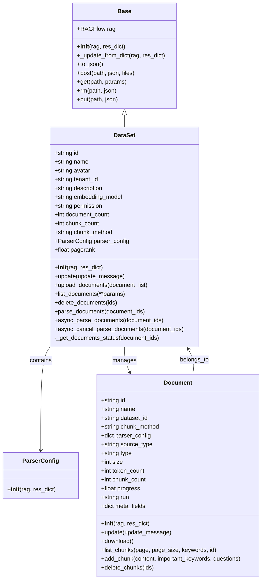
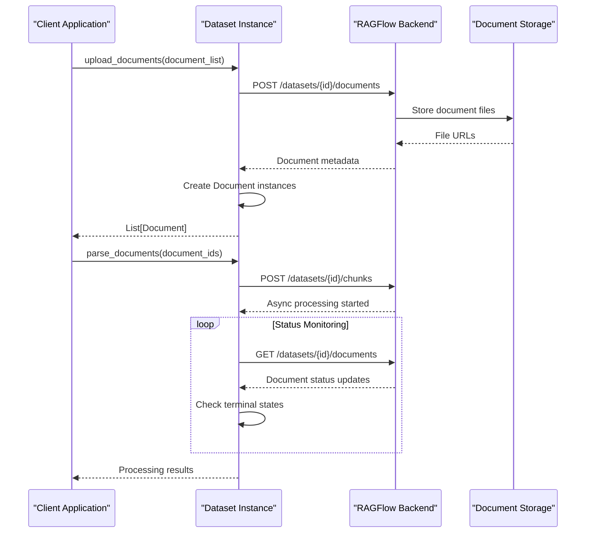
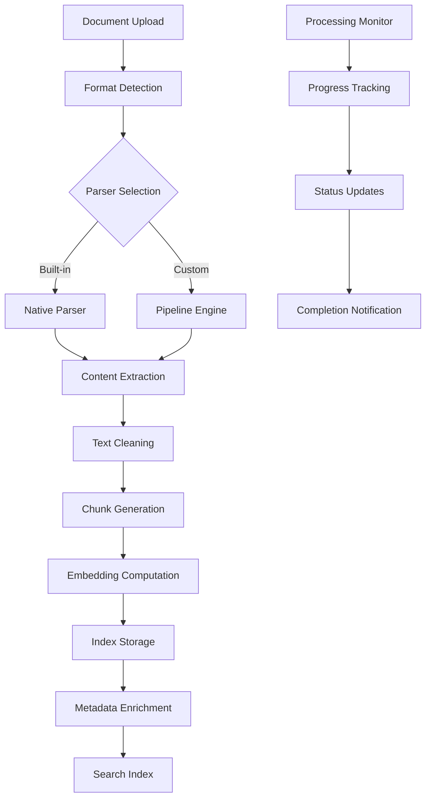
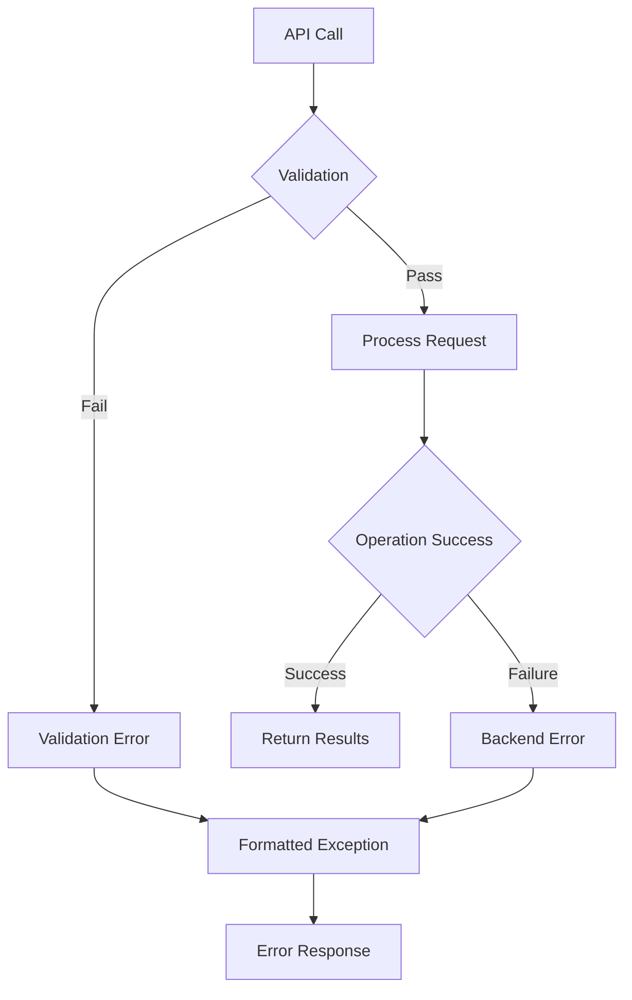

# Dataset Module

<cite>
**Referenced Files in This Document**
- [dataset.py](file://sdk/python/ragflow_sdk/modules/dataset.py)
- [base.py](file://sdk/python/ragflow_sdk/modules/base.py)
- [ragflow.py](file://sdk/python/ragflow_sdk/ragflow.py)
- [document.py](file://sdk/python/ragflow_sdk/modules/document.py)
- [dataset_example.py](file://example/sdk/dataset_example.py)
- [t_dataset.py](file://sdk/python/test/test_sdk_api/t_dataset.py)
- [dataset.py](file://api/apps/sdk/dataset.py)
- [db_models.py](file://api/db/db_models.py)
- [validation_utils.py](file://api/utils/validation_utils.py)
- [api_utils.py](file://api/utils/api_utils.py)
</cite>

## Table of Contents
1. [Introduction](#introduction)
2. [Dataset Class Architecture](#dataset-class-architecture)
3. [Core Methods and Operations](#core-methods-and-operations)
4. [Configuration Management](#configuration-management)
5. [Document Processing Integration](#document-processing-integration)
6. [Storage and Retrieval Systems](#storage-and-retrieval-systems)
7. [Error Handling and Validation](#error-handling-and-validation)
8. [Integration Patterns](#integration-patterns)
9. [Best Practices and Examples](#best-practices-and-examples)
10. [Troubleshooting Guide](#troubleshooting-guide)

## Introduction

The Dataset module in RAGFlow's Python SDK serves as the central hub for managing knowledge bases and document processing workflows. It provides comprehensive functionality for creating, configuring, and managing datasets that serve as containers for documents, chunks, and associated metadata. The module integrates seamlessly with RAGFlow's document ingestion pipelines, knowledge base systems, and storage infrastructure.

Datasets act as logical containers that organize documents into meaningful units, enabling efficient retrieval and processing. They support various chunking methods, parser configurations, and embedding models, making them versatile for different use cases from simple document collections to complex knowledge graphs.

## Dataset Class Architecture

The Dataset class inherits from the Base class and provides a robust foundation for dataset management operations. The architecture follows a modular design pattern that separates concerns between dataset management, document processing, and configuration handling.



**Diagram sources**
- [dataset.py](file://sdk/python/ragflow_sdk/modules/dataset.py#L21-L154)
- [base.py](file://sdk/python/ragflow_sdk/modules/base.py#L18-L59)
- [document.py](file://sdk/python/ragflow_sdk/modules/document.py#L23-L102)

**Section sources**
- [dataset.py](file://sdk/python/ragflow_sdk/modules/dataset.py#L21-L42)
- [base.py](file://sdk/python/ragflow_sdk/modules/base.py#L18-L59)

## Core Methods and Operations

### Dataset Creation and Initialization

The Dataset class provides comprehensive methods for dataset lifecycle management, from creation to deletion. The initialization process handles automatic cleanup of unrecognized fields and establishes the connection to the RAGFlow backend.

#### Constructor and Initialization

The constructor accepts a RAGFlow instance and a result dictionary, populating dataset attributes while filtering out unknown fields. This design ensures backward compatibility and prevents configuration errors.

#### Update Operations

The `update()` method enables modification of dataset properties including name, description, embedding model, and parser configuration. Updates are performed atomically and validated against the backend schema.

#### Document Management Operations

The module provides extensive document management capabilities:

- **Upload Documents**: Batch upload of document files with automatic MIME type detection
- **List Documents**: Comprehensive querying with filtering, pagination, and sorting
- **Delete Documents**: Selective removal of documents with cascade effects
- **Status Monitoring**: Real-time tracking of document processing states



**Diagram sources**
- [dataset.py](file://sdk/python/ragflow_sdk/modules/dataset.py#L53-L154)

**Section sources**
- [dataset.py](file://sdk/python/ragflow_sdk/modules/dataset.py#L26-L52)
- [dataset.py](file://sdk/python/ragflow_sdk/modules/dataset.py#L44-L52)

### Asynchronous Processing Operations

The dataset module implements sophisticated asynchronous processing capabilities for document parsing and chunking operations. These operations support cancellation and provide real-time status monitoring.

#### Document Parsing Workflow

The parsing process involves multiple stages:
1. **Async Initiation**: Starts document processing asynchronously
2. **Status Tracking**: Monitors processing progress and completion
3. **Cancellation Support**: Allows interruption of long-running operations
4. **Result Collection**: Gathers and validates processing outcomes

#### Error Recovery Mechanisms

The system implements robust error recovery through:
- **Retry Logic**: Automatic retry for transient failures
- **Graceful Degradation**: Partial processing completion
- **State Persistence**: Recovery from interruptions
- **Cleanup Procedures**: Resource cleanup on failure

**Section sources**
- [dataset.py](file://sdk/python/ragflow_sdk/modules/dataset.py#L132-L154)

## Configuration Management

### Parser Configuration System

The parser configuration system provides fine-grained control over document processing behavior. The ParserConfig class encapsulates all configuration parameters and supports validation and merging of default values.

#### Configuration Hierarchy

The configuration system follows a hierarchical approach:
1. **Default Values**: Built-in defaults for each chunking method
2. **User Overrides**: Custom configurations provided by users
3. **Validation Rules**: Type checking and constraint enforcement
4. **Merging Logic**: Intelligent combination of defaults and user settings

#### Supported Chunking Methods

The system supports multiple chunking strategies:

| Method | Description | Use Case | Configuration Options |
|--------|-------------|----------|----------------------|
| naive | Basic token-based splitting | General documents | chunk_token_num, delimiter |
| book | Structured book processing | Books, manuals | chapter_detection, section_breaks |
| paper | Academic paper processing | Research papers | abstract_processing, reference_handling |
| table | Table-aware chunking | Spreadsheet data | table_detection, cell_context |
| qa | Question-answer pairs | FAQ documents | question_patterns, answer_formatting |
| laws | Legal document processing | Legal texts | section_structures, citation_handling |

#### Advanced Configuration Features

- **Auto Keyword Generation**: Automatic extraction of important terms
- **Auto Question Generation**: Intelligent question creation from content
- **Graph RAG Integration**: Knowledge graph construction capabilities
- **RAPTOR Support**: Hierarchical summarization features
- **Custom Delimiters**: Flexible text segmentation options

**Section sources**
- [dataset.py](file://sdk/python/ragflow_sdk/modules/dataset.py#L22-L25)
- [validation_utils.py](file://api/utils/validation_utils.py#L476-L536)
- [api_utils.py](file://api/utils/api_utils.py#L386-L418)

### Embedding Model Configuration

The embedding model configuration determines how text content is converted to vector representations for similarity search and retrieval operations.

#### Model Selection Criteria

When selecting embedding models, consider:
- **Language Support**: Multilingual vs. single-language models
- **Dimensionality**: Vector size requirements and memory usage
- **Performance**: Processing speed and computational resources
- **Quality**: Accuracy and relevance for your domain
- **Cost**: Licensing and operational expenses

#### Configuration Parameters

Key embedding model parameters include:
- **Model Name**: Specific model identifier
- **Provider**: Model hosting service or local deployment
- **Dimensions**: Vector representation size
- **Normalization**: Vector normalization preferences
- **Batch Size**: Processing batch configuration

**Section sources**
- [ragflow.py](file://sdk/python/ragflow_sdk/ragflow.py#L70-L76)

## Document Processing Integration

### Pipeline Integration

Datasets integrate with RAGFlow's document processing pipelines, which handle the complete transformation from raw documents to searchable chunks. The integration supports both built-in parsers and custom pipeline configurations.



**Diagram sources**
- [task_executor.py](file://rag/svr/task_executor.py#L501-L531)
- [document_service.py](file://api/db/services/document_service.py#L951-L983)

### Knowledge Base Integration

Datasets serve as the foundation for knowledge bases, providing the organizational structure and processing capabilities needed for effective retrieval-augmented generation (RAG) applications.

#### Knowledge Base Features

- **Hierarchical Organization**: Nested document structures
- **Metadata Management**: Rich metadata tagging and filtering
- **Version Control**: Document versioning and change tracking
- **Access Control**: Granular permission management
- **Search Optimization**: Optimized indexing for fast retrieval

#### Integration Patterns

The dataset module supports various integration patterns:
- **Single Dataset**: Simple document collection setup
- **Multi-Dataset**: Organizational separation by category
- **Linked Datasets**: Cross-referenced knowledge bases
- **Template Datasets**: Reusable configuration templates

**Section sources**
- [db_models.py](file://api/db/db_models.py#L751-L1038)

## Storage and Retrieval Systems

### Document Storage Architecture

The storage system provides scalable document management with support for various file formats and large-scale deployments.

#### Storage Backends

The system supports multiple storage backends:
- **Local Storage**: File system-based storage for development
- **Cloud Storage**: AWS S3, Azure Blob, Google Cloud Storage
- **Object Storage**: MinIO, OpenStack Swift compatible systems
- **Database Storage**: Embedded storage for small datasets

#### File Format Support

Comprehensive format support includes:
- **Text Documents**: TXT, MD, HTML, XML
- **Office Documents**: DOCX, XLSX, PPTX
- **PDF Documents**: Standard PDF with OCR support
- **Image Documents**: PNG, JPG, TIFF with OCR
- **Specialized Formats**: JSON, CSV, YAML, Markdown

### Retrieval System Integration

The retrieval system provides fast, accurate search capabilities powered by vector embeddings and hybrid search algorithms.

#### Search Capabilities

- **Vector Search**: Semantic similarity matching
- **Keyword Search**: Exact text matching
- **Hybrid Search**: Combined vector and keyword results
- **Metadata Filtering**: Advanced filtering by document properties
- **Cross-Language Search**: Multi-language query support

#### Performance Optimization

Key optimization strategies include:
- **Index Partitioning**: Distributed index management
- **Caching Strategies**: Intelligent result caching
- **Batch Processing**: Efficient bulk operations
- **Compression**: Storage and network optimization

**Section sources**
- [infinity_conn.py](file://rag/utils/infinity_conn.py#L525-L582)

## Error Handling and Validation

### Input Validation System

The dataset module implements comprehensive input validation to ensure data integrity and prevent common configuration errors.

#### Validation Layers

1. **Type Validation**: Parameter type checking and conversion
2. **Range Validation**: Numeric bounds and limits
3. **Format Validation**: String format and pattern matching
4. **Dependency Validation**: Cross-parameter consistency checks
5. **Business Logic Validation**: Domain-specific rules

#### Common Validation Errors

| Error Type | Description | Resolution |
|------------|-------------|------------|
| Name Conflicts | Duplicate dataset names | Use unique names or update existing |
| Permission Errors | Insufficient access rights | Verify user permissions |
| Size Limits | Exceeding quota limits | Reduce dataset size or upgrade plan |
| Format Errors | Unsupported file formats | Convert to supported formats |
| Configuration Errors | Invalid parser settings | Review configuration parameters |

### Exception Handling Patterns

The system implements consistent exception handling patterns:



**Diagram sources**
- [validation_utils.py](file://api/utils/validation_utils.py#L476-L536)

**Section sources**
- [validation_utils.py](file://api/utils/validation_utils.py#L476-L536)
- [dataset.py](file://sdk/python/ragflow_sdk/modules/dataset.py#L44-L52)

## Integration Patterns

### SDK Module Integration

The dataset module integrates seamlessly with other SDK components, providing a cohesive development experience.

#### Client-Server Communication

The communication protocol follows RESTful principles with JSON payloads and HTTP status codes. The system supports both synchronous and asynchronous operations.

#### Authentication and Authorization

- **API Key Authentication**: Secure API access
- **Token-Based Sessions**: Session management
- **Permission Scoping**: Role-based access control
- **Tenant Isolation**: Multi-tenant support

### External System Integration

#### Third-Party Services

The dataset module supports integration with external services:
- **Data Sources**: Google Drive, Dropbox, SharePoint
- **Processing Engines**: Custom parsers and processors
- **Storage Systems**: External cloud storage providers
- **Monitoring Tools**: Logging and metrics aggregation

#### Webhook Integration

Webhook support enables real-time notifications for:
- **Processing Events**: Document completion and failure
- **System Events**: Configuration changes and updates
- **User Actions**: Manual operations and approvals
- **Maintenance Events**: System maintenance and updates

**Section sources**
- [ragflow.py](file://sdk/python/ragflow_sdk/ragflow.py#L70-L109)

## Best Practices and Examples

### Dataset Creation Best Practices

#### Naming Conventions

Follow consistent naming patterns:
- Use descriptive, meaningful names
- Include version information when appropriate
- Avoid special characters and spaces
- Maintain uniqueness across tenants

#### Configuration Guidelines

Optimal configuration strategies:
- Choose appropriate chunking methods for content type
- Configure embedding models based on language and domain
- Set reasonable token limits for chunk size
- Enable auto-generation features for metadata

### Common Use Cases

#### Simple Document Collection

For basic document storage and retrieval:
```python
# Create dataset with default configuration
dataset = ragflow.create_dataset("My Documents")
```

#### Multi-Language Knowledge Base

For international content management:
```python
# Configure multilingual embedding model
dataset = ragflow.create_dataset(
    name="International Knowledge Base",
    embedding_model="multilingual-embedding",
    chunk_method="naive"
)
```

#### Structured Content Processing

For specialized document types:
```python
# Configure for academic papers
parser_config = {
    "chunk_token_num": 1024,
    "auto_keywords": 5,
    "auto_questions": 3
}
dataset = ragflow.create_dataset(
    name="Research Papers",
    chunk_method="paper",
    parser_config=parser_config
)
```

### Performance Optimization

#### Batch Operations

Use batch operations for efficiency:
- Upload multiple documents in single requests
- Process documents in batches for better throughput
- Leverage parallel processing where possible

#### Memory Management

Optimize memory usage:
- Process large documents in chunks
- Clear unused references promptly
- Monitor memory consumption during operations

**Section sources**
- [dataset_example.py](file://example/sdk/dataset_example.py#L21-L54)
- [t_dataset.py](file://sdk/python/test/test_sdk_api/t_dataset.py#L24-L78)

## Troubleshooting Guide

### Common Issues and Solutions

#### Dataset Creation Failures

**Problem**: Dataset creation fails with validation errors
**Solution**: 
- Verify required parameters are provided
- Check for name conflicts
- Ensure embedding model availability
- Review permission settings

#### Document Upload Issues

**Problem**: Document upload fails or hangs
**Solution**:
- Check file size limits
- Verify file format support
- Ensure network connectivity
- Review storage quota limits

#### Processing Timeout Errors

**Problem**: Document processing takes too long or times out
**Solution**:
- Adjust chunk size parameters
- Increase timeout values
- Check system resource availability
- Monitor processing queue status

#### Retrieval Performance Issues

**Problem**: Search results are slow or inaccurate
**Solution**:
- Optimize embedding model selection
- Adjust similarity thresholds
- Review index configuration
- Check hardware resource utilization

### Debugging Techniques

#### Logging and Monitoring

Enable detailed logging for troubleshooting:
- Set appropriate log levels
- Monitor API response times
- Track error rates and patterns
- Analyze system resource usage

#### Diagnostic Commands

Use diagnostic tools for problem identification:
- Check dataset status and configuration
- Monitor document processing queues
- Verify storage system health
- Review network connectivity

### Performance Tuning

#### System Configuration

Optimize system settings:
- Adjust thread pool sizes
- Configure memory allocation
- Tune database connection pools
- Optimize network timeouts

#### Application Configuration

Fine-tune application settings:
- Select appropriate chunking methods
- Configure optimal embedding models
- Set reasonable processing parameters
- Enable caching where beneficial

**Section sources**
- [validation_utils.py](file://api/utils/validation_utils.py#L476-L536)
- [dataset.py](file://sdk/python/ragflow_sdk/modules/dataset.py#L105-L131)