# Document Module

<cite>
**Referenced Files in This Document**
- [document.py](file://sdk/python/ragflow_sdk/modules/document.py)
- [base.py](file://sdk/python/ragflow_sdk/modules/base.py)
- [chunk.py](file://sdk/python/ragflow_sdk/modules/chunk.py)
- [dataset.py](file://sdk/python/ragflow_sdk/modules/dataset.py)
- [ragflow.py](file://sdk/python/ragflow_sdk/ragflow.py)
- [document_app.py](file://api/apps/document_app.py)
- [t_document.py](file://sdk/python/test/test_sdk_api/t_document.py)
- [test_parse_documents.py](file://test/testcases/test_sdk_api/test_file_management_within_dataset/test_parse_documents.py)
</cite>

## Table of Contents
1. [Introduction](#introduction)
2. [Architecture Overview](#architecture-overview)
3. [Document Class Implementation](#document-class-implementation)
4. [Core Methods and Functionality](#core-methods-and-functionality)
5. [Document Status Monitoring](#document-status-monitoring)
6. [Integration with Dataset Processing Pipelines](#integration-with-dataset-processing-pipelines)
7. [Storage Systems and Parsing Engines](#storage-systems-and-parsing-engines)
8. [Document Upload Workflows](#document-upload-workflows)
9. [Parsing Configuration](#parsing-configuration)
10. [Error Handling and Common Issues](#error-handling-and-common-issues)
11. [Best Practices and Examples](#best-practices-and-examples)
12. [Troubleshooting Guide](#troubleshooting-guide)

## Introduction

The Document module in RAGFlow's Python SDK provides comprehensive functionality for managing documents within knowledge bases. It serves as the primary interface for uploading, parsing, monitoring, and managing documents throughout their lifecycle in RAGFlow's document processing pipeline. The module handles various document types, supports multiple parsing engines, and integrates seamlessly with RAGFlow's storage systems and processing infrastructure.

The Document class acts as a central abstraction representing individual documents within datasets, providing methods for document manipulation, status tracking, and integration with RAGFlow's sophisticated parsing and chunking systems.

## Architecture Overview

The Document module follows a layered architecture that separates concerns between API communication, document representation, and business logic:

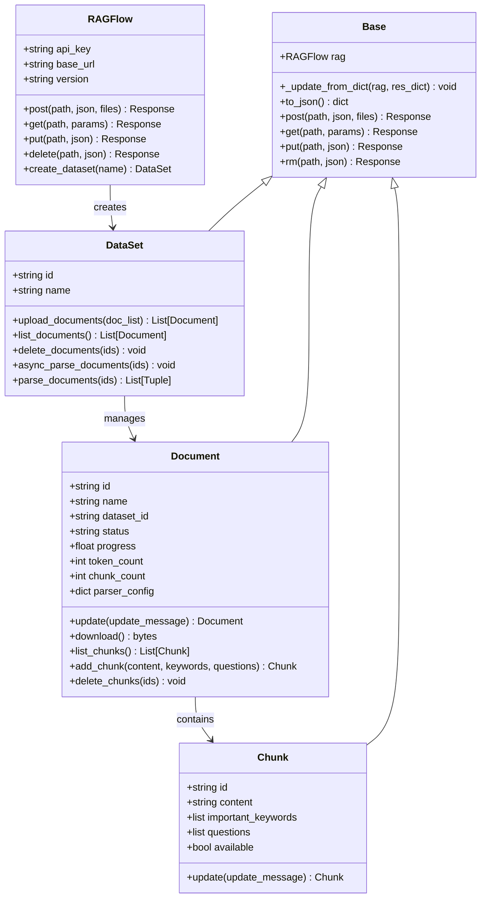

**Diagram sources**
- [ragflow.py](file://sdk/python/ragflow_sdk/ragflow.py#L26-L286)
- [dataset.py](file://sdk/python/ragflow_sdk/modules/dataset.py#L21-L154)
- [document.py](file://sdk/python/ragflow_sdk/modules/document.py#L23-L102)
- [chunk.py](file://sdk/python/ragflow_sdk/modules/chunk.py#L26-L57)
- [base.py](file://sdk/python/ragflow_sdk/modules/base.py#L18-L59)

## Document Class Implementation

The Document class serves as the primary interface for document management within RAGFlow's SDK. It inherits from the Base class and provides comprehensive functionality for document operations.

### Class Structure and Initialization

The Document class maintains several key attributes that represent the document's state and metadata:

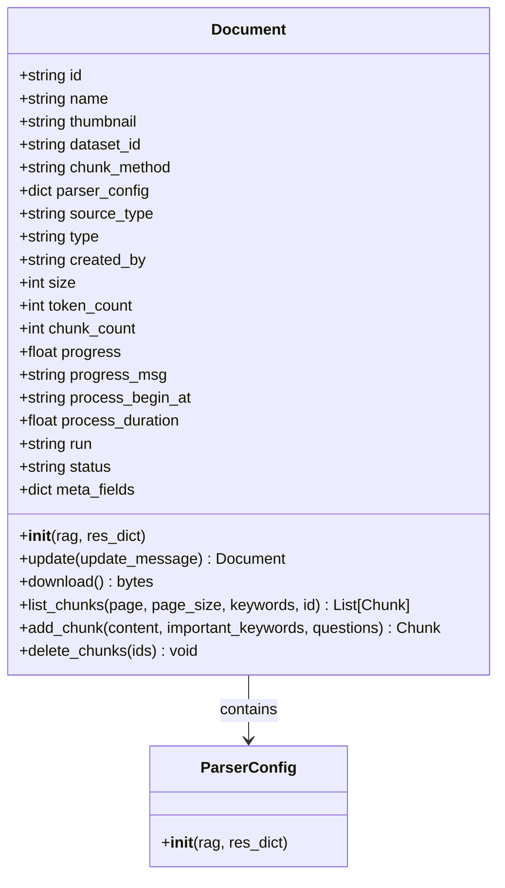

**Diagram sources**
- [document.py](file://sdk/python/ragflow_sdk/modules/document.py#L23-L102)

### Key Attributes

| Attribute | Type | Description | Default Value |
|-----------|------|-------------|---------------|
| `id` | string | Unique document identifier | "" |
| `name` | string | Display name of the document | "" |
| `thumbnail` | string/None | Thumbnail image data | None |
| `dataset_id` | string/None | Associated dataset identifier | None |
| `chunk_method` | string | Chunking strategy | "naive" |
| `parser_config` | dict | Parser configuration settings | {"pages": [[1, 1000000]]} |
| `source_type` | string | Document source type | "local" |
| `type` | string | File type classification | "" |
| `created_by` | string | User who created the document | "" |
| `size` | int | Document size in bytes | 0 |
| `token_count` | int | Number of tokens after parsing | 0 |
| `chunk_count` | int | Number of chunks created | 0 |
| `progress` | float | Parsing progress percentage | 0.0 |
| `progress_msg` | string | Current progress message | "" |
| `process_begin_at` | string/None | Processing start timestamp | None |
| `process_duration` | float | Total processing duration | 0.0 |
| `run` | string | Current processing status | "0" |
| `status` | string | Document availability status | "1" |
| `meta_fields` | dict | Custom metadata fields | {} |

**Section sources**
- [document.py](file://sdk/python/ragflow_sdk/modules/document.py#L28-L47)

## Core Methods and Functionality

### Document Update Method

The `update()` method allows modification of document properties and metadata:

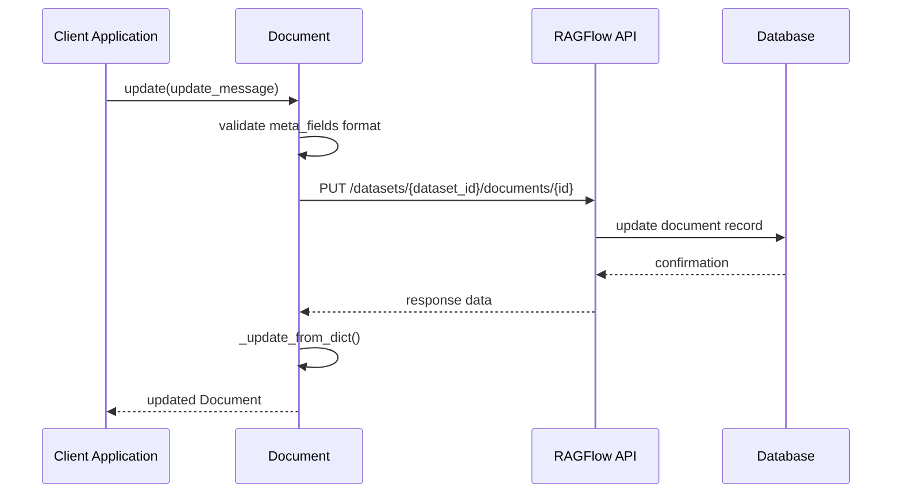

**Diagram sources**
- [document.py](file://sdk/python/ragflow_sdk/modules/document.py#L53-L63)

**Method Signature:**
```python
def update(self, update_message: dict) -> Document
```

**Parameters:**
- `update_message`: Dictionary containing fields to update
  - `meta_fields`: Custom metadata (must be dictionary type)
  - Other document properties can be updated

**Returns:** Updated Document instance

**Exceptions:**
- Raises Exception if `meta_fields` is not a dictionary
- Raises Exception for API errors

### Document Download Method

The `download()` method retrieves document content from RAGFlow's storage system:

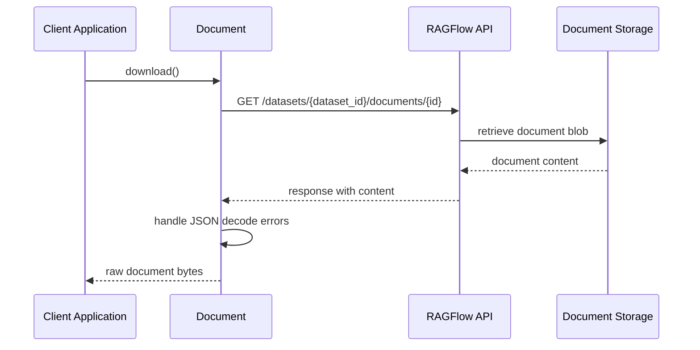

**Diagram sources**
- [document.py](file://sdk/python/ragflow_sdk/modules/document.py#L65-L76)

**Method Signature:**
```python
def download(self) -> bytes
```

**Returns:** Raw document content as bytes

**Exception Handling:**
- Handles JSON decode errors gracefully
- Returns raw content even if JSON parsing fails

### Chunk Management Methods

The Document class provides comprehensive chunk management functionality:

#### List Chunks Method
Lists all chunks associated with a document with filtering capabilities:

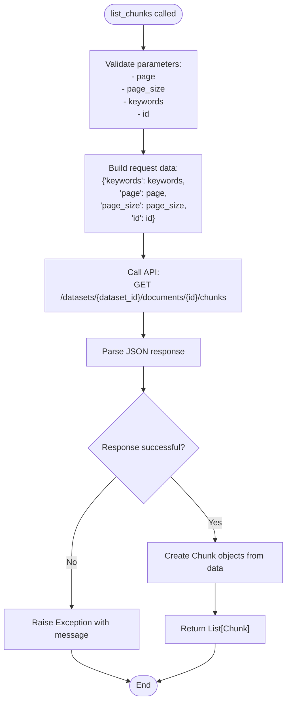

**Diagram sources**
- [document.py](file://sdk/python/ragflow_sdk/modules/document.py#L78-L88)

#### Add Chunk Method
Creates new chunks within a document:

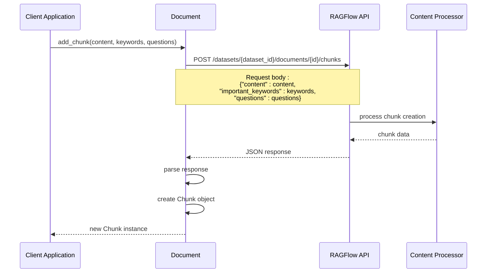

**Diagram sources**
- [document.py](file://sdk/python/ragflow_sdk/modules/document.py#L90-L95)

#### Delete Chunks Method
Removes specified chunks from a document:

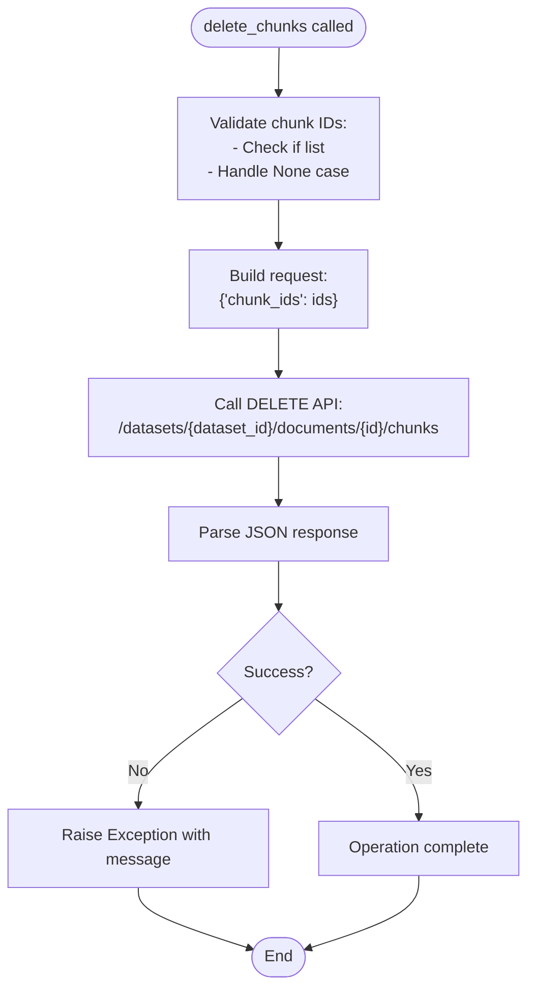

**Diagram sources**
- [document.py](file://sdk/python/ragflow_sdk/modules/document.py#L97-L102)

**Section sources**
- [document.py](file://sdk/python/ragflow_sdk/modules/document.py#L53-L102)

## Document Status Monitoring

RAGFlow provides comprehensive document status monitoring capabilities through the Document class and integrated status tracking mechanisms.

### Status Tracking Architecture

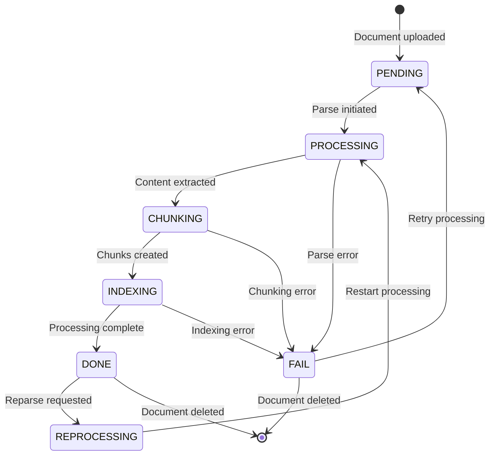

### Status Properties

The Document class tracks several key status indicators:

| Property | Type | Description | Possible Values |
|----------|------|-------------|-----------------|
| `status` | string | Document availability | "1" (active), "0" (inactive) |
| `run` | string | Processing status | "0" (unstarted), "1" (running), "2" (done), "3" (failed), "4" (cancelled) |
| `progress` | float | Progress percentage | 0.0 to 1.0 |
| `progress_msg` | string | Current progress message | Human-readable status |
| `process_begin_at` | string/None | Processing start timestamp | ISO format timestamp |
| `process_duration` | float | Total processing time (seconds) | Positive number |
| `token_count` | int | Total tokens processed | Non-negative integer |
| `chunk_count` | int | Total chunks created | Non-negative integer |

### Status Monitoring Workflow

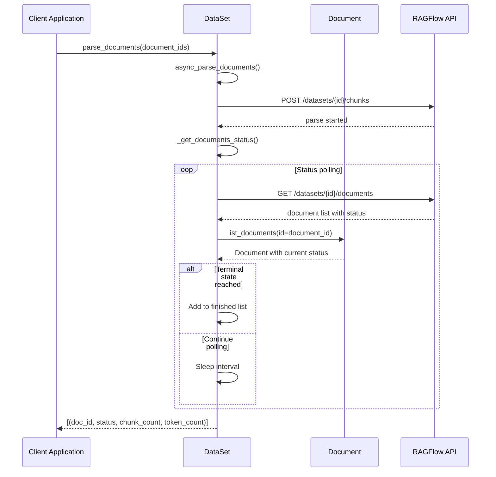

**Diagram sources**
- [dataset.py](file://sdk/python/ragflow_sdk/modules/dataset.py#L105-L130)
- [document.py](file://sdk/python/ragflow_sdk/modules/document.py#L78-L88)

**Section sources**
- [dataset.py](file://sdk/python/ragflow_sdk/modules/dataset.py#L105-L130)
- [test_parse_documents.py](file://test/testcases/test_sdk_api/test_file_management_within_dataset/test_parse_documents.py#L36-L65)

## Integration with Dataset Processing Pipelines

The Document module integrates seamlessly with RAGFlow's dataset processing pipelines, providing a unified interface for document management within knowledge bases.

### Dataset-Document Relationship

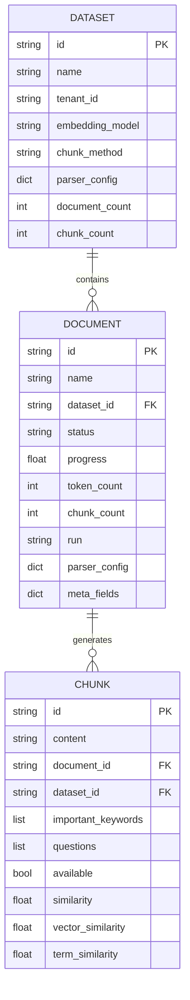

**Diagram sources**
- [dataset.py](file://sdk/python/ragflow_sdk/modules/dataset.py#L21-L154)
- [document.py](file://sdk/python/ragflow_sdk/modules/document.py#L23-L102)
- [chunk.py](file://sdk/python/ragflow_sdk/modules/chunk.py#L26-L57)

### Pipeline Integration Points

The Document class interacts with multiple pipeline components:

1. **Upload Pipeline**: Document creation and initial processing
2. **Parsing Pipeline**: Content extraction and structure analysis
3. **Chunking Pipeline**: Content segmentation and tokenization
4. **Indexing Pipeline**: Vector and metadata indexing
5. **Storage Pipeline**: Document persistence and retrieval

### Processing Flow Integration

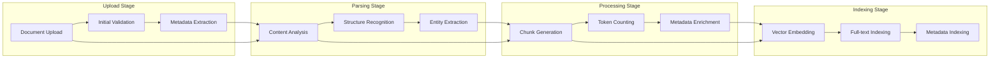

**Section sources**
- [dataset.py](file://sdk/python/ragflow_sdk/modules/dataset.py#L53-L103)
- [document_app.py](file://api/apps/document_app.py#L50-L83)

## Storage Systems and Parsing Engines

RAGFlow's Document module supports multiple storage backends and parsing engines, providing flexibility for different deployment scenarios and document types.

### Supported Storage Systems

| Storage Type | Description | Use Case |
|--------------|-------------|----------|
| Local Storage | File system storage | Development, small deployments |
| MinIO | S3-compatible object storage | Production deployments |
| Azure Blob | Microsoft Azure storage | Cloud-native deployments |
| AWS S3 | Amazon Simple Storage Service | Enterprise deployments |
| OSS | Alibaba Cloud Object Storage | Chinese cloud deployments |
| OpenDAL | Unified data access layer | Multi-cloud support |

### Document Type Support

The Document module handles various document formats through specialized parsers:

| File Extension | Parser Type | Capabilities |
|----------------|-------------|--------------|
| `.pdf` | PDF Parser | Text extraction, images, tables |
| `.docx` | DOCX Parser | Rich text, formatting, embedded objects |
| `.xlsx` | Excel Parser | Spreadsheets, formulas, charts |
| `.pptx` | PowerPoint Parser | Slides, notes, multimedia |
| `.txt` | TXT Parser | Plain text content |
| `.md` | Markdown Parser | Structured text with formatting |
| `.html` | HTML Parser | Web content, structured markup |
| `.json` | JSON Parser | Structured data, APIs |
| `.jpg/.png` | Image Parser | OCR, visual content analysis |
| `.mp3/.wav` | Audio Parser | Speech recognition, transcription |

### Parsing Engine Architecture

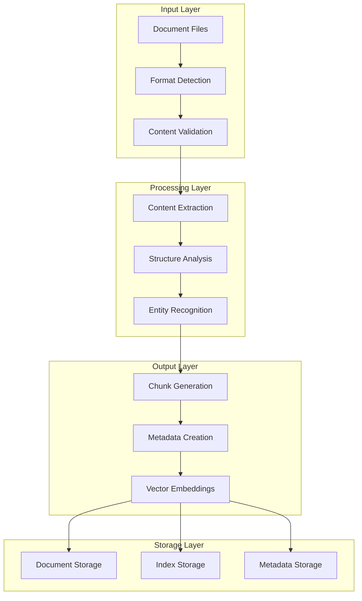

**Section sources**
- [document_app.py](file://api/apps/document_app.py#L50-L83)
- [ragflow.py](file://sdk/python/ragflow_sdk/ragflow.py#L26-L286)

## Document Upload Workflows

The Document module supports multiple upload workflows to accommodate different use cases and document sources.

### Basic Upload Workflow

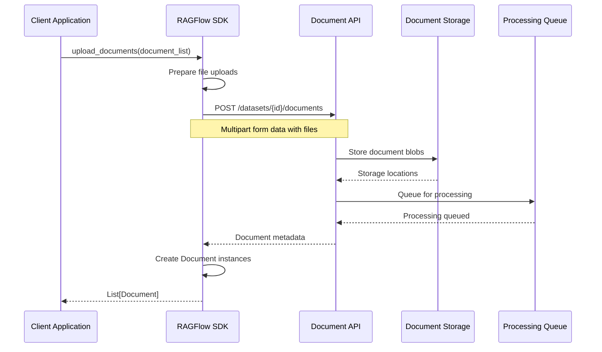

**Diagram sources**
- [dataset.py](file://sdk/python/ragflow_sdk/modules/dataset.py#L53-L63)
- [document_app.py](file://api/apps/document_app.py#L50-L83)

### Upload Method Implementation

The `upload_documents()` method in the DataSet class handles document uploads:

```python
def upload_documents(self, document_list: list[dict]):
    url = f"/datasets/{self.id}/documents"
    files = [("file", (ele["display_name"], ele["blob"])) for ele in document_list]
    res = self.post(path=url, json=None, files=files)
    res = res.json()
    if res.get("code") == 0:
        doc_list = []
        for doc in res["data"]:
            document = Document(self.rag, doc)
            doc_list.append(document)
        return doc_list
    raise Exception(res.get("message"))
```

### Upload Parameters

Each document in the upload list requires:

| Parameter | Type | Description | Required |
|-----------|------|-------------|----------|
| `display_name` | string | Filename with extension | Yes |
| `blob` | bytes | Raw document content | Yes |

### Upload Validation

The upload process includes several validation steps:

1. **File Size Validation**: Checks against configured limits
2. **Format Validation**: Verifies supported file types
3. **Name Validation**: Ensures valid filenames
4. **Permission Validation**: Confirms user access rights

**Section sources**
- [dataset.py](file://sdk/python/ragflow_sdk/modules/dataset.py#L53-L63)
- [t_document.py](file://sdk/python/test/test_sdk_api/t_document.py#L22-L32)

## Parsing Configuration

RAGFlow provides extensive parsing configuration options to customize document processing according to specific requirements.

### Parser Configuration Structure

The Document class supports flexible parser configuration through the `parser_config` attribute:

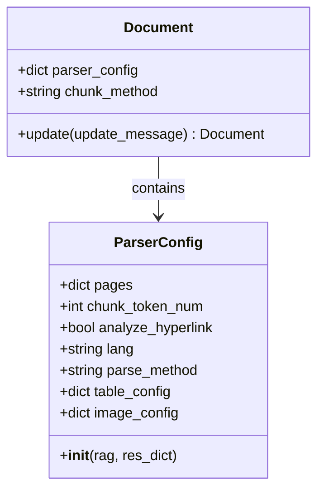

**Diagram sources**
- [document.py](file://sdk/python/ragflow_sdk/modules/document.py#L24-L26)

### Configuration Options by Document Type

#### PDF Documents
```python
pdf_config = {
    "pages": [[1, 100]],  # Process pages 1-100
    "chunk_token_num": 128,
    "lang": "en",
    "parse_method": "general"
}
```

#### Office Documents
```python
office_config = {
    "chunk_token_num": 256,
    "analyze_hyperlink": True,
    "pages": [[1, 50]]
}
```

#### Text Documents
```python
text_config = {
    "chunk_token_num": 128,
    "lang": "auto"
}
```

#### Image Documents
```python
image_config = {
    "lang": "en",
    "system_prompt": "Analyze this image content"
}
```

### Chunking Strategies

| Strategy | Description | Use Case |
|----------|-------------|----------|
| `naive` | Simple character-based splitting | General purpose |
| `semantic` | Meaning-aware chunking | High-quality content |
| `paragraph` | Paragraph-based splitting | Structured documents |
| `custom` | User-defined boundaries | Specialized requirements |

### Advanced Configuration Options

```python
advanced_config = {
    "chunk_token_num": 512,           # Target tokens per chunk
    "overlap": 50,                    # Overlap between chunks
    "min_chunk_size": 10,             # Minimum chunk size
    "max_chunk_size": 2000,           # Maximum chunk size
    "separator": ["\n", ".", "。"],    # Chunk separators
    "language": "en",                 # Processing language
    "table_result_type": "markdown",  # Table format
    "image_context_size": 1000        # Image context window
}
```

**Section sources**
- [document.py](file://sdk/python/ragflow_sdk/modules/document.py#L33-L34)
- [dataset.py](file://sdk/python/ragflow_sdk/modules/dataset.py#L22-L25)

## Error Handling and Common Issues

The Document module implements comprehensive error handling to manage various failure scenarios during document processing.

### Common Error Scenarios

#### File Format Compatibility Issues

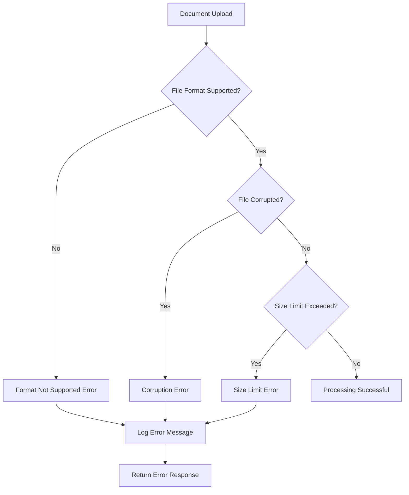

#### Parsing Errors

Common parsing failures and their solutions:

| Error Type | Cause | Solution |
|------------|-------|----------|
| `Unsupported format` | File extension not recognized | Convert to supported format |
| `Corrupted file` | Malformed document structure | Verify file integrity |
| `Memory error` | Large file size | Increase memory allocation |
| `Timeout error` | Long processing time | Adjust timeout settings |
| `Encoding error` | Character encoding issues | Specify correct encoding |

### Error Handling Patterns

#### Document Update Errors
```python
try:
    document.update({"meta_fields": {"key": "value"}})
except Exception as e:
    if "meta_fields must be a dictionary" in str(e):
        # Handle invalid meta_fields format
        pass
    else:
        # Handle other update errors
        pass
```

#### Download Errors
```python
try:
    content = document.download()
except Exception as e:
    # Handle download failures
    logging.error(f"Failed to download document {document.id}: {e}")
    # Implement retry logic or fallback
```

#### Chunk Management Errors
```python
try:
    chunk = document.add_chunk("New content", ["keyword1", "keyword2"])
except Exception as e:
    # Handle chunk creation failures
    if "duplicate" in str(e).lower():
        # Handle duplicate chunk scenario
        pass
    else:
        # Handle other chunk errors
        pass
```

### Large File Handling

For large documents, RAGFlow implements several optimization strategies:

1. **Streaming Processing**: Processes large files in chunks
2. **Memory Management**: Monitors memory usage during processing
3. **Progress Tracking**: Provides real-time progress updates
4. **Cancellation Support**: Allows stopping long-running operations

### Network and Connectivity Issues

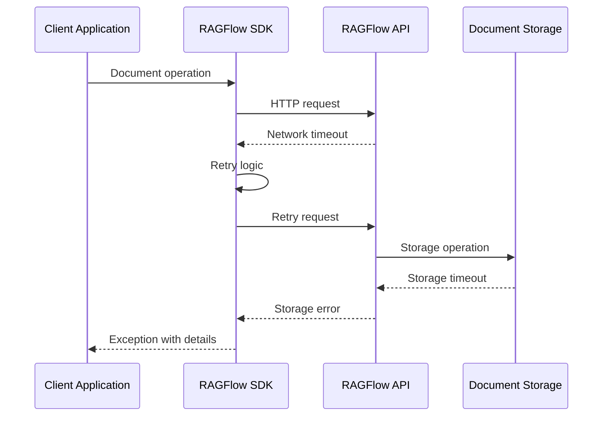

**Section sources**
- [document.py](file://sdk/python/ragflow_sdk/modules/document.py#L53-L63)
- [document_app.py](file://api/apps/document_app.py#L50-L83)

## Best Practices and Examples

### Basic Document Management

#### Creating and Managing Documents

```python
# Initialize RAGFlow client
rag = RAGFlow(api_key="your-api-key", base_url="http://localhost:9380")

# Create dataset
dataset = rag.create_dataset(name="My Knowledge Base")

# Upload documents
with open("document.pdf", "rb") as file:
    blob = file.read()
    documents = dataset.upload_documents([
        {"display_name": "document.pdf", "blob": blob}
    ])

# Access document properties
document = documents[0]
print(f"Document: {document.name}")
print(f"Tokens: {document.token_count}")
print(f"Chunks: {document.chunk_count}")
print(f"Status: {document.status}")
```

#### Document Status Monitoring

```python
# Monitor document processing
def monitor_document_progress(document):
    while document.run != "DONE":
        print(f"Progress: {document.progress:.2%} - {document.progress_msg}")
        
        # Wait before checking again
        time.sleep(5)
        
        # Refresh document status
        docs = dataset.list_documents(id=document.id)
        document = docs[0]
    
    print(f"Processing complete: {document.chunk_count} chunks, {document.token_count} tokens")

# Start monitoring
monitor_document_progress(documents[0])
```

### Advanced Document Operations

#### Custom Parsing Configuration

```python
# Configure custom parser settings
from ragflow_sdk.modules.dataset import DataSet

# Create dataset with custom parser
parser_config = DataSet.ParserConfig(rag, {
    "chunk_token_num": 256,
    "pages": [[1, 50]],
    "lang": "en",
    "parse_method": "general"
})

dataset = rag.create_dataset(
    name="Technical Documents",
    parser_config=parser_config
)

# Upload and parse documents
documents = dataset.upload_documents([{
    "display_name": "technical_manual.pdf",
    "blob": technical_manual_content
}])

# Monitor parsing completion
results = dataset.parse_documents([documents[0].id])
print(f"Processed: {results}")
```

#### Bulk Document Operations

```python
# Upload multiple documents
document_list = []
for filename in ["doc1.pdf", "doc2.docx", "doc3.txt"]:
    with open(filename, "rb") as file:
        document_list.append({
            "display_name": filename,
            "blob": file.read()
        })

documents = dataset.upload_documents(document_list)

# Batch parse documents
document_ids = [doc.id for doc in documents]
results = dataset.parse_documents(document_ids)

# Process results
for doc_id, status, chunk_count, token_count in results:
    print(f"Document {doc_id}: {status} - {chunk_count} chunks, {token_count} tokens")
```

#### Metadata Management

```python
# Add custom metadata
document = documents[0]
document.update({
    "meta_fields": {
        "category": "technical_manual",
        "version": "1.2.3",
        "author": "John Doe",
        "tags": ["manual", "technical", "reference"]
    }
})

# Retrieve and display metadata
updated_doc = dataset.list_documents(id=document.id)[0]
print(f"Metadata: {updated_doc.meta_fields}")

# Download document content
content = document.download()
with open("downloaded_document.pdf", "wb") as f:
    f.write(content)
```

### Error Handling Best Practices

#### Robust Document Upload

```python
def robust_upload_documents(dataset, files):
    successful_docs = []
    failed_docs = []
    
    for file_info in files:
        try:
            documents = dataset.upload_documents([file_info])
            successful_docs.extend(documents)
            print(f"Successfully uploaded: {file_info['display_name']}")
            
            # Start parsing immediately
            if documents:
                dataset.async_parse_documents([documents[0].id])
                
        except Exception as e:
            failed_docs.append({
                "filename": file_info["display_name"],
                "error": str(e)
            })
            print(f"Failed to upload {file_info['display_name']}: {e}")
    
    return successful_docs, failed_docs
```

#### Graceful Error Recovery

```python
def safe_document_operation(document, operation_func):
    max_retries = 3
    retry_delay = 5
    
    for attempt in range(max_retries):
        try:
            return operation_func()
        except Exception as e:
            if attempt == max_retries - 1:
                raise e
            
            print(f"Attempt {attempt + 1} failed: {e}")
            print(f"Retrying in {retry_delay} seconds...")
            time.sleep(retry_delay)
    
    return None
```

**Section sources**
- [t_document.py](file://sdk/python/test/test_sdk_api/t_document.py#L22-L199)
- [dataset.py](file://sdk/python/ragflow_sdk/modules/dataset.py#L53-L154)

## Troubleshooting Guide

### Common Issues and Solutions

#### Document Upload Failures

**Issue**: "File format not supported"
- **Cause**: Unsupported file extension or corrupted file
- **Solution**: Verify file format and convert to supported types (.pdf, .docx, .txt, .md, etc.)

**Issue**: "File size exceeds limit"
- **Cause**: Document exceeds maximum allowed size
- **Solution**: Split large documents or increase size limits in configuration

**Issue**: "Permission denied"
- **Cause**: Insufficient user permissions
- **Solution**: Verify user access rights and dataset ownership

#### Parsing Process Issues

**Issue**: Document processing stuck at 0%
- **Cause**: Processing queue backlog or system overload
- **Solution**: Check system resources and processing queue status

**Issue**: Incomplete parsing results
- **Cause**: Timeout during processing or unsupported content
- **Solution**: Increase timeout settings or simplify document structure

**Issue**: Incorrect chunk counts
- **Cause**: Parser configuration mismatch
- **Solution**: Review and adjust chunking parameters

#### Network and Connectivity Issues

**Issue**: Connection timeouts
- **Cause**: Network instability or server overload
- **Solution**: Implement retry logic with exponential backoff

**Issue**: Authentication failures
- **Cause**: Invalid API key or expired credentials
- **Solution**: Verify API key validity and regenerate if necessary

### Debugging Techniques

#### Enable Debug Logging

```python
import logging
logging.basicConfig(level=logging.DEBUG)

# This will show detailed API requests and responses
rag = RAGFlow(api_key="your-key", base_url="http://localhost:9380")
```

#### Monitor Processing Status

```python
def debug_document_status(document):
    print(f"Document ID: {document.id}")
    print(f"Status: {document.status}")
    print(f"Run: {document.run}")
    print(f"Progress: {document.progress:.2%}")
    print(f"Progress Message: {document.progress_msg}")
    print(f"Token Count: {document.token_count}")
    print(f"Chunk Count: {document.chunk_count}")
    print(f"Process Duration: {document.process_duration}s")
    print(f"Created By: {document.created_by}")
```

#### Validate Configuration

```python
def validate_parser_config(config):
    required_fields = ["chunk_token_num", "pages"]
    optional_fields = ["lang", "parse_method", "table_result_type"]
    
    for field in required_fields:
        if field not in config:
            raise ValueError(f"Missing required field: {field}")
    
    # Validate chunk token number
    if not (128 <= config["chunk_token_num"] <= 4096):
        raise ValueError("chunk_token_num must be between 128 and 4096")
    
    # Validate page ranges
    for page_range in config["pages"]:
        if len(page_range) != 2 or page_range[0] > page_range[1]:
            raise ValueError("Invalid page range format")
```

### Performance Optimization

#### Optimize Upload Performance

1. **Batch Uploads**: Group multiple documents for single upload
2. **Parallel Processing**: Use multiple threads for concurrent uploads
3. **Compression**: Compress documents before upload when possible

#### Improve Parsing Speed

1. **Adjust Chunk Size**: Larger chunks reduce overhead
2. **Selective Parsing**: Process only required pages
3. **Language Optimization**: Set correct language for better parsing

#### Memory Management

1. **Monitor Memory Usage**: Track memory consumption during processing
2. **Stream Large Files**: Process large documents in chunks
3. **Cleanup Resources**: Properly dispose of document objects

**Section sources**
- [document.py](file://sdk/python/ragflow_sdk/modules/document.py#L53-L102)
- [document_app.py](file://api/apps/document_app.py#L50-L83)