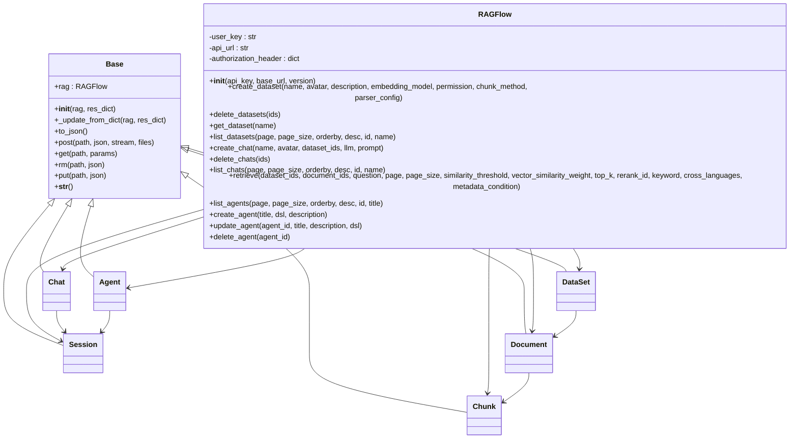

# Python SDK Reference

<cite>
**Referenced Files in This Document**   
- [ragflow.py](file://sdk/python/ragflow_sdk/ragflow.py)
- [base.py](file://sdk/python/ragflow_sdk/modules/base.py)
- [agent.py](file://sdk/python/ragflow_sdk/modules/agent.py)
- [chat.py](file://sdk/python/ragflow_sdk/modules/chat.py)
- [dataset.py](file://sdk/python/ragflow_sdk/modules/dataset.py)
- [document.py](file://sdk/python/ragflow_sdk/modules/document.py)
- [chunk.py](file://sdk/python/ragflow_sdk/modules/chunk.py)
- [session.py](file://sdk/python/ragflow_sdk/modules/session.py)
- [__init__.py](file://sdk/python/ragflow_sdk/__init__.py)
- [pyproject.toml](file://sdk/python/pyproject.toml)
- [dataset_example.py](file://example/sdk/dataset_example.py)
</cite>

## Table of Contents
1. [Introduction](#introduction)
2. [Installation and Setup](#installation-and-setup)
3. [Authentication and Client Initialization](#authentication-and-client-initialization)
4. [Core Modules Overview](#core-modules-overview)
5. [Agent Module](#agent-module)
6. [Chat Module](#chat-module)
7. [Dataset Module](#dataset-module)
8. [Document Module](#document-module)
9. [Chunk Module](#chunk-module)
10. [Session Module](#session-module)
11. [Error Handling](#error-handling)
12. [Asynchronous Operations and Streaming](#asynchronous-operations-and-streaming)
13. [Practical Usage Examples](#practical-usage-examples)
14. [Performance Optimization and Best Practices](#performance-optimization-and-best-practices)
15. [Migration and Compatibility](#migration-and-compatibility)

## Introduction

The RAGFlow Python SDK provides a comprehensive interface for interacting with the RAGFlow platform, enabling developers to build powerful retrieval-augmented generation applications. The SDK offers a high-level, object-oriented API that abstracts the underlying HTTP requests and provides intuitive methods for managing datasets, documents, chunks, chat assistants, agents, and sessions.

The SDK is designed to be developer-friendly, with clear method signatures, comprehensive error handling, and support for both synchronous and streaming operations. It follows Python best practices and provides type hints for improved developer experience and code reliability.

**Section sources**
- [__init__.py](file://sdk/python/ragflow_sdk/__init__.py#L1-L41)
- [pyproject.toml](file://sdk/python/pyproject.toml#L1-L32)

## Installation and Setup

The RAGFlow Python SDK can be installed using pip from the Python Package Index (PyPI). The SDK requires Python 3.10 or higher and has minimal dependencies to ensure compatibility across different environments.

To install the SDK, use the following command:
```bash
pip install ragflow-sdk
```

The SDK has the following dependencies:
- requests>=2.30.0,<3.0.0: For making HTTP requests to the RAGFlow API
- beartype>=0.20.0,<1.0.0: For runtime type checking and validation

For development and testing purposes, additional dependencies are available in the test dependency group, including pytest, hypothesis, and various file format libraries for testing document processing capabilities.

**Section sources**
- [pyproject.toml](file://sdk/python/pyproject.toml#L1-L32)

## Authentication and Client Initialization

The RAGFlow SDK uses API key-based authentication to connect to the RAGFlow server. To initialize the client, you need to provide your API key and the base URL of your RAGFlow instance.

```python
from ragflow_sdk import RAGFlow

# Initialize the RAGFlow client
client = RAGFlow(api_key="your-api-key", base_url="http://your-ragflow-instance.com")
```

The `RAGFlow` class constructor accepts the following parameters:
- `api_key` (str): Your RAGFlow API key for authentication
- `base_url` (str): The base URL of your RAGFlow instance (e.g., "http://localhost:8080")
- `version` (str, optional): The API version to use (default is "v1")

The SDK automatically handles authentication by including the API key in the Authorization header of all requests as a Bearer token. This ensures secure communication with the RAGFlow server without requiring manual header management.

**Section sources**
- [ragflow.py](file://sdk/python/ragflow_sdk/ragflow.py#L26-L34)

## Core Modules Overview

The RAGFlow Python SDK is organized into several core modules that correspond to the main functionality of the platform. Each module provides a set of classes and methods for interacting with specific aspects of the RAGFlow system.

The main modules are:
- **Agent**: For managing AI agents with custom workflows and tools
- **Chat**: For creating and managing chat assistants that can interact with knowledge bases
- **Dataset**: For managing collections of documents and their associated metadata
- **Document**: For handling individual documents within datasets
- **Chunk**: For working with text chunks extracted from documents
- **Session**: For managing conversational sessions with chat assistants or agents

All modules inherit from the `Base` class, which provides common functionality such as HTTP request methods and data serialization. This inheritance structure ensures consistent behavior across all SDK components.



**Diagram sources**
- [base.py](file://sdk/python/ragflow_sdk/modules/base.py#L18-L59)
- [ragflow.py](file://sdk/python/ragflow_sdk/ragflow.py#L26-L286)

**Section sources**
- [__init__.py](file://sdk/python/ragflow_sdk/__init__.py#L22-L28)
- [base.py](file://sdk/python/ragflow_sdk/modules/base.py#L18-L59)

## Agent Module

The Agent module provides functionality for creating, managing, and interacting with AI agents in RAGFlow. Agents are specialized AI assistants that can perform complex tasks using custom workflows defined by DSL (Domain Specific Language) configurations.

### Agent Class

The `Agent` class represents an AI agent in the RAGFlow system. It provides methods for creating sessions, listing existing sessions, and managing agent lifecycle.

```python
class Agent(Base):
    def __init__(self, rag, res_dict):
        self.id = None
        self.avatar = None
        self.canvas_type = None
        self.description = None
        self.dsl = None
        super().__init__(rag, res_dict)
```

#### Properties
- `id` (str): Unique identifier for the agent
- `avatar` (str): URL or path to the agent's avatar image
- `canvas_type` (str): Type of canvas used for the agent's workflow
- `description` (str): Description of the agent's purpose and capabilities
- `dsl` (dict): Domain Specific Language configuration defining the agent's workflow

#### Methods

**create_session**
```python
def create_session(self, **kwargs) -> Session:
    """
    Create a new session for this agent.
    
    Args:
        **kwargs: Additional parameters for session creation
        
    Returns:
        Session: A new Session object
        
    Raises:
        Exception: If the session creation fails
    """
```

**list_sessions**
```python
def list_sessions(self, page: int = 1, page_size: int = 30, orderby: str = "create_time", desc: bool = True, id: str = None) -> list[Session]:
    """
    List sessions associated with this agent.
    
    Args:
        page (int): Page number for pagination
        page_size (int): Number of sessions per page
        orderby (str): Field to order results by
        desc (bool): Whether to sort in descending order
        id (str): Filter by session ID
        
    Returns:
        list[Session]: List of Session objects
        
    Raises:
        Exception: If the request fails
    """
```

**delete_sessions**
```python
def delete_sessions(self, ids: list[str] | None = None):
    """
    Delete one or more sessions associated with this agent.
    
    Args:
        ids (list[str]): List of session IDs to delete. If None, no sessions are deleted.
        
    Raises:
        Exception: If the deletion fails
    """
```

### Dsl Class

The `Dsl` nested class within the `Agent` class represents the Domain Specific Language configuration for the agent's workflow. It defines the components, connections, and execution logic of the agent.

```python
class Dsl(Base):
    def __init__(self, rag, res_dict):
        self.answer = []
        self.components = {
            "begin": {
                "downstream": ["Answer:China"],
                "obj": {
                    "component_name": "Begin",
                    "params": {}
                },
                "upstream": []
            }
        }
        self.graph = {
            "edges": [],
            "nodes": [
                {
                    "data": {
                        "label": "Begin",
                        "name": "begin"
                    },
                    "id": "begin",
                    "position": {
                        "x": 50,
                        "y": 200
                    },
                    "sourcePosition": "left",
                    "targetPosition": "right",
                    "type": "beginNode"
                }
            ]
        }
        self.history = []
        self.messages = []
        self.path = []
        self.reference = []
        super().__init__(rag, res_dict)
```

The DSL configuration includes:
- `components`: Dictionary of workflow components with their connections and parameters
- `graph`: Visual representation of the workflow with nodes and edges
- `history`: Execution history of the agent
- `messages`: Messages exchanged during agent execution
- `path`: Current execution path in the workflow
- `reference`: Reference materials used by the agent

**Section sources**
- [agent.py](file://sdk/python/ragflow_sdk/modules/agent.py#L21-L94)

## Chat Module

The Chat module provides functionality for creating and managing chat assistants that can interact with knowledge bases. Chat assistants are designed to provide conversational AI capabilities with access to specific datasets.

### Chat Class

The `Chat` class represents a chat assistant in the RAGFlow system. It provides methods for creating sessions, listing existing sessions, and managing chat assistant lifecycle.

```python
class Chat(Base):
    def __init__(self, rag, res_dict):
        self.id = ""
        self.name = "assistant"
        self.avatar = "path/to/avatar"
        self.llm = Chat.LLM(rag, {})
        self.prompt = Chat.Prompt(rag, {})
        super().__init__(rag, res_dict)
```

#### Properties
- `id` (str): Unique identifier for the chat assistant
- `name` (str): Name of the chat assistant
- `avatar` (str): URL or path to the chat assistant's avatar image
- `llm` (LLM): Configuration for the language model used by the chat assistant
- `prompt` (Prompt): Configuration for the prompt template used by the chat assistant

#### Methods

**update**
```python
def update(self, update_message: dict):
    """
    Update the chat assistant's configuration.
    
    Args:
        update_message (dict): Dictionary containing the fields to update
        
    Raises:
        Exception: If the update fails
    """
```

**create_session**
```python
def create_session(self, name: str = "New session") -> Session:
    """
    Create a new session for this chat assistant.
    
    Args:
        name (str): Name for the new session
        
    Returns:
        Session: A new Session object
        
    Raises:
        Exception: If the session creation fails
    """
```

**list_sessions**
```python
def list_sessions(self, page: int = 1, page_size: int = 30, orderby: str = "create_time", desc: bool = True, id: str = None, name: str = None) -> list[Session]:
    """
    List sessions associated with this chat assistant.
    
    Args:
        page (int): Page number for pagination
        page_size (int): Number of sessions per page
        orderby (str): Field to order results by
        desc (bool): Whether to sort in descending order
        id (str): Filter by session ID
        name (str): Filter by session name
        
    Returns:
        list[Session]: List of Session objects
        
    Raises:
        Exception: If the request fails
    """
```

**delete_sessions**
```python
def delete_sessions(self, ids: list[str] | None = None):
    """
    Delete one or more sessions associated with this chat assistant.
    
    Args:
        ids (list[str]): List of session IDs to delete. If None, no sessions are deleted.
        
    Raises:
        Exception: If the deletion fails
    """
```

### LLM Class

The `LLM` nested class within the `Chat` class represents the language model configuration for the chat assistant.

```python
class LLM(Base):
    def __init__(self, rag, res_dict):
        self.model_name = None
        self.temperature = 0.1
        self.top_p = 0.3
        self.presence_penalty = 0.4
        self.frequency_penalty = 0.7
        self.max_tokens = 512
        super().__init__(rag, res_dict)
```

The LLM configuration includes:
- `model_name` (str): Name of the language model to use
- `temperature` (float): Controls randomness in generation (0.0 to 1.0)
- `top_p` (float): Controls diversity via nucleus sampling (0.0 to 1.0)
- `presence_penalty` (float): Penalizes new tokens based on whether they appear in the text so far
- `frequency_penalty` (float): Penalizes new tokens based on their existing frequency in the text
- `max_tokens` (int): Maximum number of tokens to generate

### Prompt Class

The `Prompt` nested class within the `Chat` class represents the prompt template configuration for the chat assistant.

```python
class Prompt(Base):
    def __init__(self, rag, res_dict):
        self.similarity_threshold = 0.2
        self.keywords_similarity_weight = 0.7
        self.top_n = 8
        self.top_k = 1024
        self.variables = [{"key": "knowledge", "optional": True}]
        self.rerank_model = ""
        self.empty_response = None
        self.opener = "Hi! I'm your assistant. What can I do for you?"
        self.show_quote = True
        self.prompt = (
            "You are an intelligent assistant. Please summarize the content of the knowledge base to answer the question. "
            "Please list the data in the knowledge base and answer in detail. When all knowledge base content is irrelevant to the question, "
            "your answer must include the sentence 'The answer you are looking for is not found in the knowledge base!' "
            "Answers need to consider chat history.\nHere is the knowledge base:\n{knowledge}\nThe above is the knowledge base."
        )
        super().__init__(rag, res_dict)
```

The Prompt configuration includes:
- `similarity_threshold` (float): Minimum similarity score for retrieved chunks
- `keywords_similarity_weight` (float): Weight given to keyword matching in retrieval
- `top_n` (int): Number of top results to return
- `top_k` (int): Number of chunks to retrieve before ranking
- `variables` (list): Template variables available in the prompt
- `rerank_model` (str): Name of the reranking model to use
- `empty_response` (str): Response to return when no relevant information is found
- `opener` (str): Initial message sent by the chat assistant
- `show_quote` (bool): Whether to show source citations in responses
- `prompt` (str): The actual prompt template used for generation

**Section sources**
- [chat.py](file://sdk/python/ragflow_sdk/modules/chat.py#L22-L88)

## Dataset Module

The Dataset module provides functionality for creating, managing, and interacting with datasets in RAGFlow. Datasets are collections of documents that serve as knowledge bases for chat assistants and agents.

### DataSet Class

The `DataSet` class represents a dataset in the RAGFlow system. It provides methods for uploading documents, listing documents, and managing dataset lifecycle.

```python
class DataSet(Base):
    def __init__(self, rag, res_dict):
        self.id = ""
        self.name = ""
        self.avatar = ""
        self.tenant_id = None
        self.description = ""
        self.embedding_model = ""
        self.permission = "me"
        self.document_count = 0
        self.chunk_count = 0
        self.chunk_method = "naive"
        self.parser_config = None
        self.pagerank = 0
        for k in list(res_dict.keys()):
            if k not in self.__dict__:
                res_dict.pop(k)
        super().__init__(rag, res_dict)
```

#### Properties
- `id` (str): Unique identifier for the dataset
- `name` (str): Name of the dataset
- `avatar` (str): URL or path to the dataset's avatar image
- `tenant_id` (str): Identifier of the tenant that owns the dataset
- `description` (str): Description of the dataset's content and purpose
- `embedding_model` (str): Name of the embedding model used for the dataset
- `permission` (str): Access permissions for the dataset ("me", "team", etc.)
- `document_count` (int): Number of documents in the dataset
- `chunk_count` (int): Number of text chunks in the dataset
- `chunk_method` (str): Method used for chunking documents
- `parser_config` (ParserConfig): Configuration for document parsing
- `pagerank` (float): PageRank score for the dataset

#### Methods

**update**
```python
def update(self, update_message: dict):
    """
    Update the dataset's configuration.
    
    Args:
        update_message (dict): Dictionary containing the fields to update
        
    Returns:
        DataSet: The updated DataSet object
        
    Raises:
        Exception: If the update fails
    """
```

**upload_documents**
```python
def upload_documents(self, document_list: list[dict]):
    """
    Upload one or more documents to the dataset.
    
    Args:
        document_list (list[dict]): List of dictionaries containing document information
            Each dictionary should have:
            - display_name (str): Name to display for the document
            - blob (bytes): Binary content of the document
            
    Returns:
        list[Document]: List of Document objects representing the uploaded documents
        
    Raises:
        Exception: If the upload fails
    """
```

**list_documents**
```python
def list_documents(
    self,
    id: str | None = None,
    name: str | None = None,
    keywords: str | None = None,
    page: int = 1,
    page_size: int = 30,
    orderby: str = "create_time",
    desc: bool = True,
    create_time_from: int = 0,
    create_time_to: int = 0,
):
    """
    List documents in the dataset.
    
    Args:
        id (str): Filter by document ID
        name (str): Filter by document name
        keywords (str): Search for documents containing these keywords
        page (int): Page number for pagination
        page_size (int): Number of documents per page
        orderby (str): Field to order results by
        desc (bool): Whether to sort in descending order
        create_time_from (int): Filter by creation time (Unix timestamp)
        create_time_to (int): Filter by creation time (Unix timestamp)
        
    Returns:
        list[Document]: List of Document objects
        
    Raises:
        Exception: If the request fails
    """
```

**delete_documents**
```python
def delete_documents(self, ids: list[str] | None = None):
    """
    Delete one or more documents from the dataset.
    
    Args:
        ids (list[str]): List of document IDs to delete. If None, no documents are deleted.
        
    Raises:
        Exception: If the deletion fails
    """
```

**async_parse_documents**
```python
def async_parse_documents(self, document_ids):
    """
    Asynchronously parse one or more documents into chunks.
    
    Args:
        document_ids (list[str]): List of document IDs to parse
        
    Raises:
        Exception: If the parsing request fails
    """
```

**parse_documents**
```python
def parse_documents(self, document_ids):
    """
    Parse one or more documents into chunks (synchronous).
    
    Args:
        document_ids (list[str]): List of document IDs to parse
        
    Returns:
        list: List of tuples containing (document_id, status, chunk_count, token_count)
        
    Raises:
        Exception: If the parsing fails
    """
```

**async_cancel_parse_documents**
```python
def async_cancel_parse_documents(self, document_ids):
    """
    Cancel the parsing of one or more documents.
    
    Args:
        document_ids (list[str]): List of document IDs to cancel parsing for
        
    Raises:
        Exception: If the cancellation request fails
    """
```

### ParserConfig Class

The `ParserConfig` nested class within the `DataSet` class represents the configuration for document parsing.

```python
class ParserConfig(Base):
    def __init__(self, rag, res_dict):
        super().__init__(rag, res_dict)
```

The ParserConfig class inherits from Base and can contain various parsing configuration options depending on the document type and requirements.

**Section sources**
- [dataset.py](file://sdk/python/ragflow_sdk/modules/dataset.py#L21-L154)

## Document Module

The Document module provides functionality for managing individual documents within datasets. Documents are the fundamental units of content in RAGFlow, representing files that have been uploaded and processed.

### Document Class

The `Document` class represents a document in the RAGFlow system. It provides methods for updating document metadata, downloading the original file, and managing document chunks.

```python
class Document(Base):
    def __init__(self, rag, res_dict):
        self.id = ""
        self.name = ""
        self.thumbnail = None
        self.dataset_id = None
        self.chunk_method = "naive"
        self.parser_config = {"pages": [[1, 1000000]]}
        self.source_type = "local"
        self.type = ""
        self.created_by = ""
        self.size = 0
        self.token_count = 0
        self.chunk_count = 0
        self.progress = 0.0
        self.progress_msg = ""
        self.process_begin_at = None
        self.process_duration = 0.0
        self.run = "0"
        self.status = "1"
        self.meta_fields = {}
        for k in list(res_dict.keys()):
            if k not in self.__dict__:
                res_dict.pop(k)
        super().__init__(rag, res_dict)
```

#### Properties
- `id` (str): Unique identifier for the document
- `name` (str): Name of the document
- `thumbnail` (str): URL or path to the document's thumbnail image
- `dataset_id` (str): Identifier of the dataset containing the document
- `chunk_method` (str): Method used for chunking this document
- `parser_config` (dict): Configuration for parsing this document
- `source_type` (str): Source of the document ("local", "web", etc.)
- `type` (str): File type of the document
- `created_by` (str): Identifier of the user who created the document
- `size` (int): Size of the document in bytes
- `token_count` (int): Number of tokens in the document
- `chunk_count` (int): Number of text chunks extracted from the document
- `progress` (float): Processing progress (0.0 to 1.0)
- `progress_msg` (str): Current processing status message
- `process_begin_at` (str): Timestamp when processing began
- `process_duration` (float): Duration of processing in seconds
- `run` (str): Current processing state ("0" = pending, "1" = running, "DONE", "FAIL", "CANCEL")
- `status` (str): Processing status code
- `meta_fields` (dict): Additional metadata fields for the document

#### Methods

**update**
```python
def update(self, update_message: dict):
    """
    Update the document's metadata.
    
    Args:
        update_message (dict): Dictionary containing the fields to update
            Can include 'meta_fields' for additional metadata
            
    Returns:
        Document: The updated Document object
        
    Raises:
        Exception: If the update fails
        Exception: If meta_fields is not a dictionary
    """
```

**download**
```python
def download(self):
    """
    Download the original document file.
    
    Returns:
        bytes: Binary content of the document
        
    Raises:
        Exception: If the download fails
    """
```

**list_chunks**
```python
def list_chunks(self, page=1, page_size=30, keywords="", id=""):
    """
    List chunks extracted from this document.
    
    Args:
        page (int): Page number for pagination
        page_size (int): Number of chunks per page
        keywords (str): Search for chunks containing these keywords
        id (str): Filter by chunk ID
        
    Returns:
        list[Chunk]: List of Chunk objects
        
    Raises:
        Exception: If the request fails
    """
```

**add_chunk**
```python
def add_chunk(self, content: str, important_keywords: list[str] = [], questions: list[str] = []):
    """
    Add a new chunk to this document.
    
    Args:
        content (str): Text content of the chunk
        important_keywords (list[str]): Important keywords in the chunk
        questions (list[str]): Questions that this chunk can answer
        
    Returns:
        Chunk: The created Chunk object
        
    Raises:
        Exception: If the chunk creation fails
    """
```

**delete_chunks**
```python
def delete_chunks(self, ids: list[str] | None = None):
    """
    Delete one or more chunks from this document.
    
    Args:
        ids (list[str]): List of chunk IDs to delete. If None, no chunks are deleted.
        
    Raises:
        Exception: If the deletion fails
    """
```

### ParserConfig Class

The `ParserConfig` nested class within the `Document` class represents the configuration for parsing this specific document.

```python
class ParserConfig(Base):
    def __init__(self, rag, res_dict):
        super().__init__(rag, res_dict)
```

The ParserConfig class inherits from Base and can contain document-specific parsing options.

**Section sources**
- [document.py](file://sdk/python/ragflow_sdk/modules/document.py#L23-L102)

## Chunk Module

The Chunk module provides functionality for working with text chunks extracted from documents. Chunks are the atomic units of information that are indexed and retrieved by the RAGFlow system.

### Chunk Class

The `Chunk` class represents a text chunk in the RAGFlow system. It provides methods for updating chunk content and metadata.

```python
class Chunk(Base):
    def __init__(self, rag, res_dict):
        self.id = ""
        self.content = ""
        self.important_keywords = []
        self.questions = []
        self.create_time = ""
        self.create_timestamp = 0.0
        self.dataset_id = None
        self.document_name = ""
        self.document_id = ""
        self.available = True
        # Additional fields for retrieval results
        self.similarity = 0.0
        self.vector_similarity = 0.0
        self.term_similarity = 0.0
        self.positions = []
        self.doc_type = ""
        for k in list(res_dict.keys()):
            if k not in self.__dict__:
                res_dict.pop(k)
        super().__init__(rag, res_dict)
```

#### Properties
- `id` (str): Unique identifier for the chunk
- `content` (str): Text content of the chunk
- `important_keywords` (list[str]): Important keywords in the chunk
- `questions` (list[str]): Questions that this chunk can answer
- `create_time` (str): Timestamp when the chunk was created
- `create_timestamp` (float): Unix timestamp when the chunk was created
- `dataset_id` (str): Identifier of the dataset containing the chunk
- `document_name` (str): Name of the document containing the chunk
- `document_id` (str): Identifier of the document containing the chunk
- `available` (bool): Whether the chunk is available for retrieval
- `similarity` (float): Overall similarity score for retrieval
- `vector_similarity` (float): Vector-based similarity score
- `term_similarity` (float): Term-based similarity score
- `positions` (list): Positions of the chunk in the original document
- `doc_type` (str): Type of the original document

#### Methods

**update**
```python
def update(self, update_message: dict):
    """
    Update the chunk's content and metadata.
    
    Args:
        update_message (dict): Dictionary containing the fields to update
        
    Raises:
        ChunkUpdateError: If the update fails
    """
```

### ChunkUpdateError Class

The `ChunkUpdateError` class is a custom exception raised when a chunk update operation fails.

```python
class ChunkUpdateError(Exception):
    def __init__(self, code=None, message=None, details=None):
        self.code = code
        self.message = message
        self.details = details
        super().__init__(message)
```

The ChunkUpdateError includes:
- `code` (int): Error code from the server
- `message` (str): Error message describing the failure
- `details` (str): Additional details about the error

**Section sources**
- [chunk.py](file://sdk/python/ragflow_sdk/modules/chunk.py#L26-L57)

## Session Module

The Session module provides functionality for managing conversational sessions with chat assistants or agents. Sessions maintain the context of a conversation, including the message history.

### Session Class

The `Session` class represents a conversational session in the RAGFlow system. It provides methods for asking questions and managing session state.

```python
class Session(Base):
    def __init__(self, rag, res_dict):
        self.id = None
        self.name = "New session"
        self.messages = [{"role": "assistant", "content": "Hi! I am your assistant, can I help you?"}]
        for key, value in res_dict.items():
            if key == "chat_id" and value is not None:
                self.chat_id = None
                self.__session_type = "chat"
            if key == "agent_id" and value is not None:
                self.agent_id = None
                self.__session_type = "agent"
        super().__init__(rag, res_dict)
```

#### Properties
- `id` (str): Unique identifier for the session
- `name` (str): Name of the session
- `messages` (list): List of messages in the conversation
- `chat_id` (str): Identifier of the chat assistant (if session type is "chat")
- `agent_id` (str): Identifier of the agent (if session type is "agent")
- `__session_type` (str): Type of session ("chat" or "agent")

#### Methods

**ask**
```python
def ask(self, question="", stream=False, **kwargs):
    """
    Ask a question to the session.
    
    Args:
        question (str): The question to ask
        stream (bool): Whether to stream the response
        **kwargs: Additional parameters for the request
        
    Yields:
        Message: Message objects as they arrive (when stream=True)
        
    Returns:
        Generator: A generator that yields Message objects
        
    Raises:
        Exception: If the request fails
        Exception: If the session type is unknown
    """
```

**update**
```python
def update(self, update_message):
    """
    Update the session's configuration.
    
    Args:
        update_message (dict): Dictionary containing the fields to update
        
    Raises:
        Exception: If the update fails
    """
```

### Message Class

The `Message` class represents a message in a conversational session.

```python
class Message(Base):
    def __init__(self, rag, res_dict):
        self.content = "Hi! I am your assistant, can I help you?"
        self.reference = None
        self.role = "assistant"
        self.prompt = None
        self.id = None
        super().__init__(rag, res_dict)
```

#### Properties
- `content` (str): Content of the message
- `reference` (dict): Reference materials used in the response
- `role` (str): Role of the message sender ("user" or "assistant")
- `prompt` (str): Prompt used to generate the response
- `id` (str): Unique identifier for the message

**Section sources**
- [session.py](file://sdk/python/ragflow_sdk/modules/session.py#L21-L129)

## Error Handling

The RAGFlow Python SDK implements comprehensive error handling to help developers identify and resolve issues when interacting with the RAGFlow platform. The SDK raises exceptions for various error conditions, providing detailed information about the nature of the failure.

### Exception Types

The SDK uses standard Python exceptions and custom exceptions to indicate different types of errors:

**Standard Exceptions**
- `Exception`: Used for general errors when interacting with the API
- `ValueError`: Raised for invalid parameter values
- `json.JSONDecodeError`: Raised when response parsing fails

**Custom Exceptions**
- `ChunkUpdateError`: Specifically for chunk update operations, containing additional error details

### Error Response Structure

When an API request fails, the RAGFlow server returns a JSON response with the following structure:
```json
{
    "code": 1,
    "message": "Error description"
}
```

The SDK automatically parses these responses and raises appropriate exceptions with the error message. For example:
```python
try:
    dataset = client.create_dataset("my-dataset")
except Exception as e:
    print(f"Failed to create dataset: {str(e)}")
```

### Common Error Scenarios

**Authentication Errors**
- Invalid API key
- Expired API key
- Insufficient permissions

**Validation Errors**
- Invalid parameter values
- Missing required parameters
- Duplicate names (e.g., dataset with existing name)

**Resource Errors**
- Resource not found
- Resource already exists
- Resource limit exceeded

**Processing Errors**
- Document parsing failures
- Chunking errors
- Indexing failures

Developers should implement appropriate error handling in their applications to provide meaningful feedback to users and handle recoverable errors gracefully.

**Section sources**
- [ragflow.py](file://sdk/python/ragflow_sdk/ragflow.py#L75-L76)
- [dataset.py](file://sdk/python/ragflow_sdk/modules/dataset.py#L58-L59)
- [chunk.py](file://sdk/python/ragflow_sdk/modules/chunk.py#L50-L57)

## Asynchronous Operations and Streaming

The RAGFlow Python SDK supports both synchronous and asynchronous operations, allowing developers to choose the appropriate approach based on their application requirements.

### Streaming Responses

The SDK supports streaming responses for conversational interactions, enabling real-time display of responses as they are generated. This is particularly useful for creating interactive chat interfaces.

To enable streaming, set the `stream` parameter to `True` when calling the `ask` method:

```python
session = chat.create_session()
for message in session.ask("What is RAGFlow?", stream=True):
    print(message.content)
```

When streaming is enabled, the `ask` method returns a generator that yields `Message` objects as they arrive from the server. Each message represents a partial response, allowing applications to display content incrementally.

The streaming implementation uses Server-Sent Events (SSE) to receive data from the server. The SDK handles the SSE protocol internally, parsing the event stream and yielding message objects.

### Asynchronous Document Processing

Document processing in RAGFlow can be time-consuming, especially for large files or complex parsing operations. The SDK provides both synchronous and asynchronous methods for document processing:

**Asynchronous Processing**
```python
# Start parsing documents without waiting for completion
dataset.async_parse_documents([doc.id for doc in documents])
```

**Synchronous Processing**
```python
# Wait for parsing to complete
results = dataset.parse_documents([doc.id for doc in documents])
```

The synchronous `parse_documents` method internally uses `async_parse_documents` and then polls the server for completion status, providing a convenient way to perform blocking document processing.

### Polling for Completion

When using asynchronous operations, applications may need to poll the server for completion status. The SDK provides methods to check the status of document processing:

```python
# Check the status of document processing
status = dataset._get_documents_status([doc.id for doc in documents])
```

The `_get_documents_status` method polls the server at regular intervals until all documents have reached a terminal state (DONE, FAIL, or CANCEL).

**Section sources**
- [session.py](file://sdk/python/ragflow_sdk/modules/session.py#L36-L80)
- [dataset.py](file://sdk/python/ragflow_sdk/modules/dataset.py#L132-L147)

## Practical Usage Examples

This section provides practical examples demonstrating common workflows with the RAGFlow Python SDK.

### Initializing the Client

```python
from ragflow_sdk import RAGFlow

# Initialize the RAGFlow client
client = RAGFlow(api_key="your-api-key", base_url="http://localhost:8080")
```

### Creating and Managing Datasets

```python
# Create a new dataset
dataset = client.create_dataset(
    name="My Knowledge Base",
    description="Company documentation and policies",
    embedding_model="text-embedding-ada-002",
    chunk_method="naive"
)

# Upload documents to the dataset
with open("company_handbook.pdf", "rb") as file:
    blob = file.read()
    
document = {"display_name": "Company Handbook", "blob": blob}
uploaded_docs = dataset.upload_documents([document])

# Parse documents into chunks
for doc in uploaded_docs:
    doc.add_chunk("This is an important policy")

# Wait for parsing to complete
dataset.parse_documents([doc.id for doc in uploaded_docs])
```

### Creating and Using Chat Assistants

```python
# Create a chat assistant with the dataset
chat = client.create_chat(
    name="Company Assistant",
    dataset_ids=[dataset.id],
    llm=Chat.LLM(
        client,
        {
            "model_name": "gpt-4",
            "temperature": 0.7,
            "max_tokens": 1024
        }
    )
)

# Create a session and ask questions
session = chat.create_session()
for message in session.ask("What are the company's vacation policies?", stream=True):
    print(message.content)
```

### Querying Knowledge Bases

```python
# Retrieve relevant chunks from datasets
chunks = client.retrieve(
    dataset_ids=[dataset.id],
    question="What is the company's policy on remote work?",
    similarity_threshold=0.3,
    top_k=5
)

for chunk in chunks:
    print(f"Chunk: {chunk.content}")
    print(f"Similarity: {chunk.similarity}")
```

### Managing Agents

```python
# Create an agent with a custom workflow
agent_dsl = {
    "components": {
        "begin": {
            "downstream": ["Research"],
            "obj": {"component_name": "Begin", "params": {}},
            "upstream": []
        }
    },
    "graph": {
        "edges": [],
        "nodes": [
            {
                "data": {"label": "Begin", "name": "begin"},
                "id": "begin",
                "position": {"x": 50, "y": 200},
                "type": "beginNode"
            }
        ]
    }
}

client.create_agent(
    title="Research Assistant",
    dsl=agent_dsl,
    description="An agent that can research topics using multiple sources"
)

# List existing agents
agents = client.list_agents()
for agent in agents:
    print(f"Agent: {agent.title}")
```

### Complete Example: Document Q&A System

```python
from ragflow_sdk import RAGFlow

def create_document_qa_system(api_key, base_url, document_path):
    """
    Create a document Q&A system that can answer questions about a document.
    """
    # Initialize client
    client = RAGFlow(api_key=api_key, base_url=base_url)
    
    # Create dataset
    dataset = client.create_dataset(name="Document QA")
    
    # Upload document
    with open(document_path, "rb") as file:
        blob = file.read()
    
    document = {"display_name": document_path, "blob": blob}
    uploaded_docs = dataset.upload_documents([document])
    
    # Parse document
    dataset.parse_documents([doc.id for doc in uploaded_docs])
    
    # Create chat assistant
    chat = client.create_chat(
        name="Document Assistant",
        dataset_ids=[dataset.id]
    )
    
    # Create session
    session = chat.create_session()
    
    return session

# Usage
session = create_document_qa_system(
    api_key="your-api-key",
    base_url="http://localhost:8080",
    document_path="report.pdf"
)

# Ask questions
for message in session.ask("What are the main findings in the report?", stream=True):
    print(message.content)
```

**Section sources**
- [dataset_example.py](file://example/sdk/dataset_example.py#L21-L54)
- [t_dataset.py](file://sdk/python/test/test_sdk_api/t_dataset.py#L24-L78)
- [t_chat.py](file://sdk/python/test/test_sdk_api/t_chat.py#L22-L132)

## Performance Optimization and Best Practices

This section provides recommendations for optimizing performance and following best practices when using the RAGFlow Python SDK.

### Connection Management

The SDK uses the requests library for HTTP communication. For applications with high request volumes, consider the following:

**Use Connection Pooling**
```python
import requests
from requests.adapters import HTTPAdapter
from urllib3.util.retry import Retry

# Create a session with connection pooling
session = requests.Session()
adapter = HTTPAdapter(
    pool_connections=10,
    pool_maxsize=10,
    max_retries=Retry(total=3, backoff_factor=0.1)
)
session.mount("http://", adapter)
session.mount("https://", adapter)

# The SDK will use this session for all requests
client = RAGFlow(api_key="your-key", base_url="http://localhost:8080")
```

### Batch Operations

When performing operations on multiple resources, batch them to reduce the number of HTTP requests:

```python
# Instead of creating datasets one by one
datasets = []
for name in dataset_names:
    datasets.append(client.create_dataset(name=name))

# Consider if the API supports batch operations
# (Note: Current SDK doesn't expose batch methods, but this is a general principle)
```

### Error Handling and Retry Logic

Implement robust error handling with retry logic for transient failures:

```python
import time
from functools import wraps

def retry_on_failure(max_retries=3, delay=1):
    def decorator(func):
        @wraps(func)
        def wrapper(*args, **kwargs):
            for attempt in range(max_retries):
                try:
                    return func(*args, **kwargs)
                except Exception as e:
                    if attempt == max_retries - 1:
                        raise
                    time.sleep(delay * (2 ** attempt))  # Exponential backoff
            return None
        return wrapper
    return decorator

@retry_on_failure(max_retries=3)
def create_dataset_with_retry(client, name):
    return client.create_dataset(name=name)
```

### Memory Management

For applications processing large numbers of documents, be mindful of memory usage:

```python
# Process documents in batches
def process_documents_in_batches(dataset, documents, batch_size=10):
    for i in range(0, len(documents), batch_size):
        batch = documents[i:i + batch_size]
        uploaded = dataset.upload_documents(batch)
        
        # Process each batch
        for doc in uploaded:
            # Do something with the document
            pass
            
        # Allow garbage collection
        del uploaded
```

### Caching

Implement caching for frequently accessed data:

```python
from functools import lru_cache

@lru_cache(maxsize=128)
def get_dataset_cached(client, name):
    return client.get_dataset(name)

@lru_cache(maxsize=1024)
def list_documents_cached(dataset, **kwargs):
    return dataset.list_documents(**kwargs)
```

### Best Practices

1. **Use descriptive names**: Use meaningful names for datasets, documents, and chat assistants to make them easily identifiable.

2. **Monitor processing status**: For long-running operations like document parsing, monitor the status and provide feedback to users.

3. **Handle rate limiting**: Be aware of any rate limits imposed by the RAGFlow server and implement appropriate throttling.

4. **Secure API keys**: Never hardcode API keys in source code. Use environment variables or secure configuration management.

5. **Validate inputs**: Validate user inputs before passing them to the SDK methods to prevent errors.

6. **Implement logging**: Add logging to track SDK operations and troubleshoot issues.

7. **Test error conditions**: Test your application's behavior under various error conditions to ensure robustness.

**Section sources**
- [ragflow.py](file://sdk/python/ragflow_sdk/ragflow.py#L35-L49)
- [dataset.py](file://sdk/python/ragflow_sdk/modules/dataset.py#L53-L64)

## Migration and Compatibility

This section provides guidance for migrating between versions of the RAGFlow Python SDK and ensuring compatibility.

### Versioning

The RAGFlow Python SDK follows semantic versioning (MAJOR.MINOR.PATCH). The current version is 0.22.1, as specified in the pyproject.toml file.

- **MAJOR version**: Incremented for incompatible API changes
- **MINOR version**: Incremented for backward-compatible functionality
- **PATCH version**: Incremented for backward-compatible bug fixes

### Backwards Compatibility

The SDK maintains backwards compatibility within the same major version. This means that code written for version 0.x should continue to work with newer 0.y versions (where y > x).

However, breaking changes may occur between major versions. When upgrading to a new major version, review the release notes and update your code accordingly.

### Deprecation Policy

When functionality is deprecated, it will be marked as such in the documentation and may raise deprecation warnings. Deprecated functionality will be removed in the next major version.

### Migration Guide

When migrating to a new version of the SDK:

1. **Review release notes**: Check the release notes for any breaking changes or deprecations.

2. **Update dependencies**: Update the SDK using pip:
   ```bash
   pip install --upgrade ragflow-sdk
   ```

3. **Test your application**: Run your application's test suite to identify any issues.

4. **Update code for breaking changes**: If there are breaking changes, update your code according to the migration guide.

5. **Monitor for deprecation warnings**: Address any deprecation warnings to prepare for future updates.

### Compatibility Notes

- **Python versions**: The SDK requires Python 3.10 or higher, as specified in the pyproject.toml file.
- **API compatibility**: The SDK is designed to work with RAGFlow API version v1 by default, but can be configured to use other versions.
- **Dependency compatibility**: The SDK has minimal dependencies to reduce compatibility issues. Check the pyproject.toml file for the exact dependency requirements.

**Section sources**
- [pyproject.toml](file://sdk/python/pyproject.toml#L1-L32)
- [__init__.py](file://sdk/python/ragflow_sdk/__init__.py#L30)