# Session Module

<cite>
**Referenced Files in This Document**
- [session.py](file://sdk/python/ragflow_sdk/modules/session.py)
- [base.py](file://sdk/python/ragflow_sdk/modules/base.py)
- [chat.py](file://sdk/python/ragflow_sdk/modules/chat.py)
- [agent.py](file://sdk/python/ragflow_sdk/modules/agent.py)
- [t_session.py](file://sdk/python/test/test_sdk_api/t_session.py)
- [ragflow.py](file://sdk/python/ragflow_sdk/ragflow.py)
- [session.py](file://api/apps/sdk/session.py)
- [session.py](file://api/db/services/conversation_service.py)
</cite>

## Table of Contents
1. [Introduction](#introduction)
2. [Session Architecture Overview](#session-architecture-overview)
3. [Session Class Implementation](#session-class-implementation)
4. [Session Types and Management](#session-types-and-management)
5. [Streaming and Real-time Communication](#streaming-and-real-time-communication)
6. [Integration with Chat Workflows](#integration-with-chat-workflows)
7. [Integration with Agent Workflows](#integration-with-agent-workflows)
8. [Context Management and Preservation](#context-management-and-preservation)
9. [Session Lifecycle Operations](#session-lifecycle-operations)
10. [Error Handling and Exception Management](#error-handling-and-exception-management)
11. [Multi-User Scenarios and Security](#multi-user-scenarios-and-security)
12. [Performance Considerations](#performance-considerations)
13. [Best Practices and Common Patterns](#best-practices-and-common-patterns)
14. [Troubleshooting Guide](#troubleshooting-guide)
15. [Conclusion](#conclusion)

## Introduction

The Session module in RAGFlow's Python SDK provides comprehensive functionality for managing conversational contexts in both chat assistants and AI agents. Sessions serve as the fundamental building blocks for maintaining stateful conversations, preserving user context, and enabling seamless interactions with RAGFlow's AI capabilities.

Sessions support two primary modes of operation:
- **Chat Sessions**: Traditional Q&A conversations with knowledge bases
- **Agent Sessions**: Complex workflow-driven interactions with configurable AI agents

The module implements sophisticated context management, streaming communication, and multi-user session isolation to enable scalable conversational AI applications.

## Session Architecture Overview

The Session module follows a hierarchical architecture with clear separation of concerns:

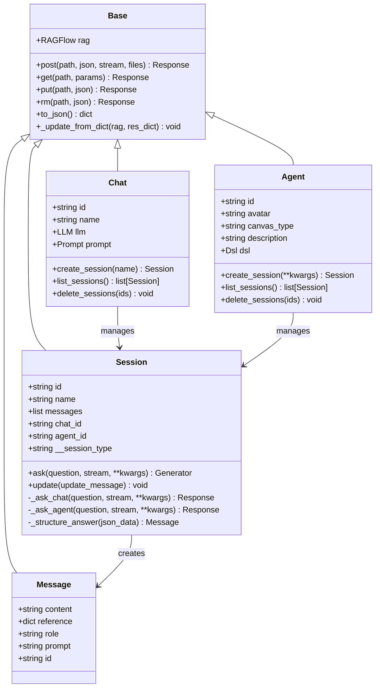

**Diagram sources**
- [session.py](file://sdk/python/ragflow_sdk/modules/session.py#L21-L129)
- [base.py](file://sdk/python/ragflow_sdk/modules/base.py#L18-L59)
- [chat.py](file://sdk/python/ragflow_sdk/modules/chat.py#L22-L88)
- [agent.py](file://sdk/python/ragflow_sdk/modules/agent.py#L21-L94)

## Session Class Implementation

The Session class serves as the core component for managing conversational contexts. It inherits from the Base class and provides specialized functionality for both chat and agent interactions.

### Core Properties and Initialization

The Session class initializes with essential properties for conversation management:

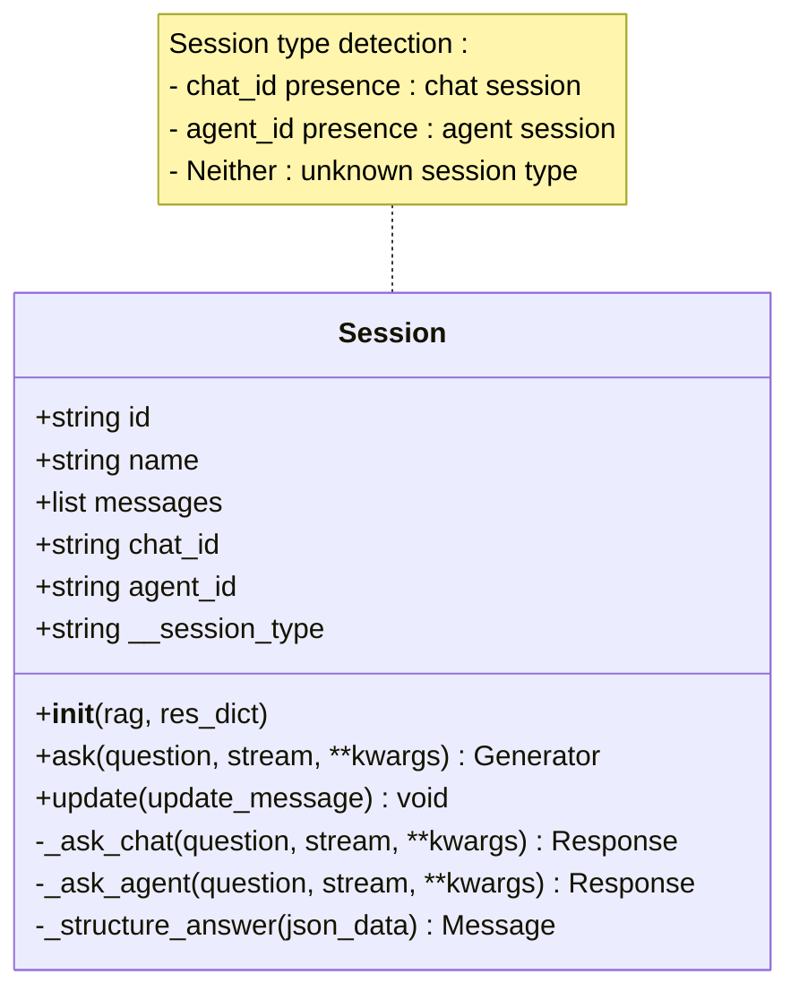

**Diagram sources**
- [session.py](file://sdk/python/ragflow_sdk/modules/session.py#L21-L34)

### Session Type Detection

The Session constructor automatically detects whether it operates as a chat or agent session based on the provided parameters:

- **Chat Session**: Created when `chat_id` is present in the response dictionary
- **Agent Session**: Created when `agent_id` is present in the response dictionary
- **Unknown Session**: Raises an exception if neither identifier is found

**Section sources**
- [session.py](file://sdk/python/ragflow_sdk/modules/session.py#L21-L34)

## Session Types and Management

### Chat Session Management

Chat sessions are designed for traditional knowledge base Q&A interactions. They provide straightforward conversation management with automatic context preservation.

#### Creating Chat Sessions

Chat sessions are created through the Chat class interface:

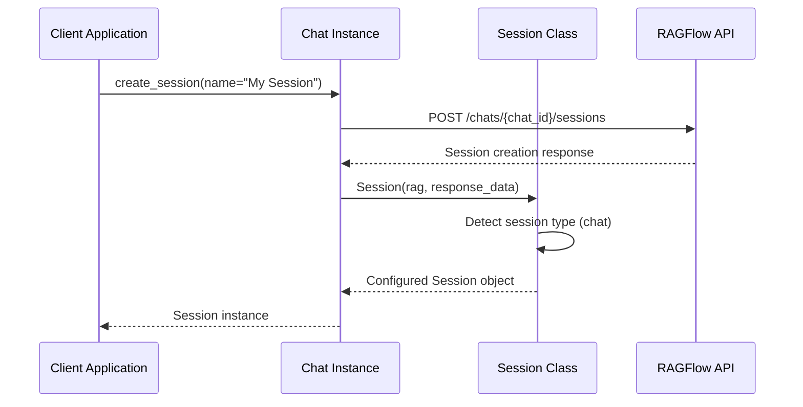

**Diagram sources**
- [chat.py](file://sdk/python/ragflow_sdk/modules/chat.py#L66-L71)
- [session.py](file://sdk/python/ragflow_sdk/modules/session.py#L21-L34)

#### Chat Session Features

- **Automatic Context Tracking**: Maintains conversation history
- **Knowledge Base Integration**: Seamlessly integrates with attached datasets
- **Streaming Support**: Real-time response streaming
- **Message History**: Preserves complete conversation context

### Agent Session Management

Agent sessions support complex workflow-driven interactions with configurable AI agents.

#### Creating Agent Sessions

Agent sessions utilize the agent's DSL (Domain Specific Language) configuration:

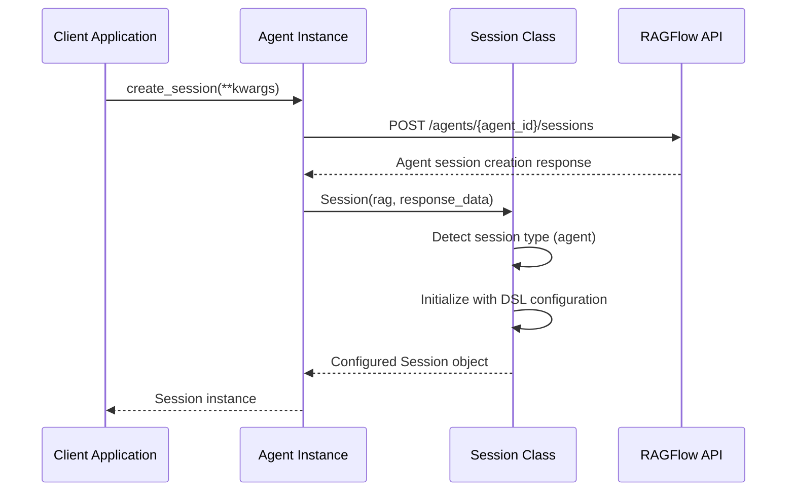

**Diagram sources**
- [agent.py](file://sdk/python/ragflow_sdk/modules/agent.py#L69-L74)
- [session.py](file://sdk/python/ragflow_sdk/modules/session.py#L21-L34)

#### Agent Session Features

- **Workflow Integration**: Executes configured agent workflows
- **Variable Management**: Handles complex input/output variables
- **Component Orchestration**: Manages multi-step AI processes
- **State Persistence**: Maintains workflow state across interactions

**Section sources**
- [chat.py](file://sdk/python/ragflow_sdk/modules/chat.py#L66-L71)
- [agent.py](file://sdk/python/ragflow_sdk/modules/agent.py#L69-L74)

## Streaming and Real-time Communication

The Session module implements sophisticated streaming capabilities for real-time conversation handling.

### Streaming Architecture

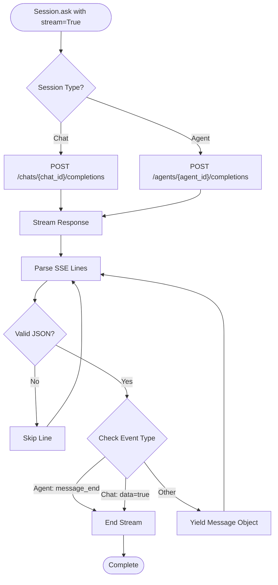

**Diagram sources**
- [session.py](file://sdk/python/ragflow_sdk/modules/session.py#L36-L79)

### Streaming Implementation Details

The streaming mechanism handles Server-Sent Events (SSE) with robust parsing and error handling:

#### Line Processing Logic

1. **Empty Line Filtering**: Skips empty lines to prevent processing overhead
2. **JSON Validation**: Ensures all content is valid JSON before processing
3. **Event Type Checking**: Validates event types based on session type
4. **Stream Termination**: Properly handles stream completion signals

#### Session-Specific Event Handling

- **Chat Sessions**: Wait for `data: true` events to indicate completion
- **Agent Sessions**: Wait for `message_end` events to indicate completion

**Section sources**
- [session.py](file://sdk/python/ragflow_sdk/modules/session.py#L36-L79)

## Integration with Chat Workflows

### Chat Workflow Integration Pattern

Chat sessions integrate seamlessly with RAGFlow's chat assistant system:

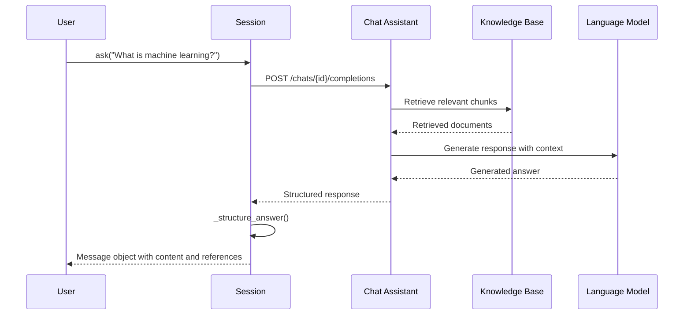

**Diagram sources**
- [session.py](file://sdk/python/ragflow_sdk/modules/session.py#L99-L104)
- [chat.py](file://sdk/python/ragflow_sdk/modules/chat.py#L66-L71)

### Chat Session Methods

#### ask() Method

The primary method for interacting with chat sessions:

| Parameter | Type | Description | Default |
|-----------|------|-------------|---------|
| `question` | `str` | User's question or input | `""` |
| `stream` | `bool` | Enable streaming responses | `False` |
| `**kwargs` | `dict` | Additional parameters for API call | `{}` |

**Returns**: Generator yielding Message objects for streaming, or single Message object for non-streaming mode

#### update() Method

Updates session metadata and configuration:

| Parameter | Type | Description |
|-----------|------|-------------|
| `update_message` | `dict` | Dictionary containing update parameters |

**Section sources**
- [session.py](file://sdk/python/ragflow_sdk/modules/session.py#L36-L119)
- [chat.py](file://sdk/python/ragflow_sdk/modules/chat.py#L66-L88)

## Integration with Agent Workflows

### Agent Workflow Integration Pattern

Agent sessions support complex multi-step workflows with configurable components:

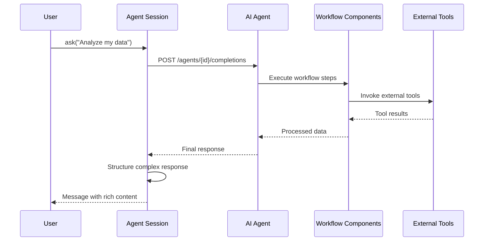

**Diagram sources**
- [session.py](file://sdk/python/ragflow_sdk/modules/session.py#L106-L111)
- [agent.py](file://sdk/python/ragflow_sdk/modules/agent.py#L69-L74)

### Agent Session Capabilities

#### Workflow Execution

Agent sessions execute complex workflows defined in the agent's DSL:

- **Component Orchestration**: Manages execution order of workflow components
- **Variable Propagation**: Passes data between workflow steps
- **Conditional Logic**: Supports branching based on conditions
- **Error Handling**: Manages failures in workflow execution

#### Variable Management

Agents support sophisticated variable handling:

- **Input Variables**: User-provided parameters
- **Output Variables**: Results from workflow components
- **Global Variables**: Shared state across the workflow
- **Memory Management**: Persistent state across interactions

**Section sources**
- [agent.py](file://sdk/python/ragflow_sdk/modules/agent.py#L69-L94)
- [session.py](file://sdk/python/ragflow_sdk/modules/session.py#L106-L111)

## Context Management and Preservation

### Context Preservation Strategies

The Session module implements multiple strategies for maintaining conversation context:

#### Message History Management

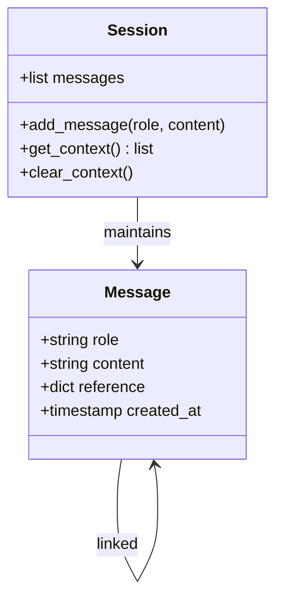

**Diagram sources**
- [session.py](file://sdk/python/ragflow_sdk/modules/session.py#L24-L25)

#### Context Window Management

- **Fixed Window Size**: Maintains a maximum number of recent messages
- **Token Limiting**: Prevents context overflow based on token limits
- **Relevance Filtering**: Prioritizes relevant context based on similarity scores
- **Memory Optimization**: Removes outdated or low-relevance messages

### Reference Tracking

Sessions maintain references to source documents and chunks:

| Field | Type | Description |
|-------|------|-------------|
| `reference.chunks` | `dict` | Source document chunks with metadata |
| `reference.doc_aggs` | `dict` | Document aggregation statistics |
| `reference.similarity` | `float` | Similarity scores for retrieved content |

**Section sources**
- [session.py](file://sdk/python/ragflow_sdk/modules/session.py#L89-L96)

## Session Lifecycle Operations

### Session Creation

Session creation involves different processes based on session type:

#### Chat Session Creation

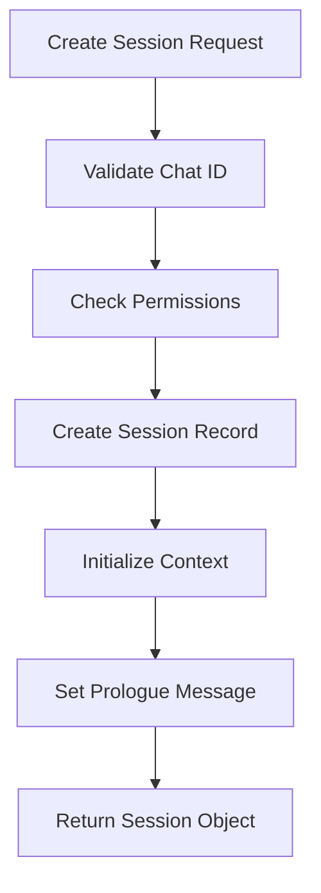

**Diagram sources**
- [session.py](file://api/apps/sdk/session.py#L56-L71)

#### Agent Session Creation

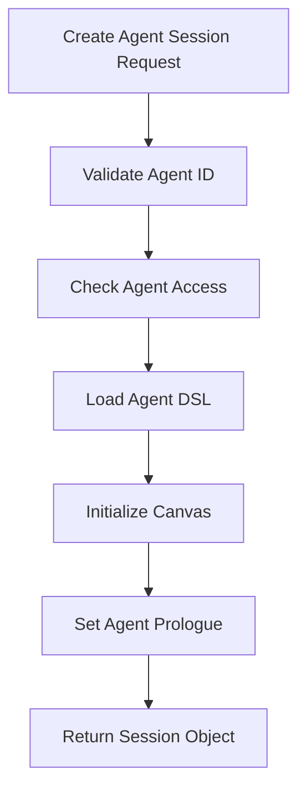

**Diagram sources**
- [session.py](file://api/apps/sdk/session.py#L74-L95)

### Session Listing and Discovery

Both chat and agent sessions provide listing capabilities:

#### Chat Session Listing

| Parameter | Type | Description | Default |
|-----------|------|-------------|---------|
| `page` | `int` | Page number for pagination | `1` |
| `page_size` | `int` | Items per page | `30` |
| `orderby` | `str` | Sort field | `"create_time"` |
| `desc` | `bool` | Descending order | `True` |
| `id` | `str` | Filter by session ID | `None` |
| `name` | `str` | Filter by session name | `None` |

#### Agent Session Listing

Similar to chat sessions but scoped to agent ownership:

- **Ownership Validation**: Ensures user has access to the agent
- **Session Isolation**: Prevents cross-agent session access
- **Permission Checking**: Verifies user permissions for each session

### Session Deletion

Session deletion supports both individual and batch operations:

#### Chat Session Deletion

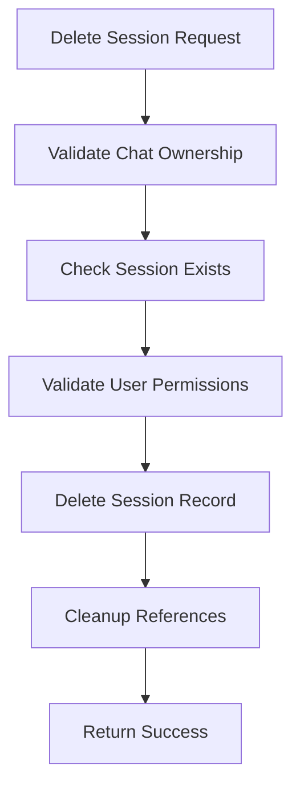

**Diagram sources**
- [session.py](file://api/apps/sdk/session.py#L609-L658)

#### Agent Session Deletion

Similar to chat sessions but with agent-specific validation:

- **Agent Ownership**: Validates user owns the agent
- **Session Ownership**: Ensures session belongs to the agent
- **Batch Operations**: Supports deleting multiple sessions

**Section sources**
- [chat.py](file://sdk/python/ragflow_sdk/modules/chat.py#L73-L88)
- [agent.py](file://sdk/python/ragflow_sdk/modules/agent.py#L77-L94)

## Error Handling and Exception Management

### Exception Types and Handling

The Session module implements comprehensive error handling:

#### Session Type Exceptions

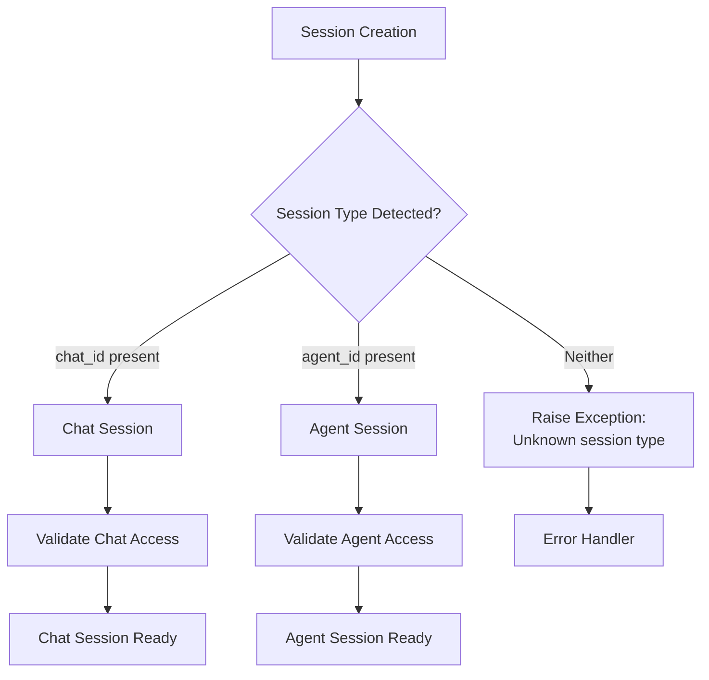

**Diagram sources**
- [session.py](file://sdk/python/ragflow_sdk/modules/session.py#L41-L46)

#### API Error Handling

| Error Type | HTTP Status | Description | Resolution |
|------------|-------------|-------------|------------|
| Authentication | 401 | Invalid API key | Verify API credentials |
| Authorization | 403 | Insufficient permissions | Check user permissions |
| Not Found | 404 | Session/Agent not found | Verify identifiers |
| Validation | 422 | Invalid request data | Check request parameters |
| Internal Error | 500 | Server-side error | Retry with exponential backoff |

#### Streaming Error Recovery

The streaming mechanism includes robust error recovery:

- **Connection Interruption**: Automatic reconnection attempts
- **Partial Data Handling**: Graceful handling of incomplete responses
- **Timeout Management**: Configurable timeouts for long-running operations
- **Buffer Overflow Protection**: Prevents memory exhaustion during streaming

**Section sources**
- [session.py](file://sdk/python/ragflow_sdk/modules/session.py#L41-L46)
- [session.py](file://sdk/python/ragflow_sdk/modules/session.py#L113-L119)

## Multi-User Scenarios and Security

### User Context Isolation

The Session module implements strong isolation mechanisms for multi-user environments:

#### Session Ownership Validation

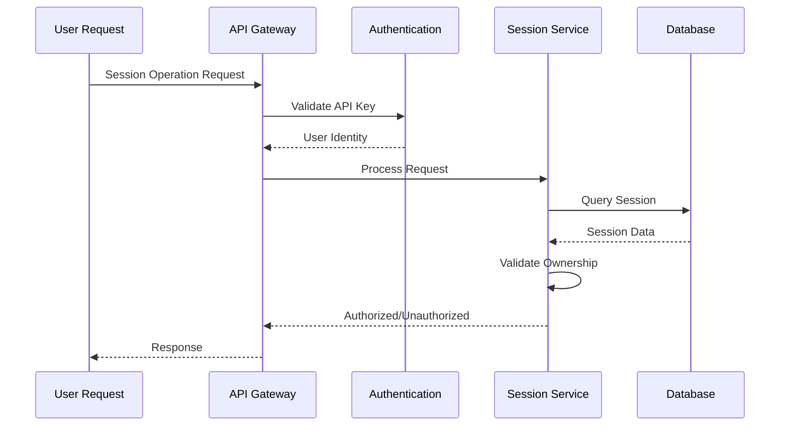

**Diagram sources**
- [session.py](file://api/apps/sdk/session.py#L56-L71)
- [session.py](file://api/apps/sdk/session.py#L74-L95)

#### Permission Models

The system supports multiple permission models:

- **Private Sessions**: Only creator can access
- **Shared Sessions**: Accessible to authorized users
- **Public Sessions**: Limited access based on configuration
- **Team Sessions**: Access controlled by team membership

### Security Considerations

#### Data Protection

- **Encryption in Transit**: HTTPS/TLS for all API communications
- **Access Logging**: Comprehensive audit trails for session operations
- **Rate Limiting**: Protection against abuse and denial-of-service attacks
- **Input Validation**: Sanitization of user inputs to prevent injection attacks

#### Session Security

- **Token-Based Authentication**: Secure API key management
- **Session Isolation**: Prevents cross-session data leakage
- **Audit Trails**: Complete logs of session activities
- **Expiration Policies**: Automatic cleanup of stale sessions

**Section sources**
- [session.py](file://api/apps/sdk/session.py#L56-L71)
- [session.py](file://api/apps/sdk/session.py#L74-L95)

## Performance Considerations

### Optimization Strategies

The Session module implements several performance optimization techniques:

#### Connection Pooling

- **HTTP Connection Reuse**: Maintains persistent connections to reduce latency
- **Pool Management**: Efficient management of connection pools
- **Timeout Configuration**: Configurable timeouts for optimal performance

#### Memory Management

- **Lazy Loading**: Loads session data only when needed
- **Garbage Collection**: Automatic cleanup of unused session objects
- **Buffer Management**: Optimized buffer sizes for streaming operations

#### Caching Strategies

- **Session Metadata Caching**: Caches frequently accessed session information
- **Response Caching**: Caches API responses for repeated operations
- **Context Caching**: Maintains recent contexts in memory

### Scalability Patterns

#### Horizontal Scaling

- **Stateless Design**: Sessions can be distributed across multiple servers
- **Load Balancing**: Supports load balancing across session instances
- **Database Scaling**: Optimized database queries for scalability

#### Vertical Scaling

- **Resource Optimization**: Efficient resource utilization
- **Memory Optimization**: Minimal memory footprint per session
- **CPU Efficiency**: Optimized processing algorithms

## Best Practices and Common Patterns

### Session Management Best Practices

#### Session Lifecycle Management

1. **Proper Initialization**: Always validate session creation responses
2. **Graceful Degradation**: Handle session failures gracefully
3. **Resource Cleanup**: Clean up sessions when no longer needed
4. **Monitoring**: Implement monitoring for session health

#### Streaming Implementation

```python
# Example streaming pattern
session = chat.create_session()
for message in session.ask("Your question", stream=True):
    print(f"Received: {message.content}")
    if message.reference:
        print(f"Sources: {len(message.reference)} chunks")
```

#### Error Handling Patterns

```python
# Robust error handling
try:
    session = chat.create_session()
    for message in session.ask("Question", stream=True):
        # Process message
        pass
except Exception as e:
    # Handle session errors
    logger.error(f"Session error: {e}")
    # Implement fallback logic
```

### Common Implementation Patterns

#### Context Preservation

- **Message History**: Maintain conversation context across interactions
- **Reference Tracking**: Track source documents for citations
- **State Management**: Preserve workflow state in agent sessions

#### Performance Optimization

- **Batch Operations**: Use batch APIs when available
- **Async Processing**: Implement asynchronous session operations
- **Caching**: Cache frequently accessed session data

**Section sources**
- [t_session.py](file://sdk/python/test/test_sdk_api/t_session.py#L38-L58)

## Troubleshooting Guide

### Common Issues and Solutions

#### Session Creation Failures

**Problem**: Session creation returns errors
**Causes**:
- Invalid chat/agent ID
- Insufficient permissions
- API key authentication failure

**Solutions**:
1. Verify chat/agent ID exists and is accessible
2. Check user permissions for the resource
3. Validate API key authentication
4. Review error messages for specific details

#### Streaming Connection Issues

**Problem**: Streaming connections fail or disconnect
**Causes**:
- Network instability
- Timeout configurations
- Server-side connection limits

**Solutions**:
1. Implement retry logic with exponential backoff
2. Adjust timeout configurations
3. Monitor network connectivity
4. Use connection keep-alive mechanisms

#### Memory and Performance Issues

**Problem**: High memory usage or slow performance
**Causes**:
- Large message histories
- Inefficient context management
- Resource leaks

**Solutions**:
1. Implement context window limits
2. Optimize message history management
3. Monitor memory usage patterns
4. Implement garbage collection strategies

### Debugging Techniques

#### Logging and Monitoring

- **Enable Debug Logging**: Set appropriate log levels for detailed information
- **Monitor API Calls**: Track API response times and error rates
- **Session Metrics**: Monitor session creation and deletion rates
- **Resource Usage**: Track memory and CPU usage patterns

#### Testing Strategies

- **Unit Testing**: Test individual session operations
- **Integration Testing**: Test session integration with chat/agent workflows
- **Performance Testing**: Validate performance under load
- **Stress Testing**: Test session resilience under adverse conditions

**Section sources**
- [t_session.py](file://sdk/python/test/test_sdk_api/t_session.py#L38-L146)

## Conclusion

The Session module in RAGFlow's Python SDK provides a comprehensive foundation for building stateful conversational AI applications. Its dual-mode architecture supports both traditional chat workflows and complex agent-based interactions, while robust streaming capabilities enable real-time user experiences.

Key strengths of the Session module include:

- **Flexible Architecture**: Supports both chat and agent session types
- **Robust Streaming**: Advanced SSE streaming with error recovery
- **Security Focus**: Strong user isolation and permission management
- **Performance Optimization**: Efficient resource management and caching
- **Comprehensive Lifecycle**: Full CRUD operations with proper error handling

The module's design enables developers to build sophisticated conversational AI applications while maintaining simplicity in common use cases. Its integration with RAGFlow's broader ecosystem ensures seamless operation across different AI workflows and use cases.

For developers implementing stateful AI applications, the Session module provides the essential building blocks for creating engaging, context-aware conversational experiences that scale effectively in production environments.