# Agent Workflows

<cite>
**Referenced Files in This Document**   
- [agent/__init__.py](file://agent/__init__.py)
- [agent/settings.py](file://agent/settings.py)
- [agent/canvas.py](file://agent/canvas.py)
- [agent/component/base.py](file://agent/component/base.py)
- [agent/component/agent_with_tools.py](file://agent/component/agent_with_tools.py)
- [agent/component/llm.py](file://agent/component/llm.py)
- [agent/component/invoke.py](file://agent/component/invoke.py)
- [agent/component/message.py](file://agent/component/message.py)
- [agent/component/categorize.py](file://agent/component/categorize.py)
- [agent/component/variable_assigner.py](file://agent/component/variable_assigner.py)
- [agent/component/switch.py](file://agent/component/switch.py)
- [agent/component/loop.py](file://agent/component/loop.py)
- [agent/component/loopitem.py](file://agent/component/loopitem.py)
- [agent/component/iteration.py](file://agent/component/iteration.py)
- [agent/component/iterationitem.py](file://agent/component/iterationitem.py)
- [agent/component/fillup.py](file://agent/component/fillup.py)
- [agent/component/begin.py](file://agent/component/begin.py)
- [agent/component/exit_loop.py](file://agent/component/exit_loop.py)
- [agent/component/data_operations.py](file://agent/component/data_operations.py)
- [agent/component/list_operations.py](file://agent/component/list_operations.py)
- [agent/component/string_transform.py](file://agent/component/string_transform.py)
- [agent/component/varaiable_aggregator.py](file://agent/component/varaiable_aggregator.py)
- [agent/component/webhook.py](file://agent/component/webhook.py)
- [agent/tools/base.py](file://agent/tools/base.py)
- [agent/tools/retrieval.py](file://agent/tools/retrieval.py)
- [agent/tools/tavily.py](file://agent/tools/tavily.py)
- [agent/tools/duckduckgo.py](file://agent/tools/duckduckgo.py)
- [agent/tools/searxng.py](file://agent/tools/searxng.py)
- [agent/tools/code_exec.py](file://agent/tools/code_exec.py)
- [agent/tools/exesql.py](file://agent/tools/exesql.py)
- [agent/tools/crawler.py](file://agent/tools/crawler.py)
- [agent/tools/akshare.py](file://agent/tools/akshare.py)
- [agent/tools/arxiv.py](file://agent/tools/arxiv.py)
- [agent/tools/deepl.py](file://agent/tools/deepl.py)
- [agent/tools/email.py](file://agent/tools/email.py)
- [agent/tools/github.py](file://agent/tools/github.py)
- [agent/tools/google.py](file://agent/tools/google.py)
- [agent/tools/googlescholar.py](file://agent/tools/googlescholar.py)
- [agent/tools/jin10.py](file://agent/tools/jin10.py)
- [agent/tools/pubmed.py](file://agent/tools/pubmed.py)
- [agent/tools/qweather.py](file://agent/tools/qweather.py)
- [agent/tools/tushare.py](file://agent/tools/tushare.py)
- [agent/tools/wencai.py](file://agent/tools/wencai.py)
- [agent/tools/wikipedia.py](file://agent/tools/wikipedia.py)
- [agent/tools/yahoofinance.py](file://agent/tools/yahoofinance.py)
- [agent/templates/customer_service.json](file://agent/templates/customer_service.json)
- [agent/templates/deep_research.json](file://agent/templates/deep_research.json)
- [agent/templates/knowledge_base_report.json](file://agent/templates/knowledge_base_report.json)
- [agent/templates/advanced_ingestion_pipeline.json](file://agent/templates/advanced_ingestion_pipeline.json)
- [agent/templates/choose_your_knowledge_base_agent.json](file://agent/templates/choose_your_knowledge_base_agent.json)
- [agent/templates/choose_your_knowledge_base_workflow.json](file://agent/templates/choose_your_knowledge_base_workflow.json)
- [agent/templates/chunk_summary.json](file://agent/templates/chunk_summary.json)
- [agent/templates/customer_review_analysis.json](file://agent/templates/customer_review_analysis.json)
- [agent/templates/customer_support.json](file://agent/templates/customer_support.json)
- [agent/templates/cv_analysis_and_candidate_evaluation.json](file://agent/templates/cv_analysis_and_candidate_evaluation.json)
- [agent/templates/deep_search_r.json](file://agent/templates/deep_search_r.json)
- [agent/templates/ecommerce_customer_service_workflow.json](file://agent/templates/ecommerce_customer_service_workflow.json)
- [agent/templates/generate_SEO_blog.json](file://agent/templates/generate_SEO_blog.json)
- [agent/templates/image_lingo.json](file://agent/templates/image_lingo.json)
- [agent/templates/knowledge_base_report_r.json](file://agent/templates/knowledge_base_report_r.json)
- [agent/templates/market_generate_seo_blog.json](file://agent/templates/market_generate_seo_blog.json)
- [agent/templates/seo_blog.json](file://agent/templates/seo_blog.json)
- [agent/templates/sql_assistant.json](file://agent/templates/sql_assistant.json)
- [agent/templates/stock_research_report.json](file://agent/templates/stock_research_report.json)
- [agent/templates/technical_docs_qa.json](file://agent/templates/technical_docs_qa.json)
- [agent/templates/title_chunker.json](file://agent/templates/title_chunker.json)
- [agent/templates/trip_planner.json](file://agent/templates/trip_planner.json)
- [agent/templates/user_interaction.json](file://agent/templates/user_interaction.json)
- [agent/templates/web_search_assistant.json](file://agent/templates/web_search_assistant.json)
- [common/mcp_tool_call_conn.py](file://common/mcp_tool_call_conn.py)
- [api/apps/mcp_server_app.py](file://api/apps/mcp_server_app.py)
- [web/src/interfaces/database/mcp.ts](file://web/src/interfaces/database/mcp.ts)
- [web/src/hooks/use-mcp-request.ts](file://web/src/hooks/use-mcp-request.ts)
</cite>

## Table of Contents
1. [Introduction](#introduction)
2. [Agent System Architecture](#agent-system-architecture)
3. [Core Components](#core-components)
4. [Workflow Orchestration](#workflow-orchestration)
5. [Template-Based Workflows](#template-based-workflows)
6. [MCP Integration and Tool Calling](#mcp-integration-and-tool-calling)
7. [Practical Agent Workflows](#practical-agent-workflows)
8. [Configuration and Parameters](#configuration-and-parameters)
9. [Custom Agent Development](#custom-agent-development)
10. [Conclusion](#conclusion)

## Introduction

RAGFlow's agent system provides a comprehensive framework for creating intelligent, multi-step workflows that can perform complex tasks through orchestration of specialized components and tools. The system enables the creation of sophisticated agent workflows that can handle document analysis, data extraction, automated reasoning, and customer service scenarios. This documentation provides a comprehensive overview of the agent system's architecture, implementation, and practical applications.

The agent system is built around a canvas-based workflow engine that allows for the visual composition of agents from various components. Each agent workflow is defined as a directed graph of components that process inputs, perform actions, and produce outputs. The system supports both simple linear workflows and complex branching, looping, and parallel execution patterns.

Key capabilities of the agent system include:
- Multi-agent orchestration for complex problem solving
- Integration with external tools and services via MCP (Model Context Protocol)
- Template-based workflow creation for common use cases
- Dynamic variable management and data flow between components
- Support for both synchronous and streaming execution modes
- Comprehensive error handling and workflow recovery mechanisms

**Section sources**
- [agent/canvas.py](file://agent/canvas.py#L1-L793)
- [agent/component/base.py](file://agent/component/base.py#L1-L583)

## Agent System Architecture

The RAGFlow agent system follows a modular architecture built around the Canvas class, which serves as the execution engine for agent workflows. The architecture consists of three main layers: the workflow orchestration layer, the component layer, and the tool integration layer.

### Workflow Orchestration Layer

The Canvas class (defined in `agent/canvas.py`) is the core of the agent system, responsible for managing the execution of agent workflows. It implements a graph-based execution model where components are nodes and data flows are represented by directed edges. The Canvas class inherits from the Graph base class and extends it with workflow-specific functionality.

The Canvas maintains several key data structures:
- **Components**: A dictionary of all components in the workflow, indexed by their unique IDs
- **Path**: The current execution path through the workflow
- **Globals**: A dictionary of global variables accessible to all components
- **Variables**: Environment variables that can be referenced in component configurations
- **History**: Conversation history for context preservation
- **Retrieval**: Document retrieval results for RAG operations
- **Memory**: Persistent memory for storing intermediate results

The Canvas orchestrates workflow execution through its `run()` method, which processes components in sequence according to the defined path. It handles parallel execution of independent components and manages the flow of control between components based on their outputs and configuration.

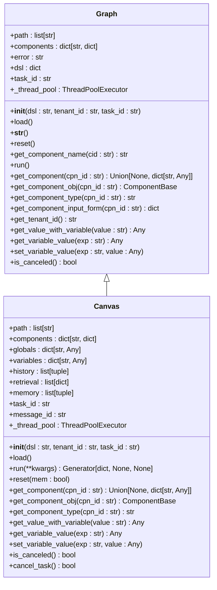
```mermaid
classDiagram
class Canvas {
+path : list[str]
+components : dict[str, dict]
+globals : dict[str, Any]
+variables : dict[str, Any]
+history : list[tuple]
+retrieval : list[dict]
+memory : list[tuple]
+task_id : str
+message_id : str
+_thread_pool : ThreadPoolExecutor
+__init__(dsl : str, tenant_id : str, task_id : str)
+load()
+run(**kwargs) Generator[dict, None, None]
+reset(mem : bool)
+get_component(cpn_id : str) Union[None, dict[str, Any]]
+get_component_obj(cpn_id : str) ComponentBase
+get_component_type(cpn_id : str) str
+get_value_with_variable(value : str) Any
+get_variable_value(exp : str) Any
+set_variable_value(exp : str, value : Any)
+is_canceled() bool
+cancel_task() bool
}
class Graph {
+path : list[str]
+components : dict[str, dict]
+error : str
+dsl : dict
+task_id : str
+_thread_pool : ThreadPoolExecutor
+__init__(dsl : str, tenant_id : str, task_id : str)
+load()
+__str__()
+reset()
+get_component_name(cid : str) str
+run()
+get_component(cpn_id : str) Union[None, dict[str, Any]]
+get_component_obj(cpn_id : str) ComponentBase
+get_component_type(cpn_id : str) str
+get_component_input_form(cpn_id : str) dict
+get_tenant_id() str
+get_value_with_variable(value : str) Any
+get_variable_value(exp : str) Any
+set_variable_value(exp : str, value : Any)
+is_canceled() bool
}
Graph <|-- Canvas
```

**Diagram sources**
- [agent/canvas.py](file://agent/canvas.py#L40-L793)
- [agent/component/base.py](file://agent/component/base.py#L393-L583)

### Component Layer

The component layer provides the building blocks for agent workflows. All components inherit from the ComponentBase class and implement specific functionality. Components are defined in the `agent/component/` directory and can be categorized into several types:

1. **Core Components**: Fundamental building blocks like Begin, Message, and VariableAssigner
2. **Logic Components**: Control flow components like Categorize, Switch, Loop, and Iteration
3. **Processing Components**: Data processing components like StringTransform, DataOperations, and ListOperations
4. **Integration Components**: External service integration components like Invoke and Webhook
5. **AI Components**: LLM and agent-specific components like LLM and Agent

Each component has a corresponding parameter class that defines its configuration options. The parameter classes inherit from ComponentParamBase and define the component's inputs, outputs, and behavior through their attributes.

### Tool Integration Layer

The tool integration layer enables agents to interact with external systems and services. Tools are defined in the `agent/tools/` directory and can be categorized as:

1. **Retrieval Tools**: Knowledge base and document retrieval (retrieval.py)
2. **Search Tools**: Web search capabilities (tavily.py, duckduckgo.py, searxng.py)
3. **Code Execution Tools**: Code and SQL execution (code_exec.py, exesql.py)
4. **Data Source Tools**: Financial and research data (akshare.py, tushare.py, yahoofinance.py)
5. **Content Tools**: Web crawling and content extraction (crawler.py)
6. **Communication Tools**: Email and messaging (email.py)
7. **API Tools**: Integration with external APIs (github.py, google.py, wikipedia.py)

The tool integration layer also supports MCP (Model Context Protocol) for standardized tool calling, allowing integration with any MCP-compliant service.

**Section sources**
- [agent/canvas.py](file://agent/canvas.py#L1-L793)
- [agent/component/base.py](file://agent/component/base.py#L1-L583)
- [agent/tools/base.py](file://agent/tools/base.py#L1-L176)

## Core Components

The agent system provides a rich set of core components that serve as building blocks for creating complex workflows. These components can be categorized into several functional groups.

### Core Workflow Components

#### Begin Component
The Begin component serves as the entry point for agent workflows. It initializes the workflow with predefined inputs and configuration. The component supports conversational mode with a prologue message that is displayed to users.

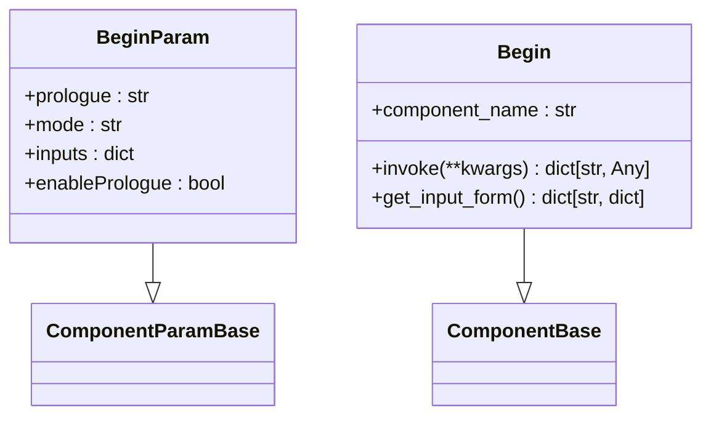
```mermaid
classDiagram
class BeginParam {
+prologue : str
+mode : str
+inputs : dict
+enablePrologue : bool
}
class Begin {
+component_name : str
+invoke(**kwargs) dict[str, Any]
+get_input_form() dict[str, dict]
}
BeginParam --|> ComponentParamBase
Begin --|> ComponentBase
```

**Diagram sources**
- [agent/component/begin.py](file://agent/component/begin.py)

#### Message Component
The Message component is used to generate responses to users. It supports multiple response templates and can incorporate variables from other components. The component also supports streaming output and audio generation.

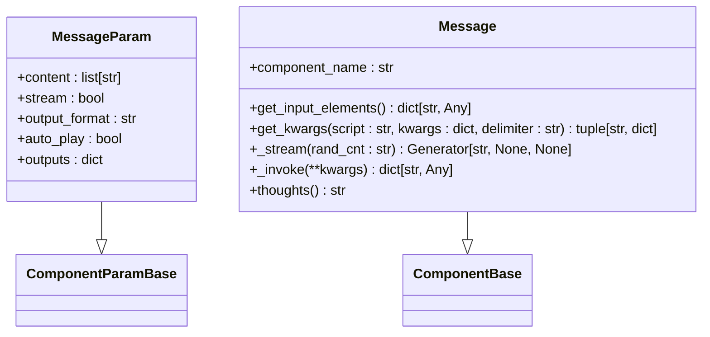
```mermaid
classDiagram
class MessageParam {
+content : list[str]
+stream : bool
+output_format : str
+auto_play : bool
+outputs : dict
}
class Message {
+component_name : str
+get_input_elements() dict[str, Any]
+get_kwargs(script : str, kwargs : dict, delimiter : str) tuple[str, dict]
+_stream(rand_cnt : str) Generator[str, None, None]
+_invoke(**kwargs) dict[str, Any]
+thoughts() str
}
MessageParam --|> ComponentParamBase
Message --|> ComponentBase
```

**Diagram sources**
- [agent/component/message.py](file://agent/component/message.py#L35-L267)

#### Variable Assigner Component
The VariableAssigner component allows for explicit assignment of values to variables that can be referenced by other components. This enables data flow between components and state management within workflows.

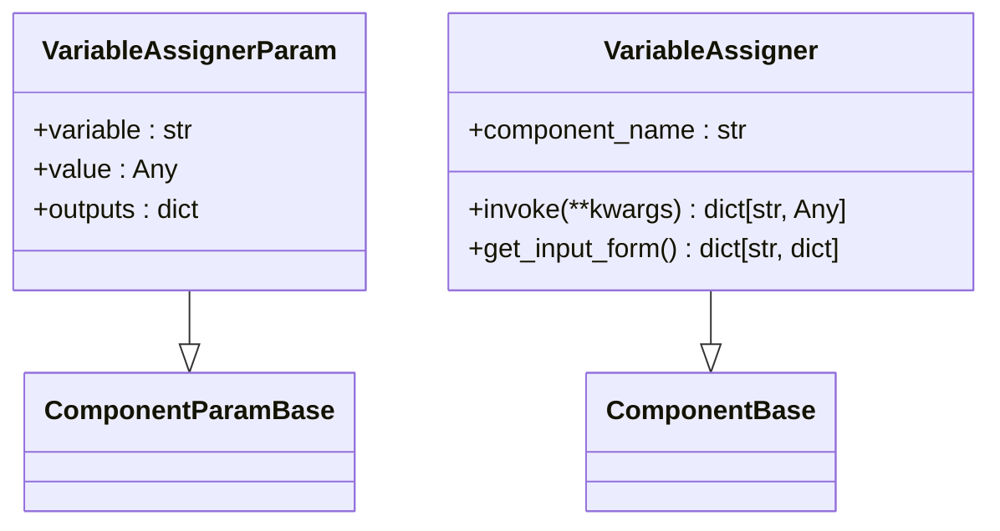
```mermaid
classDiagram
class VariableAssignerParam {
+variable : str
+value : Any
+outputs : dict
}
class VariableAssigner {
+component_name : str
+invoke(**kwargs) dict[str, Any]
+get_input_form() dict[str, dict]
}
VariableAssignerParam --|> ComponentParamBase
VariableAssigner --|> ComponentBase
```

**Diagram sources**
- [agent/component/variable_assigner.py](file://agent/component/variable_assigner.py)

### Logic and Control Flow Components

#### Categorize Component
The Categorize component classifies user input into predefined categories based on examples and descriptions. It uses an LLM to determine which category best matches the input and routes the workflow accordingly.

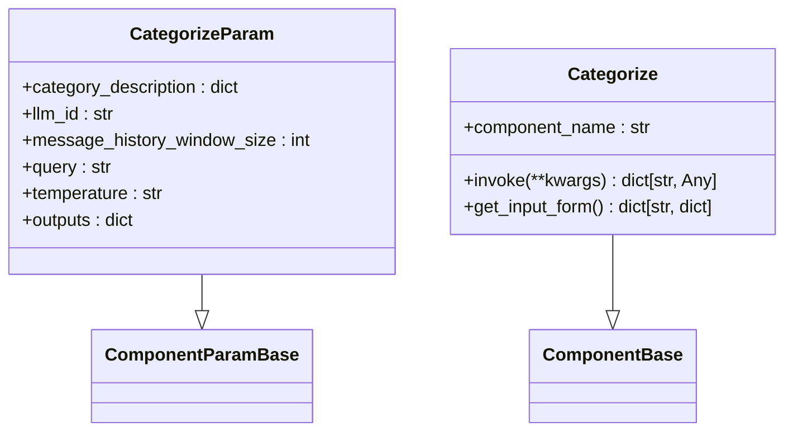
```mermaid
classDiagram
class CategorizeParam {
+category_description : dict
+llm_id : str
+message_history_window_size : int
+query : str
+temperature : str
+outputs : dict
}
class Categorize {
+component_name : str
+invoke(**kwargs) dict[str, Any]
+get_input_form() dict[str, dict]
}
CategorizeParam --|> ComponentParamBase
Categorize --|> ComponentBase
```

**Diagram sources**
- [agent/component/categorize.py](file://agent/component/categorize.py)

#### Switch Component
The Switch component provides conditional branching based on the value of a variable. It evaluates a condition and routes the workflow to different paths based on the result.

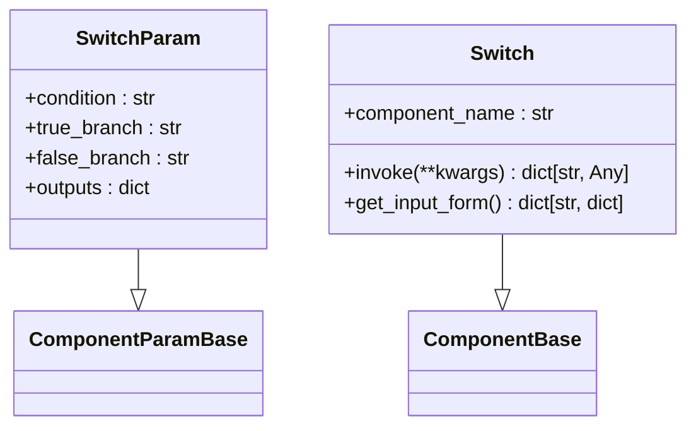
```mermaid
classDiagram
class SwitchParam {
+condition : str
+true_branch : str
+false_branch : str
+outputs : dict
}
class Switch {
+component_name : str
+invoke(**kwargs) dict[str, Any]
+get_input_form() dict[str, dict]
}
SwitchParam --|> ComponentParamBase
Switch --|> ComponentBase
```

**Diagram sources**
- [agent/component/switch.py](file://agent/component/switch.py)

#### Loop and Iteration Components
The Loop and Iteration components enable repetitive processing of data. The Loop component defines a loop structure, while the Iteration component processes individual items within the loop.

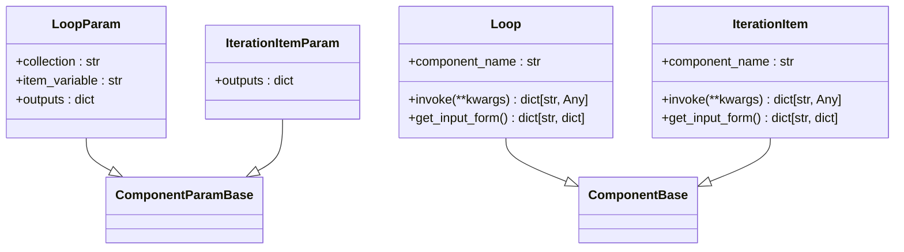
```mermaid
classDiagram
class LoopParam {
+collection : str
+item_variable : str
+outputs : dict
}
class Loop {
+component_name : str
+invoke(**kwargs) dict[str, Any]
+get_input_form() dict[str, dict]
}
class IterationItemParam {
+outputs : dict
}
class IterationItem {
+component_name : str
+invoke(**kwargs) dict[str, Any]
+get_input_form() dict[str, dict]
}
LoopParam --|> ComponentParamBase
Loop --|> ComponentBase
IterationItemParam --|> ComponentParamBase
IterationItem --|> ComponentBase
```

**Diagram sources**
- [agent/component/loop.py](file://agent/component/loop.py)
- [agent/component/iterationitem.py](file://agent/component/iterationitem.py)

### Processing Components

#### String Transform Component
The StringTransform component performs text manipulation operations such as case conversion, trimming, and pattern replacement.

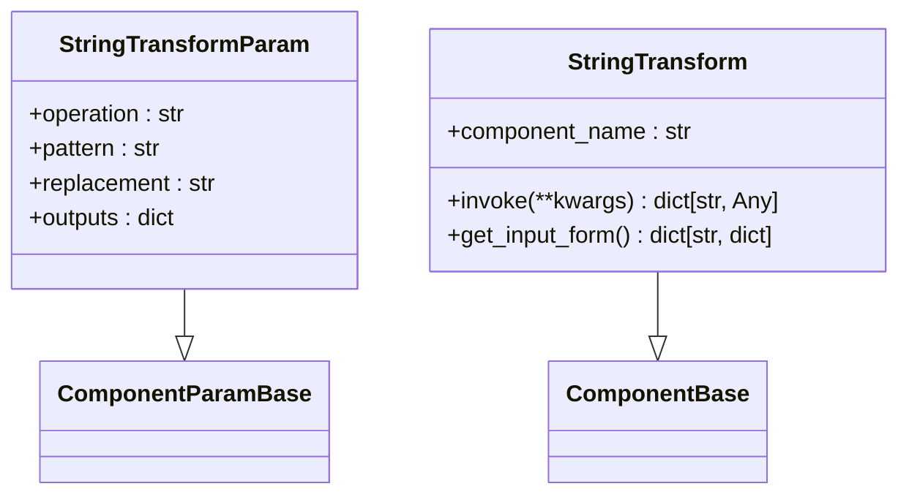
```mermaid
classDiagram
class StringTransformParam {
+operation : str
+pattern : str
+replacement : str
+outputs : dict
}
class StringTransform {
+component_name : str
+invoke(**kwargs) dict[str, Any]
+get_input_form() dict[str, dict]
}
StringTransformParam --|> ComponentParamBase
StringTransform --|> ComponentBase
```

**Diagram sources**
- [agent/component/string_transform.py](file://agent/component/string_transform.py)

#### Data Operations Component
The DataOperations component performs mathematical and logical operations on numerical data.

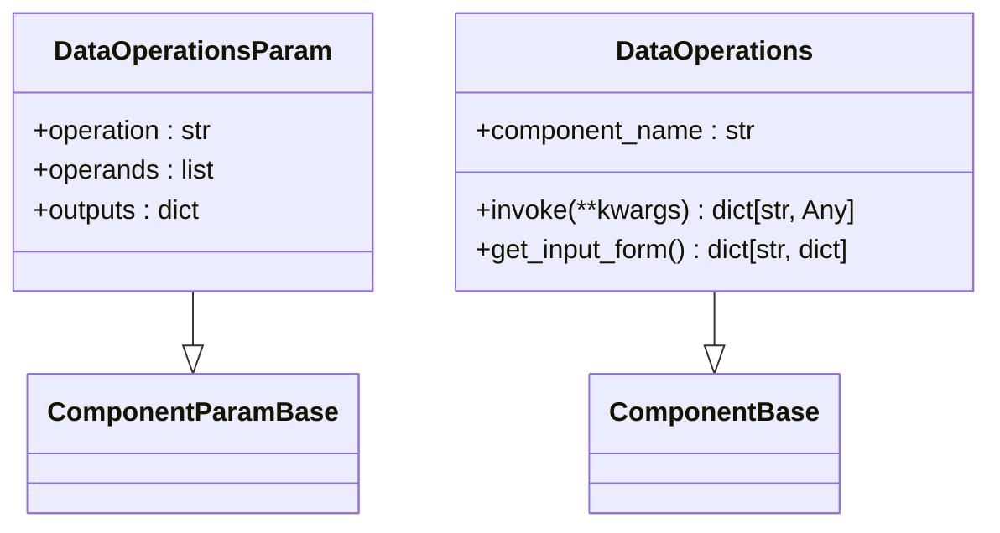
```mermaid
classDiagram
class DataOperationsParam {
+operation : str
+operands : list
+outputs : dict
}
class DataOperations {
+component_name : str
+invoke(**kwargs) dict[str, Any]
+get_input_form() dict[str, dict]
}
DataOperationsParam --|> ComponentParamBase
DataOperations --|> ComponentBase
```

**Diagram sources**
- [agent/component/data_operations.py](file://agent/component/data_operations.py)

### Integration Components

#### Invoke Component
The Invoke component makes HTTP requests to external APIs and services. It supports GET, POST, and PUT methods with configurable headers, timeouts, and authentication.

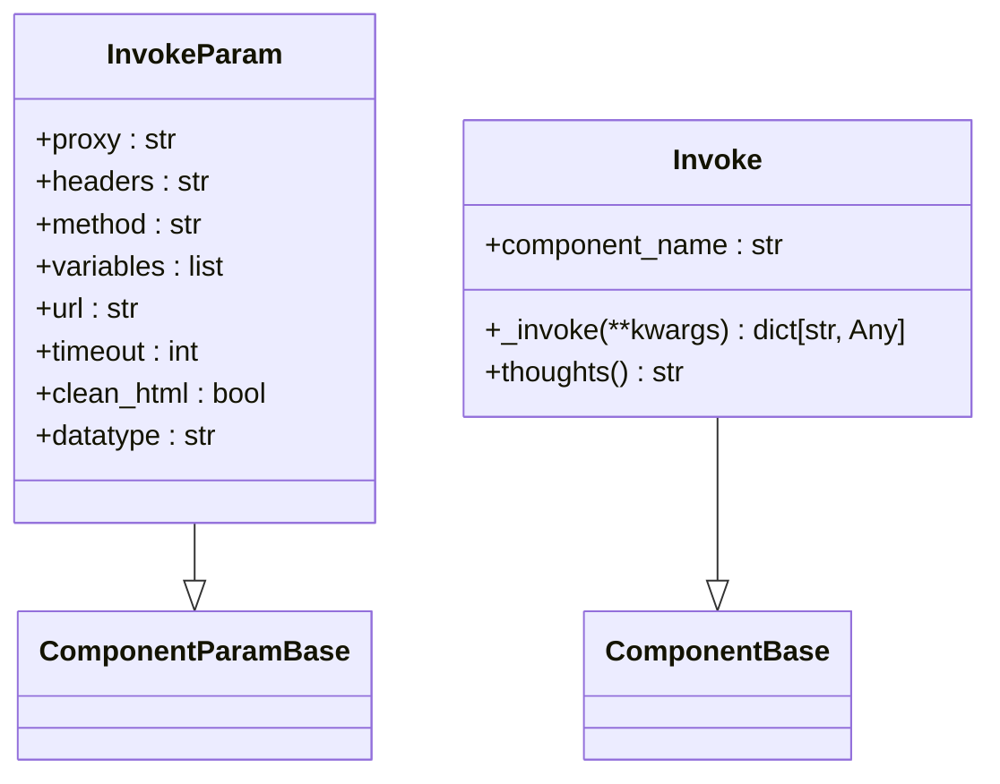
```mermaid
classDiagram
class InvokeParam {
+proxy : str
+headers : str
+method : str
+variables : list
+url : str
+timeout : int
+clean_html : bool
+datatype : str
}
class Invoke {
+component_name : str
+_invoke(**kwargs) dict[str, Any]
+thoughts() str
}
InvokeParam --|> ComponentParamBase
Invoke --|> ComponentBase
```

**Diagram sources**
- [agent/component/invoke.py](file://agent/component/invoke.py#L30-L145)

#### Webhook Component
The Webhook component receives and processes incoming webhook payloads, making them available to other components in the workflow.

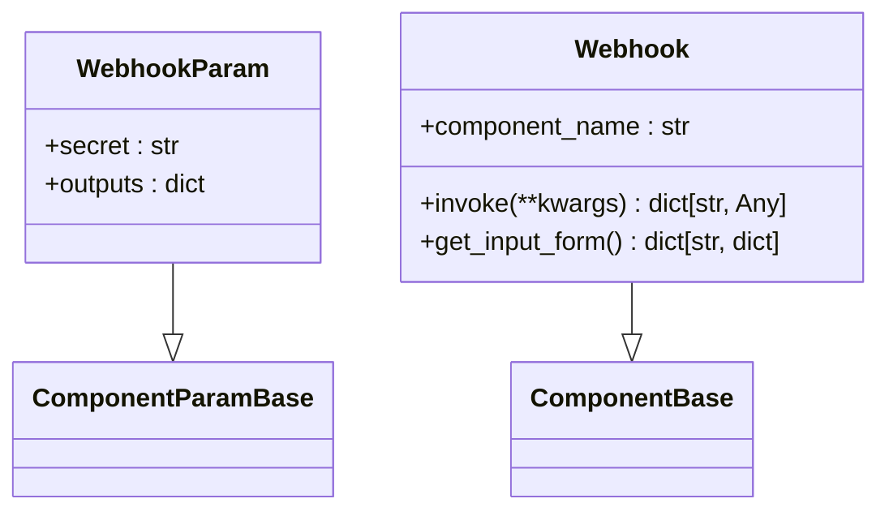
```mermaid
classDiagram
class WebhookParam {
+secret : str
+outputs : dict
}
class Webhook {
+component_name : str
+invoke(**kwargs) dict[str, Any]
+get_input_form() dict[str, dict]
}
WebhookParam --|> ComponentParamBase
Webhook --|> ComponentBase
```

**Diagram sources**
- [agent/component/webhook.py](file://agent/component/webhook.py)

**Section sources**
- [agent/component/begin.py](file://agent/component/begin.py)
- [agent/component/message.py](file://agent/component/message.py)
- [agent/component/variable_assigner.py](file://agent/component/variable_assigner.py)
- [agent/component/categorize.py](file://agent/component/categorize.py)
- [agent/component/switch.py](file://agent/component/switch.py)
- [agent/component/loop.py](file://agent/component/loop.py)
- [agent/component/iterationitem.py](file://agent/component/iterationitem.py)
- [agent/component/string_transform.py](file://agent/component/string_transform.py)
- [agent/component/data_operations.py](file://agent/component/data_operations.py)
- [agent/component/invoke.py](file://agent/component/invoke.py)
- [agent/component/webhook.py](file://agent/component/webhook.py)

## Workflow Orchestration

The agent system provides sophisticated workflow orchestration capabilities that enable the creation of complex, multi-step processes. Workflows are defined as directed graphs where components are nodes and data flows are represented by edges.

### Workflow Execution Model

The Canvas class orchestrates workflow execution through its `run()` method, which processes components in sequence according to the defined path. The execution model supports several key features:

1. **Sequential Execution**: Components are executed in the order defined by the path
2. **Parallel Execution**: Independent components can be executed in parallel using a thread pool
3. **Conditional Branching**: Components like Categorize and Switch can alter the execution path
4. **Looping**: Loop and Iteration components enable repetitive processing
5. **Error Handling**: Components can define error handling strategies and recovery paths

The execution flow begins with the Begin component and proceeds through the workflow based on the downstream connections defined in the DSL (Domain Specific Language). Each component's output can influence the path of subsequent components.

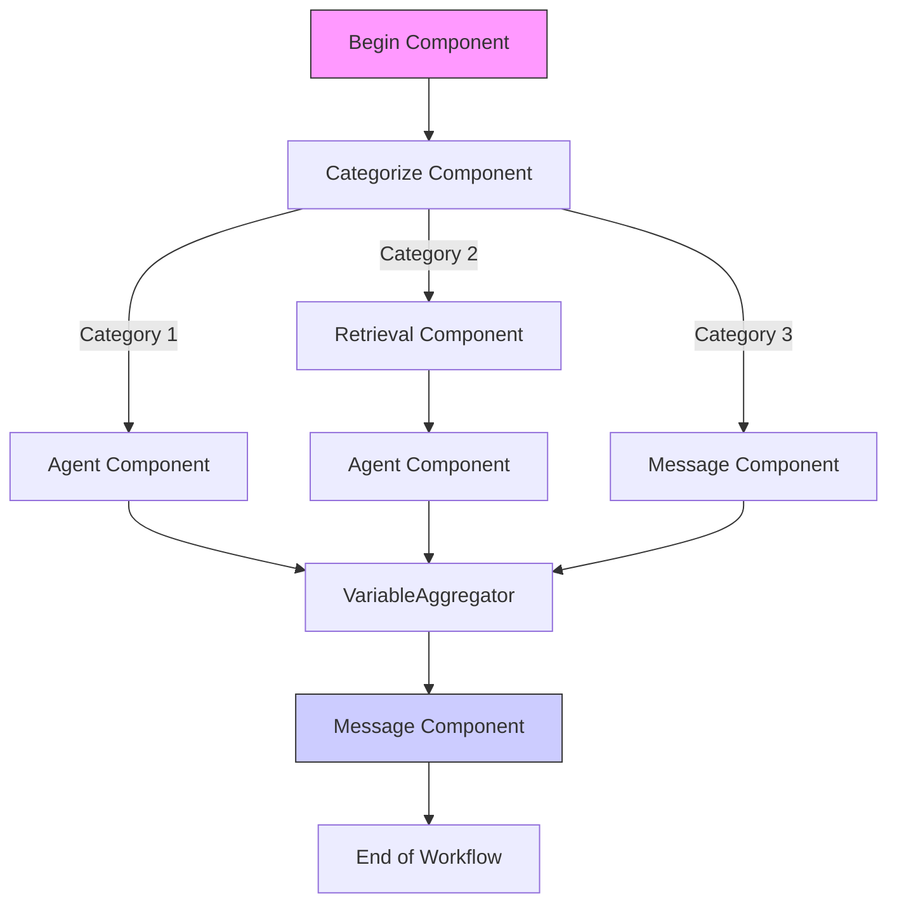
```mermaid
flowchart TD
Begin[Begin Component] --> Categorize[Categorize Component]
Categorize --> |Category 1| Agent1[Agent Component]
Categorize --> |Category 2| Retrieval[Retrieval Component]
Categorize --> |Category 3| Message1[Message Component]
Agent1 --> Aggregator[VariableAggregator]
Retrieval --> Agent2[Agent Component]
Agent2 --> Aggregator
Message1 --> Aggregator
Aggregator --> Message2[Message Component]
Message2 --> End[End of Workflow]
style Begin fill:#f9f,stroke:#333
style Message2 fill:#ccf,stroke:#333
```

**Diagram sources**
- [agent/canvas.py](file://agent/canvas.py#L363-L631)

### Variable Management and Data Flow

The agent system uses a sophisticated variable management system to enable data flow between components. Variables can be referenced using the syntax `{component_id@variable_name}` or `{sys.variable_name}` for system variables.

The Canvas class provides methods for managing variables:
- `get_variable_value(exp: str)`: Retrieves the value of a variable
- `set_variable_value(exp: str, value: Any)`: Sets the value of a variable
- `get_value_with_variable(value: str)`: Resolves variable references in a string

System variables include:
- `sys.query`: The user's query or input
- `sys.user_id`: The tenant ID
- `sys.conversation_turns`: The number of conversation turns
- `sys.files`: Uploaded files

Components can also define environment variables that are scoped to the workflow.

### Error Handling and Recovery

The agent system includes comprehensive error handling mechanisms:
- **Component-level error handling**: Each component can define error handling strategies
- **Workflow-level error handling**: The Canvas can detect and respond to errors
- **Retry mechanisms**: Components can be configured to retry on failure
- **Fallback paths**: Workflows can define alternative paths when errors occur

Components can specify error handling parameters:
- `exception_method`: The error handling strategy (e.g., "comment", "goto", "default_value")
- `exception_default_value`: The default value to return on error
- `exception_goto`: The component ID to jump to on error

### Execution States and Lifecycle

The agent workflow has a well-defined lifecycle with several states:
1. **Initialization**: The Canvas loads the DSL and initializes components
2. **Execution**: Components are executed according to the defined path
3. **Streaming**: For components with streaming output, data is yielded incrementally
4. **Completion**: The workflow completes and returns the final output
5. **Cancellation**: The workflow can be canceled externally

The Canvas maintains state through its `path` attribute, which tracks the current execution path, and the `history` attribute, which stores conversation history.

**Section sources**
- [agent/canvas.py](file://agent/canvas.py#L1-L793)
- [agent/component/base.py](file://agent/component/base.py#L1-L583)

## Template-Based Workflows

The agent system provides a collection of pre-built templates in the `agent/templates/` directory that demonstrate common use cases and patterns. These templates serve as starting points for creating custom workflows.

### Customer Service Workflow

The customer_service.json template implements a multi-agent customer support system that classifies user queries and routes them to specialized agents.

```json
{
    "title": "Multi-Agent Customer Support",
    "description": "This is a multi-agent system for intelligent customer service processing based on user intent classification.",
    "canvas_type": "Agent",
    "dsl": {
        "components": {
            "Categorize:DullFriendsThank": {
                "obj": {
                    "component_name": "Categorize",
                    "params": {
                        "category_description": {
                            "1. contact": {
                                "description": "This answer provide a specific contact information...",
                                "to": ["Message:BreezyDonutsHeal"]
                            },
                            "2. casual": {
                                "description": "The question is not about the product usage...",
                                "to": ["Agent:TwelveOwlsWatch"]
                            },
                            "3. complain": {
                                "description": "Complain even curse about the product or service...",
                                "to": ["Agent:DullTownsHope"]
                            },
                            "4. product related": {
                                "description": "The question is about the product usage...",
                                "to": ["Retrieval:ShyPumasJoke"]
                            }
                        },
                        "llm_id": "deepseek-chat@DeepSeek"
                    }
                }
            }
        }
    }
}
```

This workflow:
1. Uses the Categorize component to classify user queries into four categories
2. Routes contact information requests to a simple response message
3. Routes casual conversation to a friendly conversational agent
4. Routes complaints to an empathetic mood-soothing agent
5. Routes product-related questions to a retrieval system and product information agent
6. Aggregates responses from specialized agents and delivers a unified response

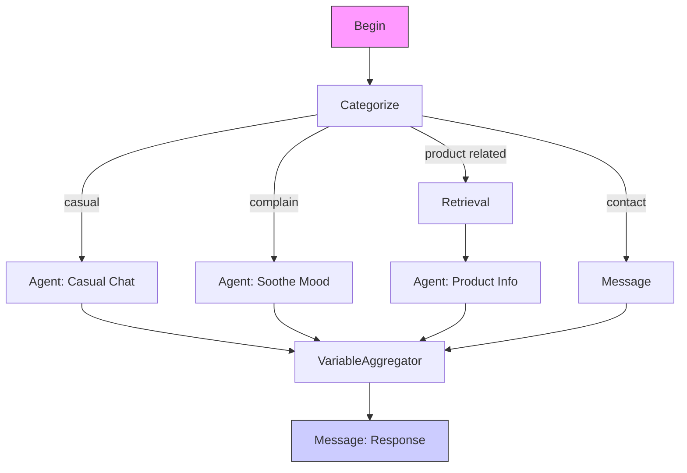
```mermaid
graph TD
Begin[Begin] --> Categorize[Categorize]
Categorize --> |contact| Message1[Message]
Categorize --> |casual| Agent1[Agent: Casual Chat]
Categorize --> |complain| Agent2[Agent: Soothe Mood]
Categorize --> |product related| Retrieval[Retrieval]
Retrieval --> Agent3[Agent: Product Info]
Agent1 --> Aggregator[VariableAggregator]
Agent2 --> Aggregator
Agent3 --> Aggregator
Message1 --> Aggregator
Aggregator --> Message2[Message: Response]
style Begin fill:#f9f,stroke:#333
style Message2 fill:#ccf,stroke:#333
```

**Diagram sources**
- [agent/templates/customer_service.json](file://agent/templates/customer_service.json)

### Deep Research Workflow

The deep_research.json template implements a sophisticated research workflow that uses multiple specialized agents to conduct comprehensive investigations.

```json
{
    "title": "Deep Research",
    "description": "For professionals in sales, marketing, policy, or consulting, the Multi-Agent Deep Research Agent conducts structured, multi-step investigations across diverse sources and delivers consulting-style reports with clear citations.",
    "canvas_type": "Recommended",
    "dsl": {
        "components": {
            "Agent:NewPumasLick": {
                "obj": {
                    "component_name": "Agent",
                    "params": {
                        "sys_prompt": "You are a Strategy Research Director with 20 years of consulting experience...",
                        "tools": [
                            {
                                "component_name": "Agent",
                                "name": "Web Search Specialist",
                                "params": {
                                    "sys_prompt": "You are a Web Search Specialist working as part of a research team...",
                                    "tools": [
                                        {
                                            "component_name": "TavilySearch",
                                            "name": "TavilySearch",
                                            "params": {
                                                "max_results": 5,
                                                "search_depth": "basic"
                                            }
                                        }
                                    ]
                                }
                            },
                            {
                                "component_name": "Agent",
                                "name": "Content Deep Reader",
                                "params": {
                                    "sys_prompt": "You are a Content Deep Reader working as part of a research team...",
                                    "tools": [
                                        {
                                            "component_name": "TavilyExtract",
                                            "name": "TavilyExtract"
                                        }
                                    ]
                                }
                            },
                            {
                                "component_name": "Agent",
                                "name": "Research Synthesizer",
                                "params": {
                                    "sys_prompt": "You are a Research Synthesizer working as part of a research team..."
                                }
                            }
                        ]
                    }
                }
            }
        }
    }
}
```

This workflow implements a three-stage research process:
1. **URL Discovery**: A Web Search Specialist agent uses search tools to identify premium sources
2. **Content Extraction**: A Content Deep Reader agent extracts structured information from the identified URLs
3. **Strategic Report Generation**: A Research Synthesizer agent generates a comprehensive report based on the extracted content

The workflow demonstrates advanced agent orchestration with specialized sub-agents, each with specific roles and tools.

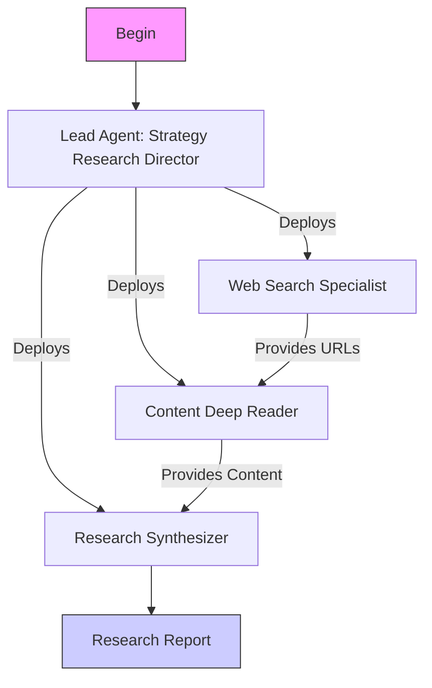
```mermaid
graph TD
Begin[Begin] --> LeadAgent[Lead Agent: Strategy Research Director]
LeadAgent --> |Deploys| WebSearch[Web Search Specialist]
LeadAgent --> |Deploys| ContentReader[Content Deep Reader]
LeadAgent --> |Deploys| Synthesizer[Research Synthesizer]
WebSearch --> |Provides URLs| ContentReader
ContentReader --> |Provides Content| Synthesizer
Synthesizer --> Report[Research Report]
style Begin fill:#f9f,stroke:#333
style Report fill:#ccf,stroke:#333
```

**Diagram sources**
- [agent/templates/deep_research.json](file://agent/templates/deep_research.json)

### Knowledge Base Report Workflow

The knowledge_base_report.json template implements a report generation assistant that uses a local knowledge base for information retrieval.

```json
{
    "title": "Report Agent Using Knowledge Base",
    "description": "A report generation assistant using local knowledge base, with advanced capabilities in task planning, reasoning, and reflective analysis.",
    "canvas_type": "Agent",
    "dsl": {
        "components": {
            "Agent:NewPumasLick": {
                "obj": {
                    "component_name": "Agent",
                    "params": {
                        "sys_prompt": "## Role & Task\nYou are a \"Knowledge Base Retrieval Q&A Agent\" whose goal is to break down the user's question into retrievable subtasks...",
                        "tools": [
                            {
                                "component_name": "Retrieval",
                                "name": "Retrieval",
                                "params": {
                                    "kb_ids": [],
                                    "top_k": 1024,
                                    "top_n": 8
                                }
                            }
                        ]
                    }
                }
            }
        }
    }
}
```

This workflow:
1. Uses an Agent component with a detailed system prompt that defines a structured research process
2. Integrates a Retrieval tool to access a knowledge base
3. Follows a multi-stage research framework including assessment, query type determination, research plan formulation, retrieval execution, and integration
4. Implements quality gates at each stage to ensure research standards are met

The workflow is particularly suited for academic research paper Q&A and other knowledge-intensive tasks.

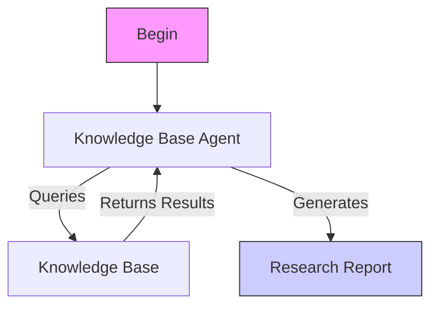
```mermaid
graph TD
Begin[Begin] --> Agent[Knowledge Base Agent]
Agent --> |Queries| KB[Knowledge Base]
KB --> |Returns Results| Agent
Agent --> |Generates| Report[Research Report]
style Begin fill:#f9f,stroke:#333
style Report fill:#ccf,stroke:#333
```

**Diagram sources**
- [agent/templates/knowledge_base_report.json](file://agent/templates/knowledge_base_report.json)

### Other Template Workflows

The agent system includes several other template workflows that demonstrate various patterns:

- **Document Analysis**: Workflows like `cv_analysis_and_candidate_evaluation.json` that extract and analyze information from documents
- **Data Extraction**: Workflows like `customer_review_analysis.json` that extract insights from unstructured data
- **Automated Reasoning**: Workflows like `deep_search_r.json` that perform complex reasoning tasks
- **Content Generation**: Workflows like `generate_SEO_blog.json` that generate content based on research
- **Technical Support**: Workflows like `technical_docs_qa.json` that answer technical questions using documentation

These templates can be customized by modifying the component parameters, adding or removing components, and adjusting the workflow structure to meet specific requirements.

**Section sources**
- [agent/templates/customer_service.json](file://agent/templates/customer_service.json)
- [agent/templates/deep_research.json](file://agent/templates/deep_research.json)
- [agent/templates/knowledge_base_report.json](file://agent/templates/knowledge_base_report.json)
- [agent/templates/cv_analysis_and_candidate_evaluation.json](file://agent/templates/cv_analysis_and_candidate_evaluation.json)
- [agent/templates/customer_review_analysis.json](file://agent/templates/customer_review_analysis.json)
- [agent/templates/deep_search_r.json](file://agent/templates/deep_search_r.json)
- [agent/templates/generate_SEO_blog.json](file://agent/templates/generate_SEO_blog.json)
- [agent/templates/technical_docs_qa.json](file://agent/templates/technical_docs_qa.json)

## MCP Integration and Tool Calling

The agent system integrates with external tools and services through the Model Context Protocol (MCP), providing a standardized interface for tool calling and function execution.

### MCP Architecture

MCP (Model Context Protocol) is a standardized protocol for connecting AI models with external tools and services. The integration is implemented in the `common/mcp_tool_call_conn.py` file and provides a `MCPToolCallSession` class that manages connections to MCP servers.

The MCP architecture consists of:
- **MCP Servers**: External services that expose tools via the MCP protocol
- **Tool Call Sessions**: Client-side sessions that manage communication with MCP servers
- **Tool Metadata**: Standardized descriptions of available tools
- **Tool Invocation**: Standardized method for calling tools with parameters

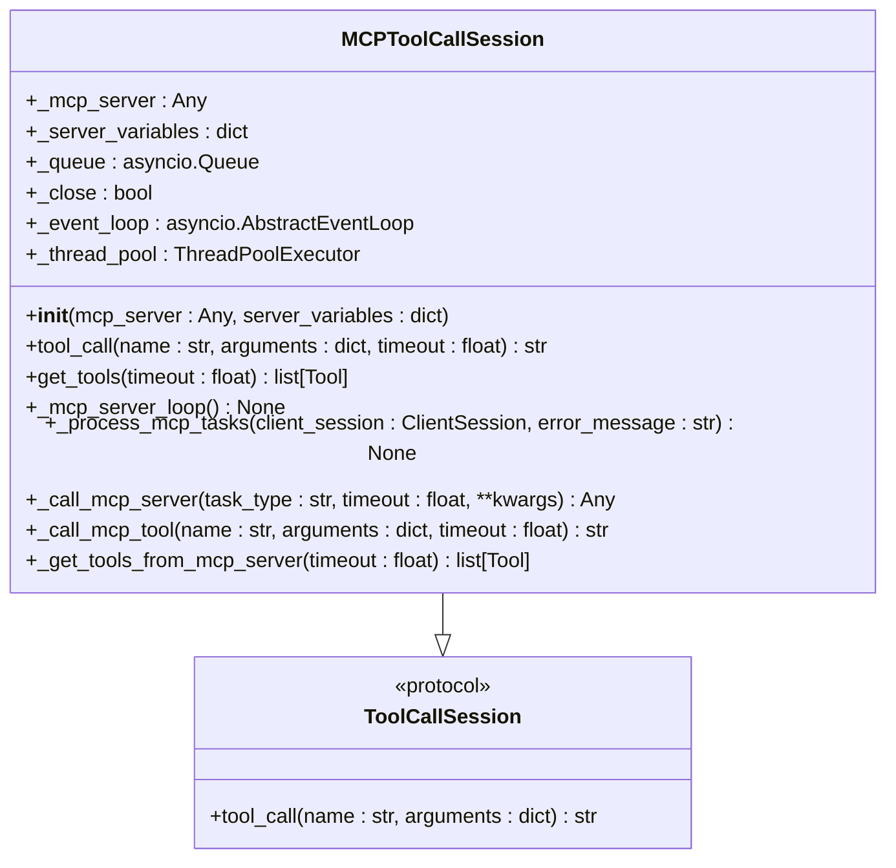
```mermaid
classDiagram
class MCPToolCallSession {
+_mcp_server : Any
+_server_variables : dict
+_queue : asyncio.Queue
+_close : bool
+_event_loop : asyncio.AbstractEventLoop
+_thread_pool : ThreadPoolExecutor
+__init__(mcp_server : Any, server_variables : dict)
+tool_call(name : str, arguments : dict, timeout : float) str
+get_tools(timeout : float) list[Tool]
+_mcp_server_loop() None
+_process_mcp_tasks(client_session : ClientSession, error_message : str) None
+_call_mcp_server(task_type : str, timeout : float, **kwargs) Any
+_call_mcp_tool(name : str, arguments : dict, timeout : float) str
+_get_tools_from_mcp_server(timeout : float) list[Tool]
}
class ToolCallSession {
<<protocol>>
+tool_call(name : str, arguments : dict) str
}
MCPToolCallSession --|> ToolCallSession
```

**Diagram sources**
- [common/mcp_tool_call_conn.py](file://common/mcp_tool_call_conn.py#L42-L325)

### Tool Calling Mechanism

The agent system uses the `LLMToolPluginCallSession` class to manage tool calls. This class acts as a bridge between the agent system and external tools, including both built-in tools and MCP tools.

When an agent needs to call a tool:
1. The agent invokes the `tool_call` method on the `LLMToolPluginCallSession`
2. The session determines whether the tool is a built-in tool or an MCP tool
3. For built-in tools, the session calls the tool's `invoke` method directly
4. For MCP tools, the session forwards the call to the appropriate `MCPToolCallSession`
5. The result is returned to the agent

The tool calling mechanism supports:
- **Synchronous calls**: The agent waits for the tool to complete
- **Asynchronous calls**: The agent can continue processing while the tool executes
- **Streaming responses**: Tools can return results incrementally
- **Error handling**: Failed tool calls are handled gracefully

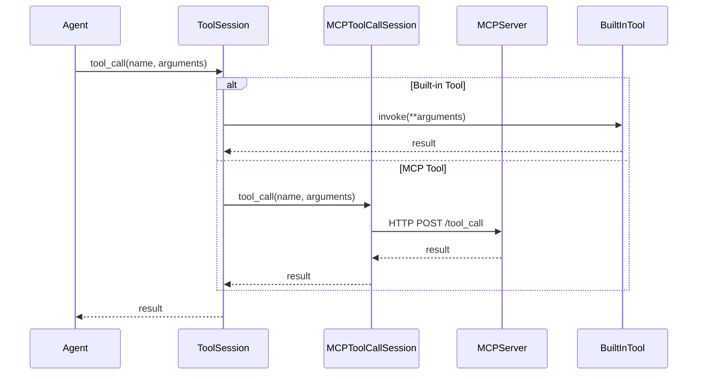
```mermaid
sequenceDiagram
participant Agent
participant ToolSession
participant MCPToolCallSession
participant MCPServer
Agent->>ToolSession : tool_call(name, arguments)
alt Built-in Tool
ToolSession->>BuiltInTool : invoke(**arguments)
BuiltInTool-->>ToolSession : result
else MCP Tool
ToolSession->>MCPToolCallSession : tool_call(name, arguments)
MCPToolCallSession->>MCPServer : HTTP POST /tool_call
MCPServer-->>MCPToolCallSession : result
MCPToolCallSession-->>ToolSession : result
end
ToolSession-->>Agent : result
```

**Diagram sources**
- [agent/component/agent_with_tools.py](file://agent/component/agent_with_tools.py#L100-L107)
- [common/mcp_tool_call_conn.py](file://common/mcp_tool_call_conn.py#L42-L325)

### MCP Server Integration

MCP servers are configured through the web interface and stored in the database. The server configuration includes:
- **URL**: The endpoint of the MCP server
- **Server Type**: The type of MCP server (e.g., "fetch", "github")
- **Headers**: Authentication and other headers
- **Variables**: Template variables for dynamic configuration

The `mcp_server_app.py` file provides API endpoints for managing MCP servers and testing tool calls:

```python
@manager.route("/test_tool", methods=["POST"])
@login_required
@validate_request("mcp_id", "tool_name", "arguments")
def test_tool():
    # Test a specific tool on an MCP server
    pass

@manager.route("/cache_tools", methods=["POST"])
@login_required
@validate_request("mcp_id", "tools")
async def cache_tool():
    # Cache tools from an MCP server
    pass

@manager.route("/test", methods=["POST"])
@login_required
@validate_request("server_type", "url", "headers", "variables")
async def test():
    # Test an MCP server connection
    pass
```

These endpoints allow users to discover available tools, test tool functionality, and cache tool metadata for faster access.

### Tool Metadata and Discovery

Tools are described using a standardized metadata format that includes:
- **Name**: The tool's identifier
- **Description**: A description of the tool's purpose
- **Parameters**: The parameters the tool accepts, including type, description, and whether they are required
- **Display Name**: A user-friendly name for the tool
- **Display Description**: A user-friendly description

The metadata is converted to the OpenAI tool format using the `mcp_tool_metadata_to_openai_tool` function:

```python
def mcp_tool_metadata_to_openai_tool(mcp_tool: Tool | dict) -> dict[str, Any]:
    return {
        "type": "function",
        "function": {
            "name": mcp_tool.name,
            "description": mcp_tool.description,
            "parameters": mcp_tool.inputSchema,
        },
    }
```

This allows MCP tools to be used with any system that supports the OpenAI tool calling format.

### Web Interface Integration

The web interface provides tools for managing MCP servers and tools. The TypeScript interfaces in `web/src/interfaces/database/mcp.ts` define the data structures used in the frontend:

```typescript
export interface IMcpServer {
  id: string;
  name: string;
  server_type: string;
  url: string;
  variables: Record<string, any>;
}

export interface IMCPTool {
  name: string;
  description: string;
  enabled: boolean;
  inputSchema: InputSchema;
}
```

The hooks in `web/src/hooks/use-mcp-request.ts` provide functions for testing MCP servers and tools:

```typescript
export const useTestMcpServer = () => {
  // Test an MCP server connection
};

export const useTestMcpServerTool = () => {
  // Test an MCP server tool
};

export const useCacheMcpServerTool = () => {
  // Cache MCP server tools
};
```

These frontend components allow users to configure, test, and manage MCP integrations through a user-friendly interface.

**Section sources**
- [common/mcp_tool_call_conn.py](file://common/mcp_tool_call_conn.py#L42-L325)
- [api/apps/mcp_server_app.py](file://api/apps/mcp_server_app.py#L354-L442)
- [web/src/interfaces/database/mcp.ts](file://web/src/interfaces/database/mcp.ts)
- [web/src/hooks/use-mcp-request.ts](file://web/src/hooks/use-mcp-request.ts)

## Practical Agent Workflows

The agent system supports a variety of practical workflows for common use cases. These workflows demonstrate how to combine components and tools to solve real-world problems.

### Document Analysis Workflow

A document analysis workflow can extract and analyze information from uploaded documents. This is useful for processing resumes, research papers, or business documents.

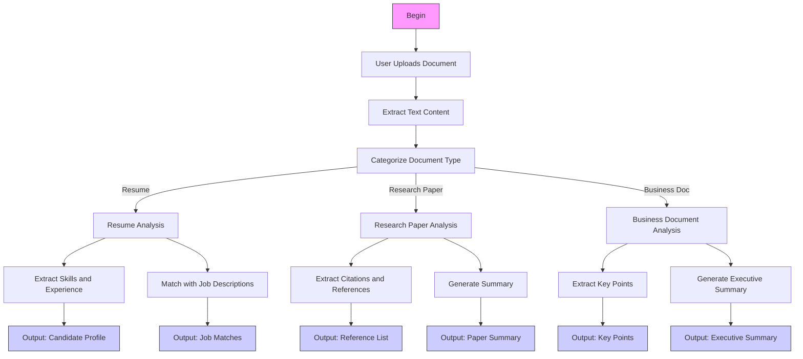
```mermaid
graph TD
Begin[Begin] --> Upload[User Uploads Document]
Upload --> Extract[Extract Text Content]
Extract --> Categorize[Categorize Document Type]
Categorize --> |Resume| ResumeFlow[Resume Analysis]
Categorize --> |Research Paper| ResearchFlow[Research Paper Analysis]
Categorize --> |Business Doc| BusinessFlow[Business Document Analysis]
ResumeFlow --> ExtractSkills[Extract Skills and Experience]
ResumeFlow --> MatchJobs[Match with Job Descriptions]
ResearchFlow --> ExtractCitations[Extract Citations and References]
ResearchFlow --> Summarize[Generate Summary]
BusinessFlow --> ExtractKeyPoints[Extract Key Points]
BusinessFlow --> GenerateReport[Generate Executive Summary]
ExtractSkills --> Output1[Output: Candidate Profile]
MatchJobs --> Output2[Output: Job Matches]
ExtractCitations --> Output3[Output: Reference List]
Summarize --> Output4[Output: Paper Summary]
ExtractKeyPoints --> Output5[Output: Key Points]
GenerateReport --> Output6[Output: Executive Summary]
style Begin fill:#f9f,stroke:#333
style Output1 fill:#ccf,stroke:#333
style Output2 fill:#ccf,stroke:#333
style Output3 fill:#ccf,stroke:#333
style Output4 fill:#ccf,stroke:#333
style Output5 fill:#ccf,stroke:#333
style Output6 fill:#ccf,stroke:#333
```

This workflow:
1. Accepts a document upload from the user
2. Extracts the text content using document parsing tools
3. Classifies the document type using the Categorize component
4. Routes the document to specialized analysis workflows based on its type
5. Extracts relevant information using appropriate tools
6. Generates structured outputs for each document type

The workflow can be implemented using the `cv_analysis_and_candidate_evaluation.json` template as a starting point.

### Data Extraction Workflow

A data extraction workflow can extract structured information from unstructured text, such as customer reviews or social media posts.

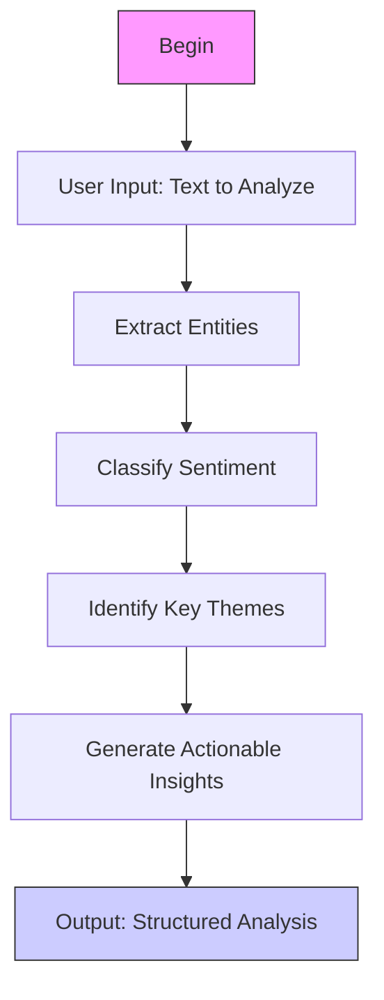
```mermaid
graph TD
Begin[Begin] --> Input[User Input: Text to Analyze]
Input --> ExtractEntities[Extract Entities]
ExtractEntities --> ClassifySentiment[Classify Sentiment]
ClassifySentiment --> IdentifyThemes[Identify Key Themes]
IdentifyThemes --> GenerateInsights[Generate Actionable Insights]
GenerateInsights --> Output[Output: Structured Analysis]
style Begin fill:#f9f,stroke:#333
style Output fill:#ccf,stroke:#333
```

This workflow:
1. Takes unstructured text as input
2. Uses NLP techniques to extract entities (people, organizations, products)
3. Classifies the sentiment of the text (positive, negative, neutral)
4. Identifies key themes and topics
5. Generates actionable insights based on the analysis

The workflow can be implemented using the `customer_review_analysis.json` template and enhanced with additional analysis components.

### Automated Reasoning Workflow

An automated reasoning workflow can solve complex problems by breaking them down into subproblems and using specialized agents for each subproblem.

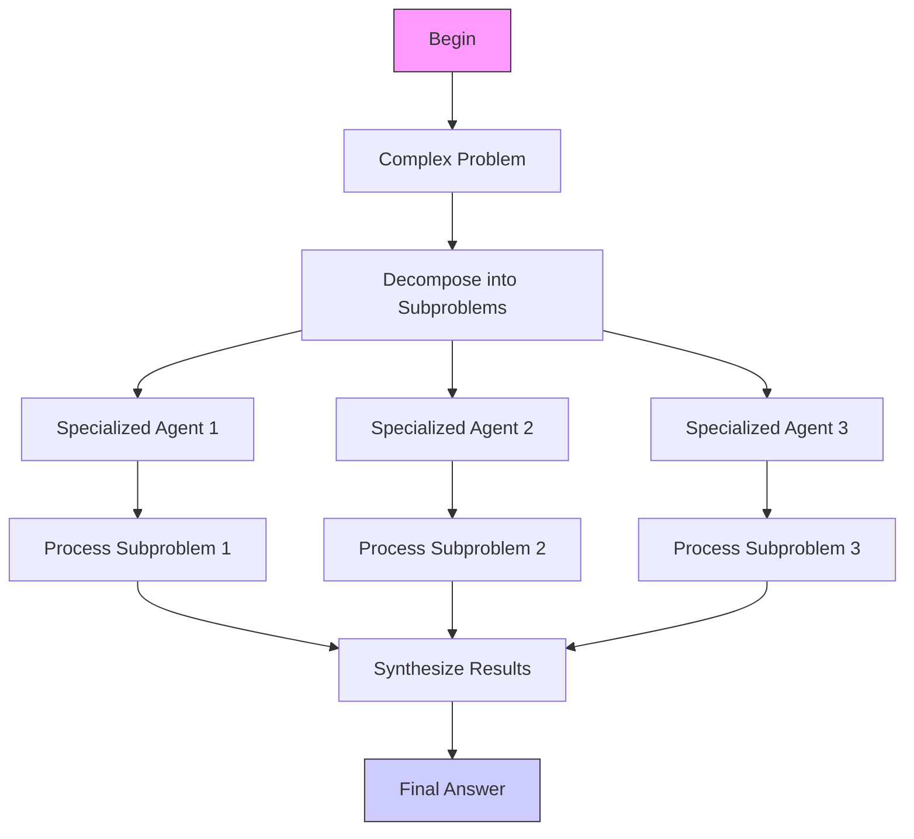
```mermaid
graph TD
Begin[Begin] --> Problem[Complex Problem]
Problem --> Decompose[Decompose into Subproblems]
Decompose --> Agent1[Specialized Agent 1]
Decompose --> Agent2[Specialized Agent 2]
Decompose --> Agent3[Specialized Agent 3]
Agent1 --> Process1[Process Subproblem 1]
Agent2 --> Process2[Process Subproblem 2]
Agent3 --> Process3[Process Subproblem 3]
Process1 --> Synthesize[Synthesize Results]
Process2 --> Synthesize
Process3 --> Synthesize
Synthesize --> FinalAnswer[Final Answer]
style Begin fill:#f9f,stroke:#333
style FinalAnswer fill:#ccf,stroke:#333
```

This workflow:
1. Takes a complex problem as input
2. Decomposes the problem into smaller, manageable subproblems
3. Routes each subproblem to a specialized agent with appropriate tools
4. Processes each subproblem in parallel
5. Synthesizes the results into a comprehensive answer

The workflow can be implemented using the `deep_research.json` template as a foundation.

### Customer Service Workflow

A customer service workflow can handle various types of customer inquiries by routing them to appropriate response mechanisms.

```mermaid
graph TD
Begin[Begin] --> Inquiry[Customer Inquiry]
Inquiry --> Classify[Classify Inquiry Type]
Classify --> |Technical| TechnicalSupport[Technical Support Agent]
Classify --> |Billing| BillingSupport[Billing Support Agent]
Classify --> |General| GeneralSupport[General Support Agent]
Classify --> |Complaint| ComplaintHandler[Complaint Handler Agent]
TechnicalSupport --> Resolve[Resolve Technical Issue]
BillingSupport --> Resolve[Resolve Billing Issue]
GeneralSupport --> Answer[Answer General Question]
ComplaintHandler --> Apologize[Apologize and Offer Solution]
Resolve --> Response[Generate Response]
Answer --> Response
Apologize --> Response
Response --> Customer[Send to Customer]
style Begin fill:#f9f,stroke:#333
style Customer fill:#ccf,stroke:#333
```

This workflow:
1. Receives a customer inquiry
2. Classifies the inquiry type using the Categorize component
3. Routes the inquiry to a specialized agent based on its type
4. Resolves the issue using appropriate tools and knowledge bases
5. Generates a response tailored to the inquiry type
6. Sends the response to the customer

The workflow can be implemented using the `customer_service.json` template.

**Section sources**
- [agent/templates/cv_analysis_and_candidate_evaluation.json](file://agent/templates/cv_analysis_and_candidate_evaluation.json)
- [agent/templates/customer_review_analysis.json](file://agent/templates/customer_review_analysis.json)
- [agent/templates/deep_research.json](file://agent/templates/deep_research.json)
- [agent/templates/customer_service.json](file://agent/templates/customer_service.json)

## Configuration and Parameters

The agent system provides extensive configuration options and parameters for customizing workflow behavior. These parameters are defined in the parameter classes that inherit from ComponentParamBase.

### Component Parameters

Each component has a corresponding parameter class that defines its configuration options. The parameters are divided into several categories:

#### Common Parameters
These parameters are available to most components:
- **message_history_window_size**: The number of previous messages to include in the context
- **inputs**: Input variables and their default values
- **outputs**: Output variables and their types
- **description**: A description of the component's purpose
- **max_retries**: The number of times to retry on failure
- **delay_after_error**: The delay between retries
- **exception_method**: The error handling strategy
- **exception_default_value**: The default value to return on error
- **exception_goto**: The component ID to jump to on error

#### LLM Parameters
The LLM and Agent components have additional parameters for configuring the language model:
- **llm_id**: The ID of the LLM to use
- **sys_prompt**: The system prompt that defines the agent's role and behavior
- **prompts**: The user prompts that provide context and instructions
- **max_tokens**: The maximum number of tokens in the response
- **temperature**: The creativity parameter (0-1)
- **top_p**: The nucleus sampling parameter
- **presence_penalty**: The penalty for repeating tokens
- **frequency_penalty**: The penalty for frequent tokens
- **output_structure**: The expected structure of the output
- **cite**: Whether to include citations from retrieved documents

#### Tool Parameters
Tools have parameters that configure their behavior:
- **api_key**: Authentication credentials
- **max_results**: The maximum number of results to return
- **search_depth**: The depth of the search (basic, advanced)
- **include_raw_content**: Whether to include raw content in results
- **days**: The time window for recent results
- **exclude_domains**: Domains to exclude from results
- **include_domains**: Domains to prioritize in results

### Return Values

Components return structured data through their outputs. The return values are defined in the `outputs` dictionary of the parameter class.

Common output variables include:
- **content**: The main output content (text, HTML, etc.)
- **result**: The result of a tool or operation
- **formalized_content**: Structured content from retrieval operations
- **structured**: Structured data in JSON format
- **use_tools**: Information about tools used during execution
- **_ERROR**: Error messages when execution fails
- **_created_time**: The timestamp when the component started
- **_elapsed_time**: The time taken to execute the component

### Configuration Best Practices

When configuring agent workflows, consider the following best practices:

1. **Set appropriate retry parameters**: Configure `max_retries` and `delay_after_error` based on the reliability of external services
2. **Use descriptive system prompts**: Write clear, detailed system prompts that define the agent's role and behavior
3. **Configure context window appropriately**: Set `message_history_window_size` based on the need for conversational context
4. **Implement robust error handling**: Define `exception_method`, `exception_default_value`, and `exception_goto` for critical components
5. **Optimize LLM parameters**: Tune `temperature`, `top_p`, and other LLM parameters for the specific use case
6. **Use streaming for long responses**: Enable streaming output for components that generate lengthy content
7. **Secure sensitive data**: Use environment variables and secure storage for API keys and credentials

### Parameter Validation

The agent system includes parameter validation to ensure configurations are correct. The ComponentParamBase class provides validation methods:

- `check_string()`: Validates string parameters
- `check_empty()`: Ensures parameters are not empty
- `check_positive_integer()`: Validates positive integers
- `check_positive_number()`: Validates positive numbers
- `check_nonnegative_number()`: Validates non-negative numbers
- `check_decimal_float()`: Validates decimal numbers between 0 and 1
- `check_boolean()`: Validates boolean parameters
- `check_open_unit_interval()`: Validates numbers between 0 and 1 (exclusive)
- `check_valid_value()`: Validates against a list of allowed values
- `check_defined_type()`: Validates parameter types

These validation methods are called in the `check()` method of each parameter class to ensure configurations are valid before execution.

**Section sources**
- [agent/component/base.py](file://agent/component/base.py#L256-L391)
- [agent/component/llm.py](file://agent/component/llm.py#L51-L60)
- [agent/component/agent_with_tools.py](file://agent/component/agent_with_tools.py#L43-L79)

## Custom Agent Development

The agent system provides a framework for developing custom agents and extending the system with new capabilities.

### Creating Custom Components

To create a custom component, follow these steps:

1. Create a new Python file in the `agent/component/` directory
2. Define a parameter class that inherits from ComponentParamBase
3. Define a component class that inherits from ComponentBase
4. Implement the `_invoke()` method to define the component's behavior
5. Register the component in the system

Example custom component:

```python
# agent/component/custom_analysis.py
from agent.component.base import ComponentBase, ComponentParamBase

class CustomAnalysisParam(ComponentParamBase):
    def __init__(self):
        super().__init__()
        self.analysis_type = "sentiment"
        self.threshold = 0.5
        self.outputs = {
            "result": {"type": "string"}
        }
    
    def check(self):
        self.check_valid_value(self.analysis_type, "Analysis type", ["sentiment", "topic", "entity"])
        self.check_decimal_float(self.threshold, "Threshold")

class CustomAnalysis(ComponentBase):
    component_name = "Custom Analysis"
    
    def _invoke(self, **kwargs):
        # Implement custom analysis logic
        text = self.get_input("text")
        if self._param.analysis_type == "sentiment":
            # Perform sentiment analysis
            result = analyze_sentiment(text, self._param.threshold)
        elif self._param.analysis_type == "topic":
            # Perform topic analysis
            result = extract_topics(text, self._param.threshold)
        else:
            # Perform entity analysis
            result = extract_entities(text, self._param.threshold)
        
        self.set_output("result", result)
        return result
    
    def get_input_form(self):
        return {
            "text": {"type": "textarea", "name": "Text to analyze"}
        }
```

### Creating Custom Tools

To create a custom tool, follow these steps:

1. Create a new Python file in the `agent/tools/` directory
2. Define a parameter class that inherits from ToolParamBase
3. Define a tool class that inherits from ToolBase
4. Implement the `_invoke()` method to define the tool's behavior
5. Register the tool in the system

Example custom tool:

```python
# agent/tools/custom_api.py
from agent.tools.base import ToolBase, ToolParamBase

class CustomAPIParam(ToolParamBase):
    meta = {
        "name": "custom_api",
        "description": "Call a custom API endpoint",
        "parameters": {
            "endpoint": {
                "type": "string",
                "description": "The API endpoint to call",
                "required": True
            },
            "method": {
                "type": "string",
                "description": "The HTTP method to use",
                "enum": ["GET", "POST", "PUT", "DELETE"],
                "required": True
            },
            "data": {
                "type": "object",
                "description": "The data to send with the request",
                "required": False
            }
        }
    }
    
    def __init__(self):
        super().__init__()
        self.api_key = ""

class CustomAPI(ToolBase):
    def _invoke(self, **kwargs):
        import requests
        
        # Get parameters
        endpoint = self.get_param("endpoint")
        method = self.get_param("method")
        data = self.get_param("data")
        
        # Make API call
        headers = {"Authorization": f"Bearer {self._param.api_key}"}
        url = f"https://api.example.com/{endpoint}"
        
        response = requests.request(method, url, json=data, headers=headers)
        response.raise_for_status()
        
        # Set output
        self.set_output("result", response.json())
        return response.json()
```

### Extending the Agent System

The agent system can be extended in several ways:

1. **Add new component types**: Create new component classes for specialized functionality
2. **Integrate new tools**: Add support for additional external services and APIs
3. **Enhance the Canvas**: Extend the Canvas class with new orchestration capabilities
4. **Improve error handling**: Add more sophisticated error recovery mechanisms
5. **Optimize performance**: Implement caching, parallelization, and other optimizations

When extending the system, follow these guidelines:
- Maintain backward compatibility with existing workflows
- Follow the existing code style and patterns
- Implement comprehensive error handling
- Provide clear documentation for new features
- Test thoroughly before deployment

### Debugging and Testing

The agent system includes several features for debugging and testing workflows:

1. **Debug mode**: Components can be executed in debug mode to inspect intermediate values
2. **Logging**: Comprehensive logging of component execution and tool calls
3. **Testing framework**: Unit tests for components and tools
4. **Workflow simulation**: Ability to simulate workflow execution with test data

To debug a workflow:
1. Enable debug mode in the component parameters
2. Examine the logs for detailed execution information
3. Use the testing framework to validate component behavior
4. Simulate the workflow with various inputs to ensure robustness

**Section sources**
- [agent/component/base.py](file://agent/component/base.py#L393-L583)
- [agent/tools/base.py](file://agent/tools/base.py#L114-L176)

## Conclusion

The RAGFlow agent system provides a powerful and flexible framework for creating intelligent workflows that can perform complex tasks through orchestration of specialized components and tools. The system's architecture, based on the Canvas execution engine and component-based design, enables the creation of sophisticated agent workflows for a wide range of applications.

Key strengths of the agent system include:
- **Modular architecture**: Components can be combined and reused in different workflows
- **Flexible orchestration**: Support for sequential, parallel, and conditional execution patterns
- **Rich tool ecosystem**: Integration with external services through MCP and built-in tools
- **Template-based development**: Pre-built templates for common use cases
- **Comprehensive configuration**: Extensive parameters for customizing behavior
- **Robust error handling**: Built-in mechanisms for handling failures and recovery

The agent system is particularly well-suited for applications that require:
- Multi-step reasoning and problem solving
- Integration with external data sources and services
- Complex decision making based on multiple factors
- Generation of structured outputs from unstructured inputs
- Personalized responses based on user context and history

By leveraging the agent system's capabilities, developers can create intelligent assistants that can handle complex tasks, provide valuable insights, and deliver exceptional user experiences.