# Custom Workflows

<cite>
**Referenced Files in This Document**
- [agent/component/base.py](file://agent/component/base.py)
- [agent/component/agent_with_tools.py](file://agent/component/agent_with_tools.py)
- [agent/canvas.py](file://agent/canvas.py)
- [agent/component/loop.py](file://agent/component/loop.py)
- [agent/component/switch.py](file://agent/component/switch.py)
- [agent/component/iteration.py](file://agent/component/iteration.py)
- [agent/component/variable_assigner.py](file://agent/component/variable_assigner.py)
- [agent/component/varaiable_aggregator.py](file://agent/component/varaiable_aggregator.py)
- [agent/component/loopitem.py](file://agent/component/loopitem.py)
- [agent/component/iterationitem.py](file://agent/component/iterationitem.py)
- [agent/component/exit_loop.py](file://agent/component/exit_loop.py)
- [agent/component/categorize.py](file://agent/component/categorize.py)
- [agent/component/message.py](file://agent/component/message.py)
- [agent/component/invoke.py](file://agent/component/invoke.py)
- [agent/templates/choose_your_knowledge_base_workflow.json](file://agent/templates/choose_your_knowledge_base_workflow.json)
- [agent/templates/customer_service.json](file://agent/templates/customer_service.json)
- [agent/test/dsl_examples/iteration.json](file://agent/test/dsl_examples/iteration.json)
</cite>

## Table of Contents
1. [Introduction](#introduction)
2. [Workflow Architecture Overview](#workflow-architecture-overview)
3. [Core Components](#core-components)
4. [Control Flow Components](#control-flow-components)
5. [Data Manipulation Components](#data-manipulation-components)
6. [Building Custom Workflows](#building-custom-workflows)
7. [Domain Model and Execution](#domain-model-and-execution)
8. [Advanced Patterns](#advanced-patterns)
9. [Debugging and Troubleshooting](#debugging-and-troubleshooting)
10. [Best Practices](#best-practices)

## Introduction

RAGFlow's custom workflow system provides a powerful visual programming interface for creating sophisticated AI agent interactions. The system is built around a directed acyclic graph (DAG) architecture where components represent individual processing units that communicate through variable passing and control flow mechanisms.

Workflows in RAGFlow enable complex multi-agent scenarios, iterative processing, conditional branching, and sophisticated data manipulation patterns. The system supports everything from simple linear processing to complex nested loops and parallel execution patterns.

## Workflow Architecture Overview

The workflow system is built on several key architectural principles:

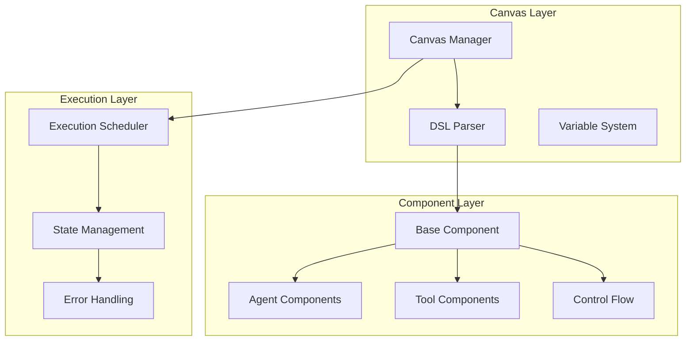

**Diagram sources**
- [agent/canvas.py](file://agent/canvas.py#L40-L100)
- [agent/component/base.py](file://agent/component/base.py#L393-L450)

### Key Architectural Features

1. **Visual Programming Interface**: Workflows are defined through a drag-and-drop interface with JSON-based DSL representation
2. **Component-Based Design**: Each workflow element is a reusable component with standardized interfaces
3. **Variable System**: Components communicate through a flexible variable passing mechanism
4. **Execution Engine**: Asynchronous execution with proper state management and error handling
5. **Extensible Architecture**: Easy addition of new component types and capabilities

**Section sources**
- [agent/canvas.py](file://agent/canvas.py#L40-L100)
- [agent/component/base.py](file://agent/component/base.py#L393-L450)

## Core Components

### Base Component Architecture

All workflow components inherit from the `ComponentBase` class, which provides essential functionality for workflow execution:

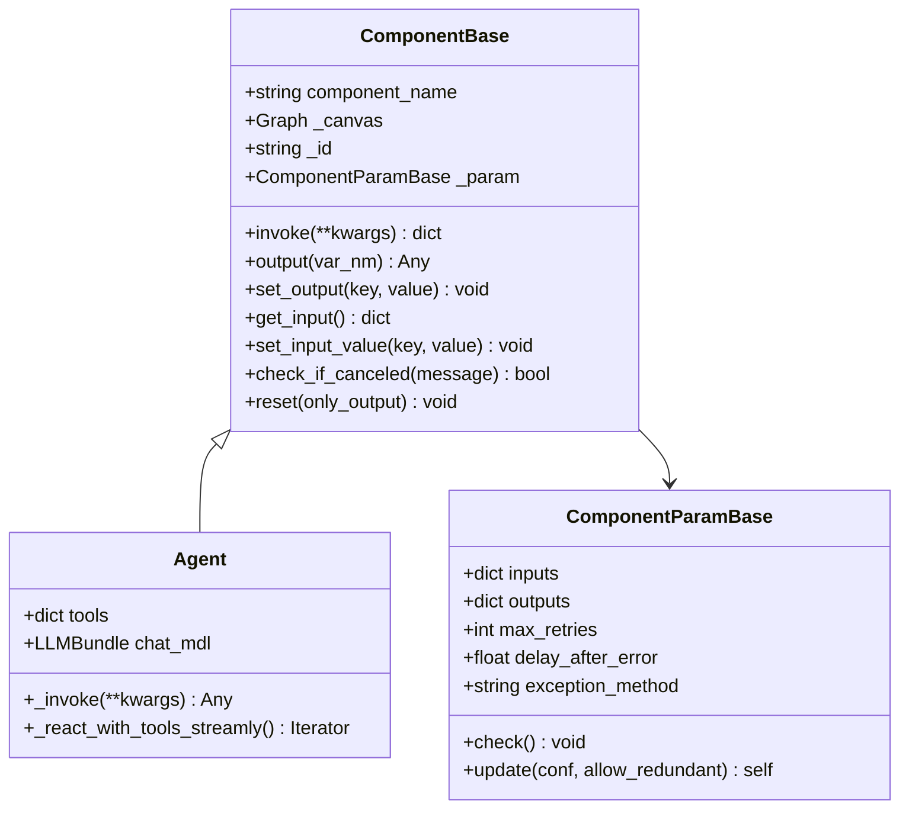

**Diagram sources**
- [agent/component/base.py](file://agent/component/base.py#L393-L583)
- [agent/component/agent_with_tools.py](file://agent/component/agent_with_tools.py#L81-L120)

### Component Lifecycle

Components follow a standardized lifecycle during workflow execution:

1. **Initialization**: Parameter validation and setup
2. **Input Resolution**: Variable substitution and input preparation
3. **Execution**: Component-specific processing logic
4. **Output Generation**: Result storage and variable updates
5. **Cleanup**: Resource cleanup and state reset

**Section sources**
- [agent/component/base.py](file://agent/component/base.py#L434-L447)

## Control Flow Components

### Loops and Iterations

RAGFlow provides sophisticated looping constructs for repetitive processing:

#### Loop Component
The `Loop` component manages iteration over variables with termination conditions:

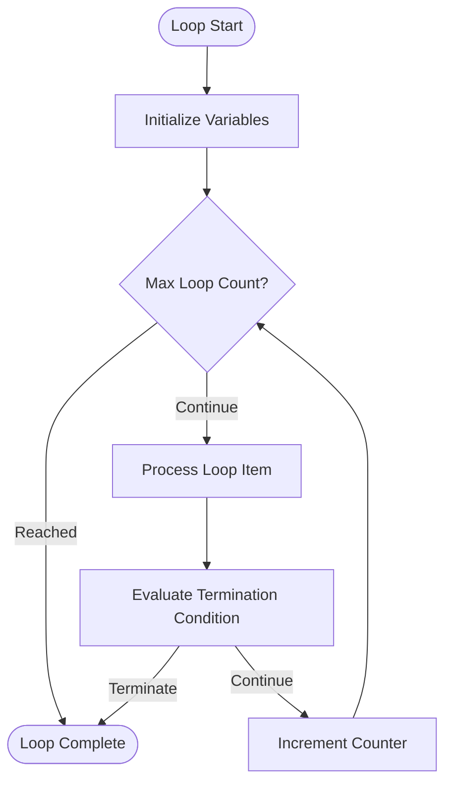

**Diagram sources**
- [agent/component/loop.py](file://agent/component/loop.py#L43-L79)
- [agent/component/loopitem.py](file://agent/component/loopitem.py#L35-L163)

#### Iteration Component
The `Iteration` component processes arrays and collections:

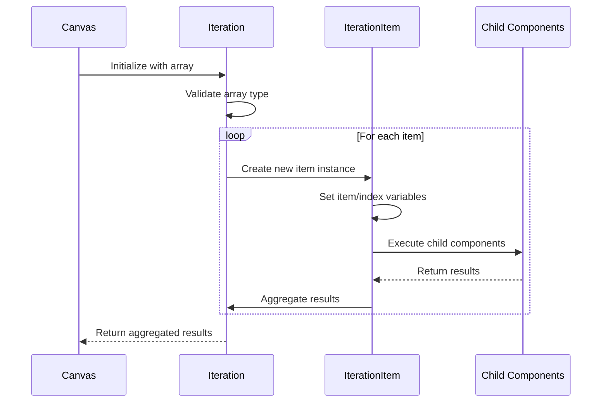

**Diagram sources**
- [agent/component/iteration.py](file://agent/component/iteration.py#L59-L72)
- [agent/component/iterationitem.py](file://agent/component/iterationitem.py#L35-L92)

### Conditional Branching

#### Switch Component
The `Switch` component provides conditional routing based on variable values:

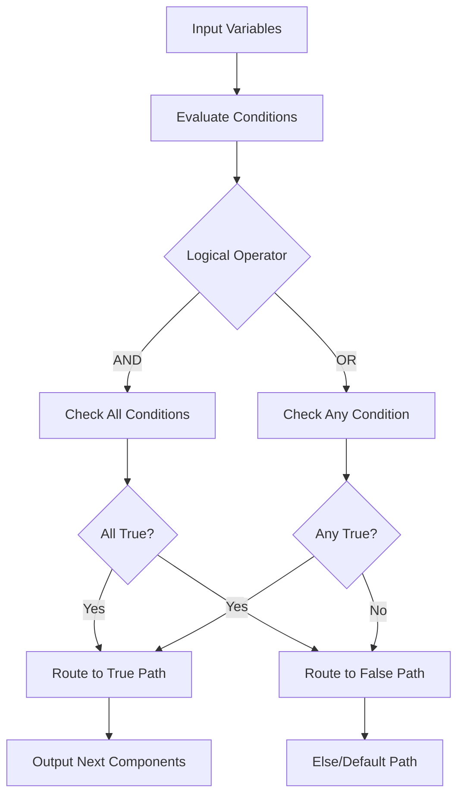

**Diagram sources**
- [agent/component/switch.py](file://agent/component/switch.py#L64-L98)

#### Categorize Component
The `Categorize` component uses LLM reasoning for classification:

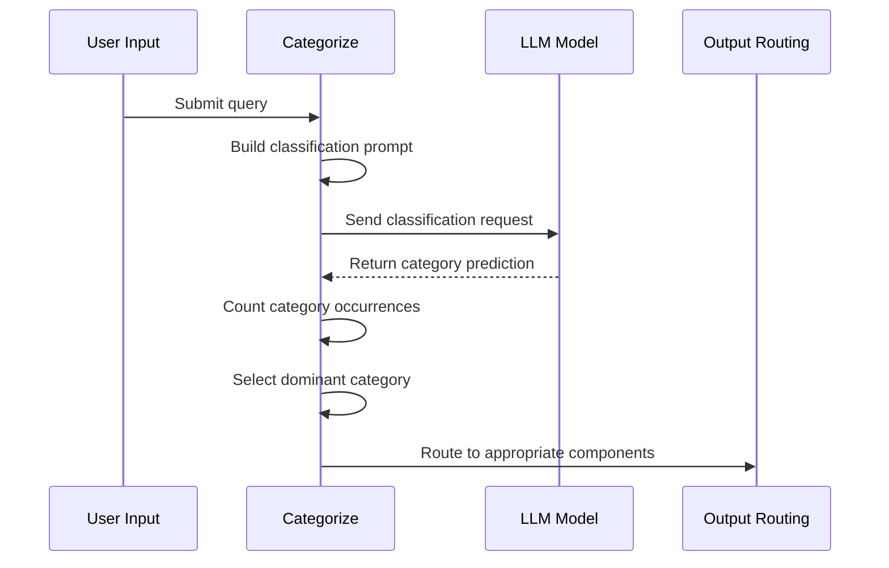

**Diagram sources**
- [agent/component/categorize.py](file://agent/component/categorize.py#L99-L149)

**Section sources**
- [agent/component/switch.py](file://agent/component/switch.py#L64-L141)
- [agent/component/categorize.py](file://agent/component/categorize.py#L99-L149)

## Data Manipulation Components

### Variable Assignment

The `VariableAssigner` component provides comprehensive variable manipulation capabilities:

| Operation | Description | Type Safety |
|-----------|-------------|-------------|
| `overwrite` | Replace variable with new value | Yes |
| `set` | Set variable with parameter | Yes |
| `append` | Add item to list | Element type checking |
| `extend` | Merge arrays | Element type compatibility |
| `+=`, `-=` | Numeric operations | Number validation |
| `clear` | Reset to default | Type-specific clearing |

**Section sources**
- [agent/component/variable_assigner.py](file://agent/component/variable_assigner.py#L44-L192)

### Variable Aggregation

The `VariableAggregator` component enables group-based variable selection:

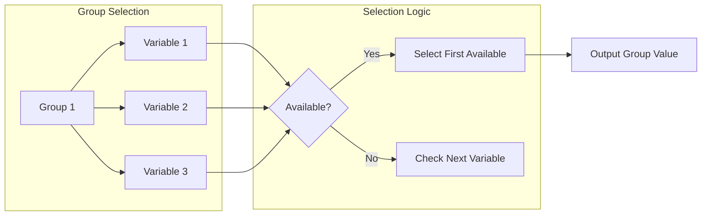

**Diagram sources**
- [agent/component/varaiable_aggregator.py](file://agent/component/varaiable_aggregator.py#L61-L85)

**Section sources**
- [agent/component/varaiable_aggregator.py](file://agent/component/varaiable_aggregator.py#L61-L85)

### Message Component

The `Message` component handles output formatting and templating:

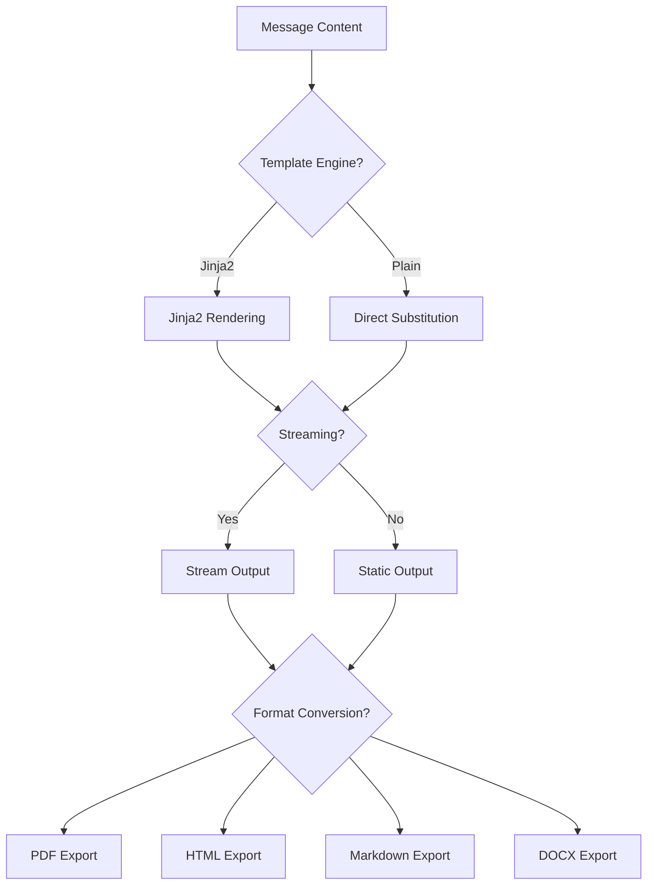

**Diagram sources**
- [agent/component/message.py](file://agent/component/message.py#L174-L267)

**Section sources**
- [agent/component/message.py](file://agent/component/message.py#L174-L267)

## Building Custom Workflows

### Step-by-Step Workflow Creation

#### 1. Define Inputs and Outputs

Every workflow begins with defining the input parameters and expected outputs:

```json
{
    "components": {
        "begin": {
            "obj": {
                "component_name": "Begin",
                "params": {
                    "inputs": {
                        "query": {
                            "name": "User Query",
                            "type": "string",
                            "optional": false
                        }
                    },
                    "outputs": {
                        "result": {
                            "type": "string",
                            "value": ""
                        }
                    }
                }
            }
        }
    }
}
```

#### 2. Connect Components

Establish connections between components using upstream/downstream relationships:

```json
{
    "components": {
        "begin": {
            "downstream": ["agent"],
            "upstream": []
        },
        "agent": {
            "downstream": ["message"],
            "upstream": ["begin"]
        }
    }
}
```

#### 3. Configure Component Parameters

Each component requires specific parameter configuration:

```json
{
    "agent": {
        "obj": {
            "component_name": "Agent",
            "params": {
                "llm_id": "deepseek-chat@DeepSeek",
                "sys_prompt": "You are a helpful assistant...",
                "max_rounds": 5,
                "temperature": 0.7
            }
        }
    }
}
```

### Creating a Basic Workflow

Here's a simple workflow that demonstrates the basic pattern:

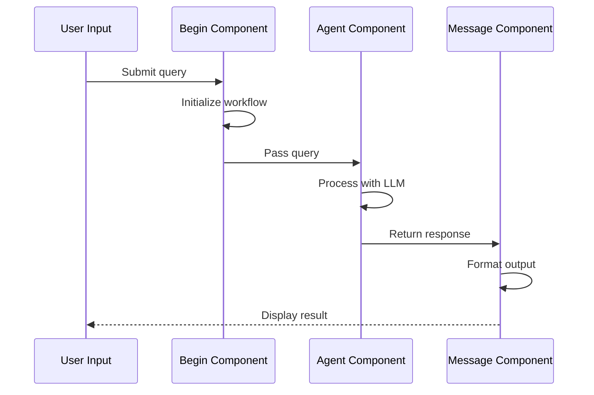

**Diagram sources**
- [agent/templates/choose_your_knowledge_base_workflow.json](file://agent/templates/choose_your_knowledge_base_workflow.json#L14-L80)

**Section sources**
- [agent/templates/choose_your_knowledge_base_workflow.json](file://agent/templates/choose_your_knowledge_base_workflow.json#L14-L80)

### Advanced Workflow Patterns

#### Multi-Agent Collaboration

Complex workflows often involve multiple agents working together:

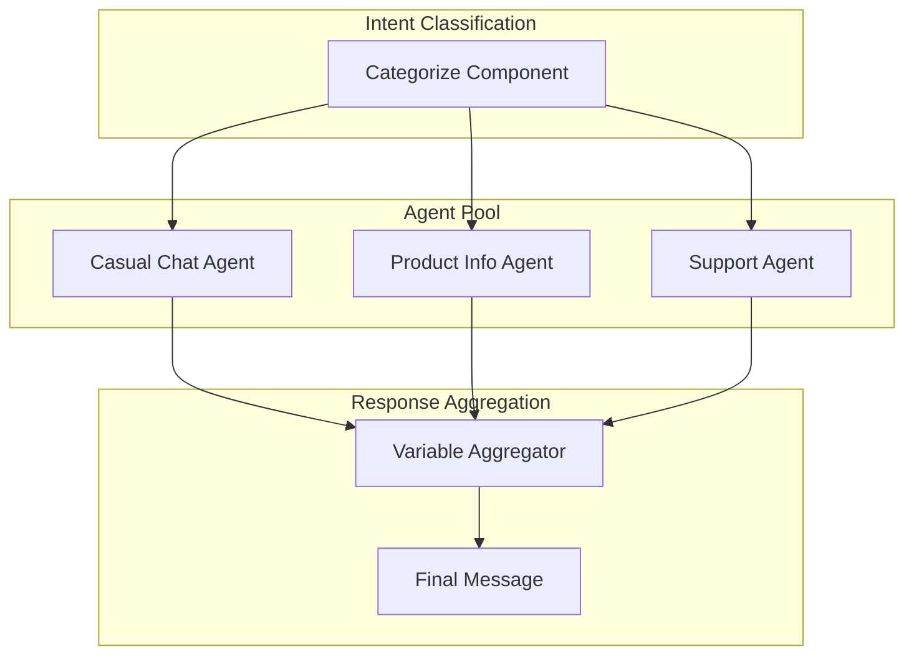

**Diagram sources**
- [agent/templates/customer_service.json](file://agent/templates/customer_service.json#L167-L325)

#### Iterative Processing

Workflows can process data iteratively with nested components:

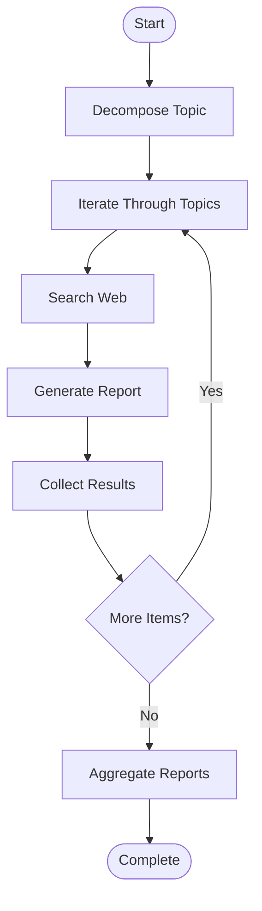

**Diagram sources**
- [agent/test/dsl_examples/iteration.json](file://agent/test/dsl_examples/iteration.json#L27-L81)

**Section sources**
- [agent/templates/customer_service.json](file://agent/templates/customer_service.json#L167-L325)
- [agent/test/dsl_examples/iteration.json](file://agent/test/dsl_examples/iteration.json#L27-L81)

## Domain Model and Execution

### State Management

The workflow execution engine maintains state through several mechanisms:

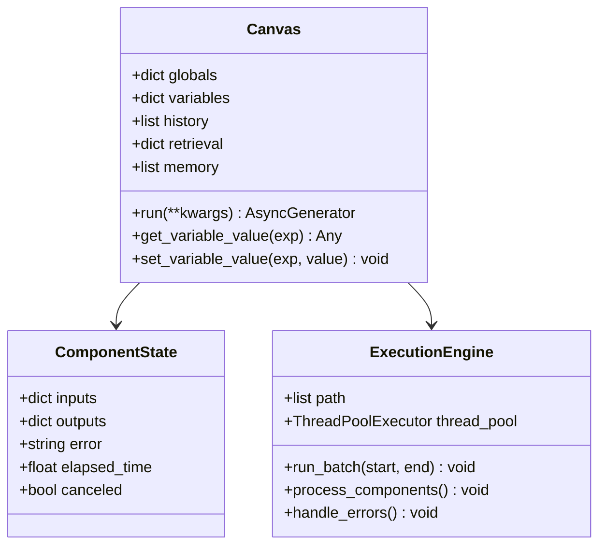

**Diagram sources**
- [agent/canvas.py](file://agent/canvas.py#L282-L310)
- [agent/canvas.py](file://agent/canvas.py#L363-L400)

### Variable Scope and Resolution

Variables follow a hierarchical resolution pattern:

1. **Global Variables**: System-wide variables like `sys.query`
2. **Component Variables**: Per-component output variables
3. **Environment Variables**: Runtime environment values
4. **Nested Access**: Dot notation for complex object access

### Error Handling and Recovery

The system implements comprehensive error handling:

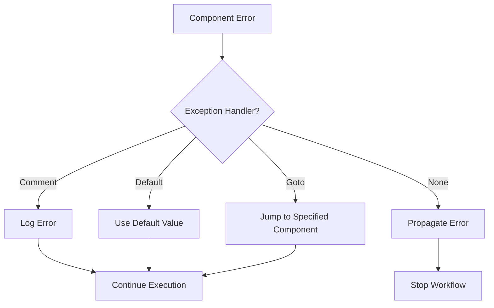

**Diagram sources**
- [agent/component/base.py](file://agent/component/base.py#L565-L583)

**Section sources**
- [agent/canvas.py](file://agent/canvas.py#L282-L310)
- [agent/component/base.py](file://agent/component/base.py#L565-L583)

## Advanced Patterns

### Nested Loops and Conditional Logic

Complex workflows can combine multiple control flow patterns:

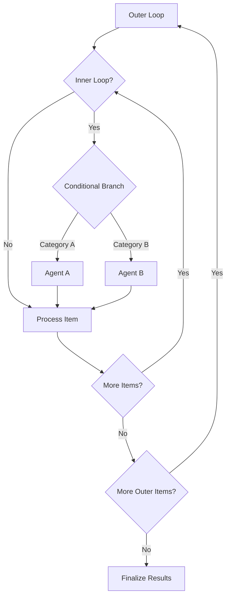

### Parallel Execution

Some components can execute in parallel for improved performance:

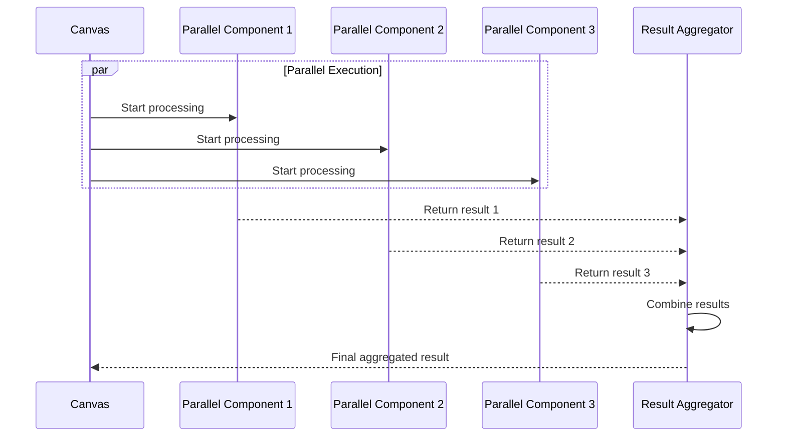

### Dynamic Component Creation

Advanced workflows can dynamically create and configure components during execution:

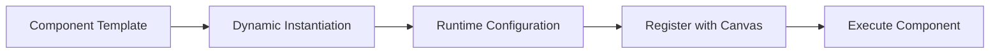

## Debugging and Troubleshooting

### Common Issues and Solutions

#### Infinite Loops

**Problem**: Workflow gets stuck in endless loops
**Solution**: Implement proper termination conditions and loop counters

```json
{
    "loop": {
        "maximum_loop_count": 100,
        "loop_termination_condition": [
            {
                "variable": "result",
                "operator": "not empty"
            }
        ]
    }
}
```

#### Variable Scope Problems

**Problem**: Variables not accessible across components
**Solution**: Use proper variable naming conventions and scope resolution

```javascript
// Correct: Using component reference
"{agent@response}"

// Incorrect: Missing component reference
"{response}"
```

#### Memory Leaks

**Problem**: Workflows consume excessive memory
**Solution**: Implement proper cleanup and state reset

```python
# Component cleanup pattern
def reset(self, only_output=False):
    # Clear component state
    self._param.outputs.clear()
    if not only_output:
        self._param.inputs.clear()
```

### Debugging Strategies

#### Enable Logging

```python
import logging
logging.basicConfig(level=logging.DEBUG)
```

#### Use Debug Mode

```json
{
    "debug_inputs": {
        "input_name": "debug_value"
    }
}
```

#### Monitor Execution

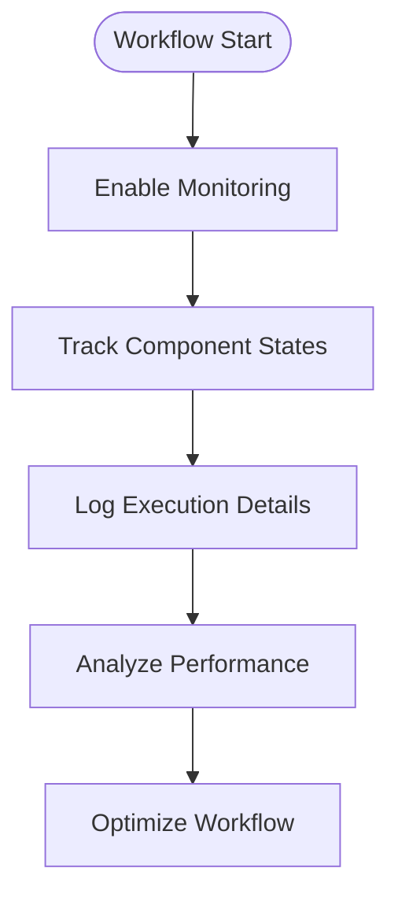

**Section sources**
- [agent/component/base.py](file://agent/component/base.py#L465-L476)

## Best Practices

### Workflow Design Principles

1. **Single Responsibility**: Each component should have a clear, focused purpose
2. **Loose Coupling**: Components should minimize dependencies on specific others
3. **Clear Interfaces**: Well-defined input/output contracts
4. **Error Resilience**: Comprehensive error handling and recovery
5. **Performance Awareness**: Consider execution time and resource usage

### Component Development Guidelines

#### Parameter Validation

```python
def check(self):
    self.check_positive_integer(self.max_retries, "Max retries must be positive")
    self.check_empty(self.llm_id, "LLM ID cannot be empty")
```

#### State Management

```python
def reset(self, only_output=False):
    # Reset only outputs for reuse
    if only_output:
        for key in self._param.outputs:
            self._param.outputs[key]["value"] = None
    else:
        # Full reset including inputs
        self._param.inputs.clear()
        self._param.outputs.clear()
```

#### Error Handling

```python
def _invoke(self, **kwargs):
    try:
        # Component logic
        result = self.process_data()
        self.set_output("result", result)
    except Exception as e:
        if self.get_exception_default_value():
            self.set_exception_default_value()
        else:
            self.set_output("_ERROR", str(e))
        logging.exception(e)
```

### Performance Optimization

#### Batch Processing

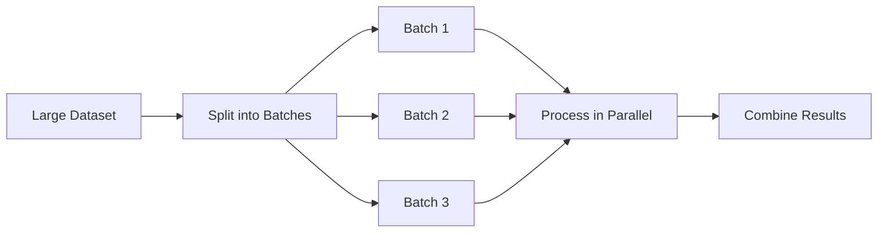

#### Caching Strategies

1. **Result Caching**: Store expensive computation results
2. **LLM Response Caching**: Cache LLM responses for repeated queries
3. **External API Caching**: Cache external service responses

### Testing and Validation

#### Unit Testing Components

```python
def test_component_execution():
    # Setup test environment
    canvas = create_test_canvas()
    component = create_test_component(canvas)
    
    # Test execution
    result = component.invoke(test_input)
    
    # Verify results
    assert result["expected_output"] == expected_result
```

#### Integration Testing

```python
def test_workflow_end_to_end():
    # Load workflow definition
    workflow = load_workflow("test_workflow.json")
    
    # Execute workflow
    result = execute_workflow(workflow, test_inputs)
    
    # Validate complete workflow behavior
    assert validate_workflow_results(result)
```

**Section sources**
- [agent/component/base.py](file://agent/component/base.py#L465-L476)
- [agent/component/base.py](file://agent/component/base.py#L565-L583)