# MCP Integration

<cite>
**Referenced Files in This Document**
- [mcp/server/server.py](file://mcp/server/server.py)
- [mcp/client/client.py](file://mcp/client/client.py)
- [mcp/client/streamable_http_client.py](file://mcp/client/streamable_http_client.py)
- [common/mcp_tool_call_conn.py](file://common/mcp_tool_call_conn.py)
- [agent/tools/retrieval.py](file://agent/tools/retrieval.py)
- [agent/tools/tavily.py](file://agent/tools/tavily.py)
- [agent/tools/exesql.py](file://agent/tools/exesql.py)
- [agent/component/agent_with_tools.py](file://agent/component/agent_with_tools.py)
- [agent/tools/base.py](file://agent/tools/base.py)
- [api/apps/mcp_server_app.py](file://api/apps/mcp_server_app.py)
- [api/db/services/mcp_server_service.py](file://api/db/services/mcp_server_service.py)
- [docs/develop/mcp/launch_mcp_server.md](file://docs/develop/mcp/launch_mcp_server.md)
- [docs/develop/mcp/mcp_client_example.md](file://docs/develop/mcp/mcp_client_example.md)
</cite>

## Table of Contents
1. [Introduction](#introduction)
2. [MCP Architecture Overview](#mcp-architecture-overview)
3. [MCP Server Implementation](#mcp-server-implementation)
4. [MCP Client Implementation](#mcp-client-implementation)
5. [Agent Tool Integration](#agent-tool-integration)
6. [Connection Management and Authentication](#connection-management-and-authentication)
7. [Message Formats and Protocols](#message-formats-and-protocols)
8. [Real-time Interaction Patterns](#real-time-interaction-patterns)
9. [Error Handling and Timeout Management](#error-handling-and-timeout-management)
10. [Custom MCP Server Development](#custom-mcp-server-development)
11. [Troubleshooting Guide](#troubleshooting-guide)
12. [Best Practices](#best-practices)

## Introduction

The Model Context Protocol (MCP) integration in RAGFlow enables seamless communication between agents and external tools through standardized protocols. This integration allows RAGFlow agents to leverage powerful external services like retrieval systems, search engines, and databases through a unified interface.

MCP serves as a bridge between RAGFlow's agent system and external tool providers, enabling real-time tool discovery, invocation, and result processing. The implementation supports both synchronous and asynchronous communication patterns, with robust error handling and connection management.

## MCP Architecture Overview

RAGFlow's MCP implementation follows the Model Context Protocol specification, providing a standardized way for agents to interact with external tools. The architecture consists of several key components:

```mermaid
graph TB
subgraph "RAGFlow Agent System"
Agent[Agent Component]
ToolMgr[Tool Manager]
Canvas[Canvas Context]
end
subgraph "MCP Infrastructure"
MCPServer[MCP Server]
MCPClients[MCP Clients]
ConnMgr[Connection Manager]
end
subgraph "External Tools"
Retrieval[Retrieval Tool]
Tavily[Tavily Search]
SQL[SQL Executor]
Custom[Custom Tools]
end
Agent --> ToolMgr
ToolMgr --> MCPServer
MCPServer --> ConnMgr
ConnMgr --> MCPClients
MCPClients --> Retrieval
MCPClients --> Tavily
MCPClients --> SQL
MCPClients --> Custom
Canvas --> Agent
```



**Diagram sources**
- [agent/component/agent_with_tools.py](file://agent/component/agent_with_tools.py#L80-L108)
- [mcp/server/server.py](file://mcp/server/server.py#L326-L367)

**Section sources**
- [agent/component/agent_with_tools.py](file://agent/component/agent_with_tools.py#L80-L108)
- [mcp/server/server.py](file://mcp/server/server.py#L326-L367)

## MCP Server Implementation

The MCP server in RAGFlow acts as a bridge between agents and external tools, providing a standardized interface for tool discovery and invocation.

### Server Architecture

The MCP server implementation supports multiple transport mechanisms and operates in different launch modes:


**Diagram sources**
- [mcp/server/server.py](file://mcp/server/server.py#L58-L308)
- [common/mcp_tool_call_conn.py](file://common/mcp_tool_call_conn.py#L42-L325)

### Launch Modes

The MCP server supports two primary launch modes:

1. **Self-host Mode**: Operates with a single tenant, requiring an API key for authentication
2. **Host Mode**: Multi-tenant mode where clients provide their own authentication

### Transport Mechanisms

RAGFlow MCP server supports multiple transport mechanisms:

- **SSE (Server-Sent Events)**: Legacy transport for backward compatibility
- **Streamable HTTP**: Modern transport with JSON responses
- **Hybrid Mode**: Both transports enabled simultaneously

**Section sources**
- [mcp/server/server.py](file://mcp/server/server.py#L38-L56)
- [mcp/server/server.py](file://mcp/server/server.py#L496-L575)

## MCP Client Implementation

The MCP client provides the interface for agents to communicate with MCP servers, supporting both SSE and Streamable HTTP transports.

### Client Architecture


**Diagram sources**
- [mcp/client/client.py](file://mcp/client/client.py#L22-L47)
- [mcp/client/streamable_http_client.py](file://mcp/client/streamable_http_client.py#L20-L36)

### Authentication Methods

Clients can authenticate with MCP servers using multiple methods:

1. **API Key Authentication**: Direct API key inclusion in headers
2. **Bearer Token**: OAuth 2.1 compliant bearer token format
3. **Custom Headers**: Configurable header-based authentication

**Section sources**
- [mcp/client/client.py](file://mcp/client/client.py#L22-L47)
- [mcp/client/streamable_http_client.py](file://mcp/client/streamable_http_client.py#L20-L36)

## Agent Tool Integration

RAGFlow integrates MCP tools seamlessly with its agent system, allowing agents to discover, select, and invoke tools dynamically.

### Tool Discovery and Registration


**Diagram sources**
- [agent/component/agent_with_tools.py](file://agent/component/agent_with_tools.py#L99-L107)

### Tool Invocation Patterns

The agent system supports multiple tool invocation patterns:

1. **Direct Tool Calls**: Immediate execution of tools with provided arguments
2. **Streaming Tool Calls**: Real-time streaming of tool execution progress
3. **Batch Tool Calls**: Concurrent execution of multiple tools
4. **Conditional Tool Calls**: Tool execution based on agent reasoning

### Integration with Existing Tools

RAGFlow's MCP integration works alongside existing agent tools, providing a unified interface:

- **Retrieval Tools**: Enhanced retrieval capabilities with MCP integration
- **Search Tools**: Tavily search integration for external search capabilities
- **Database Tools**: SQL execution through MCP for secure database access

**Section sources**
- [agent/component/agent_with_tools.py](file://agent/component/agent_with_tools.py#L99-L107)
- [agent/tools/retrieval.py](file://agent/tools/retrieval.py#L80-L251)
- [agent/tools/tavily.py](file://agent/tools/tavily.py#L101-L252)
- [agent/tools/exesql.py](file://agent/tools/exesql.py#L79-L276)

## Connection Management and Authentication

RAGFlow implements robust connection management and authentication mechanisms for MCP communications.

### Connection Lifecycle


### Authentication Methods

The MCP system supports multiple authentication approaches:

1. **API Key Authentication**: Static API keys for server-to-server communication
2. **Bearer Token Authentication**: OAuth 2.1 compliant token-based authentication
3. **Header-Based Authentication**: Custom header configurations for specific use cases

### Connection Pooling and Management

RAGFlow implements sophisticated connection management:

- **Connection Pooling**: Efficient reuse of connections to reduce overhead
- **Health Monitoring**: Continuous monitoring of connection health
- **Automatic Reconnection**: Intelligent reconnection strategies for failed connections
- **Session Management**: Persistent session management across tool invocations

**Section sources**
- [common/mcp_tool_call_conn.py](file://common/mcp_tool_call_conn.py#L42-L325)
- [mcp/server/server.py](file://mcp/server/server.py#L329-L362)

## Message Formats and Protocols

RAGFlow's MCP implementation follows the Model Context Protocol specification with extensions for RAGFlow-specific functionality.

### JSON-RPC 2.0 Messages

The MCP protocol uses JSON-RPC 2.0 for structured communication:

```json
{
  "jsonrpc": "2.0",
  "id": 1,
  "method": "initialize",
  "params": {
    "protocolVersion": "2025-03-26",
    "capabilities": {},
    "clientInfo": {
      "name": "ragflow-mcp-client",
      "version": "0.1"
    }
  }
}
```

### Tool Definition Schema

Tools are defined using OpenAPI schema format:

```json
{
  "name": "ragflow_retrieval",
  "description": "Retrieve relevant chunks from the RAGFlow retrieve interface...",
  "inputSchema": {
    "type": "object",
    "properties": {
      "dataset_ids": {
        "type": "array",
        "items": {"type": "string"}
      },
      "question": {
        "type": "string",
        "description": "The question or query to search for."
      }
    },
    "required": ["question"]
  }
}
```

### Content Types

MCP supports various content types for tool responses:

- **Text Content**: Plain text responses
- **Image Content**: Image data with MIME type specifications
- **Embedded Resources**: Binary data with metadata

**Section sources**
- [mcp/server/server.py](file://mcp/server/server.py#L365-L444)
- [common/mcp_tool_call_conn.py](file://common/mcp_tool_call_conn.py#L307-L325)

## Real-time Interaction Patterns

RAGFlow's MCP implementation supports sophisticated real-time interaction patterns for responsive agent-tool communication.

### Streaming Communication

The system supports bidirectional streaming for real-time communication:


### Event-Driven Architecture

The MCP system implements an event-driven architecture for responsive communication:

- **Tool Discovery Events**: Automatic discovery and registration of new tools
- **Status Change Events**: Real-time status updates for ongoing operations
- **Error Events**: Comprehensive error reporting and recovery mechanisms
- **Progress Events**: Streaming progress updates for long-running operations

### Concurrent Operations

RAGFlow supports concurrent tool execution with intelligent coordination:

- **Parallel Execution**: Multiple tools can execute simultaneously
- **Resource Coordination**: Intelligent resource allocation and management
- **Priority Handling**: Priority-based execution for critical operations
- **Load Balancing**: Distribution of tool requests across available resources

**Section sources**
- [common/mcp_tool_call_conn.py](file://common/mcp_tool_call_conn.py#L115-L152)
- [agent/component/agent_with_tools.py](file://agent/component/agent_with_tools.py#L365-L387)

## Error Handling and Timeout Management

RAGFlow implements comprehensive error handling and timeout management for reliable MCP operations.

### Error Classification

The system categorizes errors into several types:

1. **Connection Errors**: Network connectivity and transport-level issues
2. **Authentication Errors**: Invalid credentials and authorization failures
3. **Tool Execution Errors**: Errors during tool invocation and processing
4. **Timeout Errors**: Operations exceeding configured time limits
5. **Validation Errors**: Input validation and parameter checking failures

### Timeout Strategies


### Error Recovery Mechanisms

The MCP system implements multiple error recovery strategies:

- **Automatic Retry**: Intelligent retry logic with exponential backoff
- **Fallback Operations**: Alternative execution paths for failed operations
- **Graceful Degradation**: Reduced functionality when full capabilities unavailable
- **Error Propagation**: Comprehensive error information to calling agents

### Timeout Configuration

Different timeout values are configured for various operations:

| Operation Type | Default Timeout | Configurable Range |
|----------------|-----------------|-------------------|
| Tool Discovery | 8 seconds | 1-30 seconds |
| Tool Execution | 10 seconds | 5-60 seconds |
| Connection Setup | 15 seconds | 5-60 seconds |
| Batch Operations | 30 seconds | 10-120 seconds |

**Section sources**
- [common/mcp_tool_call_conn.py](file://common/mcp_tool_call_conn.py#L153-L218)
- [mcp/server/server.py](file://mcp/server/server.py#L118-L121)

## Custom MCP Server Development

RAGFlow provides a framework for developing custom MCP servers to integrate with external tools and services.

### Server Development Framework


### Implementation Guidelines

To develop a custom MCP server:

1. **Define Tool Interfaces**: Specify tool capabilities and parameters
2. **Implement Message Handlers**: Handle initialization, tool listing, and invocation
3. **Configure Authentication**: Set up appropriate authentication mechanisms
4. **Add Error Handling**: Implement comprehensive error handling and logging
5. **Test Integration**: Validate compatibility with RAGFlow agent system

### Tool Definition Standards

Custom tools must adhere to MCP standards:

```python
{
    "name": "custom_tool_name",
    "description": "Detailed description of tool functionality",
    "inputSchema": {
        "type": "object",
        "properties": {
            "parameter_name": {
                "type": "string",
                "description": "Parameter description",
                "required": true
            }
        },
        "required": ["parameter_name"]
    }
}
```

### Integration Testing

Custom servers should undergo comprehensive testing:

- **Unit Tests**: Individual tool functionality verification
- **Integration Tests**: End-to-end agent-tool communication testing
- **Performance Tests**: Load and stress testing under various conditions
- **Security Tests**: Authentication and authorization validation

**Section sources**
- [mcp/server/server.py](file://mcp/server/server.py#L365-L444)
- [common/mcp_tool_call_conn.py](file://common/mcp_tool_call_conn.py#L307-L325)

## Troubleshooting Guide

This section provides solutions for common MCP integration issues.

### Connection Issues

**Problem**: MCP server fails to connect to RAGFlow backend
**Solution**: 
1. Verify RAGFlow server is running and accessible
2. Check API key validity and permissions
3. Validate network connectivity and firewall settings
4. Review server logs for detailed error information

**Problem**: Authentication failures
**Solution**:
1. Verify API key format and validity
2. Check header configuration in client requests
3. Ensure proper encoding of authentication tokens
4. Validate server-side authentication configuration

### Tool Discovery Problems

**Problem**: Tools not appearing in agent tool list
**Solution**:
1. Verify MCP server is properly registered
2. Check tool definition format and completeness
3. Validate server connectivity and response times
4. Review tool registration logs for errors

**Problem**: Tool execution timeouts
**Solution**:
1. Increase timeout values for slow operations
2. Optimize tool implementation for performance
3. Implement streaming for long-running operations
4. Monitor server resource utilization

### Performance Issues

**Problem**: Slow tool response times
**Solution**:
1. Profile tool execution and identify bottlenecks
2. Implement caching for frequently accessed data
3. Optimize database queries and external API calls
4. Consider asynchronous execution for I/O-bound operations

**Problem**: High memory usage
**Solution**:
1. Implement proper resource cleanup and garbage collection
2. Limit concurrent tool executions
3. Use streaming for large data transfers
4. Monitor and optimize memory allocation patterns

### Configuration Issues

**Problem**: Incorrect transport configuration
**Solution**:
1. Verify transport type selection (SSE vs Streamable HTTP)
2. Check port availability and binding configuration
3. Validate SSL/TLS settings for secure connections
4. Review CORS and security policy configurations

**Section sources**
- [common/mcp_tool_call_conn.py](file://common/mcp_tool_call_conn.py#L153-L218)
- [mcp/server/server.py](file://mcp/server/server.py#L118-L121)

## Best Practices

### Security Considerations

1. **API Key Management**: Store API keys securely and rotate regularly
2. **Network Security**: Use HTTPS for all MCP communications
3. **Access Control**: Implement proper authorization and access controls
4. **Input Validation**: Validate all tool inputs and parameters
5. **Audit Logging**: Maintain comprehensive audit logs for security monitoring

### Performance Optimization

1. **Connection Pooling**: Use connection pooling to reduce overhead
2. **Caching Strategies**: Implement intelligent caching for repeated operations
3. **Async Operations**: Use asynchronous patterns for I/O-bound operations
4. **Resource Management**: Properly manage resources and cleanup
5. **Monitoring**: Implement comprehensive monitoring and alerting

### Development Guidelines

1. **Error Handling**: Implement comprehensive error handling and recovery
2. **Testing**: Write thorough unit and integration tests
3. **Documentation**: Maintain clear and comprehensive documentation
4. **Versioning**: Use semantic versioning for MCP server releases
5. **Backward Compatibility**: Maintain backward compatibility when possible

### Deployment Considerations

1. **Environment Configuration**: Use environment-specific configurations
2. **Scalability Planning**: Design for horizontal scaling when needed
3. **Backup Strategies**: Implement proper backup and disaster recovery
4. **Monitoring Setup**: Deploy comprehensive monitoring infrastructure
5. **Maintenance Procedures**: Establish regular maintenance and update procedures

**Section sources**
- [mcp/server/server.py](file://mcp/server/server.py#L19-L25)
- [common/mcp_tool_call_conn.py](file://common/mcp_tool_call_conn.py#L42-L325)