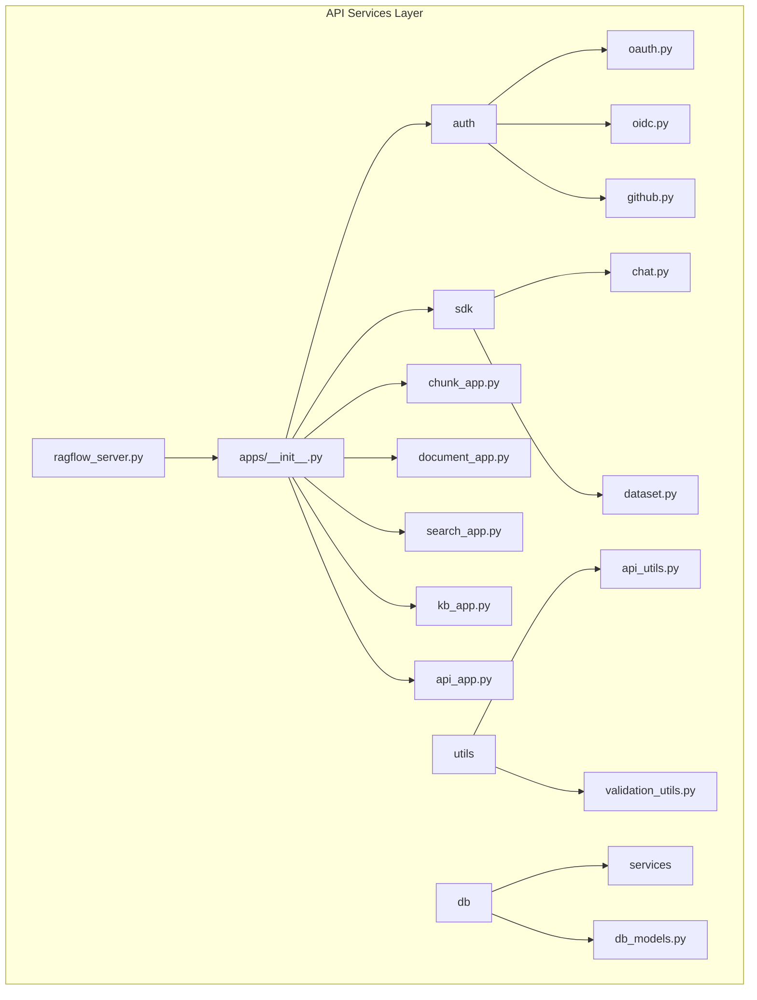
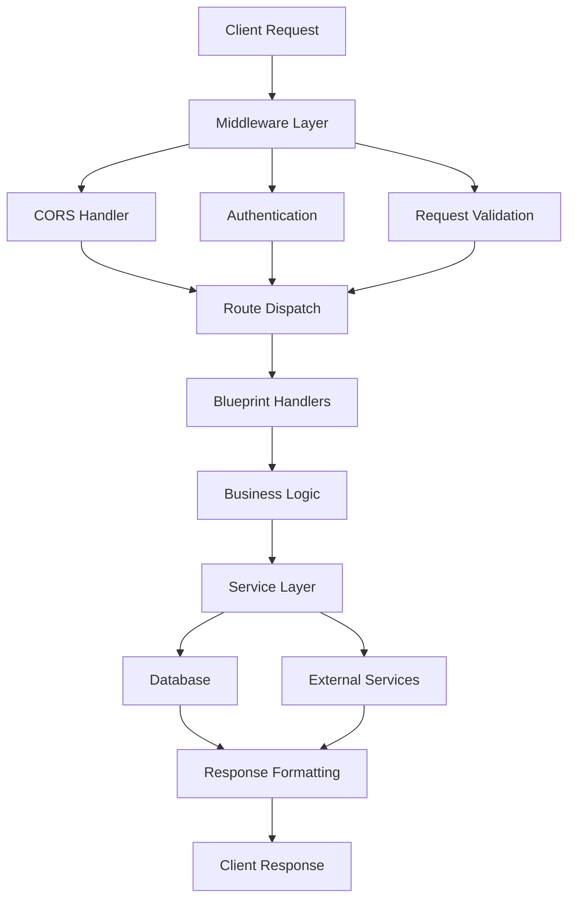
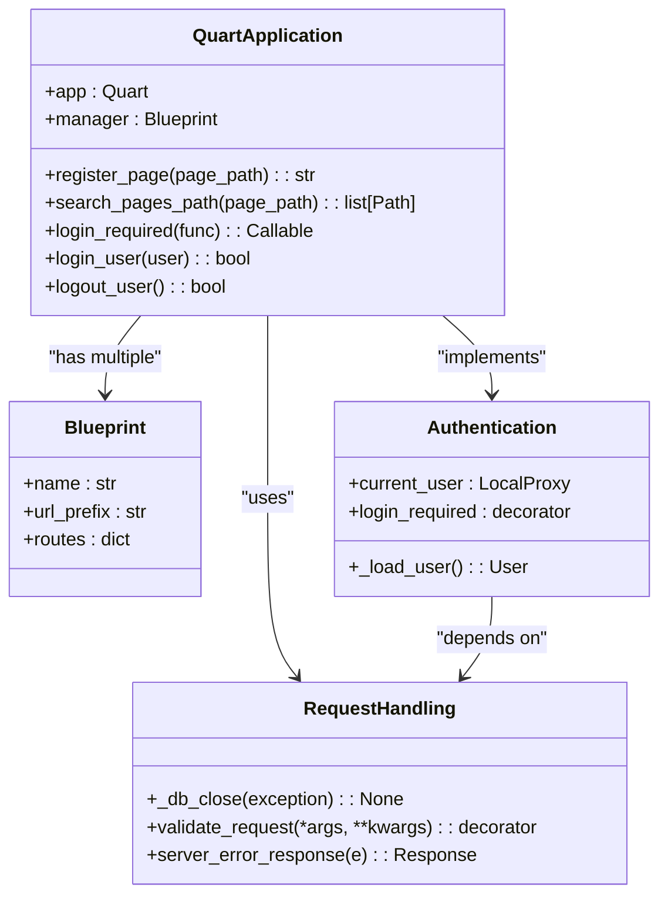
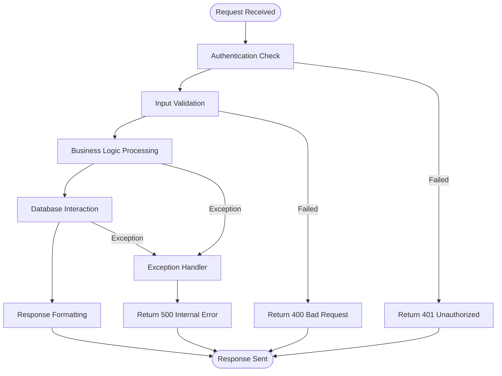
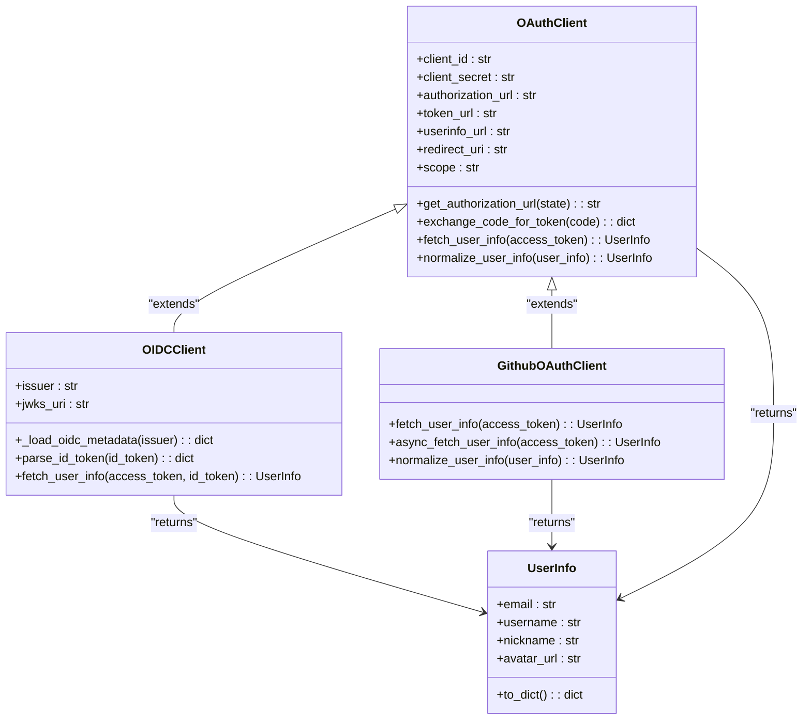
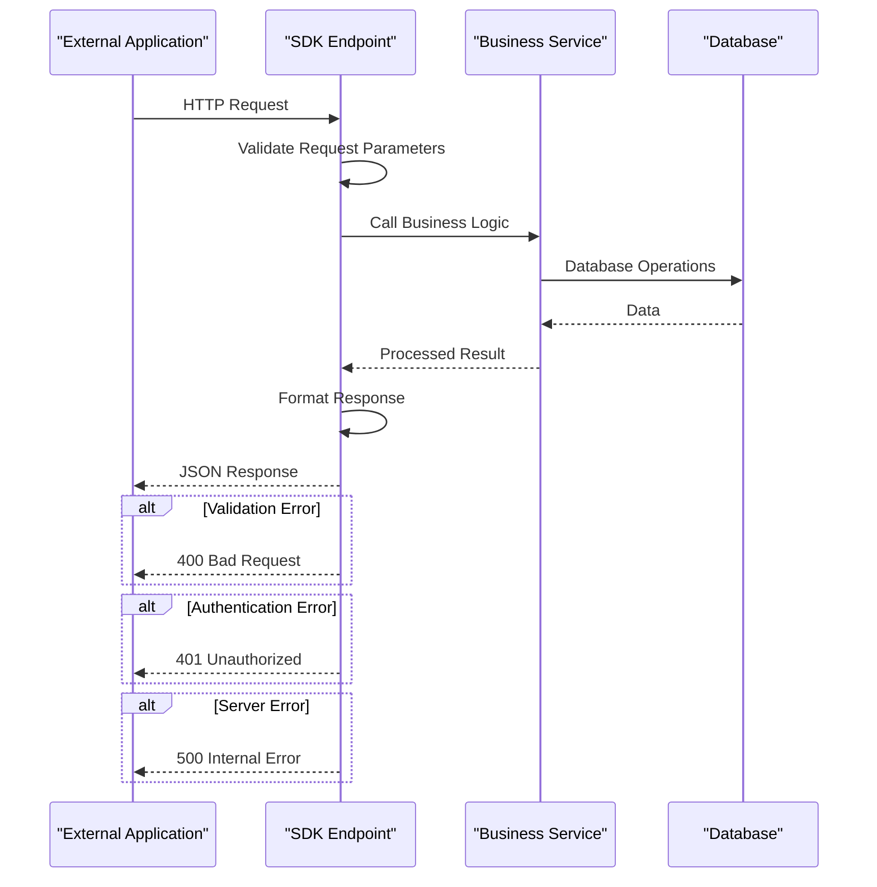
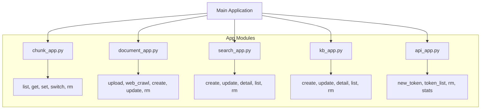
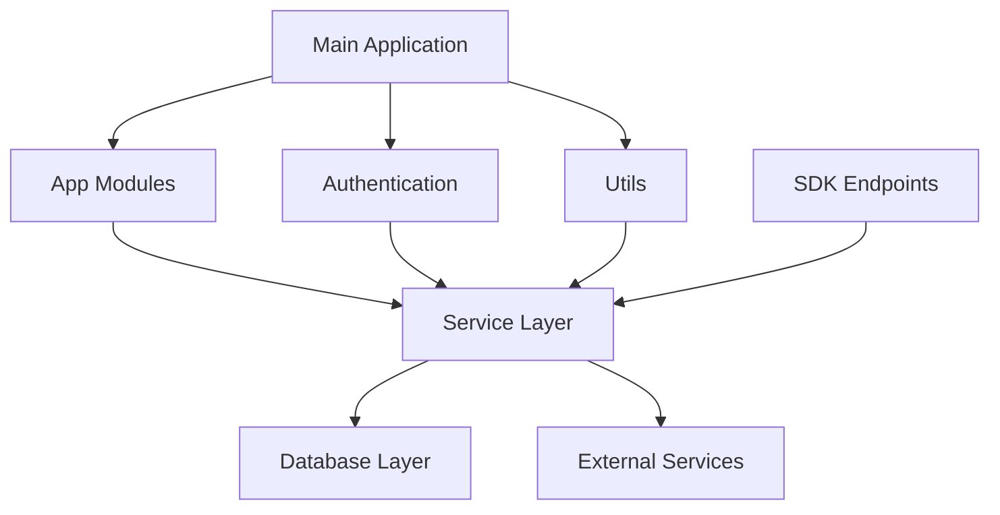

# API Services

<cite>
**Referenced Files in This Document**   
- [ragflow_server.py](file://api/ragflow_server.py)
- [__init__.py](file://api/apps/__init__.py)
- [api_app.py](file://api/apps/api_app.py)
- [chunk_app.py](file://api/apps/chunk_app.py)
- [document_app.py](file://api/apps/document_app.py)
- [search_app.py](file://api/apps/search_app.py)
- [oauth.py](file://api/apps/auth/oauth.py)
- [oidc.py](file://api/apps/auth/oidc.py)
- [github.py](file://api/apps/auth/github.py)
- [chat.py](file://api/apps/sdk/chat.py)
- [dataset.py](file://api/apps/sdk/dataset.py)
- [api_utils.py](file://api/utils/api_utils.py)
- [validation_utils.py](file://api/utils/validation_utils.py)
- [constants.py](file://api/constants.py)
</cite>

## Table of Contents
1. [Introduction](#introduction)
2. [Project Structure](#project-structure)
3. [Core Components](#core-components)
4. [Architecture Overview](#architecture-overview)
5. [Detailed Component Analysis](#detailed-component-analysis)
6. [Dependency Analysis](#dependency-analysis)
7. [Performance Considerations](#performance-considerations)
8. [Troubleshooting Guide](#troubleshooting-guide)
9. [Conclusion](#conclusion)

## Introduction
This document provides comprehensive architectural documentation for RAGFlow's API services layer. The API is built on a Flask-based application structure with modular blueprints that organize functionality into distinct domains such as authentication, chat, dataset management, and document processing. The system implements a robust request handling pipeline with input validation, authentication checks, and standardized response formatting. Each app module serves specific purposes with well-defined endpoints for various operations. The authentication system supports multiple mechanisms including OAuth, OIDC, and GitHub integration, while SDK endpoints enable programmatic access to core features. The architecture incorporates rate limiting, comprehensive error handling, API versioning, and middleware components that manage various aspects of the request lifecycle.

## Project Structure
The API services layer is organized in a modular structure with clear separation of concerns. The core API components are located in the `api/apps` directory, where each functionality domain has its own dedicated module. The architecture follows a blueprint pattern where each module handles specific API endpoints and functionality. Authentication components are isolated in the `auth` subdirectory, while SDK endpoints are organized under the `sdk` directory for programmatic access. Utility functions and common services are maintained in separate directories to promote code reuse and maintainability.

**Diagram sources**
- [ragflow_server.py](file://api/ragflow_server.py#L1-L167)
- [__init__.py](file://api/apps/__init__.py#L1-L284)

**Section sources**
- [ragflow_server.py](file://api/ragflow_server.py#L1-L167)
- [__init__.py](file://api/apps/__init__.py#L1-L284)

## Core Components
The RAGFlow API services layer consists of several core components that work together to provide a comprehensive API for RAG (Retrieval-Augmented Generation) functionality. The system is built on a Flask/Quart foundation with modular blueprints that organize functionality by domain. Each component serves a specific purpose in the overall architecture, from authentication and authorization to document processing and search capabilities. The API implements a sophisticated request handling pipeline that includes input validation, authentication checks, and standardized response formatting. The modular design allows for easy extension and maintenance of the API services.

**Section sources**
- [ragflow_server.py](file://api/ragflow_server.py#L1-L167)
- [__init__.py](file://api/apps/__init__.py#L1-L284)

## Architecture Overview
The RAGFlow API services layer follows a modular microservices-inspired architecture built on Flask/Quart with a blueprint-based design. The system is organized around functional domains, with each domain implemented as a separate blueprint that handles specific API endpoints. The architecture implements a clean separation of concerns between the API layer, business logic, and data access layers. The request handling pipeline begins with middleware components that handle authentication, CORS, and request preprocessing, followed by route dispatching to the appropriate blueprint handlers. Each request passes through a series of validation and authentication checks before reaching the business logic layer, where services process the request and interact with the database and external systems.

**Diagram sources**
- [ragflow_server.py](file://api/ragflow_server.py#L1-L167)
- [__init__.py](file://api/apps/__init__.py#L1-L284)

## Detailed Component Analysis

### Flask Application Structure
The RAGFlow API services layer is built on a Flask/Quart foundation with a modular blueprint architecture that organizes functionality into distinct domains. The main application is initialized in `api/apps/__init__.py`, where the Quart application instance is created and configured with various settings including CORS, session management, and JSON encoding. The system uses blueprints to organize different functionality domains, with each blueprint handling a specific set of endpoints. The application automatically discovers and registers blueprints from the `api/apps` directory and its subdirectories, allowing for easy extension of the API services.

**Diagram sources**
- [__init__.py](file://api/apps/__init__.py#L1-L284)

**Section sources**
- [__init__.py](file://api/apps/__init__.py#L1-L284)

### Request Handling Pipeline
The request handling pipeline in RAGFlow's API services layer is a multi-stage process that ensures proper validation, authentication, and error handling for all incoming requests. The pipeline begins with middleware components that handle cross-cutting concerns such as CORS, authentication, and request preprocessing. Each request is first validated for proper formatting and required parameters before being authenticated against the system's user management. The pipeline implements comprehensive error handling with standardized response formats for different error types. The system also includes input validation decorators that automatically check for required parameters and validate their values against expected types and constraints.

**Diagram sources**
- [api_utils.py](file://api/utils/api_utils.py#L1-L704)
- [__init__.py](file://api/apps/__init__.py#L1-L284)

**Section sources**
- [api_utils.py](file://api/utils/api_utils.py#L1-L704)

### Authentication Mechanisms
RAGFlow implements a comprehensive authentication system that supports multiple authentication mechanisms including OAuth, OIDC, and GitHub integration. The system is built around a modular authentication framework that allows for easy integration of different identity providers. The core authentication logic is implemented in the `auth` module, which provides base classes for OAuth clients and specific implementations for different providers. The system uses JWT tokens for session management and implements token-based authentication for API access. The authentication pipeline includes user registration, login, and session management functionality, with support for both web-based and API-based authentication flows.

**Diagram sources**
- [oauth.py](file://api/apps/auth/oauth.py#L1-L152)
- [oidc.py](file://api/apps/auth/oidc.py#L1-L108)
- [github.py](file://api/apps/auth/github.py#L1-L89)

**Section sources**
- [oauth.py](file://api/apps/auth/oauth.py#L1-L152)
- [oidc.py](file://api/apps/auth/oidc.py#L1-L108)
- [github.py](file://api/apps/auth/github.py#L1-L89)

### SDK Endpoints
The RAGFlow API provides a comprehensive set of SDK endpoints that enable programmatic access to core features. These endpoints are organized under the `sdk` directory and provide a clean, well-documented interface for integrating RAGFlow functionality into external applications. The SDK endpoints follow RESTful principles and use standardized request/response formats to ensure consistency and ease of use. Each endpoint includes comprehensive input validation and error handling to provide clear feedback to developers. The SDK endpoints cover key functionality areas including chat management, dataset operations, document processing, and knowledge base management.

**Diagram sources**
- [chat.py](file://api/apps/sdk/chat.py#L1-L325)
- [dataset.py](file://api/apps/sdk/dataset.py#L1-L690)

**Section sources**
- [chat.py](file://api/apps/sdk/chat.py#L1-L325)
- [dataset.py](file://api/apps/sdk/dataset.py#L1-L690)

### App Module Analysis
The RAGFlow API services layer is organized into multiple app modules, each responsible for a specific functionality domain. These modules include `chunk_app`, `document_app`, `search_app`, `kb_app`, and `api_app`, each providing a set of endpoints for managing specific resources. The modular design allows for clear separation of concerns and makes the codebase more maintainable and extensible. Each app module follows a consistent pattern of implementing CRUD operations for its domain, with standardized error handling and response formatting. The modules are registered as blueprints in the main application, allowing them to be easily discovered and integrated.

**Diagram sources**
- [chunk_app.py](file://api/apps/chunk_app.py#L1-L416)
- [document_app.py](file://api/apps/document_app.py#L1-L719)
- [search_app.py](file://api/apps/search_app.py#L1-L188)
- [kb_app.py](file://api/apps/kb_app.py#L1-L927)
- [api_app.py](file://api/apps/api_app.py#L1-L118)

**Section sources**
- [chunk_app.py](file://api/apps/chunk_app.py#L1-L416)
- [document_app.py](file://api/apps/document_app.py#L1-L719)
- [search_app.py](file://api/apps/search_app.py#L1-L188)
- [kb_app.py](file://api/apps/kb_app.py#L1-L927)
- [api_app.py](file://api/apps/api_app.py#L1-L118)

## Dependency Analysis
The RAGFlow API services layer has a well-defined dependency structure that promotes loose coupling and high cohesion among components. The system follows a layered architecture with clear dependencies between layers, where higher-level components depend on lower-level services but not vice versa. The main application depends on the various app modules, which in turn depend on the service layer for business logic and the database layer for data persistence. The authentication components have minimal dependencies, primarily relying on the core application and user service. The SDK endpoints depend on the same service layer as the web endpoints, ensuring consistency in business logic implementation.

**Diagram sources**
- [ragflow_server.py](file://api/ragflow_server.py#L1-L167)
- [__init__.py](file://api/apps/__init__.py#L1-L284)

## Performance Considerations
The RAGFlow API services layer incorporates several performance optimizations to ensure responsive and scalable operation. The system implements connection pooling for database operations and uses asynchronous processing where appropriate to handle long-running operations without blocking the main thread. The API includes rate limiting to prevent abuse and ensure fair resource allocation among users. The system also implements efficient caching strategies for frequently accessed data, reducing database load and improving response times. The request handling pipeline is optimized to minimize processing overhead, with early validation and authentication checks to quickly reject invalid requests.

## Troubleshooting Guide
When troubleshooting issues with the RAGFlow API services layer, start by examining the server logs for error messages and stack traces. Common issues include authentication failures, validation errors, and database connectivity problems. For authentication issues, verify that the JWT tokens are properly formatted and not expired. For validation errors, check that all required parameters are included in the request and that their values meet the expected constraints. Database connectivity issues may require checking the database configuration and connection settings. The system provides detailed error responses that can help identify the root cause of issues, with specific error codes and messages for different types of problems.

## Conclusion
The RAGFlow API services layer provides a robust and scalable foundation for building RAG applications. The modular architecture with blueprint-based organization allows for easy extension and maintenance of the API services. The comprehensive authentication system supports multiple identity providers, making it flexible for different deployment scenarios. The well-documented SDK endpoints enable seamless integration with external applications, while the consistent request handling pipeline ensures reliable and predictable behavior. The system's focus on performance, security, and maintainability makes it well-suited for production deployments of RAG applications.