# Agent API

<cite>
**Referenced Files in This Document**   
- [conversation_app.py](file://api/apps/conversation_app.py)
- [dialog_app.py](file://api/apps/dialog_app.py)
- [agents.py](file://api/apps/sdk/agents.py)
- [session.py](file://sdk/python/ragflow_sdk/modules/session.py)
- [agent.py](file://sdk/python/ragflow_sdk/modules/agent.py)
- [canvas.py](file://agent/canvas.py)
- [base.py](file://agent/component/base.py)
- [conversation_service.py](file://api/db/services/conversation_service.py)
- [dialog_service.py](file://api/db/services/dialog_service.py)
</cite>

## Table of Contents
1. [Introduction](#introduction)
2. [Agent Management](#agent-management)
3. [Conversation Management](#conversation-management)
4. [Agent Execution and Message Flow](#agent-execution-and-message-flow)
5. [Agent Configuration Structure](#agent-configuration-structure)
6. [Real-time Message Streaming](#real-time-message-streaming)
7. [Error Handling and Session Management](#error-handling-and-session-management)
8. [Performance Metrics and Logging](#performance-metrics-and-logging)

## Introduction
The RAGFlow Agent API provides a comprehensive interface for creating, managing, and interacting with intelligent agent workflows. This API enables developers to configure agents with specific prompts, tools, and execution parameters, manage conversation sessions, and retrieve agent responses with intermediate reasoning steps. The system supports real-time message streaming, session state management, and detailed performance metrics.

The agent system is built around a canvas-based workflow model where agents are composed of interconnected components that define their behavior. Each agent can be configured with knowledge bases, LLM settings, and custom prompts to perform specific tasks. Conversations with agents follow a lifecycle from initialization through message exchange to termination, with full support for retrieving conversation history and managing session state.

**Section sources**
- [conversation_app.py](file://api/apps/conversation_app.py#L1-L479)
- [dialog_app.py](file://api/apps/dialog_app.py#L1-L228)

## Agent Management

The Agent API provides endpoints for creating, retrieving, updating, and deleting agents. Agents are configured with a DSL (Domain Specific Language) that defines their workflow structure, components, and execution logic.

### Creating Agents
Agents are created by sending a POST request to the `/agents` endpoint with the agent configuration in the request body. The configuration must include a title and DSL definition.

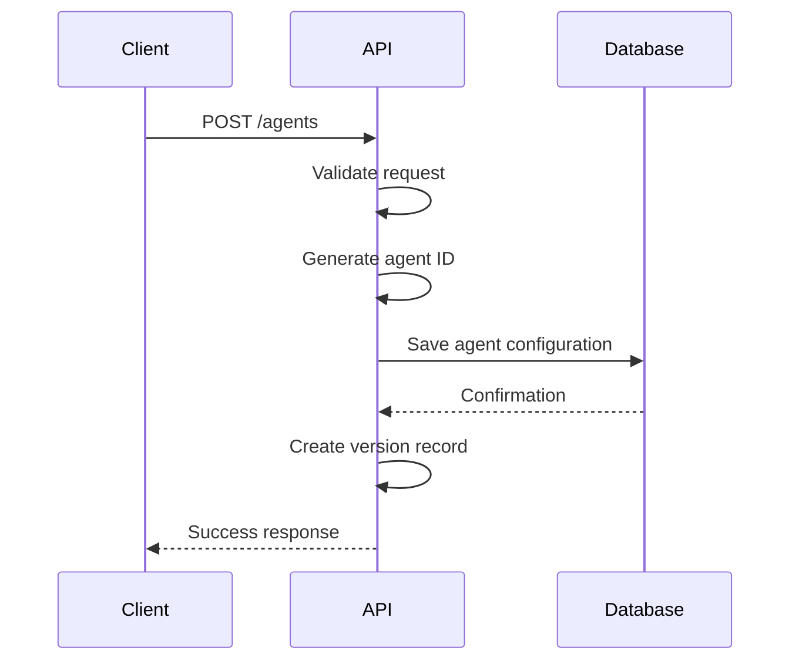

**Diagram sources**
- [agents.py](file://api/apps/sdk/agents.py#L53-L87)

### Retrieving Agents
Agents can be retrieved using the GET method on the `/agents` endpoint with optional query parameters for filtering by ID, title, pagination, and sorting.

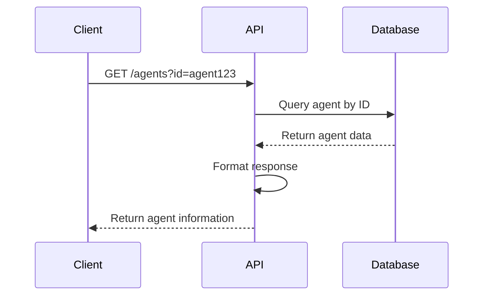

**Diagram sources**
- [agents.py](file://api/apps/sdk/agents.py#L33-L50)

### Updating Agents
Agents can be updated by sending a PUT request to the `/agents/{agent_id}` endpoint with the updated configuration. The system automatically creates a new version of the agent when the DSL is modified.

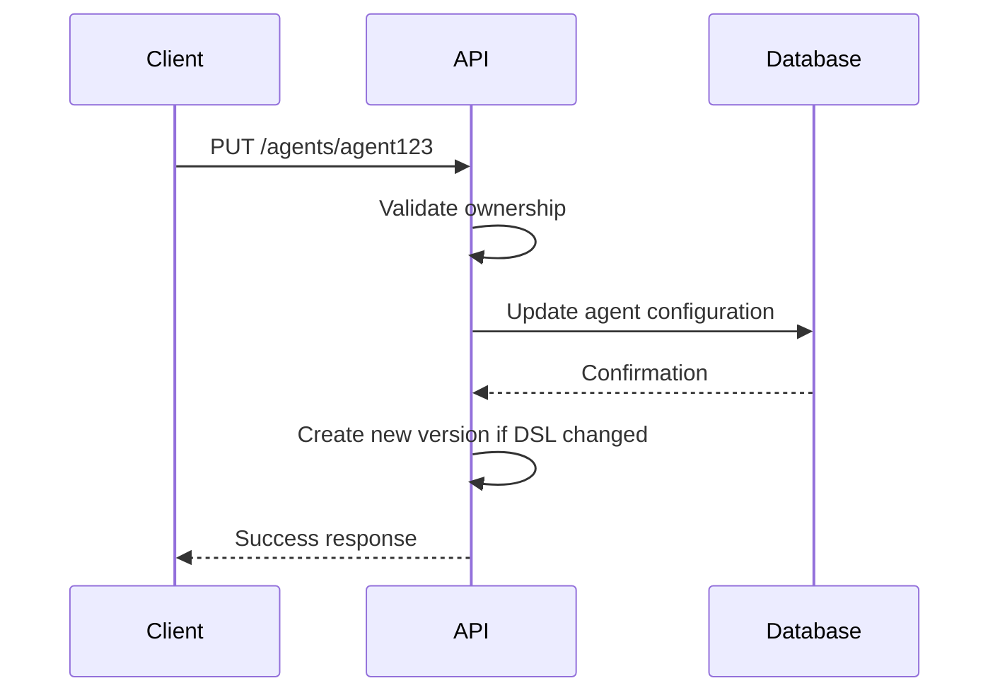

**Diagram sources**
- [agents.py](file://api/apps/sdk/agents.py#L90-L121)

### Deleting Agents
Agents can be deleted by sending a DELETE request to the `/agents/{agent_id}` endpoint. Only the owner of the agent can delete it.

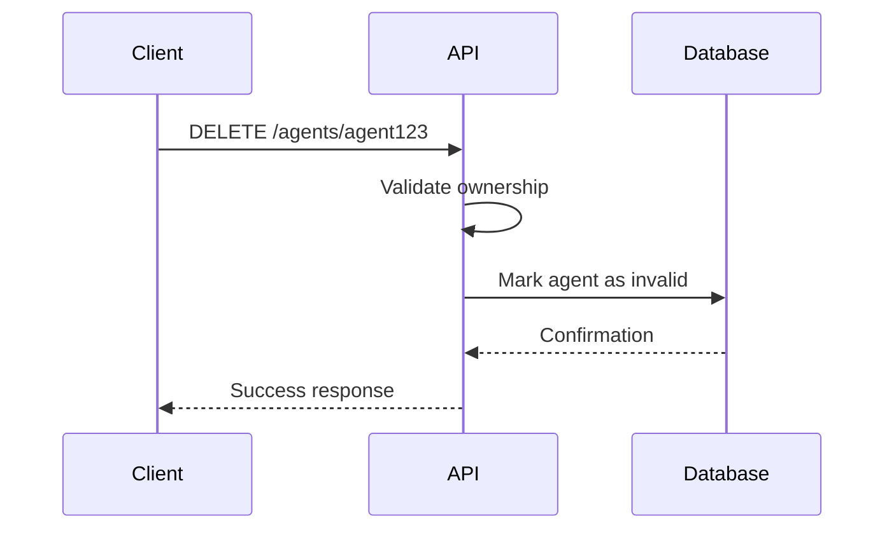

**Diagram sources**
- [agents.py](file://api/apps/sdk/agents.py#L124-L133)

## Conversation Management

The conversation management system handles the lifecycle of interactions between users and agents. Conversations are stateful sessions that maintain context across multiple message exchanges.

### Creating Conversations
Conversations are created by sending a POST request to the `/conversations/set` endpoint. The system initializes a new conversation with the agent's prologue message.

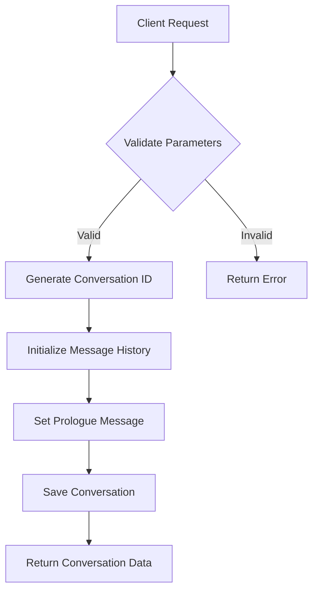

**Diagram sources**
- [conversation_app.py](file://api/apps/conversation_app.py#L37-L76)

### Retrieving Conversations
Conversations can be retrieved by their ID using the GET method on the `/conversations/get` endpoint. The response includes the conversation history, metadata, and associated agent information.

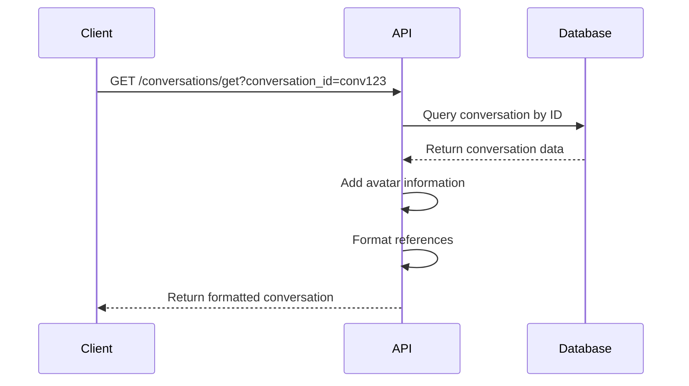

**Diagram sources**
- [conversation_app.py](file://api/apps/conversation_app.py#L81-L105)

### Listing Conversations
Multiple conversations can be retrieved by sending a GET request to the `/conversations/list` endpoint with the dialog_id parameter. The results can be paginated and sorted.

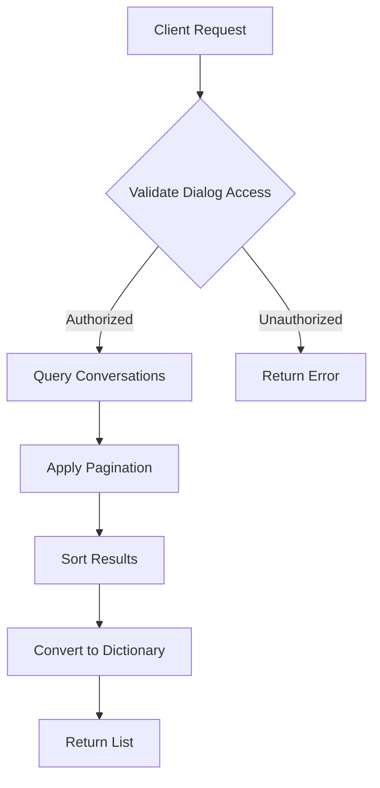

**Diagram sources**
- [conversation_app.py](file://api/apps/conversation_app.py#L153-L163)

### Deleting Conversations
Conversations can be removed by sending a POST request to the `/conversations/rm` endpoint with a list of conversation IDs to delete.

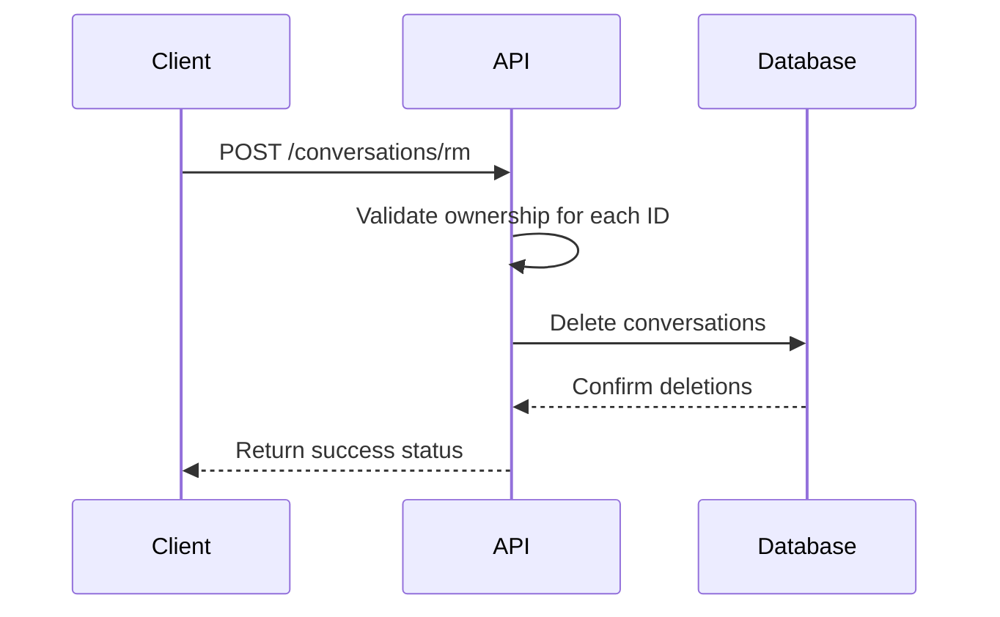

**Section sources**
- [conversation_app.py](file://api/apps/conversation_app.py#L131-L148)

## Agent Execution and Message Flow

The agent execution system processes user messages through the agent's workflow, invoking components in sequence and generating responses with optional citations and references.

### Message Processing Workflow
When a user sends a message to an agent, the system follows a structured workflow to generate a response.

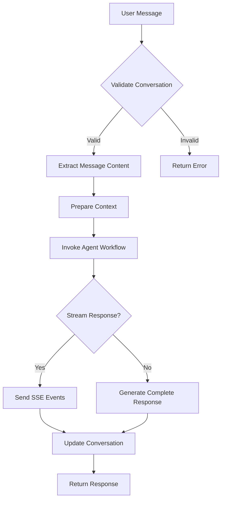

**Diagram sources**
- [conversation_app.py](file://api/apps/conversation_app.py#L168-L249)

### Component Invocation
Agents are composed of components that are invoked in a specific order based on the workflow definition. Each component performs a specific function and passes data to downstream components.

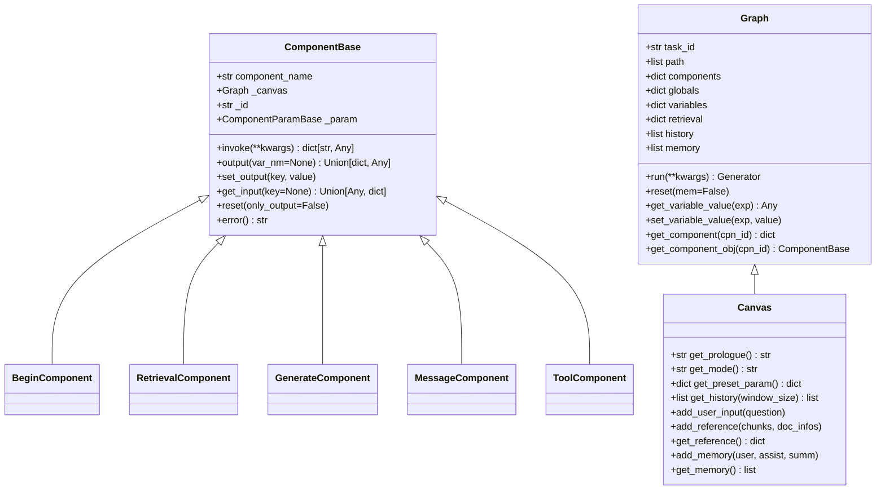

**Diagram sources**
- [canvas.py](file://agent/canvas.py#L40-L792)
- [base.py](file://agent/component/base.py#L393-L582)

## Agent Configuration Structure

Agents are configured using a JSON-based DSL that defines the workflow structure, components, and their interconnections. The configuration includes the graph layout, component definitions, and execution parameters.

### DSL Structure
The agent DSL consists of several key sections that define the agent's behavior and appearance.

```json
{
  "graph": {
    "nodes": [
      {
        "id": "begin",
        "type": "beginNode",
        "position": {"x": 50, "y": 200},
        "data": {"label": "Begin", "name": "begin"},
        "sourcePosition": "left",
        "targetPosition": "right"
      }
    ],
    "edges": []
  },
  "components": {
    "begin": {
      "obj": {
        "component_name": "Begin",
        "params": {
          "prologue": "Hello! How can I help you?",
          "mode": "chat",
          "inputs": {}
        }
      },
      "downstream": [],
      "upstream": []
    }
  },
  "history": [],
  "path": [],
  "retrieval": [],
  "globals": {
    "sys.query": "",
    "sys.user_id": "",
    "sys.conversation_turns": 0,
    "sys.files": []
  },
  "variables": {}
}
```

### Component Parameters
Each component has specific parameters that control its behavior. The Begin component, for example, includes parameters for the prologue message, execution mode, and input variables.

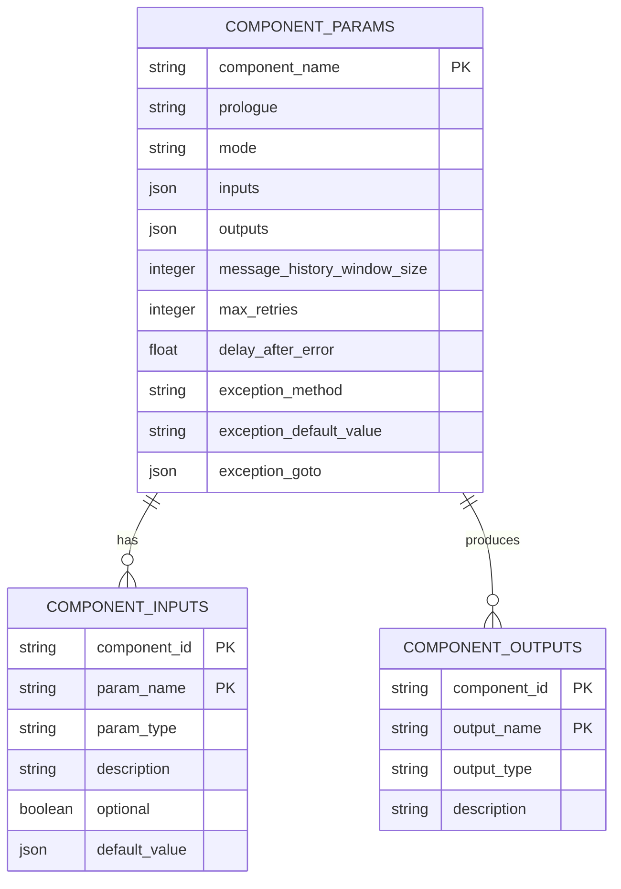

**Section sources**
- [base.py](file://agent/component/base.py#L37-L282)
- [canvas.py](file://agent/canvas.py#L79-L129)

## Real-time Message Streaming

The API supports real-time message streaming using Server-Sent Events (SSE), allowing clients to receive partial responses as they are generated by the agent.

### Streaming Response Format
When the stream parameter is set to true, the API returns a text/event-stream response with JSON-encoded events.

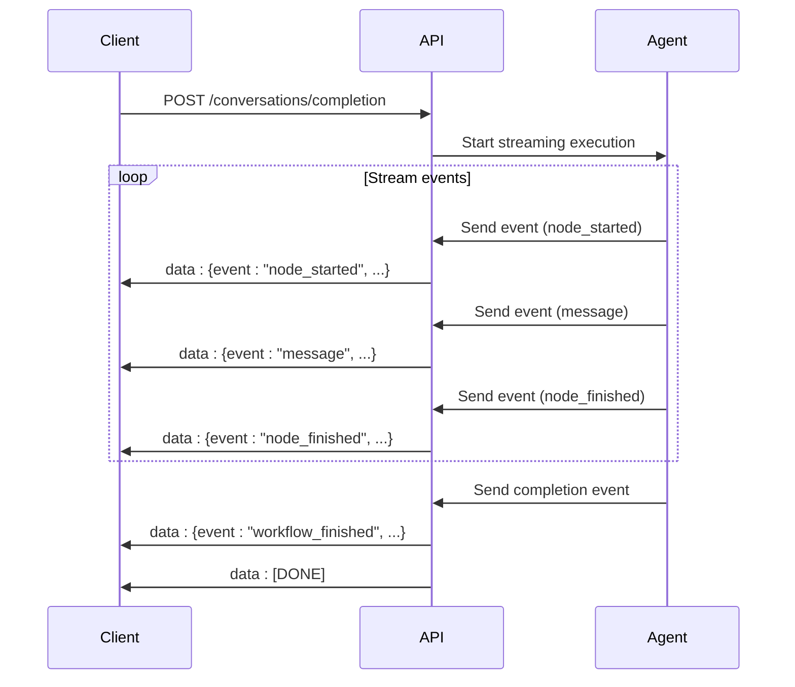

**Diagram sources**
- [conversation_app.py](file://api/apps/conversation_app.py#L221-L239)

### Event Types
The streaming API emits several types of events during agent execution:

| Event Type | Description | Data Fields |
|------------|-------------|-------------|
| workflow_started | Emitted when agent execution begins | inputs |
| node_started | Emitted when a component begins processing | component_id, component_name, component_type, thoughts |
| message | Emitted when partial content is generated | content, start_to_think, end_to_think, audio_binary |
| node_finished | Emitted when a component completes processing | inputs, outputs, component_id, component_name, component_type, error, elapsed_time |
| user_inputs | Emitted when additional user input is required | inputs, tips |
| workflow_finished | Emitted when agent execution completes | inputs, outputs, elapsed_time |

**Section sources**
- [canvas.py](file://agent/canvas.py#L363-L631)

## Error Handling and Session Management

The system includes comprehensive error handling and session management capabilities to ensure reliable operation and maintain conversation state.

### Error Handling
The API handles various error conditions and provides appropriate responses to clients.

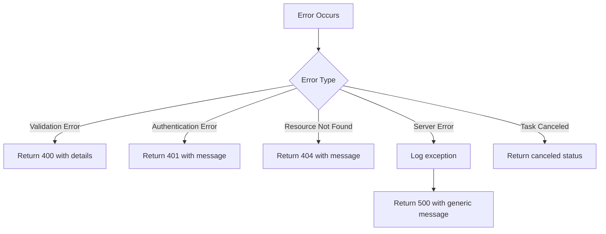

**Diagram sources**
- [conversation_app.py](file://api/apps/conversation_app.py#L77-L78)
- [dialog_app.py](file://api/apps/dialog_app.py#L122-L123)

### Session State Management
Conversation sessions maintain state across multiple interactions, including message history, references, and execution context.

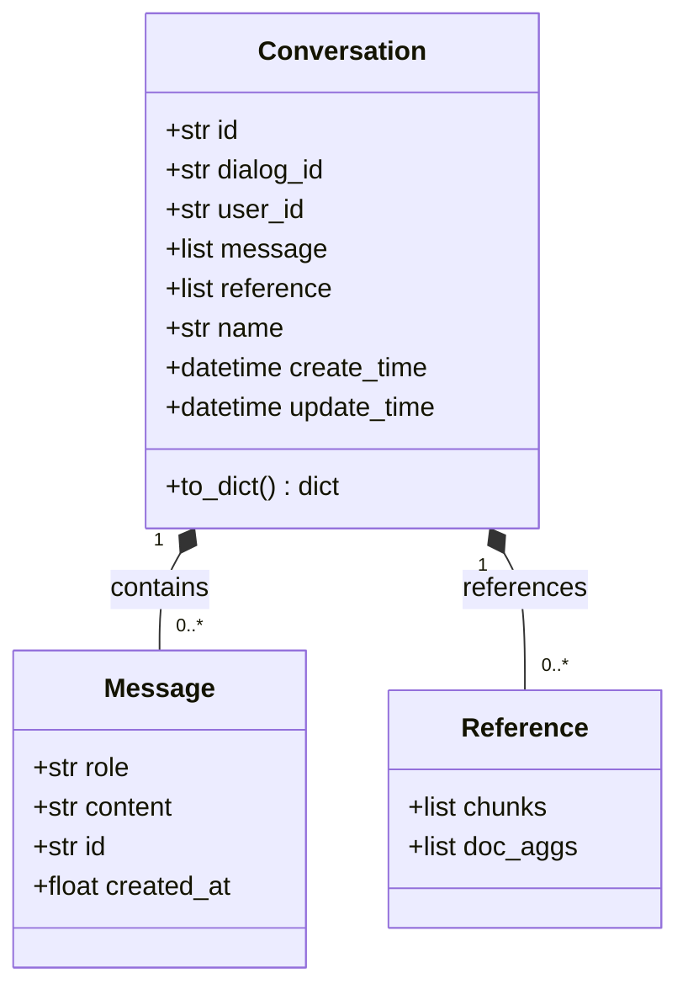

**Diagram sources**
- [conversation_service.py](file://api/db/services/conversation_service.py#L29-L30)

## Performance Metrics and Logging

The system collects and exposes performance metrics and execution logs to help monitor and optimize agent performance.

### Performance Metrics
The API includes timing information for various stages of agent execution.

| Metric | Description | Calculation |
|--------|-------------|-------------|
| Total Time | Complete execution time | finish_chat_ts - chat_start_ts |
| Check LLM | LLM validation time | check_llm_ts - chat_start_ts |
| Check Langfuse | Tracer initialization time | check_langfuse_tracer_ts - check_llm_ts |
| Bind Models | Model binding time | bind_models_ts - check_langfuse_tracer_ts |
| Query Refinement | Question processing time | refine_question_ts - bind_models_ts |
| Retrieval | Knowledge retrieval time | retrieval_ts - refine_question_ts |
| Generate Answer | Response generation time | finish_chat_ts - retrieval_ts |

**Section sources**
- [dialog_service.py](file://api/db/services/dialog_service.py#L572-L595)

### Execution Logging
The system logs detailed information about agent execution, including component invocations and intermediate results.

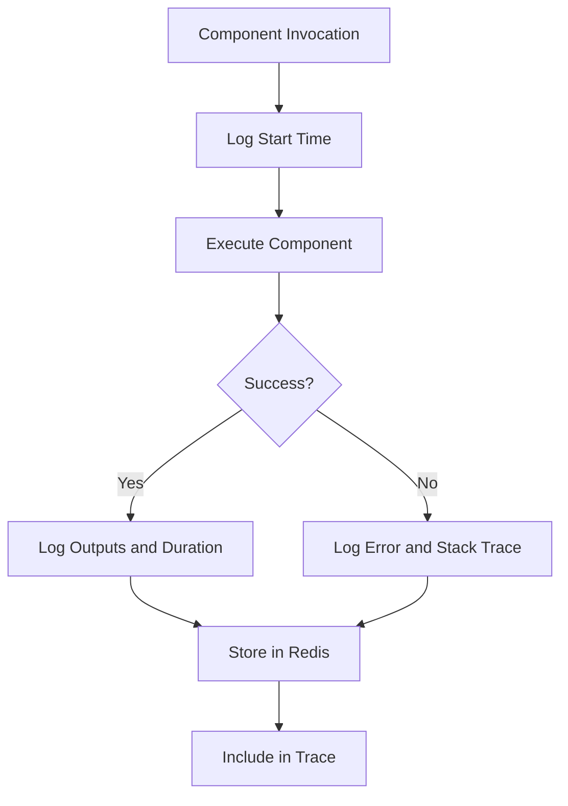

**Diagram sources**
- [canvas.py](file://agent/canvas.py#L445-L455)
- [dialog_service.py](file://api/db/services/dialog_service.py#L369-L378)