# Canvas API

<cite>
**Referenced Files in This Document**
- [agent/canvas.py](file://agent/canvas.py)
- [api/apps/canvas_app.py](file://api/apps/canvas_app.py)
- [api/db/services/canvas_service.py](file://api/db/services/canvas_service.py)
- [agent/templates/knowledge_base_report.json](file://agent/templates/knowledge_base_report.json)
- [agent/templates/customer_service.json](file://agent/templates/customer_service.json)
- [agent/component/base.py](file://agent/component/base.py)
- [web/src/interfaces/database/flow.ts](file://web/src/interfaces/database/flow.ts)
- [web/src/pages/agent/hooks/use-build-dsl.ts](file://web/src/pages/agent/hooks/use-build-dsl.ts)
- [api/db/db_models.py](file://api/db/db_models.py)
</cite>

## Table of Contents
1. [Introduction](#introduction)
2. [Canvas Architecture Overview](#canvas-architecture-overview)
3. [Canvas Data Structure](#canvas-data-structure)
4. [Core API Endpoints](#core-api-endpoints)
5. [Canvas Workflow Operations](#canvas-workflow-operations)
6. [Component Types and Nodes](#component-types-and-nodes)
7. [Execution and Versioning](#execution-and-versioning)
8. [Integration with Agent System](#integration-with-agent-system)
9. [Advanced Features](#advanced-features)
10. [Error Handling and Troubleshooting](#error-handling-and-troubleshooting)

## Introduction

RAGFlow's Canvas API provides a powerful visual workflow design system for creating, managing, and executing agent-based workflows. The canvas serves as a visual representation of agent logic, connecting various components like begin nodes, processing nodes, and output nodes through a directed acyclic graph (DAG) structure.

The canvas system enables users to design complex agent workflows through an intuitive drag-and-drop interface while maintaining full programmatic control through REST APIs. Workflows can be versioned, executed programmatically, and integrated with knowledge bases and external systems.

## Canvas Architecture Overview

The canvas architecture consists of several interconnected components that work together to provide a comprehensive workflow management system:

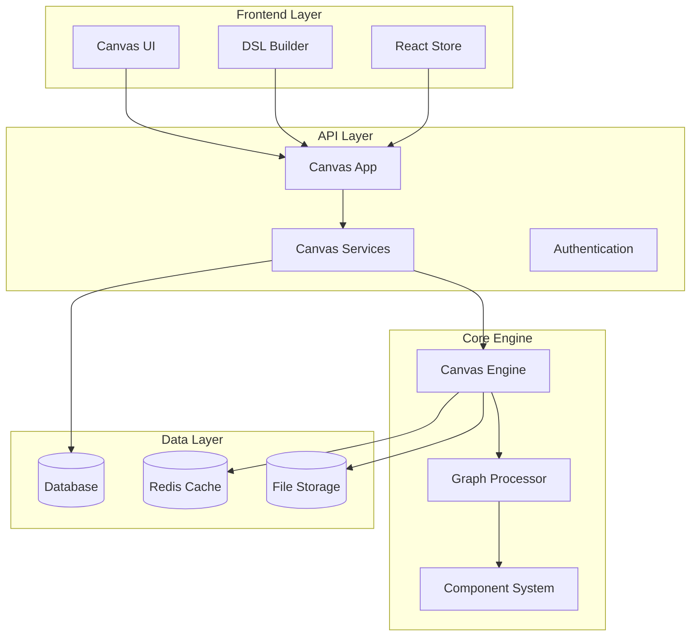

**Diagram sources**
- [agent/canvas.py](file://agent/canvas.py#L40-L100)
- [api/apps/canvas_app.py](file://api/apps/canvas_app.py#L16-L50)
- [api/db/services/canvas_service.py](file://api/db/services/canvas_service.py#L31-L50)

**Section sources**
- [agent/canvas.py](file://agent/canvas.py#L40-L100)
- [api/apps/canvas_app.py](file://api/apps/canvas_app.py#L16-L50)

## Canvas Data Structure

The canvas workflow is represented using a Domain Specific Language (DSL) that defines the structure, components, and execution flow of the workflow.

### Basic DSL Structure

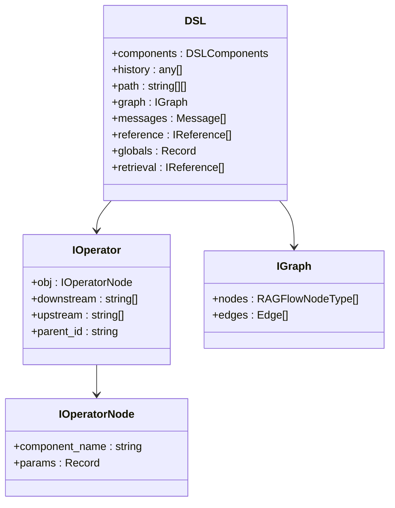

**Diagram sources**
- [web/src/interfaces/database/flow.ts](file://web/src/interfaces/database/flow.ts#L6-L30)
- [web/src/interfaces/database/flow.ts](file://web/src/interfaces/database/flow.ts#L187-L191)

### Component Definition

Each component in the canvas is defined with a specific structure:

| Field | Type | Description | Required |
|-------|------|-------------|----------|
| `component_name` | string | Name of the component type | Yes |
| `params` | object | Configuration parameters for the component | Yes |
| `downstream` | string[] | List of connected downstream component IDs | Yes |
| `upstream` | string[] | List of connected upstream component IDs | Yes |

### Global Variables

The canvas supports global variables that can be accessed across all components:

| Variable | Type | Description | Default Value |
|----------|------|-------------|---------------|
| `sys.query` | string | User query input | "" |
| `sys.user_id` | string | Current user identifier | tenant_id |
| `sys.conversation_turns` | number | Conversation turn counter | 0 |
| `sys.files` | array | Uploaded file references | [] |

**Section sources**
- [web/src/interfaces/database/flow.ts](file://web/src/interfaces/database/flow.ts#L6-L30)
- [agent/canvas.py](file://agent/canvas.py#L285-L290)

## Core API Endpoints

### Canvas Management Endpoints

#### Get Canvas Templates
```http
GET /api/v1/canvas/templates
```
Retrieves available canvas templates for workflow creation.

**Response:**
```json
{
  "code": 0,
  "data": [
    {
      "id": "template_id",
      "title": {"en": "Template Name"},
      "description": {"en": "Template description"},
      "dsl": {...}
    }
  ]
}
```

#### Create/Update Canvas
```http
POST /api/v1/canvas/set
PUT /api/v1/canvas/set
```
Creates a new canvas or updates an existing one.

**Request Body:**
```json
{
  "id": "canvas_id",
  "title": "Workflow Title",
  "description": "Workflow description",
  "dsl": {
    "components": {...},
    "graph": {...},
    "globals": {...}
  },
  "canvas_category": "Agent"
}
```

#### Retrieve Canvas
```http
GET /api/v1/canvas/get/:canvas_id
GET /api/v1/canvas/getsse/:canvas_id
```
Gets canvas details with optional SSE streaming support.

#### Delete Canvas
```http
POST /api/v1/canvas/rm
```
Deletes one or more canvases by ID.

**Request Body:**
```json
{
  "canvas_ids": ["id1", "id2"]
}
```

#### List Canvases
```http
GET /api/v1/canvas/list
```
Lists all canvases with pagination and filtering options.

**Query Parameters:**
- `keywords`: Search term
- `page`: Page number
- `page_size`: Items per page
- `orderby`: Sort field
- `desc`: Descending order flag
- `owner_ids`: Comma-separated owner IDs

### Workflow Execution Endpoints

#### Execute Canvas Workflow
```http
POST /api/v1/canvas/completion
```
Executes a canvas workflow with streaming response.

**Request Body:**
```json
{
  "id": "canvas_id",
  "query": "User query",
  "files": [...],
  "inputs": {...},
  "user_id": "user_id"
}
```

**Streaming Response Events:**
- `workflow_started`: Workflow initialization
- `node_started`: Individual node execution start
- `node_finished`: Node execution completion
- `message`: Generated content
- `workflow_finished`: Workflow completion

#### Reset Canvas State
```http
POST /api/v1/canvas/reset
```
Resets canvas execution state and clears history.

#### Cancel Execution
```http
PUT /api/v1/canvas/cancel/:task_id
```
Cancels an ongoing canvas execution.

**Section sources**
- [api/apps/canvas_app.py](file://api/apps/canvas_app.py#L46-L124)
- [api/apps/canvas_app.py](file://api/apps/canvas_app.py#L125-L200)

## Canvas Workflow Operations

### Creating Workflows

Workflows are created by defining components and their connections in the DSL structure:

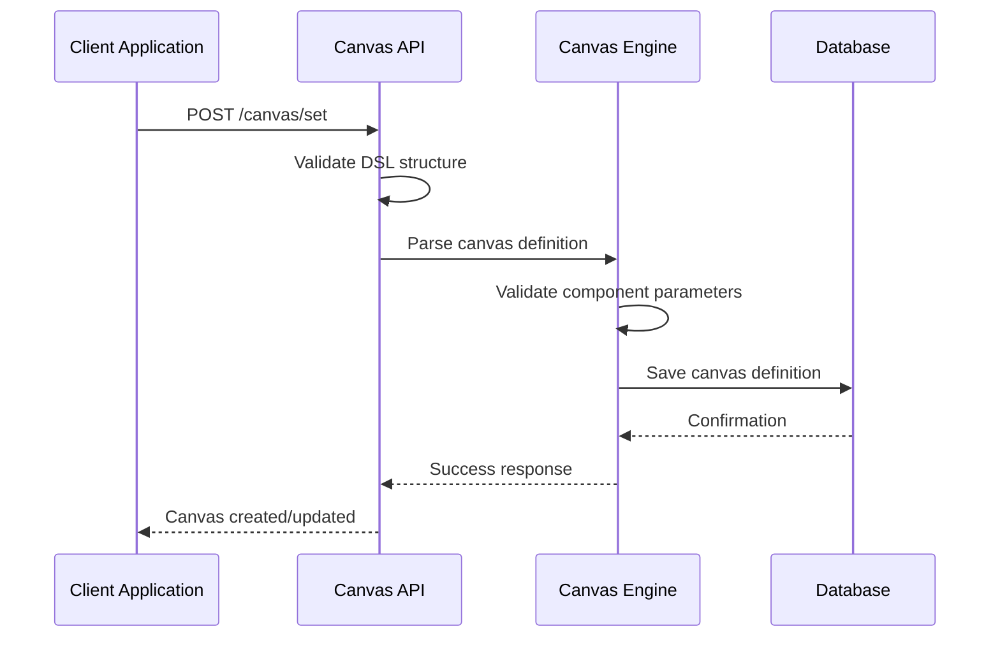

**Diagram sources**
- [api/apps/canvas_app.py](file://api/apps/canvas_app.py#L66-L91)
- [agent/canvas.py](file://agent/canvas.py#L282-L310)

### Executing Workflows

Workflow execution follows a directed execution path based on component connections:

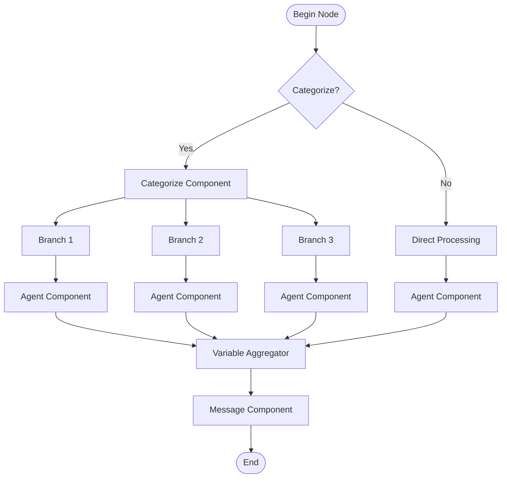

**Diagram sources**
- [agent/templates/customer_service.json](file://agent/templates/customer_service.json#L167-L230)
- [agent/canvas.py](file://agent/canvas.py#L363-L400)

### Debugging and Testing

The canvas system provides debugging capabilities for individual components:

```http
POST /api/v1/canvas/debug
```

**Request Body:**
```json
{
  "id": "canvas_id",
  "component_id": "component_id",
  "params": {
    "param_name": {"value": "param_value"}
  }
}
```

**Section sources**
- [api/apps/canvas_app.py](file://api/apps/canvas_app.py#L278-L308)
- [agent/canvas.py](file://agent/canvas.py#L363-L400)

## Component Types and Nodes

### Available Component Types

The canvas system supports various component types for building complex workflows:

| Component Type | Purpose | Key Parameters |
|----------------|---------|----------------|
| `Begin` | Entry point for workflows | `prologue`, `mode`, `inputs` |
| `Agent` | AI-powered processing | `llm_id`, `prompts`, `tools` |
| `Categorize` | Intent classification | `category_description`, `llm_id` |
| `Retrieval` | Knowledge base search | `kb_ids`, `top_k`, `similarity_threshold` |
| `Message` | Content output | `content` |
| `VariableAggregator` | Combine outputs | `groups` |
| `Switch` | Conditional routing | `conditions` |
| `Iteration` | Loop processing | `max_rounds` |
| `Webhook` | External API calls | `url`, `method` |

### Node Types in UI

The frontend defines specific node types for the visual editor:

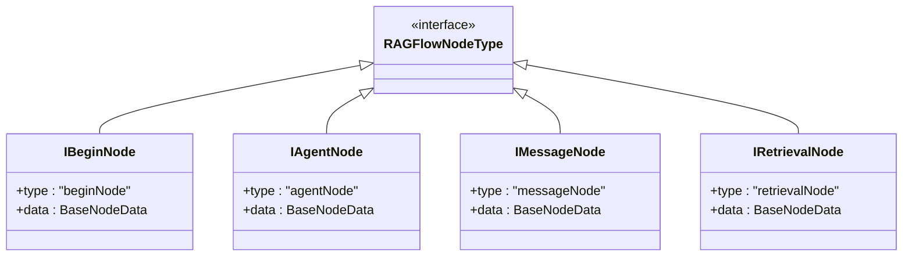

**Diagram sources**
- [web/src/interfaces/database/flow.ts](file://web/src/interfaces/database/flow.ts#L168-L186)

**Section sources**
- [agent/component/base.py](file://agent/component/base.py#L393-L450)
- [web/src/interfaces/database/flow.ts](file://web/src/interfaces/database/flow.ts#L168-L186)

## Execution and Versioning

### Workflow Execution Process

Canvas workflows execute asynchronously with streaming responses:

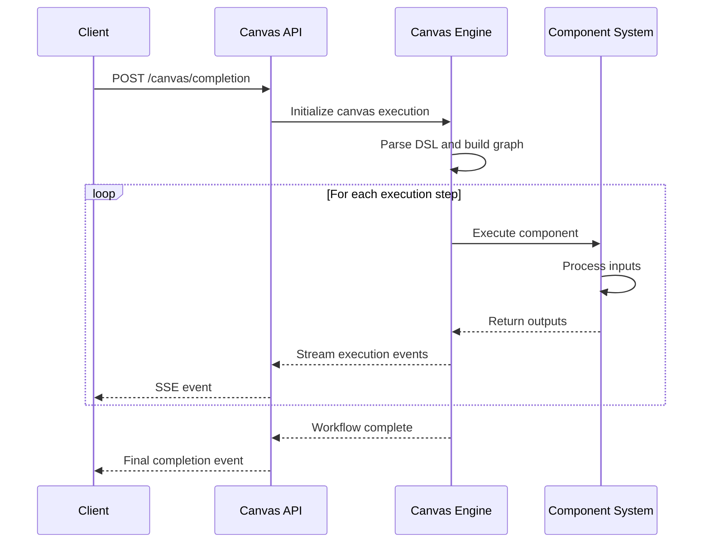

**Diagram sources**
- [agent/canvas.py](file://agent/canvas.py#L363-L400)
- [api/apps/canvas_app.py](file://api/apps/canvas_app.py#L125-L172)

### Version Control System

The canvas system maintains version history for workflow modifications:

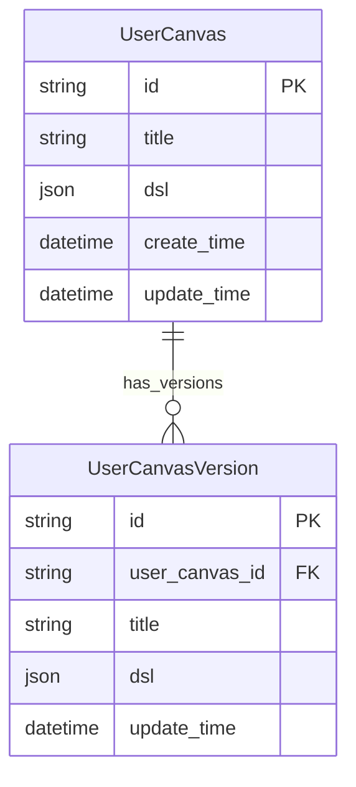

**Diagram sources**
- [api/db/db_models.py](file://api/db/db_models.py#L948-L956)

### Version Management Endpoints

#### Get Version History
```http
GET /api/v1/canvas/getlistversion/:canvas_id
```
Retrieves all version history for a canvas.

#### Get Specific Version
```http
GET /api/v1/canvas/getversion/:version_id
```
Retrieves a specific version of a canvas.

#### Restore Version
Versions are automatically restored when loading a specific version ID.

**Section sources**
- [api/apps/canvas_app.py](file://api/apps/canvas_app.py#L404-L425)
- [api/db/db_models.py](file://api/db/db_models.py#L948-L956)

## Integration with Agent System

### Agent Canvas Categories

RAGFlow supports two main canvas categories:

| Category | Purpose | Execution Model |
|----------|---------|-----------------|
| `Agent` | AI agent workflows | Interactive execution with streaming |
| `DataFlow` | Data processing pipelines | Batch execution with task queuing |

### Knowledge Base Integration

Canvas workflows can integrate with knowledge bases for retrieval-augmented generation:

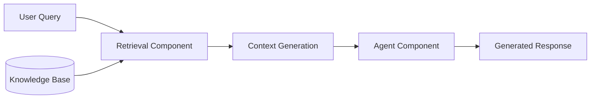

**Diagram sources**
- [agent/templates/knowledge_base_report.json](file://agent/templates/knowledge_base_report.json#L55-L77)

### External System Integration

#### Webhook Integration
```http
POST /api/v1/webhook/:agent_id
```
Triggers canvas execution via webhook with payload support.

#### File Upload Integration
```http
POST /api/v1/canvas/upload/:canvas_id
```
Uploads files for use in canvas workflows.

**Section sources**
- [api/apps/canvas_app.py](file://api/apps/canvas_app.py#L125-L153)
- [api/apps/sdk/agents.py](file://api/apps/sdk/agents.py#L135-L169)

## Advanced Features

### Variable System

The canvas system supports a sophisticated variable system for data flow:

| Variable Type | Syntax | Example |
|---------------|--------|---------|
| Component Output | `{component_id@output_name}` | `{Agent:123@content}` |
| Global Variable | `sys.variable_name` | `sys.query` |
| Environment Variable | `env.variable_name` | `env.api_key` |

### Conditional Logic

Workflows support conditional branching through Switch and Categorize components:

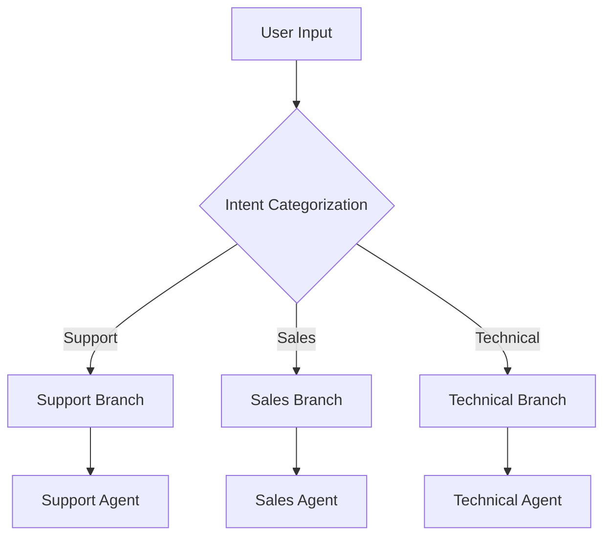

**Diagram sources**
- [agent/templates/customer_service.json](file://agent/templates/customer_service.json#L167-L230)

### Loop and Iteration

The canvas system supports iterative processing:

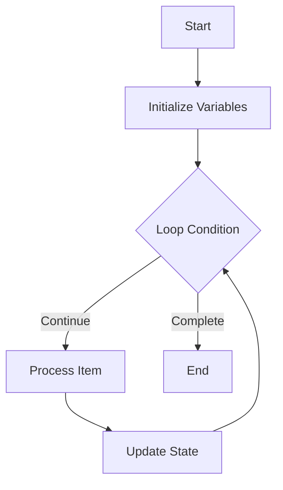

**Diagram sources**
- [agent/component/iteration.py](file://agent/component/iteration.py#L1-L50)

### Session Management

Canvas workflows maintain conversation sessions:

| Feature | Description | API Endpoint |
|---------|-------------|--------------|
| Session Creation | Creates new conversation session | `/canvas/completion` |
| Message History | Maintains conversation history | Built-in |
| Reference Tracking | Tracks source documents | Automatic |
| Error Recovery | Handles execution errors | Automatic |

**Section sources**
- [agent/canvas.py](file://agent/canvas.py#L687-L700)
- [api/db/services/canvas_service.py](file://api/db/services/canvas_service.py#L180-L238)

## Error Handling and Troubleshooting

### Common Error Scenarios

| Error Type | Cause | Solution |
|------------|-------|----------|
| Authentication Error | Invalid API key | Verify API token |
| Authorization Error | Insufficient permissions | Check ownership |
| Canvas Not Found | Invalid canvas ID | Verify canvas exists |
| Execution Timeout | Long-running operations | Increase timeout limits |
| Parameter Validation | Invalid component parameters | Check parameter schemas |

### Debug Information

The canvas system provides detailed debugging information:

```http
GET /api/v1/canvas/trace?canvas_id=:id&message_id=:id
```

Returns execution traces with:
- Component execution logs
- Variable values at each step
- Error stack traces
- Performance metrics

### Monitoring and Logging

Canvas execution generates comprehensive logs:

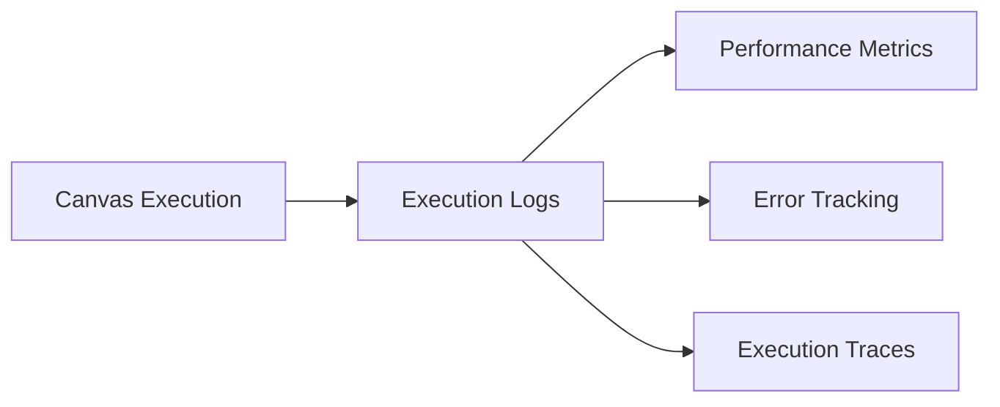

**Diagram sources**
- [agent/canvas.py](file://agent/canvas.py#L741-L764)

**Section sources**
- [api/apps/canvas_app.py](file://api/apps/canvas_app.py#L125-L172)
- [agent/canvas.py](file://agent/canvas.py#L741-L764)