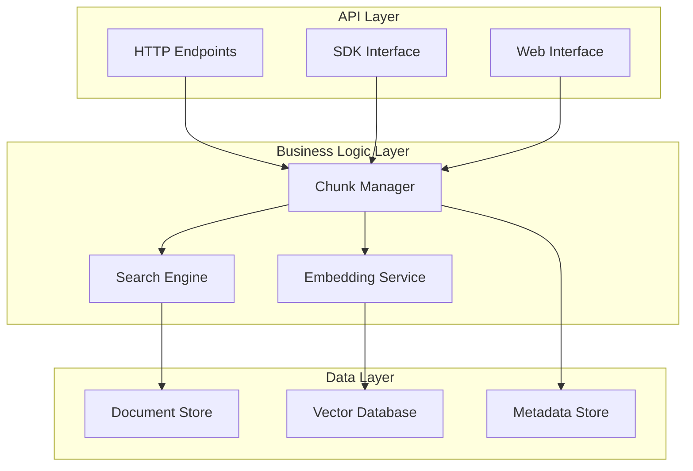
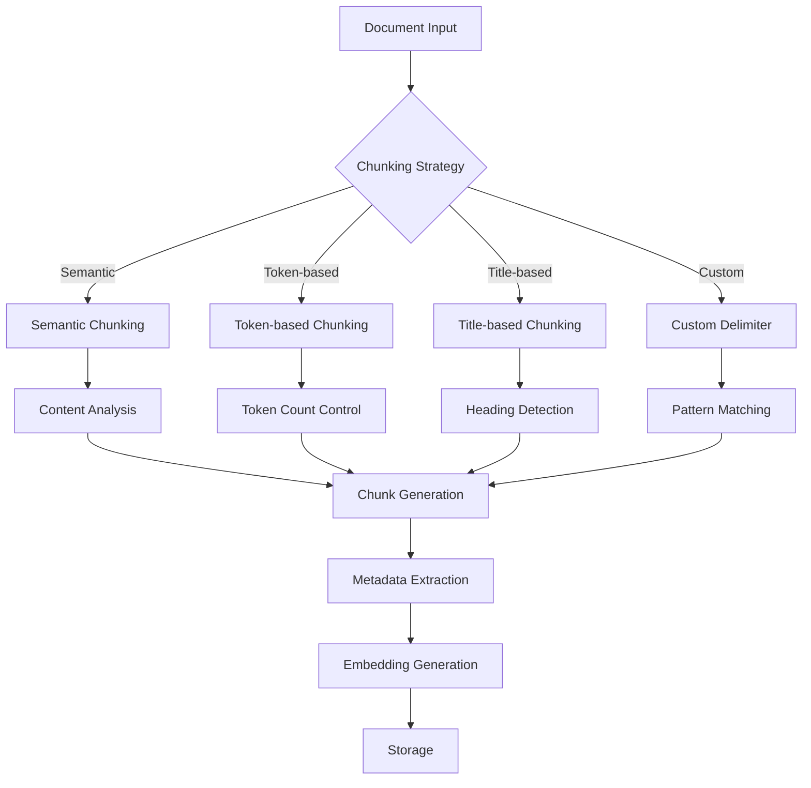
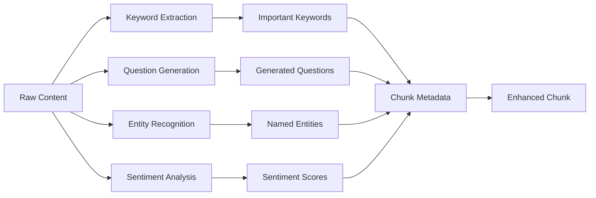
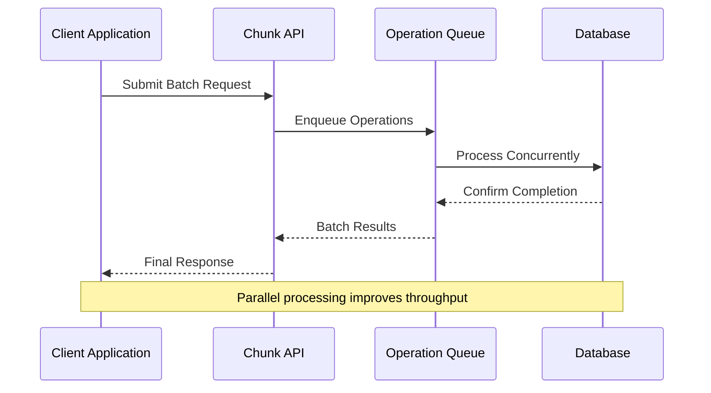
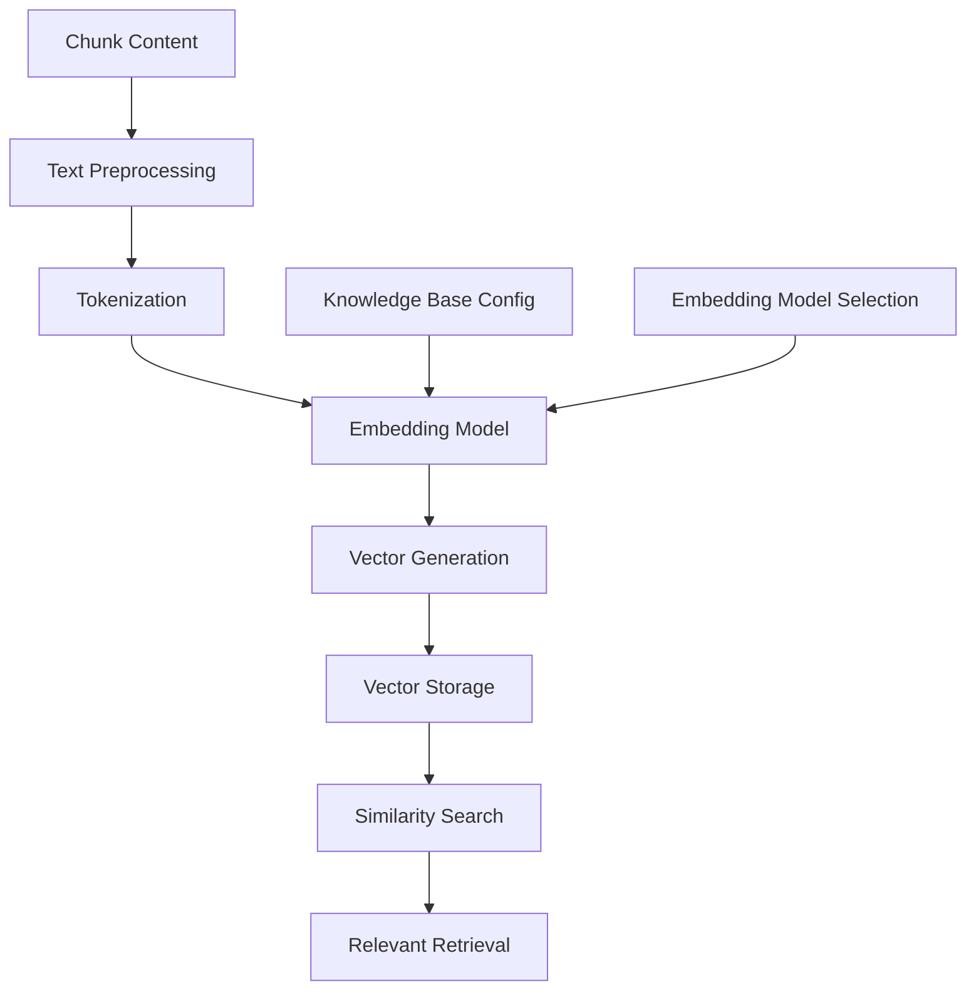
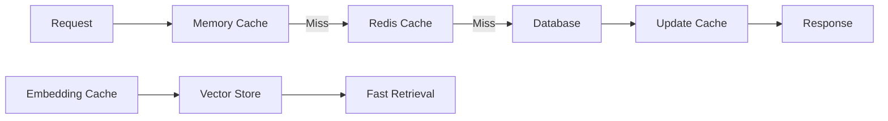

# Chunk Management API

<cite>
**Referenced Files in This Document**
- [chunk_app.py](file://api/apps/chunk_app.py)
- [chunk.py](file://sdk/python/ragflow_sdk/modules/chunk.py)
- [naive.py](file://rag/app/naive.py)
- [search.py](file://rag/nlp/search.py)
- [ob_conn.py](file://rag/utils/ob_conn.py)
- [infinity_conn.py](file://rag/utils/infinity_conn.py)
- [test_add_chunk.py](file://sdk/python/test/test_http_api/test_chunk_management_within_dataset/test_add_chunk.py)
- [test_list_chunks.py](file://sdk/python/test/test_http_api/test_chunk_management_within_dataset/test_list_chunks.py)
- [test_delete_chunks.py](file://sdk/python/test/test_http_api/test_chunk_management_within_dataset/test_delete_chunks.py)
- [api.ts](file://web/src/utils/api.ts)
</cite>

## Table of Contents
1. [Introduction](#introduction)
2. [System Architecture](#system-architecture)
3. [Core Concepts](#core-concepts)
4. [API Endpoints](#api-endpoints)
5. [Chunk Creation and Configuration](#chunk-creation-and-configuration)
6. [Chunk Retrieval and Filtering](#chunk-retrieval-and-filtering)
7. [Batch Operations](#batch-operations)
8. [Integration with RAG Pipeline](#integration-with-rag-pipeline)
9. [Performance Considerations](#performance-considerations)
10. [Error Handling](#error-handling)
11. [Best Practices](#best-practices)

## Introduction

RAGFlow's chunk management system provides comprehensive APIs for handling document chunks within knowledge bases. Chunks represent processed segments of documents that are optimized for retrieval and context provision to Large Language Models (LLMs). The system supports various chunking strategies, preprocessing options, and metadata extraction capabilities.

Chunks serve as the fundamental building blocks for RAG (Retrieval-Augmented Generation) systems, enabling efficient document retrieval and context-aware responses. Each chunk contains processed content, metadata, embeddings, and contextual information that facilitates semantic search and retrieval operations.

## System Architecture

The chunk management system follows a layered architecture that separates concerns between API handling, business logic, and data persistence:



**Diagram sources**
- [chunk_app.py](file://api/apps/chunk_app.py#L41-L416)
- [search.py](file://rag/nlp/search.py#L36-L200)

**Section sources**
- [chunk_app.py](file://api/apps/chunk_app.py#L1-L416)
- [search.py](file://rag/nlp/search.py#L1-L200)

## Core Concepts

### Chunk Structure

Each chunk contains several key components that enable efficient retrieval and processing:

| Field | Type | Description |
|-------|------|-------------|
| `id` | String | Unique identifier for the chunk |
| `content_with_weight` | String | Processed chunk content with importance weighting |
| `important_kwd` | Array[String] | Important keywords extracted from the content |
| `question_kwd` | Array[String] | Generated questions about the content |
| `content_ltks` | Array[String] | Tokenized content for search indexing |
| `content_sm_ltks` | Array[String] | Fine-grained tokenized content |
| `q_%d_vec` | Array[Float] | Embedding vector for similarity search |
| `doc_id` | String | Reference to the parent document |
| `kb_id` | Array[String] | Knowledge base identifiers |
| `create_time` | String | Timestamp of chunk creation |
| `available_int` | Integer | Availability flag (1 for active, 0 for inactive) |

### Chunking Strategies

RAGFlow supports multiple chunking strategies for optimal document segmentation:



**Diagram sources**
- [naive.py](file://rag/app/naive.py#L604-L956)

**Section sources**
- [naive.py](file://rag/app/naive.py#L604-L956)

## API Endpoints

### Create Chunk

Creates a new chunk within a document in a knowledge base.

**Endpoint:** `POST /chunk/create`

**Request Parameters:**
- `doc_id` (string, required): Document identifier
- `content_with_weight` (string, required): Content to be chunked
- `important_kwd` (array, optional): Important keywords
- `question_kwd` (array, optional): Generated questions
- `tag_feas` (object, optional): Tag features
- `tag_kwd` (string, optional): Tag keywords

**Response:**
```json
{
  "code": 0,
  "message": "success",
  "data": {
    "chunk_id": "unique_chunk_identifier"
  }
}
```

**Section sources**
- [chunk_app.py](file://api/apps/chunk_app.py#L223-L278)

### Retrieve Chunk

Fetches a specific chunk by its identifier.

**Endpoint:** `GET /chunk/get?chunk_id={chunk_id}`

**Response:**
```json
{
  "code": 0,
  "message": "success",
  "data": {
    "id": "chunk_id",
    "content_with_weight": "chunk content...",
    "important_kwd": ["keyword1", "keyword2"],
    "question_kwd": ["question1?", "question2?"],
    "doc_id": "document_id",
    "kb_id": ["knowledge_base_id"],
    "create_time": "2024-01-01 12:00:00"
  }
}
```

**Section sources**
- [chunk_app.py](file://api/apps/chunk_app.py#L90-L119)

### List Chunks

Retrieves chunks from a document with optional filtering and pagination.

**Endpoint:** `POST /chunk/list`

**Request Parameters:**
- `doc_id` (string, required): Document identifier
- `page` (integer, optional): Page number (default: 1)
- `size` (integer, optional): Items per page (default: 30)
- `keywords` (string, optional): Search keywords
- `available_int` (integer, optional): Filter by availability (1 or 0)

**Response:**
```json
{
  "code": 0,
  "message": "success",
  "data": {
    "total": 100,
    "chunks": [
      {
        "chunk_id": "chunk1",
        "content_with_weight": "content...",
        "important_kwd": [],
        "question_kwd": [],
        "available_int": 1,
        "positions": [[1, 1, 1, 100, 200]]
      }
    ],
    "doc": {
      "id": "document_id",
      "name": "document_name",
      "chunk_count": 100
    }
  }
}
```

**Section sources**
- [chunk_app.py](file://api/apps/chunk_app.py#L41-L87)

### Update Chunk

Modifies an existing chunk's content and metadata.

**Endpoint:** `POST /chunk/set`

**Request Parameters:**
- `doc_id` (string, required): Document identifier
- `chunk_id` (string, required): Chunk identifier
- `content_with_weight` (string, required): Updated content
- `important_kwd` (array, optional): Updated keywords
- `question_kwd` (array, optional): Updated questions
- `available_int` (integer, optional): Availability flag

**Response:**
```json
{
  "code": 0,
  "message": "success",
  "data": true
}
```

**Section sources**
- [chunk_app.py](file://api/apps/chunk_app.py#L122-L176)

### Delete Chunks

Removes one or more chunks from a document.

**Endpoint:** `POST /chunk/rm`

**Request Parameters:**
- `doc_id` (string, required): Document identifier
- `chunk_ids` (array[string], required): Array of chunk identifiers to delete

**Response:**
```json
{
  "code": 0,
  "message": "success",
  "data": true
}
```

**Section sources**
- [chunk_app.py](file://api/apps/chunk_app.py#L199-L218)

### Switch Chunk Availability

Changes the availability status of one or more chunks.

**Endpoint:** `POST /chunk/switch`

**Request Parameters:**
- `doc_id` (string, required): Document identifier
- `chunk_ids` (array[string], required): Array of chunk identifiers
- `available_int` (integer, required): New availability status (0 or 1)

**Response:**
```json
{
  "code": 0,
  "message": "success",
  "data": true
}
```

**Section sources**
- [chunk_app.py](file://api/apps/chunk_app.py#L179-L196)

### Retrieval Test

Tests chunk retrieval with various search parameters.

**Endpoint:** `POST /chunk/retrieval_test`

**Request Parameters:**
- `kb_id` (string/array, required): Knowledge base identifier(s)
- `question` (string, required): Search query
- `doc_ids` (array, optional): Specific document identifiers
- `top_k` (integer, optional): Maximum results (default: 1024)
- `similarity_threshold` (float, optional): Similarity threshold (default: 0.0)
- `vector_similarity_weight` (float, optional): Vector similarity weight (default: 0.3)
- `cross_languages` (array, optional): Languages for cross-language search
- `rerank_id` (string, optional): Reranking model identifier

**Response:**
```json
{
  "code": 0,
  "message": "success",
  "data": {
    "total": 10,
    "chunks": [
      {
        "chunk_id": "chunk1",
        "content_with_weight": "relevant content...",
        "similarity": 0.85,
        "vector_similarity": 0.82,
        "term_similarity": 0.88
      }
    ],
    "labels": {}
  }
}
```

**Section sources**
- [chunk_app.py](file://api/apps/chunk_app.py#L281-L374)

## Chunk Creation and Configuration

### Basic Chunk Creation

The simplest way to create a chunk involves providing content and associating it with a document:

```python
# Example: Creating a basic chunk
response = rag.chunk.create(
    doc_id="document_123",
    content_with_weight="This is the content to be chunked."
)
```

### Advanced Configuration Options

RAGFlow supports extensive configuration for chunk creation:

| Parameter | Type | Description | Default |
|-----------|------|-------------|---------|
| `important_kwd` | Array[String] | Explicitly defined important keywords | [] |
| `question_kwd` | Array[String] | Automatically generated questions | [] |
| `tag_feas` | Object | Tag features for classification | {} |
| `tag_kwd` | String | Tag keywords for categorization | "" |

### Metadata Extraction

The system automatically extracts and enriches chunk metadata:



**Diagram sources**
- [chunk_app.py](file://api/apps/chunk_app.py#L122-L176)

**Section sources**
- [chunk_app.py](file://api/apps/chunk_app.py#L223-L278)

## Chunk Retrieval and Filtering

### Full-text Search

Chunks support comprehensive full-text search across multiple fields:

```python
# Search with keywords
response = rag.chunk.list(
    doc_id="document_123",
    keywords="machine learning algorithms",
    page=1,
    size=20
)
```

### Semantic Search

Leverage vector embeddings for semantic similarity search:

```python
# Semantic search with embeddings
response = rag.chunk.retrieval_test(
    kb_id="knowledge_base_123",
    question="What are neural network architectures?",
    vector_similarity_weight=0.7,
    similarity_threshold=0.3
)
```

### Filtering Capabilities

Multiple filtering options are available for precise chunk retrieval:

| Filter | Type | Description |
|--------|------|-------------|
| `available_int` | Integer | Active (1) or inactive (0) chunks |
| `doc_ids` | Array[String] | Specific document identifiers |
| `knowledge_graph_kwd` | String | Knowledge graph tags |
| `entity_kwd` | String | Entity classifications |
| `from_entity_kwd` | String | Source entity filter |
| `to_entity_kwd` | String | Target entity filter |

### Retrieval Results Structure

Search results include comprehensive scoring and ranking information:

```json
{
  "chunk_id": "unique_id",
  "content_with_weight": "matched content...",
  "similarity": 0.85,
  "vector_similarity": 0.82,
  "term_similarity": 0.88,
  "positions": [[1, 1, 1, 100, 200]],
  "available_int": 1
}
```

**Section sources**
- [chunk_app.py](file://api/apps/chunk_app.py#L41-L87)
- [search.py](file://rag/nlp/search.py#L120-L458)

## Batch Operations

### Bulk Chunk Creation

Efficiently create multiple chunks in a single operation:

```python
# Batch creation example
chunks_to_create = [
    {"content_with_weight": "Content 1", "important_kwd": ["keyword1"]},
    {"content_with_weight": "Content 2", "important_kwd": ["keyword2"]},
    {"content_with_weight": "Content 3"}
]

# Implementation would involve multiple API calls or batch processing
```

### Batch Deletion

Remove multiple chunks efficiently:

```python
# Delete multiple chunks
response = rag.chunk.delete(
    doc_id="document_123",
    chunk_ids=["chunk1", "chunk2", "chunk3"]
)
```

### Concurrent Operations

The system supports concurrent chunk operations for improved performance:



**Diagram sources**
- [test_add_chunk.py](file://sdk/python/test/test_http_api/test_chunk_management_within_dataset/test_add_chunk.py#L225-L251)

**Section sources**
- [test_add_chunk.py](file://sdk/python/test/test_http_api/test_chunk_management_within_dataset/test_add_chunk.py#L225-L251)
- [test_delete_chunks.py](file://sdk/python/test/test_http_api/test_chunk_management_within_dataset/test_delete_chunks.py#L123-L142)

## Integration with RAG Pipeline

### Embedding Generation

Chunks are automatically embedded during creation for similarity search:



**Diagram sources**
- [chunk_app.py](file://api/apps/chunk_app.py#L266-L272)

### Search Integration

Chunks integrate seamlessly with the broader search and retrieval system:

| Component | Role | Integration Point |
|-----------|------|------------------|
| Vector Database | Fast similarity search | Embedding vectors |
| Full-text Index | Keyword matching | Tokenized content |
| Metadata Store | Faceted filtering | Chunk attributes |
| Ranking Engine | Result ordering | Relevance scores |

### Knowledge Graph Enhancement

Chunks can be enriched with knowledge graph relationships:

```python
# Knowledge graph integration
response = rag.chunk.knowledge_graph(
    doc_id="document_123"
)
```

**Section sources**
- [chunk_app.py](file://api/apps/chunk_app.py#L377-L416)
- [search.py](file://rag/nlp/search.py#L36-L200)

## Performance Considerations

### Indexing Strategy

RAGFlow employs sophisticated indexing for optimal performance:

| Index Type | Purpose | Coverage |
|------------|---------|----------|
| Vector Index | Similarity search | Embedding vectors |
| Full-text Index | Keyword search | Tokenized content |
| Metadata Index | Filtering | Chunk attributes |
| Position Index | Ranking | Content positions |

### Caching Mechanisms

The system implements multi-level caching:



### Scalability Features

- **Horizontal Scaling**: Support for distributed vector stores
- **Load Balancing**: Request distribution across instances
- **Connection Pooling**: Efficient database connections
- **Async Processing**: Non-blocking operations for large datasets

**Section sources**
- [ob_conn.py](file://rag/utils/ob_conn.py#L86-L1274)
- [infinity_conn.py](file://rag/utils/infinity_conn.py#L550-L582)

## Error Handling

### Common Error Codes

| Code | Message | Cause | Solution |
|------|---------|-------|----------|
| 100 | TypeError | Invalid parameter type | Check parameter types |
| 102 | Required field missing | Missing required parameters | Provide all required fields |
| 109 | Authentication error | Invalid API key | Verify API credentials |
| 112 | Document not found | Invalid document ID | Check document existence |

### Error Response Format

Standard error responses include comprehensive information:

```json
{
  "code": 102,
  "message": "Required field missing: content",
  "details": {
    "field": "content",
    "expected_type": "string",
    "provided_value": null
  }
}
```

### Retry Strategies

Implement exponential backoff for transient failures:

```python
# Example retry logic
import time
import random

def safe_chunk_operation(operation, max_retries=3):
    for attempt in range(max_retries):
        try:
            return operation()
        except Exception as e:
            if attempt == max_retries - 1:
                raise e
            delay = (2 ** attempt) + random.uniform(0, 1)
            time.sleep(delay)
```

**Section sources**
- [chunk_app.py](file://api/apps/chunk_app.py#L82-L119)

## Best Practices

### Chunk Size Optimization

- **Recommended**: 256-1024 tokens per chunk
- **Minimum**: 64 tokens for meaningful content
- **Maximum**: 2048 tokens to maintain context coherence

### Content Preparation

1. **Preprocessing**: Clean and normalize text content
2. **Structure**: Maintain logical document structure
3. **Metadata**: Include relevant metadata for enrichment
4. **Validation**: Verify content quality and completeness

### Search Optimization

1. **Indexing**: Regular index maintenance and optimization
2. **Caching**: Implement appropriate caching strategies
3. **Monitoring**: Track performance metrics and adjust parameters
4. **Testing**: Validate search quality with representative queries

### Security Considerations

1. **Access Control**: Implement proper authorization checks
2. **Data Validation**: Sanitize input data to prevent injection attacks
3. **Rate Limiting**: Apply appropriate rate limits for API endpoints
4. **Audit Logging**: Maintain logs for security monitoring

### Monitoring and Maintenance

Regular monitoring should include:

- **Performance Metrics**: Response times and throughput
- **Error Rates**: Failure rates and error patterns
- **Resource Usage**: Memory and CPU utilization
- **Index Health**: Vector index integrity and performance

**Section sources**
- [chunk_app.py](file://api/apps/chunk_app.py#L1-L416)