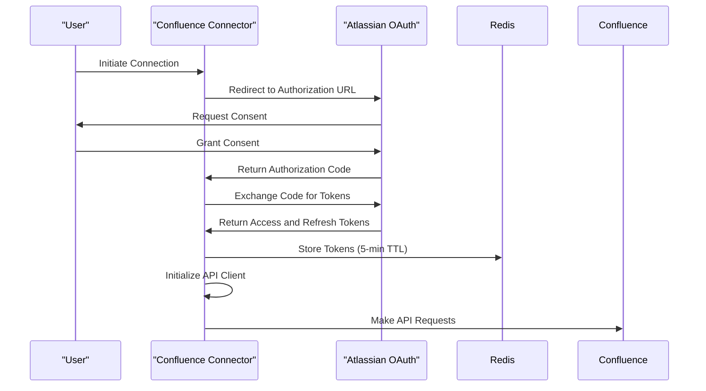
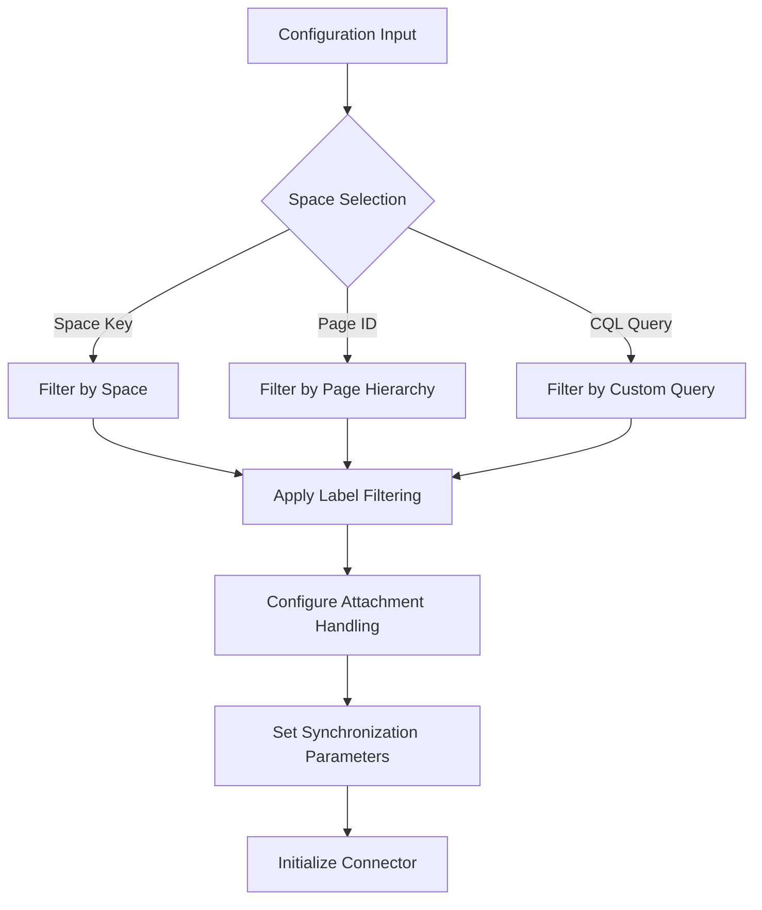
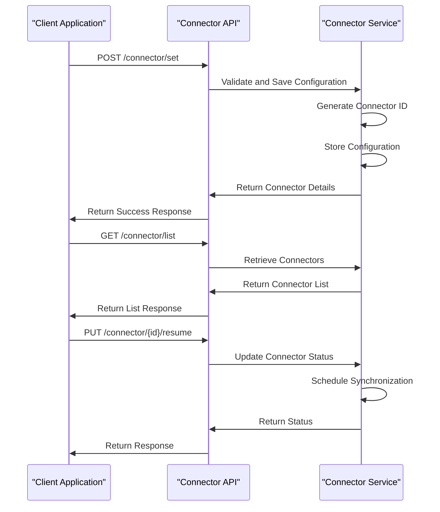
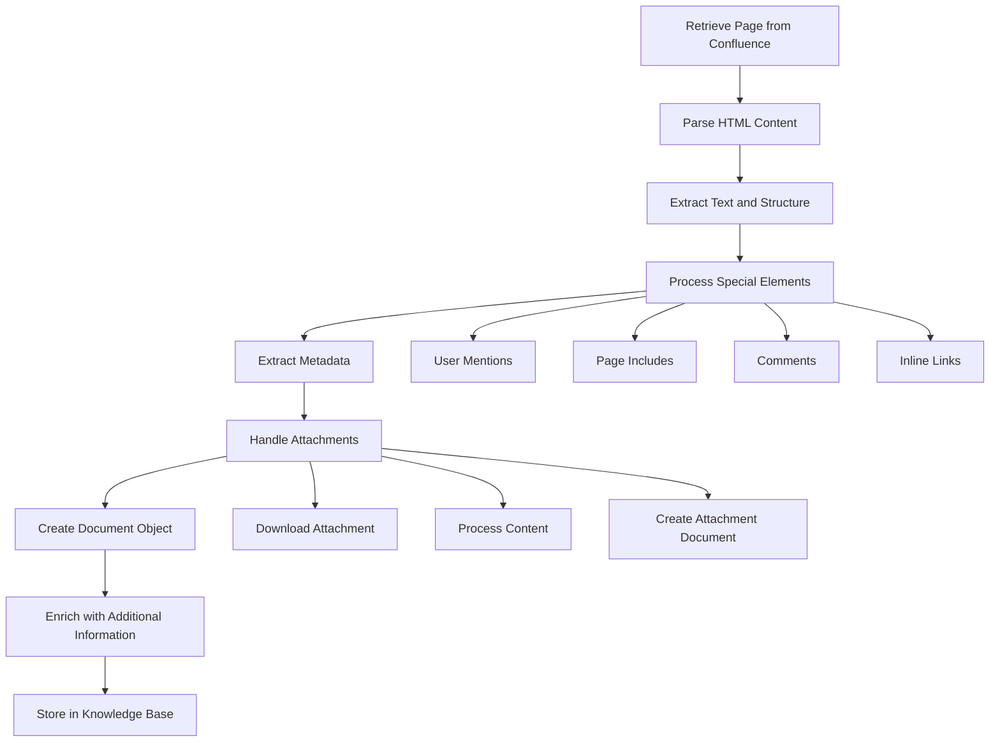
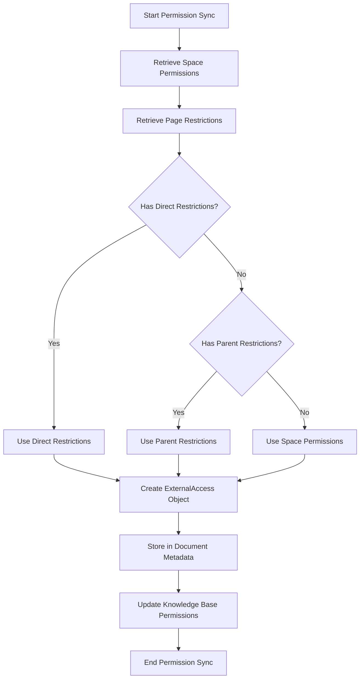
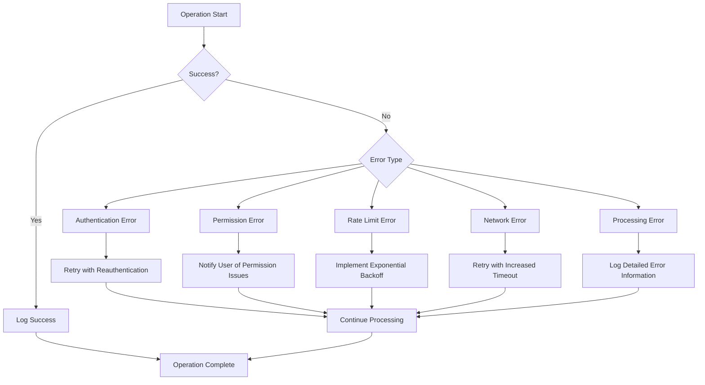
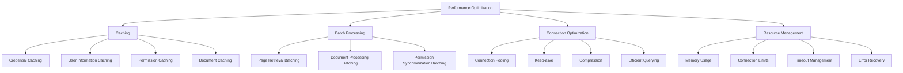

# Confluence Connector

<cite>
**Referenced Files in This Document**   
- [confluence_connector.py](file://common/data_source/confluence_connector.py)
- [connector_app.py](file://api/apps/connector_app.py)
- [connector_service.py](file://api/db/services/connector_service.py)
- [config.py](file://common/data_source/config.py)
- [interfaces.py](file://common/data_source/interfaces.py)
- [models.py](file://common/data_source/models.py)
- [html_utils.py](file://common/data_source/html_utils.py)
- [utils.py](file://common/data_source/utils.py)
</cite>

## Table of Contents
1. [Introduction](#introduction)
2. [Authentication Mechanisms](#authentication-mechanisms)
3. [Configuration Options](#configuration-options)
4. [API Endpoints](#api-endpoints)
5. [Document Processing](#document-processing)
6. [Permission Synchronization](#permission-synchronization)
7. [Error Handling and Troubleshooting](#error-handling-and-troubleshooting)
8. [Performance Considerations](#performance-considerations)
9. [Conclusion](#conclusion)

## Introduction

The Confluence connector API enables integration with Confluence spaces and pages, allowing organizations to synchronize their Confluence content with knowledge bases. This documentation provides comprehensive details on the connector's architecture, authentication mechanisms, configuration options, and operational workflows. The connector supports both Confluence Cloud and Server instances, with robust features for handling large page hierarchies, attachments, and complex permission structures.

The connector operates as a checkpointed system that efficiently retrieves and processes Confluence content through the Confluence REST API. It implements sophisticated error handling, rate limiting, and retry mechanisms to ensure reliable synchronization even in challenging network conditions. The system is designed to handle various content types including pages, comments, and attachments while preserving document structure and metadata.

**Section sources**
- [confluence_connector.py](file://common/data_source/confluence_connector.py#L1-L2039)

## Authentication Mechanisms

The Confluence connector supports two primary authentication methods: API tokens and OAuth 2.0. Both methods are securely stored and managed within the system to ensure credential protection.

### API Token Authentication

For Confluence Cloud instances, the connector supports Personal Access Token (PAT) authentication. Users provide their Confluence username and access token, which are securely stored in the system. The connector uses these credentials to authenticate API requests to the Confluence Cloud instance.

For Confluence Server instances, the connector uses API tokens directly. The authentication process involves sending the token in the Authorization header of API requests. This method provides a straightforward way to authenticate without the complexity of OAuth flows.

### OAuth 2.0 Authentication

The connector implements OAuth 2.0 for secure authentication with Confluence Cloud. This method requires the following environment variables to be configured:

- `OAUTH_CONFLUENCE_CLOUD_CLIENT_ID`: The OAuth client ID for the Confluence Cloud application
- `OAUTH_CONFLUENCE_CLOUD_CLIENT_SECRET`: The OAuth client secret for the Confluence Cloud application

The OAuth 2.0 implementation follows the 3-legged OAuth flow:
1. The user initiates the connection process
2. The system redirects to Atlassian's authorization endpoint
3. After user consent, Atlassian redirects back with an authorization code
4. The system exchanges the authorization code for an access token and refresh token
5. The tokens are securely stored and used for API authentication

### Credential Management

Credentials are securely stored using Redis with a 5-minute TTL (time-to-live). This approach provides a balance between security and performance, allowing for credential rotation while minimizing the impact of token refresh operations.

The system implements automatic token refresh functionality. When using OAuth 2.0, the connector automatically refreshes access tokens halfway through their expiration period. This ensures that long-running synchronization processes maintain valid credentials without interruption.



**Diagram sources**
- [confluence_connector.py](file://common/data_source/confluence_connector.py#L73-L387)
- [utils.py](file://common/data_source/utils.py#L985-L1017)

**Section sources**
- [confluence_connector.py](file://common/data_source/confluence_connector.py#L73-L387)
- [config.py](file://common/data_source/config.py#L204-L211)
- [utils.py](file://common/data_source/utils.py#L985-L1017)

## Configuration Options

The Confluence connector provides extensive configuration options to customize the synchronization process according to specific requirements. These options can be categorized into space selection, filtering, attachment handling, and synchronization parameters.

### Space Selection and Page Filtering

The connector supports multiple methods for selecting which Confluence content to synchronize:

- **Space-based filtering**: Synchronize all pages within a specific space using the `space` parameter
- **Page-based filtering**: Synchronize a specific page and its descendants using the `page_id` parameter with `index_recursively=True`
- **CQL query filtering**: Use Confluence Query Language (CQL) to define complex filtering criteria with the `cql_query` parameter

The filtering system automatically constructs CQL queries based on the provided configuration. For example, when specifying a space key, the connector generates a CQL query like `type=page and space='SPACE_KEY'`. When using recursive page indexing, it creates queries that include both the specified page and its ancestors.

### Label-based Filtering

The connector supports label-based filtering to exclude pages with specific labels. This feature is particularly useful for avoiding synchronization of sensitive or confidential content. The `labels_to_skip` parameter accepts a list of label names that should be excluded from synchronization.

The system reads the `CONFLUENCE_CONNECTOR_LABELS_TO_SKIP` environment variable to determine which labels to skip. This allows administrators to configure label filtering at the system level without modifying individual connector configurations.

```python
# Example: Configuration for label-based filtering
labels_to_skip = ["confidential", "internal-only", "draft"]
```

### Attachment Handling

The connector provides comprehensive attachment handling with several configuration options:

- `CONFLUENCE_CONNECTOR_ATTACHMENT_SIZE_THRESHOLD`: Maximum size (in bytes) for attachments to be retrieved (default: 10MB)
- `CONFLUENCE_CONNECTOR_ATTACHMENT_CHAR_COUNT_THRESHOLD`: Maximum character count for processed attachments (default: 200,000 characters)
- `allow_images`: Boolean flag to control whether image attachments are processed

Attachments are processed separately from pages and indexed as individual documents. The connector supports various file types and uses appropriate processing methods based on the attachment's media type.

### Synchronization Parameters

Several parameters control the synchronization behavior:

- `batch_size`: Number of documents to process in each batch (default: defined by `INDEX_BATCH_SIZE`)
- `refresh_freq`: Frequency (in minutes) for checking for updates
- `prune_freq`: Frequency (in minutes) for removing outdated content
- `timeout_secs`: Maximum time (in seconds) for connector operations
- `time_buffer_seconds`: Time buffer (in seconds) to account for timezone differences and clock drift



**Diagram sources**
- [confluence_connector.py](file://common/data_source/confluence_connector.py#L1271-L1355)
- [config.py](file://common/data_source/config.py#L134-L154)

**Section sources**
- [confluence_connector.py](file://common/data_source/confluence_connector.py#L1271-L1355)
- [config.py](file://common/data_source/config.py#L134-L154)

## API Endpoints

The Confluence connector exposes several API endpoints for managing connectors, testing connectivity, and monitoring synchronization status.

### Connector Management Endpoints

#### Create or Update Connector
- **Endpoint**: `POST /connector/set`
- **Description**: Creates a new connector or updates an existing one
- **Request Body**:
  ```json
  {
    "id": "connector-id",
    "name": "Confluence Documentation",
    "source": "confluence",
    "config": {
      "wiki_base": "https://your-domain.atlassian.net/wiki",
      "is_cloud": true,
      "space": "DEV",
      "index_recursively": true
    },
    "refresh_freq": 30,
    "prune_freq": 720,
    "timeout_secs": 1740
  }
  ```
- **Response**: Returns the connector configuration with status information

#### List Connectors
- **Endpoint**: `GET /connector/list`
- **Description**: Retrieves a list of all connectors for the current user
- **Response**: Returns an array of connector objects with basic information

#### Get Connector Details
- **Endpoint**: `GET /connector/{connector_id}`
- **Description**: Retrieves detailed information about a specific connector
- **Response**: Returns the complete connector configuration

#### Delete Connector
- **Endpoint**: `POST /connector/{connector_id}/rm`
- **Description**: Deletes a connector and stops all associated synchronization tasks
- **Response**: Returns success status

### Synchronization Control Endpoints

#### Resume/Pause Synchronization
- **Endpoint**: `PUT /connector/{connector_id}/resume`
- **Description**: Resumes or pauses synchronization for a connector
- **Request Body**:
  ```json
  {
    "resume": true
  }
  ```
- **Response**: Returns success status

#### Rebuild Knowledge Base
- **Endpoint**: `PUT /connector/{connector_id}/rebuild`
- **Description**: Triggers a complete rebuild of the knowledge base from the connector
- **Request Body**:
  ```json
  {
    "kb_id": "knowledge-base-id"
  }
  ```
- **Response**: Returns success status or error message

### Monitoring Endpoints

#### View Synchronization Logs
- **Endpoint**: `GET /connector/{connector_id}/logs`
- **Description**: Retrieves synchronization logs for a connector
- **Query Parameters**:
  - `page`: Page number (default: 1)
  - `page_size`: Number of logs per page (default: 15)
- **Response**: Returns paginated logs with task status, timing, and error information



**Diagram sources**
- [connector_app.py](file://api/apps/connector_app.py#L38-L117)
- [connector_service.py](file://api/db/services/connector_service.py#L33-L80)

**Section sources**
- [connector_app.py](file://api/apps/connector_app.py#L38-L117)
- [connector_service.py](file://api/db/services/connector_service.py#L33-L80)

## Document Processing

The Confluence connector implements a sophisticated document processing pipeline that retrieves, parses, and enriches Confluence content for integration with knowledge bases.

### Page Retrieval and Parsing

The connector uses the Confluence REST API to retrieve pages through CQL (Confluence Query Language) queries. The retrieval process is paginated to handle large result sets efficiently. For each page, the connector:

1. Constructs a CQL query based on the configuration parameters
2. Retrieves pages in batches using the `paginated_cql_retrieval` method
3. Processes each page to extract content, metadata, and relationships

The parsing process converts Confluence's storage format to plain text while preserving document structure. The system handles various content elements including:

- Headings (h1, h2, h3, etc.)
- Lists (ordered and unordered)
- Tables
- Code blocks
- Inline links and macros

### HTML to Text Conversion

The connector uses BeautifulSoup to parse Confluence HTML content and convert it to structured text. The `format_document_soup` function implements the conversion logic, which:

- Preserves heading hierarchy
- Converts lists to markdown-style lists
- Formats tables with tab-separated values
- Handles inline elements like links and images
- Removes unnecessary whitespace and formatting

The system also handles special Confluence elements such as:
- User mentions (`@username`)
- Page includes (nested pages)
- Attachments
- Comments

### Metadata Extraction

For each document, the connector extracts and preserves comprehensive metadata:

- **Author information**: Display name, email, and user ID
- **Version information**: Last modified date and version number
- **Space information**: Space key and name
- **Labels**: All labels applied to the page
- **Permissions**: Read restrictions and access controls

The metadata is stored in the document object and made available for search and filtering in the knowledge base.

### Attachment Processing

Attachments are processed as separate documents with their own metadata. The connector:

1. Identifies attachments associated with each page
2. Downloads the attachment content
3. Processes the content based on file type
4. Creates a separate document entry for each attachment

Supported attachment types include:
- Documents (PDF, DOCX, etc.)
- Spreadsheets (XLSX, CSV, etc.)
- Presentations (PPTX, etc.)
- Images (when enabled)
- Text files

### Content Enrichment

The connector enriches the extracted content with additional information:

- **Semantic identifiers**: Page titles are used as semantic identifiers
- **Document hierarchy**: Parent-child relationships are preserved
- **Timestamps**: Creation and modification times are extracted
- **External links**: Links to other Confluence pages are resolved



**Diagram sources**
- [confluence_connector.py](file://common/data_source/confluence_connector.py#L1495-L1578)
- [html_utils.py](file://common/data_source/html_utils.py#L65-L159)

**Section sources**
- [confluence_connector.py](file://common/data_source/confluence_connector.py#L1495-L1578)
- [html_utils.py](file://common/data_source/html_utils.py#L65-L159)

## Permission Synchronization

The Confluence connector implements comprehensive permission synchronization to ensure that access controls are preserved when content is integrated with knowledge bases.

### Permission Model

The connector uses a permission model that captures both explicit page restrictions and inherited permissions from parent pages and spaces. The system represents permissions using the `ExternalAccess` class, which includes:

- **External user emails**: Emails of external users with access
- **External user group IDs**: Names or IDs of groups with access
- **Public status**: Whether the document is publicly accessible

### Space-Level Permissions

The connector retrieves space-level permissions using the `get_all_space_permissions` function. This function:
1. Retrieves all spaces accessible to the authenticated user
2. For each space, retrieves the space permissions
3. Maps the permissions to the `ExternalAccess` model
4. Caches the results to minimize API calls

Space-level permissions serve as the baseline for documents within the space, unless overridden by page-specific restrictions.

### Page-Level Restrictions

For each page, the connector retrieves restriction information through the Confluence REST API. The system checks:
- Direct read restrictions on the page
- Inherited restrictions from parent pages
- Space-level restrictions

The `get_page_restrictions` function combines these sources to determine the effective permissions for each page.

### Permission Inheritance

The connector handles permission inheritance according to Confluence's permission model:
1. Pages inherit permissions from their parent pages
2. If no explicit restrictions are set, pages inherit from the space
3. More restrictive permissions take precedence

The system implements this logic in the `get_external_access` function, which:
1. Checks for direct page restrictions
2. If none exist, checks parent page restrictions
3. If still none exist, uses space-level permissions

### Permission Synchronization Workflow

The permission synchronization process occurs in several stages:

1. **Initial synchronization**: When a connector is first created, all permissions are retrieved and stored
2. **Incremental updates**: During subsequent synchronizations, only changed permissions are updated
3. **Cache management**: Permission information is cached to reduce API calls and improve performance

The connector uses a slim document model (`SlimDocument`) for permission synchronization, which contains only the document ID and permission information. This allows for efficient permission updates without retrieving full document content.



**Diagram sources**
- [confluence_connector.py](file://common/data_source/confluence_connector.py#L1836-L1953)
- [models.py](file://common/data_source/models.py#L9-L37)

**Section sources**
- [confluence_connector.py](file://common/data_source/confluence_connector.py#L1836-L1953)
- [models.py](file://common/data_source/models.py#L9-L37)

## Error Handling and Troubleshooting

The Confluence connector implements comprehensive error handling and troubleshooting mechanisms to ensure reliable operation and facilitate issue resolution.

### Error Types and Handling

The connector defines several error types to handle different failure scenarios:

- **ConnectorMissingCredentialError**: Raised when required credentials are missing
- **ConnectorValidationError**: Raised when connector configuration is invalid
- **InsufficientPermissionsError**: Raised when the authenticated user lacks required permissions
- **CredentialExpiredError**: Raised when credentials have expired
- **UnexpectedValidationError**: Raised for unexpected validation errors
- **ConfluenceRateLimitError**: Raised when API rate limits are exceeded

The system handles these errors through appropriate retry mechanisms, user notifications, and logging.

### Rate Limiting and Retry Mechanisms

The connector implements sophisticated rate limiting and retry logic to handle API limitations:

- **Automatic rate limiting**: The system respects Confluence's rate limiting headers and adjusts request frequency accordingly
- **Exponential backoff**: Failed requests are retried with increasing delays between attempts
- **Maximum retries**: Configurable limit on retry attempts to prevent infinite loops
- **Timeout handling**: Operations that exceed the configured timeout are terminated

The `OnyxConfluence` class wraps all API calls with rate limiting logic that:
1. Monitors HTTP response codes and headers
2. Implements backoff strategies for 429 (Too Many Requests) responses
3. Handles connection timeouts and network errors
4. Retries failed operations with appropriate delays

### Common Issues and Solutions

#### API Rate Limiting
**Symptoms**: 429 HTTP status codes, slow synchronization, incomplete data retrieval
**Solutions**:
- Reduce the number of concurrent connectors
- Increase the refresh frequency to reduce API call frequency
- Implement request batching where possible
- Monitor API usage and adjust configuration accordingly

#### Permission Inheritance Issues
**Symptoms**: Incorrect access controls, missing content, permission errors
**Solutions**:
- Verify that the authenticated user has sufficient permissions
- Check space and page-level restrictions in Confluence
- Ensure the connector is configured to handle permission inheritance correctly
- Review the permission synchronization logs for errors

#### Large Page Hierarchy Processing
**Symptoms**: Timeout errors, memory issues, incomplete synchronization
**Solutions**:
- Increase the `timeout_secs` configuration parameter
- Reduce the `batch_size` to process fewer documents at a time
- Implement checkpointing to resume from the last successful point
- Monitor system resources and scale accordingly

#### Attachment Processing Failures
**Symptoms**: Missing attachments, processing errors, incomplete documents
**Solutions**:
- Verify that attachment file types are supported
- Check attachment size against the `CONFLUENCE_CONNECTOR_ATTACHMENT_SIZE_THRESHOLD`
- Ensure the authenticated user has permission to access attachments
- Review the attachment processing logs for specific errors

### Logging and Monitoring

The connector implements comprehensive logging to facilitate troubleshooting:

- **Operation logging**: Logs key operations and their status
- **Error logging**: Detailed error messages with stack traces
- **Performance logging**: Timing information for operations
- **Debug logging**: Detailed information for debugging complex issues

Logs are structured to include:
- Timestamp
- Log level
- Operation context
- Error details
- Request/response information (when appropriate)



**Diagram sources**
- [confluence_connector.py](file://common/data_source/confluence_connector.py#L59-L60)
- [exceptions.py](file://common/data_source/exceptions.py)

**Section sources**
- [confluence_connector.py](file://common/data_source/confluence_connector.py#L59-L60)
- [exceptions.py](file://common/data_source/exceptions.py)

## Performance Considerations

The Confluence connector is designed with performance optimization in mind to handle large-scale synchronization efficiently.

### Caching Strategies

The connector implements multiple caching layers to minimize API calls and improve performance:

- **Credential caching**: OAuth tokens are cached in Redis with a 5-minute TTL
- **User information caching**: User display names and emails are cached to avoid repeated API calls
- **Permission caching**: Space-level permissions are cached to reduce redundant queries
- **Document caching**: Recently processed documents are cached to support incremental updates

### Batch Processing

The connector uses batch processing to optimize API usage:
- **Page retrieval**: Pages are retrieved in batches using pagination
- **Document processing**: Documents are processed in batches to minimize overhead
- **Permission synchronization**: Permissions are synchronized in batches to reduce API calls

The `batch_size` parameter controls the number of items processed in each batch, allowing administrators to tune performance based on their specific requirements.

### Connection Optimization

The connector implements connection optimization techniques:
- **Connection pooling**: Reuses HTTP connections to reduce connection overhead
- **Keep-alive**: Maintains persistent connections to the Confluence API
- **Compression**: Uses HTTP compression to reduce data transfer size
- **Efficient querying**: Constructs optimized CQL queries to retrieve only necessary data

### Resource Management

The system manages resources efficiently to prevent memory leaks and ensure stable operation:
- **Memory usage**: Processes documents in a streaming fashion to minimize memory footprint
- **Connection limits**: Limits the number of concurrent connections to prevent resource exhaustion
- **Timeout management**: Implements appropriate timeouts to prevent hanging operations
- **Error recovery**: Gracefully handles errors and recovers without requiring restart

### Scalability Considerations

For large-scale deployments, consider the following scalability factors:
- **Horizontal scaling**: Deploy multiple connector instances to distribute the load
- **Database optimization**: Ensure the underlying database is properly indexed and optimized
- **Network bandwidth**: Ensure sufficient network bandwidth for data transfer
- **Storage capacity**: Plan for adequate storage capacity for synchronized content



**Diagram sources**
- [confluence_connector.py](file://common/data_source/confluence_connector.py#L498-L648)
- [utils.py](file://common/data_source/utils.py#L1039-L1054)

**Section sources**
- [confluence_connector.py](file://common/data_source/confluence_connector.py#L498-L648)
- [utils.py](file://common/data_source/utils.py#L1039-L1054)

## Conclusion

The Confluence connector provides a robust and flexible solution for integrating Confluence spaces and pages with knowledge bases. Its comprehensive feature set, including support for multiple authentication methods, extensive configuration options, and sophisticated document processing, makes it suitable for a wide range of use cases.

Key strengths of the connector include:
- **Security**: Secure credential storage and management with support for both API tokens and OAuth 2.0
- **Flexibility**: Extensive configuration options for space selection, filtering, and attachment handling
- **Reliability**: Robust error handling, rate limiting, and retry mechanisms
- **Performance**: Efficient batch processing, caching, and connection optimization
- **Comprehensiveness**: Full support for pages, comments, attachments, and permissions

The connector is designed to handle large page hierarchies and complex permission structures while preserving document structure and metadata. Its modular architecture and well-defined interfaces make it easy to extend and customize for specific requirements.

For optimal results, administrators should:
1. Carefully configure authentication and permissions
2. Tune performance parameters based on their specific environment
3. Monitor synchronization logs for issues
4. Regularly review and update connector configurations

The Confluence connector enables organizations to leverage their existing Confluence content in knowledge bases, improving information accessibility and collaboration across teams.

[No sources needed since this section summarizes without analyzing specific files]