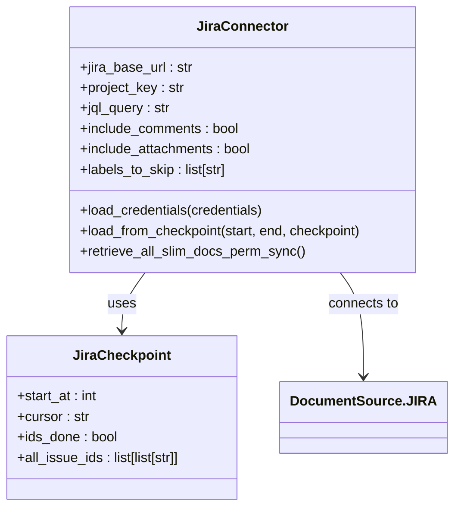

# Data Connector API

<cite>
**Referenced Files in This Document**   
- [connector_app.py](file://api/apps/connector_app.py)
- [interfaces.py](file://common/data_source/interfaces.py)
- [models.py](file://common/data_source/models.py)
- [google_drive/connector.py](file://common/data_source/google_drive/connector.py)
- [jira/connector.py](file://common/data_source/jira/connector.py)
- [confluence_connector.py](file://common/data_source/confluence_connector.py)
- [slack_connector.py](file://common/data_source/slack_connector.py)
- [config.py](file://common/data_source/config.py)
- [google_util/auth.py](file://common/data_source/google_util/auth.py)
</cite>

## Table of Contents
1. [Introduction](#introduction)
2. [Connector Management Endpoints](#connector-management-endpoints)
3. [Authentication Mechanisms](#authentication-mechanisms)
4. [Connector Configuration Options](#connector-configuration-options)
5. [Synchronization Operations](#synchronization-operations)
6. [Connector-Specific Implementations](#connector-specific-implementations)
7. [Data Processing and Integration](#data-processing-and-integration)
8. [Troubleshooting Common Issues](#troubleshooting-common-issues)
9. [Conclusion](#conclusion)

## Introduction
The RAGFlow Data Connector API provides a comprehensive interface for integrating external data sources into knowledge bases. This API enables the creation, management, and synchronization of connectors to various data platforms including Google Drive, Jira, Confluence, Slack, and others. The system supports multiple authentication methods such as OAuth, API keys, and service accounts to securely access external services. Connectors can be configured with specific parameters for data filtering, sync frequency, and field mapping to tailor the integration to specific requirements. The API also provides operations for testing connectivity, initiating synchronization jobs, and monitoring sync status to ensure reliable data integration.

**Section sources**
- [connector_app.py](file://api/apps/connector_app.py#L38-L117)

## Connector Management Endpoints
The connector management API provides endpoints for creating, retrieving, listing, and deleting connectors. The `/set` endpoint creates or updates a connector with specified configuration parameters including name, source type, refresh frequency, and pruning frequency. The `/list` endpoint retrieves all connectors for the current user, while the `/\<connector_id\>` endpoint gets a specific connector by ID. Connectors can be resumed or paused using the `/\<connector_id\>/resume` endpoint, and synchronization can be rebuilt with the `/\<connector_id\>/rebuild` endpoint when integrating with knowledge bases. The `/\<connector_id\>/rm` endpoint removes a connector from the system.

**Diagram sources**
- [connector_app.py](file://api/apps/connector_app.py#L38-L117)

**Section sources**
- [connector_app.py](file://api/apps/connector_app.py#L38-L117)

## Authentication Mechanisms
RAGFlow supports multiple authentication methods for connecting to external data sources. For Google services like Google Drive and Gmail, OAuth 2.0 is used with both web-based and service account authentication. The OAuth flow begins with the `/google/oauth/web/start` endpoint which initiates the authorization process by returning an authorization URL. After user consent, Google redirects to callback endpoints (`/google-drive/oauth/web/callback` or `/gmail/oauth/web/callback`) which exchange the authorization code for access tokens. These tokens are securely stored and refreshed automatically when expired.

For Jira, authentication can be performed using API tokens, username/password credentials, or scoped tokens for Atlassian Cloud. Confluence supports both personal access tokens and OAuth 2.0 with refresh token rotation. Slack connectors use bot tokens for API access, while other services may use API keys or service account credentials. All credentials are validated during connector setup to ensure proper access to the external service.

**Diagram sources**
- [connector_app.py](file://api/apps/connector_app.py#L193-L391)
- [google_util/auth.py](file://common/data_source/google_util/auth.py#L37-L127)

**Section sources**
- [connector_app.py](file://api/apps/connector_app.py#L193-L391)
- [google_util/auth.py](file://common/data_source/google_util/auth.py#L37-L127)

## Connector Configuration Options
Connectors can be configured with various options to control data synchronization behavior. The configuration includes sync frequency (refresh_freq) which determines how often the connector checks for updates, and pruning frequency (prune_freq) which controls how often old data is removed. Each connector type has specific configuration parameters:

For Google Drive connectors, configuration includes options to include shared drives, my drives, and files shared with me, along with specific folder or drive URLs to index. Jira connectors can be configured with JQL queries, project keys, and labels to skip. Confluence connectors support CQL queries, space keys, and labels to exclude. Slack connectors allow specifying channels by name or regex pattern.

Additional configuration options include timeout settings, batch sizes for data retrieval, and size thresholds for file processing. These settings can be adjusted to optimize performance and resource usage based on the specific integration requirements and data volume.

**Section sources**
- [google_drive/connector.py](file://common/data_source/google_drive/connector.py#L112-L167)
- [jira/connector.py](file://common/data_source/jira/connector.py#L85-L117)
- [confluence_connector.py](file://common/data_source/confluence_connector.py#L104-L125)
- [slack_connector.py](file://common/data_source/slack_connector.py#L472-L484)

## Synchronization Operations
The synchronization system provides comprehensive operations for managing data sync jobs. The `/\<connector_id\>/logs` endpoint retrieves synchronization logs with pagination support, showing the status and results of previous sync operations. Connectors can be paused and resumed using the `/\<connector_id\>/resume` endpoint, allowing administrators to control when synchronization occurs.

Synchronization jobs are scheduled based on the configured refresh frequency and run as background tasks. The system maintains checkpoints to track sync progress and ensure data consistency across runs. When rebuilding a knowledge base integration with the `/\<connector_id\>/rebuild` endpoint, the system reprocesses all data from the connected source. Sync status is monitored through task statuses including SCHEDULE, RUNNING, SUCCESS, and FAILED, providing visibility into the synchronization process.

**Section sources**
- [connector_app.py](file://api/apps/connector_app.py#L82-L87)
- [connector_app.py](file://api/apps/connector_app.py#L90-L98)
- [connector_app.py](file://api/apps/connector_app.py#L101-L109)

## Connector-Specific Implementations

### Google Drive Connector
The Google Drive connector implements a comprehensive synchronization system that can index files from shared drives, personal drives, and folders shared with users. It supports both OAuth user authentication and service account impersonation for accessing organizational data. The connector handles large datasets through batched retrieval with configurable page sizes and maintains synchronization state through checkpoints that track processed files and folders.

**Diagram sources**
- [google_drive/connector.py](file://common/data_source/google_drive/connector.py#L112-L800)

**Section sources**
- [google_drive/connector.py](file://common/data_source/google_drive/connector.py#L112-L800)

### Jira Connector
The Jira connector retrieves issues and converts them to markdown documents with comprehensive metadata. It supports both Jira Cloud and Server instances through a unified interface. Configuration includes JQL queries for filtering issues, project keys, and labels to skip. The connector handles large datasets through paginated retrieval and maintains synchronization state through checkpoints that track the last processed issue.

The connector extracts issue metadata including summary, description, status, priority, assignee, reporter, labels, and comments. Attachments can be optionally included in the synchronization. The system handles Jira's minute-level timestamp precision by implementing a time buffer to prevent missing recently updated issues during synchronization.

**Diagram sources**
- [jira/connector.py](file://common/data_source/jira/connector.py#L82-L800)

**Section sources**
- [jira/connector.py](file://common/data_source/jira/connector.py#L82-L800)

### Confluence Connector
The Confluence connector retrieves pages, blog posts, and attachments from Confluence spaces. It supports both personal access tokens and OAuth 2.0 authentication with automatic token refresh. The connector uses CQL (Confluence Query Language) for filtering content and can be configured to skip pages with specific labels or exclude archived content.

The system handles Confluence's rich content format by converting storage format to readable text while preserving structure. Permissions are synchronized to maintain access control in the knowledge base. The connector implements robust error handling for Confluence's rate limits and pagination issues, with retry mechanisms and fallback strategies for problematic API responses.

**Section sources**
- [confluence_connector.py](file://common/data_source/confluence_connector.py#L464-L800)

### Slack Connector
The Slack connector indexes messages from specified channels, converting threads into documents. It uses Slack bot tokens for API access and can be configured to include specific channels by name or regex pattern. The connector joins channels as needed to access message history and processes both standalone messages and threaded conversations.

Message filtering excludes bot messages and non-informative content like channel join/leave notifications. The system preserves message context by including sender information, timestamps, and message links. Threaded conversations are consolidated into single documents to maintain discussion context. User information is enriched with display names and profile details when available.

**Section sources**
- [slack_connector.py](file://common/data_source/slack_connector.py#L465-L600)

## Data Processing and Integration
Data from connectors is processed and integrated into knowledge bases through a standardized pipeline. Documents retrieved from external sources are converted to a common format with consistent metadata structure. The processing pipeline handles text extraction, metadata parsing, and content transformation to ensure uniform representation across different source types.

Documents include source-specific metadata such as issue keys for Jira, page IDs for Confluence, and message timestamps for Slack. This metadata is preserved to maintain context and enable溯源. The integration process handles various file types and content formats, extracting text from documents, presentations, and other supported formats using appropriate parsers.

The system supports incremental synchronization by tracking changes since the last sync, reducing processing overhead and bandwidth usage. Checkpoints maintain sync state across executions, ensuring data consistency and preventing duplication. Processed documents are indexed and made available for retrieval and analysis within the knowledge base.

**Section sources**
- [models.py](file://common/data_source/models.py#L88-L125)
- [interfaces.py](file://common/data_source/interfaces.py#L202-L295)

## Troubleshooting Common Issues

### Authentication Problems
Common authentication issues include invalid credentials, expired tokens, and insufficient permissions. For Google services, ensure the OAuth client configuration includes the required scopes and that the redirect URI is properly configured. For Jira and Confluence, verify that API tokens have the necessary permissions to access the requested resources.

Token expiration is handled automatically for most services, but initial setup requires valid credentials. If encountering permission errors, verify that the authenticated user or service account has sufficient access to the target resources. For service accounts, ensure domain-wide delegation is properly configured in the Google Admin console.

### Synchronization Failures
Synchronization failures can occur due to network issues, API rate limits, or data processing errors. The system implements retry mechanisms with exponential backoff for transient failures. For persistent issues, check the synchronization logs to identify the specific error and affected resources.

Large files or documents exceeding size thresholds may be skipped during processing. Adjust the connector-specific size thresholds in the configuration if needed. For connectors processing large datasets, consider adjusting batch sizes and timeout settings to accommodate the data volume.

### Configuration Errors
Configuration errors often result from invalid queries or incorrect parameter values. Validate JQL queries in Jira or CQL queries in Confluence directly in the respective platforms before using them in connectors. Ensure URLs, project keys, and other identifiers are correctly specified.

When configuring multiple data sources, verify that there are no conflicting settings that might cause unexpected behavior. Test new configurations with a small dataset before deploying to production. Use the connector validation features to verify connectivity and permissions before initiating full synchronization.

**Section sources**
- [exceptions.py](file://common/data_source/exceptions.py#L4-L30)
- [connector_app.py](file://api/apps/connector_app.py#L250-L256)
- [jira/connector.py](file://common/data_source/jira/connector.py#L195-L274)

## Conclusion
The RAGFlow Data Connector API provides a robust framework for integrating external data sources into knowledge bases. With support for multiple authentication methods, comprehensive configuration options, and reliable synchronization operations, the system enables seamless data integration from popular platforms like Google Drive, Jira, Confluence, and Slack. The modular connector architecture allows for easy extension to additional data sources while maintaining consistent data processing and integration patterns. By following the documented best practices and troubleshooting guidelines, organizations can effectively leverage external data to enhance their knowledge management capabilities.