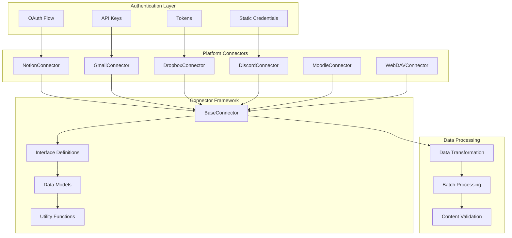
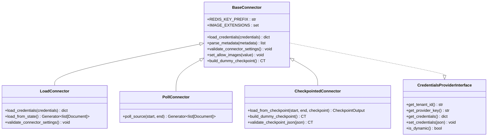
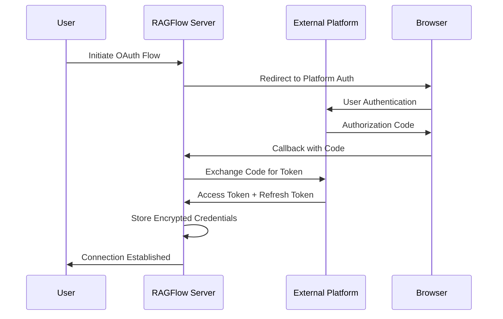
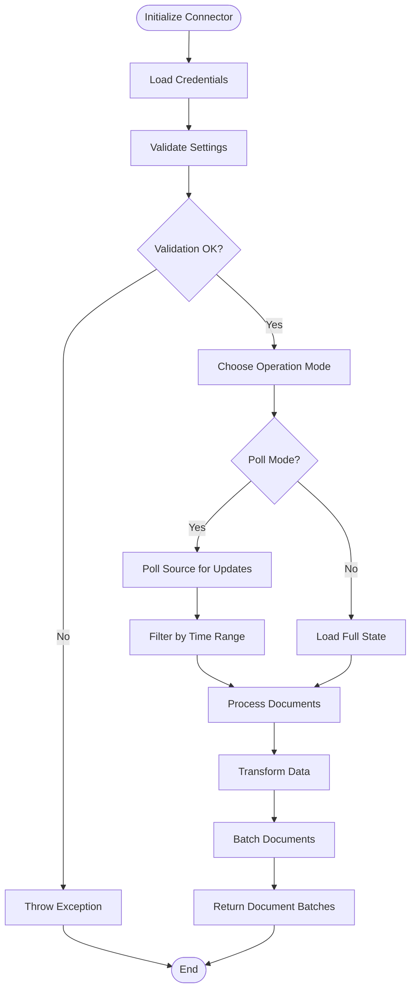
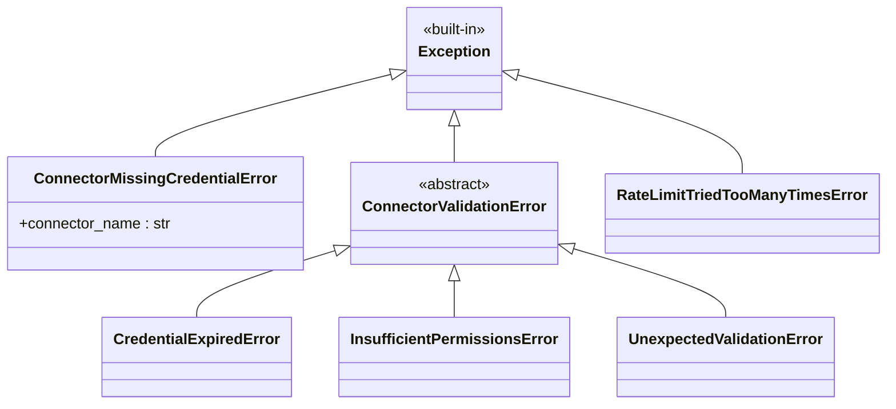

# Generic Connectors

<cite>
**Referenced Files in This Document**
- [interfaces.py](file://common/data_source/interfaces.py)
- [models.py](file://common/data_source/models.py)
- [config.py](file://common/data_source/config.py)
- [exceptions.py](file://common/data_source/exceptions.py)
- [utils.py](file://common/data_source/utils.py)
- [notion_connector.py](file://common/data_source/notion_connector.py)
- [gmail_connector.py](file://common/data_source/gmail_connector.py)
- [dropbox_connector.py](file://common/data_source/dropbox_connector.py)
- [discord_connector.py](file://common/data_source/discord_connector.py)
- [moodle_connector.py](file://common/data_source/moodle_connector.py)
- [webdav_connector.py](file://common/data_source/webdav_connector.py)
- [connector_app.py](file://api/apps/connector_app.py)
- [sync_data_source.py](file://rag/svr/sync_data_source.py)
</cite>

## Table of Contents
1. [Introduction](#introduction)
2. [Architecture Overview](#architecture-overview)
3. [Base Connector Interface](#base-connector-interface)
4. [Authentication Methods](#authentication-methods)
5. [Connector Implementation Patterns](#connector-implementation-patterns)
6. [Individual Connector Details](#individual-connector-details)
7. [Error Handling and Logging](#error-handling-and-logging)
8. [Configuration Management](#configuration-management)
9. [Common Features](#common-features)
10. [Troubleshooting Guide](#troubleshooting-guide)
11. [Best Practices](#best-practices)

## Introduction

RAGFlow's generic data source connectors provide a unified framework for integrating with various external platforms including Dropbox, Gmail, Moodle, Notion, SharePoint, Microsoft Teams, WebDAV, and Discord. These connectors enable seamless data ingestion from diverse sources into knowledge bases, supporting multiple authentication methods and providing robust error handling capabilities.

The connector architecture follows a modular design pattern where each platform-specific connector implements standardized interfaces while maintaining platform-specific optimizations for data retrieval and processing.

## Architecture Overview

The connector system is built around several key architectural components that work together to provide a consistent interface across all supported platforms:



**Diagram sources**
- [interfaces.py](file://common/data_source/interfaces.py#L202-L412)
- [models.py](file://common/data_source/models.py#L88-L310)
- [utils.py](file://common/data_source/utils.py#L1-L800)

**Section sources**
- [interfaces.py](file://common/data_source/interfaces.py#L202-L412)
- [models.py](file://common/data_source/models.py#L1-L310)

## Base Connector Interface

The foundation of all connectors is the `BaseConnector` class, which defines the core interface and common functionality:

### Core Interface Classes

The connector system defines several specialized interface classes:



**Diagram sources**
- [interfaces.py](file://common/data_source/interfaces.py#L202-L310)

### Document Model

All connectors produce documents conforming to a standardized model:

| Field | Type | Description |
|-------|------|-------------|
| id | str | Unique document identifier |
| source | str | Source platform identifier |
| semantic_identifier | str | Human-readable title/identifier |
| extension | str | File extension |
| blob | bytes | Binary content |
| doc_updated_at | datetime | Last modification timestamp |
| size_bytes | int | Content size in bytes |
| metadata | dict | Additional metadata |

**Section sources**
- [interfaces.py](file://common/data_source/interfaces.py#L202-L412)
- [models.py](file://common/data_source/models.py#L88-L100)

## Authentication Methods

RAGFlow supports multiple authentication methods depending on the platform requirements:

### OAuth 2.0 Flow

For platforms requiring user consent and token management:



**Diagram sources**
- [connector_app.py](file://api/apps/connector_app.py#L193-L392)

### API Keys and Tokens

Direct authentication using API keys or bearer tokens:

| Platform | Authentication Method | Required Scopes |
|----------|----------------------|-----------------|
| Notion | Integration Token | `read_content`, `edit_content` |
| Dropbox | Access Token | `files.content.write`, `files.content.read` |
| Discord | Bot Token | `bot`, `messages.read` |
| WebDAV | Username/Password | Read/Write access to specified path |

### Static Credentials

For platforms with persistent authentication:

```python
# Example: Static credentials configuration
credentials = {
    "notion_integration_token": "secret_xxx",
    "dropbox_access_token": "sl.xxxx",
    "discord_bot_token": "MTIzNDU2Nzg5MDAwMDAwMDAw.W5XXXX"
}
```

**Section sources**
- [connector_app.py](file://api/apps/connector_app.py#L193-L392)
- [notion_connector.py](file://common/data_source/notion_connector.py#L499-L502)
- [dropbox_connector.py](file://common/data_source/dropbox_connector.py#L31-L38)

## Connector Implementation Patterns

### Common Implementation Structure

All connectors follow a consistent implementation pattern:



**Diagram sources**
- [interfaces.py](file://common/data_source/interfaces.py#L202-L310)

### Data Processing Pipeline

Each connector implements a standardized data processing pipeline:

1. **Source Retrieval**: Fetch data from external platform APIs
2. **Content Extraction**: Parse and extract meaningful content
3. **Metadata Enrichment**: Add contextual metadata
4. **Format Normalization**: Standardize document format
5. **Batch Assembly**: Group documents for efficient processing

**Section sources**
- [utils.py](file://common/data_source/utils.py#L794-L800)
- [interfaces.py](file://common/data_source/interfaces.py#L202-L310)

## Individual Connector Details

### Notion Connector

**Authentication**: Integration Token with workspace access

**Supported Data Types**:
- Pages and databases
- Rich text content with formatting
- Embedded media files
- Tables and lists
- Mentions and links

**Configuration Parameters**:
```python
config = {
    "batch_size": 2,
    "recursive_index_enabled": True,
    "root_page_id": "page-id-here"
}
```

**Example Setup**:
```python
# Configure Notion connector
connector = NotionConnector(
    batch_size=5,
    recursive_index_enabled=True,
    root_page_id="your-root-page-id"
)

# Load credentials
connector.load_credentials({
    "notion_integration_token": "secret_xxx"
})

# Sync specific pages
document_batches = connector.load_from_state()
```

**Section sources**
- [notion_connector.py](file://common/data_source/notion_connector.py#L46-L60)
- [notion_connector.py](file://common/data_source/notion_connector.py#L499-L502)

### Gmail Connector

**Authentication**: OAuth 2.0 with Google Workspace domain

**Supported Data Types**:
- Email threads and individual messages
- Attachments and inline content
- Thread conversations
- Metadata (sender, recipients, subject, date)

**Configuration Parameters**:
```python
config = {
    "batch_size": 10,
    "credentials": {
        "primary_admin_email": "admin@example.com",
        "client_id": "xxx.apps.googleusercontent.com",
        "client_secret": "xxx",
        "refresh_token": "xxx"
    }
}
```

**Example Setup**:
```python
# Configure Gmail connector
connector = GmailConnector(batch_size=10)

# Load OAuth credentials
credentials = {
    "primary_admin_email": "admin@example.com",
    "client_id": "xxx.apps.googleusercontent.com",
    "client_secret": "xxx",
    "refresh_token": "xxx"
}

connector.load_credentials(credentials)

# Poll recent emails
documents = connector.poll_source(
    start=time.time() - 24*3600,  # 24 hours ago
    end=time.time()
)
```

**Section sources**
- [gmail_connector.py](file://common/data_source/gmail_connector.py#L145-L152)
- [gmail_connector.py](file://common/data_source/gmail_connector.py#L174-L183)

### Dropbox Connector

**Authentication**: Personal access token

**Supported Data Types**:
- Files and folders
- File metadata and properties
- Binary content
- Folder structures

**Configuration Parameters**:
```python
config = {
    "batch_size": 2,
    "credentials": {
        "dropbox_access_token": "sl.xxxx"
    }
}
```

**Example Setup**:
```python
# Configure Dropbox connector
connector = DropboxConnector(batch_size=5)

# Load access token
connector.load_credentials({
    "dropbox_access_token": "sl.xxxx"
})

# Sync all files
documents = connector.load_from_state()
```

**Section sources**
- [dropbox_connector.py](file://common/data_source/dropbox_connector.py#L27-L38)
- [dropbox_connector.py](file://common/data_source/dropbox_connector.py#L31-L38)

### Discord Connector

**Authentication**: Bot token with appropriate permissions

**Supported Data Types**:
- Messages and threads
- Channel and server information
- User mentions and reactions
- Embeds and attachments

**Configuration Parameters**:
```python
config = {
    "batch_size": 10,
    "server_ids": ["123456789"],
    "channel_names": ["general", "announcements"],
    "start_date": "2024-01-01"
}
```

**Example Setup**:
```python
# Configure Discord connector
connector = DiscordConnector(
    server_ids=["123456789"],
    channel_names=["general"],
    start_date="2024-01-01",
    batch_size=10
)

# Load bot token
connector.load_credentials({
    "discord_bot_token": "MTIzNDU2Nzg5MDAwMDAwMDAw.W5XXXX"
})

# Poll recent messages
documents = connector.poll_source(
    start=time.time() - 7*24*3600,  # 7 days ago
    end=time.time()
)
```

**Section sources**
- [discord_connector.py](file://common/data_source/discord_connector.py#L231-L247)
- [discord_connector.py](file://common/data_source/discord_connector.py#L299-L301)

### Moodle Connector

**Authentication**: Web service token

**Supported Data Types**:
- Course content (resources, assignments, forums)
- Pages and books
- Forum discussions
- Activity descriptions

**Configuration Parameters**:
```python
config = {
    "batch_size": 5,
    "credentials": {
        "moodle_token": "your-web-service-token",
        "moodle_url": "https://your-moodle-site.com"
    }
}
```

**Example Setup**:
```python
# Configure Moodle connector
connector = MoodleConnector(
    moodle_url="https://your-moodle-site.com",
    batch_size=5
)

# Load credentials
connector.load_credentials({
    "moodle_token": "your-web-service-token",
    "moodle_url": "https://your-moodle-site.com"
})

# Sync course content
documents = connector.load_from_state()
```

**Section sources**
- [moodle_connector.py](file://common/data_source/moodle_connector.py#L31-L38)
- [moodle_connector.py](file://common/data_source/moodle_connector.py#L69-L84)

### WebDAV Connector

**Authentication**: Username and password

**Supported Data Types**:
- Files and directories
- File metadata
- Binary content
- Directory structures

**Configuration Parameters**:
```python
config = {
    "batch_size": 10,
    "base_url": "https://webdav.example.com",
    "remote_path": "/shared/documents",
    "credentials": {
        "username": "your-username",
        "password": "your-password"
    }
}
```

**Example Setup**:
```python
# Configure WebDAV connector
connector = WebDAVConnector(
    base_url="https://webdav.example.com",
    remote_path="/shared/documents",
    batch_size=10
)

# Load credentials
connector.load_credentials({
    "username": "your-username",
    "password": "your-password"
})

# Sync files
documents = connector.load_from_state()
```

**Section sources**
- [webdav_connector.py](file://common/data_source/webdav_connector.py#L26-L51)
- [webdav_connector.py](file://common/data_source/webdav_connector.py#L57-L95)

## Error Handling and Logging

### Exception Hierarchy

The connector system implements a comprehensive exception hierarchy for different error scenarios:



**Diagram sources**
- [exceptions.py](file://common/data_source/exceptions.py#L1-L30)

### Error Handling Patterns

Connectors implement standardized error handling patterns:

1. **Authentication Failures**: Throw `ConnectorMissingCredentialError` or `CredentialExpiredError`
2. **Permission Issues**: Throw `InsufficientPermissionsError`
3. **Rate Limiting**: Automatic retry with exponential backoff
4. **Network Issues**: Retry with configurable attempts
5. **Validation Errors**: Throw `ConnectorValidationError`

### Logging Infrastructure

The system provides comprehensive logging capabilities:

```python
# Example logging patterns in connectors
logging.debug(f"[Notion]: Fetching page for ID {page_id}")
logging.info(f"[Discord]: Found {len(filtered_channels)} channels for the authenticated user")
logging.warning(f"[WebDAV]: Failed to connect to WebDAV server: {e}")
logging.error(f"[Moodle]: Failed to fetch courses: {e}")
```

**Section sources**
- [exceptions.py](file://common/data_source/exceptions.py#L1-L30)
- [utils.py](file://common/data_source/utils.py#L112-L158)

## Configuration Management

### Connector Configuration Structure

Each connector accepts a standardized configuration format:

```python
connector_config = {
    "name": "My Connector",
    "source": "notion",
    "config": {
        "batch_size": 5,
        "credentials": {...},
        "additional_params": {...}
    },
    "refresh_freq": 30,
    "prune_freq": 720,
    "timeout_secs": 1740
}
```

### Environment Variables

Key environment variables for connector configuration:

| Variable | Purpose | Example |
|----------|---------|---------|
| `NOTION_INTEGRATION_TOKEN` | Notion API token | `secret_xxx` |
| `DROPBOX_ACCESS_TOKEN` | Dropbox access token | `sl.xxxx` |
| `DISCORD_BOT_TOKEN` | Discord bot token | `MTIzNDU2Nzg5MDAwMDAwMDAw.W5XXXX` |
| `MOODLE_TOKEN` | Moodle web service token | `your-token-here` |
| `WEBDAV_USERNAME` | WebDAV username | `username` |
| `WEBDAV_PASSWORD` | WebDAV password | `password` |

### Dynamic Configuration Updates

Connectors support dynamic configuration updates through the API:

```python
# Update connector configuration
await connector_service.update_config(connector_id, {
    "config": {
        "credentials": new_credentials,
        "batch_size": 10
    }
})
```

**Section sources**
- [connector_app.py](file://api/apps/connector_app.py#L38-L64)
- [config.py](file://common/data_source/config.py#L1-L272)

## Common Features

### Batch Processing

All connectors support batch processing for efficient data handling:

```python
# Batch size configuration
BATCH_SIZES = {
    "notion": 2,
    "gmail": 10,
    "dropbox": 2,
    "discord": 10,
    "moodle": 5,
    "webdav": 10
}
```

### Time-Based Filtering

Connectors support time-based filtering for incremental synchronization:

```python
# Poll for updates within time range
documents = connector.poll_source(
    start=time.time() - 24*3600,  # 24 hours ago
    end=time.time()
)
```

### Content Validation

Built-in content validation ensures data quality:

```python
# Content validation examples
def validate_content(content: str) -> bool:
    return len(content.strip()) > 0 and not contains_sensitive_data(content)
```

### Rate Limiting

Automatic rate limiting prevents API quota exhaustion:

```python
# Rate limiting with exponential backoff
@retry(tries=3, delay=1, backoff=2)
def api_call():
    # API call implementation
    pass
```

**Section sources**
- [config.py](file://common/data_source/config.py#L1-L272)
- [utils.py](file://common/data_source/utils.py#L112-L158)

## Troubleshooting Guide

### Common Issues and Solutions

#### Authentication Problems

**Problem**: `ConnectorMissingCredentialError`
**Solution**: Verify credentials are correctly configured and not expired.

**Problem**: `CredentialExpiredError`
**Solution**: Refresh OAuth tokens or update API keys.

#### Permission Issues

**Problem**: `InsufficientPermissionsError`
**Solution**: Check platform permissions and ensure required scopes are granted.

#### Network Connectivity

**Problem**: Connection timeouts or network errors
**Solution**: Verify network connectivity and firewall settings.

#### Rate Limiting

**Problem**: `RateLimitTriedTooManyTimesError`
**Solution**: Reduce batch sizes or increase timeout settings.

### Debugging Tools

#### Enable Debug Logging

```python
import logging
logging.basicConfig(level=logging.DEBUG)
```

#### Test Connection

```python
# Test connector configuration
try:
    connector.validate_connector_settings()
    print("Connection successful")
except Exception as e:
    print(f"Connection failed: {e}")
```

#### Monitor Sync Logs

```python
# View sync logs
logs = connector_service.get_sync_logs(connector_id)
for log in logs:
    print(f"Status: {log.status}, Error: {log.error_msg}")
```

**Section sources**
- [exceptions.py](file://common/data_source/exceptions.py#L1-L30)
- [sync_data_source.py](file://rag/svr/sync_data_source.py#L106-L268)

## Best Practices

### Security Considerations

1. **Credential Storage**: Store credentials securely using encryption
2. **Scope Minimization**: Request only necessary permissions
3. **Token Rotation**: Implement automatic token refresh
4. **Audit Logging**: Log all authentication events

### Performance Optimization

1. **Batch Size Tuning**: Optimize batch sizes for each platform
2. **Incremental Sync**: Use time-based filtering for partial updates
3. **Parallel Processing**: Leverage concurrent processing where possible
4. **Caching**: Implement intelligent caching strategies

### Monitoring and Maintenance

1. **Health Checks**: Regularly validate connector health
2. **Error Tracking**: Monitor and alert on connector failures
3. **Performance Metrics**: Track sync performance and latency
4. **Capacity Planning**: Monitor resource usage and scale accordingly

### Development Guidelines

1. **Interface Compliance**: Always implement required interfaces
2. **Error Handling**: Provide meaningful error messages
3. **Documentation**: Document platform-specific requirements
4. **Testing**: Implement comprehensive unit and integration tests