# Google Drive Connector API Documentation

<cite>
**Referenced Files in This Document**
- [connector.py](file://common/data_source/google_drive/connector.py)
- [model.py](file://common/data_source/google_drive/model.py)
- [doc_conversion.py](file://common/data_source/google_drive/doc_conversion.py)
- [file_retrieval.py](file://common/data_source/google_drive/file_retrieval.py)
- [section_extraction.py](file://common/data_source/google_drive/section_extraction.py)
- [oauth_flow.py](file://common/data_source/google_util/oauth_flow.py)
- [auth.py](file://common/data_source/google_util/auth.py)
- [constant.py](file://common/data_source/google_util/constant.py)
- [connector_app.py](file://api/apps/connector_app.py)
- [config.py](file://common/data_source/config.py)
- [util.py](file://common/data_source/google_util/util.py)
- [interfaces.py](file://common/data_source/interfaces.py)
</cite>

## Table of Contents
1. [Introduction](#introduction)
2. [Architecture Overview](#architecture-overview)
3. [OAuth 2.0 Authentication Flow](#oauth-20-authentication-flow)
4. [Configuration Options](#configuration-options)
5. [Endpoints and API Integration](#endpoints-and-api-integration)
6. [Document Retrieval and Conversion](#document-retrieval-and-conversion)
7. [Permission Handling and Access Control](#permission-handling-and-access-control)
8. [Rate Limiting and Error Handling](#rate-limiting-and-error-handling)
9. [Knowledge Base Integration](#knowledge-base-integration)
10. [Troubleshooting Guide](#troubleshooting-guide)
11. [Best Practices](#best-practices)

## Introduction

The Google Drive Connector API provides secure integration capabilities for accessing and synchronizing documents from Google Drive accounts. This comprehensive system supports both OAuth 2.0 authentication flows and service account authentication, enabling flexible access patterns for different organizational needs. The connector seamlessly converts native Google formats (Docs, Sheets, Slides) to plain text or HTML while preserving metadata and maintaining strict permission controls.

The connector operates through a sophisticated multi-stage retrieval process that handles various Google Drive structures including My Drives, Shared Drives, and specific folders. It implements intelligent caching, checkpointing, and parallel processing to ensure efficient large-scale document synchronization.

## Architecture Overview

The Google Drive connector follows a modular architecture designed for scalability and reliability:

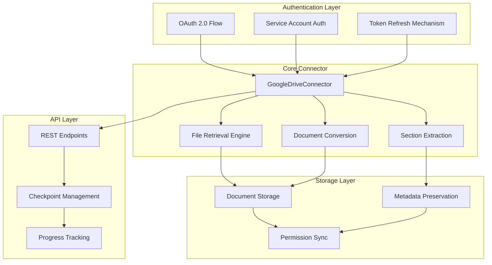

**Diagram sources**
- [connector.py](file://common/data_source/google_drive/connector.py#L112-L1258)
- [auth.py](file://common/data_source/google_util/auth.py#L37-L158)

**Section sources**
- [connector.py](file://common/data_source/google_drive/connector.py#L112-L214)
- [interfaces.py](file://common/data_source/interfaces.py#L202-L412)

## OAuth 2.0 Authentication Flow

The Google Drive connector supports two primary authentication methods: OAuth 2.0 interactive flow and service account authentication. Both methods ensure secure access to Google Drive resources while maintaining proper token management and refresh mechanisms.

### OAuth 2.0 Interactive Flow

The OAuth flow provides user-centric authentication with granular permission control:

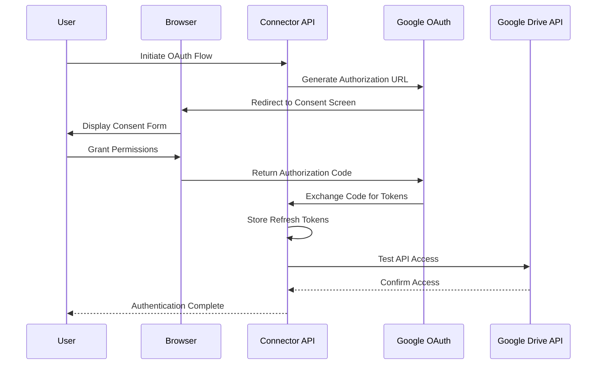

**Diagram sources**
- [oauth_flow.py](file://common/data_source/google_util/oauth_flow.py#L52-L122)
- [connector_app.py](file://api/apps/connector_app.py#L193-L392)

### Service Account Authentication

Service account authentication enables automated, programmatic access without user interaction:

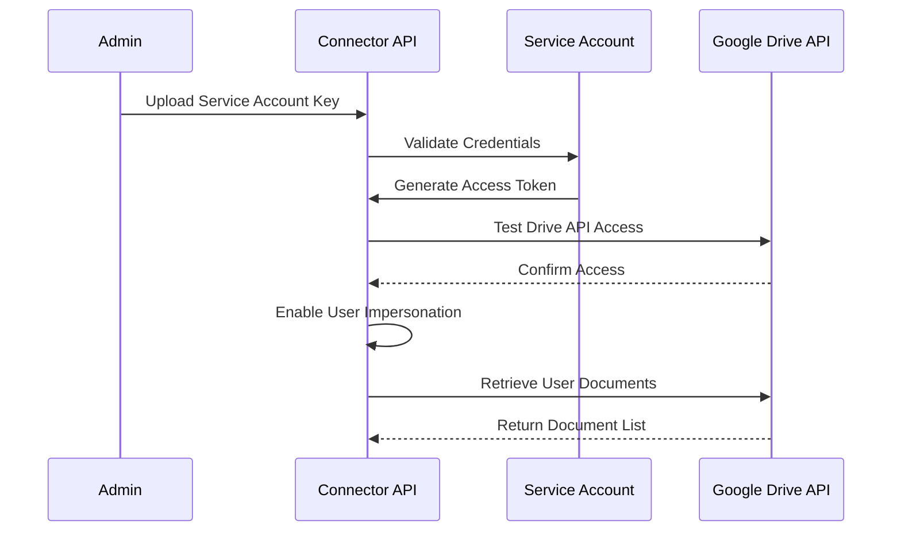

**Diagram sources**
- [auth.py](file://common/data_source/google_util/auth.py#L110-L158)
- [connector.py](file://common/data_source/google_drive/connector.py#L193-L213)

### Scope Requirements

The connector requires specific OAuth scopes for proper functionality:

| Scope | Purpose | Description |
|-------|---------|-------------|
| `https://www.googleapis.com/auth/drive.readonly` | Basic Drive Access | Allows reading of files and metadata |
| `https://www.googleapis.com/auth/drive.metadata.readonly` | Metadata Access | Enables retrieval of file properties |
| `https://www.googleapis.com/auth/admin.directory.user.readonly` | User Management | Required for service account impersonation |
| `https://www.googleapis.com/auth/admin.directory.group.readonly` | Group Management | Needed for group-based access control |

**Section sources**
- [constant.py](file://common/data_source/google_util/constant.py#L8-L18)
- [oauth_flow.py](file://common/data_source/google_util/oauth_flow.py#L10-L17)

### Token Management and Refresh

The authentication system implements robust token refresh mechanisms:

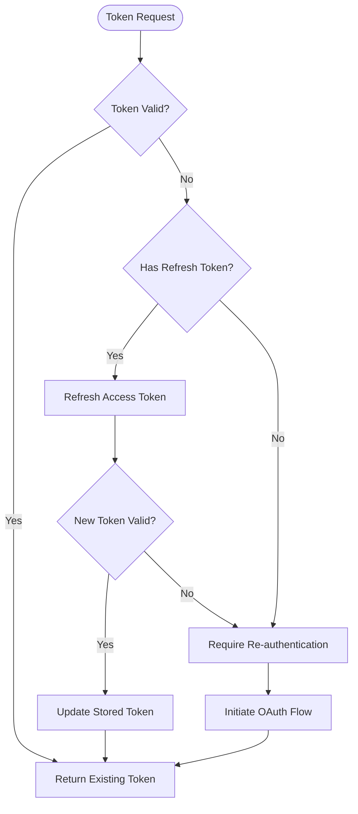

**Diagram sources**
- [auth.py](file://common/data_source/google_util/auth.py#L130-L158)
- [oauth_flow.py](file://common/data_source/google_util/oauth_flow.py#L107-L122)

**Section sources**
- [auth.py](file://common/data_source/google_util/auth.py#L37-L158)
- [oauth_flow.py](file://common/data_source/google_util/oauth_flow.py#L107-L122)

## Configuration Options

The Google Drive connector offers extensive configuration options to tailor access patterns to specific organizational needs:

### Basic Configuration Parameters

| Parameter | Type | Description | Default |
|-----------|------|-------------|---------|
| `include_shared_drives` | Boolean | Include all shared drives in the organization | `false` |
| `include_my_drives` | Boolean | Include personal drives of users | `false` |
| `include_files_shared_with_me` | Boolean | Include files shared directly with the user | `false` |
| `shared_drive_urls` | String | Comma-separated list of shared drive URLs | `null` |
| `my_drive_emails` | String | Comma-separated list of user emails for My Drive access | `null` |
| `shared_folder_urls` | String | Comma-separated list of specific folder URLs | `null` |
| `specific_user_emails` | String | Comma-separated list of specific user emails to impersonate | `null` |

### Advanced Configuration Options

| Parameter | Type | Description | Environment Variable |
|-----------|------|-------------|---------------------|
| `size_threshold` | Integer | Maximum file size in bytes (default: 10MB) | `GOOGLE_DRIVE_CONNECTOR_SIZE_THRESHOLD` |
| `allow_images` | Boolean | Enable image extraction from documents | - |
| `batch_size` | Integer | Number of documents processed per batch | `INDEX_BATCH_SIZE` |

### Folder Selection and Filtering

The connector supports sophisticated folder selection mechanisms:

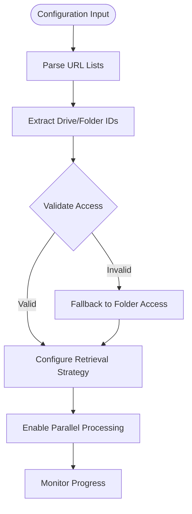

**Diagram sources**
- [connector.py](file://common/data_source/google_drive/connector.py#L62-L75)
- [file_retrieval.py](file://common/data_source/google_drive/file_retrieval.py#L58-L67)

**Section sources**
- [connector.py](file://common/data_source/google_drive/connector.py#L112-L141)
- [config.py](file://common/data_source/config.py#L184-L186)

## Endpoints and API Integration

The connector exposes REST endpoints for seamless integration with the RAGFlow platform:

### Connector Management Endpoints

| Endpoint | Method | Purpose | Parameters |
|----------|--------|---------|------------|
| `/connector/set` | POST | Create or update connector configuration | `id`, `name`, `source`, `config`, `refresh_freq` |
| `/connector/list` | GET | List all configured connectors | - |
| `/connector/<id>` | GET | Get specific connector details | - |
| `/connector/<id>/logs` | GET | View synchronization logs | `page`, `page_size` |
| `/connector/<id>/resume` | PUT | Resume or cancel connector | `resume` (boolean) |
| `/connector/<id>/rebuild` | PUT | Rebuild knowledge base from connector | `kb_id` |

### OAuth Web Flow Endpoints

| Endpoint | Method | Purpose | Parameters |
|----------|--------|---------|------------|
| `/connector/google/oauth/web/start` | POST | Start OAuth flow | `credentials` (client config) |
| `/connector/google-drive/oauth/web/callback` | GET | Handle OAuth callback | `state`, `code` |
| `/connector/google/oauth/web/result` | POST | Poll OAuth result | `flow_id` |

### Authentication Flow Implementation

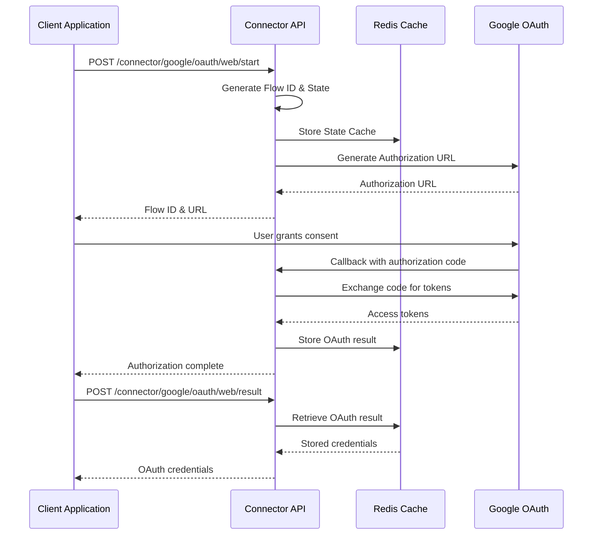

**Diagram sources**
- [connector_app.py](file://api/apps/connector_app.py#L193-L392)

**Section sources**
- [connector_app.py](file://api/apps/connector_app.py#L38-L118)
- [connector_app.py](file://api/apps/connector_app.py#L193-L392)

## Document Retrieval and Conversion

The connector implements a sophisticated multi-stage retrieval and conversion process that handles various Google Drive file formats and ensures optimal document processing:

### Retrieval Stages

The connector operates through distinct retrieval stages, each optimized for specific access patterns:

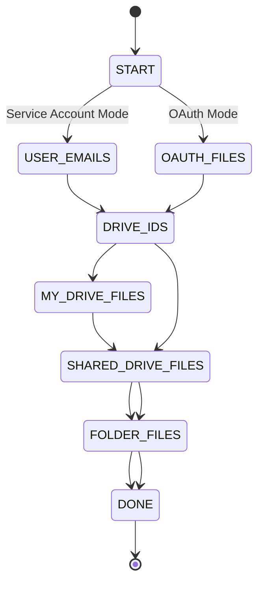

**Diagram sources**
- [model.py](file://common/data_source/google_drive/model.py#L25-L54)
- [connector.py](file://common/data_source/google_drive/connector.py#L332-L506)

### Supported File Formats

The connector supports comprehensive format conversion:

| Original Format | Export Format | Conversion Method | Metadata Preservation |
|----------------|---------------|-------------------|----------------------|
| Google Docs | Plain Text/HTML | Native export API | Document structure, formatting |
| Google Sheets | CSV/HTML | Native export API | Cell content, formulas |
| Google Slides | Plain Text/HTML | Native export API | Slide structure, text |
| Microsoft Office (.docx, .xlsx, .pptx) | Plain Text/HTML | Built-in parsers | Document metadata |
| PDF | Plain Text/HTML | OCR/PDF parsers | Page structure, images |
| Plain Text (.txt, .md) | Plain Text | Direct extraction | File metadata |
| Images (.png, .jpg, .webp) | Embedded | Image processing | Dimensions, format |

### Conversion Pipeline

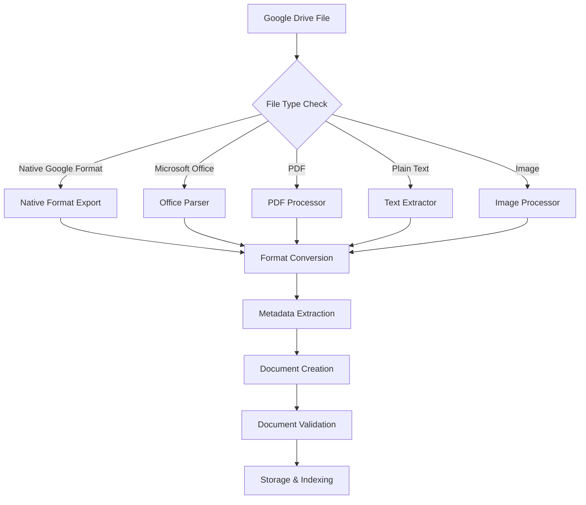

**Diagram sources**
- [doc_conversion.py](file://common/data_source/google_drive/doc_conversion.py#L418-L566)
- [file_retrieval.py](file://common/data_source/google_drive/file_retrieval.py#L25-L30)

### Section Extraction for Google Docs

The connector implements advanced section extraction for Google Docs, preserving hierarchical structure:

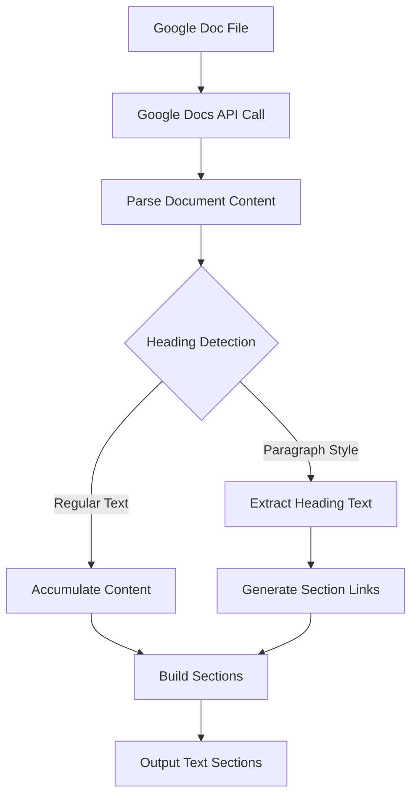

**Diagram sources**
- [section_extraction.py](file://common/data_source/google_drive/section_extraction.py#L16-L184)

**Section sources**
- [doc_conversion.py](file://common/data_source/google_drive/doc_conversion.py#L418-L566)
- [section_extraction.py](file://common/data_source/google_drive/section_extraction.py#L16-L184)

## Permission Handling and Access Control

The connector implements comprehensive permission handling to ensure secure access control and proper document visibility:

### Permission Model

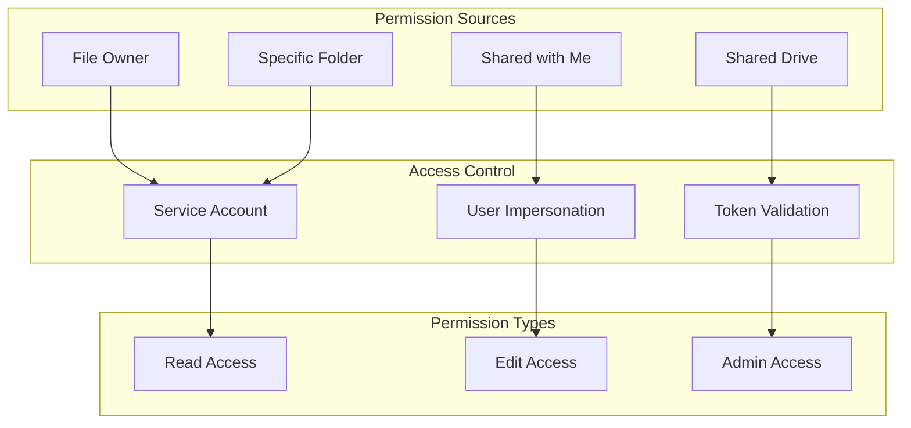

**Diagram sources**
- [connector.py](file://common/data_source/google_drive/connector.py#L322-L400)
- [doc_conversion.py](file://common/data_source/google_drive/doc_conversion.py#L569-L608)

### Permission Synchronization

The connector maintains synchronized permission states across different access patterns:

| Access Pattern | Permission Level | Synchronization Method | Cache Duration |
|----------------|------------------|----------------------|----------------|
| Service Account | Full Organization Access | Real-time lookup | Session-based |
| User Impersonation | Individual User Access | Per-user caching | 1 hour |
| Shared Drive | Drive-level Access | Drive-wide caching | 24 hours |
| Specific Folders | Folder-level Access | Hierarchical caching | 6 hours |

**Section sources**
- [doc_conversion.py](file://common/data_source/google_drive/doc_conversion.py#L569-L608)
- [connector.py](file://common/data_source/google_drive/connector.py#L322-L400)

## Rate Limiting and Error Handling

The connector implements robust rate limiting and error handling mechanisms to ensure reliable operation under various conditions:

### Rate Limiting Strategy

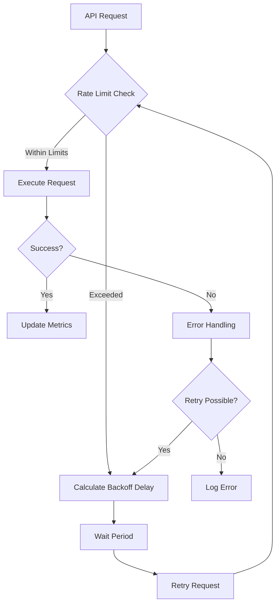

**Diagram sources**
- [util.py](file://common/data_source/google_util/util.py#L75-L158)

### Error Categories and Handling

| Error Type | Status Code | Handling Strategy | Recovery Action |
|------------|-------------|------------------|-----------------|
| 401 Unauthorized | Authentication | Token refresh | Re-authenticate user |
| 403 Forbidden | Permission | Permission check | Verify scopes and access |
| 404 Not Found | Resource | Skip file | Continue with next |
| 429 Rate Limited | Throttling | Exponential backoff | Wait and retry |
| 5xx Server Error | Service issue | Retry with backoff | Monitor service status |
| Network Timeout | Connection | Retry with timeout | Adjust timeout settings |

### Concurrent Processing Limits

The connector implements configurable concurrency controls:

| Parameter | Default Value | Environment Variable | Purpose |
|-----------|---------------|---------------------|---------|
| `MAX_DRIVE_WORKERS` | 4 | `MAX_DRIVE_WORKERS` | Maximum concurrent workers |
| `SHARED_DRIVE_PAGES_PER_CHECKPOINT` | 2 | - | Pages per checkpoint for shared drives |
| `MY_DRIVE_PAGES_PER_CHECKPOINT` | 2 | - | Pages per checkpoint for My Drives |
| `OAUTH_PAGES_PER_CHECKPOINT` | 2 | - | Pages per checkpoint for OAuth |
| `FOLDERS_PER_CHECKPOINT` | 1 | - | Folders per checkpoint |

**Section sources**
- [util.py](file://common/data_source/google_util/util.py#L75-L158)
- [connector.py](file://common/data_source/google_drive/connector.py#L45-L50)

## Knowledge Base Integration

The connector seamlessly integrates with RAGFlow's knowledge base system, providing efficient document processing and metadata preservation:

### Document Processing Pipeline

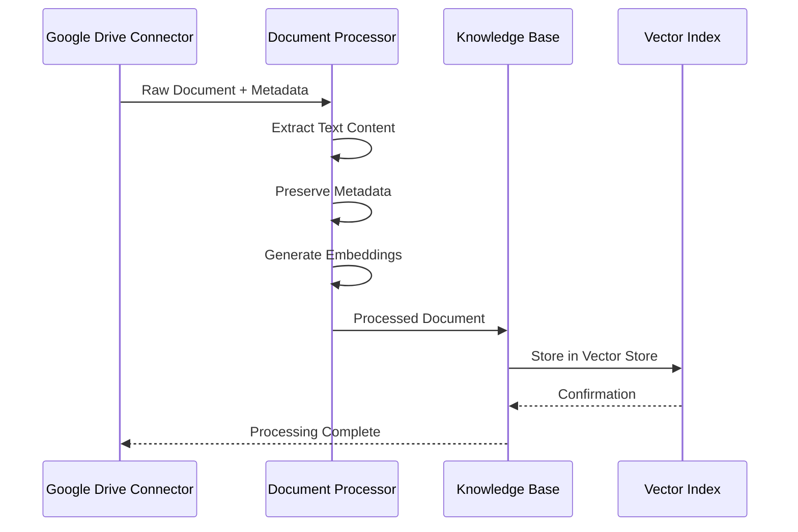

**Diagram sources**
- [interfaces.py](file://common/data_source/interfaces.py#L202-L412)
- [connector.py](file://common/data_source/google_drive/connector.py#L750-L795)

### Metadata Preservation

The connector preserves comprehensive metadata for enhanced retrieval:

| Metadata Field | Source | Description | Usage |
|----------------|--------|-------------|-------|
| `document_id` | Google Drive ID | Unique identifier | Cross-reference linking |
| `file_name` | Google Drive | Original filename | File identification |
| `file_size` | Google Drive | File size in bytes | Size-based filtering |
| `modified_time` | Google Drive | Last modification timestamp | Chronological sorting |
| `owner_email` | Google Drive | File owner email | Ownership tracking |
| `mime_type` | Google Drive | File MIME type | Format detection |
| `folder_path` | Navigation | Hierarchical path | Organizational context |
| `shared_with` | Permissions | Collaborator list | Access control |

**Section sources**
- [connector.py](file://common/data_source/google_drive/connector.py#L750-L795)
- [interfaces.py](file://common/data_source/interfaces.py#L202-L412)

## Troubleshooting Guide

Common issues and their solutions when working with the Google Drive connector:

### Authentication Issues

**Problem**: "Invalid or expired Google Drive credentials (401)"
- **Cause**: Expired access token or revoked permissions
- **Solution**: Re-run OAuth flow or refresh service account credentials
- **Prevention**: Implement automatic token refresh and monitor token expiration

**Problem**: "Google Drive app lacks required permissions (403)"
- **Cause**: Insufficient OAuth scopes granted
- **Solution**: Verify all required scopes are granted in Google Cloud Console
- **Steps**: Check OAuth consent screen, verify scopes, re-authenticate

### Access Control Issues

**Problem**: "User does not have access to the drive APIs"
- **Cause**: Insufficient permissions for user impersonation
- **Solution**: Enable Domain-wide Delegation for service accounts
- **Verification**: Test API access with individual user accounts

**Problem**: "Files not appearing in synchronization"
- **Cause**: Restricted folder access or insufficient permissions
- **Solution**: Verify folder sharing settings and user access rights
- **Debugging**: Check folder permissions and access logs

### Performance Issues

**Problem**: Slow synchronization performance
- **Cause**: Large number of files or network latency
- **Solution**: Adjust batch sizes and worker counts
- **Optimization**: Enable parallel processing and optimize checkpoint intervals

**Problem**: Rate limiting errors (429)
- **Cause**: Excessive API requests
- **Solution**: Implement exponential backoff and reduce request frequency
- **Monitoring**: Track API quota usage and adjust accordingly

### Configuration Issues

**Problem**: "Primary admin email not found in credentials"
- **Cause**: Missing or incorrect primary admin email
- **Solution**: Verify admin email in connector configuration
- **Validation**: Test admin email accessibility

**Problem**: "Invalid Google Drive credentials"
- **Cause**: Malformed credentials or missing fields
- **Solution**: Re-generate credentials and re-upload
- **Verification**: Validate JSON structure and required fields

**Section sources**
- [connector.py](file://common/data_source/google_drive/connector.py#L1095-L1120)
- [auth.py](file://common/data_source/google_util/auth.py#L130-L158)

## Best Practices

### Security Best Practices

1. **Token Management**: Always use refresh tokens instead of long-lived access tokens
2. **Scope Minimization**: Request only necessary OAuth scopes for specific functionality
3. **Service Account Security**: Store service account keys securely and rotate regularly
4. **Network Security**: Use HTTPS endpoints and implement proper certificate validation
5. **Access Logging**: Monitor and log all API access attempts for security auditing

### Performance Optimization

1. **Batch Processing**: Configure appropriate batch sizes based on available memory
2. **Parallel Processing**: Utilize multiple workers for large-scale operations
3. **Checkpoint Strategy**: Implement frequent checkpoints to enable recovery
4. **Caching**: Leverage caching mechanisms for frequently accessed metadata
5. **Rate Limiting**: Respect API quotas and implement exponential backoff

### Operational Excellence

1. **Monitoring**: Implement comprehensive logging and monitoring
2. **Alerting**: Set up alerts for authentication failures and rate limits
3. **Backup**: Regular backup of connector configurations and credentials
4. **Testing**: Thoroughly test configurations before production deployment
5. **Documentation**: Maintain up-to-date documentation for all configurations

### Compliance and Governance

1. **Data Classification**: Classify data based on sensitivity levels
2. **Retention Policies**: Implement appropriate data retention policies
3. **Audit Trails**: Maintain audit trails for all data access and modifications
4. **Privacy Protection**: Ensure compliance with privacy regulations
5. **Access Reviews**: Regular review of access permissions and user entitlements