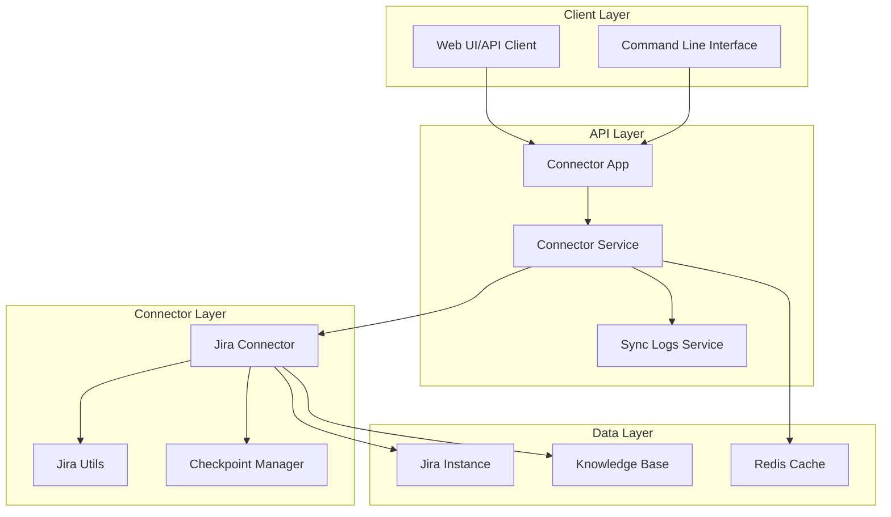
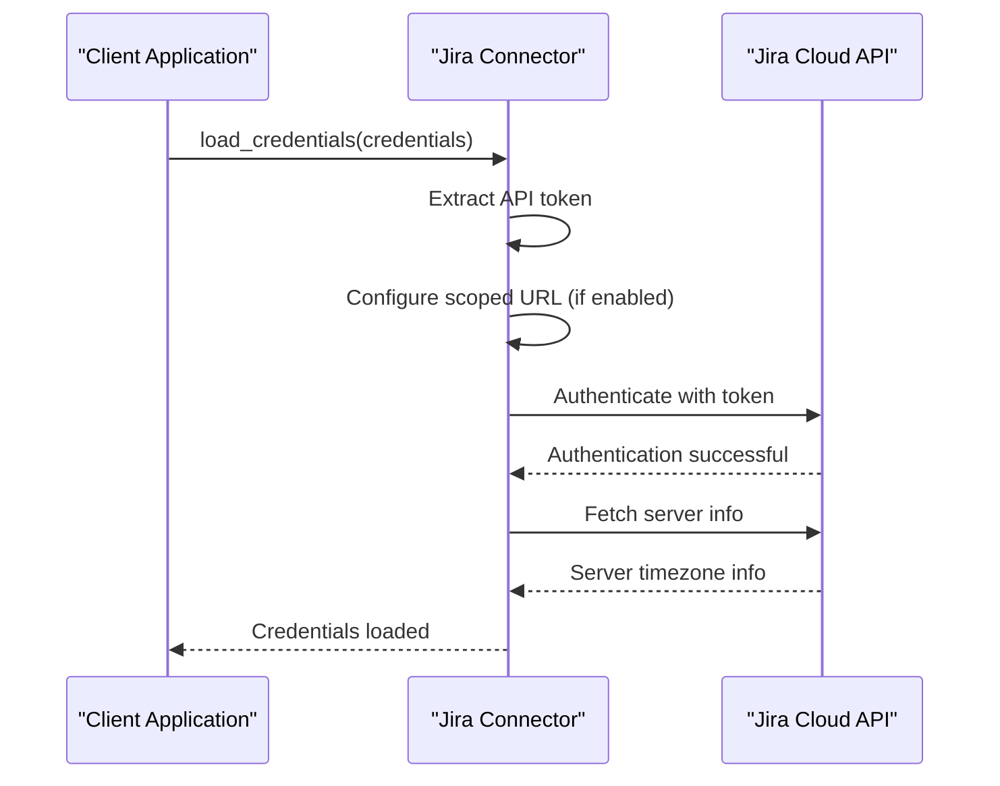
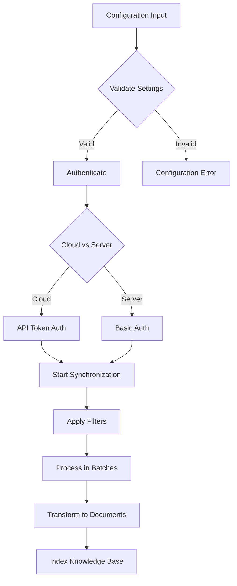
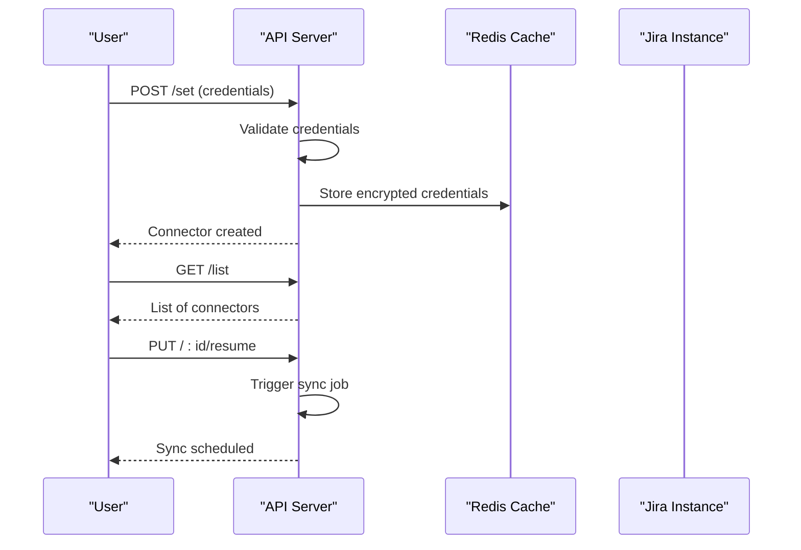
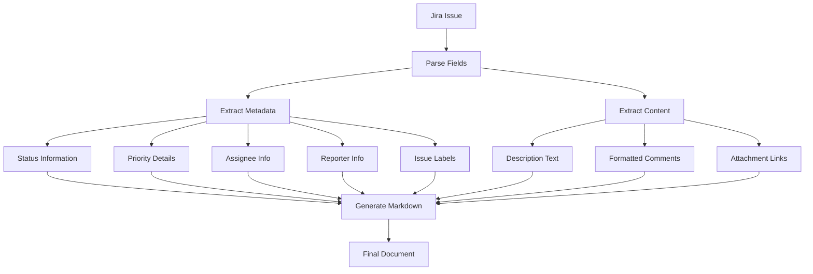
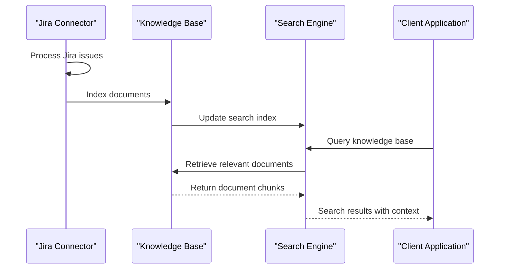
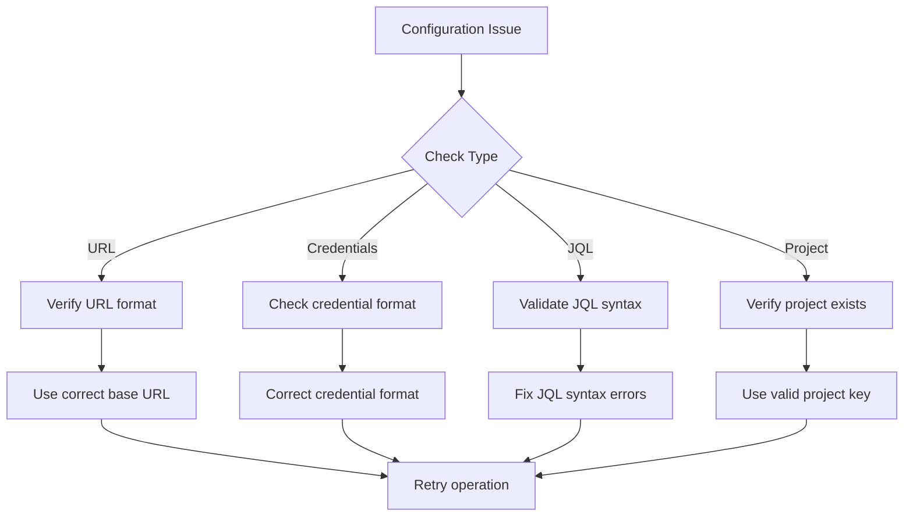

# Jira Connector API Documentation

<cite>
**Referenced Files in This Document**
- [connector.py](file://common/data_source/jira/connector.py)
- [utils.py](file://common/data_source/jira/utils.py)
- [connector_app.py](file://api/apps/connector_app.py)
- [connector_service.py](file://api/db/services/connector_service.py)
- [models.py](file://common/data_source/models.py)
- [interfaces.py](file://common/data_source/interfaces.py)
- [config.py](file://common/data_source/config.py)
- [contant.tsx](file://web/src/pages/user-setting/data-source/contant.tsx)
- [sync_data_source.py](file://rag/svr/sync_data_source.py)
</cite>

## Table of Contents
1. [Introduction](#introduction)
2. [Architecture Overview](#architecture-overview)
3. [Authentication Methods](#authentication-methods)
4. [Configuration Options](#configuration-options)
5. [Endpoints and API Reference](#endpoints-and-api-reference)
6. [Jira Issue Processing](#jira-issue-processing)
7. [Knowledge Base Integration](#knowledge-base-integration)
8. [Troubleshooting Guide](#troubleshooting-guide)
9. [Examples and Best Practices](#examples-and-best-practices)
10. [Performance Considerations](#performance-considerations)

## Introduction

The Jira Connector API provides seamless integration with Jira instances for synchronizing issues, comments, and project documentation into knowledge bases. It supports both Atlassian Cloud and Server instances, offering flexible authentication methods and comprehensive configuration options for efficient data extraction and indexing.

The connector transforms Jira issues into searchable markdown documents, enriching them with metadata such as status, priority, assignee information, and contextual comments. It handles large-scale data synchronization with intelligent batching, rate limiting, and error recovery mechanisms.

## Architecture Overview

The Jira connector follows a modular architecture designed for reliability and scalability:



**Diagram sources**
- [connector_app.py](file://api/apps/connector_app.py#L1-L50)
- [connector_service.py](file://api/db/services/connector_service.py#L33-L80)
- [connector.py](file://common/data_source/jira/connector.py#L82-L120)

**Section sources**
- [connector.py](file://common/data_source/jira/connector.py#L82-L120)
- [interfaces.py](file://common/data_source/interfaces.py#L70-L100)

## Authentication Methods

The Jira connector supports multiple authentication approaches to accommodate different deployment scenarios and security requirements.

### API Token Authentication (Recommended for Cloud)

For Atlassian Cloud instances, API token authentication provides secure access without exposing user passwords:



**Diagram sources**
- [connector.py](file://common/data_source/jira/connector.py#L128-L173)

### Username/Password Authentication (Server Instances)

For Jira Server deployments, traditional username/password authentication is supported:

| Authentication Method | Cloud Support | Server Support | Security Level |
|----------------------|---------------|----------------|----------------|
| API Token | ✅ | ✅ | High |
| Username/Password | ❌ | ✅ | Medium |
| OAuth | ⚠️ | ⚠️ | High |

### Scoped Token Support

Scoped tokens provide enhanced security by restricting API access to specific Jira resources:

```python
# Configuration example for scoped tokens
{
    "jira_base_url": "https://your-domain.atlassian.net",
    "scoped_token": True,
    "credentials": {
        "jira_user_email": "user@example.com",
        "jira_api_token": "your-api-token"
    }
}
```

**Section sources**
- [connector.py](file://common/data_source/jira/connector.py#L128-L173)
- [contant.tsx](file://web/src/pages/user-setting/data-source/contant.tsx#L447-L451)

## Configuration Options

The Jira connector offers extensive configuration options for fine-tuning synchronization behavior and filtering criteria.

### Core Configuration Parameters

| Parameter | Type | Default | Description |
|-----------|------|---------|-------------|
| `jira_base_url` | string | Required | Base URL of the Jira instance |
| `project_key` | string | null | Specific project to sync (alternative to JQL) |
| `jql_query` | string | null | Custom JQL query for filtering issues |
| `batch_size` | integer | 50 | Number of issues to process per batch |
| `include_comments` | boolean | true | Include issue comments in documents |
| `include_attachments` | boolean | false | Include file attachments as separate documents |
| `labels_to_skip` | array | [] | Issue labels to exclude from sync |
| `comment_email_blacklist` | array | [] | Email addresses to filter from comments |
| `scoped_token` | boolean | false | Enable scoped token authentication |
| `attachment_size_limit` | integer | 10MB | Maximum attachment size in bytes |
| `timezone_offset` | float | Auto-detected | Override timezone offset for timestamps |

### Advanced Configuration



**Diagram sources**
- [connector.py](file://common/data_source/jira/connector.py#L85-L120)
- [config.py](file://common/data_source/config.py#L188-L201)

### JQL Query Configuration

Custom JQL queries provide powerful filtering capabilities:

```sql
-- Example JQL queries
-- High priority bugs from the last week
project = BUGS AND priority = HIGH AND updated >= -7d AND issuetype = Bug

-- Issues assigned to specific user
project = TEAM AND assignee = currentUser() AND resolution = Unresolved

-- Issues with specific labels
project = DOCS AND labels IN (urgent, critical) AND status != Closed
```

**Section sources**
- [connector.py](file://common/data_source/jira/connector.py#L414-L438)
- [contant.tsx](file://web/src/pages/user-setting/data-source/contant.tsx#L384-L400)

## Endpoints and API Reference

The Jira connector exposes several REST endpoints for managing connections and triggering synchronization.

### Connector Management Endpoints

| Endpoint | Method | Description | Request Body |
|----------|--------|-------------|--------------|
| `/set` | POST | Create/update connector configuration | Connector config with credentials |
| `/list` | GET | List all connectors for tenant | None |
| `/:id` | GET | Get specific connector | None |
| `/:id/logs` | GET | View sync logs | Pagination parameters |
| `/:id/resume` | PUT | Resume/cancel connector | Resume flag |
| `/:id/rebuild` | PUT | Rebuild knowledge base from connector | Knowledge base ID |
| `/:id/rm` | POST | Delete connector | None |

### Authentication Endpoints



**Diagram sources**
- [connector_app.py](file://api/apps/connector_app.py#L38-L118)

### Validation and Testing Endpoints

The connector provides built-in validation to ensure proper configuration:

```python
# Validation process flow
def validate_connector_settings(self):
    """Validate connectivity by fetching basic Jira info."""
    try:
        if self.jql_query:
            # Test JQL query execution
            self._test_jql_execution()
        elif self.project_key:
            # Test project access
            self.jira_client.project(self.project_key)
        else:
            # Test general access
            self.jira_client.projects()
    except Exception as exc:
        self._handle_validation_error(exc)
```

**Section sources**
- [connector_app.py](file://api/apps/connector_app.py#L38-L118)
- [connector.py](file://common/data_source/jira/connector.py#L175-L200)

## Jira Issue Processing

The connector transforms Jira issues into structured, searchable documents with comprehensive metadata enrichment.

### Issue Transformation Pipeline



**Diagram sources**
- [connector.py](file://common/data_source/jira/connector.py#L447-L528)
- [utils.py](file://common/data_source/jira/utils.py#L45-L150)

### Document Structure

Each Jira issue is converted into a markdown document with the following structure:

```markdown
---
key: BUG-123
url: https://jira.example.com/browse/BUG-123
summary: Critical memory leak in API endpoint
status: In Progress
priority: Critical
issue_type: Bug
project: Bug Tracker
project_key: BUG
reporter: John Doe
reporter_email: john.doe@example.com
assignee: Jane Smith
assignee_email: jane.smith@example.com
labels: memory,performance,critical
created: 2024-01-15T10:30:00Z
updated: 2024-01-16T14:45:00Z
---

## Description
Memory leak causing server crashes under high load conditions.

## Comments
- Jane Smith (2024-01-16T14:45:00Z):
  Confirmed the issue occurs with POST requests to /api/v1/data
  
- John Doe (2024-01-15T11:15:00Z):
  Reproduced on staging environment

## Attachments
- memory_dump.dmp (15MB) -> https://jira.example.com/secure/attachment/12345/memory_dump.dmp
```

### Field Mapping and Enrichment

The connector extracts and enriches various Jira fields:

| Field Category | Extracted Information | Processing Method |
|----------------|----------------------|-------------------|
| **Metadata** | Key, URL, Summary, Status, Priority | Direct field extraction |
| **People** | Reporter, Assignee, Creator | Name and email extraction |
| **Project** | Project name, key, category | Project information lookup |
| **Timeline** | Created, Updated, Resolved dates | ISO format conversion |
| **Content** | Description, Comments, Attachments | Text extraction and formatting |

**Section sources**
- [connector.py](file://common/data_source/jira/connector.py#L447-L528)
- [utils.py](file://common/data_source/jira/utils.py#L23-L150)

## Knowledge Base Integration

The processed Jira documents are seamlessly integrated into knowledge bases for retrieval and search capabilities.

### Integration Workflow



**Diagram sources**
- [sync_data_source.py](file://rag/svr/sync_data_source.py#L410-L439)

### Document Chunking Strategy

Large Jira documents are intelligently chunked for optimal search performance:

```python
# Chunking parameters
MAX_CHUNK_SIZE = 100 * 1024  # 100KB per chunk
MIN_CHUNK_SIZE = 10 * 1024   # 10KB minimum
OVERLAP_SIZE = 2 * 1024      # 2KB overlap between chunks
```

### Retrieval Features

The integrated knowledge base provides:

- **Semantic Search**: Understands context beyond exact keyword matching
- **Filtering**: Narrow results by project, status, priority, or assignee
- **Relevance Ranking**: Documents ranked by relevance to query
- **Context Preservation**: Maintains issue context across chunk boundaries

**Section sources**
- [sync_data_source.py](file://rag/svr/sync_data_source.py#L410-L439)
- [connector_service.py](file://api/db/services/connector_service.py#L70-L80)

## Troubleshooting Guide

Common issues and their solutions when working with the Jira connector.

### Authentication Issues

| Error | Cause | Solution |
|-------|-------|----------|
| `401 Unauthorized` | Invalid credentials | Verify API token or username/password |
| `403 Forbidden` | Insufficient permissions | Check Jira user permissions |
| `404 Not Found` | Invalid project or resource | Verify project key and resource existence |
| `429 Rate Limited` | Too many requests | Reduce batch size or increase delay |

### Common Configuration Problems



**Diagram sources**
- [connector.py](file://common/data_source/jira/connector.py#L259-L274)

### Performance Troubleshooting

**Large Volume Handling**:
- Adjust `batch_size` parameter for optimal performance
- Use JQL filters to reduce initial result set
- Enable incremental synchronization with time-based filters

**Rate Limiting**:
- Monitor API rate limits in Jira administration
- Implement exponential backoff for retries
- Consider using scoped tokens to reduce API overhead

**Memory Management**:
- Set appropriate `attachment_size_limit`
- Use `labels_to_skip` to filter irrelevant issues
- Monitor connector memory usage during large syncs

**Section sources**
- [connector.py](file://common/data_source/jira/connector.py#L259-L274)
- [connector.py](file://common/data_source/jira/connector.py#L242-L257)

## Examples and Best Practices

### High-Priority Bug Tracking Configuration

Configure the connector to sync only high-priority bugs from a specific project:

```json
{
    "name": "High Priority Bugs",
    "source": "jira",
    "config": {
        "base_url": "https://company.atlassian.net",
        "project_key": "BUGS",
        "jql_query": "priority = High AND issuetype = Bug AND status != Closed",
        "batch_size": 100,
        "include_comments": true,
        "include_attachments": false,
        "labels_to_skip": ["wontfix", "duplicate"],
        "timezone_offset": -5.0
    },
    "credentials": {
        "jira_user_email": "automation@company.com",
        "jira_api_token": "your-api-token"
    }
}
```

### Large-Scale Enterprise Setup

For enterprise environments with thousands of issues:

```json
{
    "name": "Enterprise Issue Sync",
    "source": "jira",
    "config": {
        "base_url": "https://enterprise.atlassian.net",
        "jql_query": "project IN (PROD, DEV, TEST) AND updated >= -30d",
        "batch_size": 500,
        "include_comments": false,
        "include_attachments": true,
        "attachment_size_limit": 50 * 1024 * 1024,
        "labels_to_skip": ["internal", "template"],
        "comment_email_blacklist": ["noreply@company.com"]
    }
}
```

### Incremental Synchronization Pattern

Set up daily incremental syncs based on update timestamps:

```bash
# Daily sync script example
#!/bin/bash
BASE_URL="https://company.atlassian.net"
PROJECT_KEY="TEAM"
TOKEN="your-api-token"

# Get last sync timestamp
LAST_SYNC=$(redis-cli get "jira_last_sync_${PROJECT_KEY}")

# Run sync with time filter
python -m common.data_source.jira.connector \
    --base-url $BASE_URL \
    --project $PROJECT_KEY \
    --token $TOKEN \
    --start-ts $LAST_SYNC
```

### Error Handling Best Practices

```python
# Robust error handling example
try:
    connector = JiraConnector(
        jira_base_url=base_url,
        project_key=project_key,
        credentials=credentials,
        batch_size=100
    )
    connector.load_credentials(credentials)
    connector.validate_connector_settings()
    
    # Process issues
    documents = test_jira(
        base_url=base_url,
        project_key=project_key,
        credentials=credentials,
        batch_size=100
    )
    
except InsufficientPermissionsError as e:
    logger.error(f"Permission denied: {e}")
    # Notify administrator
    
except ConnectorValidationError as e:
    logger.error(f"Configuration error: {e}")
    # Fix configuration
    
except Exception as e:
    logger.error(f"Unexpected error: {e}")
    # Implement retry logic
```

**Section sources**
- [connector.py](file://common/data_source/jira/connector.py#L85-L120)
- [connector.py](file://common/data_source/jira/connector.py#L855-L887)

## Performance Considerations

### Optimization Strategies

**Batch Processing**:
- Use optimal batch sizes (typically 50-500 depending on issue complexity)
- Monitor memory usage during large sync operations
- Implement backpressure for slow downstream systems

**Network Efficiency**:
- Enable compression for API requests
- Use connection pooling for multiple concurrent requests
- Implement request caching for frequently accessed data

**Storage Optimization**:
- Compress large attachments before indexing
- Use efficient document chunking strategies
- Implement incremental updates to minimize reprocessing

### Monitoring and Metrics

Key metrics to monitor for connector performance:

| Metric | Description | Target Value |
|--------|-------------|--------------|
| Sync Duration | Time to complete full sync | < 2 hours |
| Error Rate | Percentage of failed operations | < 1% |
| Memory Usage | Peak memory consumption | < 2GB |
| API Calls | Number of Jira API requests | Optimized per batch |
| Document Count | Issues indexed per hour | > 1000/hour |

### Scaling Recommendations

For large-scale deployments:

1. **Horizontal Scaling**: Deploy multiple connector instances for different projects
2. **Vertical Scaling**: Increase memory and CPU allocation for large projects
3. **Queue Processing**: Use message queues for asynchronous processing
4. **Database Optimization**: Optimize database indexes for search performance

**Section sources**
- [connector.py](file://common/data_source/jira/connector.py#L668-L670)
- [connector.py](file://common/data_source/jira/connector.py#L242-L257)