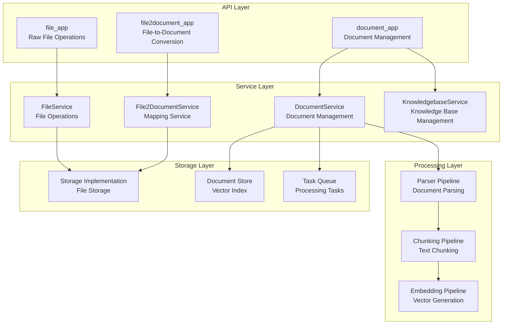
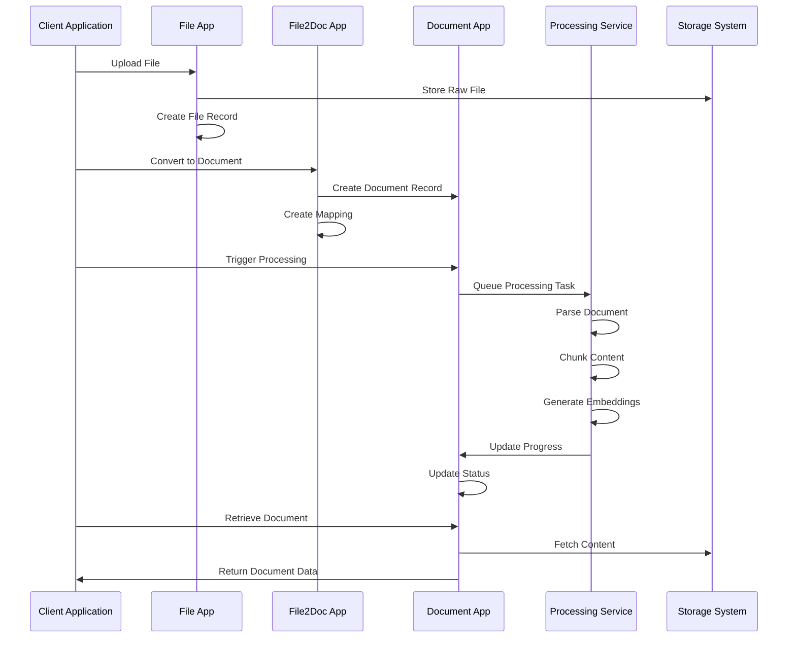
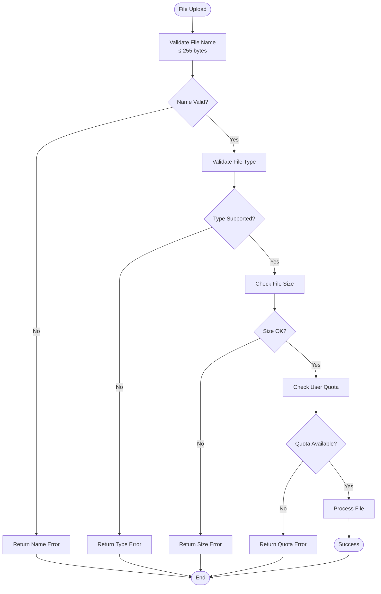
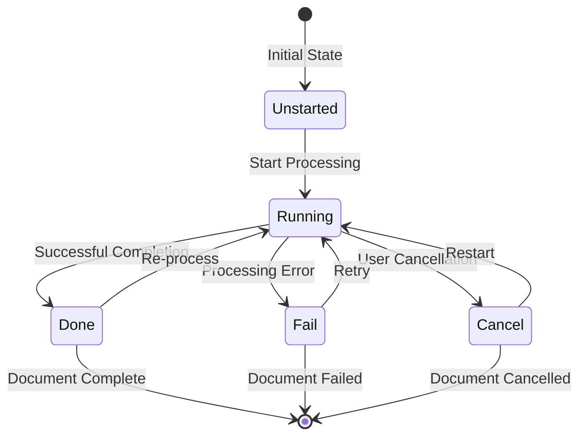

# Document Management API

<cite>
**Referenced Files in This Document**
- [file_app.py](file://api/apps/file_app.py)
- [file2document_app.py](file://api/apps/file2document_app.py)
- [document_app.py](file://api/apps/document_app.py)
- [file_service.py](file://api/db/services/file_service.py)
- [file2document_service.py](file://api/db/services/file2document_service.py)
- [document_service.py](file://api/db/services/document_service.py)
- [knowledgebase_service.py](file://api/db/services/knowledgebase_service.py)
- [db_models.py](file://api/db/db_models.py)
- [constants.py](file://api/constants.py)
- [file_utils.py](file://api/utils/file_utils.py)
- [constants.py](file://common/constants.py)
</cite>

## Table of Contents
1. [Introduction](#introduction)
2. [System Architecture](#system-architecture)
3. [Core Components](#core-components)
4. [Document Lifecycle Management](#document-lifecycle-management)
5. [API Endpoints Reference](#api-endpoints-reference)
6. [File Type Support and Validation](#file-type-support-and-validation)
7. [Processing Configuration](#processing-configuration)
8. [Error Handling and Status Management](#error-handling-and-status-management)
9. [Security and Access Control](#security-and-access-control)
10. [Best Practices](#best-practices)

## Introduction

RAGFlow's document management system provides a comprehensive API for handling documents within knowledge bases. The system manages the complete document lifecycle from initial upload through parsing, chunking, and final storage to retrieval and processing. The architecture consists of three main applications that handle different aspects of document management: `file_app` for raw file operations, `file2document_app` for file-to-document conversion, and `document_app` for document metadata and status management.

The system supports multiple file types, implements sophisticated processing pipelines, and provides robust error handling and status tracking mechanisms. Documents can be processed using various parsers and chunking strategies, with real-time progress monitoring and configurable processing options.

## System Architecture

The document management system follows a layered architecture with clear separation of concerns:



**Diagram sources**
- [file_app.py](file://api/apps/file_app.py#L1-L50)
- [file2document_app.py](file://api/apps/file2document_app.py#L1-L50)
- [document_app.py](file://api/apps/document_app.py#L1-L50)

**Section sources**
- [file_app.py](file://api/apps/file_app.py#L1-L454)
- [file2document_app.py](file://api/apps/file2document_app.py#L1-L133)
- [document_app.py](file://api/apps/document_app.py#L1-L719)

## Core Components

### File Application (file_app)

The file application handles raw file operations and manages the file system structure. It provides endpoints for uploading, organizing, and managing files within the system.

**Key Features:**
- File upload and storage
- Folder structure management
- File renaming and moving
- Bulk operations support
- Permission-based access control

**Core Endpoints:**
- `/upload`: Upload files to knowledge bases
- `/create`: Create folders and virtual files
- `/list`: List files with pagination and filtering
- `/rename`: Rename files and folders
- `/mv`: Move files between locations
- `/rm`: Delete files and folders

### File-to-Document Application (file2document_app)

This application manages the relationship between files and documents, handling the conversion process from raw files to processed documents.

**Key Features:**
- File-to-document mapping
- Document conversion and recreation
- Batch processing support
- Cleanup and removal operations

**Core Endpoints:**
- `/convert`: Convert files to documents
- `/rm`: Remove file-document associations

### Document Application (document_app)

The document application manages document metadata, processing status, and provides comprehensive document management capabilities.

**Key Features:**
- Document upload and processing
- Status tracking and progress monitoring
- Parser configuration management
- Metadata management
- Web crawling support

**Core Endpoints:**
- `/upload`: Upload documents to knowledge bases
- `/create`: Create virtual documents
- `/list`: List documents with filtering
- `/run`: Trigger document processing
- `/change_parser`: Change document parser
- `/set_meta`: Set document metadata
- `/web_crawl`: Crawl web content

**Section sources**
- [file_app.py](file://api/apps/file_app.py#L38-L120)
- [file2document_app.py](file://api/apps/file2document_app.py#L31-L98)
- [document_app.py](file://api/apps/document_app.py#L50-L84)

## Document Lifecycle Management

The document lifecycle in RAGFlow follows a structured process from upload to retrieval:



**Diagram sources**
- [file_app.py](file://api/apps/file_app.py#L38-L120)
- [file2document_app.py](file://api/apps/file2document_app.py#L31-L98)
- [document_app.py](file://api/apps/document_app.py#L401-L445)

### Upload Phase

1. **File Upload**: Raw files are uploaded through the file application
2. **Storage**: Files are stored in the configured storage backend
3. **Metadata Creation**: Basic file metadata is created in the database

### Conversion Phase

1. **File-to-Document Mapping**: Establish relationship between file and document
2. **Document Creation**: Create document record with parser configuration
3. **Knowledge Base Association**: Link document to appropriate knowledge base

### Processing Phase

1. **Parsing**: Extract text content using appropriate parser
2. **Chunking**: Split content into manageable chunks
3. **Embedding**: Generate vector embeddings for retrieval
4. **Indexing**: Store chunks in vector database

### Retrieval Phase

1. **Status Check**: Verify document processing status
2. **Content Retrieval**: Fetch processed content
3. **Metadata Access**: Retrieve document metadata

**Section sources**
- [file_service.py](file://api/db/services/file_service.py#L430-L488)
- [document_service.py](file://api/db/services/document_service.py#L45-L200)

## API Endpoints Reference

### File Management Endpoints

#### Upload Files
**Endpoint:** `POST /v1/file/upload`  
**Description:** Upload files to knowledge bases or folders

**Request Parameters:**
- `parent_id` (optional): Target folder ID (defaults to root)
- `file` (required): File object(s) to upload

**Response:**
```json
{
  "retcode": 0,
  "retmsg": "success",
  "data": [
    {
      "id": "file_id",
      "parent_id": "parent_folder_id",
      "tenant_id": "tenant_id",
      "created_by": "user_id",
      "type": "pdf|doc|image|audio",
      "name": "filename.pdf",
      "location": "storage_path",
      "size": 1024
    }
  ]
}
```

#### Create Folder
**Endpoint:** `POST /v1/file/create`  
**Description:** Create new folders or virtual files

**Request Parameters:**
- `name` (required): Folder name
- `parent_id` (optional): Parent folder ID

**Response:**
```json
{
  "retcode": 0,
  "retmsg": "success",
  "data": {
    "id": "folder_id",
    "parent_id": "parent_id",
    "tenant_id": "tenant_id",
    "created_by": "user_id",
    "type": "folder",
    "name": "New Folder",
    "location": "",
    "size": 0
  }
}
```

#### List Files
**Endpoint:** `GET /v1/file/list`  
**Description:** List files with pagination and filtering

**Query Parameters:**
- `parent_id` (optional): Folder ID to list files from
- `keywords` (optional): Search keywords
- `page` (optional): Page number (default: 1)
- `page_size` (optional): Items per page (default: 15)
- `orderby` (optional): Sort field (default: create_time)
- `desc` (optional): Descending order flag (default: true)

**Response:**
```json
{
  "retcode": 0,
  "retmsg": "success",
  "data": {
    "total": 100,
    "files": [...],
    "parent_folder": {...}
  }
}
```

#### Rename File/Folder
**Endpoint:** `POST /v1/file/rename`  
**Description:** Rename files or folders

**Request Parameters:**
- `file_id` (required): File or folder ID
- `name` (required): New name

**Response:**
```json
{
  "retcode": 0,
  "retmsg": "success",
  "data": true
}
```

#### Move Files
**Endpoint:** `POST /v1/file/mv`  
**Description:** Move files between folders

**Request Parameters:**
- `src_file_ids` (required): Array of file IDs to move
- `dest_file_id` (required): Destination folder ID

**Response:**
```json
{
  "retcode": 0,
  "retmsg": "success",
  "data": true
}
```

#### Delete Files
**Endpoint:** `POST /v1/file/rm`  
**Description:** Delete files and folders

**Request Parameters:**
- `file_ids` (required): Array of file IDs to delete

**Response:**
```json
{
  "retcode": 0,
  "retmsg": "success",
  "data": true
}
```

### Document Management Endpoints

#### Upload Documents
**Endpoint:** `POST /v1/document/upload`  
**Description:** Upload documents to knowledge bases

**Request Parameters:**
- `kb_id` (required): Knowledge base ID
- `file` (required): Document file(s)

**Response:**
```json
{
  "retcode": 0,
  "retmsg": "success",
  "data": [
    {
      "id": "document_id",
      "kb_id": "kb_id",
      "parser_id": "naive|pdf|ppt|picture",
      "parser_config": {},
      "created_by": "user_id",
      "type": "pdf|doc|image|audio",
      "name": "document.pdf",
      "location": "storage_path",
      "size": 1024,
      "status": "1",
      "run": "0",
      "progress": 0
    }
  ]
}
```

#### Create Virtual Document
**Endpoint:** `POST /v1/document/create`  
**Description:** Create virtual documents without content

**Request Parameters:**
- `kb_id` (required): Knowledge base ID
- `name` (required): Document name

**Response:**
```json
{
  "retcode": 0,
  "retmsg": "success",
  "data": {
    "id": "document_id",
    "kb_id": "kb_id",
    "parser_id": "naive",
    "parser_config": {},
    "created_by": "user_id",
    "type": "virtual",
    "name": "Virtual Document",
    "location": "",
    "size": 0
  }
}
```

#### List Documents
**Endpoint:** `POST /v1/document/list`  
**Description:** List documents with filtering and pagination

**Query Parameters:**
- `kb_id` (required): Knowledge base ID
- `keywords` (optional): Search keywords
- `page` (optional): Page number
- `page_size` (optional): Items per page
- `orderby` (optional): Sort field
- `desc` (optional): Descending order

**Request Body Filters:**
```json
{
  "run_status": ["0", "1", "2", "3", "4"],
  "types": ["pdf", "doc", "image", "audio"],
  "suffix": ["pdf", "docx", "png"]
}
```

**Response:**
```json
{
  "retcode": 0,
  "retmsg": "success",
  "data": {
    "total": 100,
    "docs": [
      {
        "id": "doc_id",
        "name": "document.pdf",
        "type": "pdf",
        "size": 1024,
        "status": "1",
        "run": "3",
        "progress": 1.0,
        "chunk_num": 15,
        "token_num": 1500,
        "create_time": 1640995200
      }
    ]
  }
}
```

#### Trigger Document Processing
**Endpoint:** `POST /v1/document/run`  
**Description:** Start or cancel document processing

**Request Parameters:**
- `doc_ids` (required): Array of document IDs
- `run` (required): Operation ("1" to start, "2" to cancel)
- `delete` (optional): Delete existing chunks before processing

**Response:**
```json
{
  "retcode": 0,
  "retmsg": "success",
  "data": true
}
```

#### Change Document Parser
**Endpoint:** `POST /v1/document/change_parser`  
**Description:** Change document parser and configuration

**Request Parameters:**
- `doc_id` (required): Document ID
- `parser_id` (required): New parser ID
- `parser_config` (optional): Parser configuration

**Response:**
```json
{
  "retcode": 0,
  "retmsg": "success",
  "data": true
}
```

#### Set Document Metadata
**Endpoint:** `POST /v1/document/set_meta`  
**Description:** Set document metadata fields

**Request Parameters:**
- `doc_id` (required): Document ID
- `meta` (required): JSON metadata object

**Response:**
```json
{
  "retcode": 0,
  "retmsg": "success",
  "data": true
}
```

#### Web Crawling
**Endpoint:** `POST /v1/document/web_crawl`  
**Description:** Crawl web content and create document

**Request Parameters:**
- `kb_id` (required): Knowledge base ID
- `name` (required): Document name
- `url` (required): Target URL

**Response:**
```json
{
  "retcode": 0,
  "retmsg": "success",
  "data": true
}
```

### File-to-Document Endpoints

#### Convert Files to Documents
**Endpoint:** `POST /v1/file2document/convert`  
**Description:** Convert files to documents in knowledge bases

**Request Parameters:**
- `file_ids` (required): Array of file IDs
- `kb_ids` (required): Array of knowledge base IDs

**Response:**
```json
{
  "retcode": 0,
  "retmsg": "success",
  "data": [
    {
      "id": "f2d_id",
      "file_id": "file_id",
      "document_id": "document_id"
    }
  ]
}
```

#### Remove File-Document Associations
**Endpoint:** `POST /v1/file2document/rm`  
**Description:** Remove file-document associations

**Request Parameters:**
- `file_ids` (required): Array of file IDs

**Response:**
```json
{
  "retcode": 0,
  "retmsg": "success",
  "data": true
}
```

**Section sources**
- [file_app.py](file://api/apps/file_app.py#L38-L454)
- [document_app.py](file://api/apps/document_app.py#L50-L719)
- [file2document_app.py](file://api/apps/file2document_app.py#L31-L133)

## File Type Support and Validation

RAGFlow supports a wide range of file types with comprehensive validation and processing capabilities:

### Supported File Types

| Category | File Extensions | Description |
|----------|----------------|-------------|
| **PDF Documents** | `.pdf` | Portable Document Format with OCR support |
| **Office Documents** | `.doc`, `.docx`, `.ppt`, `.pptx`, `.xls`, `.xlsx` | Microsoft Office formats |
| **Text Documents** | `.txt`, `.md`, `.json`, `.xml`, `.csv` | Plain text and structured formats |
| **Presentation** | `.ppt`, `.pptx`, `.key`, `.ppsx` | Presentation files with slide extraction |
| **Spreadsheets** | `.xls`, `.xlsx`, `.numbers` | Spreadsheet files with table detection |
| **Email Formats** | `.eml`, `.msg` | Email messages with content extraction |
| **Images** | `.jpg`, `.jpeg`, `.png`, `.gif`, `.bmp`, `.webp` | Image files with OCR processing |
| **Audio** | `.mp3`, `.wav`, `.flac`, `.ogg` | Audio files with speech recognition |
| **Video** | `.mp4`, `.avi`, `.mov`, `.mkv` | Video files with transcription |
| **Programming** | `.py`, `.js`, `.java`, `.cpp`, `.go`, `.rs` | Code files with syntax highlighting |

### File Size Limitations

- **Maximum File Name Length**: 255 bytes
- **Maximum File Size**: Configurable per deployment (default varies)
- **Maximum Concurrent Files**: 1000 per user (configurable)

### Validation Rules



**Diagram sources**
- [constants.py](file://api/constants.py#L26-L27)
- [file_service.py](file://api/db/services/file_service.py#L114-L121)

**Section sources**
- [file_utils.py](file://api/utils/file_utils.py#L40-L54)
- [constants.py](file://api/constants.py#L26-L27)
- [file_service.py](file://api/db/services/file_service.py#L114-L121)

## Processing Configuration

### Parser Configuration Options

RAGFlow supports multiple parsers with customizable configurations:

#### Available Parsers

| Parser ID | Description | Use Cases |
|-----------|-------------|-----------|
| `naive` | Basic text extraction | General text documents |
| `pdf` | PDF-specific parsing | PDF documents with complex layouts |
| `presentation` | PowerPoint parsing | Slides with text and images |
| `picture` | Image processing | Images with OCR |
| `audio` | Speech processing | Audio files with transcription |
| `table` | Table extraction | Spreadsheet and table-heavy documents |
| `manual` | Manual processing | Custom processing workflows |
| `paper` | Academic papers | Research papers with citations |
| `resume` | Resume parsing | CV and resume documents |
| `book` | Book processing | Long-form text documents |

#### Parser Configuration Parameters

```json
{
  "chunk_token_num": 16096,
  "delimiter": "\n!?;。；！？",
  "layout_recognize": "Plain Text",
  "language": "English",
  "from_page": 0,
  "to_page": 100000,
  "overlap": 0.1,
  "max_tokens": 512,
  "temperature": 0.1,
  "top_p": 0.3
}
```

### Processing Pipeline Configuration

#### Chunking Strategies

1. **Fixed Token Chunking**: Divide text into chunks of specified token count
2. **Delimiter-Based Chunking**: Split at sentence boundaries and paragraphs
3. **Semantic Chunking**: Group semantically related content
4. **Layout-Aware Chunking**: Preserve document structure and formatting

#### Processing Options

- **Parallel Processing**: Multiple workers for concurrent processing
- **Retry Mechanism**: Automatic retry for failed tasks
- **Progress Tracking**: Real-time progress monitoring
- **Cancellation Support**: Ability to cancel long-running tasks

**Section sources**
- [constants.py](file://common/constants.py#L91-L106)
- [document_service.py](file://api/db/services/document_service.py#L45-L200)

## Error Handling and Status Management

### Document Processing Status

RAGFlow tracks document processing through several status states:



**Diagram sources**
- [constants.py](file://common/constants.py#L78-L88)

### Status Codes and Messages

| Status | Value | Description | Actions Available |
|--------|-------|-------------|-------------------|
| `UNSTART` | "0" | Not started | Start processing |
| `RUNNING` | "1" | Processing in progress | Cancel, monitor progress |
| `CANCEL` | "2" | Manually cancelled | Restart, delete |
| `DONE` | "3" | Successfully processed | Re-process, retrieve |
| `FAIL` | "4" | Processing failed | Retry, investigate |

### Error Handling Patterns

#### Common Error Scenarios

1. **File Format Errors**
   ```json
   {
     "retcode": 101,
     "retmsg": "Unsupported file type: .xyz",
     "data": null
   }
   ```

2. **Processing Failures**
   ```json
   {
     "retcode": 102,
     "retmsg": "Document processing failed: Ghostscript error",
     "data": {
       "document_id": "doc_123",
       "error_type": "ghostscript_error",
       "retry_count": 3
     }
   }
   ```

3. **Quota Exceeded**
   ```json
   {
     "retcode": 103,
     "retmsg": "Exceed the maximum file number of a free user!",
     "data": null
   }
   ```

#### Error Recovery Strategies

1. **Automatic Retry**: Failed tasks are automatically retried up to 3 times
2. **Graceful Degradation**: Continue processing other documents when individual failures occur
3. **User Notification**: Clear error messages with suggested actions
4. **Logging**: Comprehensive logging for debugging and monitoring

**Section sources**
- [constants.py](file://common/constants.py#L41-L76)
- [document_service.py](file://api/db/services/document_service.py#L663-L729)

## Security and Access Control

### Permission Model

RAGFlow implements a multi-layered permission system:

#### Tenant-Based Isolation
- Each tenant has isolated document storage
- Cross-tenant access is prevented
- Resource quotas per tenant

#### Document-Level Permissions
- Creator-only deletion rights
- Team sharing capabilities
- Role-based access control

#### File System Permissions
- Folder-level access control
- Recursive permission inheritance
- Explicit deny rules

### Authentication Requirements

All document management endpoints require authentication:

```json
{
  "Authorization": "Bearer <api_token>",
  "Content-Type": "application/json"
}
```

### Access Control Examples

#### Creating Documents
```bash
curl -X POST /v1/document/create \
  -H "Authorization: Bearer <token>" \
  -H "Content-Type: application/json" \
  -d '{
    "kb_id": "kb_123",
    "name": "Secure Document"
  }'
```

#### Deleting Documents
```bash
curl -X POST /v1/document/rm \
  -H "Authorization: Bearer <token>" \
  -H "Content-Type: application/json" \
  -d '{
    "doc_id": ["doc_123"]
  }'
```

**Section sources**
- [file_app.py](file://api/apps/file_app.py#L38-L454)
- [document_app.py](file://api/apps/document_app.py#L50-L719)

## Best Practices

### File Upload Best Practices

1. **Batch Processing**: Upload multiple files in single requests when possible
2. **Progress Monitoring**: Implement progress tracking for large uploads
3. **Error Handling**: Handle network interruptions gracefully
4. **File Organization**: Use meaningful folder structures

### Document Processing Best Practices

1. **Parser Selection**: Choose appropriate parsers for document types
2. **Chunk Size Tuning**: Optimize chunk sizes for retrieval quality
3. **Processing Queues**: Monitor processing queues for bottlenecks
4. **Resource Management**: Implement rate limiting for concurrent operations

### Performance Optimization

1. **Concurrent Processing**: Utilize multiple workers for large document sets
2. **Caching**: Cache frequently accessed documents
3. **Compression**: Enable compression for large text documents
4. **Monitoring**: Track processing metrics and optimize accordingly

### Security Considerations

1. **Input Validation**: Validate all file uploads and metadata
2. **Access Control**: Implement proper permission checks
3. **Audit Logging**: Log all document operations
4. **Data Protection**: Encrypt sensitive document content

### Monitoring and Maintenance

1. **Health Checks**: Regularly monitor system health
2. **Error Reporting**: Implement comprehensive error reporting
3. **Capacity Planning**: Monitor storage and processing capacity
4. **Backup Strategy**: Implement regular backup procedures