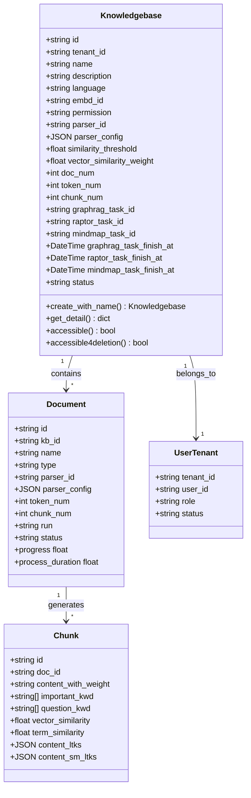
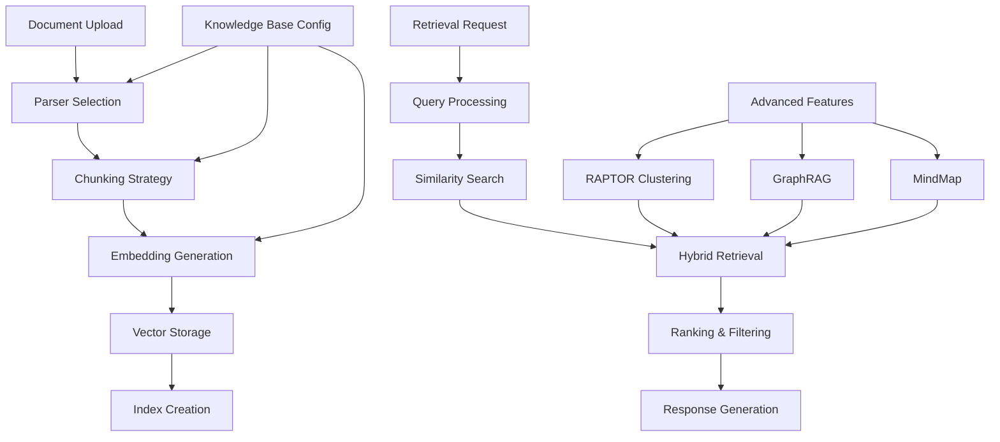
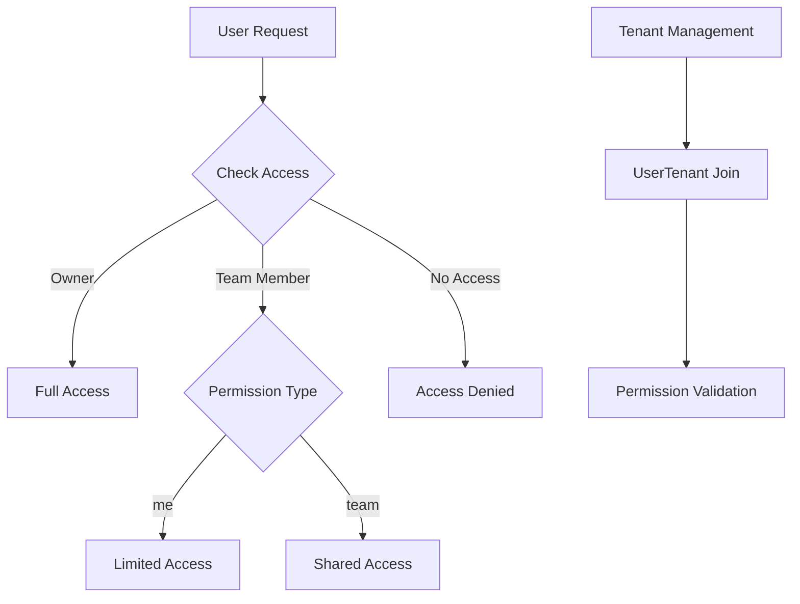

# Knowledge Base API

<cite>
**Referenced Files in This Document**
- [kb_app.py](file://api/apps/kb_app.py)
- [knowledgebase_service.py](file://api/db/services/knowledgebase_service.py)
- [db_models.py](file://api/db/db_models.py)
- [common/check_team_permission.py](file://api/common/check_team_permission.py)
- [configs.py](file://api/utils/configs.py)
- [search.py](file://rag/nlp/search.py)
- [tokenizer.py](file://rag/flow/tokenizer/tokenizer.py)
- [task_executor.py](file://rag/svr/task_executor.py)
- [benchmark.py](file://rag/benchmark.py)
- [graphrag/utils.py](file://graphrag/utils.py)
</cite>

## Table of Contents
1. [Introduction](#introduction)
2. [Knowledge Base Architecture](#knowledge-base-architecture)
3. [Core Endpoints](#core-endpoints)
4. [Knowledge Base Configuration](#knowledge-base-configuration)
5. [Advanced Features](#advanced-features)
6. [Permission and Sharing](#permission-and-sharing)
7. [Integration Examples](#integration-examples)
8. [Error Handling](#error-handling)
9. [Best Practices](#best-practices)

## Introduction

RAGFlow's knowledge base management system provides a comprehensive platform for organizing, processing, and retrieving information through intelligent document chunking, embedding generation, and advanced retrieval methods. Knowledge bases serve as containers that organize documents and their processed chunks, enabling efficient information retrieval through various strategies including traditional vector search, RAPTOR hierarchical clustering, and graph-based knowledge representation.

The knowledge base system supports multiple chunking strategies, customizable embedding models, and sophisticated retrieval methods including hybrid search, knowledge graph traversal, and hierarchical document organization. It integrates seamlessly with RAG (Retrieval-Augmented Generation) workflows to enhance AI-powered applications with structured, searchable knowledge repositories.

## Knowledge Base Architecture

### Core Components



**Diagram sources**
- [db_models.py](file://api/db/db_models.py#L734-L768)
- [db_models.py](file://api/db/db_models.py#L771-L797)

### Data Flow Architecture



**Section sources**
- [kb_app.py](file://api/apps/kb_app.py#L47-L67)
- [knowledgebase_service.py](file://api/db/services/knowledgebase_service.py#L374-L429)

## Core Endpoints

### Create Knowledge Base

Creates a new knowledge base with specified configuration.

**Endpoint:** `POST /kb/create`

**Request Body:**
```json
{
  "name": "Customer Support Knowledge",
  "description": "Knowledge base for customer support documentation",
  "language": "English",
  "parser_id": "naive",
  "embd_id": "sentence-transformer",
  "permission": "me",
  "similarity_threshold": 0.2,
  "vector_similarity_weight": 0.3,
  "parser_config": {
    "chunk_token_num": 512,
    "with_ocr": false,
    "layout": true
  }
}
```

**Response:**
```json
{
  "retcode": 0,
  "retmsg": "success",
  "data": {
    "kb_id": "kb_1234567890"
  }
}
```

**Section sources**
- [kb_app.py](file://api/apps/kb_app.py#L47-L67)
- [knowledgebase_service.py](file://api/db/services/knowledgebase_service.py#L374-L429)

### Retrieve Knowledge Base Details

Fetches detailed information about a specific knowledge base.

**Endpoint:** `GET /kb/detail?kb_id={kb_id}`

**Response:**
```json
{
  "retcode": 0,
  "retmsg": "success",
  "data": {
    "id": "kb_1234567890",
    "name": "Customer Support Knowledge",
    "description": "Knowledge base for customer support documentation",
    "language": "English",
    "embd_id": "sentence-transformer",
    "permission": "me",
    "doc_num": 15,
    "token_num": 125000,
    "chunk_num": 240,
    "similarity_threshold": 0.2,
    "vector_similarity_weight": 0.3,
    "parser_id": "naive",
    "parser_config": {
      "chunk_token_num": 512,
      "with_ocr": false,
      "layout": true
    },
    "graphrag_task_id": null,
    "raptor_task_id": null,
    "mindmap_task_id": null,
    "create_time": "2024-01-15 10:30:00",
    "update_time": "2024-01-15 14:20:00"
  }
}
```

**Section sources**
- [kb_app.py](file://api/apps/kb_app.py#L142-L169)

### List Knowledge Bases

Retrieves a paginated list of knowledge bases with filtering options.

**Endpoint:** `POST /kb/list`

**Query Parameters:**
- `keywords`: Search keyword filter
- `page`: Page number (default: 0)
- `page_size`: Items per page (default: 0 for all)
- `parser_id`: Filter by parser type
- `orderby`: Sort field (default: create_time)
- `desc`: Sort direction (default: true)

**Request Body:**
```json
{
  "owner_ids": ["tenant_123", "tenant_456"]
}
```

**Response:**
```json
{
  "retcode": 0,
  "retmsg": "success",
  "data": {
    "kbs": [
      {
        "id": "kb_1234567890",
        "name": "Customer Support Knowledge",
        "description": "Support documentation",
        "tenant_id": "tenant_123",
        "permission": "team",
        "doc_num": 15,
        "token_num": 125000,
        "chunk_num": 240,
        "parser_id": "naive",
        "embd_id": "sentence-transformer",
        "update_time": "2024-01-15 14:20:00"
      }
    ],
    "total": 1
  }
}
```

**Section sources**
- [kb_app.py](file://api/apps/kb_app.py#L171-L206)

### Update Knowledge Base

Updates configuration and metadata of an existing knowledge base.

**Endpoint:** `POST /kb/update`

**Request Body:**
```json
{
  "kb_id": "kb_1234567890",
  "name": "Updated Customer Support Knowledge",
  "description": "Enhanced support documentation with new sections",
  "similarity_threshold": 0.25,
  "vector_similarity_weight": 0.4,
  "connectors": ["connector_abc123"]
}
```

**Response:**
```json
{
  "retcode": 0,
  "retmsg": "success",
  "data": {
    "id": "kb_1234567890",
    "name": "Updated Customer Support Knowledge",
    "description": "Enhanced support documentation with new sections",
    "similarity_threshold": 0.25,
    "vector_similarity_weight": 0.4,
    "connectors": ["connector_abc123"]
  }
}
```

**Section sources**
- [kb_app.py](file://api/apps/kb_app.py#L70-L137)

### Delete Knowledge Base

Removes a knowledge base and all associated documents and chunks.

**Endpoint:** `POST /kb/rm`

**Request Body:**
```json
{
  "kb_id": "kb_1234567890"
}
```

**Response:**
```json
{
  "retcode": 0,
  "retmsg": "success",
  "data": true
}
```

**Section sources**
- [kb_app.py](file://api/apps/kb_app.py#L208-L248)

## Knowledge Base Configuration

### Chunking Strategies

RAGFlow supports multiple chunking strategies for document processing:

| Strategy | Description | Use Case |
|----------|-------------|----------|
| `naive` | Simple token-based splitting | General purpose documents |
| `pdf` | PDF-aware chunking with layout preservation | PDF documents |
| `markdown` | Markdown structure-aware chunking | Technical documentation |
| `html` | HTML content extraction and chunking | Web content |

**Configuration Example:**
```json
{
  "parser_id": "pdf",
  "parser_config": {
    "chunk_token_num": 512,
    "with_ocr": true,
    "layout": true,
    "tables": true,
    "pictures": true,
    "chunk_overlap": 100
  }
}
```

**Section sources**
- [knowledgebase_service.py](file://api/db/services/knowledgebase_service.py#L296-L321)

### Embedding Models

Configure embedding models for vector generation:

| Model Type | Description | Dimensions | Use Case |
|------------|-------------|------------|----------|
| `sentence-transformer` | Universal sentence embeddings | 768 | General purpose |
| `openai-ada` | OpenAI embedding model | 1536 | High-quality embeddings |
| `bge-large` | BGE large model | 1024 | Chinese language support |

**Embedding Configuration:**
```json
{
  "embd_id": "sentence-transformer",
  "similarity_threshold": 0.2,
  "vector_similarity_weight": 0.3
}
```

**Section sources**
- [tokenizer.py](file://rag/flow/tokenizer/tokenizer.py#L50-L72)

### Retrieval Methods

#### Hybrid Retrieval
Combines vector similarity and term-based search:

```json
{
  "similarity_threshold": 0.2,
  "vector_similarity_weight": 0.3,
  "top_k": 1024,
  "rerank_id": "cohere-rerank"
}
```

#### Advanced Retrieval Options
- **PageRank Enhancement**: Boosts important documents
- **Knowledge Graph**: Enables graph-based traversal
- **Table of Contents**: Hierarchical document navigation
- **Tavily Integration**: Web search augmentation

**Section sources**
- [search.py](file://rag/nlp/search.py#L204-L664)

## Advanced Features

### RAPTOR Hierarchical Clustering

RAPTOR (Recursive Abstractive Processing for Topic Outlines) creates hierarchical document summaries:

**Endpoint:** `POST /kb/run_raptor`
```json
{
  "kb_id": "kb_1234567890"
}
```

**Response:**
```json
{
  "retcode": 0,
  "retmsg": "success",
  "data": {
    "raptor_task_id": "task_9876543210"
  }
}
```

**Monitoring Progress:**
```json
{
  "retcode": 0,
  "retmsg": "success",
  "data": {
    "id": "task_9876543210",
    "progress": 0.85,
    "progress_msg": "Processing completed",
    "begin_at": "2024-01-15 11:00:00"
  }
}
```

**Section sources**
- [kb_app.py](file://api/apps/kb_app.py#L586-L652)
- [task_executor.py](file://rag/svr/task_executor.py#L645-L681)

### GraphRAG Knowledge Graph

Builds knowledge graphs from document content:

**Endpoint:** `POST /kb/run_graphrag`
```json
{
  "kb_id": "kb_1234567890"
}
```

**Retrieve Knowledge Graph:**
```json
{
  "retcode": 0,
  "retmsg": "success",
  "data": {
    "graph": {
      "nodes": [...],
      "edges": [...]
    },
    "mind_map": {
      "root": "...",
      "children": [...]
    }
  }
}
```

**Section sources**
- [kb_app.py](file://api/apps/kb_app.py#L517-L584)
- [graphrag/utils.py](file://graphrag/utils.py#L336-L368)

### MindMap Generation

Creates hierarchical mind maps from document structure:

**Endpoint:** `POST /kb/run_mindmap`

**Section sources**
- [kb_app.py](file://api/apps/kb_app.py#L655-L722)

## Permission and Sharing

### Access Control Model

RAGFlow implements a tenant-based permission system:



**Diagram sources**
- [check_team_permission.py](file://api/common/check_team_permission.py#L25-L39)

### Permission Types

| Permission | Description | Access Level |
|------------|-------------|--------------|
| `me` | Private knowledge base | Owner only |
| `team` | Shared with team members | Team members with access |

**Permission Configuration:**
```json
{
  "permission": "team",
  "tenant_id": "tenant_123"
}
```

**Section sources**
- [knowledgebase_service.py](file://api/db/services/knowledgebase_service.py#L472-L486)
- [check_team_permission.py](file://api/common/check_team_permission.py#L25-L39)

### Sharing Capabilities

Knowledge bases can be shared across tenants through team membership:

- **Team Collaboration**: Share knowledge bases with team members
- **Cross-tenant Access**: Access knowledge bases from joined tenants
- **Role-based Permissions**: Different access levels for team members

**Section sources**
- [kb_app.py](file://api/apps/kb_app.py#L142-L169)

## Integration Examples

### Basic Knowledge Base Setup

```python
import requests

# Create knowledge base
response = requests.post(
    "http://localhost:9380/kb/create",
    json={
        "name": "Technical Documentation",
        "description": "API documentation and guides",
        "language": "English",
        "parser_id": "naive",
        "embd_id": "sentence-transformer",
        "permission": "team"
    }
)

kb_id = response.json()["data"]["kb_id"]
print(f"Created knowledge base: {kb_id}")
```

### Advanced Configuration Example

```python
# Configure with custom chunking and embedding
config = {
    "name": "Research Papers",
    "description": "Academic research documents",
    "language": "English",
    "parser_id": "pdf",
    "embd_id": "openai-ada",
    "similarity_threshold": 0.25,
    "vector_similarity_weight": 0.4,
    "parser_config": {
        "chunk_token_num": 1024,
        "with_ocr": true,
        "layout": true,
        "tables": true,
        "pictures": true,
        "chunk_overlap": 200
    }
}

response = requests.post(
    "http://localhost:9380/kb/create",
    json=config
)
```

### Retrieval with Advanced Features

```python
# Configure retrieval with knowledge graph
retrieval_config = {
    "similarity_threshold": 0.2,
    "vector_similarity_weight": 0.3,
    "top_k": 1024,
    "use_kg": True,
    "rerank_id": "cohere-rerank"
}

# Use in retrieval queries
response = requests.post(
    "http://localhost:9380/retrieval",
    json={
        "kb_ids": [kb_id],
        "question": "How to implement authentication?",
        **retrieval_config
    }
)
```

**Section sources**
- [benchmark.py](file://rag/benchmark.py#L41-L71)

## Error Handling

### Common Error Codes

| Error Code | Description | Solution |
|------------|-------------|----------|
| `AUTHENTICATION_ERROR` | Access denied | Check user permissions |
| `OPERATING_ERROR` | Invalid operation | Verify knowledge base ownership |
| `ARGUMENT_ERROR` | Missing parameters | Provide required fields |
| `DATA_ERROR` | Invalid data | Check input format |

### Error Response Format

```json
{
  "retcode": 403,
  "retmsg": "No authorization.",
  "data": false,
  "code": 403
}
```

### Validation Rules

- **Name Length**: Maximum 128 characters
- **Token Numbers**: Range 1-100000000
- **Similarity Threshold**: Range 0.0-1.0
- **Vector Weight**: Range 0.0-1.0

**Section sources**
- [kb_app.py](file://api/apps/kb_app.py#L154-L169)

## Best Practices

### Configuration Guidelines

1. **Chunk Size Selection**
   - Small chunks (256-512 tokens): Better precision
   - Large chunks (1024+ tokens): Better context retention

2. **Similarity Threshold Tuning**
   - Conservative: 0.2-0.3 for high precision
   - Balanced: 0.25-0.4 for general use
   - Generous: 0.3-0.5 for broader results

3. **Embedding Model Choice**
   - Use `sentence-transformer` for general purpose
   - Use `openai-ada` for high-quality embeddings
   - Use `bge-large` for Chinese content

### Performance Optimization

1. **Batch Operations**: Group multiple knowledge base operations
2. **Caching**: Cache frequently accessed knowledge base metadata
3. **Index Optimization**: Monitor and optimize vector indices
4. **Resource Management**: Balance concurrent operations

### Security Considerations

1. **Permission Management**: Use appropriate permission levels
2. **Access Logging**: Monitor knowledge base access patterns
3. **Data Isolation**: Separate sensitive knowledge bases
4. **Regular Audits**: Review access permissions periodically

### Monitoring and Maintenance

1. **Health Checks**: Monitor knowledge base availability
2. **Performance Metrics**: Track retrieval performance
3. **Storage Management**: Monitor disk usage and cleanup
4. **Backup Strategy**: Implement regular backups for knowledge bases