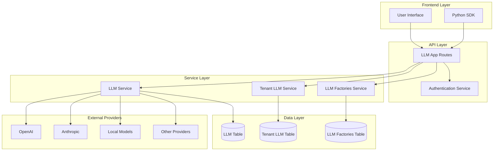
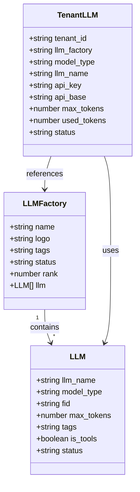
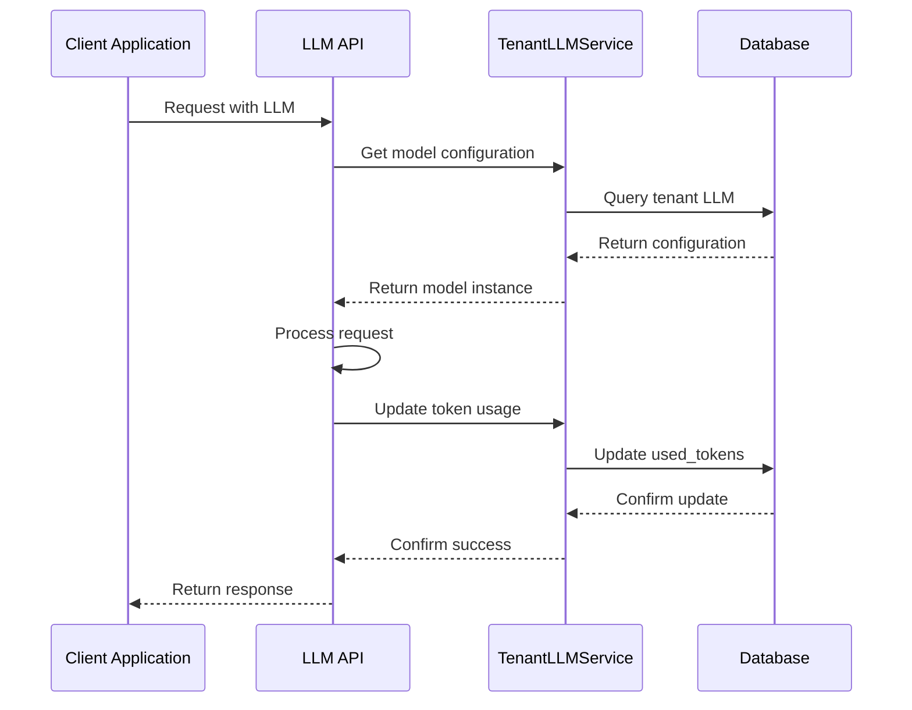
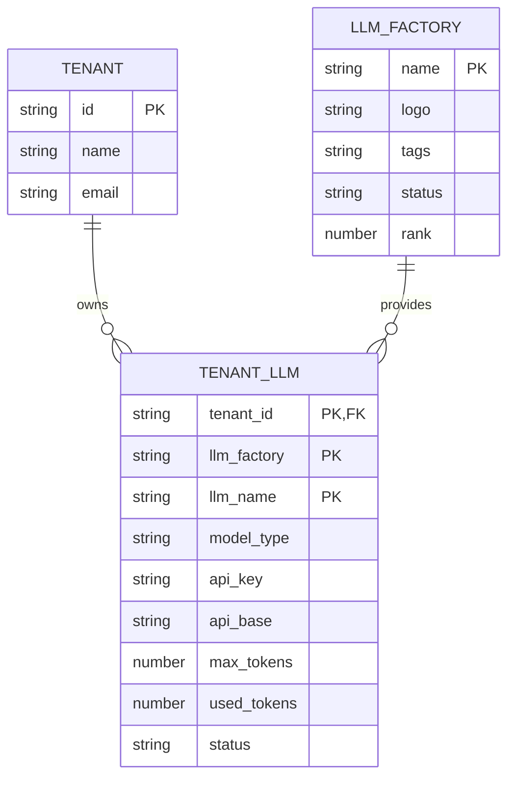

# LLM Integration API

<cite>
**Referenced Files in This Document**
- [llm_app.py](file://api/apps/llm_app.py)
- [llm_service.py](file://api/db/services/llm_service.py)
- [tenant_llm_service.py](file://api/db/services/tenant_llm_service.py)
- [db_models.py](file://api/db/db_models.py)
- [llm_factories.json](file://conf/llm_factories.json)
- [settings.py](file://common/settings.py)
- [llm.ts](file://web/src/interfaces/request/llm.ts)
- [llm.ts](file://web/src/constants/llm.ts)
- [hooks.tsx](file://web/src/pages/user-setting/setting-model/hooks.tsx)
- [ollama-modal/index.tsx](file://web/src/pages/user-setting/setting-model/modal/ollama-modal/index.tsx)
</cite>

## Table of Contents
1. [Introduction](#introduction)
2. [Architecture Overview](#architecture-overview)
3. [LLM Provider Management](#llm-provider-management)
4. [API Endpoints](#api-endpoints)
5. [Configuration Parameters](#configuration-parameters)
6. [Authentication and Security](#authentication-and-security)
7. [Model Types and Capabilities](#model-types-and-capabilities)
8. [Tenant Scoping](#tenant-scoping)
9. [Integration Examples](#integration-examples)
10. [Error Handling](#error-handling)
11. [Best Practices](#best-practices)

## Introduction

RAGFlow provides a comprehensive LLM (Large Language Model) integration and management system that supports multiple LLM providers, custom endpoints, and tenant-scoped configurations. The system enables seamless integration with popular LLM services including OpenAI, Anthropic, local models, and various cloud providers while maintaining security, performance, and flexibility.

The LLM integration API allows developers to:
- Register and configure multiple LLM providers
- Manage API keys securely across tenants
- Test LLM connectivity and validate configurations
- Retrieve available models and their capabilities
- Set default models for different use cases
- Monitor token usage and manage quotas

## Architecture Overview

RAGFlow's LLM integration follows a modular architecture with clear separation of concerns:



**Diagram sources**
- [llm_app.py](file://api/apps/llm_app.py#L32-L374)
- [llm_service.py](file://api/db/services/llm_service.py#L30-L430)
- [tenant_llm_service.py](file://api/db/services/tenant_llm_service.py#L32-L269)

## LLM Provider Management

### Supported LLM Providers

RAGFlow supports a wide range of LLM providers out of the box:

| Provider | Type | Authentication | Special Features |
|----------|------|----------------|------------------|
| OpenAI | Chat, Embedding, TTS, Speech2Text | API Key | Vision, Tools, Streaming |
| Anthropic | Chat, Image2Text | API Key | Reasoning, Safety |
| Azure OpenAI | Chat, Embedding | API Key + Version | Enterprise, Regional |
| Google Cloud | Chat, Embedding | Service Account | Multimodal, Batch |
| LocalAI | Chat, Embedding | Custom | Self-hosted |
| Ollama | Chat, Embedding | None | Local deployment |
| HuggingFace | Chat, Embedding, Rerank | API Token | Open source models |
| VLLM | Chat, Embedding | Custom | High-performance inference |

### Provider Configuration

Each LLM provider requires specific configuration parameters:



**Diagram sources**
- [db_models.py](file://api/db/db_models.py#L683-L718)
- [llm_factories.json](file://conf/llm_factories.json#L1-L50)

**Section sources**
- [llm_factories.json](file://conf/llm_factories.json#L1-L800)
- [db_models.py](file://api/db/db_models.py#L683-L718)

## API Endpoints

### Get Available LLM Factories

**Endpoint:** `GET /llm/factories`

Retrieves all available LLM factories and their supported model types.

**Response:**
```json
{
  "retcode": 0,
  "retmsg": "success",
  "data": [
    {
      "name": "OpenAI",
      "logo": "",
      "tags": "LLM,TEXT EMBEDDING,TTS,TEXT RE-RANK,SPEECH2TEXT,MODERATION",
      "status": "1",
      "rank": "999",
      "model_types": ["chat", "embedding", "tts", "speech2text", "rerank"]
    }
  ]
}
```

### Add LLM Provider

**Endpoint:** `POST /llm/add_llm`

Adds a new LLM provider with authentication credentials.

**Request Body:**
```json
{
  "llm_factory": "OpenAI",
  "llm_name": "gpt-4",
  "model_type": "chat",
  "api_key": "sk-...",
  "api_base": "https://api.openai.com/v1",
  "max_tokens": 8192
}
```

**Response:**
```json
{
  "retcode": 0,
  "retmsg": "success",
  "data": true
}
```

### Set API Key

**Endpoint:** `POST /llm/set_api_key`

Tests and sets API keys for LLM providers.

**Request Body:**
```json
{
  "llm_factory": "OpenAI",
  "api_key": "sk-..."
}
```

**Response:**
```json
{
  "retcode": 0,
  "retmsg": "success",
  "data": true
}
```

### Delete LLM Provider

**Endpoint:** `POST /llm/delete_llm`

Removes an LLM provider configuration.

**Request Body:**
```json
{
  "llm_factory": "OpenAI",
  "llm_name": "gpt-4"
}
```

**Response:**
```json
{
  "retcode": 0,
  "retmsg": "success",
  "data": true
}
```

### Enable/Disable LLM Provider

**Endpoint:** `POST /llm/enable_llm`

Enables or disables an LLM provider.

**Request Body:**
```json
{
  "llm_factory": "OpenAI",
  "llm_name": "gpt-4",
  "status": "1" // 1 for enabled, 0 for disabled
}
```

**Response:**
```json
{
  "retcode": 0,
  "retmsg": "success",
  "data": true
}
```

### List Available Models

**Endpoint:** `GET /llm/list`

Lists all available models for the current tenant.

**Query Parameters:**
- `model_type`: Filter by model type (optional)

**Response:**
```json
{
  "retcode": 0,
  "retmsg": "success",
  "data": {
    "OpenAI": [
      {
        "llm_name": "gpt-4",
        "model_type": "chat",
        "fid": "OpenAI",
        "available": true,
        "status": "1"
      }
    ]
  }
}
```

### Get My LLMs

**Endpoint:** `GET /llm/my_llms`

Retrieves all LLM providers configured for the current tenant.

**Query Parameters:**
- `include_details`: Include detailed information (true/false)

**Response:**
```json
{
  "retcode": 0,
  "retmsg": "success",
  "data": {
    "OpenAI": {
      "tags": "LLM,TEXT EMBEDDING,TTS,TEXT RE-RANK,SPEECH2TEXT,MODERATION",
      "llm": [
        {
          "type": "chat",
          "name": "gpt-4",
          "used_token": 1000,
          "api_base": "https://api.openai.com/v1",
          "max_tokens": 8192,
          "status": "1"
        }
      ]
    }
  }
}
```

**Section sources**
- [llm_app.py](file://api/apps/llm_app.py#L32-L374)

## Configuration Parameters

### Model Type Specifications

RAGFlow supports multiple LLM model types, each with specific configuration requirements:

| Model Type | Description | Required Parameters | Optional Parameters |
|------------|-------------|-------------------|-------------------|
| `chat` | Conversational AI models | `llm_name`, `api_key` | `api_base`, `max_tokens` |
| `embedding` | Text embedding models | `llm_name`, `api_key` | `api_base`, `max_tokens` |
| `rerank` | Re-ranking models | `llm_name`, `api_key` | `api_base` |
| `image2text` | Vision models | `llm_name`, `api_key` | `api_base` |
| `speech2text` | ASR models | `llm_name`, `api_key` | `api_base` |
| `tts` | Text-to-speech models | `llm_name`, `api_key` | `api_base` |

### Provider-Specific Authentication

Different LLM providers require specific authentication methods:

#### OpenAI Compatible APIs
```json
{
  "llm_factory": "OpenAI-API-Compatible",
  "llm_name": "custom-model",
  "model_type": "chat",
  "api_key": "your-api-key",
  "api_base": "https://api.your-provider.com/v1"
}
```

#### Azure OpenAI
```json
{
  "llm_factory": "Azure-OpenAI",
  "llm_name": "gpt-4",
  "model_type": "chat",
  "api_key": "{\"api_key\": \"your-key\", \"api_version\": \"2024-02-15-preview\"}",
  "api_base": "https://your-resource.openai.azure.com/"
}
```

#### Google Cloud
```json
{
  "llm_factory": "Google Cloud",
  "llm_name": "gemini-pro",
  "model_type": "chat",
  "api_key": "{\"google_project_id\": \"your-project\", \"google_region\": \"us-central1\", \"google_service_account_key\": \"...\"}"
}
```

#### Local Models
```json
{
  "llm_factory": "Ollama",
  "llm_name": "llama2",
  "model_type": "chat",
  "api_base": "http://localhost:11434"
}
```

**Section sources**
- [llm_app.py](file://api/apps/llm_app.py#L122-L294)
- [llm.ts](file://web/src/interfaces/request/llm.ts#L1-L13)

## Authentication and Security

### API Key Management

RAGFlow implements secure API key management with the following features:

1. **Encryption**: API keys are encrypted before storage
2. **Scoping**: Keys are scoped to individual tenants
3. **Validation**: Automatic validation during configuration
4. **Testing**: Built-in connectivity testing

### Security Best Practices

1. **Never expose API keys in logs or error messages**
2. **Use environment variables for sensitive configuration**
3. **Rotate API keys regularly**
4. **Monitor token usage per model**
5. **Implement rate limiting**

### Token Usage Tracking

RAGFlow tracks token usage per tenant and model:



**Diagram sources**
- [tenant_llm_service.py](file://api/db/services/tenant_llm_service.py#L174-L211)

**Section sources**
- [tenant_llm_service.py](file://api/db/services/tenant_llm_service.py#L174-L211)

## Model Types and Capabilities

### Chat Models

Support conversational AI with:
- **Streaming responses**: Real-time message delivery
- **Tool calling**: Integration with external tools
- **Vision capabilities**: Image understanding
- **Reasoning**: Advanced cognitive functions

### Embedding Models

Provide text embedding capabilities for:
- **Semantic search**: Similarity-based document retrieval
- **Clustering**: Document grouping
- **Classification**: Content categorization
- **Reranking**: Result ranking improvement

### Specialized Models

#### Image-to-Text Models
- Vision language models
- Document analysis
- Scene understanding
- OCR capabilities

#### Speech-to-Text Models
- Audio transcription
- Real-time streaming
- Multi-language support
- Speaker diarization

#### Text-to-Speech Models
- Voice synthesis
- Natural speech quality
- Multiple languages
- Custom voice cloning

**Section sources**
- [llm_factories.json](file://conf/llm_factories.json#L1-L800)

## Tenant Scoping

### Multi-Tenant Architecture

RAGFlow implements tenant-scoped LLM management, ensuring:

1. **Isolation**: Each tenant has separate LLM configurations
2. **Security**: API keys are not shared between tenants
3. **Customization**: Different tenants can use different providers
4. **Quota Management**: Token usage tracked per tenant

### Tenant Configuration Example



**Diagram sources**
- [db_models.py](file://api/db/db_models.py#L702-L718)

### Cross-Tenant Considerations

While LLM configurations are tenant-scoped, certain models can be shared:

1. **Built-in models**: Internal RAGFlow models
2. **Self-hosted models**: Locally deployed models
3. **Public APIs**: Models with public access

**Section sources**
- [tenant_llm_service.py](file://api/db/services/tenant_llm_service.py#L32-L269)

## Integration Examples

### Adding OpenAI Chat Model

```python
import requests

# Add OpenAI chat model
response = requests.post(
    "http://localhost:9380/llm/add_llm",
    json={
        "llm_factory": "OpenAI",
        "llm_name": "gpt-4",
        "model_type": "chat",
        "api_key": "sk-your-openai-key",
        "max_tokens": 8192
    },
    headers={"Authorization": "Bearer your-api-token"}
)

print(response.json())
```

### Testing LLM Connectivity

```python
# Test OpenAI API key
response = requests.post(
    "http://localhost:9380/llm/set_api_key",
    json={
        "llm_factory": "OpenAI",
        "api_key": "sk-your-openai-key"
    },
    headers={"Authorization": "Bearer your-api-token"}
)

if response.json()["retcode"] == 0:
    print("API key is valid")
else:
    print("API key validation failed:", response.json()["retmsg"])
```

### Retrieving Available Models

```python
# Get all available models
response = requests.get(
    "http://localhost:9380/llm/list",
    params={"model_type": "chat"},
    headers={"Authorization": "Bearer your-api-token"}
)

models = response.json()["data"]
for factory, model_list in models.items():
    print(f"Provider: {factory}")
    for model in model_list:
        print(f"  - {model['llm_name']} ({model['model_type']})")
```

### Python SDK Example

```python
from ragflow_sdk import RagFlow

# Initialize client
client = RagFlow(api_key="your-api-key", base_url="http://localhost:9380")

# Get available factories
factories = client.llm.factories()
print("Available LLM factories:", [f["name"] for f in factories])

# Add a new LLM provider
client.llm.add_llm(
    llm_factory="OpenAI",
    llm_name="gpt-4",
    model_type="chat",
    api_key="sk-your-key"
)

# List tenant's LLMs
my_llms = client.llm.my_llms(include_details=True)
print("Your LLM configurations:", my_llms)
```

**Section sources**
- [llm_app.py](file://api/apps/llm_app.py#L122-L294)

## Error Handling

### Common Error Responses

#### Invalid API Key
```json
{
  "retcode": 1,
  "retmsg": "Fail to access model(GPT-4) using this api key.",
  "data": null
}
```

#### Unsupported Model Type
```json
{
  "retcode": 1,
  "retmsg": "Chat model from OpenAI is not supported yet.",
  "data": null
}
```

#### Missing Required Parameters
```json
{
  "retcode": 1,
  "retmsg": "Missing required parameter: llm_factory",
  "data": null
}
```

### Error Recovery Strategies

1. **Retry Logic**: Implement exponential backoff for transient failures
2. **Fallback Models**: Configure backup models for critical operations
3. **Graceful Degradation**: Reduce functionality when LLM services are unavailable
4. **Monitoring**: Alert on persistent LLM integration failures

### Validation Rules

1. **API Key Format**: Validate API key format for each provider
2. **Model Availability**: Check if model exists in provider catalog
3. **Token Limits**: Verify max_tokens against provider limits
4. **Rate Limits**: Respect provider rate limiting policies

**Section sources**
- [llm_app.py](file://api/apps/llm_app.py#L52-L119)

## Best Practices

### Configuration Management

1. **Environment Variables**: Store sensitive configuration in environment variables
2. **Configuration Validation**: Validate all configurations before saving
3. **Version Control**: Track LLM configuration changes
4. **Backup Strategy**: Regular backups of LLM configurations

### Performance Optimization

1. **Connection Pooling**: Reuse connections for better performance
2. **Caching**: Cache frequently accessed model configurations
3. **Async Operations**: Use asynchronous calls for non-blocking operations
4. **Batch Processing**: Group requests when possible

### Security Considerations

1. **Least Privilege**: Grant minimal necessary permissions
2. **Audit Logging**: Log all LLM configuration changes
3. **Access Control**: Restrict who can modify LLM configurations
4. **Network Security**: Use HTTPS for all LLM communications

### Monitoring and Maintenance

1. **Token Usage**: Monitor token consumption trends
2. **Response Times**: Track LLM response latency
3. **Error Rates**: Monitor failure rates by provider
4. **Cost Tracking**: Track LLM costs by tenant/provider

### Development Workflow

1. **Testing Environment**: Use separate LLM configurations for development
2. **Staging Validation**: Test new configurations in staging first
3. **Gradual Rollout**: Deploy new LLM configurations gradually
4. **Rollback Plan**: Have rollback procedures for failed deployments

### Integration Patterns

1. **Provider Abstraction**: Use abstraction layers for LLM providers
2. **Circuit Breaker**: Implement circuit breaker patterns for reliability
3. **Load Balancing**: Distribute requests across multiple providers
4. **Health Checks**: Regular health checks for LLM services

**Section sources**
- [llm_service.py](file://api/db/services/llm_service.py#L30-L430)
- [tenant_llm_service.py](file://api/db/services/tenant_llm_service.py#L32-L269)