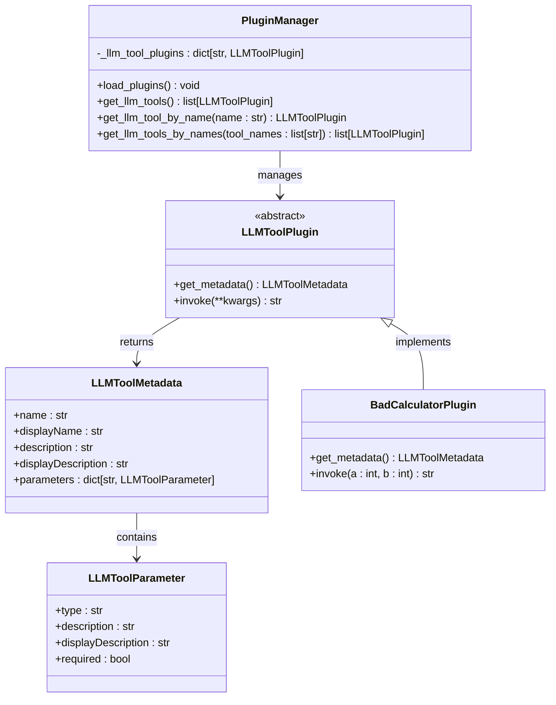
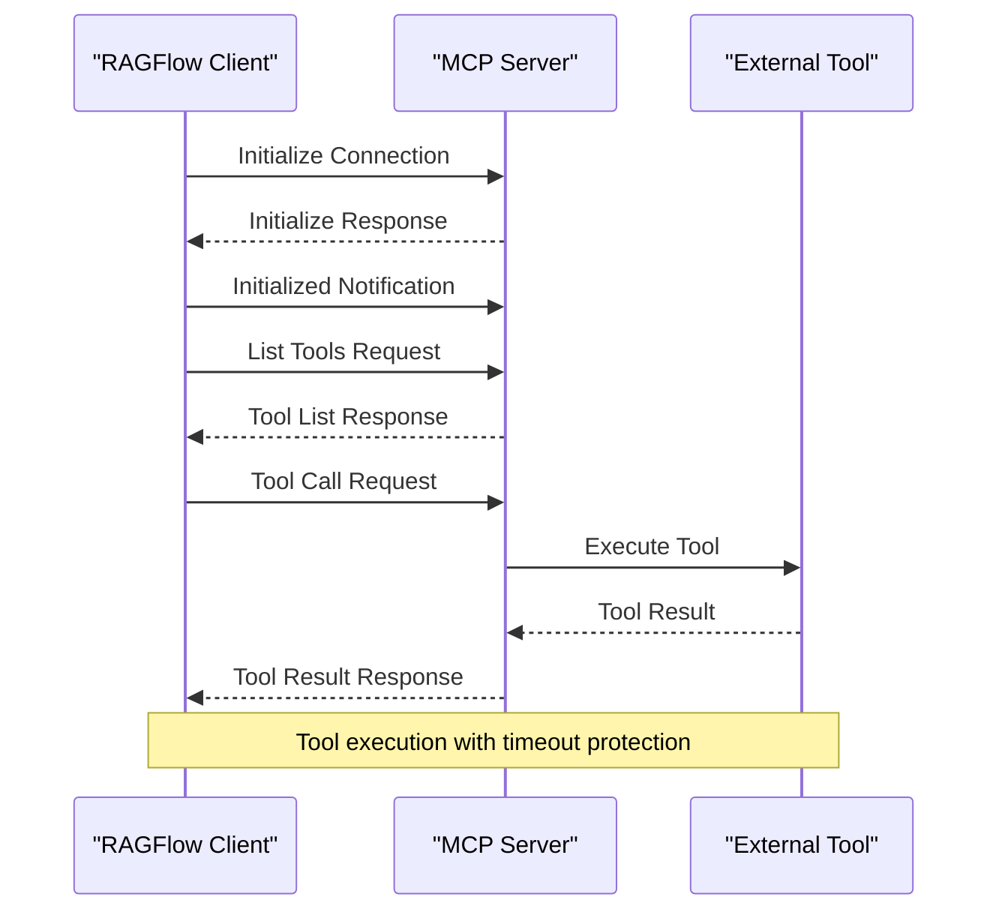
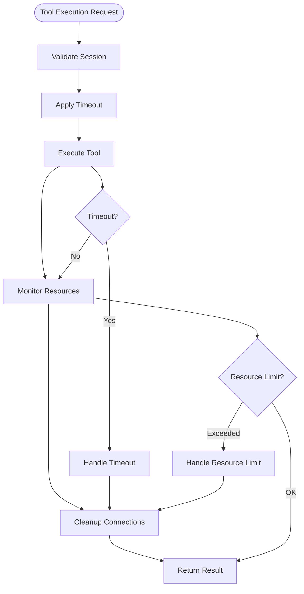

# Plugin & MCP API

<cite>
**Referenced Files in This Document**
- [plugin_app.py](file://api/apps/plugin_app.py)
- [mcp_server_app.py](file://api/apps/mcp_server_app.py)
- [plugin_manager.py](file://plugin/plugin_manager.py)
- [llm_tool_plugin.py](file://plugin/llm_tool_plugin.py)
- [common.py](file://plugin/common.py)
- [bad_calculator.py](file://plugin/embedded_plugins/llm_tools/bad_calculator.py)
- [mcp_tool_call_conn.py](file://common/mcp_tool_call_conn.py)
- [mcp_server_service.py](file://api/db/services/mcp_server_service.py)
- [constants.py](file://common/constants.py)
- [api_utils.py](file://api/utils/api_utils.py)
- [mcp.ts](file://web/src/interfaces/database/mcp.ts)
- [mcp-server-service.ts](file://web/src/services/mcp-server-service.ts)
- [edit-mcp-form.tsx](file://web/src/pages/user-setting/mcp/edit-mcp-form.tsx)
- [tool-card.tsx](file://web/src/pages/profile-setting/mcp/tool-card.tsx)
</cite>

## Table of Contents
1. [Introduction](#introduction)
2. [Plugin System Architecture](#plugin-system-architecture)
3. [Model Context Protocol (MCP) Server](#model-context-protocol-mcp-server)
4. [Plugin Management APIs](#plugin-management-apis)
5. [MCP Server Management APIs](#mcp-server-management-apis)
6. [Tool Discovery and Execution](#tool-discovery-and-execution)
7. [Security Considerations](#security-considerations)
8. [Integration Examples](#integration-examples)
9. [Best Practices](#best-practices)
10. [Troubleshooting](#troubleshooting)

## Introduction

RAGFlow provides a comprehensive plugin system and Model Context Protocol (MCP) server integration that enables seamless integration of external tools and services. The system supports two primary integration mechanisms:

- **Plugin System**: Embedded LLM tools that extend RAGFlow's capabilities with custom functionality
- **MCP Server Integration**: Communication with external tools using the standardized Model Context Protocol

This documentation covers the complete API surface for managing plugins and MCP servers, including registration, configuration, lifecycle management, and secure execution of external tools.

## Plugin System Architecture

The plugin system in RAGFlow is built around a modular architecture that supports LLM tools as plugins. The system provides a standardized interface for integrating custom functionality.



**Diagram sources**
- [plugin_manager.py](file://plugin/plugin_manager.py#L11-L46)
- [llm_tool_plugin.py](file://plugin/llm_tool_plugin.py#L22-L52)
- [bad_calculator.py](file://plugin/embedded_plugins/llm_tools/bad_calculator.py#L5-L38)

### Core Components

The plugin system consists of several key components:

1. **Plugin Manager**: Central orchestrator for plugin lifecycle management
2. **LLM Tool Plugins**: Abstract base class for LLM-compatible tools
3. **Metadata System**: Standardized tool description and parameter definition
4. **Embedded Plugins**: Built-in tools included with the system

**Section sources**
- [plugin_manager.py](file://plugin/plugin_manager.py#L11-L46)
- [llm_tool_plugin.py](file://plugin/llm_tool_plugin.py#L22-L52)

## Model Context Protocol (MCP) Server

The MCP server integration provides standardized communication with external tools and services. RAGFlow supports multiple MCP server types and implements robust session management for tool execution.



**Diagram sources**
- [mcp_tool_call_conn.py](file://common/mcp_tool_call_conn.py#L59-L114)
- [mcp_server_app.py](file://api/apps/mcp_server_app.py#L354-L377)

### Supported MCP Server Types

RAGFlow supports the following MCP server types:

| Server Type | Description | Transport |
|-------------|-------------|-----------|
| `sse` | Server-Sent Events | Real-time streaming |
| `streamable-http` | HTTP streaming | HTTP-based streaming |

**Section sources**
- [constants.py](file://common/constants.py#L138-L142)

## Plugin Management APIs

### List Available LLM Tools

Retrieves metadata for all registered LLM tools.

**Endpoint**: `GET /api/v1/plugin/llm_tools`

**Response Schema**:
```json
{
  "code": 0,
  "data": [
    {
      "name": "tool_name",
      "displayName": "Tool Display Name",
      "description": "Tool description",
      "displayDescription": "Display description",
      "parameters": {
        "param_name": {
          "type": "string",
          "description": "Parameter description",
          "displayDescription": "Display parameter description",
          "required": true
        }
      }
    }
  ]
}
```

**Implementation Details**:
- Returns metadata for all loaded LLM tools
- Uses the global plugin manager singleton
- Filters tools by current user context

**Section sources**
- [plugin_app.py](file://api/apps/plugin_app.py#L24-L30)

## MCP Server Management APIs

### List MCP Servers

Retrieves all MCP servers configured for the current tenant.

**Endpoint**: `POST /api/v1/mcp_server/list`

**Request Parameters**:
- `keywords`: Search keywords (optional)
- `page`: Page number (optional)
- `page_size`: Items per page (optional)
- `orderby`: Sort field (default: create_time)
- `desc`: Descending order flag (default: true)

**Response Schema**:
```json
{
  "code": 0,
  "data": {
    "mcp_servers": [
      {
        "id": "server_id",
        "name": "Server Name",
        "server_type": "sse",
        "url": "http://localhost:9382",
        "variables": {},
        "create_date": "2024-01-01T00:00:00Z",
        "update_date": "2024-01-01T00:00:00Z"
      }
    ],
    "total": 1
  }
}
```

### Create MCP Server

Registers a new MCP server with the system.

**Endpoint**: `POST /api/v1/mcp_server/create`

**Request Body**:
```json
{
  "name": "Server Name",
  "url": "http://localhost:9382",
  "server_type": "sse",
  "headers": {
    "Authorization": "Bearer token"
  },
  "variables": {
    "custom_param": "value"
  }
}
```

**Validation Rules**:
- Server name must be unique per tenant
- URL must be valid and reachable
- Server type must be in `VALID_MCP_SERVER_TYPES`
- Maximum name length: 255 UTF-8 bytes

### Update MCP Server

Modifies an existing MCP server configuration.

**Endpoint**: `POST /api/v1/mcp_server/update`

**Request Body**:
```json
{
  "mcp_id": "server_id",
  "name": "Updated Name",
  "url": "http://localhost:9382",
  "server_type": "sse",
  "headers": {},
  "variables": {}
}
```

### Delete MCP Servers

Removes one or more MCP servers from the system.

**Endpoint**: `POST /api/v1/mcp_server/rm`

**Request Body**:
```json
{
  "mcp_ids": ["server_id_1", "server_id_2"]
}
```

### Import MCP Servers

Bulk import multiple MCP servers from a configuration file.

**Endpoint**: `POST /api/v1/mcp_server/import`

**Request Body**:
```json
{
  "mcpServers": {
    "server_name": {
      "type": "sse",
      "url": "http://localhost:9382",
      "authorization_token": "token"
    }
  }
}
```

### Export MCP Servers

Exports MCP server configurations for backup or sharing.

**Endpoint**: `POST /api/v1/mcp_server/export`

**Request Body**:
```json
{
  "mcp_ids": ["server_id_1", "server_id_2"]
}
```

**Section sources**
- [mcp_server_app.py](file://api/apps/mcp_server_app.py#L30-L198)

## Tool Discovery and Execution

### List Available Tools

Retrieves the list of tools available from one or more MCP servers.

**Endpoint**: `POST /api/v1/mcp_server/list_tools`

**Request Body**:
```json
{
  "mcp_ids": ["server_id_1", "server_id_2"],
  "timeout": 10
}
```

**Response Schema**:
```json
{
  "code": 0,
  "data": {
    "server_id_1": [
      {
        "name": "tool_name",
        "description": "Tool description",
        "inputSchema": {
          "type": "object",
          "properties": {
            "param_name": {
              "type": "string",
              "description": "Parameter description"
            }
          },
          "required": ["param_name"]
        },
        "enabled": true
      }
    ]
  }
}
```

### Test Tool Execution

Validates tool functionality by executing a test call.

**Endpoint**: `POST /api/v1/mcp_server/test_tool`

**Request Body**:
```json
{
  "mcp_id": "server_id",
  "tool_name": "tool_name",
  "arguments": {
    "param_name": "value"
  },
  "timeout": 10
}
```

### Cache Tool Configurations

Stores tool configurations for later use.

**Endpoint**: `POST /api/v1/mcp_server/cache_tools`

**Request Body**:
```json
{
  "mcp_id": "server_id",
  "tools": [
    {
      "name": "tool_name",
      "description": "Tool description",
      "inputSchema": {},
      "enabled": true
    }
  ]
}
```

### Test MCP Server Connectivity

Verifies connectivity and retrieves available tools from an MCP server.

**Endpoint**: `POST /api/v1/mcp_server/test_mcp`

**Request Body**:
```json
{
  "url": "http://localhost:9382",
  "server_type": "sse",
  "headers": {},
  "variables": {},
  "timeout": 10
}
```

**Section sources**
- [mcp_server_app.py](file://api/apps/mcp_server_app.py#L299-L442)

## Security Considerations

### Tool Execution Security

RAGFlow implements several security measures for executing external tools:

1. **Session Isolation**: Each tool execution runs in isolated sessions
2. **Timeout Protection**: All tool calls have configurable timeouts
3. **Resource Limits**: Memory and execution time limits prevent abuse
4. **Connection Management**: Proper cleanup of connections and resources



**Diagram sources**
- [mcp_tool_call_conn.py](file://common/mcp_tool_call_conn.py#L153-L176)
- [mcp_tool_call_conn.py](file://common/mcp_tool_call_conn.py#L205-L219)

### Permission Management

- **Tenant Isolation**: Each tenant has separate MCP server configurations
- **User Authentication**: All API endpoints require authentication
- **Resource Access Control**: Tools are scoped to user permissions

### Best Practices for Secure Tool Integration

1. **Validate Inputs**: Always validate tool arguments before execution
2. **Set Reasonable Timeouts**: Configure appropriate timeout values
3. **Monitor Resource Usage**: Track memory and CPU consumption
4. **Implement Retry Logic**: Handle transient failures gracefully
5. **Log Tool Interactions**: Maintain audit trails for security monitoring

**Section sources**
- [mcp_tool_call_conn.py](file://common/mcp_tool_call_conn.py#L267-L305)

## Integration Examples

### Registering a Custom Plugin

```python
# Example plugin implementation
from plugin.llm_tool_plugin import LLMToolPlugin, LLMToolMetadata

class CustomCalculatorPlugin(LLMToolPlugin):
    @classmethod
    def get_metadata(cls) -> LLMToolMetadata:
        return {
            "name": "custom_calculator",
            "displayName": "Custom Calculator",
            "description": "Performs mathematical calculations",
            "displayDescription": "A powerful calculator tool",
            "parameters": {
                "expression": {
                    "type": "string",
                    "description": "Mathematical expression to evaluate",
                    "displayDescription": "Expression to calculate",
                    "required": True
                }
            }
        }
    
    def invoke(self, expression: str) -> str:
        # Implementation here
        return str(eval(expression))
```

### Configuring an MCP Server

```javascript
// JavaScript example for MCP server configuration
const mcpConfig = {
  name: "My External Tool",
  url: "http://localhost:9382",
  server_type: "sse",
  headers: {
    Authorization: "Bearer your-token-here"
  },
  variables: {
    api_key: "your-api-key",
    timeout: 30
  }
};

// API call to create MCP server
fetch('/api/v1/mcp_server/create', {
  method: 'POST',
  headers: { 'Content-Type': 'application/json' },
  body: JSON.stringify(mcpConfig)
});
```

### Invoking Tool Functions

```javascript
// JavaScript example for tool invocation
const toolCall = {
  mcp_id: "server_id",
  tool_name: "calculator",
  arguments: {
    expression: "2 + 2"
  },
  timeout: 10
};

fetch('/api/v1/mcp_server/test_tool', {
  method: 'POST',
  headers: { 'Content-Type': 'application/json' },
  body: JSON.stringify(toolCall)
});
```

## Best Practices

### Plugin Development

1. **Follow Metadata Standards**: Use consistent parameter naming and descriptions
2. **Implement Error Handling**: Gracefully handle exceptions and invalid inputs
3. **Document Thoroughly**: Provide clear descriptions and examples
4. **Test Extensively**: Validate functionality across different scenarios
5. **Version Control**: Maintain backward compatibility when updating plugins

### MCP Server Configuration

1. **Secure Authentication**: Use appropriate authentication mechanisms
2. **Environment Variables**: Store sensitive configuration in environment variables
3. **Health Monitoring**: Implement health checks for server availability
4. **Rate Limiting**: Apply rate limiting to prevent abuse
5. **Logging**: Enable comprehensive logging for debugging and monitoring

### Tool Execution

1. **Timeout Configuration**: Set appropriate timeouts based on tool complexity
2. **Resource Monitoring**: Track resource usage and implement limits
3. **Error Recovery**: Implement retry logic for transient failures
4. **Session Management**: Properly manage session lifecycle
5. **Security Validation**: Validate all inputs before tool execution

## Troubleshooting

### Common Issues

#### Plugin Loading Failures
- **Cause**: Invalid plugin metadata or missing dependencies
- **Solution**: Verify plugin metadata structure and dependencies
- **Debug**: Check plugin manager logs for specific errors

#### MCP Server Connection Issues
- **Cause**: Network connectivity or authentication problems
- **Solution**: Verify URL accessibility and authentication credentials
- **Debug**: Test server connectivity independently

#### Tool Execution Timeouts
- **Cause**: Long-running tool operations or network delays
- **Solution**: Increase timeout values or optimize tool implementation
- **Debug**: Monitor tool execution times and resource usage

#### Permission Denied Errors
- **Cause**: Insufficient user permissions or tenant isolation issues
- **Solution**: Verify user permissions and tenant associations
- **Debug**: Check authentication tokens and user context

### Diagnostic Tools

1. **Health Checks**: Use `/api/v1/mcp_server/test_mcp` to verify server connectivity
2. **Tool Testing**: Use `/api/v1/mcp_server/test_tool` to validate individual tool functionality
3. **Session Monitoring**: Monitor active sessions and resource usage
4. **Error Logging**: Review detailed error messages in logs

### Performance Optimization

1. **Connection Pooling**: Reuse connections when possible
2. **Caching**: Cache tool configurations and metadata
3. **Async Operations**: Use asynchronous execution for non-blocking operations
4. **Resource Limits**: Implement appropriate resource limits
5. **Monitoring**: Track performance metrics and optimize bottlenecks

**Section sources**
- [mcp_tool_call_conn.py](file://common/mcp_tool_call_conn.py#L267-L305)