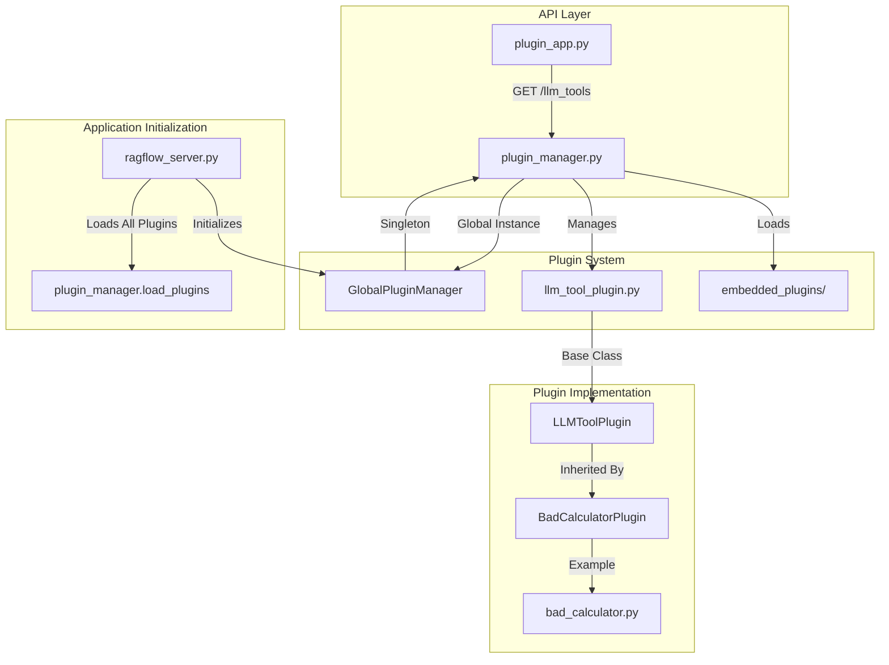
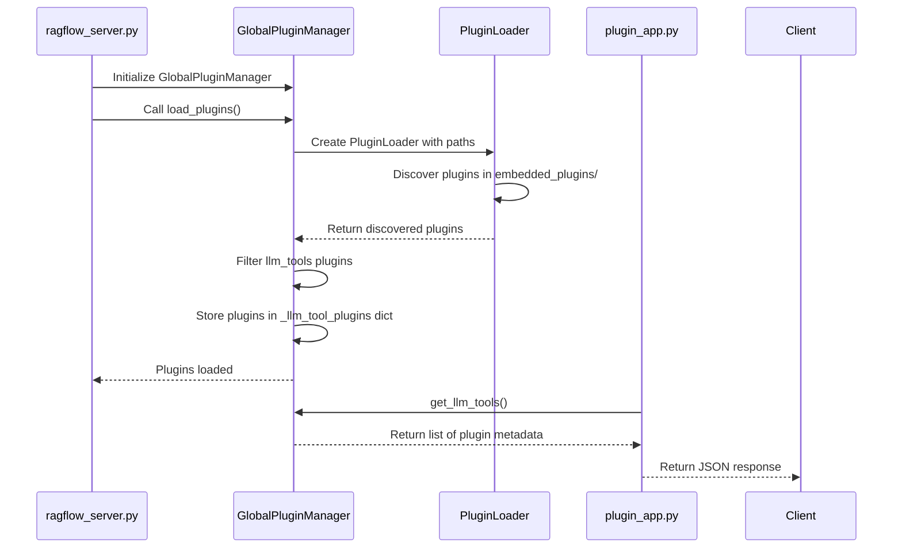
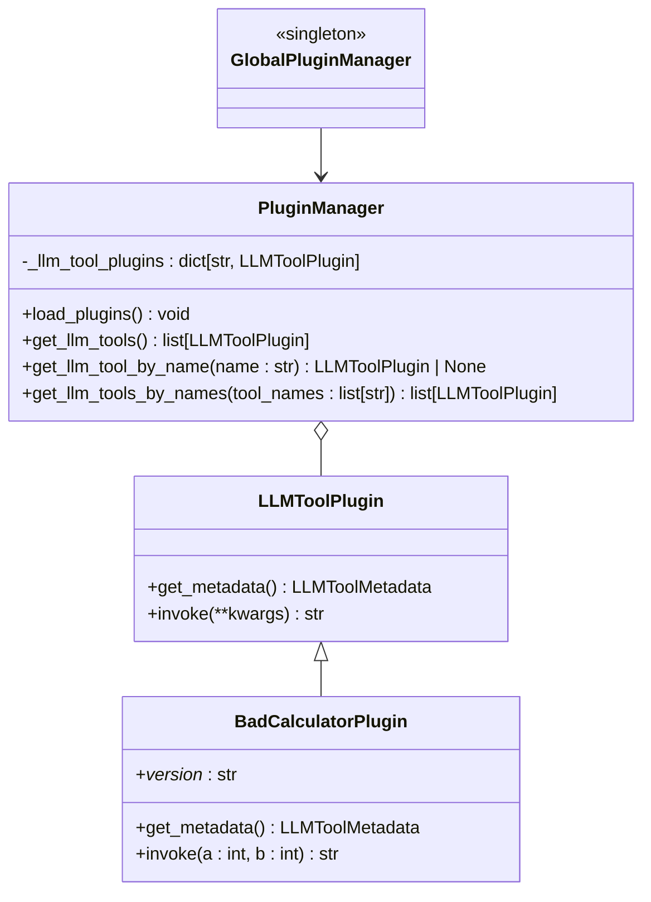

# Plugin API

<cite>
**Referenced Files in This Document**   
- [plugin_app.py](file://api/apps/plugin_app.py)
- [plugin_manager.py](file://plugin/plugin_manager.py)
- [llm_tool_plugin.py](file://plugin/llm_tool_plugin.py)
- [bad_calculator.py](file://plugin/embedded_plugins/llm_tools/bad_calculator.py)
- [ragflow_server.py](file://api/ragflow_server.py)
- [__init__.py](file://plugin/__init__.py)
</cite>

## Table of Contents
1. [Introduction](#introduction)
2. [Plugin Architecture Overview](#plugin-architecture-overview)
3. [Plugin Lifecycle and State Management](#plugin-lifecycle-and-state-management)
4. [Plugin Management Endpoints](#plugin-management-endpoints)
5. [Request/Response Schemas](#requestresponse-schemas)
6. [Custom LLM Tool Plugin Implementation](#custom-llm-tool-plugin-implementation)
7. [Plugin Integration with Agents](#plugin-integration-with-agents)
8. [Security Considerations](#security-considerations)
9. [Error Handling and Status Codes](#error-handling-and-status-codes)

## Introduction
The RAGFlow plugin system provides a flexible framework for extending the platform's capabilities through LLM tool plugins. These plugins enable integration with external services, custom calculations, and specialized functionality that can be invoked by agents during their execution. The plugin API exposes endpoints for discovering available plugins, understanding their capabilities, and managing their lifecycle within the system. This documentation details the API endpoints, data structures, and integration patterns for working with the plugin system.

## Plugin Architecture Overview



**Diagram sources**
- [plugin_app.py](file://api/apps/plugin_app.py#L24-L30)
- [plugin_manager.py](file://plugin/plugin_manager.py#L11-L46)
- [llm_tool_plugin.py](file://plugin/llm_tool_plugin.py#L22-L30)
- [ragflow_server.py](file://api/ragflow_server.py#L130)
- [__init__.py](file://plugin/__init__.py#L3)

**Section sources**
- [plugin_app.py](file://api/apps/plugin_app.py#L1-L31)
- [plugin_manager.py](file://plugin/plugin_manager.py#L1-L46)

## Plugin Lifecycle and State Management
The plugin lifecycle in RAGFlow is managed through a centralized PluginManager that handles the loading, registration, and availability of plugins. During application startup, the GlobalPluginManager instance automatically loads all plugins from the designated plugin directories. The plugin manager maintains an in-memory registry of available LLM tool plugins, making them accessible to the API endpoints and agent system.

Plugins are stateless components that are loaded once at startup and remain available for the duration of the application's lifecycle. The PluginManager uses the pluginlib library to discover and load plugins from the `plugin/embedded_plugins` directory, specifically looking for plugins of type "llm_tools". Each plugin is instantiated and its metadata is cached in the manager's internal dictionary, allowing for efficient retrieval when requested by the API or agent system.

The lifecycle begins with the application startup in `ragflow_server.py`, where `GlobalPluginManager.load_plugins()` is called to initialize all available plugins. Once loaded, plugins remain in memory and are served through the API endpoints without requiring re-initialization. This design ensures consistent performance and availability of plugin metadata throughout the application's runtime.



**Diagram sources**
- [ragflow_server.py](file://api/ragflow_server.py#L130)
- [plugin_manager.py](file://plugin/plugin_manager.py#L17-L31)
- [plugin_app.py](file://api/apps/plugin_app.py#L27-L30)

**Section sources**
- [plugin_manager.py](file://plugin/plugin_manager.py#L17-L31)
- [ragflow_server.py](file://api/ragflow_server.py#L130)

## Plugin Management Endpoints
The plugin system exposes a single primary endpoint for managing and discovering LLM tool plugins. This endpoint provides read-only access to the available plugins, returning comprehensive metadata about each plugin's capabilities, parameters, and configuration options.

### GET /llm_tools
Retrieves a list of all available LLM tool plugins with their metadata. This endpoint is authenticated and requires a valid API token or session cookie to access.

- **Method**: GET
- **Path**: `/api/v1/llm_tools`
- **Authentication**: Required (API token or session)
- **Response**: JSON array containing metadata for all available LLM tool plugins

The endpoint returns metadata for each plugin including its name, display name, description, and parameter specifications. This information is used by the frontend and agent system to understand how to invoke each plugin and what parameters are required.

**Section sources**
- [plugin_app.py](file://api/apps/plugin_app.py#L24-L30)

## Request/Response Schemas
The plugin API uses standardized schemas for request and response payloads, ensuring consistency across the system. The primary data structures are defined in the plugin system code and serialized to JSON for API transmission.

### LLMToolMetadata Schema
The metadata structure returned by the `/llm_tools` endpoint contains comprehensive information about each plugin:

```json
{
  "name": "string",
  "displayName": "string",
  "description": "string",
  "displayDescription": "string",
  "parameters": {
    "parameter_name": {
      "type": "string",
      "description": "string",
      "displayDescription": "string",
      "required": "boolean"
    }
  }
}
```

**Field Descriptions:**
- **name**: Internal identifier for the plugin (used in code)
- **displayName**: User-facing name (may contain translation keys)
- **description**: Technical description of the plugin's functionality
- **displayDescription**: User-facing description (may contain translation keys)
- **parameters**: Object containing parameter definitions, where each key is a parameter name and value is a LLMToolParameter object

### LLMToolParameter Schema
Each parameter in a plugin's metadata follows this structure:

```json
{
  "type": "string",
  "description": "string",
  "displayDescription": "string",
  "required": "boolean"
}
```

**Field Descriptions:**
- **type**: Data type of the parameter (e.g., "number", "string")
- **description**: Technical description of the parameter
- **displayDescription**: User-facing description (may contain translation keys)
- **required**: Boolean indicating if the parameter is mandatory

**Section sources**
- [llm_tool_plugin.py](file://plugin/llm_tool_plugin.py#L7-L20)
- [bad_calculator.py](file://plugin/embedded_plugins/llm_tools/bad_calculator.py#L14-L33)

## Custom LLM Tool Plugin Implementation
Creating custom LLM tool plugins in RAGFlow involves extending the LLMToolPlugin base class and implementing the required methods. The plugin system uses the pluginlib library for plugin discovery and loading, allowing custom plugins to be automatically detected and integrated into the system.

### Base Plugin Structure
All LLM tool plugins must inherit from the LLMToolPlugin class and implement the abstract get_metadata method. The plugin class should be decorated with the @pluginlib.Parent decorator specifying the plugin type as "llm_tools".

```python
@pluginlib.Parent(PLUGIN_TYPE_LLM_TOOLS)
class CustomLLMToolPlugin(LLMToolPlugin):
    @classmethod
    def get_metadata(cls) -> LLMToolMetadata:
        return {
            "name": "custom_tool",
            "displayName": "Custom Tool",
            "description": "A custom tool for specific functionality",
            "displayDescription": "A custom tool for specific functionality",
            "parameters": {
                "param1": {
                    "type": "string",
                    "description": "First parameter",
                    "displayDescription": "First parameter",
                    "required": True
                }
            }
        }
    
    def invoke(self, **kwargs) -> str:
        # Implementation of the plugin's functionality
        pass
```

### Plugin Registration and Discovery
Plugins are automatically discovered and loaded from the `plugin/embedded_plugins/llm_tools/` directory. The PluginManager uses the pluginlib.PluginLoader to scan this directory and load all modules containing plugin classes. The loader identifies plugins based on the @pluginlib.Parent decorator and the specified plugin type.

When creating a custom plugin, place the Python file in the appropriate directory, and it will be automatically detected during application startup. The plugin's metadata will be available through the `/llm_tools` API endpoint, and the plugin can be invoked by agents configured to use it.

**Section sources**
- [llm_tool_plugin.py](file://plugin/llm_tool_plugin.py#L22-L30)
- [plugin_manager.py](file://plugin/plugin_manager.py#L18-L29)
- [bad_calculator.py](file://plugin/embedded_plugins/llm_tools/bad_calculator.py#L5-L38)

## Plugin Integration with Agents



**Diagram sources**
- [llm_tool_plugin.py](file://plugin/llm_tool_plugin.py#L22-L30)
- [plugin_manager.py](file://plugin/plugin_manager.py#L11-L46)
- [__init__.py](file://plugin/__init__.py#L3)

The plugin system integrates with RAGFlow's agent framework through the PluginManager, which serves as the bridge between the API endpoints and the agent execution environment. Agents can be configured to use specific plugins by name, and the PluginManager provides the necessary metadata and invocation methods.

When an agent is configured to use plugins, it retrieves the available plugins through the PluginManager's get_llm_tools() method or directly by name using get_llm_tool_by_name(). The agent uses the plugin metadata to understand the required parameters and construct appropriate function calls. During execution, the agent invokes the plugin's invoke() method with the specified parameters, and the plugin returns a string result that is incorporated into the agent's response.

The integration follows a dependency injection pattern where the GlobalPluginManager singleton provides access to all loaded plugins. This design ensures that plugins are consistently available across different components of the system while maintaining separation of concerns between plugin implementation and usage.

**Section sources**
- [plugin_manager.py](file://plugin/plugin_manager.py#L30-L45)
- [llm_tool_plugin.py](file://plugin/llm_tool_plugin.py#L29-L30)
- [agent_with_tools.py](file://agent/component/agent_with_tools.py)

## Security Considerations
The plugin system in RAGFlow incorporates several security measures to protect against potential risks associated with executing external code and handling sensitive data. These considerations span authentication, authorization, execution environment, and data handling.

### Authentication and Authorization
All plugin-related API endpoints require authentication through either API tokens or session cookies. The `/llm_tools` endpoint is protected by the @login_required decorator, ensuring that only authenticated users can discover available plugins. This prevents unauthorized enumeration of system capabilities.

API tokens are managed through the system's authentication framework and can be scoped to specific permissions. The token-based authentication allows for programmatic access to the plugin metadata while maintaining audit trails and access control.

### Execution Environment
While the current implementation does not show explicit sandboxing mechanisms in the provided code, the plugin architecture is designed to support secure execution. The invoke() method in LLMToolPlugin is defined as an abstract method that implementations must provide, allowing for potential wrapping with security controls.

For production deployments, it is recommended to execute plugin code in isolated environments or containers to prevent potential security breaches from affecting the main application. The plugin system's modular design facilitates this approach by clearly separating plugin logic from core application functionality.

### Input Validation and Sanitization
Plugins should implement thorough input validation to prevent injection attacks and other security vulnerabilities. The parameter metadata includes type information that can be used to validate inputs before passing them to the plugin's invoke() method. Additionally, plugins should sanitize any outputs before returning them to ensure they don't contain malicious content.

### Plugin Source Control
The plugin system currently loads plugins from a predefined directory (`plugin/embedded_plugins/`). This design limits plugin sources to those explicitly included in the application distribution, reducing the risk of unauthorized code execution. For extensibility, any mechanism for loading external plugins should include signature verification and access controls.

**Section sources**
- [plugin_app.py](file://api/apps/plugin_app.py#L25)
- [__init__.py](file://api/apps/__init__.py#L147-L174)
- [llm_tool_plugin.py](file://plugin/llm_tool_plugin.py#L29)

## Error Handling and Status Codes
The plugin API follows standard HTTP status code conventions for error handling, with additional error information provided in the response body. The system uses a consistent error response format across all endpoints.

### Common Status Codes
- **200 OK**: Successful request with response data
- **401 Unauthorized**: Authentication required or failed
- **403 Forbidden**: Authenticated but lacks required permissions
- **500 Internal Server Error**: Unexpected server error

### Error Response Format
All error responses follow the standardized format used throughout the RAGFlow API:

```json
{
  "code": 1,
  "message": "Error description",
  "data": null
}
```

The `code` field uses predefined constants from the RetCode enumeration, allowing clients to programmatically handle different error types. The `message` field provides a human-readable description of the error, while the `data` field is typically null for error responses.

### Plugin-Specific Error Scenarios
- **Plugin Loading Errors**: If a plugin fails to load during initialization, it will not appear in the `/llm_tools` response. The error will be logged but not exposed through the API to prevent information disclosure.
- **Invocation Errors**: If a plugin's invoke() method raises an exception, it should be caught and converted to an appropriate error response. Plugins should handle their own exceptions and return meaningful error messages.
- **Authentication Errors**: Requests to the `/llm_tools` endpoint without valid authentication credentials will receive a 401 Unauthorized response.

The error handling strategy prioritizes system stability and security by failing gracefully when plugins encounter issues, while providing sufficient information for debugging and monitoring.

**Section sources**
- [plugin_app.py](file://api/apps/plugin_app.py#L30)
- [api_utils.py](file://api/utils/api_utils.py#L246-L247)
- [system_app.py](file://api/apps/system_app.py#L313)