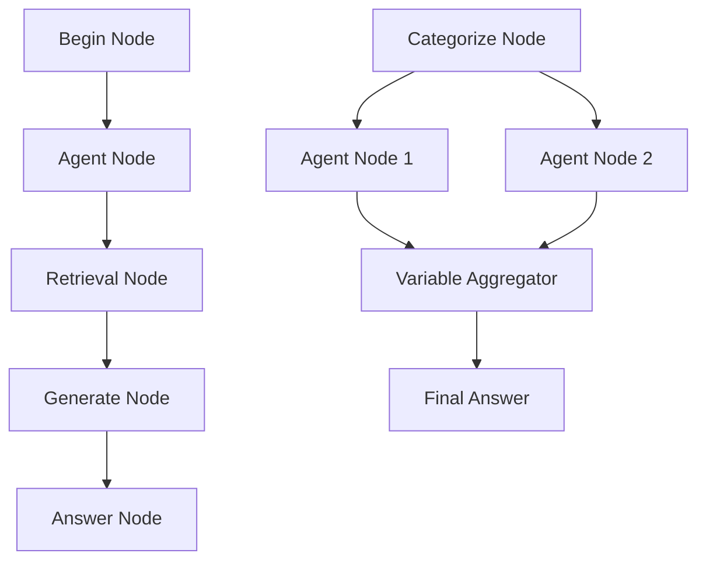

# Agents API

<cite>
**Referenced Files in This Document**
- [api/apps/sdk/agents.py](file://api/apps/sdk/agents.py)
- [api/apps/sdk/session.py](file://api/apps/sdk/session.py)
- [sdk/python/ragflow_sdk/modules/agent.py](file://sdk/python/ragflow_sdk/modules/agent.py)
- [sdk/python/ragflow_sdk/modules/session.py](file://sdk/python/ragflow_sdk/modules/session.py)
- [sdk/python/ragflow_sdk/ragflow.py](file://sdk/python/ragflow_sdk/ragflow.py)
- [agent/canvas.py](file://agent/canvas.py)
- [api/db/db_models.py](file://api/db/db_models.py)
- [api/utils/api_utils.py](file://api/utils/api_utils.py)
- [agent/templates/customer_service.json](file://agent/templates/customer_service.json)
- [agent/templates/deep_research.json](file://agent/templates/deep_research.json)
- [docs/references/http_api_reference.md](file://docs/references/http_api_reference.md)
</cite>

## Table of Contents
1. [Introduction](#introduction)
2. [API Overview](#api-overview)
3. [Authentication and Authorization](#authentication-and-authorization)
4. [Agent Management Endpoints](#agent-management-endpoints)
5. [Session Management Endpoints](#session-management-endpoints)
6. [Agent Configuration and DSL](#agent-configuration-and-dsl)
7. [Webhook and Streaming APIs](#webhook-and-streaming-apis)
8. [Python SDK Integration](#python-sdk-integration)
9. [Error Handling and Rate Limiting](#error-handling-and-rate-limiting)
10. [Best Practices](#best-practices)

## Introduction

The Agents API provides comprehensive functionality for creating, managing, and interacting with AI agents within the RAGFlow platform. Agents are configurable workflows that can process user queries through sophisticated multi-step reasoning processes, utilizing various tools, LLMs, and knowledge bases.

This API enables programmatic agent lifecycle management, session handling, and real-time interaction through streaming responses. The system supports both synchronous and asynchronous operations with robust error handling and rate limiting mechanisms.

## API Overview

The Agents API follows RESTful conventions with JSON payloads and supports both streaming and non-streaming responses. All endpoints require authentication via API keys or JWT tokens.

### Base URL Structure
```
/api/v1/agents
/api/v1/agents/{agent_id}/sessions
/api/v1/agents/{agent_id}/completions
/api/v1/agents/{agent_id}/webhook
```

### Content Types
- **Request**: `application/json`
- **Response**: `application/json`
- **Streaming Response**: `text/event-stream`

## Authentication and Authorization

### Authentication Methods

The API supports multiple authentication mechanisms:

1. **API Key Authentication**
   ```http
   Authorization: Bearer <YOUR_API_KEY>
   ```

2. **JWT Token Authentication**
   ```http
   Authorization: Bearer <JWT_TOKEN>
   ```

3. **API Token Authentication**
   ```http
   api_key: <API_TOKEN>
   ```

### Authorization Requirements

- **Owner Access**: Operations require ownership verification
- **Canvas Category**: Agents are categorized as `agent_canvas` or `dataflow_canvas`
- **Tenant Isolation**: All operations are scoped to the authenticated tenant

**Section sources**
- [api/utils/api_utils.py](file://api/utils/api_utils.py#L1-L200)
- [api/apps/sdk/agents.py](file://api/apps/sdk/agents.py#L124-L133)

## Agent Management Endpoints

### List Agents

Retrieve a paginated list of agents owned by the authenticated user.

**Endpoint**: `GET /api/v1/agents`

**Parameters**:
- `page` (optional): Page number (default: 1)
- `page_size` (optional): Items per page (default: 30)
- `orderby` (optional): Sort field (default: "update_time")
- `desc` (optional): Descending order (default: true)
- `id` (optional): Filter by specific agent ID
- `title` (optional): Filter by agent title

**Request Example**:
```bash
curl --request GET \
     --url http://localhost:9380/api/v1/agents \
     --header 'Authorization: Bearer <YOUR_API_KEY>'
```

**Response Schema**:
```json
{
  "code": 0,
  "data": [
    {
      "id": "agent_id",
      "title": "Customer Service Agent",
      "description": "Handles customer inquiries and support",
      "create_date": "Wed, 04 Dec 2024 15:30:22 GMT",
      "update_date": "Wed, 04 Dec 2024 15:45:33 GMT",
      "user_id": "tenant_id",
      "avatar": null,
      "canvas_type": null
    }
  ]
}
```

### Create Agent

Create a new agent with specified configuration and DSL (Domain Specific Language).

**Endpoint**: `POST /api/v1/agents`

**Request Body**:
```json
{
  "title": "string",
  "description": "string",
  "dsl": {
    "components": {
      "begin": {
        "obj": {
          "component_name": "Begin",
          "params": {}
        },
        "downstream": ["agent_node"],
        "upstream": []
      }
    },
    "graph": {
      "nodes": [],
      "edges": []
    },
    "history": [],
    "path": [],
    "reference": []
  }
}
```

**Request Example**:
```bash
curl --request POST \
     --url http://localhost:9380/api/v1/agents \
     --header 'Content-Type: application/json' \
     --header 'Authorization: Bearer <YOUR_API_KEY>' \
     --data '{
         "title": "Customer Service Agent",
         "description": "Handles customer inquiries",
         "dsl": {
           // Canvas DSL configuration
         }
     }'
```

**Response**:
```json
{
  "code": 0,
  "data": true,
  "message": "success"
}
```

### Update Agent

Modify an existing agent's configuration, title, or description.

**Endpoint**: `PUT /api/v1/agents/{agent_id}`

**Request Body**:
```json
{
  "title": "Updated Title",
  "description": "Updated description",
  "dsl": {
    // Updated DSL configuration
  }
}
```

**Response**:
```json
{
  "code": 0,
  "data": true,
  "message": "success"
}
```

### Delete Agent

Remove an agent from the system permanently.

**Endpoint**: `DELETE /api/v1/agents/{agent_id}`

**Response**:
```json
{
  "code": 0,
  "data": true,
  "message": "success"
}
```

**Section sources**
- [api/apps/sdk/agents.py](file://api/apps/sdk/agents.py#L33-L133)
- [docs/references/http_api_reference.md](file://docs/references/http_api_reference.md#L4261-L4399)

## Session Management Endpoints

### Create Agent Session

Establish a new conversation session with an agent.

**Endpoint**: `POST /api/v1/agents/{agent_id}/sessions`

**Query Parameters**:
- `user_id` (optional): Override user identifier

**Request Example**:
```bash
curl --request POST \
     --url http://localhost:9380/api/v1/agents/{agent_id}/sessions \
     --header 'Authorization: Bearer <YOUR_API_KEY>'
```

**Response**:
```json
{
  "code": 0,
  "data": {
    "id": "session_id",
    "agent_id": "agent_id",
    "name": "New session",
    "messages": [
      {
        "role": "assistant",
        "content": "Hello! How can I help you today?"
      }
    ],
    "source": "agent",
    "dsl": {
      // Session-specific DSL
    }
  }
}
```

### List Sessions

Retrieve all sessions associated with an agent.

**Endpoint**: `GET /api/v1/agents/{agent_id}/sessions`

**Parameters**:
- `page` (optional): Page number
- `page_size` (optional): Items per page
- `orderby` (optional): Sort field
- `desc` (optional): Descending order
- `id` (optional): Filter by session ID

**Response**:
```json
{
  "code": 0,
  "data": [
    {
      "id": "session_id",
      "agent_id": "agent_id",
      "name": "Customer Inquiry",
      "create_time": 1733397036424,
      "update_time": 1733397056801
    }
  ]
}
```

### Delete Sessions

Remove one or more sessions by ID.

**Endpoint**: `DELETE /api/v1/agents/{agent_id}/sessions`

**Request Body**:
```json
{
  "ids": ["session_id_1", "session_id_2"]
}
```

**Section sources**
- [api/apps/sdk/session.py](file://api/apps/sdk/session.py#L74-L95)
- [sdk/python/ragflow_sdk/modules/session.py](file://sdk/python/ragflow_sdk/modules/session.py#L21-L129)

## Agent Configuration and DSL

### Canvas DSL Structure

The Domain Specific Language (DSL) defines agent behavior through a graph-based configuration system.



**Diagram sources**
- [agent/canvas.py](file://agent/canvas.py#L40-L89)
- [agent/templates/customer_service.json](file://agent/templates/customer_service.json#L1-L200)

### DSL Components

#### Core Components

1. **Begin**: Entry point for agent execution
2. **Agent**: LLM-powered reasoning and decision making
3. **Retrieval**: Knowledge base and document search
4. **Generate**: Content generation and response crafting
5. **Categorize**: Intent classification and routing
6. **Variable Assigner**: Data manipulation and transformation
7. **Switch**: Conditional branching logic

#### Component Configuration

Each component accepts parameters for customization:

```json
{
  "component_name": "Agent",
  "params": {
    "llm_id": "deepseek-chat@DeepSeek",
    "temperature": 0.5,
    "max_tokens": 4096,
    "max_rounds": 5,
    "message_history_window_size": 12,
    "tools": [],
    "prompts": [
      {
        "role": "user",
        "content": "The user query is {sys.query}"
      }
    ]
  }
}
```

### Agent Templates

The system provides pre-built agent templates for common use cases:

- **Customer Service**: Multi-agent support system
- **Deep Research**: Comprehensive research and analysis
- **SQL Assistant**: Database query assistance
- **Technical Docs QA**: Documentation question answering
- **SEO Blog Generator**: Content creation workflows

**Section sources**
- [agent/canvas.py](file://agent/canvas.py#L1-L200)
- [agent/templates/deep_research.json](file://agent/templates/deep_research.json#L1-L200)

## Webhook and Streaming APIs

### Agent Completions

Process user queries through an agent with streaming or non-streaming responses.

**Endpoint**: `POST /api/v1/agents/{agent_id}/completions`

**Request Body**:
```json
{
  "question": "What is artificial intelligence?",
  "stream": true,
  "session_id": "session_id",
  "user_id": "user_id",
  "files": [],
  "variables": {}
}
```

**Streaming Response**:
```http
Content-Type: text/event-stream
Cache-Control: no-cache
Connection: keep-alive
X-Accel-Buffering: no

data:{"event":"message","message_id":"msg_id","created_at":1733397036,"task_id":"task_id","data":{"content":"Artificial intelligence"}}
data:{"event":"message","message_id":"msg_id","created_at":1733397037,"task_id":"task_id","data":{"content":" is..."}}
data:[DONE]
```

**Non-Streaming Response**:
```json
{
  "code": 0,
  "data": {
    "content": "Artificial intelligence is...",
    "reference": {
      "chunks": {
        "chunk_id": {
          "content": "AI definition...",
          "document_id": "doc_id",
          "similarity": 0.95
        }
      }
    }
  }
}
```

### Webhook Endpoint

Trigger agent execution via webhook with real-time streaming.

**Endpoint**: `POST /api/v1/agents/{agent_id}/webhook`

**Request Body**:
```json
{
  "query": "Research quantum computing advancements",
  "user_id": "tenant_id",
  "files": [],
  "webhook_payload": {}
}
```

**Response**: Same as agent completions with streaming SSE format.

**Section sources**
- [api/apps/sdk/session.py](file://api/apps/sdk/session.py#L442-L483)
- [api/apps/sdk/agents.py](file://api/apps/sdk/agents.py#L136-L179)

## Python SDK Integration

### Agent Management

The Python SDK provides convenient methods for agent operations:

```python
# Initialize RAGFlow client
from ragflow_sdk import RAGFlow

rag = RAGFlow(base_url="http://localhost:9380", api_key="your_api_key")

# Create agent
agent_dsl = {
    "components": {
        "begin": {
            "obj": {
                "component_name": "Begin",
                "params": {}
            },
            "downstream": ["agent_node"],
            "upstream": []
        }
    }
}

rag.create_agent(title="My Agent", dsl=agent_dsl, description="Test agent")

# List agents
agents = rag.list_agents(page=1, page_size=10, orderby="create_time", desc=True)

# Update agent
rag.update_agent(
    agent_id="agent_id",
    title="Updated Agent",
    description="Updated description",
    dsl=new_dsl
)

# Delete agent
rag.delete_agent(agent_id="agent_id")
```

### Session Management

```python
# Get agent instance
agent = agents[0]

# Create session
session = agent.create_session(name="Test Session")

# List sessions
sessions = agent.list_sessions(page=1, page_size=5)

# Delete sessions
agent.delete_sessions(ids=["session_id"])
```

### Chat Interactions

```python
# Start conversation
session = agent.create_session()

# Send message with streaming
for message in session.ask("What is machine learning?", stream=True):
    print(message.content)

# Send message without streaming
response = session.ask("What is machine learning?", stream=False)
print(response.content)
```

**Section sources**
- [sdk/python/ragflow_sdk/modules/agent.py](file://sdk/python/ragflow_sdk/modules/agent.py#L21-L94)
- [sdk/python/ragflow_sdk/modules/session.py](file://sdk/python/ragflow_sdk/modules/session.py#L21-L129)
- [sdk/python/ragflow_sdk/ragflow.py](file://sdk/python/ragflow_sdk/ragflow.py#L250-L285)

## Error Handling and Rate Limiting

### Error Response Format

All API errors follow a consistent response format:

```json
{
  "code": 102,
  "message": "Agent with title test already exists."
}
```

### Common Error Codes

| Code | Description | HTTP Status |
|------|-------------|-------------|
| 0 | Success | 200 OK |
| 102 | Agent doesn't exist | 404 Not Found |
| 103 | Only owner authorized | 403 Forbidden |
| 104 | Invalid agent ID | 400 Bad Request |
| 429 | Too many requests | 429 Too Many Requests |
| 500 | Internal server error | 500 Internal Server Error |

### Rate Limiting Policies

The system implements rate limiting to ensure fair usage:

- **Default Limits**: 100 requests per minute per API key
- **Token-Based**: Limits apply to individual tokens
- **Exponential Backoff**: Automatic retry with increasing delays
- **Header Information**: `Retry-After` header for temporary blocks

### Authentication Errors

```json
{
  "code": 401,
  "message": "Unauthorized: Invalid API key"
}
```

**Section sources**
- [api/utils/api_utils.py](file://api/utils/api_utils.py#L109-L140)
- [sandbox/executor_manager/services/limiter.py](file://sandbox/executor_manager/services/limiter.py#L1-L38)

## Best Practices

### Agent Design Guidelines

1. **Clear Purpose**: Define specific use cases for each agent
2. **Component Organization**: Structure workflows logically
3. **Error Handling**: Implement robust exception management
4. **Resource Optimization**: Balance complexity with performance

### Session Management

1. **State Persistence**: Maintain conversation context appropriately
2. **Timeout Handling**: Implement session expiration policies
3. **Memory Management**: Clean up old sessions periodically
4. **User Tracking**: Associate sessions with appropriate user IDs

### Security Considerations

1. **API Key Protection**: Store keys securely and rotate regularly
2. **Access Control**: Implement proper authorization checks
3. **Input Validation**: Sanitize all user inputs
4. **Audit Logging**: Track agent usage for monitoring

### Performance Optimization

1. **Streaming Responses**: Use streaming for real-time interactions
2. **Batch Operations**: Group related operations when possible
3. **Caching**: Implement caching for frequently accessed data
4. **Async Processing**: Use asynchronous operations for long-running tasks

### Monitoring and Maintenance

1. **Health Checks**: Monitor agent availability and performance
2. **Metrics Collection**: Track usage patterns and error rates
3. **Logging**: Implement comprehensive logging for debugging
4. **Updates**: Regularly update agent configurations and dependencies