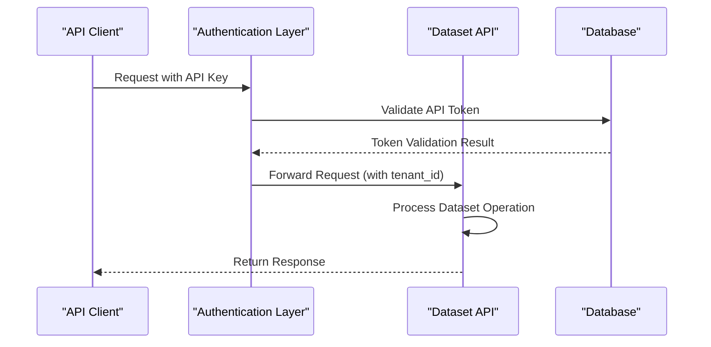

# Dataset API

<cite>
**Referenced Files in This Document**
- [dataset.py](file://api/apps/sdk/dataset.py)
- [dataset.py](file://sdk/python/ragflow_sdk/modules/dataset.py)
- [validation_utils.py](file://api/utils/validation_utils.py)
- [api_utils.py](file://api/utils/api_utils.py)
- [document_app.py](file://api/apps/document_app.py)
- [task_service.py](file://api/db/services/task_service.py)
- [dataset_example.py](file://example/sdk/dataset_example.py)
- [dataset_example.sh](file://example/http/dataset_example.sh)
- [configure_knowledge_base.md](file://docs/guides/dataset/configure_knowledge_base.md)
- [http_api_reference.md](file://docs/references/http_api_reference.md)
</cite>

## Table of Contents
1. [Introduction](#introduction)
2. [Authentication and Authorization](#authentication-and-authorization)
3. [Dataset Creation Operations](#dataset-creation-operations)
4. [Dataset Retrieval Operations](#dataset-retrieval-operations)
5. [Dataset Update Operations](#dataset-update-operations)
6. [Dataset Deletion Operations](#dataset-deletion-operations)
7. [Document Management within Datasets](#document-management-within-datasets)
8. [Chunking and Parsing Configuration](#chunking-and-parsing-configuration)
9. [Knowledge Graph Operations](#knowledge-graph-operations)
10. [Error Handling and Response Formats](#error-handling-and-response-formats)
11. [Rate Limiting and API Policies](#rate-limiting-and-api-policies)
12. [Python SDK Integration](#python-sdk-integration)
13. [Best Practices and Examples](#best-practices-and-examples)

## Introduction

The Dataset API provides comprehensive functionality for managing knowledge bases in RAGFlow, enabling users to create, configure, and maintain datasets that serve as the foundation for AI-powered document processing and retrieval operations. Datasets act as containers for documents, applying various chunking methods and parsing configurations to transform raw files into searchable, embeddable knowledge chunks.

### Core Concepts

- **Datasets**: Collections of documents organized for AI processing
- **Documents**: Individual files or virtual representations within datasets
- **Chunks**: Segmented portions of documents processed for retrieval
- **Parsing Methods**: Different algorithms for splitting documents into meaningful segments
- **Embedding Models**: Vector representations for semantic search capabilities

## Authentication and Authorization

All Dataset API endpoints require authentication through API keys. The system supports both bearer token authentication and API token-based access control.

### Authentication Requirements

| Parameter | Type | Required | Description |
|-----------|------|----------|-------------|
| Authorization | string | Yes | Bearer token prefixed with "Bearer " |

### Authentication Flow



**Diagram sources**
- [api_utils.py](file://api/utils/api_utils.py#L250-L280)

**Section sources**
- [api_utils.py](file://api/utils/api_utils.py#L250-L280)

## Dataset Creation Operations

### Create Dataset Endpoint

Creates a new dataset with specified configuration parameters.

**Endpoint:** `POST /api/v1/datasets`

**Request Headers:**
- `Content-Type: application/json`
- `Authorization: Bearer <API_KEY>`

**Request Body Schema:**

| Parameter | Type | Required | Default | Description |
|-----------|------|----------|---------|-------------|
| name | string | Yes | - | Dataset name (unique within tenant) |
| avatar | string | No | null | Base64-encoded avatar image |
| description | string | No | null | Dataset description |
| embedding_model | string | No | Default tenant model | Embedding model identifier |
| permission | string | No | "me" | Access permission level |
| chunk_method | string | No | "naive" | Chunking algorithm |
| parser_config | object | No | {} | Parser configuration object |

**Supported Chunk Methods:**
- `naive`: General-purpose chunking
- `book`: Book-style chunking
- `email`: Email-specific parsing
- `laws`: Legal document processing
- `manual`: Manual document handling
- `one`: Single-chunk-per-document
- `paper`: Academic paper processing
- `picture`: Image content extraction
- `presentation`: Presentation slides
- `qa`: Question-answer retrieval
- `table`: Tabular data processing
- `tag`: Metadata tagging

**Response Format:**
```json
{
  "code": 0,
  "data": {
    "id": "dataset_uuid",
    "name": "dataset_name",
    "description": "dataset_description",
    "embedding_model": "model_name",
    "permission": "me",
    "chunk_method": "naive",
    "document_count": 0,
    "chunk_count": 0,
    "parser_config": {}
  }
}
```

**Section sources**
- [dataset.py](file://api/apps/sdk/dataset.py#L55-L155)

## Dataset Retrieval Operations

### List Datasets

Retrieves a paginated list of datasets with filtering and sorting capabilities.

**Endpoint:** `GET /api/v1/datasets`

**Query Parameters:**

| Parameter | Type | Default | Description |
|-----------|------|---------|-------------|
| id | string | null | Filter by specific dataset ID |
| name | string | null | Filter by dataset name |
| page | integer | 1 | Page number |
| page_size | integer | 30 | Items per page |
| orderby | string | "create_time" | Sort field |
| desc | boolean | true | Sort direction |

**Response Format:**
```json
{
  "code": 0,
  "data": [
    {
      "id": "dataset_uuid",
      "name": "dataset_name",
      "description": "dataset_description",
      "embedding_model": "model_name",
      "permission": "me",
      "chunk_method": "naive",
      "document_count": 5,
      "chunk_count": 120
    }
  ],
  "total": 15
}
```

### Get Dataset Details

Retrieves detailed information about a specific dataset.

**Endpoint:** `GET /api/v1/datasets/{dataset_id}`

**Response Format:**
```json
{
  "code": 0,
  "data": {
    "id": "dataset_uuid",
    "name": "dataset_name",
    "description": "detailed_description",
    "embedding_model": "model_name",
    "permission": "team",
    "chunk_method": "paper",
    "document_count": 8,
    "chunk_count": 240,
    "parser_config": {
      "chunk_token_num": 512,
      "auto_keywords": 8,
      "auto_questions": 2
    }
  }
}
```

**Section sources**
- [dataset.py](file://api/apps/sdk/dataset.py#L386-L479)

## Dataset Update Operations

### Update Dataset Configuration

Modifies dataset properties and configurations.

**Endpoint:** `PUT /api/v1/datasets/{dataset_id}`

**Request Body Schema:**

| Parameter | Type | Required | Description |
|-----------|------|----------|-------------|
| name | string | No | New dataset name |
| avatar | string | No | Updated base64 avatar |
| description | string | No | Updated description |
| embedding_model | string | No | New embedding model |
| permission | string | No | Access permission |
| chunk_method | string | No | New chunking method |
| pagerank | integer | No | PageRank value |
| parser_config | object | No | Updated parser configuration |

**Update Restrictions:**
- Cannot change embedding model if dataset has existing chunks
- PageRank can only be set with Elasticsearch document engine
- Must provide at least one property to update

**Response Format:**
```json
{
  "code": 0,
  "data": {
    "id": "dataset_uuid",
    "name": "updated_name",
    "description": "updated_description",
    "embedding_model": "updated_model",
    "permission": "team",
    "chunk_method": "qa",
    "parser_config": {
      "chunk_token_num": 1024,
      "auto_keywords": 12
    }
  }
}
```

**Section sources**
- [dataset.py](file://api/apps/sdk/dataset.py#L254-L380)

## Dataset Deletion Operations

### Delete Datasets

Removes one or more datasets along with their associated documents and chunks.

**Endpoint:** `DELETE /api/v1/datasets`

**Request Body Schema:**

| Parameter | Type | Required | Description |
|-----------|------|----------|-------------|
| ids | array | No | Array of dataset IDs to delete |

**Deletion Behavior:**
- `null`: Deletes all datasets for the tenant
- Empty array: No datasets deleted
- Array of IDs: Deletes specified datasets

**Response Format:**
```json
{
  "code": 0,
  "data": {
    "success_count": 2,
    "errors": [
      "Delete dataset error for dataset_id_1",
      "Remove document error for dataset_id_2"
    ]
  }
}
```

**Section sources**
- [dataset.py](file://api/apps/sdk/dataset.py#L156-L249)

## Document Management within Datasets

### Upload Documents

Uploads files to a dataset for processing.

**Endpoint:** `POST /api/v1/datasets/{dataset_id}/documents`

**Request Format:** Multipart form data with file uploads

**Supported File Types:**
- Documents: `.docx`, `.pdf`, `.txt`, `.md`, `.html`
- Spreadsheets: `.xlsx`, `.xls`, `.csv`
- Presentations: `.pptx`, `.ppt`
- Images: `.jpg`, `.png`, `.gif`, `.tiff`
- Emails: `.eml`

**Response Format:**
```json
{
  "code": 0,
  "data": [
    {
      "id": "document_uuid",
      "name": "document_name.pdf",
      "type": "pdf",
      "size": 1048576,
      "chunk_count": 0,
      "run": "WAITING"
    }
  ]
}
```

### List Documents

Retrieves documents within a dataset with filtering and pagination.

**Endpoint:** `GET /api/v1/datasets/{dataset_id}/documents`

**Query Parameters:**

| Parameter | Type | Default | Description |
|-----------|------|---------|-------------|
| id | string | null | Filter by document ID |
| name | string | null | Filter by document name |
| keywords | string | null | Search keywords |
| page | integer | 1 | Page number |
| page_size | integer | 30 | Items per page |
| orderby | string | "create_time" | Sort field |
| desc | boolean | true | Sort direction |

**Response Format:**
```json
{
  "code": 0,
  "data": {
    "docs": [
      {
        "id": "document_uuid",
        "name": "research_paper.pdf",
        "type": "pdf",
        "size": 2097152,
        "chunk_count": 45,
        "run": "DONE",
        "progress": 1.0
      }
    ],
    "total": 12
  }
}
```

### Delete Documents

Removes documents from a dataset.

**Endpoint:** `DELETE /api/v1/datasets/{dataset_id}/documents`

**Request Body Schema:**

| Parameter | Type | Required | Description |
|-----------|------|----------|-------------|
| ids | array | No | Array of document IDs to delete |

**Section sources**
- [dataset.py](file://sdk/python/ragflow_sdk/modules/dataset.py#L53-L104)
- [document_app.py](file://api/apps/document_app.py#L50-L83)

## Chunking and Parsing Configuration

### Parser Configuration Options

Datasets support extensive configuration for document parsing and chunking:

**Basic Configuration:**
```json
{
  "chunk_token_num": 512,
  "auto_keywords": 8,
  "auto_questions": 2,
  "delimiter": "\n",
  "html4excel": false,
  "layout_recognize": "DeepDOC"
}
```

**Advanced Configuration:**
```json
{
  "raptor": {
    "use_raptor": true,
    "max_cluster": 4
  },
  "graphrag": {
    "use_graphrag": true,
    "depth": 2,
    "num_workers": 4
  }
}
```

### Supported Chunking Methods

| Method | Purpose | Best For | File Types |
|--------|---------|----------|------------|
| naive | General chunking | Mixed content | All supported formats |
| book | Structured documents | Books, manuals | PDF, DOCX, TXT |
| email | Email processing | Email archives | EML, MSG |
| laws | Legal documents | Legal texts | PDF, DOCX, TXT |
| manual | Instructions | User manuals | PDF, DOCX |
| paper | Academic papers | Research articles | PDF |
| picture | Image content | Visual documents | Images |
| presentation | Slides | Presentations | PPTX, PDF |
| qa | Question answering | FAQ content | XLSX, CSV |
| table | Tabular data | Data sheets | XLSX, CSV |
| tag | Metadata | Tag sets | XLSX, CSV |
| one | Complete documents | Full-text preservation | All formats |

**Section sources**
- [configure_knowledge_base.md](file://docs/guides/dataset/configure_knowledge_base.md#L40-L55)

## Knowledge Graph Operations

### Generate Knowledge Graph

Creates knowledge graphs from dataset content using GraphRAG or RAPTOR algorithms.

**GraphRAG Endpoint:** `POST /api/v1/datasets/{dataset_id}/run_graphrag`

**RAPTOR Endpoint:** `POST /api/v1/datasets/{dataset_id}/run_raptor`

**Response Format:**
```json
{
  "code": 0,
  "data": {
    "graphrag_task_id": "task_uuid",
    "raptor_task_id": "task_uuid"
  }
}
```

### Monitor Progress

**GraphRAG Progress:** `GET /api/v1/datasets/{dataset_id}/trace_graphrag`
**RAPTOR Progress:** `GET /api/v1/datasets/{dataset_id}/trace_raptor`

**Progress Tracking:**
```json
{
  "code": 0,
  "data": {
    "id": "task_uuid",
    "task_type": "graphrag",
    "progress": 0.75,
    "progress_msg": "Processing chunks...",
    "create_time": 1703123456789,
    "update_time": 1703123460123
  }
}
```

### Retrieve Knowledge Graph

**Endpoint:** `GET /api/v1/datasets/{dataset_id}/knowledge_graph`

**Response Format:**
```json
{
  "code": 0,
  "data": {
    "graph": {
      "nodes": [...],
      "edges": [...]
    },
    "mind_map": {...}
  }
}
```

**Section sources**
- [dataset.py](file://api/apps/sdk/dataset.py#L482-L690)

## Error Handling and Response Formats

### Standard Response Format

All API endpoints return responses in the following format:

```json
{
  "code": 0,
  "message": "Success",
  "data": {}
}
```

### Error Codes

| Code | Description | Common Causes |
|------|-------------|---------------|
| 0 | Success | Operation completed successfully |
| 101 | Argument Error | Invalid request parameters |
| 102 | Data Error | Missing or invalid data |
| 103 | Authentication Error | Invalid API key |
| 104 | Permission Error | Insufficient access rights |
| 105 | Server Error | Internal server failure |

### Common Error Responses

**Missing Required Parameters:**
```json
{
  "code": 101,
  "message": "name: Field required"
}
```

**Invalid Dataset ID:**
```json
{
  "code": 102,
  "message": "Invalid Dataset ID"
}
```

**Authentication Failure:**
```json
{
  "code": 103,
  "message": "Authentication error: API key is invalid!"
}
```

**Section sources**
- [api_utils.py](file://api/utils/api_utils.py#L109-L140)

## Rate Limiting and API Policies

### Rate Limiting

The API implements rate limiting to ensure fair usage and system stability:

- **Requests per Minute**: 1000 requests per minute per API key
- **Concurrent Requests**: Maximum 10 concurrent requests
- **Bulk Operations**: Limited to 100 items per batch operation

### API Versioning

All endpoints use versioned URLs:
- `GET /api/v1/datasets`
- `POST /api/v1/datasets`
- `PUT /api/v1/datasets/{id}`

### Retry Policy

Implement exponential backoff for failed requests:
- Initial delay: 1 second
- Maximum retries: 3 attempts
- Backoff multiplier: 2.0

## Python SDK Integration

### SDK Installation

```bash
pip install ragflow-sdk
```

### Basic Usage

```python
from ragflow_sdk import RAGFlow

# Initialize client
ragflow = RAGFlow(api_key="your_api_key", base_url="http://localhost:9380")

# Create dataset
dataset = ragflow.create_dataset(
    name="My Knowledge Base",
    description="Contains research papers and reports",
    chunk_method="paper"
)

# Upload documents
documents = dataset.upload_documents([
    {
        "display_name": "research.pdf",
        "blob": open("research.pdf", "rb").read()
    }
])

# Update dataset configuration
dataset.update({
    "description": "Updated description",
    "parser_config": {
        "chunk_token_num": 1024
    }
})

# List datasets
datasets = ragflow.list_datasets()

# Delete datasets
ragflow.delete_datasets(ids=[dataset.id])
```

### Advanced Features

```python
# Parse documents asynchronously
document_ids = [doc.id for doc in documents]
results = dataset.parse_documents(document_ids)

# Monitor parsing progress
status = dataset._get_documents_status(document_ids)

# Cancel parsing
dataset.async_cancel_parse_documents(document_ids)
```

**Section sources**
- [dataset_example.py](file://example/sdk/dataset_example.py#L21-L54)
- [dataset.py](file://sdk/python/ragflow_sdk/modules/dataset.py#L21-L154)

## Best Practices and Examples

### Creating Production Datasets

```python
# Optimal configuration for production
production_dataset = ragflow.create_dataset(
    name="Production Knowledge Base",
    description="Production documentation and procedures",
    embedding_model="text-embedding-ada-002",
    chunk_method="book",
    parser_config={
        "chunk_token_num": 1024,
        "auto_keywords": 16,
        "auto_questions": 4
    }
)
```

### Batch Document Processing

```python
# Efficient batch upload
document_list = [
    {"display_name": f"doc_{i}.pdf", "blob": file_content}
    for i in range(100)
]

# Upload in batches to avoid timeouts
batch_size = 10
for i in range(0, len(document_list), batch_size):
    batch = document_list[i:i + batch_size]
    documents = dataset.upload_documents(batch)
    
    # Monitor progress
    document_ids = [doc.id for doc in documents]
    status = dataset._get_documents_status(document_ids)
```

### Error Handling

```python
import time
from ragflow_sdk import RAGFlow

def robust_dataset_creation(name, max_retries=3):
    ragflow = RAGFlow(api_key="your_key", base_url="http://localhost:9380")
    
    for attempt in range(max_retries):
        try:
            dataset = ragflow.create_dataset(name=name)
            return dataset
        except Exception as e:
            if attempt == max_retries - 1:
                raise e
            print(f"Attempt {attempt + 1} failed: {e}")
            time.sleep(2 ** attempt)  # Exponential backoff
```

### Monitoring and Maintenance

```python
def dataset_health_check(dataset):
    """Check dataset health and suggest optimizations"""
    info = dataset.info()
    
    if info['chunk_count'] == 0:
        print("Warning: No chunks processed. Upload and parse documents.")
    
    if info['document_count'] > 100:
        print("Consider splitting large dataset for better performance")
    
    if info['embedding_model'] != 'recommended_model':
        print(f"Consider switching to recommended model: {recommended_model}")
```

### Performance Optimization

```python
# Optimize chunk size for different content types
content_optimizations = {
    "academic_papers": {"chunk_token_num": 512, "auto_keywords": 8},
    "legal_documents": {"chunk_token_num": 1024, "auto_keywords": 12},
    "technical_manuals": {"chunk_token_num": 256, "auto_keywords": 4}
}

def optimize_dataset_for_content(dataset, content_type):
    config = content_optimizations.get(content_type, {})
    dataset.update({"parser_config": config})
```

**Section sources**
- [dataset_example.sh](file://example/http/dataset_example.sh#L17-L53)