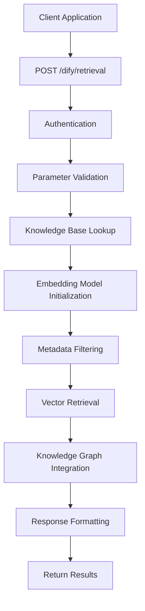
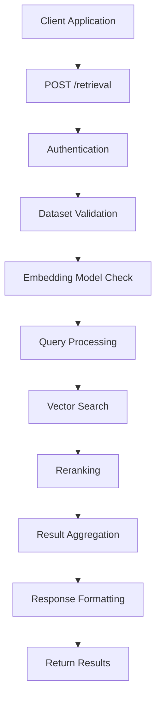
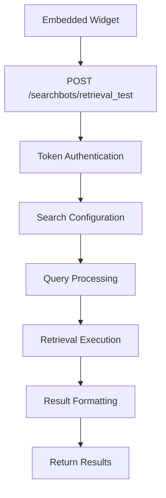
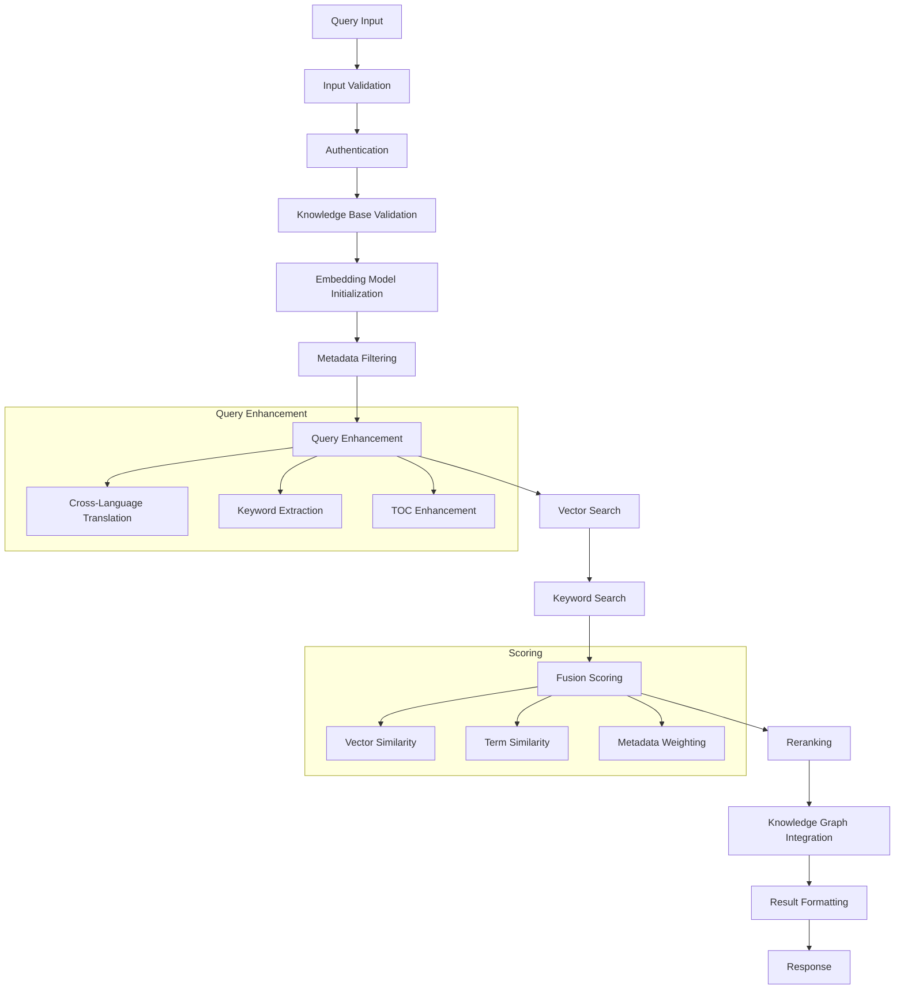
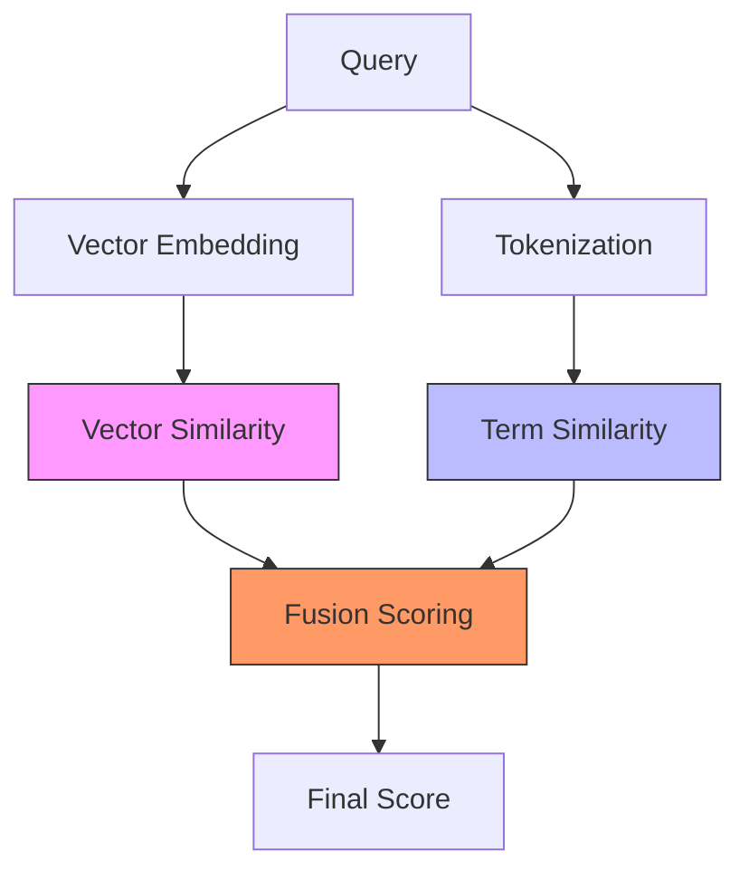
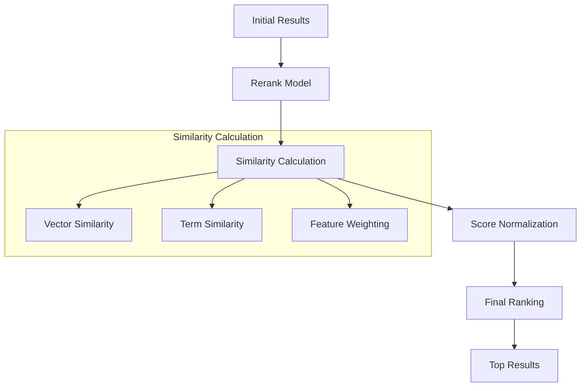
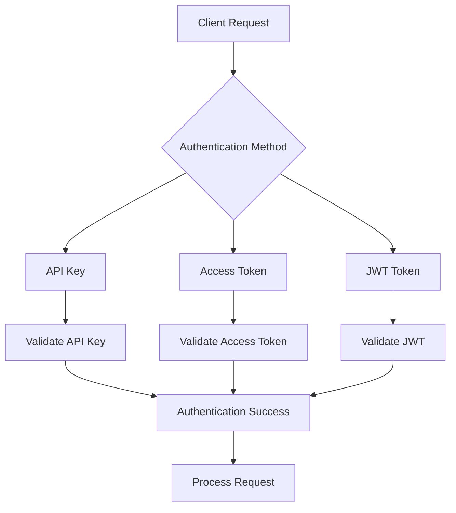
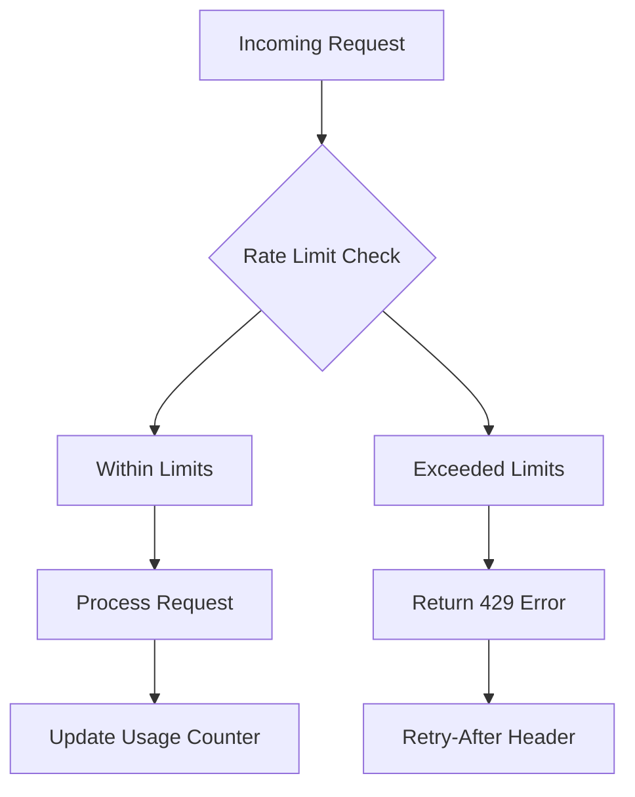
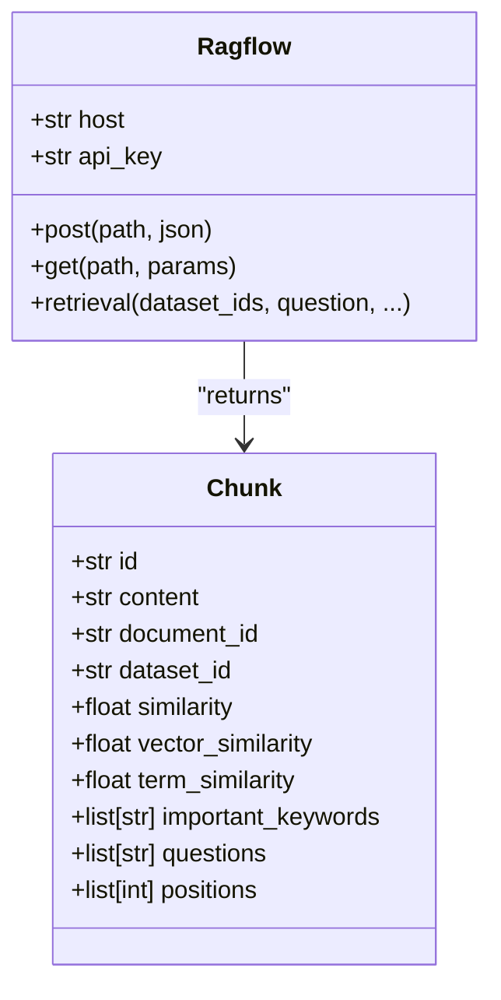

# Dify Retrieval API

<cite>
**Referenced Files in This Document**   
- [dify_retrieval.py](file://api/apps/sdk/dify_retrieval.py)
- [doc.py](file://api/apps/sdk/doc.py)
- [search.py](file://rag/nlp/search.py)
- [ragflow.py](file://sdk/python/ragflow_sdk/ragflow.py)
- [chunk.py](file://sdk/python/ragflow_sdk/modules/chunk.py)
- [http_api_reference.md](file://docs/references/http_api_reference.md)
</cite>

## Table of Contents
1. [Introduction](#introduction)
2. [API Endpoints](#api-endpoints)
3. [Request Parameters](#request-parameters)
4. [Response Format](#response-format)
5. [Query Processing Pipeline](#query-processing-pipeline)
6. [Relevance Scoring Mechanisms](#relevance-scoring-mechanisms)
7. [Authentication and Security](#authentication-and-security)
8. [Rate Limiting](#rate-limiting)
9. [Error Handling](#error-handling)
10. [Python SDK Integration](#python-sdk-integration)
11. [Usage Examples](#usage-examples)

## Introduction

The Dify Retrieval API provides programmatic access to the RAG (Retrieval-Augmented Generation) retrieval capabilities within the Dify platform. This API enables semantic search across knowledge bases, document retrieval, and relevance scoring for AI-powered applications. The retrieval system combines vector similarity, keyword matching, and reranking to deliver high-quality search results.

The API supports multiple retrieval endpoints with different compatibility layers, including a Dify-compatible endpoint for seamless integration with existing Dify applications. The retrieval functionality is built on a sophisticated query processing pipeline that handles semantic search, metadata filtering, and result ranking.

**Section sources**
- [dify_retrieval.py](file://api/apps/sdk/dify_retrieval.py#L1-L183)
- [doc.py](file://api/apps/sdk/doc.py#L1330-L1529)

## API Endpoints

The Dify Retrieval API provides multiple endpoints for different use cases and compatibility requirements.

### Dify-Compatible Retrieval Endpoint

The primary endpoint for Dify-compatible retrieval operations:



**Diagram sources**
- [dify_retrieval.py](file://api/apps/sdk/dify_retrieval.py#L29-L183)

### Standard Retrieval Endpoint

The standard retrieval endpoint for direct API access:



**Diagram sources**
- [doc.py](file://api/apps/sdk/doc.py#L1330-L1529)

### Embedded Retrieval Endpoint

For embedded applications and widgets:



**Diagram sources**
- [session.py](file://api/apps/sdk/session.py#L938-L1108)

## Request Parameters

### Dify-Compatible Endpoint Parameters

The Dify-compatible retrieval endpoint accepts the following parameters:

| Parameter | Type | Required | Default | Description |
|---------|------|--------|--------|-------------|
| `knowledge_id` | string | Yes | - | Knowledge base ID to search in |
| `query` | string | Yes | - | Query text for semantic search |
| `use_kg` | boolean | No | false | Whether to use knowledge graph for multi-hop queries |
| `retrieval_setting.score_threshold` | number | No | 0.0 | Minimum similarity score threshold |
| `retrieval_setting.top_k` | integer | No | 1024 | Maximum number of results to return |
| `metadata_condition` | object | No | - | Metadata filter conditions for document filtering |

**Section sources**
- [dify_retrieval.py](file://api/apps/sdk/dify_retrieval.py#L49-L79)

### Standard Endpoint Parameters

The standard retrieval endpoint supports comprehensive search parameters:

| Parameter | Type | Required | Default | Description |
|---------|------|--------|--------|-------------|
| `question` | string | Yes | - | Query string for semantic search |
| `dataset_ids` | array[string] | Yes | - | List of dataset IDs to search in |
| `document_ids` | array[string] | No | - | List of document IDs to filter results |
| `page` | integer | No | 1 | Page number for pagination |
| `page_size` | integer | No | 30 | Number of results per page |
| `similarity_threshold` | float | No | 0.2 | Minimum similarity score threshold |
| `vector_similarity_weight` | float | No | 0.3 | Weight of vector similarity in scoring |
| `top_k` | integer | No | 1024 | Maximum number of chunks for vector computation |
| `rerank_id` | string | No | - | ID of the rerank model to use |
| `keyword` | boolean | No | false | Whether to enable keyword-based matching |
| `highlight` | boolean | No | true | Whether to highlight matched terms in results |
| `cross_languages` | array[string] | No | - | Languages for cross-language retrieval |
| `metadata_condition` | object | No | - | Metadata filter conditions |
| `use_kg` | boolean | No | false | Whether to use knowledge graph |
| `toc_enhance` | boolean | No | false | Whether to use table of contents enhancement |

**Section sources**
- [doc.py](file://api/apps/sdk/doc.py#L1349-L1381)
- [http_api_reference.md](file://docs/references/http_api_reference.md#L2147-L2200)

## Response Format

### Dify-Compatible Response

The Dify-compatible endpoint returns results in a format compatible with Dify applications:

```json
{
  "records": [
    {
      "content": "Retrieved content text",
      "score": 0.95,
      "title": "Document title",
      "metadata": {
        "doc_id": "document_id",
        "author": "Author name",
        "url": "Document URL"
      }
    }
  ]
}
```

The response contains an array of records, each with:
- `content`: The retrieved chunk content
- `score`: Similarity score (0.0 to 1.0)
- `title`: Document title
- `metadata`: Additional document metadata

**Section sources**
- [dify_retrieval.py](file://api/apps/sdk/dify_retrieval.py#L94-L113)

### Standard Response

The standard endpoint returns a comprehensive response with detailed retrieval information:

```json
{
  "code": 0,
  "data": {
    "total": 5,
    "chunks": [
      {
        "id": "chunk_id",
        "content": "Retrieved content",
        "document_id": "doc_id",
        "dataset_id": "dataset_id",
        "similarity": 0.95,
        "vector_similarity": 0.85,
        "term_similarity": 0.90,
        "important_keywords": ["keyword1", "keyword2"],
        "questions": ["related question"],
        "document_keyword": "document title",
        "image_id": "",
        "positions": [1, 2, 3],
        "highlight": "<em>matched term</em> in content"
      }
    ],
    "doc_aggs": [
      {
        "doc_name": "document title",
        "doc_id": "doc_id",
        "count": 3
      }
    ]
  }
}
```

The response includes:
- `total`: Total number of matching chunks
- `chunks`: Array of retrieved chunks with detailed information
- `doc_aggs`: Document aggregation showing chunks per document

**Section sources**
- [doc.py](file://api/apps/sdk/doc.py#L1390-L1413)
- [http_api_reference.md](file://docs/references/http_api_reference.md#L2208-L2242)

## Query Processing Pipeline

The retrieval system processes queries through a sophisticated pipeline that combines multiple retrieval techniques.



**Diagram sources**
- [doc.py](file://api/apps/sdk/doc.py#L1430-L1529)
- [search.py](file://rag/nlp/search.py#L359-L498)

### Pipeline Stages

1. **Input Validation**: Validates required parameters and authentication
2. **Knowledge Base Validation**: Ensures access to specified datasets
3. **Embedding Model Initialization**: Loads the appropriate embedding model
4. **Metadata Filtering**: Applies metadata conditions to filter documents
5. **Query Enhancement**: Enhances the query with additional context
6. **Vector Search**: Performs semantic search using vector embeddings
7. **Keyword Search**: Conducts keyword-based matching
8. **Fusion Scoring**: Combines vector and keyword scores
9. **Reranking**: Applies advanced reranking models
10. **Knowledge Graph Integration**: Adds knowledge graph results if enabled
11. **Result Formatting**: Structures the response in the appropriate format

**Section sources**
- [doc.py](file://api/apps/sdk/doc.py#L1414-L1529)

## Relevance Scoring Mechanisms

The retrieval system employs multiple scoring mechanisms to ensure high-quality results.

### Hybrid Scoring Algorithm

The system uses a hybrid approach that combines vector similarity and keyword matching:



**Diagram sources**
- [search.py](file://rag/nlp/search.py#L322-L328)

### Scoring Components

The relevance score is calculated using multiple components:

| Component | Description | Weight Control |
|---------|-------------|---------------|
| Vector Similarity | Cosine similarity between query and chunk embeddings | `vector_similarity_weight` |
| Term Similarity | Keyword matching and token overlap | `1 - vector_similarity_weight` |
| Metadata Weighting | Importance based on document metadata | Configurable in system settings |
| Reranking Score | Advanced scoring from rerank models | Applied as final adjustment |

The final score is calculated as:
```
final_score = (vector_similarity_weight × vector_similarity) + ((1 - vector_similarity_weight) × term_similarity) + metadata_weighting + reranking_adjustment
```

**Section sources**
- [search.py](file://rag/nlp/search.py#L322-L358)

### Reranking Process

For enhanced accuracy, the system supports reranking with specialized models:



**Diagram sources**
- [search.py](file://rag/nlp/search.py#L330-L352)

## Authentication and Security

The retrieval API implements robust authentication and security measures.

### Authentication Methods

The API supports multiple authentication methods:



**Diagram sources**
- [api_app.py](file://api/apps/api_app.py#L26-L32)
- [api_service.py](file://api/db/services/api_service.py#L25-L40)

### API Key Authentication

The primary authentication method uses API keys in the Authorization header:

```
Authorization: Bearer <YOUR_API_KEY>
```

The system validates API keys against the database and associates them with tenant accounts for access control.

**Section sources**
- [api_utils.py](file://api/utils/api_utils.py#L250-L280)

## Rate Limiting

The retrieval API implements rate limiting to ensure system stability and fair usage.

### Rate Limiting Strategy



**Diagram sources**
- [sandbox_base_image](file://sandbox/executor_manager/main.py#L22-L25)

The rate limiting system tracks requests per API key and enforces limits to prevent abuse while maintaining service availability.

**Section sources**
- [main.py](file://sandbox/executor_manager/main.py#L1-L25)

## Error Handling

The API provides comprehensive error handling with descriptive error messages.

### Error Response Format

```json
{
  "code": 102,
  "message": "`datasets` is required."
}
```

| Error Code | Message | Cause |
|----------|---------|------|
| 102 | "`datasets` is required." | Missing required dataset_ids parameter |
| 109 | "Authentication error: API key is invalid!" | Invalid or missing API key |
| 404 | "Knowledgebase not found!" | Specified knowledge base does not exist |
| 500 | Internal server error | System error during processing |

**Section sources**
- [dify_retrieval.py](file://api/apps/sdk/dify_retrieval.py#L175-L182)
- [http_api_reference.md](file://docs/references/http_api_reference.md#L2247-L2252)

## Python SDK Integration

The Python SDK provides a convenient interface for programmatic access to the retrieval API.

### SDK Class Structure



**Diagram sources**
- [ragflow.py](file://sdk/python/ragflow_sdk/ragflow.py)
- [chunk.py](file://sdk/python/ragflow_sdk/modules/chunk.py#L26-L57)

### SDK Usage

The SDK simplifies retrieval operations with a clean, intuitive interface:

```python
from ragflow_sdk import Ragflow

# Initialize client
client = Ragflow(host="http://localhost:8080", api_key="your_api_key")

# Perform retrieval
chunks = client.retrieval(
    dataset_ids=["dataset_id"],
    question="What is RAG?",
    similarity_threshold=0.2,
    vector_similarity_weight=0.3,
    top_k=10
)

# Process results
for chunk in chunks:
    print(f"Content: {chunk.content}")
    print(f"Similarity: {chunk.similarity}")
```

**Section sources**
- [ragflow.py](file://sdk/python/ragflow_sdk/ragflow.py)
- [chunk.py](file://sdk/python/ragflow_sdk/modules/chunk.py#L26-L57)

## Usage Examples

### Basic Semantic Search

```bash
curl --request POST \
     --url http://{address}/api/v1/retrieval \
     --header 'Content-Type: application/json' \
     --header 'Authorization: Bearer <YOUR_API_KEY>' \
     --data '{
          "question": "What is advantage of ragflow?",
          "dataset_ids": ["b2a62730759d11ef987d0242ac120004"]
     }'
```

### Advanced Search with Filters

```bash
curl --request POST \
     --url http://{address}/api/v1/retrieval \
     --header 'Content-Type: application/json' \
     --header 'Authorization: Bearer <YOUR_API_KEY>' \
     --data '{
          "question": "What is advantage of ragflow?",
          "dataset_ids": ["b2a62730759d11ef987d0242ac120004"],
          "document_ids": ["77df9ef4759a11ef8bdd0242ac120004"],
          "metadata_condition": {
            "logic": "and",
            "conditions": [
              {
                "name": "author",
                "comparison_operator": "=",
                "value": "Toby"
              },
              {
                "name": "url",
                "comparison_operator": "not contains",
                "value": "amd"
              }
            ]
          }
     }'
```

### Dify-Compatible Request

```bash
curl --request POST \
     --url http://{address}/dify/retrieval \
     --header 'Content-Type: application/json' \
     --header 'Authorization: Bearer <YOUR_API_KEY>' \
     --data '{
          "knowledge_id": "b2a62730759d11ef987d0242ac120004",
          "query": "What is RAG?",
          "retrieval_setting": {
            "score_threshold": 0.5,
            "top_k": 5
          }
     }'
```

**Section sources**
- [http_api_reference.md](file://docs/references/http_api_reference.md#L2119-L2145)
- [dify_retrieval.py](file://api/apps/sdk/dify_retrieval.py#L115-L151)
- [doc.py](file://api/apps/sdk/doc.py#L1414-L1529)