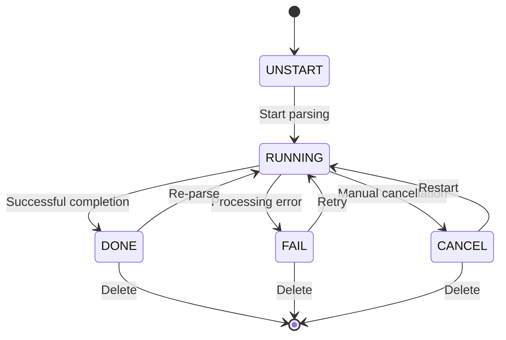

# Document API

<cite>
**Referenced Files in This Document**
- [api/apps/sdk/doc.py](file://api/apps/sdk/doc.py)
- [api/apps/document_app.py](file://api/apps/document_app.py)
- [api/apps/file_app.py](file://api/apps/file_app.py)
- [api/apps/file2document_app.py](file://api/apps/file2document_app.py)
- [api/db/services/document_service.py](file://api/db/services/document_service.py)
- [api/db/services/file_service.py](file://api/db/services/file_service.py)
- [sdk/python/ragflow_sdk/modules/document.py](file://sdk/python/ragflow_sdk/modules/document.py)
- [sdk/python/ragflow_sdk/modules/base.py](file://sdk/python/ragflow_sdk/modules/base.py)
- [api/constants.py](file://api/constants.py)
- [common/constants.py](file://common/constants.py)
- [api/db/db_models.py](file://api/db/db_models.py)
- [api/db/services/task_service.py](file://api/db/services/task_service.py)
- [api/db/services/pipeline_operation_log_service.py](file://api/db/services/pipeline_operation_log_service.py)
</cite>

## Table of Contents
1. [Introduction](#introduction)
2. [Authentication and Authorization](#authentication-and-authorization)
3. [Document Upload Operations](#document-upload-operations)
4. [Document Retrieval and Management](#document-retrieval-and-management)
5. [Document Parsing and Processing](#document-parsing-and-processing)
6. [Document State Management](#document-state-management)
7. [Error Handling and Status Codes](#error-handling-and-status-codes)
8. [Python SDK Integration](#python-sdk-integration)
9. [Rate Limiting and Best Practices](#rate-limiting-and-best-practices)
10. [Monitoring and Progress Tracking](#monitoring-and-progress-tracking)

## Introduction

The RAGFlow Document API provides comprehensive functionality for managing documents within datasets. It supports document upload, parsing, retrieval, and state management operations with robust progress tracking and error handling mechanisms. The API follows RESTful principles and provides both direct HTTP endpoints and a Python SDK wrapper for programmatic access.

The document management system supports various file formats including PDF, Word, PowerPoint, Excel, images, and text files. Documents are processed through configurable parsers and can be organized within knowledge bases (datasets) for efficient retrieval and AI-powered search capabilities.

## Authentication and Authorization

All Document API endpoints require authentication using an API key. The authentication mechanism ensures secure access to document operations and maintains data privacy.

### Authentication Header

```http
Authorization: Bearer <YOUR_API_KEY>
```

### Permission Model

- **Dataset Ownership**: Users must own the dataset to perform operations on its documents
- **Team Permissions**: Access is controlled at the tenant/team level
- **Resource Scoping**: Operations are scoped to the authenticated user's tenant

### Authentication Requirements

| Operation | Authentication Required | Permissions |
|-----------|------------------------|-------------|
| Upload Documents | Yes | Dataset ownership |
| List Documents | Yes | Dataset access |
| Parse Documents | Yes | Dataset ownership |
| Download Documents | Yes | Dataset access |
| Delete Documents | Yes | Dataset ownership |

**Section sources**
- [api/apps/sdk/doc.py](file://api/apps/sdk/doc.py#L71-L101)
- [api/apps/document_app.py](file://api/apps/document_app.py#L50-L83)

## Document Upload Operations

The document upload system supports multiple file formats and provides comprehensive validation and processing capabilities.

### Upload Endpoint

**POST** `/api/v1/datasets/{dataset_id}/documents`

Uploads documents to a specified dataset with automatic format detection and processing configuration.

#### Request Parameters

| Parameter | Type | Required | Description |
|-----------|------|----------|-------------|
| `file` | File | Yes | Document file(s) to upload |
| `parent_path` | String | No | Nested path for organizing documents |

#### Request Headers

```http
Content-Type: multipart/form-data
Authorization: Bearer <API_KEY>
```

#### Request Body Schema

```json
{
  "file": "binary_data",
  "parent_path": "optional/path/to/documents"
}
```

#### Response Format

```json
{
  "code": 0,
  "data": [
    {
      "id": "document_id",
      "name": "document_name.pdf",
      "chunk_count": 0,
      "token_count": 0,
      "dataset_id": "dataset_id",
      "chunk_method": "naive",
      "run": "UNSTART"
    }
  ]
}
```

### Supported File Formats

The system supports the following document formats:

| Format | Extension | Parser | Description |
|--------|-----------|--------|-------------|
| PDF | `.pdf` | PDF Parser | Full-text extraction with layout preservation |
| Word | `.docx` | DOCX Parser | Rich text and formatting preservation |
| PowerPoint | `.pptx` | Presentation Parser | Slide content extraction |
| Excel | `.xlsx` | Excel Parser | Spreadsheet data extraction |
| Image | `.jpg`, `.png`, `.gif` | Picture Parser | OCR text extraction |
| Audio | `.mp3`, `.wav` | Audio Parser | Speech-to-text conversion |
| Email | `.eml`, `.msg` | Email Parser | Email content extraction |
| HTML | `.html` | HTML Parser | Web page content extraction |
| Text | `.txt` | TXT Parser | Plain text processing |

### Upload Validation Rules

- **File Size Limits**: Maximum 10MB per file
- **File Name Length**: Maximum 255 bytes
- **Format Support**: Automatic format detection with fallback parsers
- **Duplicate Handling**: Automatic renaming of duplicate filenames

### Example Upload Request

```bash
curl -X POST "http://localhost:9380/api/v1/datasets/{dataset_id}/documents" \
  -H "Authorization: Bearer YOUR_API_KEY" \
  -F "file=@document.pdf" \
  -F "parent_path=documents/reports"
```

**Section sources**
- [api/apps/sdk/doc.py](file://api/apps/sdk/doc.py#L71-L180)
- [api/apps/document_app.py](file://api/apps/document_app.py#L50-L83)
- [api/db/services/file_service.py](file://api/db/services/file_service.py#L430-L488)

## Document Retrieval and Management

The document management system provides comprehensive listing, filtering, and retrieval capabilities with pagination support.

### List Documents

**GET** `/api/v1/datasets/{dataset_id}/documents`

Retrieves a paginated list of documents within a dataset with optional filtering and sorting.

#### Query Parameters

| Parameter | Type | Default | Description |
|-----------|------|---------|-------------|
| `page` | Integer | 1 | Page number for pagination |
| `page_size` | Integer | 30 | Number of items per page |
| `orderby` | String | "create_time" | Field to sort by |
| `desc` | Boolean | true | Sort order (descending) |
| `create_time_from` | Integer | 0 | Filter by creation date (Unix timestamp) |
| `create_time_to` | Integer | 0 | Filter by creation date (Unix timestamp) |
| `suffix` | Array | [] | Filter by file extensions |
| `run` | Array | [] | Filter by processing status |

#### Processing Status Values

- `UNSTART` (0): Document not processed
- `RUNNING` (1): Processing in progress
- `CANCEL` (2): Processing cancelled
- `DONE` (3): Processing completed successfully
- `FAIL` (4): Processing failed

#### Response Format

```json
{
  "code": 0,
  "data": {
    "total": 100,
    "docs": [
      {
        "id": "document_id",
        "name": "document_name.pdf",
        "chunk_count": 15,
        "token_count": 1200,
        "dataset_id": "dataset_id",
        "chunk_method": "naive",
        "run": "DONE"
      }
    ]
  }
}
```

### Download Document

**GET** `/api/v1/datasets/{dataset_id}/documents/{document_id}`

Downloads a specific document file with automatic MIME type detection.

#### Response Headers

```http
Content-Type: application/pdf
Content-Disposition: attachment; filename="document.pdf"
```

### Update Document Properties

**PUT** `/api/v1/datasets/{dataset_id}/documents/{document_id}`

Updates document metadata and configuration.

#### Request Body Schema

```json
{
  "name": "new_document_name.pdf",
  "parser_config": {
    "pages": [[1, 10]],
    "chunk_token_num": 16096,
    "layout_recognize": "DeepDOC"
  },
  "chunk_method": "naive",
  "enabled": true
}
```

#### Available Fields

| Field | Type | Description |
|-------|------|-------------|
| `name` | String | Document filename |
| `parser_config` | Object | Parser configuration |
| `chunk_method` | String | Chunking strategy |
| `enabled` | Boolean | Document availability |

### Delete Documents

**DELETE** `/api/v1/datasets/{dataset_id}/documents`

Removes documents from a dataset with cascade deletion of associated chunks and metadata.

#### Request Body Schema

```json
{
  "ids": ["document_id_1", "document_id_2"]
}
```

#### Batch Deletion Behavior

- **Partial Success**: Documents that fail to delete are reported with error messages
- **Cascade Effects**: Associated chunks, tasks, and metadata are automatically cleaned up
- **Storage Cleanup**: File storage locations are removed from the underlying storage system

**Section sources**
- [api/apps/sdk/doc.py](file://api/apps/sdk/doc.py#L363-L700)
- [api/apps/document_app.py](file://api/apps/document_app.py#L209-L268)

## Document Parsing and Processing

The document parsing system transforms uploaded documents into searchable chunks with configurable processing pipelines.

### Start Parsing

**POST** `/api/v1/datasets/{dataset_id}/chunks`

Initiates the parsing process for specified documents with progress tracking.

#### Request Body Schema

```json
{
  "document_ids": ["doc_id_1", "doc_id_2"]
}
```

#### Processing Pipeline

The parsing system supports multiple processing stages:

1. **Layout Analysis**: Extract text, images, and structural elements
2. **Text Chunking**: Divide content into manageable segments
3. **Metadata Extraction**: Extract document properties and relationships
4. **Vector Embedding**: Generate embeddings for semantic search
5. **Indexing**: Store chunks in the search index

#### Parser Configuration Options

| Parameter | Type | Default | Description |
|-----------|------|---------|-------------|
| `pages` | Array | `[[1, 1000000]]` | Page ranges to process |
| `chunk_token_num` | Integer | 16096 | Tokens per chunk |
| `layout_recognize` | String | "DeepDOC" | Layout recognition method |
| `task_page_size` | Integer | 12 | Pages per processing task |

### Stop Parsing

**DELETE** `/api/v1/datasets/{dataset_id}/chunks`

Cancels ongoing parsing operations for specified documents.

#### Request Body Schema

```json
{
  "document_ids": ["doc_id_1", "doc_id_2"]
}
```

### Processing Status Monitoring

The system provides real-time status updates for parsing operations:

```json
{
  "progress": 0.75,
  "progress_msg": "Processing page 75 of 100",
  "run": "RUNNING",
  "process_duration": 120.5,
  "process_begin_at": "2024-01-15T10:30:00Z"
}
```

**Section sources**
- [api/apps/sdk/doc.py](file://api/apps/sdk/doc.py#L703-L783)
- [api/db/services/task_service.py](file://api/db/services/task_service.py#L326-L381)
- [api/db/services/document_service.py](file://api/db/services/document_service.py#L681-L735)

## Document State Management

The document state management system tracks processing lifecycle and enables granular control over document operations.

### Document States

Documents progress through several states during their lifecycle:



### State Transitions

| From State | To State | Trigger | Action |
|------------|----------|---------|--------|
| UNSTART | RUNNING | Parse request | Begin processing |
| RUNNING | DONE | Successful completion | Mark as processed |
| RUNNING | FAIL | Error encountered | Record error |
| RUNNING | CANCEL | Cancel request | Stop processing |
| DONE | RUNNING | Re-parse request | Reset and restart |
| FAIL | RUNNING | Retry request | Reset and restart |

### Status Field Mapping

The API uses both numeric and textual representations for status values:

| Numeric | Textual | Description |
|---------|---------|-------------|
| 0 | UNSTART | Not processed |
| 1 | RUNNING | Processing in progress |
| 2 | CANCEL | Manually cancelled |
| 3 | DONE | Successfully processed |
| 4 | FAIL | Processing failed |

### State Query Filtering

Documents can be filtered by their current processing state:

```bash
# Get only completed documents
curl -G "http://localhost:9380/api/v1/datasets/{dataset_id}/documents" \
  -H "Authorization: Bearer YOUR_API_KEY" \
  -d "run=DONE"

# Get documents in processing
curl -G "http://localhost:9380/api/v1/datasets/{dataset_id}/documents" \
  -H "Authorization: Bearer YOUR_API_KEY" \
  -d "run=RUNNING"
```

**Section sources**
- [common/constants.py](file://common/constants.py#L78-L84)
- [api/db/services/document_service.py](file://api/db/services/document_service.py#L681-L735)

## Error Handling and Status Codes

The Document API implements comprehensive error handling with standardized status codes and detailed error messages.

### Standard HTTP Status Codes

| Code | Meaning | Usage |
|------|---------|-------|
| 200 | OK | Successful operation |
| 400 | Bad Request | Invalid request parameters |
| 401 | Unauthorized | Invalid or missing API key |
| 403 | Forbidden | Insufficient permissions |
| 404 | Not Found | Resource not found |
| 500 | Internal Server Error | Unexpected server error |

### Application-Specific Error Codes

The system uses custom error codes for detailed error reporting:

| Code | Message | Description |
|------|---------|-------------|
| 100 | Argument Error | Invalid request parameters |
| 101 | Data Error | Data validation failure |
| 102 | Operating Error | Permission or ownership issue |
| 108 | Permission Error | Insufficient permissions |
| 109 | Authentication Error | Invalid API key |
| 110 | Running | Operation in progress |

### Common Error Scenarios

#### Authentication Errors

```json
{
  "code": 109,
  "message": "Authentication error: API key is invalid!"
}
```

#### Permission Errors

```json
{
  "code": 102,
  "message": "You don't own the dataset invalid_dataset_id."
}
```

#### Validation Errors

```json
{
  "code": 100,
  "message": "No file part!"
}
```

#### Processing Errors

```json
{
  "code": 102,
  "message": "Documents not found: ['invalid_id']"
}
```

### Error Handling Best Practices

1. **Retry Logic**: Implement exponential backoff for transient failures
2. **Graceful Degradation**: Handle partial failures gracefully
3. **User Feedback**: Provide meaningful error messages to users
4. **Logging**: Log detailed error information for debugging

**Section sources**
- [common/constants.py](file://common/constants.py#L41-L56)
- [api/apps/sdk/doc.py](file://api/apps/sdk/doc.py#L53-L62)

## Python SDK Integration

The RAGFlow Python SDK provides a convenient wrapper around the Document API with object-oriented interfaces and automatic error handling.

### SDK Installation

```bash
pip install ragflow-sdk
```

### Basic Usage

```python
from ragflow_sdk import RagFlow

# Initialize client
rag = RagFlow(api_key="your_api_key", base_url="http://localhost:9380")

# Get dataset
dataset = rag.get_dataset("dataset_id")

# Upload document
with open("document.pdf", "rb") as f:
    document = dataset.upload_document(f, name="document.pdf")

# List documents
documents = dataset.list_documents()

# Download document
content = document.download()

# Update document properties
document.update({"name": "updated_name.pdf"})
```

### Document Class Methods

The SDK Document class provides the following methods:

#### Document Properties

```python
print(f"Name: {document.name}")
print(f"Size: {document.size}")
print(f"Chunks: {document.chunk_count}")
print(f"Tokens: {document.token_count}")
print(f"Status: {document.run}")
```

#### Document Operations

```python
# Download document content
content = document.download()

# List document chunks
chunks = document.list_chunks(page=1, page_size=10)

# Add new chunk
new_chunk = document.add_chunk(
    content="New content",
    important_keywords=["keyword1", "keyword2"],
    questions=["Question 1?", "Question 2?"]
)

# Delete chunks
document.delete_chunks(ids=["chunk_id_1", "chunk_id_2"])
```

### SDK Error Handling

The SDK automatically handles HTTP errors and converts them to Python exceptions:

```python
try:
    document = dataset.upload_document(file_content, name="document.pdf")
except Exception as e:
    print(f"Upload failed: {e}")
```

### Advanced SDK Features

#### Batch Operations

```python
# Upload multiple documents
documents = dataset.upload_documents([
    ("doc1.pdf", content1),
    ("doc2.pdf", content2)
])

# Parse multiple documents
dataset.parse_documents(["doc_id_1", "doc_id_2"])
```

#### Progress Monitoring

```python
# Monitor parsing progress
while document.run == "RUNNING":
    print(f"Progress: {document.progress:.2%}")
    time.sleep(5)
    document.refresh()  # Refresh from server
```

**Section sources**
- [sdk/python/ragflow_sdk/modules/document.py](file://sdk/python/ragflow_sdk/modules/document.py#L23-L102)
- [sdk/python/ragflow_sdk/modules/base.py](file://sdk/python/ragflow_sdk/modules/base.py#L41-L55)

## Rate Limiting and Best Practices

The Document API implements rate limiting and performance optimization measures to ensure reliable operation under load.

### Rate Limiting Policies

| Operation | Rate Limit | Burst Allowance | Window |
|-----------|------------|-----------------|--------|
| Upload | 10 requests/min | 5 | 1 minute |
| Parse | 5 requests/min | 3 | 1 minute |
| Download | 20 requests/min | 10 | 1 minute |
| List | 30 requests/min | 15 | 1 minute |

### Performance Optimization

#### File Size Management

- **Maximum File Size**: 10MB per document
- **Batch Processing**: Upload multiple documents in single requests
- **Compression**: Use compressed formats when possible

#### Processing Optimization

- **Parallel Processing**: Multiple documents can be processed simultaneously
- **Incremental Updates**: Only modified documents are reprocessed
- **Caching**: Frequently accessed documents are cached

#### Memory Management

- **Streaming Uploads**: Large files are uploaded in chunks
- **Lazy Loading**: Document metadata is loaded on demand
- **Garbage Collection**: Unused resources are automatically cleaned up

### Best Practices

#### Upload Strategies

1. **Batch Uploads**: Group related documents together
2. **Validation**: Verify file integrity before upload
3. **Naming**: Use descriptive, unique filenames
4. **Organization**: Use parent_path for logical grouping

#### Processing Strategies

1. **Selective Parsing**: Only parse documents that need processing
2. **Priority Queuing**: Use task priorities for critical documents
3. **Monitoring**: Track processing progress and failures
4. **Retry Logic**: Implement retry mechanisms for failed operations

#### Error Recovery

1. **Idempotent Operations**: Design operations to be repeatable
2. **State Checking**: Verify document states before operations
3. **Fallback Mechanisms**: Provide alternative processing methods
4. **Logging**: Maintain detailed operation logs

**Section sources**
- [api/constants.py](file://api/constants.py#L25-L27)
- [api/apps/sdk/doc.py](file://api/apps/sdk/doc.py#L48)

## Monitoring and Progress Tracking

The Document API provides comprehensive monitoring capabilities for tracking document processing progress and system performance.

### Progress Tracking System

The system tracks progress at multiple levels:

#### Document-Level Progress

```json
{
  "progress": 0.75,
  "progress_msg": "Processing page 75 of 100",
  "run": "RUNNING",
  "process_duration": 120.5,
  "process_begin_at": "2024-01-15T10:30:00Z"
}
```

#### Task-Level Progress

Individual processing tasks report detailed progress:

```json
{
  "task_id": "task_123",
  "doc_id": "doc_456",
  "progress": 0.8,
  "progress_msg": "Extracting text from page 8 of 10",
  "from_page": 7,
  "to_page": 10
}
```

### Monitoring Endpoints

#### Real-Time Status

```bash
# Get document status
curl -H "Authorization: Bearer YOUR_API_KEY" \
     "http://localhost:9380/api/v1/datasets/{dataset_id}/documents/{document_id}"
```

#### Bulk Status Check

```bash
# List documents with status
curl -H "Authorization: Bearer YOUR_API_KEY" \
     "http://localhost:9380/api/v1/datasets/{dataset_id}/documents?run=RUNNING"
```

### Progress Calculation

The system calculates progress based on:

1. **Task Completion**: Percentage of completed processing tasks
2. **Page Processing**: Progress through document pages
3. **Stage Completion**: Completion of processing stages
4. **Error Handling**: Account for failed or retried operations

### Performance Metrics

#### Processing Metrics

| Metric | Description | Unit |
|--------|-------------|------|
| Processing Time | Total time spent on document | Seconds |
| Throughput | Documents processed per hour | Docs/hour |
| Error Rate | Failed processing attempts | Percentage |
| Queue Depth | Pending processing tasks | Tasks |

#### Storage Metrics

| Metric | Description | Unit |
|--------|-------------|------|
| Storage Usage | Total storage consumed | Bytes |
| Chunk Count | Number of text chunks | Count |
| Token Count | Total tokens generated | Count |

### Monitoring Tools

#### Web Interface

The web dashboard provides visual progress tracking:

- **Progress Bars**: Visual representation of processing progress
- **Status Indicators**: Color-coded status display
- **Timeline Views**: Historical processing trends
- **Alert Systems**: Notifications for failed operations

#### API Monitoring

```python
# Monitor processing progress
def monitor_progress(document):
    while document.run == "RUNNING":
        print(f"Progress: {document.progress:.2%}")
        print(f"Message: {document.progress_msg}")
        time.sleep(5)
        document.refresh()
```

**Section sources**
- [api/db/services/document_service.py](file://api/db/services/document_service.py#L681-L735)
- [api/db/services/task_service.py](file://api/db/services/task_service.py#L264-L320)