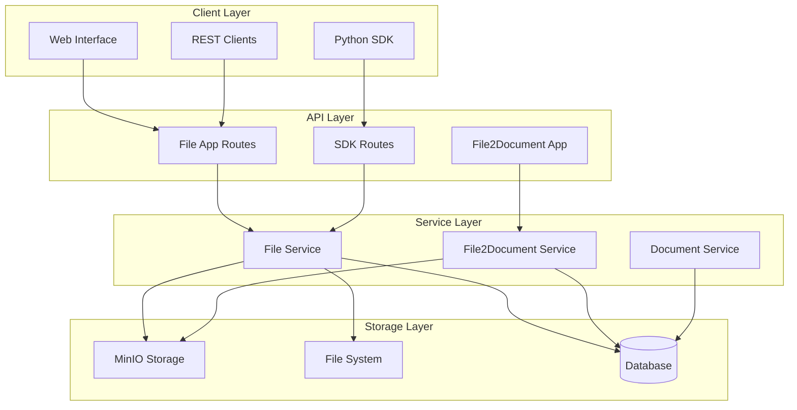
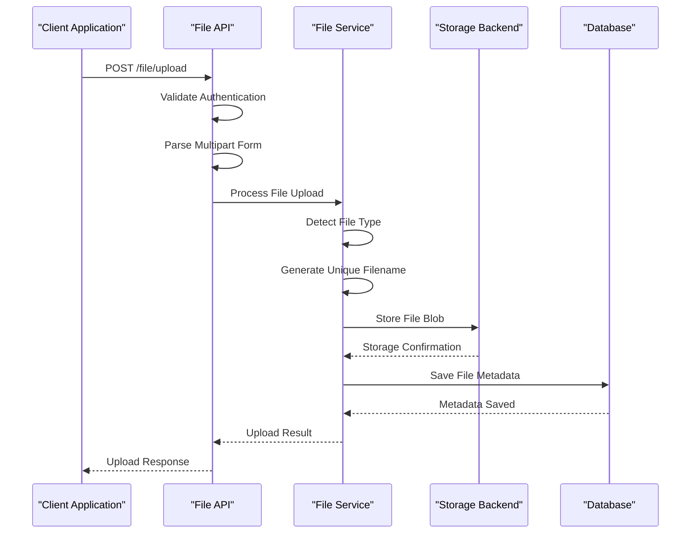
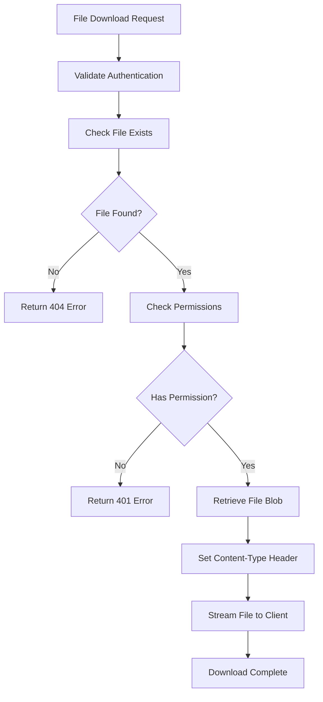
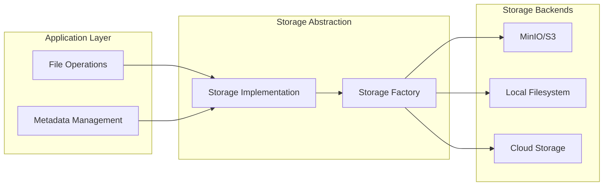
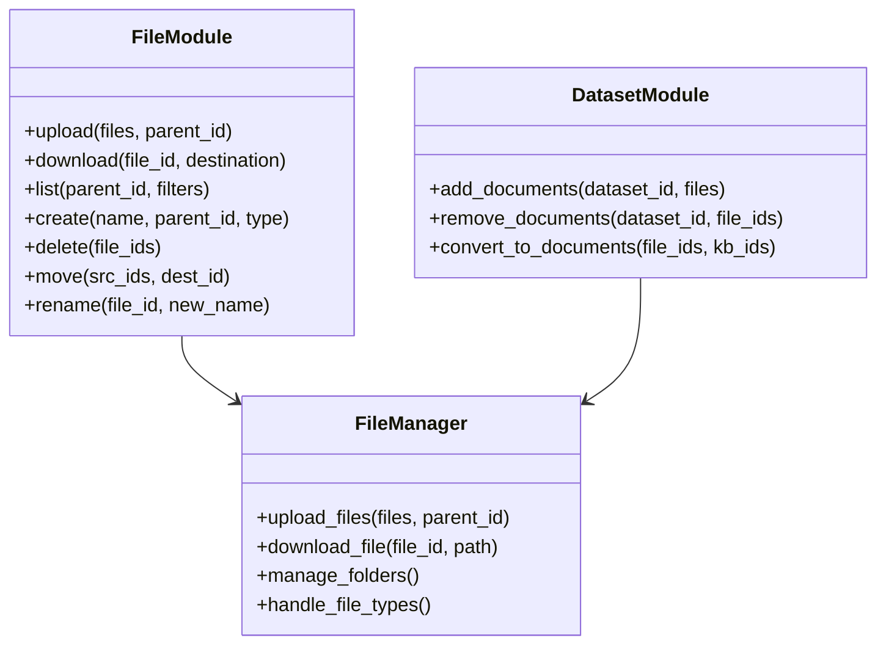

# Files API

<cite>
**Referenced Files in This Document**
- [api/apps/file_app.py](file://api/apps/file_app.py)
- [api/apps/file2document_app.py](file://api/apps/file2document_app.py)
- [api/apps/sdk/files.py](file://api/apps/sdk/files.py)
- [api/db/services/file_service.py](file://api/db/services/file_service.py)
- [api/db/services/file2document_service.py](file://api/db/services/file2document_service.py)
- [api/db/db_models.py](file://api/db/db_models.py)
- [sdk/python/test/test_http_api/test_file_management_within_dataset/test_upload_documents.py](file://sdk/python/test/test_http_api/test_file_management_within_dataset/test_upload_documents.py)
- [sdk/python/test/test_http_api/test_file_management_within_dataset/test_download_document.py](file://sdk/python/test/test_http_api/test_file_management_within_dataset/test_download_document.py)
- [common/data_source/file_types.py](file://common/data_source/file_types.py)
- [rag/utils/minio_conn.py](file://rag/utils/minio_conn.py)
</cite>

## Table of Contents
1. [Introduction](#introduction)
2. [Architecture Overview](#architecture-overview)
3. [Authentication and Authorization](#authentication-and-authorization)
4. [Core File Operations](#core-file-operations)
5. [File Storage Implementation](#file-storage-implementation)
6. [Python SDK Integration](#python-sdk-integration)
7. [Error Handling and Rate Limiting](#error-handling-and-rate-limiting)
8. [API Reference](#api-reference)
9. [Examples and Usage Patterns](#examples-and-usage-patterns)
10. [Best Practices](#best-practices)

## Introduction

The RAGFlow Files API provides comprehensive file management capabilities for uploading, retrieving, organizing, and managing files within the RAGFlow system. It serves as the foundation for document ingestion, knowledge base construction, and content management operations. The API supports various file types including documents, images, presentations, spreadsheets, and multimedia files, with integrated parsing and indexing capabilities.

The file management system is built on a layered architecture that separates concerns between file storage, metadata management, and business logic. It integrates seamlessly with the broader RAGFlow ecosystem, enabling programmatic file operations through both REST APIs and Python SDK.

## Architecture Overview

The Files API follows a modular architecture with clear separation of responsibilities:



**Diagram sources**
- [api/apps/file_app.py](file://api/apps/file_app.py#L38-L454)
- [api/apps/file2document_app.py](file://api/apps/file2document_app.py#L31-L133)
- [api/apps/sdk/files.py](file://api/apps/sdk/files.py#L35-L760)

**Section sources**
- [api/apps/file_app.py](file://api/apps/file_app.py#L1-L454)
- [api/apps/file2document_app.py](file://api/apps/file2document_app.py#L1-L133)
- [api/apps/sdk/files.py](file://api/apps/sdk/files.py#L1-L760)

## Authentication and Authorization

The Files API implements a robust authentication and authorization system using API keys and JWT tokens. All file operations require proper authentication and appropriate permissions.

### Authentication Methods

| Method | Description | Security Level |
|--------|-------------|----------------|
| API Key Authentication | Uses API keys for programmatic access | High |
| JWT Token Authentication | Session-based authentication for web interface | Medium |
| Bearer Token | Standard OAuth2 bearer token format | High |

### Authorization Controls

The system implements fine-grained access controls:

- **Tenant Isolation**: Files are isolated by tenant ID
- **Team Permissions**: Collaborative access control for team members
- **File Ownership**: Individual file access based on ownership
- **Resource Scoping**: Limited access to specific resources

**Section sources**
- [api/apps/__init__.py](file://api/apps/__init__.py#L114-L149)
- [admin/server/auth.py](file://admin/server/auth.py#L34-L66)

## Core File Operations

The Files API supports comprehensive file management operations through multiple endpoints and service layers.

### File Upload Operations

File uploads support both single and batch operations with automatic file type detection and validation.



**Diagram sources**
- [api/apps/file_app.py](file://api/apps/file_app.py#L38-L121)
- [api/apps/sdk/files.py](file://api/apps/sdk/files.py#L35-L148)

### File Retrieval and Download

The system provides efficient file retrieval with automatic content-type detection and streaming capabilities.



**Diagram sources**
- [api/apps/file_app.py](file://api/apps/file_app.py#L339-L366)
- [api/apps/sdk/files.py](file://api/apps/sdk/files.py#L585-L628)

### File Management Operations

The API supports comprehensive file management including creation, deletion, renaming, moving, and folder organization.

| Operation | Endpoint | Method | Description |
|-----------|----------|---------|-------------|
| Create File/Folder | `/file/create` | POST | Create new file or virtual folder |
| Upload Files | `/file/upload` | POST | Upload files with multipart form |
| List Files | `/file/list` | GET | List files in a folder with pagination |
| Get File Info | `/file/get/<file_id>` | GET | Download individual file |
| Rename File | `/file/rename` | POST | Rename existing file or folder |
| Move Files | `/file/mv` | POST | Move files between folders |
| Delete Files | `/file/rm` | POST | Delete one or multiple files |
| Get Parent Folder | `/file/parent_folder` | GET | Get parent folder information |
| Get All Parents | `/file/all_parent_folder` | GET | Get complete parent hierarchy |

**Section sources**
- [api/apps/file_app.py](file://api/apps/file_app.py#L38-L454)
- [api/apps/sdk/files.py](file://api/apps/sdk/files.py#L35-L760)

## File Storage Implementation

RAGFlow uses a flexible storage backend system that supports multiple storage providers including MinIO, S3-compatible storage, and local filesystem.

### Storage Architecture



**Diagram sources**
- [rag/utils/minio_conn.py](file://rag/utils/minio_conn.py#L43-L81)

### Supported File Types

The system supports a wide range of file formats with automatic MIME type detection:

| Category | Supported Formats | MIME Types |
|----------|-------------------|------------|
| Documents | PDF, DOCX, PPTX, XLSX | `application/pdf`, `application/msword`, `application/vnd.ms-powerpoint` |
| Text | TXT, MD, JSON, CSV | `text/plain`, `text/markdown`, `application/json` |
| Images | JPG, PNG, GIF, WEBP | `image/jpeg`, `image/png`, `image/gif` |
| Audio | MP3, WAV | `audio/mpeg`, `audio/wav` |
| Video | MP4 | `video/mp4` |
| Email | EML, MSG | `message/rfc822` |

**Section sources**
- [common/data_source/file_types.py](file://common/data_source/file_types.py#L1-L39)
- [api/db/services/file_service.py](file://api/db/services/file_service.py#L530-L540)

## Python SDK Integration

The Python SDK provides a comprehensive interface for programmatic file management operations, offering both synchronous and asynchronous APIs.

### SDK Features

The Python SDK includes specialized modules for different aspects of file management:

- **File Management**: Core file operations including upload, download, and organization
- **Dataset Integration**: Seamless integration with dataset operations
- **Document Processing**: Automatic document parsing and indexing
- **Batch Operations**: Efficient handling of multiple files

### SDK Usage Patterns



**Diagram sources**
- [api/apps/sdk/files.py](file://api/apps/sdk/files.py#L35-L760)

**Section sources**
- [api/apps/sdk/files.py](file://api/apps/sdk/files.py#L1-L760)

## Error Handling and Rate Limiting

The Files API implements comprehensive error handling and rate limiting to ensure system stability and fair resource allocation.

### Error Response Format

All API endpoints return standardized error responses:

| Status Code | Error Type | Description |
|-------------|------------|-------------|
| 400 | Bad Request | Invalid request parameters |
| 401 | Unauthorized | Missing or invalid authentication |
| 403 | Forbidden | Insufficient permissions |
| 404 | Not Found | Resource not found |
| 413 | Payload Too Large | File size exceeds limits |
| 500 | Internal Error | Server-side processing error |

### Rate Limiting Policies

The system implements rate limiting to prevent abuse and ensure fair usage:

- **Upload Rate Limits**: Configurable limits per user/tenant
- **Download Rate Limits**: Bandwidth-based throttling
- **API Call Limits**: Requests per minute/hour/day
- **Concurrent Operation Limits**: Maximum simultaneous operations

**Section sources**
- [api/apps/file_app.py](file://api/apps/file_app.py#L119-L121)
- [api/apps/sdk/files.py](file://api/apps/sdk/files.py#L147-L149)

## API Reference

### File Upload

**Endpoint**: `POST /file/upload`

**Description**: Upload one or more files to the system with automatic folder creation and duplicate handling.

**Request Parameters**:
- `file` (formData): File(s) to upload (required)
- `parent_id` (formData): Parent folder ID (optional)

**Request Body Schema**:
```json
{
  "file": "binary_data",
  "parent_id": "string"
}
```

**Response Format**:
```json
{
  "retcode": 0,
  "retmsg": "success",
  "data": [
    {
      "id": "string",
      "name": "string",
      "size": "integer",
      "type": "string",
      "create_time": "string",
      "parent_id": "string"
    }
  ]
}
```

### File Download

**Endpoint**: `GET /file/get/<file_id>`

**Description**: Download a file by ID with automatic content-type detection.

**Path Parameters**:
- `file_id` (required): ID of the file to download

**Response**: Binary file stream with appropriate Content-Type header

### File Listing

**Endpoint**: `GET /file/list`

**Description**: List files in a specific folder with pagination and filtering.

**Query Parameters**:
- `parent_id` (optional): Folder ID to list files from
- `keywords` (optional): Search keyword filter
- `page` (optional): Page number (default: 1)
- `page_size` (optional): Items per page (default: 15)
- `orderby` (optional): Sort field (default: "create_time")
- `desc` (optional): Descending order flag (default: true)

**Response Format**:
```json
{
  "retcode": 0,
  "retmsg": "success",
  "data": {
    "total": "integer",
    "files": [],
    "parent_folder": {}
  }
}
```

### File Creation

**Endpoint**: `POST /file/create`

**Description**: Create a new file or virtual folder.

**Request Body Schema**:
```json
{
  "name": "string",
  "parent_id": "string",
  "type": "FOLDER|VIRTUAL"
}
```

**Response Format**:
```json
{
  "retcode": 0,
  "retmsg": "success",
  "data": {
    "id": "string",
    "name": "string",
    "type": "string",
    "size": "integer",
    "create_time": "string"
  }
}
```

### File Deletion

**Endpoint**: `POST /file/rm`

**Description**: Delete one or multiple files or folders.

**Request Body Schema**:
```json
{
  "file_ids": ["string"]
}
```

**Response Format**:
```json
{
  "retcode": 0,
  "retmsg": "success",
  "data": true
}
```

### File Renaming

**Endpoint**: `POST /file/rename`

**Description**: Rename an existing file or folder.

**Request Body Schema**:
```json
{
  "file_id": "string",
  "name": "string"
}
```

**Response Format**:
```json
{
  "retcode": 0,
  "retmsg": "success",
  "data": true
}
```

### File Movement

**Endpoint**: `POST /file/mv`

**Description**: Move one or multiple files to another folder.

**Request Body Schema**:
```json
{
  "src_file_ids": ["string"],
  "dest_file_id": "string"
}
```

**Response Format**:
```json
{
  "retcode": 0,
  "retmsg": "success",
  "data": true
}
```

**Section sources**
- [api/apps/file_app.py](file://api/apps/file_app.py#L38-L454)
- [api/apps/sdk/files.py](file://api/apps/sdk/files.py#L35-L760)

## Examples and Usage Patterns

### Basic File Upload Example

```python
import requests
from pathlib import Path

# Upload a single file
def upload_file(api_key, file_path, parent_id=None):
    url = "https://api.ragflow.io/file/upload"
    headers = {"Authorization": f"Bearer {api_key}"}
    
    with open(file_path, 'rb') as f:
        files = {'file': f}
        data = {'parent_id': parent_id} if parent_id else {}
        
        response = requests.post(url, headers=headers, files=files, data=data)
        return response.json()

# Usage
result = upload_file("your-api-key", "document.pdf")
print(result)
```

### Batch File Upload Example

```python
import concurrent.futures
from pathlib import Path

def upload_multiple_files(api_key, file_paths, parent_id=None):
    results = []
    
    def upload_single_file(file_path):
        return upload_file(api_key, file_path, parent_id)
    
    with concurrent.futures.ThreadPoolExecutor(max_workers=5) as executor:
        future_to_file = {executor.submit(upload_single_file, fp): fp for fp in file_paths}
        for future in concurrent.futures.as_completed(future_to_file):
            file_path = future_to_file[future]
            try:
                result = future.result()
                results.append({"file": file_path.name, "success": True, "data": result})
            except Exception as exc:
                results.append({"file": file_path.name, "success": False, "error": str(exc)})
    
    return results
```

### File Download Example

```python
def download_file(api_key, file_id, destination_path):
    url = f"https://api.ragflow.io/file/get/{file_id}"
    headers = {"Authorization": f"Bearer {api_key}"}
    
    response = requests.get(url, headers=headers, stream=True)
    
    if response.status_code == 200:
        with open(destination_path, 'wb') as f:
            for chunk in response.iter_content(chunk_size=8192):
                f.write(chunk)
        return True
    return False
```

### Folder Organization Example

```python
def organize_files_by_type(api_key, source_folder, target_structure):
    # Create target folders
    folders = {}
    for file_type in target_structure:
        result = create_folder(api_key, file_type, source_folder)
        folders[file_type] = result['data']['id']
    
    # List all files in source folder
    files = list_files(api_key, source_folder)
    
    # Move files to appropriate folders based on type
    for file_info in files['data']['files']:
        file_ext = Path(file_info['name']).suffix.lower()
        target_folder = target_structure.get(file_ext, 'other')
        
        if target_folder in folders:
            move_file(api_key, [file_info['id']], folders[target_folder])

def create_folder(api_key, name, parent_id=None):
    url = "https://api.ragflow.io/file/create"
    headers = {"Authorization": f"Bearer {api_key}"}
    data = {"name": name, "type": "FOLDER"}
    
    if parent_id:
        data["parent_id"] = parent_id
    
    response = requests.post(url, headers=headers, json=data)
    return response.json()
```

**Section sources**
- [sdk/python/test/test_http_api/test_file_management_within_dataset/test_upload_documents.py](sdk/python/test/test_http_api/test_file_management_within_dataset/test_upload_documents.py#L48-L219)
- [sdk/python/test/test_http_api/test_file_management_within_dataset/test_download_document.py](sdk/python/test/test_http_api/test_file_management_within_dataset/test_download_document.py#L27-L179)

## Best Practices

### File Upload Best Practices

1. **File Size Management**: Implement client-side validation for file size limits
2. **Duplicate Handling**: Use the automatic duplicate naming feature
3. **Progress Tracking**: Implement progress indicators for large file uploads
4. **Error Recovery**: Implement retry logic with exponential backoff
5. **Security Validation**: Validate file content type and extension

### Performance Optimization

1. **Batch Operations**: Use batch endpoints for multiple file operations
2. **Pagination**: Implement proper pagination for large file lists
3. **Concurrent Processing**: Use thread pools for parallel operations
4. **Streaming**: Use streaming for large file downloads
5. **Caching**: Implement client-side caching for frequently accessed files

### Security Considerations

1. **Authentication**: Always use proper API key authentication
2. **File Validation**: Validate file content and metadata
3. **Access Control**: Respect tenant isolation and permission boundaries
4. **Input Sanitization**: Sanitize file names and paths
5. **Audit Logging**: Implement audit logging for file operations

### Error Handling Guidelines

1. **Graceful Degradation**: Handle partial failures gracefully
2. **User Feedback**: Provide meaningful error messages
3. **Retry Logic**: Implement intelligent retry mechanisms
4. **Timeout Management**: Set appropriate timeouts for operations
5. **Resource Cleanup**: Clean up temporary resources on failure