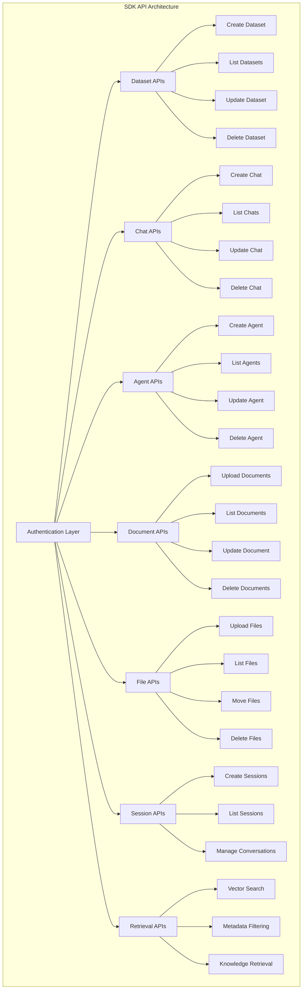

# SDK API Documentation

<cite>
**Referenced Files in This Document**
- [api/apps/sdk/agents.py](file://api/apps/sdk/agents.py)
- [api/apps/sdk/chat.py](file://api/apps/sdk/chat.py)
- [api/apps/sdk/dataset.py](file://api/apps/sdk/dataset.py)
- [api/apps/sdk/doc.py](file://api/apps/sdk/doc.py)
- [api/apps/sdk/session.py](file://api/apps/sdk/session.py)
- [api/apps/sdk/files.py](file://api/apps/sdk/files.py)
- [api/apps/sdk/dify_retrieval.py](file://api/apps/sdk/dify_retrieval.py)
- [api/utils/api_utils.py](file://api/utils/api_utils.py)
- [sdk/python/ragflow_sdk/ragflow.py](file://sdk/python/ragflow_sdk/ragflow.py)
- [sdk/python/ragflow_sdk/modules/base.py](file://sdk/python/ragflow_sdk/modules/base.py)
- [sdk/python/ragflow_sdk/modules/agent.py](file://sdk/python/ragflow_sdk/modules/agent.py)
- [sdk/python/ragflow_sdk/modules/chat.py](file://sdk/python/ragflow_sdk/modules/chat.py)
- [sdk/python/ragflow_sdk/modules/dataset.py](file://sdk/python/ragflow_sdk/modules/dataset.py)
- [api/apps/api_app.py](file://api/apps/api_app.py)
</cite>

## Table of Contents
1. [Introduction](#introduction)
2. [Authentication and Authorization](#authentication-and-authorization)
3. [API Architecture Overview](#api-architecture-overview)
4. [Dataset Management APIs](#dataset-management-apis)
5. [Chat and Assistant APIs](#chat-and-assistant-apis)
6. [Agent Management APIs](#agent-management-apis)
7. [Document and File Management APIs](#document-and-file-management-apis)
8. [Session Management APIs](#session-management-apis)
9. [Retrieval and Search APIs](#retrieval-and-search-apis)
10. [Rate Limiting and Error Handling](#rate-limiting-and-error-handling)
11. [Python SDK Implementation](#python-sdk-implementation)
12. [Common Usage Patterns](#common-usage-patterns)

## Introduction

RAGFlow provides a comprehensive SDK API that enables external applications to programmatically interact with core platform features. The API follows RESTful principles and supports various operations including dataset management, document processing, chat interactions, agent orchestration, and file management.

The SDK serves as the foundation for the Python client library and other client implementations, providing a standardized interface for integrating RAGFlow capabilities into external applications.

## Authentication and Authorization

All SDK endpoints require authentication using Bearer tokens. The authentication mechanism ensures secure access to platform resources and maintains tenant isolation.

### Authentication Header Format

```http
Authorization: Bearer <API_KEY>
```

### Token Generation

API tokens are generated through the platform's authentication system and can be managed through the `/new_token` endpoint.

**Section sources**
- [api/apps/api_app.py](file://api/apps/api_app.py#L26-L51)
- [api/utils/api_utils.py](file://api/utils/api_utils.py#L197-L200)

## API Architecture Overview

The RAGFlow SDK API is organized into several functional groups, each serving specific capabilities:



**Diagram sources**
- [api/apps/sdk/agents.py](file://api/apps/sdk/agents.py#L1-L180)
- [api/apps/sdk/chat.py](file://api/apps/sdk/chat.py#L1-L325)
- [api/apps/sdk/dataset.py](file://api/apps/sdk/dataset.py#L1-L690)
- [api/apps/sdk/doc.py](file://api/apps/sdk/doc.py#L1-L800)
- [api/apps/sdk/session.py](file://api/apps/sdk/session.py#L1-L800)
- [api/apps/sdk/files.py](file://api/apps/sdk/files.py#L1-L760)
- [api/apps/sdk/dify_retrieval.py](file://api/apps/sdk/dify_retrieval.py#L1-L183)

## Dataset Management APIs

Dataset APIs provide comprehensive functionality for managing knowledge bases, including creation, configuration, and lifecycle management.

### Create Dataset

Creates a new dataset with specified configuration parameters.

**Endpoint:** `POST /datasets`

**Request Headers:**
```http
Content-Type: application/json
Authorization: Bearer <API_KEY>
```

**Request Body:**
```json
{
  "name": "string",
  "avatar": "string",
  "description": "string",
  "embedding_model": "string",
  "permission": "me|team",
  "chunk_method": "naive|book|email|laws|manual|one|paper|picture|presentation|qa|table|tag",
  "parser_config": {
    "chunk_size": 500,
    "chunk_overlap": 50,
    "language": "en"
  }
}
```

**Response:**
```json
{
  "code": 0,
  "message": "success",
  "data": {
    "id": "string",
    "name": "string",
    "description": "string",
    "embedding_model": "string",
    "permission": "me|team",
    "chunk_method": "string",
    "document_count": 0,
    "chunk_count": 0,
    "parser_config": {}
  }
}
```

### List Datasets

Retrieves a paginated list of datasets with optional filtering.

**Endpoint:** `GET /datasets`

**Query Parameters:**
- `id` (string): Filter by dataset ID
- `name` (string): Filter by dataset name
- `page` (integer): Page number (default: 1)
- `page_size` (integer): Items per page (default: 30)
- `orderby` (string): Sort field (default: "create_time")
- `desc` (boolean): Sort direction (default: true)

**Response:**
```json
{
  "code": 0,
  "message": "success",
  "data": [
    {
      "id": "string",
      "name": "string",
      "description": "string",
      "embedding_model": "string",
      "permission": "me|team",
      "chunk_method": "string",
      "document_count": 0,
      "chunk_count": 0
    }
  ],
  "total": 1
}
```

### Update Dataset

Updates dataset configuration and properties.

**Endpoint:** `PUT /datasets/{dataset_id}`

**Request Body:**
```json
{
  "name": "string",
  "description": "string",
  "embedding_model": "string",
  "permission": "me|team",
  "chunk_method": "naive|book|email|laws|manual|one|paper|picture|presentation|qa|table|tag",
  "parser_config": {},
  "pagerank": 0
}
```

### Delete Dataset

Removes one or more datasets from the system.

**Endpoint:** `DELETE /datasets`

**Request Body:**
```json
{
  "ids": ["dataset_id1", "dataset_id2"]
}
```

**Section sources**
- [api/apps/sdk/dataset.py](file://api/apps/sdk/dataset.py#L55-L690)

## Chat and Assistant APIs

Chat APIs enable creation and management of conversational assistants with integrated knowledge base capabilities.

### Create Chat Assistant

Creates a new chat assistant with specified configuration and knowledge base integration.

**Endpoint:** `POST /chats`

**Request Headers:**
```http
Content-Type: application/json
Authorization: Bearer <API_KEY>
```

**Request Body:**
```json
{
  "name": "string",
  "avatar": "string",
  "dataset_ids": ["dataset_id1", "dataset_id2"],
  "llm": {
    "model_name": "string",
    "temperature": 0.1,
    "top_p": 0.3,
    "presence_penalty": 0.4,
    "frequency_penalty": 0.7,
    "max_tokens": 512
  },
  "prompt": {
    "similarity_threshold": 0.2,
    "keywords_similarity_weight": 0.7,
    "top_n": 8,
    "top_k": 1024,
    "variables": [{"key": "knowledge", "optional": true}],
    "rerank_model": "",
    "empty_response": "string",
    "opener": "string",
    "show_quote": true,
    "prompt": "string"
  }
}
```

**Response:**
```json
{
  "code": 0,
  "message": "success",
  "data": {
    "id": "string",
    "name": "string",
    "avatar": "string",
    "dataset_ids": ["string"],
    "llm": {
      "model_name": "string",
      "temperature": 0.1,
      "top_p": 0.3,
      "presence_penalty": 0.4,
      "frequency_penalty": 0.7,
      "max_tokens": 512
    },
    "prompt": {
      "similarity_threshold": 0.2,
      "keywords_similarity_weight": 0.7,
      "top_n": 8,
      "top_k": 1024,
      "variables": [],
      "rerank_model": "",
      "empty_response": "string",
      "opener": "string",
      "show_quote": true,
      "prompt": "string"
    }
  }
}
```

### List Chat Assistants

Retrieves a list of configured chat assistants with pagination support.

**Endpoint:** `GET /chats`

**Query Parameters:**
- `id` (string): Filter by chat ID
- `name` (string): Filter by chat name
- `page` (integer): Page number
- `page_size` (integer): Items per page
- `orderby` (string): Sort field
- `desc` (boolean): Sort direction

### Update Chat Assistant

Modifies existing chat assistant configuration.

**Endpoint:** `PUT /chats/{chat_id}`

**Request Body:**
```json
{
  "name": "string",
  "avatar": "string",
  "dataset_ids": ["dataset_id1", "dataset_id2"],
  "llm": {
    "model_name": "string",
    "temperature": 0.1,
    "top_p": 0.3,
    "presence_penalty": 0.4,
    "frequency_penalty": 0.7,
    "max_tokens": 512
  },
  "prompt": {
    "similarity_threshold": 0.2,
    "keywords_similarity_weight": 0.7,
    "top_n": 8,
    "top_k": 1024,
    "variables": [],
    "rerank_model": "",
    "empty_response": "string",
    "opener": "string",
    "show_quote": true,
    "prompt": "string"
  }
}
```

### Delete Chat Assistants

Removes one or more chat assistants from the system.

**Endpoint:** `DELETE /chats`

**Request Body:**
```json
{
  "ids": ["chat_id1", "chat_id2"]
}
```

**Section sources**
- [api/apps/sdk/chat.py](file://api/apps/sdk/chat.py#L27-L325)

## Agent Management APIs

Agent APIs provide functionality for creating, managing, and orchestrating AI agents with complex workflows.

### Create Agent

Creates a new agent with specified DSL (Domain Specific Language) configuration.

**Endpoint:** `POST /agents`

**Request Headers:**
```http
Content-Type: application/json
Authorization: Bearer <API_KEY>
```

**Request Body:**
```json
{
  "title": "string",
  "description": "string",
  "dsl": {
    "components": {},
    "graph": {},
    "history": [],
    "messages": [],
    "path": [],
    "reference": []
  }
}
```

**Response:**
```json
{
  "code": 0,
  "message": "success",
  "data": true
}
```

### List Agents

Retrieves a list of available agents with pagination and filtering.

**Endpoint:** `GET /agents`

**Query Parameters:**
- `id` (string): Filter by agent ID
- `title` (string): Filter by agent title
- `page` (integer): Page number
- `page_size` (integer): Items per page
- `orderby` (string): Sort field
- `desc` (boolean): Sort direction

### Update Agent

Modifies agent configuration and DSL definition.

**Endpoint:** `PUT /agents/{agent_id}`

**Request Body:**
```json
{
  "title": "string",
  "description": "string",
  "dsl": {
    "components": {},
    "graph": {},
    "history": [],
    "messages": [],
    "path": [],
    "reference": []
  }
}
```

### Delete Agent

Removes an agent from the system.

**Endpoint:** `DELETE /agents/{agent_id}`

### Webhook Endpoint

Enables webhook-based triggering of agent workflows.

**Endpoint:** `POST /webhook/{agent_id}`

**Request Body:**
```json
{
  "id": "string",
  "query": "string",
  "files": [],
  "user_id": "string",
  "webhook_payload": {}
}
```

**Section sources**
- [api/apps/sdk/agents.py](file://api/apps/sdk/agents.py#L33-L180)

## Document and File Management APIs

Document and file management APIs handle the complete lifecycle of documents within datasets, including upload, processing, and retrieval.

### Upload Documents

Uploads documents to a specific dataset for processing and indexing.

**Endpoint:** `POST /datasets/{dataset_id}/documents`

**Request Headers:**
```http
Content-Type: multipart/form-data
Authorization: Bearer <API_KEY>
```

**Form Data:**
- `file`: Document file (required)
- `parent_path`: Nested path for organization

**Response:**
```json
{
  "code": 0,
  "message": "success",
  "data": [
    {
      "id": "string",
      "name": "string",
      "chunk_count": 0,
      "token_count": 0,
      "dataset_id": "string",
      "chunk_method": "string",
      "run": "UNSTART"
    }
  ]
}
```

### List Documents

Retrieves documents within a dataset with comprehensive filtering and pagination.

**Endpoint:** `GET /datasets/{dataset_id}/documents`

**Query Parameters:**
- `id` (string): Filter by document ID
- `name` (string): Filter by document name
- `page` (integer): Page number
- `page_size` (integer): Items per page
- `orderby` (string): Sort field
- `desc` (boolean): Sort direction
- `create_time_from` (integer): Creation timestamp filter
- `create_time_to` (integer): Creation timestamp filter
- `suffix` (array): File extension filter
- `run` (array): Processing status filter

### Update Document

Modifies document properties and configuration.

**Endpoint:** `PUT /datasets/{dataset_id}/documents/{document_id}`

**Request Body:**
```json
{
  "name": "string",
  "parser_config": {},
  "chunk_method": "naive|book|email|laws|manual|one|paper|picture|presentation|qa|table|tag",
  "enabled": true,
  "meta_fields": {}
}
```

### Delete Documents

Removes documents from a dataset.

**Endpoint:** `DELETE /datasets/{dataset_id}/documents`

**Request Body:**
```json
{
  "ids": ["document_id1", "document_id2"]
}
```

### Parse Documents

Initiates the document processing pipeline for chunking and indexing.

**Endpoint:** `POST /datasets/{dataset_id}/chunks`

**Request Body:**
```json
{
  "document_ids": ["document_id1", "document_id2"]
}
```

### Retrieve Document

Downloads a document file from the system.

**Endpoint:** `GET /datasets/{dataset_id}/documents/{document_id}`

**Response:** Binary file stream with appropriate MIME type.

**Section sources**
- [api/apps/sdk/doc.py](file://api/apps/sdk/doc.py#L71-L800)

## Session Management APIs

Session APIs manage conversational contexts and maintain state across interactions with chat assistants and agents.

### Create Session

Creates a new conversation session for a chat assistant or agent.

**Endpoint:** `POST /chats/{chat_id}/sessions`

**Request Body:**
```json
{
  "name": "string",
  "user_id": "string"
}
```

**Response:**
```json
{
  "code": 0,
  "message": "success",
  "data": {
    "id": "string",
    "name": "string",
    "chat_id": "string",
    "messages": [],
    "user_id": "string"
  }
}
```

### List Sessions

Retrieves conversation sessions with pagination and filtering.

**Endpoint:** `GET /chats/{chat_id}/sessions`

**Query Parameters:**
- `id` (string): Filter by session ID
- `name` (string): Filter by session name
- `page` (integer): Page number
- `page_size` (integer): Items per page
- `orderby` (string): Sort field
- `desc` (boolean): Sort direction
- `user_id` (string): Filter by user ID

### Update Session

Modifies session properties.

**Endpoint:** `PUT /chats/{chat_id}/sessions/{session_id}`

**Request Body:**
```json
{
  "name": "string"
}
```

### Delete Sessions

Removes conversation sessions.

**Endpoint:** `DELETE /chats/{chat_id}/sessions`

**Request Body:**
```json
{
  "ids": ["session_id1", "session_id2"]
}
```

### Chat Completion

Initiates a chat completion request with streaming support.

**Endpoint:** `POST /chats/{chat_id}/completions`

**Request Body:**
```json
{
  "session_id": "string",
  "question": "string",
  "stream": true,
  "reference": true
}
```

**Streaming Response:**
```
data: {"code": 0, "message": "", "data": {"answer": "partial response", "reference": []}}

data: {"code": 0, "message": "", "data": true}
```

### OpenAI-Compatible Chat Completion

Provides OpenAI-compatible API endpoints for seamless integration.

**Endpoint:** `POST /chats_openai/{chat_id}/chat/completions`

**Request Body:**
```json
{
  "model": "string",
  "messages": [
    {"role": "system", "content": "string"},
    {"role": "user", "content": "string"}
  ],
  "stream": true,
  "reference": true
}
```

**Section sources**
- [api/apps/sdk/session.py](file://api/apps/sdk/session.py#L45-L800)

## Retrieval and Search APIs

Retrieval APIs provide powerful search and knowledge extraction capabilities across datasets and documents.

### Vector Search

Performs semantic search across indexed documents.

**Endpoint:** `POST /retrieval`

**Request Body:**
```json
{
  "question": "string",
  "dataset_ids": ["dataset_id1", "dataset_id2"],
  "document_ids": ["document_id1"],
  "page": 1,
  "page_size": 30,
  "similarity_threshold": 0.2,
  "vector_similarity_weight": 0.3,
  "top_k": 1024,
  "rerank_id": "string",
  "keyword": false,
  "cross_languages": ["en", "zh"],
  "metadata_condition": {
    "conditions": [
      {
        "name": "field_name",
        "comparison_operator": "==",
        "value": "field_value"
      }
    ],
    "logic": "and"
  }
}
```

**Response:**
```json
{
  "code": 0,
  "message": "success",
  "data": {
    "chunks": [
      {
        "id": "string",
        "content_with_weight": "string",
        "similarity": 0.95,
        "doc_id": "string",
        "docnm_kwd": "string",
        "kb_id": "string",
        "image_id": "string",
        "positions": [[0, 0, 0, 0, 0]]
      }
    ]
  }
}
```

### Dify-Compatible Retrieval

Provides compatibility with Dify AI platform for seamless integration.

**Endpoint:** `POST /dify/retrieval`

**Request Body:**
```json
{
  "knowledge_id": "string",
  "query": "string",
  "use_kg": false,
  "retrieval_setting": {
    "score_threshold": 0.0,
    "top_k": 1024
  },
  "metadata_condition": {
    "conditions": []
  }
}
```

**Response:**
```json
{
  "records": [
    {
      "content": "string",
      "score": 0.95,
      "title": "string",
      "metadata": {}
    }
  ]
}
```

**Section sources**
- [api/apps/sdk/dify_retrieval.py](file://api/apps/sdk/dify_retrieval.py#L29-L183)

## Rate Limiting and Error Handling

The RAGFlow SDK API implements comprehensive rate limiting and error handling mechanisms to ensure reliable service operation.

### Error Response Format

All API endpoints return standardized error responses:

```json
{
  "code": 400,
  "message": "Error description",
  "data": null
}
```

### Common Error Codes

| Code | Description |
|------|-------------|
| 0 | Success |
| 400 | Bad Request - Invalid parameters |
| 401 | Unauthorized - Invalid or missing API key |
| 403 | Forbidden - Insufficient permissions |
| 404 | Not Found - Resource not found |
| 409 | Conflict - Resource already exists |
| 500 | Internal Server Error |

### Rate Limiting Policies

- **Requests per minute**: Configurable per tenant
- **Concurrent sessions**: Limited per user
- **File upload size**: Maximum 10MB per file
- **Batch operations**: Limited to 256 items per request

### Error Handling Best Practices

1. **Retry Logic**: Implement exponential backoff for transient failures
2. **Timeout Handling**: Set reasonable timeouts for all requests
3. **Validation**: Validate input parameters before API calls
4. **Logging**: Log all API responses for debugging and monitoring

**Section sources**
- [api/utils/api_utils.py](file://api/utils/api_utils.py#L109-L141)

## Python SDK Implementation

The RAGFlow Python SDK provides a high-level interface for interacting with the SDK APIs, offering convenient methods and automatic error handling.

### Initialization

```python
from ragflow_sdk import RAGFlow

rag = RAGFlow(
    api_key="your_api_key",
    base_url="http://localhost:9380",
    version="v1"
)
```

### Dataset Operations

```python
# Create dataset
dataset = rag.create_dataset(
    name="My Knowledge Base",
    description="Technical documentation",
    embedding_model="sentence-transformers/all-MiniLM-L6-v2"
)

# List datasets
datasets = rag.list_datasets(page=1, page_size=10)

# Update dataset
dataset.update({
    "description": "Updated description",
    "embedding_model": "sentence-transformers/all-mpnet-base-v2"
})

# Delete dataset
rag.delete_datasets(["dataset_id"])
```

### Chat Assistant Operations

```python
# Create chat assistant
chat = rag.create_chat(
    name="Technical Support",
    dataset_ids=["dataset_id"],
    llm={
        "model_name": "gpt-3.5-turbo",
        "temperature": 0.1
    }
)

# List chats
chats = rag.list_chats()

# Create session
session = chat.create_session(name="Support Session")

# Chat completion
response = chat.post(f"/chats/{chat.id}/completions", {
    "session_id": session.id,
    "question": "How do I reset my password?",
    "stream": True
})
```

### Agent Operations

```python
# Create agent
rag.create_agent(
    title="Customer Service Bot",
    dsl={
        "components": {...},
        "graph": {...}
    }
)

# List agents
agents = rag.list_agents()

# Create agent session
session = agent.create_session()
```

### Document Management

```python
# Upload documents
documents = dataset.upload_documents([
    {
        "display_name": "manual.pdf",
        "blob": open("manual.pdf", "rb").read()
    }
])

# List documents
docs = dataset.list_documents(page=1, page_size=10)

# Parse documents
parsed = dataset.parse_documents([doc.id for doc in docs])
```

**Section sources**
- [sdk/python/ragflow_sdk/ragflow.py](file://sdk/python/ragflow_sdk/ragflow.py#L26-L286)
- [sdk/python/ragflow_sdk/modules/base.py](file://sdk/python/ragflow_sdk/modules/base.py#L41-L55)

## Common Usage Patterns

### Pattern 1: Complete Knowledge Base Setup

```python
# 1. Create dataset
dataset = rag.create_dataset(
    name="Company Documentation",
    description="Internal company policies and procedures"
)

# 2. Upload documents
documents = dataset.upload_documents([
    {"display_name": "policy_manual.pdf", "blob": policy_blob},
    {"display_name": "faq.docx", "blob": faq_blob}
])

# 3. Parse documents
parsed = dataset.parse_documents([doc.id for doc in documents])

# 4. Create chat assistant
chat = rag.create_chat(
    name="Company Assistant",
    dataset_ids=[dataset.id],
    llm={"model_name": "gpt-3.5-turbo"}
)
```

### Pattern 2: Interactive Chat Session

```python
# 1. Create session
session = chat.create_session(name="Employee Inquiry")

# 2. Send messages with streaming
response = chat.post(f"/chats/{chat.id}/completions", {
    "session_id": session.id,
    "question": "What are the vacation policies?",
    "stream": True,
    "reference": True
})

# Process streaming response
for chunk in response.iter_lines():
    if chunk:
        data = json.loads(chunk.decode('utf-8'))
        if data.get('code') == 0:
            print(data['data']['answer'])
```

### Pattern 3: Agent Workflow

```python
# 1. Create agent with DSL
rag.create_agent(
    title="Lead Qualification Bot",
    dsl={
        "components": {
            "begin": {"downstream": ["qualification"]},
            "qualification": {
                "downstream": ["research", "scoring"],
                "obj": {"component_name": "Categorize"}
            }
        }
    }
)

# 2. Create agent session
agent_session = agent.create_session()

# 3. Trigger agent workflow
response = agent.post(f"/agents/{agent.id}/completions", {
    "query": "Qualify lead from Acme Corp",
    "stream": True
})
```

### Pattern 4: Advanced Retrieval with Filters

```python
# Perform semantic search with metadata filtering
results = rag.retrieve(
    dataset_ids=["dataset_id"],
    question="How to configure firewall?",
    similarity_threshold=0.3,
    metadata_condition={
        "conditions": [
            {"name": "category", "comparison_operator": "==", "value": "networking"},
            {"name": "severity", "comparison_operator": ">=", "value": "medium"}
        ],
        "logic": "and"
    }
)

# Process results
for chunk in results:
    print(f"Score: {chunk.similarity}")
    print(f"Content: {chunk.content_with_weight}")
    print(f"Source: {chunk.docnm_kwd}")
```

These patterns demonstrate the core functionality of the RAGFlow SDK and provide a foundation for building sophisticated AI-powered applications with knowledge management capabilities.