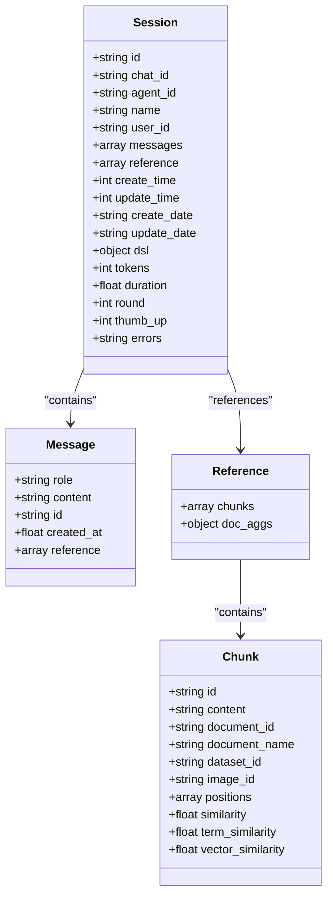
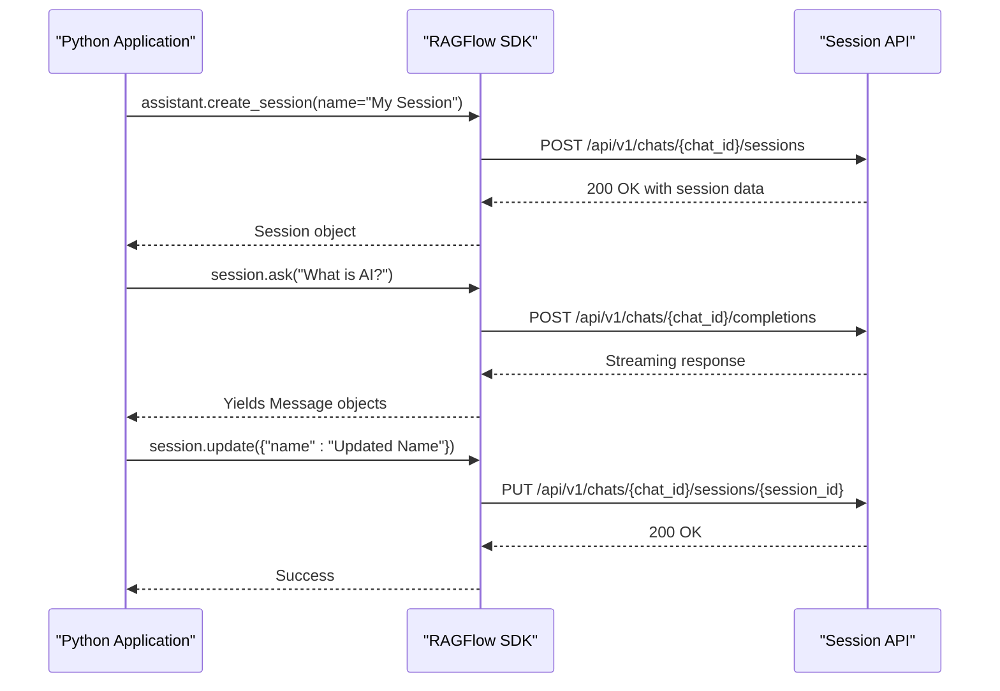

# Session API

<cite>
**Referenced Files in This Document**   
- [session.py](file://api/apps/sdk/session.py)
- [conversation_service.py](file://api/db/services/conversation_service.py)
- [api_service.py](file://api/db/services/api_service.py)
- [db_models.py](file://api/db/db_models.py)
- [session.py](file://sdk/python/ragflow_sdk/modules/session.py)
- [http_api_reference.md](file://docs/references/http_api_reference.md)
</cite>

## Table of Contents
1. [Introduction](#introduction)
2. [Authentication](#authentication)
3. [Session Management](#session-management)
   - [Create Session with Chat Assistant](#create-session-with-chat-assistant)
   - [Update Chat Assistant's Session](#update-chat-assistants-session)
   - [List Chat Assistant's Sessions](#list-chat-assistants-sessions)
   - [Delete Chat Assistant's Sessions](#delete-chat-assistants-sessions)
   - [Create Session with Agent](#create-session-with-agent)
   - [List Agent Sessions](#list-agent-sessions)
   - [Delete Agent's Sessions](#delete-agents-sessions)
4. [Session Data Model](#session-data-model)
5. [Python SDK Integration](#python-sdk-integration)
6. [Error Handling](#error-handling)
7. [Rate Limiting and Performance](#rate-limiting-and-performance)

## Introduction
The Session API provides endpoints for managing conversational sessions with both chat assistants and agents within the RAGFlow system. Sessions serve as containers for maintaining conversation state, preserving message history, and managing context across multiple interactions. This API enables programmatic creation, retrieval, update, and deletion of sessions, allowing developers to integrate conversational capabilities into their applications.

Sessions are associated with either chat assistants or agents and maintain a complete history of interactions, including user queries and system responses. Each session preserves context, enabling coherent multi-turn conversations. The API supports both synchronous and streaming responses, providing flexibility in how applications handle conversational interactions.

**Section sources**
- [http_api_reference.md](file://docs/references/http_api_reference.md#L2637-L4054)

## Authentication
All Session API endpoints require authentication using an API key. Clients must include the API key in the Authorization header of each request using the Bearer token scheme. The authentication system validates the API key against the tenant's credentials and ensures that the requesting user has appropriate permissions to access the requested resources.

The API key should be included in the HTTP Authorization header as follows:
```
Authorization: Bearer <YOUR_API_KEY>
```

Authentication is enforced through the `@token_required` decorator applied to all session endpoints. This decorator validates the provided token and ensures that only authorized users can perform session operations. The system also supports JWT-based authentication for web interfaces, but API clients should use the API key method.

**Section sources**
- [session.py](file://api/apps/sdk/session.py#L46-L47)
- [__init__.py](file://api/apps/__init__.py#L114-L149)
- [auth.py](file://admin/server/auth.py#L38-L66)

## Session Management

### Create Session with Chat Assistant
Creates a new session with a specified chat assistant.

**POST** `/api/v1/chats/{chat_id}/sessions`

#### Request
- Method: POST
- URL: `/api/v1/chats/{chat_id}/sessions`
- Headers:
  - `'Content-Type: application/json'`
  - `'Authorization: Bearer <YOUR_API_KEY>'`
- Body:
  - `"name"`: `string` - The name of the chat session to create
  - `"user_id"`: `string` (optional) - User-defined ID for tracking

##### Request Example
```bash
curl --request POST \
     --url http://{address}/api/v1/chats/{chat_id}/sessions \
     --header 'Content-Type: application/json' \
     --header 'Authorization: Bearer <YOUR_API_KEY>' \
     --data '{
          "name": "new session"
     }'
```

##### Request Parameters
- `chat_id`: (*Path parameter*) The ID of the associated chat assistant
- `"name"`: (*Body parameter*) The name of the chat session to create
- `"user_id"`: (*Body parameter*, optional) User-defined ID

#### Response
Success:
```json
{
    "code": 0,
    "data": {
        "chat_id": "2ca4b22e878011ef88fe0242ac120005",
        "create_date": "Fri, 11 Oct 2024 08:46:14 GMT",
        "create_time": 1728636374571,
        "id": "4606b4ec87ad11efbc4f0242ac120006",
        "messages": [
            {
                "content": "Hi! I am your assistant, can I help you?",
                "role": "assistant"
            }
        ],
        "name": "new session",
        "update_date": "Fri, 11 Oct 2024 08:46:14 GMT",
        "update_time": 1728636374571
    }
}
```

Failure:
```json
{
    "code": 102,
    "message": "Name cannot be empty."
}
```

**Section sources**
- [session.py](file://api/apps/sdk/session.py#L45-L71)
- [http_api_reference.md](file://docs/references/http_api_reference.md#L2641-L2712)

### Update Chat Assistant's Session
Updates an existing session of a specified chat assistant.

**PUT** `/api/v1/chats/{chat_id}/sessions/{session_id}`

#### Request
- Method: PUT
- URL: `/api/v1/chats/{chat_id}/sessions/{session_id}`
- Headers:
  - `'Content-Type: application/json'`
  - `'Authorization: Bearer <YOUR_API_KEY>'`
- Body:
  - `"name"`: `string` - The revised name of the session
  - `"user_id"`: `string` (optional) - User-defined ID

##### Request Example
```bash
curl --request PUT \
     --url http://{address}/api/v1/chats/{chat_id}/sessions/{session_id} \
     --header 'Content-Type: application/json' \
     --header 'Authorization: Bearer <YOUR_API_KEY>' \
     --data '{
          "name": "revised session name"
     }'
```

##### Request Parameters
- `chat_id`: (*Path parameter*) The ID of the associated chat assistant
- `session_id`: (*Path parameter*) The ID of the session to update
- `"name"`: (*Body parameter*) The revised name of the session
- `"user_id"`: (*Body parameter*, optional) User-defined ID

#### Response
Success:
```json
{
    "code": 0
}
```

Failure:
```json
{
    "code": 102,
    "message": "Session does not exist"
}
```

**Section sources**
- [session.py](file://api/apps/sdk/session.py#L98-L117)
- [http_api_reference.md](file://docs/references/http_api_reference.md#L2716-L2765)

### List Chat Assistant's Sessions
Retrieves a list of sessions associated with a specified chat assistant.

**GET** `/api/v1/chats/{chat_id}/sessions?page={page}&page_size={page_size}&orderby={orderby}&desc={desc}&id={session_id}&name={name}&user_id={user_id}`

#### Request
- Method: GET
- URL: `/api/v1/chats/{chat_id}/sessions`
- Headers:
  - `'Authorization: Bearer <YOUR_API_KEY>'`
- Query Parameters:
  - `page`: `integer` (optional) - Page number for pagination (default: 1)
  - `page_size`: `integer` (optional) - Number of items per page (default: 30)
  - `orderby`: `string` (optional) - Field to order by (default: "create_time")
  - `desc`: `boolean` (optional) - Sort order (true for descending, false for ascending)
  - `id`: `string` (optional) - Filter by session ID
  - `name`: `string` (optional) - Filter by session name
  - `user_id`: `string` (optional) - Filter by user ID

##### Request Example
```bash
curl --request GET \
     --url http://{address}/api/v1/chats/{chat_id}/sessions?page=1&page_size=10&orderby=create_time&desc=true \
     --header 'Authorization: Bearer <YOUR_API_KEY>'
```

#### Response
Success:
```json
{
    "code": 0,
    "data": [
        {
            "chat_id": "2ca4b22e878011ef88fe0242ac120005",
            "create_date": "Fri, 11 Oct 2024 08:46:43 GMT",
            "create_time": 1728636403974,
            "id": "578d541e87ad11ef96b90242ac120006",
            "messages": [
                {
                    "content": "Hi! I am your assistant, can I help you?",
                    "role": "assistant"
                }
            ],
            "name": "new session",
            "update_date": "Fri, 11 Oct 2024 08:46:43 GMT",
            "update_time": 1728636403974
        }
    ]
}
```

Failure:
```json
{
    "code": 102,
    "message": "The session doesn't exist"
}
```

**Section sources**
- [session.py](file://api/apps/sdk/session.py#L492-L543)
- [conversation_service.py](file://api/db/services/conversation_service.py#L34-L49)
- [http_api_reference.md](file://docs/references/http_api_reference.md#L2766-L2854)

### Delete Chat Assistant's Sessions
Deletes one or more sessions of a chat assistant.

**DELETE** `/api/v1/chats/{chat_id}/sessions`

#### Request
- Method: DELETE
- URL: `/api/v1/chats/{chat_id}/sessions`
- Headers:
  - `'Content-Type: application/json'`
  - `'Authorization: Bearer <YOUR_API_KEY>'`
- Body:
  - `"ids"`: `list[string]` (optional) - List of session IDs to delete. If not specified, all sessions for the chat assistant will be deleted.

##### Request Example
```bash
curl --request DELETE \
     --url http://{address}/api/v1/chats/{chat_id}/sessions \
     --header 'Content-Type: application/json' \
     --header 'Authorization: Bearer <YOUR_API_KEY>' \
     --data '{
          "ids": ["session_id_1", "session_id_2"]
     }'
```

##### Request Parameters
- `chat_id`: (*Path parameter*) The ID of the associated chat assistant
- `"ids"`: (*Body parameter*) List of session IDs to delete

#### Response
Success:
```json
{
    "code": 0
}
```

Partial Success:
```json
{
    "code": 0,
    "data": {
        "success_count": 2,
        "errors": [
            "The chat doesn't own the session invalid_id"
        ]
    },
    "message": "Partially deleted 2 sessions with 1 errors"
}
```

Failure:
```json
{
    "code": 102,
    "message": "You don't own the chat"
}
```

**Section sources**
- [session.py](file://api/apps/sdk/session.py#L609-L657)
- [http_api_reference.md](file://docs/references/http_api_reference.md#L2858-L2944)

### Create Session with Agent
Creates a new session with a specified agent.

**POST** `/api/v1/agents/{agent_id}/sessions`

:::danger DEPRECATED
This method is deprecated and not recommended. You can still call it but be mindful that calling `Converse with agent` will automatically generate a session ID for the associated agent.
:::

**Section sources**
- [http_api_reference.md](file://docs/references/http_api_reference.md#L3100-L3142)

### List Agent Sessions
Retrieves a list of sessions associated with a specified agent.

**GET** `/api/v1/agents/{agent_id}/sessions?page={page}&page_size={page_size}&orderby={orderby}&desc={desc}&id={session_id}&user_id={user_id}&dsl={dsl}`

#### Request
- Method: GET
- URL: `/api/v1/agents/{agent_id}/sessions`
- Headers:
  - `'Authorization: Bearer <YOUR_API_KEY>'`
- Query Parameters:
  - `page`: `integer` (optional) - Page number for pagination (default: 1)
  - `page_size`: `integer` (optional) - Number of items per page (default: 30)
  - `orderby`: `string` (optional) - Field to order by (default: "update_time")
  - `desc`: `boolean` (optional) - Sort order (true for descending, false for ascending)
  - `id`: `string` (optional) - Filter by session ID
  - `user_id`: `string` (optional) - Filter by user ID
  - `dsl`: `boolean` (optional) - Include DSL in response (default: true)

#### Response
Success:
```json
{
    "code": 0,
    "data": [
        {
            "agent_id": "e9e2b9c2b2f911ef801d0242ac120006",
            "dsl": {
                "answer": [],
                "components": {
                    "Answer:OrangeTermsBurn": {
                        "downstream": [],
                        "obj": {
                            "component_name": "Answer",
                            "params": {}
                        },
                        "upstream": []
                    }
                },
                "graph": {
                    "edges": [],
                    "nodes": [
                        {
                            "data": {
                                "label": "Begin",
                                "name": "begin"
                            },
                            "height": 44,
                            "id": "begin",
                            "position": {
                                "x": 50,
                                "y": 200
                            },
                            "sourcePosition": "left",
                            "targetPosition": "right",
                            "type": "beginNode",
                            "width": 200
                        }
                    ]
                },
                "history": [],
                "messages": [],
                "path": [],
                "reference": []
            },
            "id": "792dde22b2fa11ef97550242ac120006",
            "messages": [
                {
                    "content": "Hi! I'm your smart assistant. What can I do for you?",
                    "role": "assistant"
                }
            ],
            "source": "agent",
            "user_id": ""
        }
    ]
}
```

Failure:
```json
{
    "code": 102,
    "message": "You don't own the agent ccd2f856b12311ef94ca0242ac1200052."
}
```

**Section sources**
- [session.py](file://api/apps/sdk/session.py#L546-L606)
- [api_service.py](file://api/db/services/api_service.py#L47-L69)
- [http_api_reference.md](file://docs/references/http_api_reference.md#L3815-L3996)

### Delete Agent's Sessions
Deletes one or more sessions of a specified agent.

**DELETE** `/api/v1/agents/{agent_id}/sessions`

#### Request
- Method: DELETE
- URL: `/api/v1/agents/{agent_id}/sessions`
- Headers:
  - `'Content-Type: application/json'`
  - `'Authorization: Bearer <YOUR_API_KEY>'`
- Body:
  - `"ids"`: `list[string]` (optional) - List of session IDs to delete. If not specified, all sessions for the agent will be deleted.

#### Response
Success:
```json
{
    "code": 0
}
```

Partial Success:
```json
{
    "code": 0,
    "data": {
        "success_count": 2,
        "errors": [
            "The agent doesn't own the session invalid_id"
        ]
    },
    "message": "Partially deleted 2 sessions with 1 errors"
}
```

Failure:
```json
{
    "code": 102,
    "message": "You don't own the agent {agent_id}"
}
```

**Section sources**
- [session.py](file://api/apps/sdk/session.py#L660-L711)
- [http_api_reference.md](file://docs/references/http_api_reference.md#L4009-L4053)

## Session Data Model
The session data model represents a conversational session with either a chat assistant or an agent. Sessions maintain the complete conversation history, including user queries and system responses, enabling context preservation across multiple interactions.

### Core Attributes
- `id`: Unique identifier for the session
- `dialog_id`/`chat_id`/`agent_id`: Identifier of the associated chat assistant or agent
- `name`: User-defined name for the session
- `user_id`: Identifier of the user who created the session
- `messages`: Array of message objects containing the conversation history
- `reference`: Array of reference objects containing source information for responses
- `create_time`/`update_time`: Timestamps for session creation and last update
- `create_date`/`update_date`: Date strings for session creation and last update

### Message Structure
Each message in the session contains:
- `role`: The role of the message sender ("user" or "assistant")
- `content`: The text content of the message
- `id`: Unique identifier for the message
- `created_at`: Timestamp when the message was created

### Reference Structure
The reference object contains information about the sources used to generate responses, including:
- `chunks`: Array of document chunks used in generating the response
- `doc_aggs`: Aggregated information about documents referenced in the response



**Diagram sources**
- [db_models.py](file://api/db/db_models.py#L899-L917)
- [conversation_service.py](file://api/db/services/conversation_service.py#L67-L90)

**Section sources**
- [db_models.py](file://api/db/db_models.py#L899-L917)
- [conversation_service.py](file://api/db/services/conversation_service.py#L67-L90)

## Python SDK Integration
The RAGFlow Python SDK provides a convenient interface for managing sessions programmatically. The SDK abstracts the HTTP API calls and provides object-oriented methods for session operations.

### Session Creation
```python
assistant = rag.create_chat("My Assistant", dataset_ids=[dataset.id])
session = assistant.create_session(name="My Session")
```

### Session Interaction
```python
# Ask a question and process the response
for answer in session.ask("What is AI?"):
    print(answer.content)
    if answer.reference:
        print("References:", answer.reference)
```

### Session Update
```python
session.update({"name": "Updated Session Name"})
```

### Session Listing
```python
sessions = assistant.list_sessions(page=1, page_size=10)
for session in sessions:
    print(f"Session: {session.name}, ID: {session.id}")
```

### Session Deletion
```python
# Delete specific sessions
assistant.delete_sessions(ids=[session1.id, session2.id])

# Delete all sessions
assistant.delete_sessions()
```

The SDK automatically handles authentication, error handling, and response parsing, providing a seamless experience for developers integrating RAGFlow's conversational capabilities into their applications.



**Diagram sources**
- [session.py](file://sdk/python/ragflow_sdk/modules/session.py#L36-L119)
- [agent.py](file://sdk/python/ragflow_sdk/modules/agent.py#L78-L94)

**Section sources**
- [session.py](file://sdk/python/ragflow_sdk/modules/session.py#L21-L129)
- [agent.py](file://sdk/python/ragflow_sdk/modules/agent.py#L78-L94)
- [t_session.py](file://sdk/python/test/test_sdk_api/t_session.py#L22-L113)

## Error Handling
The Session API implements comprehensive error handling to provide meaningful feedback for various error conditions. Errors are returned in a standardized JSON format with a code and message.

### Common Error Codes
- `102`: Validation error (e.g., missing required fields, invalid values)
- `500`: Internal server error
- `401`: Authentication error (invalid or missing API key)
- `403`: Permission error (user does not have access to the requested resource)
- `404`: Resource not found

### Error Response Format
```json
{
    "code": 102,
    "message": "Name cannot be empty."
}
```

### Specific Error Scenarios
- **Authentication Errors**: Occur when the API key is missing, invalid, or expired
- **Authorization Errors**: Occur when a user attempts to access a session they don't own
- **Validation Errors**: Occur when request parameters fail validation (e.g., empty session name)
- **Resource Not Found**: Occur when attempting to access a non-existent chat assistant, agent, or session
- **Duplicate ID Errors**: Occur when duplicate session IDs are provided in bulk operations

The API also supports partial success responses for bulk operations, indicating which operations succeeded and which failed.

**Section sources**
- [session.py](file://api/apps/sdk/session.py#L641-L711)
- [api_utils.py](file://api/utils/api_utils.py#L121-L140)
- [http_api_reference.md](file://docs/references/http_api_reference.md#L2710-L2711)

## Rate Limiting and Performance
The Session API implements rate limiting to ensure fair usage and maintain system stability. Rate limits are applied at the tenant level, preventing individual users or applications from overwhelming the system.

### Rate Limiting
- Requests are rate-limited based on the tenant's API key
- The specific rate limits depend on the deployment configuration and subscription tier
- Exceeding rate limits results in HTTP 429 (Too Many Requests) responses
- Clients should implement exponential backoff when encountering rate limit errors

### Performance Considerations
- Session creation and update operations are optimized for low latency
- List operations support pagination to handle large numbers of sessions efficiently
- The API uses database indexing on frequently queried fields (e.g., create_time, user_id)
- Message history is stored in a compact format to minimize storage and transfer overhead

### Best Practices
- Cache session information when possible to reduce API calls
- Use pagination when listing sessions to avoid large response payloads
- Implement proper error handling for rate limit scenarios
- Close streaming responses promptly to free up server resources
- Batch operations when performing multiple session updates

**Section sources**
- [session.py](file://api/apps/sdk/session.py#L133-L140)
- [api_service.py](file://api/db/services/api_service.py#L86-L101)
- [conversation_service.py](file://api/db/services/conversation_service.py#L34-L49)