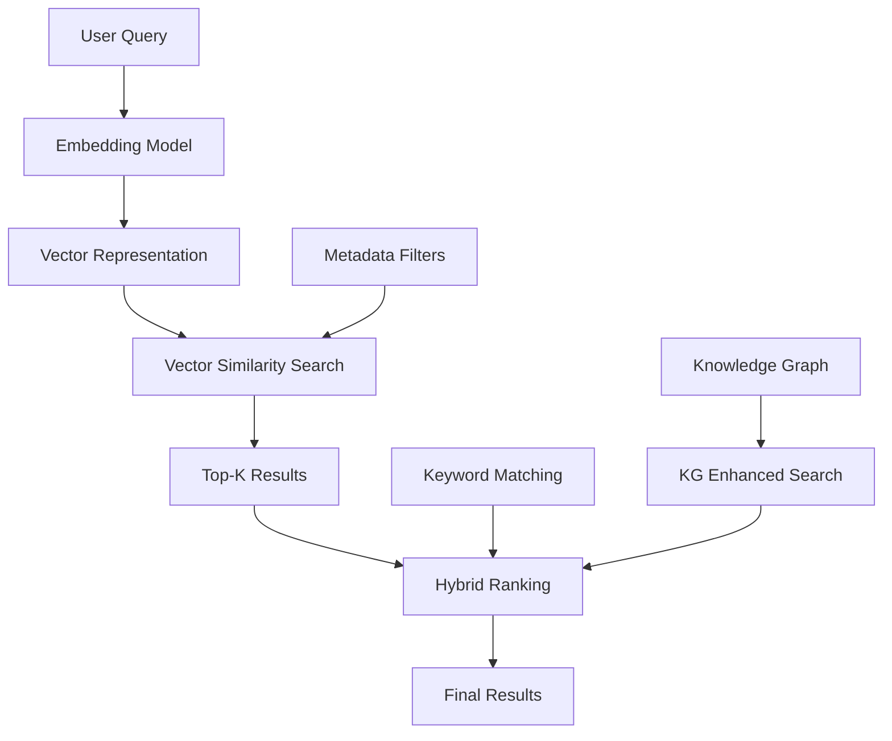
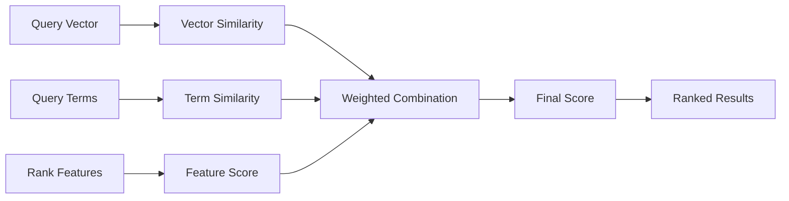
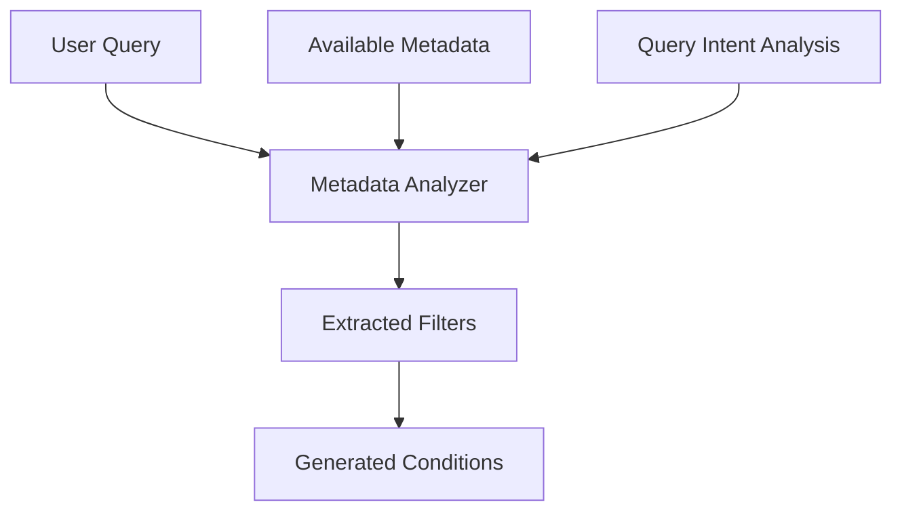
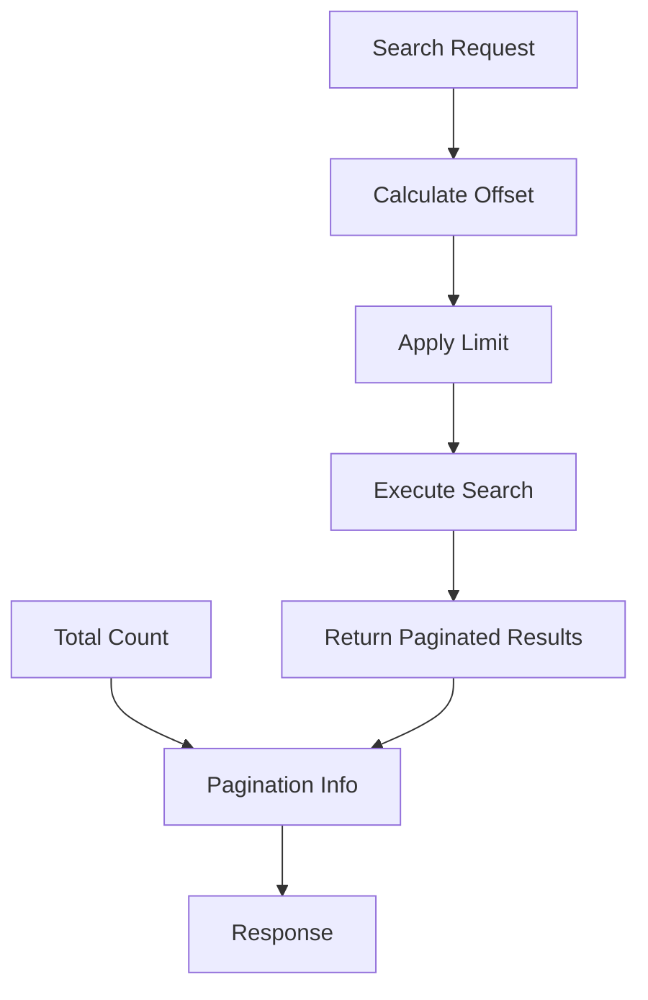

# Search & Retrieval API

<cite>
**Referenced Files in This Document**
- [search_app.py](file://api/apps/search_app.py)
- [search_service.py](file://api/db/services/search_service.py)
- [search.py](file://rag/nlp/search.py)
- [query.py](file://rag/nlp/query.py)
- [doc.py](file://api/apps/sdk/doc.py)
- [dataset.py](file://api/apps/sdk/dataset.py)
- [infinity_conn.py](file://rag/utils/infinity_conn.py)
- [ob_conn.py](file://rag/utils/ob_conn.py)
- [graphrag/search.py](file://graphrag/search.py)
- [meta_filter.md](file://rag/prompts/meta_filter.md)
- [dialog_service.py](file://api/db/services/dialog_service.py)
- [http_api_reference.md](file://docs/references/http_api_reference.md)
</cite>

## Table of Contents
1. [Introduction](#introduction)
2. [API Endpoints Overview](#api-endpoints-overview)
3. [Core Search Parameters](#core-search-parameters)
4. [Response Format](#response-format)
5. [Advanced Search Features](#advanced-search-features)
6. [Metadata Filtering](#metadata-filtering)
7. [Performance Considerations](#performance-considerations)
8. [Pagination and Large Result Sets](#pagination-and-large-result-sets)
9. [Examples and Use Cases](#examples-and-use-cases)
10. [Troubleshooting](#troubleshooting)

## Introduction

RAGFlow provides a comprehensive search and retrieval API that enables powerful semantic search, keyword search, and hybrid retrieval methods across indexed documents and knowledge bases. The system supports multiple search paradigms including semantic similarity, keyword matching, multi-vector retrieval, fusion ranking, and knowledge graph-enhanced search.

The search API is designed to handle various query types from simple keyword searches to complex filtered searches with metadata constraints, while maintaining high performance through intelligent caching and result ranking mechanisms.

## API Endpoints Overview

### Primary Retrieval Endpoint

The main search endpoint accepts queries against indexed datasets and documents:

**Endpoint:** `POST /api/v1/retrieval`

**Purpose:** Retrieves chunks from specified datasets based on semantic similarity and keyword matching.

### Search Application Management

RAGFlow also provides endpoints for managing search applications and configurations:

**Endpoint:** `POST /api/v1/search/create`
**Endpoint:** `POST /api/v1/search/update`
**Endpoint:** `GET /api/v1/search/detail`
**Endpoint:** `POST /api/v1/search/list`
**Endpoint:** `POST /api/v1/search/rm`

These endpoints allow administrators to create, configure, and manage search applications with custom settings and metadata filtering capabilities.

## Core Search Parameters

### Basic Query Parameters

| Parameter | Type | Required | Description |
|-----------|------|----------|-------------|
| `question` | string | Yes | The user query or search keywords |
| `dataset_ids` | list[string] | No | IDs of datasets to search (alternative to document_ids) |
| `document_ids` | list[string] | No | IDs of specific documents to search |
| `page` | integer | No | Page number for pagination (default: 1) |
| `page_size` | integer | No | Maximum number of chunks per page (default: 30) |

### Advanced Search Control Parameters

| Parameter | Type | Default | Description |
|-----------|------|---------|-------------|
| `similarity_threshold` | float | 0.2 | Minimum similarity score for results |
| `vector_similarity_weight` | float | 0.3 | Weight of vector cosine similarity vs. term similarity |
| `top_k` | integer | 1024 | Number of chunks for vector computation |
| `keyword` | boolean | false | Enable keyword-based matching |
| `highlight` | boolean | false | Enable highlighting of matched terms |
| `cross_languages` | list[string] | [] | Languages for cross-language retrieval |
| `metadata_condition` | object | {} | Metadata filtering conditions |

### Knowledge Base Enhancement Parameters

| Parameter | Type | Default | Description |
|-----------|------|---------|-------------|
| `use_kg` | boolean | false | Enable knowledge graph-enhanced search |
| `toc_enhance` | boolean | false | Enable table-of-contents enhanced search |
| `rerank_id` | string | null | ID of reranking model to use |

**Section sources**
- [doc.py](file://api/apps/sdk/doc.py#L1430-L1460)
- [http_api_reference.md](file://docs/references/http_api_reference.md#L2090-L2201)

## Response Format

The search API returns structured results containing retrieved chunks with comprehensive metadata and relevance information.

### Standard Response Structure

```json
{
  "code": 0,
  "message": "success",
  "data": {
    "total": 15,
    "chunks": [
      {
        "id": "chunk_id_1",
        "content": "Chunk content with relevance information",
        "document_id": "doc_id_1",
        "dataset_id": "kb_id_1",
        "similarity": 0.85,
        "vector_similarity": 0.78,
        "term_similarity": 0.82,
        "important_keywords": ["keyword1", "keyword2"],
        "questions": ["related_question1"],
        "document_keyword": "document_title",
        "positions": [1, 2, 3],
        "highlight": "Highlighted content with matched terms"
      }
    ],
    "doc_aggs": {
      "document_title_1": 5,
      "document_title_2": 3
    }
  }
}
```

### Response Fields Explanation

| Field | Type | Description |
|-------|------|-------------|
| `total` | integer | Total number of matching chunks |
| `chunks` | array | Array of retrieved chunks with metadata |
| `doc_aggs` | object | Document aggregation statistics |

### Chunk Information Details

Each chunk in the response contains:

- **Basic Information**: ID, content, document references
- **Similarity Scores**: Vector similarity, term similarity, combined similarity
- **Relevance Metadata**: Important keywords, related questions
- **Positional Data**: Content positions within documents
- **Highlighting**: Matched terms highlighted when enabled

**Section sources**
- [search.py](file://rag/nlp/search.py#L455-L486)
- [doc.py](file://api/apps/sdk/doc.py#L1508-L1521)

## Advanced Search Features

### Semantic Search with Vector Embeddings

RAGFlow performs semantic search using dense vector embeddings:



**Diagram sources**
- [search.py](file://rag/nlp/search.py#L360-L387)
- [query.py](file://rag/nlp/query.py#L85-L132)

### Hybrid Retrieval Methods

The system combines multiple retrieval approaches:

1. **Vector Similarity**: Dense vector matching for semantic understanding
2. **Keyword Matching**: Sparse term-based matching for precise retrieval
3. **Fusion Ranking**: Intelligent combination of multiple signals
4. **Rank Features**: Additional scoring factors like PageRank

### Multi-Vector Retrieval

Support for multiple embedding models and vector spaces:

- **Cross-Model Compatibility**: Handles different embedding models within datasets
- **Multi-Space Search**: Searches across multiple vector spaces simultaneously
- **Adaptive Weights**: Dynamic weighting of different vector representations

### Fusion Ranking Algorithm

The fusion ranking combines multiple similarity signals:



**Diagram sources**
- [search.py](file://rag/nlp/search.py#L291-L350)

**Section sources**
- [search.py](file://rag/nlp/search.py#L291-L350)
- [infinity_conn.py](file://rag/utils/infinity_conn.py#L38-L71)

## Metadata Filtering

RAGFlow provides sophisticated metadata filtering capabilities for precise result refinement.

### Filter Conditions Structure

```json
{
  "logic": "and",
  "conditions": [
    {
      "name": "author",
      "comparison_operator": "=",
      "value": "John Doe"
    },
    {
      "name": "date",
      "comparison_operator": ">=",
      "value": "2024-01-01"
    }
  ]
}
```

### Supported Comparison Operators

| Operator | Description | Example |
|----------|-------------|---------|
| `=` | Equality | `{"name": "status", "value": "active"}` |
| `≠` | Inequality | `{"name": "status", "value": "inactive"}` |
| `>` | Greater than | `{"name": "priority", "value": "5"}` |
| `<` | Less than | `{"name": "age", "value": "30"}` |
| `≥` | Greater or equal | `{"name": "score", "value": "80"}` |
| `≤` | Less or equal | `{"name": "count", "value": "100"}` |
| `contains` | Contains substring | `{"name": "tags", "value": "urgent"}` |
| `not contains` | Does not contain | `{"name": "tags", "value": "draft"}` |
| `start with` | Starts with | `{"name": "filename", "value": "report_"}` |
| `empty` | Is empty | `{"name": "notes", "value": ""}` |
| `not empty` | Is not empty | `{"name": "notes", "value": ""}` |

### Logical Operations

- **AND Logic**: All conditions must be satisfied
- **OR Logic**: Any condition can be satisfied
- **Nested Conditions**: Complex filtering scenarios

### Automatic Metadata Generation

The system can automatically generate metadata filters based on query content:



**Diagram sources**
- [meta_filter.md](file://rag/prompts/meta_filter.md#L1-L67)
- [dialog_service.py](file://api/db/services/dialog_service.py#L279-L325)

**Section sources**
- [meta_filter.md](file://rag/prompts/meta_filter.md#L1-L67)
- [dialog_service.py](file://api/db/services/dialog_service.py#L279-L325)
- [ob_conn.py](file://rag/utils/ob_conn.py#L238-L325)

## Performance Considerations

### Optimization Strategies

RAGFlow implements several performance optimization techniques:

1. **Intelligent Pagination**: Configurable page sizes with efficient offset calculations
2. **Result Limiting**: Top-k selection reduces computational overhead
3. **Caching Mechanisms**: Frequently accessed results cached for speed
4. **Parallel Processing**: Concurrent execution of multiple search components

### Memory Management

- **Streaming Results**: Large result sets processed in chunks
- **Vector Compression**: Efficient storage of embedding vectors
- **Lazy Loading**: Metadata loaded on-demand

### Scalability Features

- **Horizontal Scaling**: Distributed search infrastructure
- **Load Balancing**: Intelligent distribution of search requests
- **Resource Monitoring**: Real-time performance metrics

### Performance Tuning Parameters

| Parameter | Impact | Recommendation |
|-----------|--------|----------------|
| `top_k` | Memory usage, speed | Adjust based on available resources |
| `page_size` | Network bandwidth, latency | Optimize for client capabilities |
| `similarity_threshold` | Precision, recall | Tune based on use case requirements |

**Section sources**
- [search.py](file://rag/nlp/search.py#L375-L387)
- [infinity_conn.py](file://rag/utils/infinity_conn.py#L174-L200)

## Pagination and Large Result Sets

### Pagination Implementation

RAGFlow supports efficient pagination for large result sets:



**Diagram sources**
- [search.py](file://rag/nlp/search.py#L85-L88)

### Pagination Parameters

- **Page Number**: Starting from 1 (default: 1)
- **Page Size**: Maximum results per page (default: 30)
- **Offset Calculation**: `offset = (page - 1) * page_size`
- **Limit Application**: Applied to reduce memory usage

### Large Result Set Handling

For datasets with millions of chunks:

1. **Progressive Loading**: Results loaded in batches
2. **Streaming Responses**: Real-time result delivery
3. **Caching Strategies**: Frequently accessed results cached
4. **Index Optimization**: Efficient indexing for large-scale searches

### Error Handling for Pagination

The system handles various pagination scenarios:

- **Invalid Page Numbers**: Automatically corrected to valid range
- **Zero Page Size**: Handled gracefully with appropriate messages
- **Negative Values**: Rejected with clear error messages
- **Non-numeric Inputs**: Converted to integers with fallback values

**Section sources**
- [search.py](file://rag/nlp/search.py#L85-L88)
- [test_retrieval_chunks.py](file://test/testcases/test_http_api/test_chunk_management_within_dataset/test_retrieval_chunks.py#L252-L280)

## Examples and Use Cases

### Simple Keyword Search

Basic keyword-based search across datasets:

```bash
curl --request POST \
     --url http://localhost:9380/api/v1/retrieval \
     --header 'Content-Type: application/json' \
     --header 'Authorization: Bearer YOUR_API_KEY' \
     --data '{
          "question": "machine learning algorithms",
          "dataset_ids": ["dataset_id_1", "dataset_id_2"],
          "page_size": 10
     }'
```

### Semantic Search with Threshold

High-quality semantic search with similarity control:

```bash
curl --request POST \
     --url http://localhost:9380/api/v1/retrieval \
     --header 'Content-Type: application/json' \
     --header 'Authorization: Bearer YOUR_API_KEY' \
     --data '{
          "question": "deep learning neural networks",
          "dataset_ids": ["ml_dataset"],
          "similarity_threshold": 0.7,
          "vector_similarity_weight": 0.5,
          "top_k": 512
     }'
```

### Complex Filtered Search

Multi-condition metadata filtering:

```bash
curl --request POST \
     --url http://localhost:9380/api/v1/retrieval \
     --header 'Content-Type: application/json' \
     --header 'Authorization: Bearer YOUR_API_KEY' \
     --data '{
          "question": "financial regulations compliance",
          "dataset_ids": ["legal_docs"],
          "metadata_condition": {
            "logic": "and",
            "conditions": [
              {
                "name": "department",
                "comparison_operator": "=",
                "value": "finance"
              },
              {
                "name": "year",
                "comparison_operator": ">=",
                "value": "2023"
              },
              {
                "name": "status",
                "comparison_operator": "≠",
                "value": "draft"
              }
            ]
          }
     }'
```

### Cross-Language Search

Multilingual search capability:

```bash
curl --request POST \
     --url http://localhost:9380/api/v1/retrieval \
     --header 'Content-Type: application/json' \
     --header 'Authorization: Bearer YOUR_API_KEY' \
     --data '{
          "question": "artificial intelligence trends",
          "dataset_ids": ["research_papers"],
          "cross_languages": ["zh", "es", "fr"],
          "page_size": 20
     }'
```

### Knowledge Graph Enhanced Search

Advanced search incorporating knowledge relationships:

```bash
curl --request POST \
     --url http://localhost:9380/api/v1/retrieval \
     --header 'Content-Type: application/json' \
     --header 'Authorization: Bearer YOUR_API_KEY' \
     --data '{
          "question": "AI applications in healthcare",
          "dataset_ids": ["tech_docs"],
          "use_kg": true,
          "toc_enhance": true,
          "similarity_threshold": 0.6
     }'
```

### Hybrid Retrieval with Reranking

Combination of multiple retrieval methods:

```bash
curl --request POST \
     --url http://localhost:9380/api/v1/retrieval \
     --header 'Content-Type: application/json' \
     --header 'Authorization: Bearer YOUR_API_KEY' \
     --data '{
          "question": "quantum computing practical applications",
          "dataset_ids": ["tech_articles"],
          "keyword": true,
          "vector_similarity_weight": 0.4,
          "rerank_id": "rerank_model_1",
          "highlight": true
     }'
```

**Section sources**
- [http_api_reference.md](file://docs/references/http_api_reference.md#L2118-L2145)
- [doc.py](file://api/apps/sdk/doc.py#L1487-L1521)

## Troubleshooting

### Common Issues and Solutions

#### Authentication Problems
- **Issue**: `401 Unauthorized` errors
- **Solution**: Verify API key format and validity
- **Code**: AUTHENTICATION_ERROR (100)

#### Invalid Parameters
- **Issue**: `400 Bad Request` with parameter errors
- **Solution**: Check parameter types and required fields
- **Code**: DATA_ERROR (100)

#### Resource Not Found
- **Issue**: `404 Not Found` for datasets or documents
- **Solution**: Verify resource IDs and permissions
- **Code**: DATA_ERROR (100)

#### Performance Issues
- **Issue**: Slow response times
- **Solutions**: 
  - Reduce `top_k` parameter
  - Increase `similarity_threshold`
  - Use pagination with smaller `page_size`
  - Enable result caching

#### Memory Constraints
- **Issue**: Out of memory errors
- **Solutions**:
  - Decrease batch sizes
  - Limit concurrent requests
  - Use streaming responses
  - Optimize embedding model selection

### Debugging Tools

1. **Logging**: Enable debug logging for detailed execution traces
2. **Metrics**: Monitor search performance metrics
3. **Validation**: Use parameter validation endpoints
4. **Testing**: Test with small datasets before production

### Error Codes Reference

| Code | Meaning | Solution |
|------|---------|----------|
| 0 | Success | No action needed |
| 100 | Data Error | Check input parameters |
| 200 | Authentication Error | Verify API credentials |
| 300 | Permission Error | Check user permissions |
| 400 | Server Error | Contact support |

**Section sources**
- [doc.py](file://api/apps/sdk/doc.py#L1525-L1533)
- [search_app.py](file://api/apps/search_app.py#L30-L60)