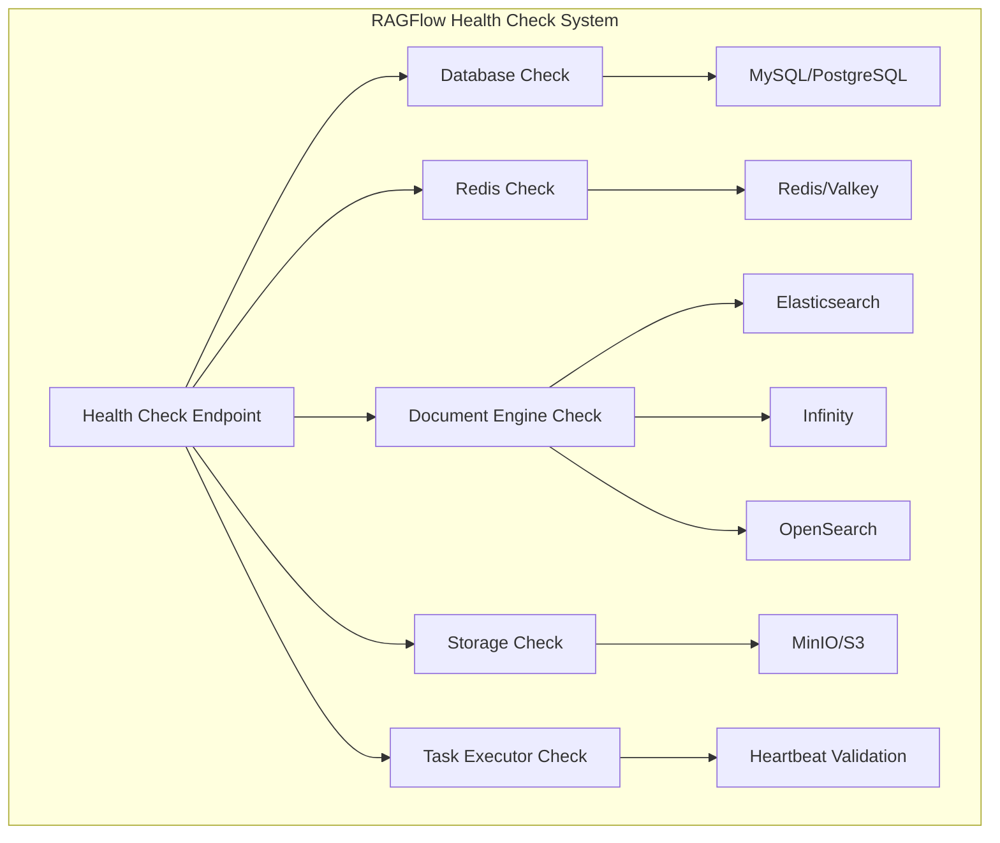

# Health Check API

<cite>
**Referenced Files in This Document**
- [api/utils/health_utils.py](file://api/utils/health_utils.py)
- [api/apps/system_app.py](file://api/apps/system_app.py)
- [docs/guides/run_health_check.md](file://docs/guides/run_health_check.md)
- [docker/docker-compose-base.yml](file://docker/docker-compose-base.yml)
- [docker/docker-compose.yml](file://docker/docker-compose.yml)
- [helm/values.yaml](file://helm/values.yaml)
- [sandbox/scripts/wait-for-it.sh](file://sandbox/scripts/wait-for-it.sh)
- [sandbox/scripts/wait-for-it-http.sh](file://sandbox/scripts/wait-for-it-http.sh)
</cite>

## Table of Contents
1. [Introduction](#introduction)
2. [Health Check Endpoints](#health-check-endpoints)
3. [System Dependencies](#system-dependencies)
4. [Response Structure](#response-structure)
5. [Container Orchestration Integration](#container-orchestration-integration)
6. [Monitoring and Alerting](#monitoring-and-alerting)
7. [Troubleshooting](#troubleshooting)
8. [Best Practices](#best-practices)

## Introduction

RAGFlow provides comprehensive health check endpoints to monitor the operational status of its core dependencies and services. These endpoints are essential for container orchestration, automated monitoring, and production deployment scenarios. The health check system evaluates the connectivity and responsiveness of database, storage, search engines, and message queue services.

The health check API offers two primary endpoints:
- `/v1/system/healthz` - Comprehensive health check with detailed status reporting
- `/v1/system/ping` - Simple connectivity test

These endpoints support both HTTP 200 (healthy) and HTTP 500 (unhealthy) responses, making them suitable for use in load balancers, container orchestration platforms, and monitoring systems.

## Health Check Endpoints

### /v1/system/healthz

The primary health check endpoint that performs comprehensive system-wide health verification.

**Endpoint:** `GET /v1/system/healthz`

**Authentication:** No authentication required

**Response Format:** JSON

**Example Request:**
```bash
curl http://localhost:9380/v1/system/healthz
```

**Success Response (HTTP 200):**
```json
{
  "db": "ok",
  "redis": "ok", 
  "doc_engine": "ok",
  "storage": "ok",
  "status": "ok"
}
```

**Failure Response (HTTP 500):**
```json
{
  "db": "ok",
  "redis": "nok",
  "doc_engine": "ok",
  "storage": "ok",
  "status": "nok",
  "_meta": {
    "redis": {
      "elapsed": "5.2",
      "error": "Lost connection!"
    }
  }
}
```

### /v1/system/ping

A simple connectivity endpoint that returns "pong" when the service is responsive.

**Endpoint:** `GET /v1/system/ping`

**Authentication:** No authentication required

**Response Format:** Plain text

**Example Request:**
```bash
curl http://localhost:9380/v1/system/ping
```

**Response:**
```
pong
```

**Section sources**
- [api/apps/system_app.py](file://api/apps/system_app.py#L174-L182)
- [docs/guides/run_health_check.md](file://docs/guides/run_health_check.md#L39-L48)

## System Dependencies

RAGFlow's health checks evaluate five critical system dependencies:

### Database Connectivity
- **Type:** MySQL/PostgreSQL
- **Check Method:** Executes a lightweight SQL query (`SELECT 1`)
- **Purpose:** Verifies database connectivity and basic query functionality

### Redis Message Queue
- **Type:** Redis/Valkey
- **Check Method:** Uses Redis connection health method
- **Purpose:** Validates message queue availability for task processing

### Document Engine
- **Types Supported:** Elasticsearch, Infinity, OpenSearch
- **Check Method:** Calls engine-specific health endpoints
- **Purpose:** Ensures search and indexing capabilities are available

### Object Storage
- **Type:** MinIO/S3-compatible storage
- **Check Method:** HTTP GET request to MinIO health endpoint
- **Purpose:** Verifies file storage and retrieval capabilities

### Task Executors
- **Type:** Redis-based task monitoring
- **Check Method:** Validates task executor heartbeats
- **Purpose:** Ensures background processing capacity



**Diagram sources**
- [api/utils/health_utils.py](file://api/utils/health_utils.py#L187-L223)
- [api/apps/system_app.py](file://api/apps/system_app.py#L87-L171)

**Section sources**
- [api/utils/health_utils.py](file://api/utils/health_utils.py#L33-L68)
- [api/apps/system_app.py](file://api/apps/system_app.py#L87-L171)

## Response Structure

### Health Check Response Schema

The health check endpoint returns a structured JSON response with the following components:

| Field | Type | Description |
|-------|------|-------------|
| `db` | string | Database connectivity status ("ok" or "nok") |
| `redis` | string | Redis message queue status ("ok" or "nok") |
| `doc_engine` | string | Document engine status ("ok" or "nok") |
| `storage` | string | Object storage status ("ok" or "nok") |
| `status` | string | Overall system status ("ok" or "nok") |
| `_meta` | object | Detailed error information (optional) |

### Status Indicators

**Green Status ("ok")**: Service is responding normally and available for operations.

**Red Status ("nok")**: Service is unavailable or experiencing errors. Detailed error information is provided in the `_meta` field.

### Error Information Structure

When a service fails, the response includes detailed error information:

```json
{
  "db": "nok",
  "redis": "ok",
  "doc_engine": "ok", 
  "storage": "ok",
  "status": "nok",
  "_meta": {
    "db": {
      "elapsed": "12.5",
      "error": "Connection refused"
    }
  }
}
```

### Performance Metrics

Each health check includes timing information to help diagnose performance issues:

- **Elapsed Time**: Response time in milliseconds
- **Service-Specific Metrics**: Additional metrics from individual services

**Section sources**
- [api/utils/health_utils.py](file://api/utils/health_utils.py#L187-L223)
- [docs/guides/run_health_check.md](file://docs/guides/run_health_check.md#L58-L106)

## Container Orchestration Integration

### Docker Compose Health Checks

RAGFlow's Docker Compose configuration includes comprehensive health check definitions for all dependent services:

#### Elasticsearch Health Check
```yaml
healthcheck:
  test: ["CMD-SHELL", "curl http://localhost:9200"]
  interval: 10s
  timeout: 10s
  retries: 120
```

#### MySQL Health Check
```yaml
healthcheck:
  test: ["CMD", "mysqladmin" ,"ping", "-uroot", "-p${MYSQL_PASSWORD}"]
  interval: 10s
  timeout: 10s
  retries: 120
```

#### Redis Health Check
```yaml
healthcheck:
  test: ["CMD", "redis-cli", "-a", "${REDIS_PASSWORD}", "ping"]
  interval: 10s
  timeout: 10s
  retries: 120
```

#### MinIO Health Check
```yaml
healthcheck:
  test: ["CMD", "curl", "-f", "http://localhost:9000/minio/health/live"]
  interval: 10s
  timeout: 10s
  retries: 120
```

### Kubernetes Liveness and Readiness Probes

Configure Kubernetes probes using RAGFlow's health check endpoints:

#### Liveness Probe
```yaml
livenessProbe:
  httpGet:
    path: /v1/system/healthz
    port: 9380
  initialDelaySeconds: 30
  periodSeconds: 10
  timeoutSeconds: 5
  failureThreshold: 3
```

#### Readiness Probe
```yaml
readinessProbe:
  httpGet:
    path: /v1/system/healthz
    port: 9380
  initialDelaySeconds: 5
  periodSeconds: 5
  timeoutSeconds: 3
  failureThreshold: 3
```

### Container Dependencies

RAGFlow containers define health-based dependencies to ensure proper startup order:

```yaml
depends_on:
  mysql:
    condition: service_healthy
```

This configuration ensures that the RAGFlow application only starts after MySQL is confirmed healthy.

**Section sources**
- [docker/docker-compose-base.yml](file://docker/docker-compose-base.yml#L27-L199)
- [docker/docker-compose.yml](file://docker/docker-compose.yml#L6-L8)

## Monitoring and Alerting

### Integration with Monitoring Systems

RAGFlow's health check endpoints integrate seamlessly with popular monitoring solutions:

#### Prometheus Integration
```yaml
# Prometheus scrape configuration
scrape_configs:
  - job_name: 'ragflow-health'
    static_configs:
      - targets: ['localhost:9380']
    metrics_path: '/v1/system/healthz'
    scrape_interval: 30s
```

#### Grafana Dashboard
Create dashboards to visualize health check trends and service availability:

- **Service Availability**: Line charts showing service status over time
- **Response Times**: Histograms of health check response durations
- **Error Rates**: Pie charts of different error types

### Alerting Rules

Configure alerts based on health check results:

#### Critical Alerts
```yaml
groups:
  - name: ragflow-health
    rules:
      - alert: RAGFlowServiceDown
        expr: ragflow_health_status != 1
        for: 1m
        labels:
          severity: critical
        annotations:
          summary: "RAGFlow service is down"
          description: "Health check failed for {{ $labels.instance }}"
```

#### Warning Alerts
```yaml
      - alert: RAGFlowHighLatency
        expr: ragflow_health_duration > 5000
        for: 2m
        labels:
          severity: warning
        annotations:
          summary: "RAGFlow health check latency high"
          description: "Health check took {{ $value }}ms"
```

### Production Monitoring Best Practices

1. **Multiple Check Intervals**: Configure different intervals for different services
2. **Geographic Distribution**: Monitor from multiple locations
3. **Threshold Tuning**: Adjust failure thresholds based on service characteristics
4. **Alert Suppression**: Implement suppression rules for temporary issues

**Section sources**
- [helm/values.yaml](file://helm/values.yaml#L1-L235)
- [sandbox/scripts/wait-for-it.sh](file://sandbox/scripts/wait-for-it.sh#L1-L50)

## Troubleshooting

### Common Health Check Issues

#### Database Connection Failures
**Symptoms:**
- `db` status shows "nok"
- Error messages about connection timeouts or authentication

**Solutions:**
1. Verify database service is running
2. Check network connectivity between services
3. Validate database credentials
4. Review database logs for specific errors

#### Redis Connectivity Problems
**Symptoms:**
- `redis` status shows "nok"
- "Lost connection!" error message

**Solutions:**
1. Confirm Redis service is operational
2. Verify Redis password configuration
3. Check firewall rules and network policies
4. Monitor Redis memory usage

#### Document Engine Issues
**Symptoms:**
- `doc_engine` status shows "nok"
- Service-specific error messages

**Solutions:**
1. Verify Elasticsearch/Infinity/OpenSearch is running
2. Check cluster health and connectivity
3. Review engine-specific logs
4. Validate configuration settings

#### Storage Access Problems
**Symptoms:**
- `storage` status shows "nok"
- S3/MiNIO connectivity errors

**Solutions:**
1. Confirm object storage service is available
2. Verify access credentials
3. Check network connectivity
4. Review storage service logs

### Debugging Health Check Results

Use the detailed error information in the `_meta` field to diagnose issues:

```bash
# Example debugging workflow
curl http://localhost:9380/v1/system/healthz | jq '.'
# Examine specific service errors
curl http://localhost:9380/v1/system/healthz | jq '.["_meta"].redis'
```

### Health Check Scripting

Create monitoring scripts using RAGFlow's health check endpoints:

#### Bash Script Example
```bash
#!/bin/bash
HEALTH_CHECK_URL="http://localhost:9380/v1/system/healthz"
RESPONSE=$(curl -s -o /dev/null -w "%{http_code}" $HEALTH_CHECK_URL)

if [ $RESPONSE -eq 200 ]; then
    echo "RAGFlow is healthy"
    exit 0
else
    echo "RAGFlow is unhealthy (HTTP $RESPONSE)"
    exit 1
fi
```

#### Python Script Example
```python
import requests
import sys

def check_ragflow_health():
    try:
        response = requests.get('http://localhost:9380/v1/system/healthz', timeout=10)
        if response.status_code == 200:
            return True, response.json()
        else:
            return False, {"status": "unhealthy", "http_code": response.status_code}
    except Exception as e:
        return False, {"status": "unhealthy", "error": str(e)}

if __name__ == "__main__":
    healthy, result = check_ragflow_health()
    if healthy:
        print("✓ RAGFlow is healthy")
        sys.exit(0)
    else:
        print(f"✗ RAGFlow is unhealthy: {result}")
        sys.exit(1)
```

**Section sources**
- [docs/guides/run_health_check.md](file://docs/guides/run_health_check.md#L103-L106)
- [sandbox/scripts/wait-for-it-http.sh](file://sandbox/scripts/wait-for-it-http.sh#L1-L31)

## Best Practices

### Health Check Configuration

1. **Appropriate Intervals**: Set health check intervals based on service criticality
   - Critical services: 5-10 seconds
   - Non-critical services: 30-60 seconds

2. **Timeout Settings**: Configure timeouts to prevent long-running checks
   - Typical timeout: 5-10 seconds
   - Adjust based on network conditions

3. **Failure Thresholds**: Set reasonable failure thresholds
   - Minimum: 2 consecutive failures
   - Maximum: 5-10 consecutive failures

### Security Considerations

1. **Access Control**: Restrict health check access in production
   - Use internal networks only
   - Implement IP whitelisting
   - Consider authentication for sensitive environments

2. **Information Disclosure**: Be cautious about exposing detailed error information
   - Use sanitized error messages in production
   - Log detailed errors internally only

### Performance Optimization

1. **Lightweight Checks**: Ensure health checks are fast and efficient
   - Use minimal queries for database checks
   - Implement circuit breakers for slow services

2. **Caching**: Consider caching health check results for frequently accessed services
   - Balance between freshness and performance
   - Implement TTL-based invalidation

### Monitoring Strategy

1. **Multi-Level Monitoring**: Combine health checks with application-level monitoring
   - Health checks for infrastructure
   - Application metrics for business logic
   - Business metrics for user experience

2. **Historical Analysis**: Track health check trends over time
   - Identify patterns and recurring issues
   - Implement predictive maintenance
   - Establish baselines for normal operation

### Deployment Considerations

1. **Graceful Degradation**: Design applications to handle partial service failures
   - Implement fallback mechanisms
   - Provide degraded functionality when appropriate
   - Maintain user experience during outages

2. **Blue-Green Deployments**: Use health checks for deployment validation
   - Verify new instances before traffic routing
   - Implement automatic rollback on health check failures
   - Use canary deployments with gradual traffic shifting

**Section sources**
- [api/utils/health_utils.py](file://api/utils/health_utils.py#L187-L223)
- [docs/guides/run_health_check.md](file://docs/guides/run_health_check.md#L108-L110)