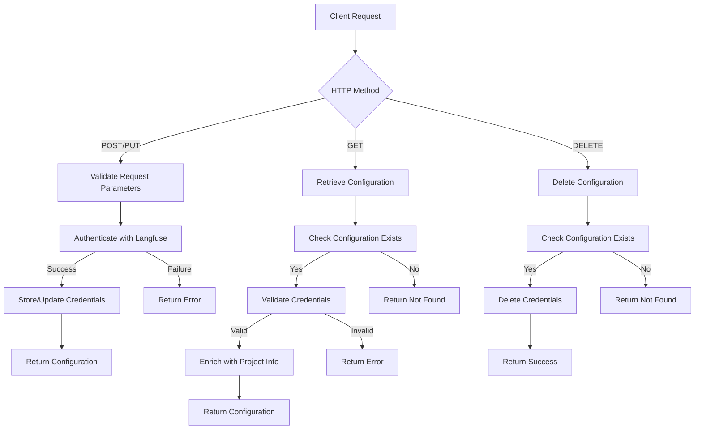
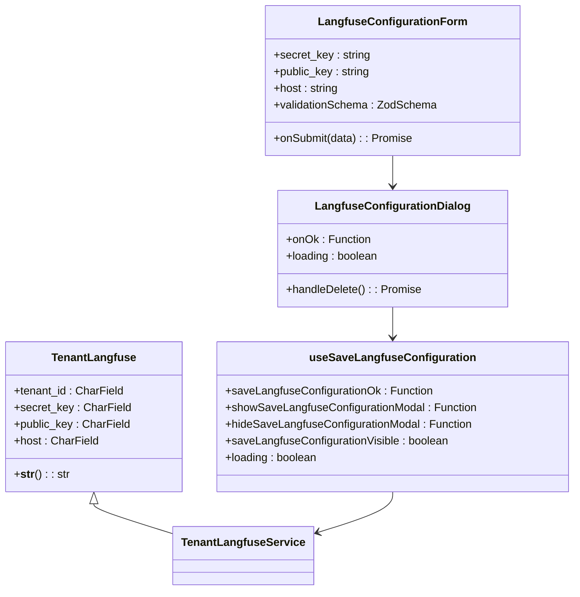
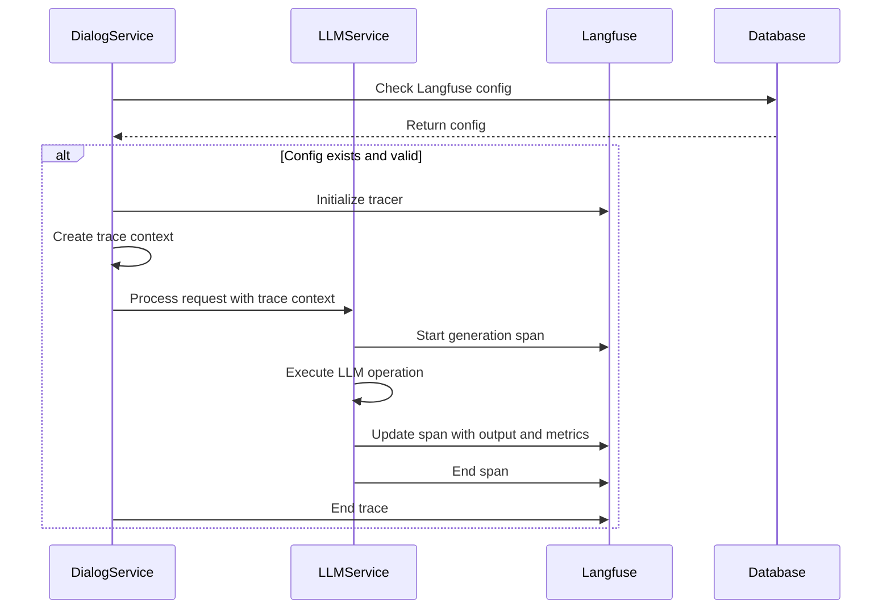
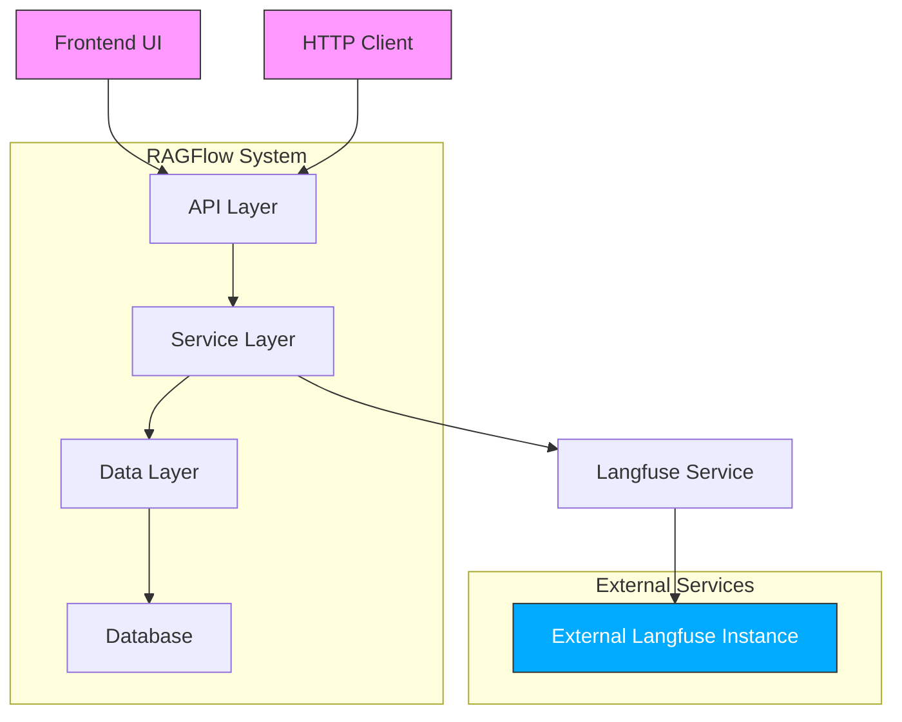
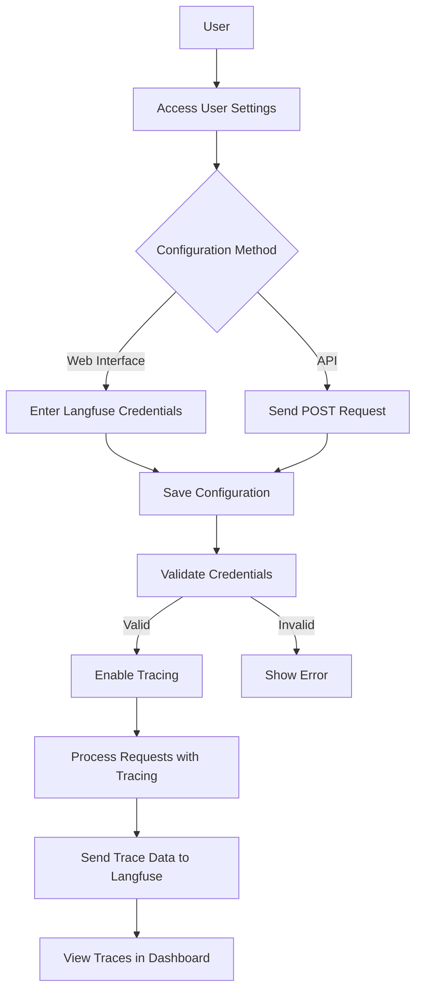

# Langfuse Integration API

<cite>
**Referenced Files in This Document**   
- [langfuse_app.py](file://api/apps/langfuse_app.py)
- [langfuse_service.py](file://api/db/services/langfuse_service.py)
- [db_models.py](file://api/db/db_models.py)
- [dialog_service.py](file://api/db/services/dialog_service.py)
- [llm_service.py](file://api/db/services/llm_service.py)
- [index.tsx](file://web/src/pages/user-setting/setting-model/langfuse/index.tsx)
- [langfuse-configuration-form.tsx](file://web/src/pages/user-setting/setting-model/langfuse/langfuse-configuration-form.tsx)
- [use-save-langfuse-configuration.tsx](file://web/src/pages/user-setting/setting-model/langfuse/use-save-langfuse-configuration.tsx)
- [tracing.mdx](file://docs/guides/tracing.mdx)
</cite>

## Table of Contents
1. [Introduction](#introduction)
2. [API Endpoints](#api-endpoints)
3. [Configuration Management](#configuration-management)
4. [Tracing Implementation](#tracing-implementation)
5. [Data Flow and Architecture](#data-flow-and-architecture)
6. [Usage Examples](#usage-examples)
7. [Security and Privacy](#security-and-privacy)
8. [Troubleshooting](#troubleshooting)
9. [Conclusion](#conclusion)

## Introduction

The Langfuse Integration API in RAGFlow provides comprehensive observability and tracing capabilities for LLM applications. This integration enables developers to capture, store, and analyze every interaction between their RLMs and knowledge bases, offering detailed insights into the retrieval and generation processes. The API facilitates the configuration of Langfuse tracing settings, allowing for systematic monitoring of RAG pipelines.

Langfuse integration is designed to work seamlessly with RAGFlow's architecture, automatically capturing trace data without requiring code changes to existing applications. When configured, the system emits detailed traces for every user request, including retrieval, ranking, and generation steps, with complete prompts, retrieved documents, and LLM responses stored as metadata.

The integration supports both cloud and self-hosted Langfuse instances, making it flexible for various deployment scenarios. It operates on a per-tenant basis, ensuring that each organization's tracing data is isolated and secure. The API endpoints provide full CRUD operations for managing Langfuse configuration, while the underlying implementation ensures that trace data is captured consistently across all components of the RAG pipeline.

**Section sources**
- [tracing.mdx](file://docs/guides/tracing.mdx#L1-L73)
- [langfuse_app.py](file://api/apps/langfuse_app.py#L1-L97)

## API Endpoints

The Langfuse Integration API provides three primary endpoints for managing Langfuse configuration, accessible through the `/api_key` route. These endpoints support creating, retrieving, and deleting Langfuse credentials for a tenant.

The POST/PUT endpoint at `/api_key` accepts a JSON payload containing the `secret_key`, `public_key`, and `host` parameters. When a request is received, the system validates that all required fields are present and performs an authentication check with the Langfuse service using the provided credentials. If the authentication succeeds, the credentials are stored in the database, either creating a new record or updating an existing one for the tenant. The endpoint returns the stored configuration data upon successful completion.

The GET endpoint at `/api_key` retrieves the current Langfuse configuration for the authenticated tenant. It first checks if configuration data exists, and if found, performs an authentication validation with the Langfuse service to ensure the stored credentials remain valid. Upon successful validation, the endpoint enriches the response with additional project information, including the project ID and name retrieved from the Langfuse API, before returning the complete configuration.

The DELETE endpoint at `/api_key` removes the stored Langfuse configuration for the tenant. It first verifies that configuration data exists before proceeding with deletion. The operation is performed within a database transaction to ensure atomicity, and upon successful deletion, returns a confirmation response.



**Diagram sources**
- [langfuse_app.py](file://api/apps/langfuse_app.py#L26-L97)

**Section sources**
- [langfuse_app.py](file://api/apps/langfuse_app.py#L26-L97)

## Configuration Management

The Langfuse configuration management system in RAGFlow provides both API and UI-based interfaces for setting up and managing tracing credentials. The configuration is stored at the tenant level, ensuring that each organization maintains isolated tracing data.

The backend implementation uses a dedicated database model `TenantLangfuse` that stores the essential configuration parameters: `tenant_id`, `secret_key`, `public_key`, and `host`. These fields are indexed for efficient retrieval and are stored with appropriate security considerations. The `secret_key` and `public_key` fields have sufficient length (2048 characters) to accommodate various Langfuse key formats, while the `host` field stores the base URL of the Langfuse instance.

On the frontend, the configuration interface is implemented as a React component that provides a secure form for entering Langfuse credentials. The form includes client-side validation to ensure all required fields are completed before submission. The secret and public keys are handled as password fields to prevent visual exposure, and the host field includes a placeholder with the default Langfuse cloud URL for reference.

The configuration workflow follows a secure pattern: users first obtain their Langfuse credentials from the Langfuse dashboard (under Settings → Projects), then input these credentials into the RAGFlow interface. Upon saving, the system validates the credentials by attempting to authenticate with the Langfuse service before storing them. This immediate validation provides feedback on configuration correctness and prevents the storage of invalid credentials.



**Diagram sources**
- [db_models.py](file://api/db/db_models.py#L721-L732)
- [langfuse-configuration-form.tsx](file://web/src/pages/user-setting/setting-model/langfuse/langfuse-configuration-form.tsx#L1-L127)
- [use-save-langfuse-configuration.tsx](file://web/src/pages/user-setting/setting-model/langfuse/use-save-langfuse-configuration.tsx#L1-L34)

**Section sources**
- [db_models.py](file://api/db/db_models.py#L721-L732)
- [langfuse-configuration-form.tsx](file://web/src/pages/user-setting/setting-model/langfuse/langfuse-configuration-form.tsx#L1-L127)
- [use-save-langfuse-configuration.tsx](file://web/src/pages/user-setting/setting-model/langfuse/use-save-langfuse-configuration.tsx#L1-L34)

## Tracing Implementation

The Langfuse tracing implementation in RAGFlow is integrated throughout the system's core services, capturing detailed information about LLM interactions and processing steps. The tracing mechanism is activated when a tenant configures valid Langfuse credentials, at which point the system initializes a Langfuse tracer instance that is used across various components.

In the dialog processing workflow, the system checks for available Langfuse configuration at the beginning of each conversation. If configuration is present and valid, a trace context is created with a unique trace ID. This trace context is then propagated through the entire processing pipeline, ensuring that all related operations are linked within the same trace.

The implementation captures multiple types of spans representing different stages of the RAG process:
- **Chat generation**: Traces the main LLM interaction, including the system prompt, conversation history, and generated response
- **Embedding operations**: Captures text encoding operations for both queries and documents
- **Similarity calculations**: Records reranking operations and similarity computations
- **Multimodal processing**: Tracks image description and audio transcription operations
- **Retrieval operations**: Monitors document retrieval and processing steps

Each span includes detailed metadata such as model names, input parameters, and usage statistics. The implementation also captures performance metrics, recording the time taken for each processing step and token usage information. This comprehensive tracing approach enables detailed analysis of both functional and performance aspects of the RAG pipeline.



**Diagram sources**
- [dialog_service.py](file://api/db/services/dialog_service.py#L369-L608)
- [llm_service.py](file://api/db/services/llm_service.py#L93-L317)

**Section sources**
- [dialog_service.py](file://api/db/services/dialog_service.py#L369-L608)
- [llm_service.py](file://api/db/services/llm_service.py#L93-L317)

## Data Flow and Architecture

The Langfuse integration architecture in RAGFlow follows a layered approach with clear separation of concerns between the API layer, service layer, and data layer. The architecture is designed to minimize performance impact while ensuring comprehensive tracing coverage across all relevant operations.

At the API layer, the `langfuse_app.py` module exposes the configuration endpoints and handles authentication and validation. This layer interacts with the service layer through the `TenantLangfuseService` class, which encapsulates all business logic related to Langfuse configuration management. The service layer, in turn, interacts with the data layer through the `TenantLangfuse` database model.

When a tracing event occurs, the data flow follows a consistent pattern: the relevant service (such as `LLMService` or `DialogService`) checks for available Langfuse configuration, initializes a tracer if needed, and creates spans for specific operations. These spans are automatically enriched with contextual information such as tenant ID, model names, and operation parameters.

The data storage architecture uses a dedicated table `tenant_langfuse` to store configuration data, with the tenant ID serving as the primary key. This design ensures efficient retrieval of configuration data and supports the multi-tenant nature of RAGFlow. The configuration data is stored securely, with appropriate field lengths to accommodate various Langfuse deployment scenarios.

The tracing data itself is not stored in the RAGFlow database but is instead transmitted directly to the configured Langfuse instance. This design choice reduces the storage burden on the RAGFlow system and leverages Langfuse's specialized infrastructure for trace storage and analysis.



**Diagram sources**
- [langfuse_app.py](file://api/apps/langfuse_app.py#L1-L97)
- [langfuse_service.py](file://api/db/services/langfuse_service.py#L26-L77)
- [db_models.py](file://api/db/db_models.py#L721-L732)

**Section sources**
- [langfuse_app.py](file://api/apps/langfuse_app.py#L1-L97)
- [langfuse_service.py](file://api/db/services/langfuse_service.py#L26-L77)
- [db_models.py](file://api/db/db_models.py#L721-L732)

## Usage Examples

The Langfuse integration can be configured and used through both the RAGFlow web interface and direct API calls. The following examples demonstrate common usage scenarios for setting up and utilizing the tracing capabilities.

To configure Langfuse through the web interface, users navigate to their user settings and locate the Langfuse configuration section. They enter their Langfuse credentials (public key, secret key, and host URL) and save the configuration. Once saved, tracing is automatically enabled for all subsequent interactions.

For programmatic configuration, the API can be used with a POST request to the `/api_key` endpoint:

```json
POST /api_key
Content-Type: application/json

{
  "public_key": "your-public-key",
  "secret_key": "your-secret-key",
  "host": "https://cloud.langfuse.com"
}
```

After configuration, trace data becomes available in the Langfuse dashboard, where it can be filtered and analyzed. Traces are automatically prefixed with "ragflow-" and contain detailed information about each processing step. Users can examine individual spans to view input prompts, retrieved documents, and generated responses, along with performance metrics such as processing time and token usage.

The integration also supports viewing trace data directly from the RAGFlow interface. The Langfuse card in the user settings includes a "View" button that opens the corresponding Langfuse project in a new tab, providing quick access to trace data without leaving the RAGFlow environment.



**Diagram sources**
- [index.tsx](file://web/src/pages/user-setting/setting-model/langfuse/index.tsx#L1-L69)
- [langfuse_app.py](file://api/apps/langfuse_app.py#L26-L97)

**Section sources**
- [index.tsx](file://web/src/pages/user-setting/setting-model/langfuse/index.tsx#L1-L69)
- [langfuse_app.py](file://api/apps/langfuse_app.py#L26-L97)

## Security and Privacy

The Langfuse integration in RAGFlow implements multiple security measures to protect sensitive configuration data and ensure privacy of traced information. The security architecture addresses both data at rest and data in transit, following industry best practices for credential management.

Configuration data, including the Langfuse secret key, is stored in the database with appropriate field constraints and indexing. The system uses secure transmission protocols (HTTPS) when communicating with the Langfuse service, ensuring that all trace data is encrypted in transit. The API endpoints are protected by authentication middleware, requiring users to be logged in before accessing configuration functionality.

The implementation follows the principle of least privilege, with Langfuse credentials stored at the tenant level and accessible only to authorized users within that tenant. This isolation prevents cross-tenant access to tracing data and configuration settings.

For privacy considerations, the system allows organizations to control what data is traced and where it is stored. By supporting both cloud and self-hosted Langfuse instances, organizations can choose the deployment model that best meets their compliance requirements. The trace data includes only the information necessary for debugging and optimization, with sensitive data handling governed by the organization's policies.

The frontend implementation includes additional security features such as password masking for secret fields and secure handling of API responses. The configuration form uses client-side validation to prevent submission of incomplete or malformed data, reducing the risk of configuration errors that could compromise security.

**Section sources**
- [langfuse_app.py](file://api/apps/langfuse_app.py#L27-L97)
- [langfuse-configuration-form.tsx](file://web/src/pages/user-setting/setting-model/langfuse/langfuse-configuration-form.tsx#L77-L82)

## Troubleshooting

When encountering issues with the Langfuse integration, several common problems and their solutions should be considered. The most frequent issue is invalid credentials, which can be identified by authentication failures when saving the configuration or when attempting to create traces.

To resolve credential issues, verify that the public and secret keys are correctly copied from the Langfuse dashboard and that the host URL is accurate. The host should include the protocol (https://) and point to the correct Langfuse instance (either the cloud service or a self-hosted deployment).

Another common issue is network connectivity problems between RAGFlow and the Langfuse service. This can manifest as timeouts or connection errors. Ensure that the server hosting RAGFlow has outbound access to the Langfuse host and that any firewalls or security groups allow the necessary traffic.

If traces are not appearing in the Langfuse dashboard, verify that:
1. The configuration has been successfully saved
2. The tenant has active interactions that should generate traces
3. The trace filtering in the Langfuse dashboard includes the "ragflow-" prefix
4. The Langfuse project ID matches the one associated with the configured keys

Performance issues related to tracing can be addressed by reviewing the trace data for unusually long processing times or high token usage. The detailed span information in Langfuse can help identify bottlenecks in the RAG pipeline, such as slow retrieval operations or inefficient prompt engineering.

For debugging API issues, examine the response codes and messages from the Langfuse configuration endpoints. The system returns specific error messages for common problems such as missing fields or authentication failures, which can guide troubleshooting efforts.

**Section sources**
- [langfuse_app.py](file://api/apps/langfuse_app.py#L44-L46)
- [tracing.mdx](file://docs/guides/tracing.mdx#L53-L68)

## Conclusion

The Langfuse Integration API in RAGFlow provides a robust solution for observability and tracing in LLM applications. By offering comprehensive insights into the RAG pipeline, it enables developers and operators to debug issues, optimize performance, and ensure the reliability of their AI systems.

The integration's architecture balances functionality with security, providing detailed tracing capabilities while protecting sensitive configuration data. The dual interface (API and web UI) offers flexibility for different use cases and deployment scenarios, from individual developers to enterprise teams.

The implementation captures a rich set of data points across the entire processing pipeline, from initial query reception through retrieval, ranking, and final response generation. This comprehensive tracing approach supports both immediate debugging needs and long-term optimization efforts, helping teams understand how their systems behave under various conditions.

By leveraging Langfuse's specialized observability platform, RAGFlow users gain access to powerful analysis tools without the burden of building and maintaining their own tracing infrastructure. This integration represents a significant step forward in making RAG systems more transparent, reliable, and easier to manage.