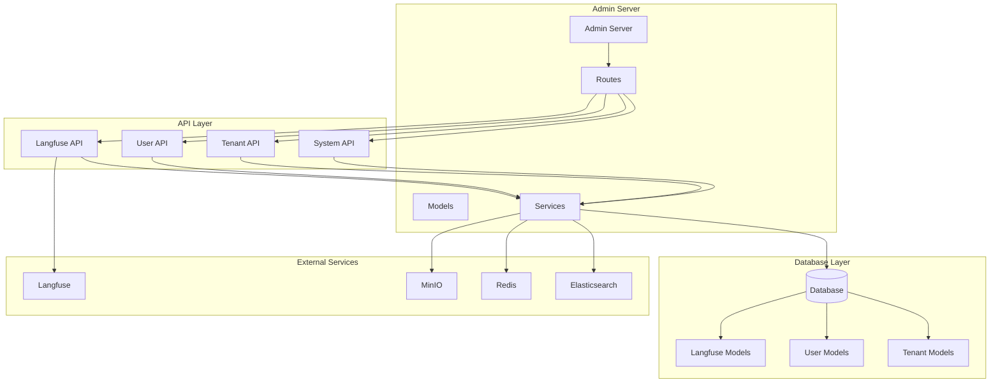
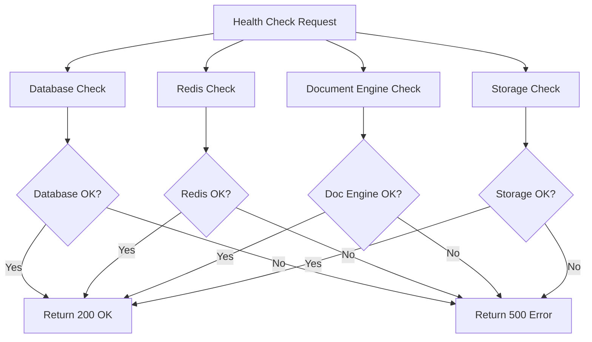
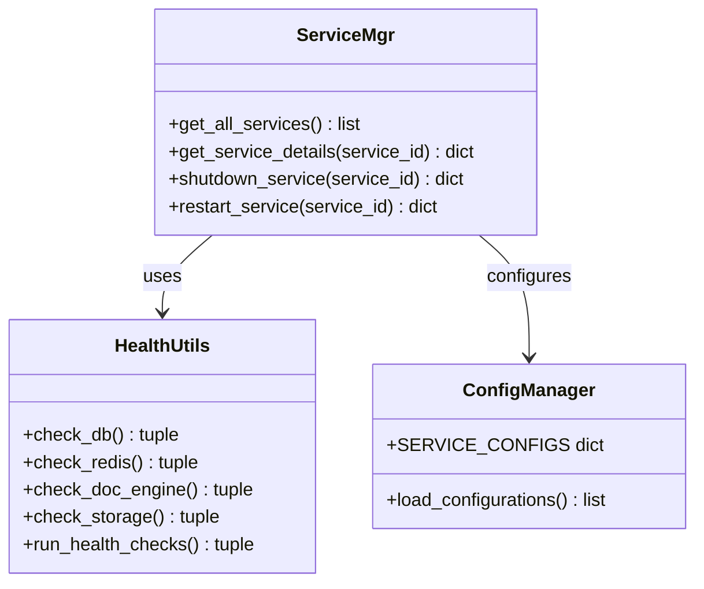
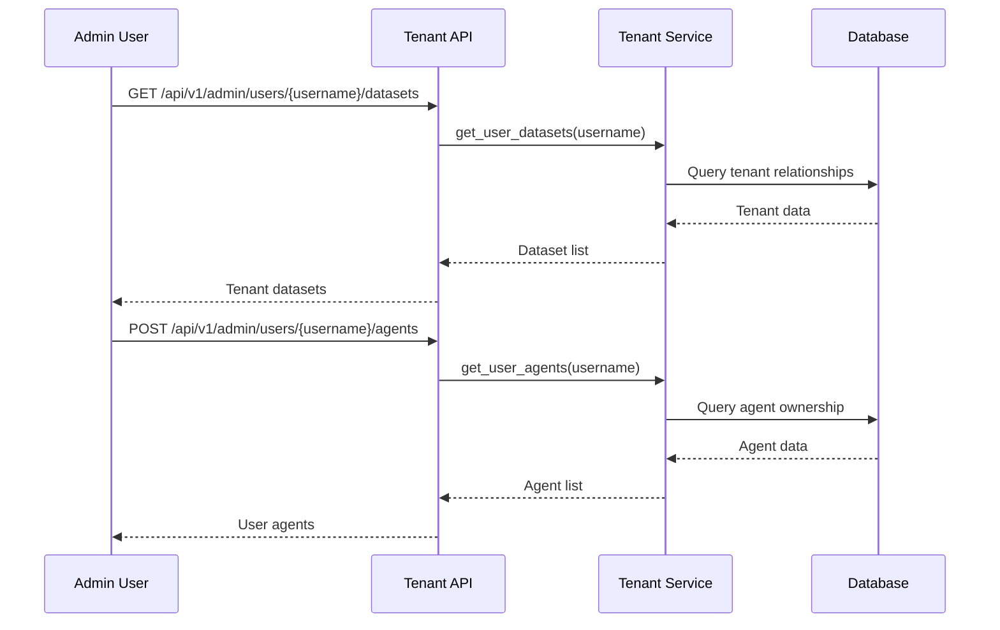
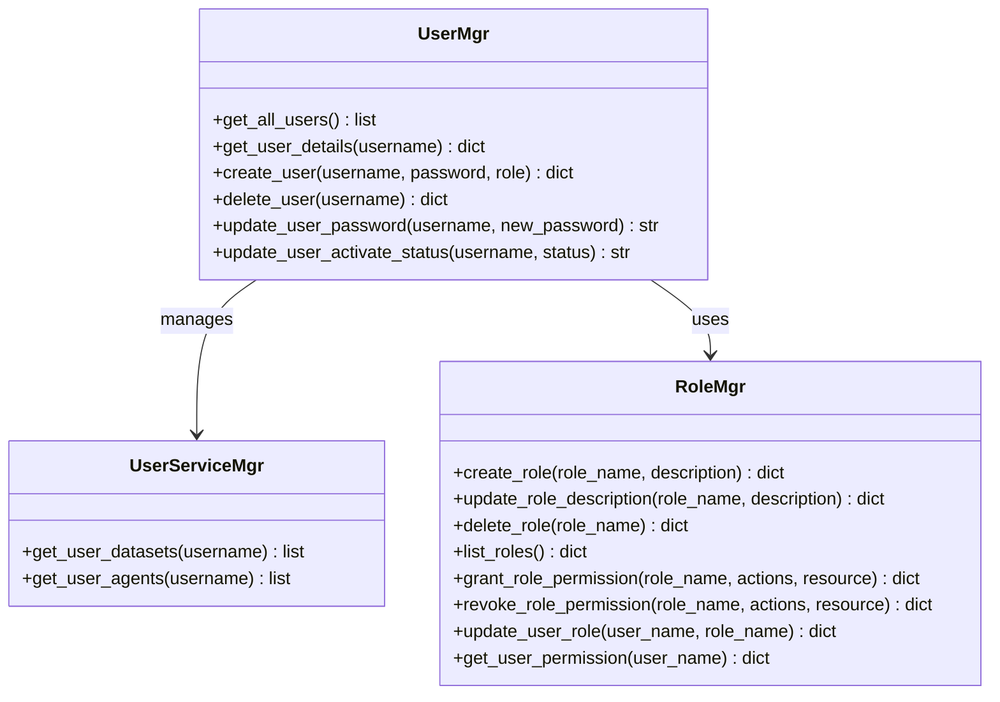
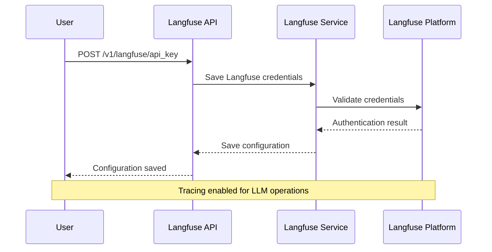
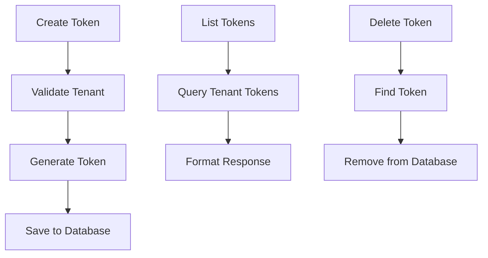
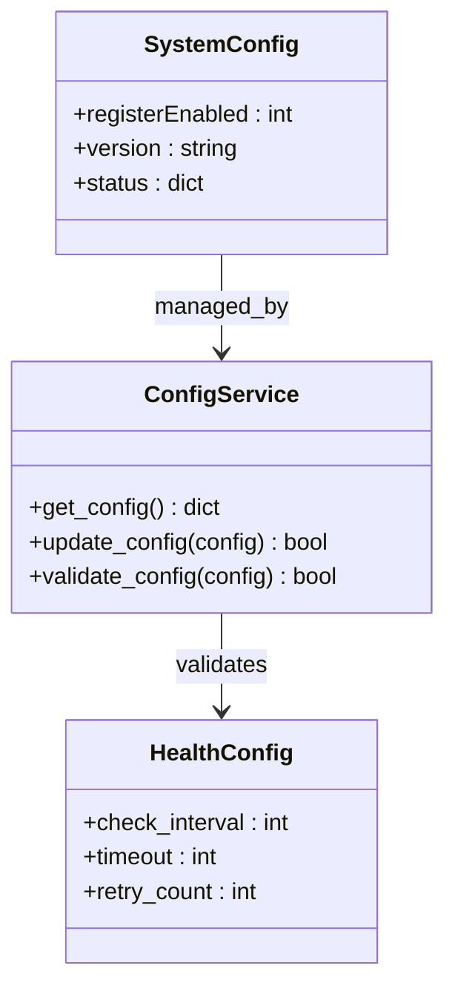
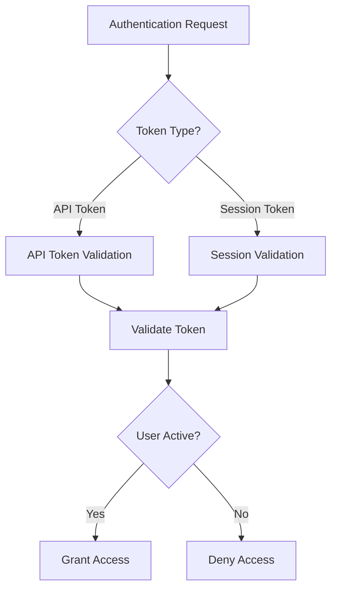
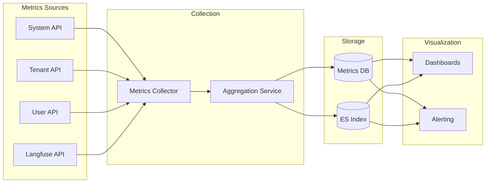

# System Management API

<cite>
**Referenced Files in This Document**
- [admin/server/routes.py](file://admin/server/routes.py)
- [admin/server/admin_server.py](file://admin/server/admin_server.py)
- [admin/server/services.py](file://admin/server/services.py)
- [admin/server/roles.py](file://admin/server/roles.py)
- [admin/server/config.py](file://admin/server/config.py)
- [api/apps/system_app.py](file://api/apps/system_app.py)
- [api/apps/langfuse_app.py](file://api/apps/langfuse_app.py)
- [api/apps/tenant_app.py](file://api/apps/tenant_app.py)
- [api/utils/health_utils.py](file://api/utils/health_utils.py)
- [api/db/services/user_service.py](file://api/db/services/user_service.py)
- [api/db/services/search_service.py](file://api/db/services/search_service.py)
- [api/db/db_models.py](file://api/db/db_models.py)
- [web/src/services/user-service.ts](file://web/src/services/user-service.ts)
- [web/src/hooks/use-user-setting-request.tsx](file://web/src/hooks/use-user-setting-request.tsx)
- [web/src/hooks/use-system-request.ts](file://web/src/hooks/use-system-request.ts)
</cite>

## Table of Contents
1. [Introduction](#introduction)
2. [System Architecture](#system-architecture)
3. [Health Check Endpoints](#health-check-endpoints)
4. [System Status Monitoring](#system-status-monitoring)
5. [Tenant Management](#tenant-management)
6. [User Administration](#user-administration)
7. [Langfuse Integration](#langfuse-integration)
8. [API Token Management](#api-token-management)
9. [Configuration Management](#configuration-management)
10. [Authentication and Authorization](#authentication-and-authorization)
11. [Operational Metrics](#operational-metrics)
12. [Troubleshooting Guide](#troubleshooting-guide)

## Introduction

RAGFlow's System Management API provides comprehensive administrative functionality for monitoring, configuring, and managing the RAGFlow platform. This API enables administrators to monitor system health, manage tenants and users, configure integrations like Langfuse for observability, and administer various system settings.

The API is organized into several key areas:
- **Health Monitoring**: Real-time system health checks and status reporting
- **Tenant Management**: Multi-tenant architecture support with user management
- **User Administration**: User lifecycle management and role assignments
- **Integration Management**: Langfuse tracing and observability configuration
- **System Configuration**: Global system settings and operational parameters

## System Architecture

The System Management API follows a modular architecture with clear separation of concerns:

**Diagram sources**
- [admin/server/admin_server.py](file://admin/server/admin_server.py#L40-L83)
- [admin/server/routes.py](file://admin/server/routes.py#L29-L383)

**Section sources**
- [admin/server/admin_server.py](file://admin/server/admin_server.py#L40-L83)
- [admin/server/routes.py](file://admin/server/routes.py#L29-L383)

## Health Check Endpoints

RAGFlow provides comprehensive health check endpoints to monitor system dependencies and overall service availability.

### Basic Health Check

**Endpoint**: `GET /v1/system/healthz`

Performs comprehensive health checks across all system components:

**Diagram sources**
- [api/utils/health_utils.py](file://api/utils/health_utils.py#L187-L222)

### System Status Endpoint

**Endpoint**: `GET /v1/system/status`

Provides detailed system status information including individual component health:

| Component | Description | Status Values |
|-----------|-------------|---------------|
| `doc_engine` | Document search engine status | `green`/`red` |
| `storage` | Storage system status | `green`/`red` |
| `database` | Database connectivity status | `green`/`red` |
| `redis` | Redis cache status | `green`/`red` |
| `task_executor_heartbeats` | Task executor health monitoring |

### Ping Endpoint

**Endpoint**: `GET /v1/system/ping`

Simple connectivity test endpoint that returns "pong" with 200 status.

**Section sources**
- [api/apps/system_app.py](file://api/apps/system_app.py#L174-L183)
- [api/utils/health_utils.py](file://api/utils/health_utils.py#L187-L222)

## System Status Monitoring

The system provides detailed monitoring capabilities through various endpoints and health utilities.

### Service Health Monitoring

The admin server provides comprehensive service monitoring:

**Diagram sources**
- [admin/server/services.py](file://admin/server/services.py#L178-L228)
- [admin/server/config.py](file://admin/server/config.py#L277-L304)

### Service Types and Dependencies

The system monitors various service types:

| Service Type | Description | Health Check Method |
|--------------|-------------|-------------------|
| `meta_data` | Database services | `get_mysql_status()` |
| `message_queue` | Redis services | `get_redis_info()` |
| `storage` | MinIO/S3 storage | `check_minio_alive()` |
| `task_executor` | Background task executors | `check_task_executor_alive()` |

**Section sources**
- [admin/server/services.py](file://admin/server/services.py#L178-L228)
- [api/utils/health_utils.py](file://api/utils/health_utils.py#L103-L164)

## Tenant Management

RAGFlow implements a multi-tenant architecture allowing isolation and resource management across different organizational units.

### Tenant Operations

**Diagram sources**
- [admin/server/services.py](file://admin/server/services.py#L139-L176)
- [api/apps/tenant_app.py](file://api/apps/tenant_app.py#L31-L139)

### Tenant User Management

The tenant management system supports:

- **User Invitation**: Invite users to tenant with email-based invitations
- **Role Assignment**: Owner and Normal user roles with different permissions
- **Membership Management**: Add/remove users from tenants
- **Tenant Listing**: View all tenants for a user

### Tenant Creation and Configuration

Tenants are automatically created when users are invited to join existing tenants or when owners create new organizations.

**Section sources**
- [api/apps/tenant_app.py](file://api/apps/tenant_app.py#L31-L139)
- [admin/server/services.py](file://admin/server/services.py#L139-L176)

## User Administration

The user administration system provides comprehensive user lifecycle management and role-based access control.

### User Management Operations

**Diagram sources**
- [admin/server/services.py](file://admin/server/services.py#L32-L137)
- [admin/server/roles.py](file://admin/server/roles.py#L23-L77)

### User Lifecycle Management

| Operation | Endpoint | Description |
|-----------|----------|-------------|
| List Users | `GET /api/v1/admin/users` | Retrieve all system users |
| Create User | `POST /api/v1/admin/users` | Create new system user |
| Delete User | `DELETE /api/v1/admin/users/{username}` | Remove user from system |
| Update Password | `PUT /api/v1/admin/users/{username}/password` | Change user password |
| Activate/Deactivate | `PUT /api/v1/admin/users/{username}/activate` | Toggle user activation status |
| User Details | `GET /api/v1/admin/users/{username}` | Get detailed user information |

### Role-Based Access Control

The system implements role-based access control with the following capabilities:

- **Role Management**: Create, update, delete custom roles
- **Permission Assignment**: Grant/revoke permissions at granular level
- **User Role Assignment**: Assign roles to users
- **Permission Inheritance**: Roles inherit permissions from parent roles

**Section sources**
- [admin/server/services.py](file://admin/server/services.py#L32-L137)
- [admin/server/roles.py](file://admin/server/roles.py#L23-L77)

## Langfuse Integration

RAGFlow provides seamless integration with Langfuse for LLM application tracing and observability.

### Langfuse Configuration

**Diagram sources**
- [api/apps/langfuse_app.py](file://api/apps/langfuse_app.py#L26-L97)

### Langfuse Endpoints

| Endpoint | Method | Description |
|----------|--------|-------------|
| `/v1/langfuse/api_key` | POST/PUT | Configure Langfuse credentials |
| `/v1/langfuse/api_key` | GET | Retrieve configured Langfuse settings |
| `/v1/langfuse/api_key` | DELETE | Remove Langfuse configuration |

### Tracing Capabilities

Langfuse integration provides:

- **Automatic Tracing**: Automatic tracing of LLM operations and retrievals
- **Span Collection**: Detailed timing and performance metrics
- **Prompt Logging**: Complete prompt and response logging
- **Performance Analytics**: Token usage and latency tracking
- **Debug Information**: Step-by-step operation breakdown

**Section sources**
- [api/apps/langfuse_app.py](file://api/apps/langfuse_app.py#L26-L97)

## API Token Management

RAGFlow provides API token management for programmatic access to the system.

### Token Operations

**Diagram sources**
- [api/apps/system_app.py](file://api/apps/system_app.py#L285-L335)

### API Token Endpoints

| Endpoint | Method | Description |
|----------|--------|-------------|
| `/v1/system/new_token` | POST | Generate new API token |
| `/v1/system/token_list` | GET | List all user tokens |
| `/v1/system/token/{token}` | DELETE | Remove specific token |

### Token Security

- **Tenant Isolation**: Tokens are scoped to specific tenants
- **Secure Generation**: Uses cryptographically secure token generation
- **Access Control**: Tokens validated against user permissions
- **Revocation**: Tokens can be deleted and immediately invalidated

**Section sources**
- [api/apps/system_app.py](file://api/apps/system_app.py#L285-L335)

## Configuration Management

System-wide configuration management provides centralized control over RAGFlow settings.

### System Configuration

The system exposes configuration through multiple endpoints:

**Diagram sources**
- [api/apps/system_app.py](file://api/apps/system_app.py#L316-L335)

### Configuration Endpoints

| Endpoint | Method | Description |
|----------|--------|-------------|
| `/v1/system/config` | GET | Retrieve system configuration |
| `/v1/system/version` | GET | Get current RAGFlow version |
| `/api/v1/admin/version` | GET | Get admin service version |

### Available Configuration Options

- **Registration Settings**: Enable/disable user registration
- **Version Information**: Current system version and build details
- **Feature Flags**: Enable/disable experimental features
- **Resource Limits**: System resource allocation settings

**Section sources**
- [api/apps/system_app.py](file://api/apps/system_app.py#L316-L335)

## Authentication and Authorization

RAGFlow implements robust authentication and authorization mechanisms for system access.

### Authentication Methods

**Diagram sources**
- [api/apps/__init__.py](file://api/apps/__init__.py#L114-L149)

### Authorization Layers

The system implements multiple authorization layers:

1. **Admin Authentication**: Full admin privileges for system management
2. **User Authentication**: Standard user access with tenant isolation
3. **API Token Authentication**: Programmatic access with scoped permissions
4. **Role-Based Access Control**: Fine-grained permission management

### Security Features

- **Token Validation**: Cryptographic token verification
- **Access Token Rotation**: Secure token refresh mechanisms
- **Session Management**: Secure session handling
- **Rate Limiting**: Protection against abuse
- **Audit Logging**: Comprehensive access logging

**Section sources**
- [api/apps/__init__.py](file://api/apps/__init__.py#L114-L149)
- [admin/server/auth.py](file://admin/server/auth.py#L34-L66)

## Operational Metrics

RAGFlow provides comprehensive operational metrics for system monitoring and performance analysis.

### Performance Metrics

The system tracks various performance indicators:

| Metric Category | Measurements | Purpose |
|-----------------|--------------|---------|
| Response Times | API endpoint latencies | Performance monitoring |
| Resource Usage | CPU, memory, disk utilization | Capacity planning |
| Error Rates | Failure rates by component | Reliability tracking |
| Throughput | Requests per second | Load assessment |
| Queue Lengths | Task queue depths | Bottleneck identification |

### Monitoring Integration

**Section sources**
- [api/utils/health_utils.py](file://api/utils/health_utils.py#L187-L222)

## Troubleshooting Guide

Common issues and their solutions when working with the System Management API.

### Health Check Issues

**Problem**: Health check returns 500 status
**Solution**: 
1. Check database connectivity
2. Verify Redis service availability
3. Confirm document engine accessibility
4. Validate storage system health

**Problem**: Specific service shows timeout
**Solution**:
1. Check service logs for errors
2. Verify network connectivity
3. Review service configuration
4. Restart problematic services

### Authentication Problems

**Problem**: 401 Unauthorized responses
**Solution**:
1. Verify API token validity
2. Check token expiration
3. Ensure proper authorization header format
4. Validate user account status

**Problem**: 403 Forbidden responses
**Solution**:
1. Verify user permissions
2. Check role assignments
3. Review access control policies
4. Confirm tenant membership

### Tenant Management Issues

**Problem**: Cannot add user to tenant
**Solution**:
1. Verify user exists in system
2. Check invitation email delivery
3. Confirm tenant owner permissions
4. Review user account status

**Problem**: Tenant data not isolated
**Solution**:
1. Verify tenant boundaries
2. Check user tenant assignments
3. Review access control rules
4. Validate data segregation

### Langfuse Integration Issues

**Problem**: Langfuse credentials validation fails
**Solution**:
1. Verify public and secret keys
2. Check Langfuse platform accessibility
3. Confirm project permissions
4. Validate host URL format

**Problem**: Tracing data not appearing
**Solution**:
1. Verify Langfuse configuration
2. Check LLM provider setup
3. Review tracing enablement
4. Monitor Langfuse platform status

**Section sources**
- [api/utils/health_utils.py](file://api/utils/health_utils.py#L187-L222)
- [api/apps/langfuse_app.py](file://api/apps/langfuse_app.py#L26-L97)