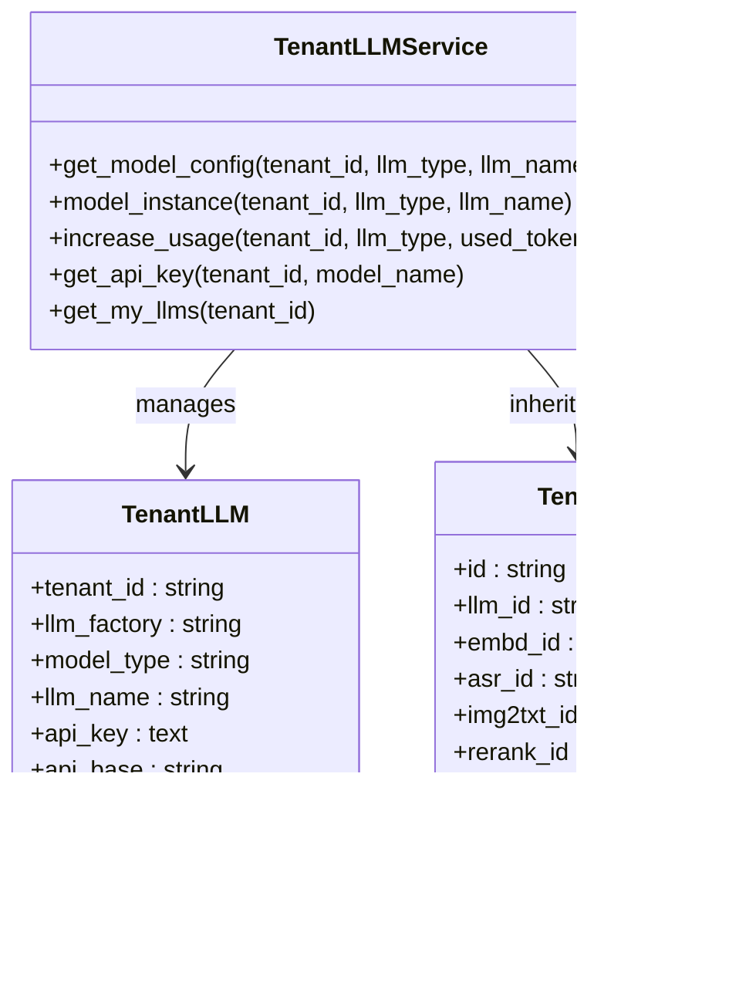

# Tenant Management API

<cite>
**Referenced Files in This Document**
- [tenant_app.py](file://api/apps/tenant_app.py)
- [user_service.py](file://api/db/services/user_service.py)
- [tenant_llm_service.py](file://api/db/services/tenant_llm_service.py)
- [db_models.py](file://api/db/db_models.py)
- [system_app.py](file://api/apps/system_app.py)
- [common_service.py](file://api/db/services/common_service.py)
- [__init__.py](file://api/apps/__init__.py)
- [routes.py](file://admin/server/routes.py)
- [tenant-table.tsx](file://web/src/pages/user-setting/setting-team/tenant-table.tsx)
- [user-service.ts](file://web/src/services/user-service.ts)
</cite>

## Table of Contents
1. [Introduction](#introduction)
2. [System Architecture](#system-architecture)
3. [Tenant Data Model](#tenant-data-model)
4. [Authentication and Authorization](#authentication-and-authorization)
5. [API Endpoints](#api-endpoints)
6. [Tenant Isolation Mechanisms](#tenant-isolation-mechanisms)
7. [Configuration Management](#configuration-management)
8. [User Management](#user-management)
9. [Integration Examples](#integration-examples)
10. [Troubleshooting](#troubleshooting)

## Introduction

RAGFlow's tenant management system provides comprehensive multi-tenant capabilities for isolated deployment environments. The system enables organizations to create separate tenant environments with distinct data storage, processing resources, and access controls while maintaining centralized administration.

The tenant management functionality includes:
- Multi-tenant isolation across data storage and processing
- Role-based access control (Owner, Normal, Invite)
- Resource management with credit-based billing
- API token management per tenant
- Configurable service settings per tenant
- Email invitation system for tenant membership

## System Architecture

The tenant management system follows a layered architecture with clear separation of concerns:


**Diagram sources**
- [__init__.py](file://api/apps/__init__.py#L108-L149)
- [tenant_app.py](file://api/apps/tenant_app.py#L1-L140)
- [user_service.py](file://api/db/services/user_service.py#L168-L320)

## Tenant Data Model

The tenant management system is built around several core database models that define the structure and relationships:

```mermaid
erDiagram
TENANT {
string id PK
string name
string public_key
string llm_id
string embd_id
string asr_id
string img2txt_id
string rerank_id
string tts_id
string parser_ids
integer credit
string status
}
USER_TENANT {
string id PK
string user_id FK
string tenant_id FK
string role
string invited_by FK
string status
}
USER {
string id PK
string access_token
string nickname
string password
string email
string avatar
string language
string timezone
datetime last_login_time
string is_authenticated
string is_active
string is_superuser
string status
}
TENANT_LLM {
string tenant_id FK
string llm_factory
string model_type
string llm_name
text api_key
string api_base
integer max_tokens
integer used_tokens
string status
}
TENANT --> USER_TENANT : "owns"
USER --> USER_TENANT : "belongs to"
TENANT --> TENANT_LLM : "configures"
```

**Diagram sources**
- [db_models.py](file://api/db/db_models.py#L627-L718)

### Core Models

**Tenant Model (`Tenant`)**:
- Primary identifier for tenant isolation
- Contains default LLM configurations
- Credit-based resource management
- Status tracking for tenant lifecycle

**UserTenant Model (`UserTenant`)**:
- Many-to-many relationship between users and tenants
- Role-based access control (Owner, Normal, Invite)
- Membership tracking and invitations

**TenantLLM Model (`TenantLLM`)**:
- Per-tenant LLM configuration
- API keys and endpoint management
- Token usage tracking
- Model-specific settings

**Section sources**
- [db_models.py](file://api/db/db_models.py#L627-L718)

## Authentication and Authorization

RAGFlow implements a robust authentication and authorization system that ensures proper tenant isolation:


**Diagram sources**
- [__init__.py](file://api/apps/__init__.py#L108-L149)
- [user_service.py](file://api/db/services/user_service.py#L32-L165)

### Authentication Flow

The system supports two authentication mechanisms:

1. **Session-based Authentication**: Traditional JWT token authentication
2. **API Token Authentication**: Direct API key authentication for programmatic access

### Authorization Rules

- **Tenant Owners**: Can manage tenant settings, invite users, and access all tenant resources
- **Normal Users**: Have access to tenant resources but cannot modify tenant settings
- **Invited Users**: Require acceptance before gaining access to tenant resources

**Section sources**
- [__init__.py](file://api/apps/__init__.py#L147-L174)
- [tenant_app.py](file://api/apps/tenant_app.py#L31-L68)

## API Endpoints

### Tenant Management Endpoints

#### List Tenants for Current User
```
GET /api/v1/tenant/list
Headers:
  Authorization: Bearer <access_token>
Response:
  {
    "code": 0,
    "message": "success",
    "data": [
      {
        "tenant_id": "tenant_id_1",
        "role": "owner",
        "nickname": "User Name",
        "email": "user@example.com",
        "avatar": "base64_avatar",
        "update_date": "2024-01-01T00:00:00Z"
      }
    ]
  }
```

#### Get Tenant Users
```
GET /api/v1/tenant/<tenant_id>/user/list
Headers:
  Authorization: Bearer <access_token>
Response:
  {
    "code": 0,
    "message": "success",
    "data": [
      {
        "id": "user_tenant_id",
        "user_id": "user_id",
        "status": "1",
        "role": "owner",
        "nickname": "Owner Name",
        "email": "owner@example.com",
        "avatar": "base64_avatar",
        "is_authenticated": "1",
        "is_active": "1",
        "is_anonymous": "0",
        "status": "1",
        "update_date": "2024-01-01T00:00:00Z",
        "is_superuser": false
      }
    ]
  }
```

#### Invite User to Tenant
```
POST /api/v1/tenant/<tenant_id>/user
Headers:
  Authorization: Bearer <access_token>
Content-Type: application/json
Body:
  {
    "email": "user@example.com"
  }
Response:
  {
    "code": 0,
    "message": "success",
    "data": {
      "id": "user_id",
      "avatar": "base64_avatar",
      "email": "user@example.com",
      "nickname": "User Name"
    }
  }
```

#### Remove User from Tenant
```
DELETE /api/v1/tenant/<tenant_id>/user/<user_id>
Headers:
  Authorization: Bearer <access_token>
Response:
  {
    "code": 0,
    "message": "success",
    "data": true
  }
```

#### Accept Tenant Invitation
```
PUT /api/v1/tenant/agree/<tenant_id>
Headers:
  Authorization: Bearer <access_token>
Response:
  {
    "code": 0,
    "message": "success",
    "data": true
  }
```

### System Management Endpoints

#### Generate API Token
```
POST /api/v1/system/new_token
Headers:
  Authorization: Bearer <access_token>
Response:
  {
    "code": 0,
    "message": "success",
    "data": {
      "tenant_id": "tenant_id",
      "token": "generated_token",
      "beta": "beta_token",
      "create_time": 1234567890,
      "create_date": "2024-01-01T00:00:00Z",
      "update_time": null,
      "update_date": null
    }
  }
```

#### List API Tokens
```
GET /api/v1/system/token_list
Headers:
  Authorization: Bearer <access_token>
Response:
  {
    "code": 0,
    "message": "success",
    "data": [
      {
        "token": "api_token",
        "beta": "beta_token",
        "create_time": 1234567890,
        "create_date": "2024-01-01T00:00:00Z"
      }
    ]
  }
```

#### Delete API Token
```
DELETE /api/v1/system/token/<token>
Headers:
  Authorization: Bearer <access_token>
Response:
  {
    "code": 0,
    "message": "success",
    "data": true
  }
```

**Section sources**
- [tenant_app.py](file://api/apps/tenant_app.py#L31-L140)
- [system_app.py](file://api/apps/system_app.py#L185-L313)

## Tenant Isolation Mechanisms

RAGFlow implements comprehensive tenant isolation across multiple dimensions:

### Data Isolation


**Diagram sources**
- [user_service.py](file://api/db/services/user_service.py#L166-L225)
- [tenant_llm_service.py](file://api/db/services/tenant_llm_service.py#L221-L225)

### Resource Isolation

Each tenant operates within defined resource boundaries:

- **Credit System**: Prepaid credits for processing operations
- **LLM Limits**: Per-tenant model usage quotas
- **Storage Quotas**: File and document storage limits
- **Processing Limits**: Concurrent operation restrictions

### Access Control Isolation

The system enforces strict access controls:

- **Role-Based Permissions**: Owner, Normal, and Invite roles
- **Resource Scoping**: All operations scoped to tenant context
- **API Token Isolation**: Tokens bound to specific tenants
- **Cross-Tenant Protection**: Prevents unauthorized access between tenants

**Section sources**
- [user_service.py](file://api/db/services/user_service.py#L166-L225)
- [tenant_llm_service.py](file://api/db/services/tenant_llm_service.py#L221-L225)

## Configuration Management

### Tenant Configuration Options

RAGFlow provides extensive configuration options for each tenant:

| Configuration Category | Options | Description |
|----------------------|---------|-------------|
| **LLM Settings** | Default models, API keys, endpoints | Configure AI model preferences per tenant |
| **Processing Resources** | Credit limits, token quotas | Manage computational resources |
| **Storage Settings** | Parser configurations, file limits | Define document processing capabilities |
| **Access Controls** | User roles, permissions | Manage tenant membership and access |
| **Branding** | Custom logos, themes | Customize tenant appearance |

### LLM Configuration Management



**Diagram sources**
- [tenant_llm_service.py](file://api/db/services/tenant_llm_service.py#L32-L269)
- [db_models.py](file://api/db/db_models.py#L702-L718)

### Resource Limit Management

The system implements credit-based resource management:

- **Initial Credits**: New tenants receive default credit allocation
- **Usage Tracking**: Real-time monitoring of resource consumption
- **Quota Enforcement**: Automatic blocking when limits are reached
- **Billing Integration**: Support for external billing systems

**Section sources**
- [tenant_llm_service.py](file://api/db/services/tenant_llm_service.py#L32-L269)
- [user_service.py](file://api/db/services/user_service.py#L212-L225)

## User Management

### Tenant Membership Lifecycle


### User Roles and Permissions

| Role | Permissions | Capabilities |
|------|-------------|--------------|
| **Owner** | Full tenant management | Create/delete tenant, invite/remove users, configure settings |
| **Normal** | Standard tenant access | Access tenant resources, create documents, manage conversations |
| **Invite** | Pending membership | Receive notifications, accept/reject invitations |

### Invitation System

The invitation system supports:

- **Email Notifications**: Automated invitation emails with activation links
- **Role Assignment**: Specify user role during invitation
- **Acceptance Workflow**: Clear process for accepting/rejecting invitations
- **Duplicate Prevention**: Prevents multiple invitations to same user

**Section sources**
- [tenant_app.py](file://api/apps/tenant_app.py#L48-L140)
- [user_service.py](file://api/db/services/user_service.py#L227-L320)

## Integration Examples

### Creating a New Tenant with Custom Configuration

```python
import requests
import json

# Step 1: Authenticate and get tenant information
response = requests.get(
    "http://localhost:9380/api/v1/tenant/list",
    headers={"Authorization": "Bearer <your_token>"}
)
tenants = response.json()["data"]

# Step 2: Create new tenant (assuming user has ownership rights)
tenant_data = {
    "name": "My Custom Tenant",
    "llm_id": "gpt-4",
    "embd_id": "text-embedding-ada-002",
    "credit": 1000
}

response = requests.post(
    "http://localhost:9380/api/v1/tenant/create",
    headers={"Authorization": "Bearer <your_token>"},
    json=tenant_data
)
```

### Managing Tenant Users Programmatically

```python
# Invite user to tenant
def invite_user_to_tenant(tenant_id, email):
    response = requests.post(
        f"http://localhost:9380/api/v1/tenant/{tenant_id}/user",
        headers={"Authorization": "Bearer <your_token>"},
        json={"email": email}
    )
    return response.json()

# List tenant users
def list_tenant_users(tenant_id):
    response = requests.get(
        f"http://localhost:9380/api/v1/tenant/{tenant_id}/user/list",
        headers={"Authorization": "Bearer <your_token>"}
    )
    return response.json()["data"]

# Remove user from tenant
def remove_user_from_tenant(tenant_id, user_id):
    response = requests.delete(
        f"http://localhost:9380/api/v1/tenant/{tenant_id}/user/{user_id}",
        headers={"Authorization": "Bearer <your_token>"}
    )
    return response.json()
```

### API Token Management

```python
# Generate new API token
def generate_api_token():
    response = requests.post(
        "http://localhost:9380/api/v1/system/new_token",
        headers={"Authorization": "Bearer <your_token>"}
    )
    return response.json()["data"]["token"]

# List all API tokens
def list_api_tokens():
    response = requests.get(
        "http://localhost:9380/api/v1/system/token_list",
        headers={"Authorization": "Bearer <your_token>"}
    )
    return response.json()["data"]

# Delete API token
def delete_api_token(token):
    response = requests.delete(
        f"http://localhost:9380/api/v1/system/token/{token}",
        headers={"Authorization": "Bearer <your_token>"}
    )
    return response.json()["data"]
```

## Troubleshooting

### Common Issues and Solutions

#### Authentication Failures
**Problem**: 401 Unauthorized errors when accessing tenant endpoints
**Solution**: 
- Verify access token is valid and not expired
- Check that user belongs to the requested tenant
- Ensure tenant status is "active"

#### Authorization Errors
**Problem**: "No authorization" messages when performing tenant operations
**Solution**:
- Confirm user role is appropriate for the operation
- Verify tenant ownership for administrative actions
- Check that user has accepted invitation if in "Invite" role

#### Resource Limit Exceeded
**Problem**: Operations fail due to credit or quota limits
**Solution**:
- Monitor tenant credit balance
- Increase tenant credit allocation
- Optimize resource usage patterns

#### Invitation System Issues
**Problem**: Users not receiving invitation emails or unable to accept invitations
**Solution**:
- Verify SMTP configuration for email delivery
- Check invitation expiration settings
- Ensure user accounts exist for invited emails

### Debugging Tools

The system provides several debugging capabilities:

- **Health Checks**: Monitor system and tenant status
- **Usage Analytics**: Track resource consumption per tenant
- **Audit Logging**: Comprehensive audit trail of tenant operations
- **Error Reporting**: Detailed error messages for troubleshooting

**Section sources**
- [system_app.py](file://api/apps/system_app.py#L42-L171)
- [common_service.py](file://api/db/services/common_service.py#L217-L229)