# User Management API

<cite>
**Referenced Files in This Document**   
- [user_app.py](file://api/apps/user_app.py)
- [tenant_app.py](file://api/apps/tenant_app.py)
- [admin_client.py](file://admin/client/admin_client.py)
- [admin_server.py](file://admin/server/admin_server.py)
- [auth.py](file://admin/server/auth.py)
- [routes.py](file://admin/server/routes.py)
- [services.py](file://admin/server/services.py)
- [roles.py](file://admin/server/roles.py)
- [user_service.py](file://api/db/services/user_service.py)
- [db_models.py](file://api/db/db_models.py)
- [oauth.py](file://api/apps/auth/oauth.py)
- [github.py](file://api/apps/auth/github.py)
- [oidc.py](file://api/apps/auth/oidc.py)
- [check_team_permission.py](file://api/common/check_team_permission.py)
</cite>

## Table of Contents
1. [Introduction](#introduction)
2. [User Management Endpoints](#user-management-endpoints)
3. [Authentication Methods](#authentication-methods)
4. [User Role Hierarchy](#user-role-hierarchy)
5. [Permission Management](#permission-management)
6. [User Provisioning Workflows](#user-provisioning-workflows)
7. [User Activity Tracking](#user-activity-tracking)
8. [Security Model Integration](#security-model-integration)
9. [API Examples](#api-examples)

## Introduction
The RAGFlow user management system provides a comprehensive API for managing users, authentication, roles, and permissions within the platform. The system supports multiple authentication methods, a hierarchical role structure, and fine-grained permission controls that govern access to system features and resources. This documentation details the API endpoints for user creation, authentication, role assignment, and permission management, along with the underlying architecture and security model.

The user management system is organized around tenants, which represent organizational units or teams. Users can belong to multiple tenants and have different roles within each tenant. The system supports both password-based authentication and OAuth integrations, including GitHub and OpenID Connect (OIDC). User roles determine access levels and permissions across different system components, with a hierarchy that includes admin, tenant admin, and regular user roles.

**Section sources**
- [user_app.py](file://api/apps/user_app.py#L1-L50)
- [tenant_app.py](file://api/apps/tenant_app.py#L1-L30)

## User Management Endpoints

The RAGFlow user management API provides endpoints for creating, updating, and deleting users, as well as managing user sessions and settings. The endpoints are organized under different routes based on functionality and access level.

### User Creation and Management
The system provides RESTful endpoints for user management operations. The admin interface allows for user creation, deletion, and status management through dedicated endpoints:

```mermaid
flowchart TD
A[Create User] --> B[POST /api/v1/admin/users]
C[Delete User] --> D[DELETE /api/v1/admin/users/{username}]
E[Update Password] --> F[PUT /api/v1/admin/users/{username}/password]
G[Activate/Deactivate] --> H[PUT /api/v1/admin/users/{username}/activate]
I[Get User Details] --> J[GET /api/v1/admin/users/{username}]
```

**Diagram sources**
- [routes.py](file://admin/server/routes.py#L76-L117)
- [services.py](file://admin/server/services.py#L68-L95)

The user creation endpoint requires a username (email), password, and optional role parameter. When a user is created, their password is securely hashed before storage. The system validates email format and checks for existing users to prevent duplicates. User deletion removes the user's access and associated data while maintaining audit trails.

### Tenant-Based User Management
Users are organized within tenants, which represent organizational units. The tenant API provides endpoints for managing user membership within tenants:

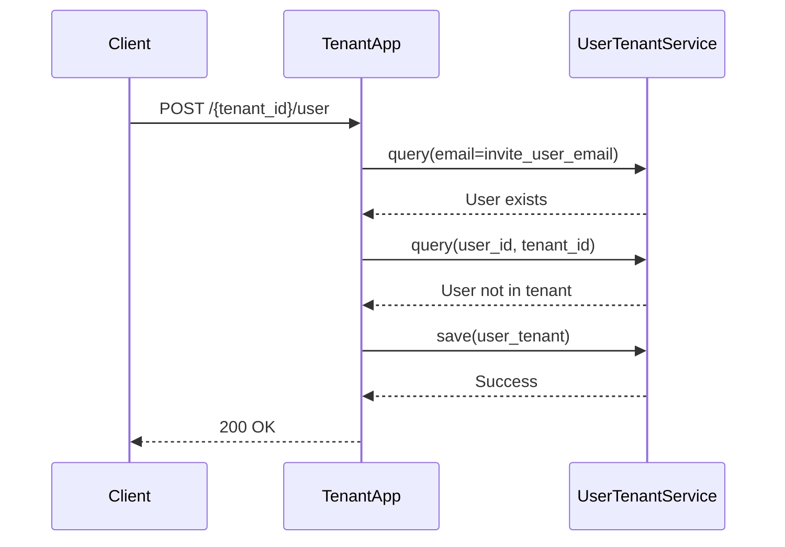

**Diagram sources**
- [tenant_app.py](file://api/apps/tenant_app.py#L48-L101)
- [user_service.py](file://api/db/services/user_service.py#L238-L253)

The tenant user creation process involves verifying the user exists, checking their current membership status in the tenant, and creating a UserTenant record with an initial "invite" role. The inviting user must be the tenant owner. Email notifications are sent to invited users when SMTP configuration is available.

### User Session Management
The system provides endpoints for user authentication, session management, and logout:

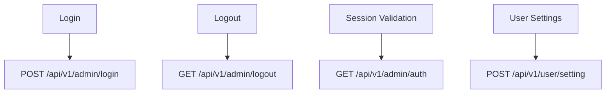

**Diagram sources**
- [routes.py](file://admin/server/routes.py#L32-L52)
- [user_app.py](file://api/apps/user_app.py#L486-L505)

During login, the system verifies credentials, generates a UUID-based access token, and updates the user's last login time. The logout endpoint invalidates the user's access token by prefixing it with "INVALID_", ensuring immediate session termination. Session validation is performed through token-based authentication in the Authorization header.

**Section sources**
- [routes.py](file://admin/server/routes.py#L32-L117)
- [user_app.py](file://api/apps/user_app.py#L486-L535)
- [tenant_app.py](file://api/apps/tenant_app.py#L48-L139)

## Authentication Methods

RAGFlow supports multiple authentication methods, including password-based authentication and OAuth integrations. The authentication system is designed to be extensible, allowing for the addition of new authentication providers.

### Password-Based Authentication
The system implements secure password-based authentication with the following characteristics:

- Passwords are hashed using Werkzeug's security functions before storage
- Access tokens are UUIDs (32 hex characters) generated upon successful login
- Tokens are validated through a request loader that checks token format and validity
- Invalidated tokens are prefixed with "INVALID_" to prevent reuse

The authentication flow for password-based login:

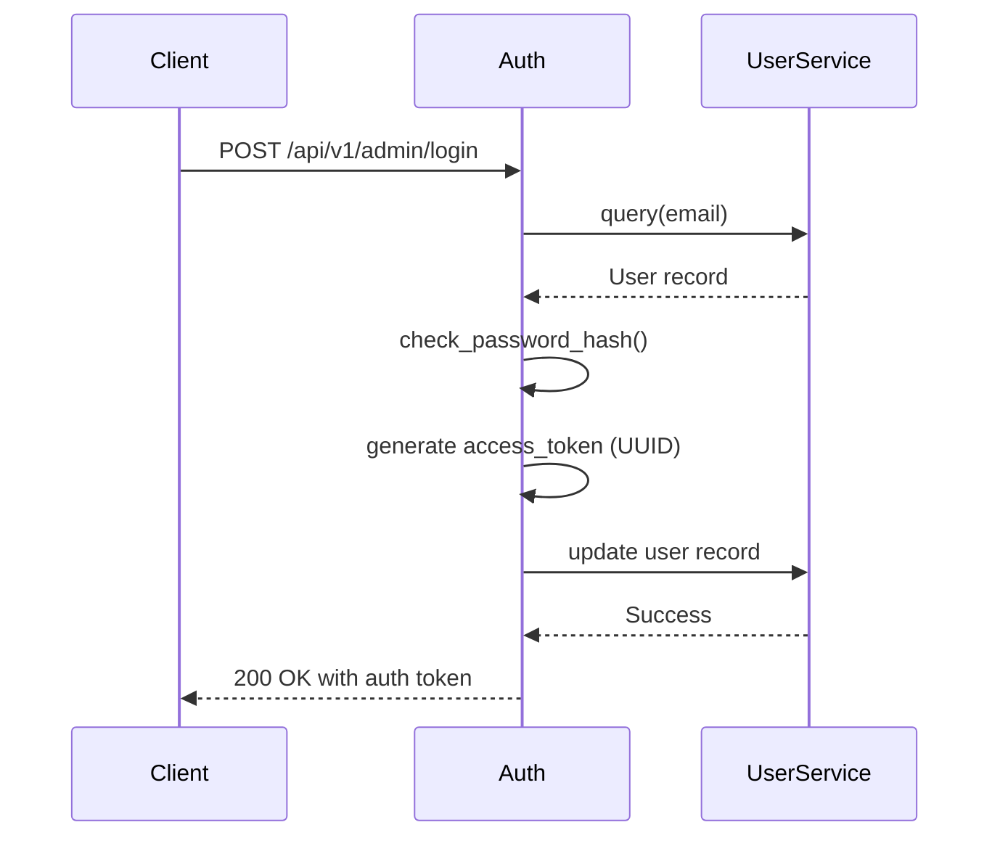

**Diagram sources**
- [auth.py](file://admin/server/auth.py#L108-L133)
- [user_service.py](file://api/db/services/user_service.py#L113-L123)

### OAuth Integration
RAGFlow supports OAuth 2.0 and OpenID Connect (OIDC) for third-party authentication. The system includes dedicated classes for handling OAuth flows:

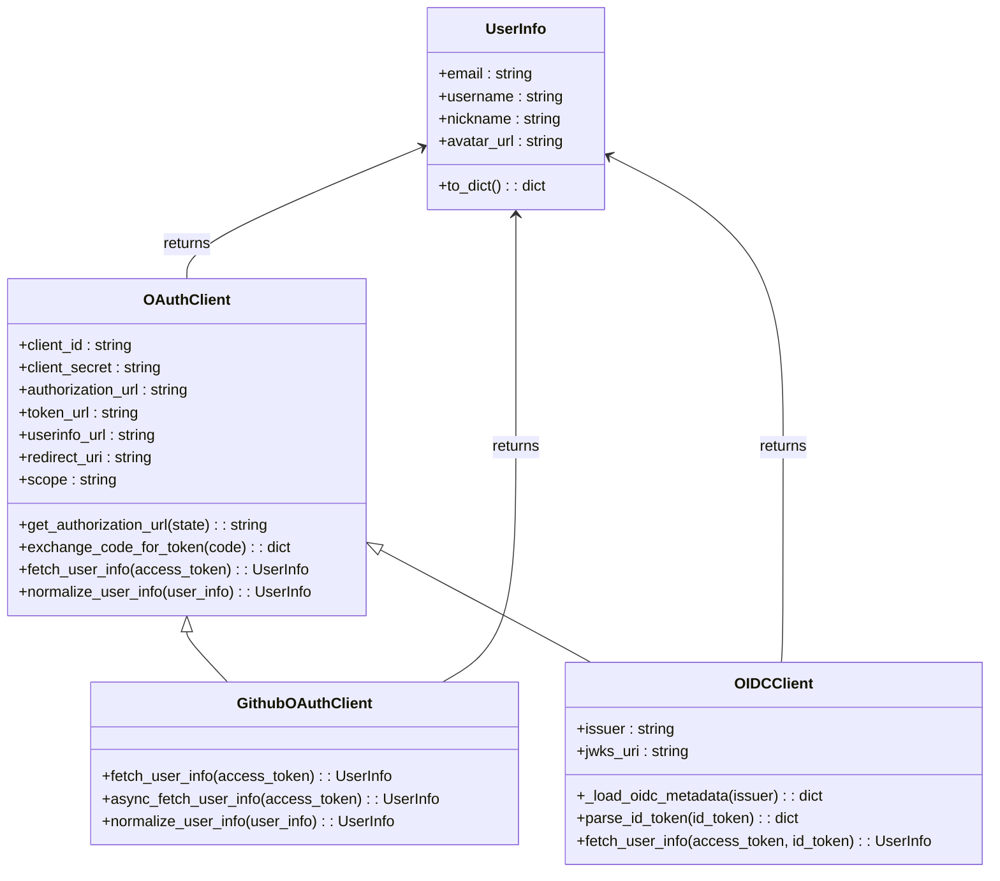

**Diagram sources**
- [oauth.py](file://api/apps/auth/oauth.py#L32-L152)
- [github.py](file://api/apps/auth/github.py#L21-L89)
- [oidc.py](file://api/apps/auth/oidc.py#L22-L108)

The OAuth client base class provides methods for generating authorization URLs, exchanging authorization codes for access tokens, and fetching user information. The GitHub OAuth client extends this base class and implements GitHub-specific user information retrieval, including fetching the user's primary email from the emails endpoint. The OIDC client supports automatic configuration discovery through the OpenID Connect discovery document and JWT token validation.

### Authentication Flow
The complete authentication flow for OAuth providers:

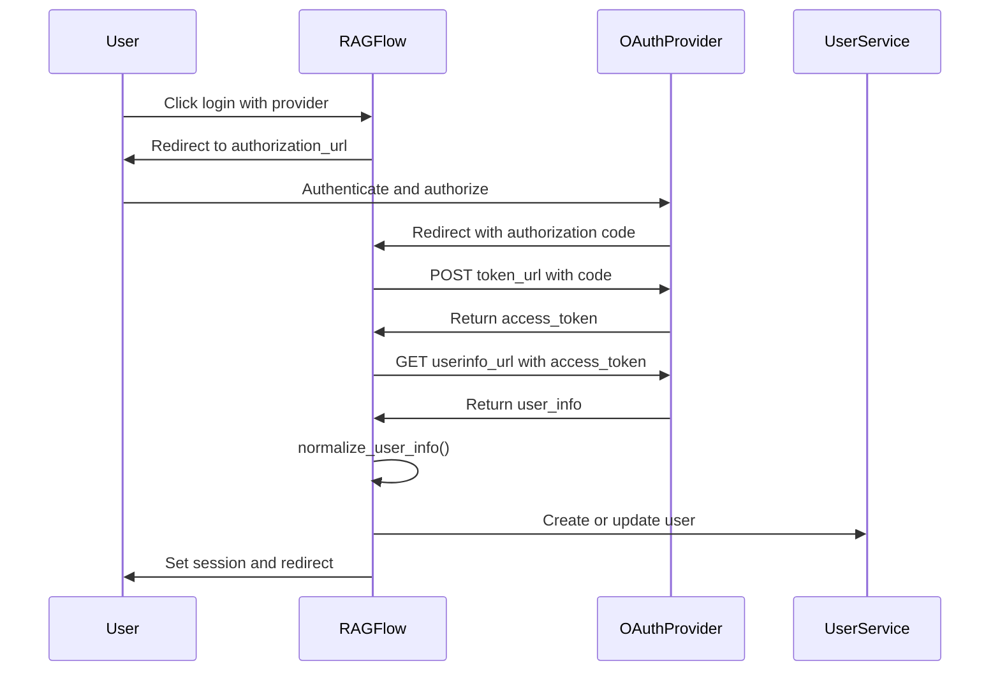

**Diagram sources**
- [oauth.py](file://api/apps/auth/oauth.py#L48-L152)
- [auth.py](file://admin/server/auth.py#L108-L133)

For GitHub authentication, the system makes an additional request to the `/user/emails` endpoint to retrieve the user's primary email address, which is required for user identification within RAGFlow. The user information is normalized to a consistent format regardless of the authentication provider.

**Section sources**
- [oauth.py](file://api/apps/auth/oauth.py#L32-L152)
- [github.py](file://api/apps/auth/github.py#L21-L89)
- [oidc.py](file://api/apps/auth/oidc.py#L22-L108)
- [auth.py](file://admin/server/auth.py#L38-L189)

## User Role Hierarchy

RAGFlow implements a hierarchical role-based access control (RBAC) system with multiple role levels that determine user privileges within tenants. The role hierarchy is designed to support organizational structures with different levels of administrative control.

### Role Types
The system defines four role types for users within a tenant:

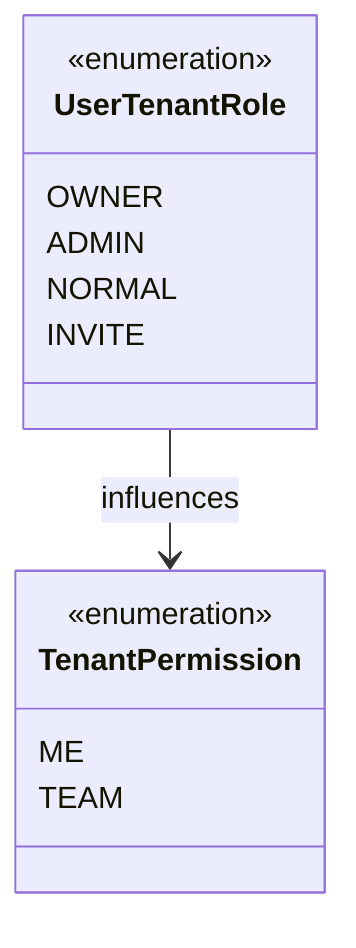

**Diagram sources**
- [__init__.py](file://api/db/__init__.py#L21-L31)

- **OWNER**: The user who created the tenant has full administrative privileges and can manage all aspects of the tenant, including adding and removing users, changing roles, and configuring settings.
- **ADMIN**: Administrators have elevated privileges within the tenant, including the ability to manage users (except the owner), configure services, and access all resources within the tenant.
- **NORMAL**: Regular users have standard access to the tenant's resources and can create and manage their own content, but cannot modify tenant-level settings or manage other users.
- **INVITE**: Users who have been invited to join a tenant but have not yet accepted the invitation. They have no access to tenant resources until they accept.

### Role Management
The admin interface provides endpoints for role management, although the current implementation indicates these features are not yet fully implemented:

```mermaid
flowchart TD
A[Create Role] --> B[POST /api/v1/admin/roles]
C[Update Role] --> D[PUT /api/v1/admin/roles/{role_name}]
D[Delete Role] --> E[DELETE /api/v1/admin/roles/{role_name}]
F[List Roles] --> G[GET /api/v1/admin/roles]
H[Assign Role to User] --> I[PUT /api/v1/admin/users/{user_name}/role]
```

**Diagram sources**
- [routes.py](file://admin/server/routes.py#L253-L360)
- [roles.py](file://admin/server/roles.py#L23-L77)

The role management system is designed to support custom roles with specific permission sets, though the current implementation raises "not implement" exceptions for all role management operations. The user role assignment endpoint allows administrators to change a user's role within the system.

### Tenant Ownership and Administration
Tenant ownership and administration are critical aspects of the role hierarchy. The owner of a tenant has ultimate authority and cannot be removed by other administrators. The system enforces ownership rules through validation in the tenant management endpoints:

```python
# Pseudocode representation of ownership validation
if current_user.id != tenant_id:
    return "No authorization"
    
if user_tenant_role == UserTenantRole.OWNER:
    return "User is the owner of the team"
```

When a user is invited to a tenant, they are initially assigned the "invite" role. They must explicitly accept the invitation through the `/agree/{tenant_id}` endpoint to become a "normal" user with full access to the tenant's resources.

**Section sources**
- [__init__.py](file://api/db/__init__.py#L21-L25)
- [routes.py](file://admin/server/routes.py#L253-L360)
- [roles.py](file://admin/server/roles.py#L23-L77)
- [tenant_app.py](file://api/apps/tenant_app.py#L67-L73)

## Permission Management

The permission management system in RAGFlow controls access to resources and operations based on user roles and resource ownership. The system implements a combination of role-based and resource-based permissions.

### Permission Model
The system defines permissions at both the role and resource levels:

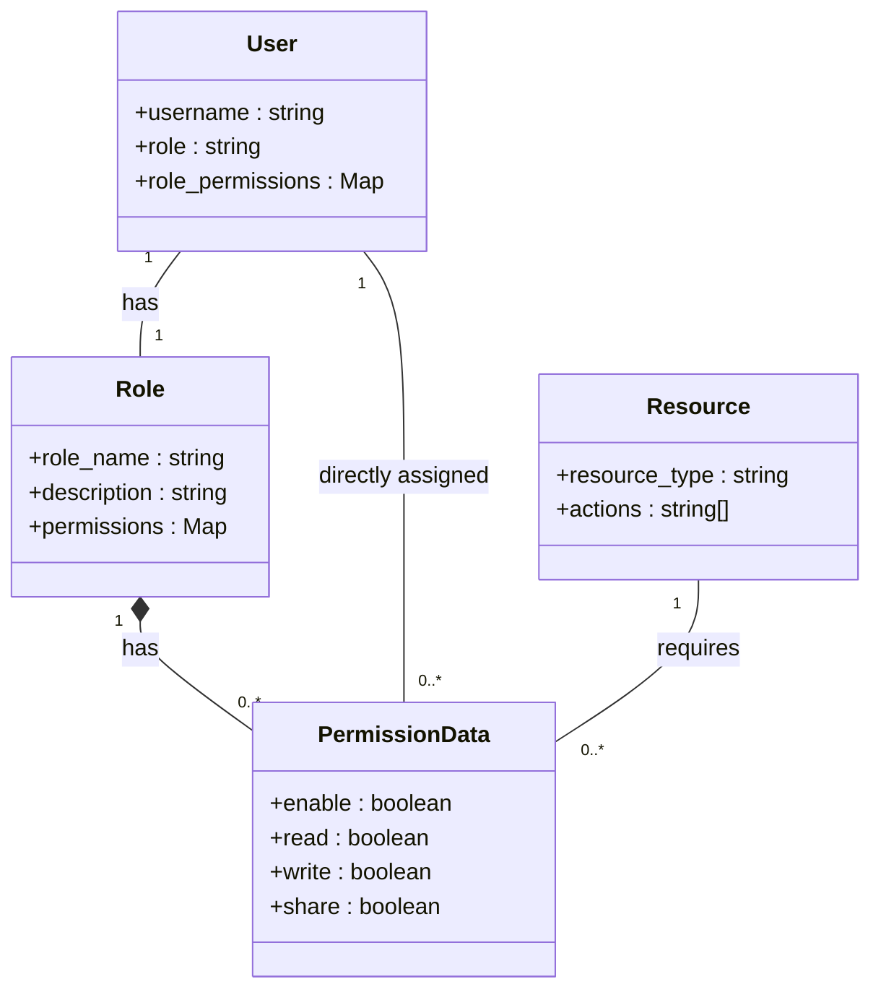

**Diagram sources**
- [admin.service.d.ts](file://web/src/services/admin.service.d.ts#L106-L111)
- [admin-service.ts](file://web/src/services/admin-service.ts#L207-L224)

Permissions are structured with four boolean flags:
- **enable**: Whether the permission is active
- **read**: Whether the user can view the resource
- **write**: Whether the user can modify the resource
- **share**: Whether the user can share the resource with others

### Team-Based Permissions
The system implements team-based permissions through the `TenantPermission` enumeration, which defines two permission levels:

- **ME**: The resource is private to the user who created it
- **TEAM**: The resource is accessible to all members of the user's tenant

The `check_team_permission` module contains functions that verify whether a user has access to a knowledge base or file based on these permission levels:

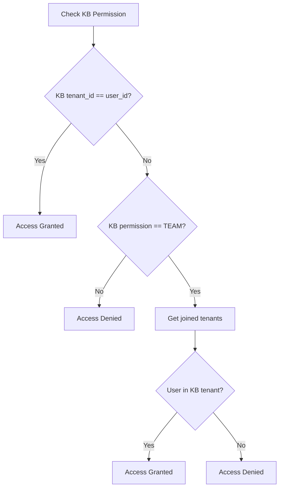

**Diagram sources**
- [check_team_permission.py](file://api/common/check_team_permission.py#L25-L37)

The permission checking process first verifies if the user owns the resource. If not, it checks if the resource has team permission and whether the user is a member of the tenant that owns the resource. This allows for both private and shared resources within the system.

### Permission Assignment
The admin API provides endpoints for managing role permissions:

```mermaid
flowchart TD
A[Get Role Permissions] --> B[GET /api/v1/admin/roles/{role_name}/permission]
C[Assign Permissions] --> D[POST /api/v1/admin/roles/{role_name}/permission]
D[Revoke Permissions] --> E[DELETE /api/v1/admin/roles/{role_name}/permission]
```

**Diagram sources**
- [routes.py](file://admin/server/routes.py#L306-L346)
- [roles.py](file://admin/server/roles.py#L54-L64)

The permission assignment endpoints allow administrators to grant or revoke specific actions on resources for roles. The system is designed to support fine-grained permission control, though the current implementation indicates these features are not yet fully implemented.

**Section sources**
- [check_team_permission.py](file://api/common/check_team_permission.py#L25-L60)
- [routes.py](file://admin/server/routes.py#L306-L346)
- [admin.service.d.ts](file://web/src/services/admin.service.d.ts#L106-L111)

## User Provisioning Workflows

The user provisioning system in RAGFlow supports multiple workflows for adding users to the platform, including direct creation, tenant-based invitation, and third-party authentication.

### Direct User Creation
Administrators can create users directly through the admin interface:

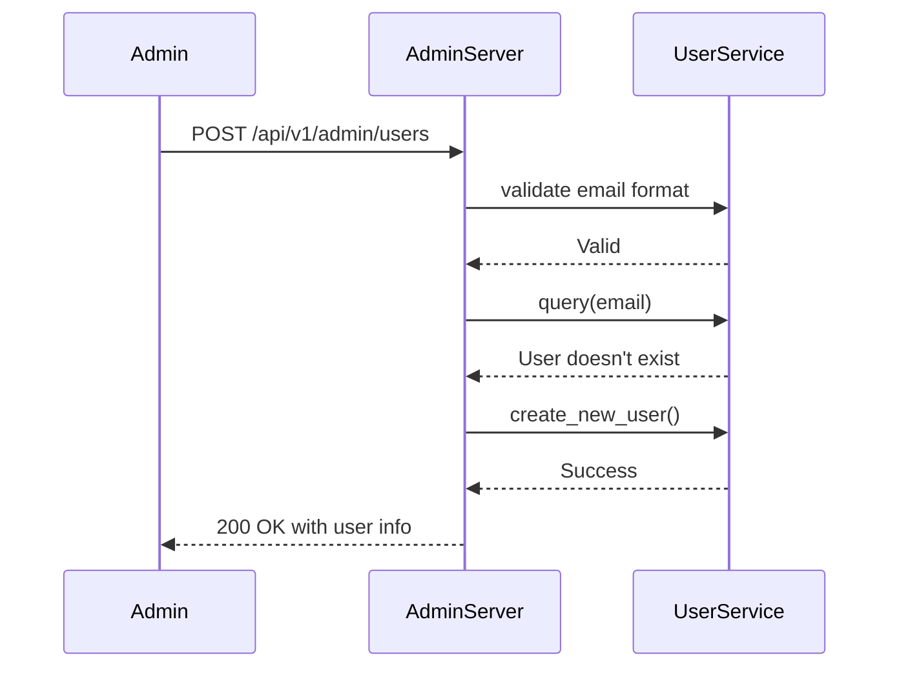

**Diagram sources**
- [routes.py](file://admin/server/routes.py#L76-L96)
- [services.py](file://admin/server/services.py#L68-L84)

The direct creation workflow validates the email address format, checks for existing users with the same email, and creates a new user with a securely hashed password. The new user is assigned a role (defaulting to "user") and is immediately active.

### Tenant Invitation Workflow
The primary user provisioning workflow in RAGFlow is through tenant invitation, which allows existing users to invite others to join their tenant:

```mermaid
flowchart TD
A[Owner invites user] --> B{User exists?}
B --> |No| C[User not found error]
B --> |Yes| D{User in tenant?}
D --> |Yes| E[Already member error]
D --> |No| F[Create UserTenant record]
F --> G[Set role to INVITE]
G --> H[Send invitation email]
H --> I[User receives email]
I --> J[User clicks invitation link]
J --> K[User authenticates]
K --> L[User agrees to join]
L --> M[PUT /agree/{tenant_id}]
M --> N[Update UserTenant role to NORMAL]
N --> O[User gains access]
```

**Diagram sources**
- [tenant_app.py](file://api/apps/tenant_app.py#L58-L101)
- [user_service.py](file://api/db/services/user_service.py#L238-L253)

The tenant invitation workflow begins when a tenant owner invites a user by email. The system verifies that the user exists in the database and is not already a member of the tenant. A UserTenant record is created with the "invite" role, and an invitation email is sent if SMTP is configured. The invited user must authenticate and explicitly agree to join the tenant through the `/agree/{tenant_id}` endpoint, which updates their role to "normal" and grants access to the tenant's resources.

### Third-Party Authentication Provisioning
Users can also be provisioned through third-party authentication providers like GitHub:

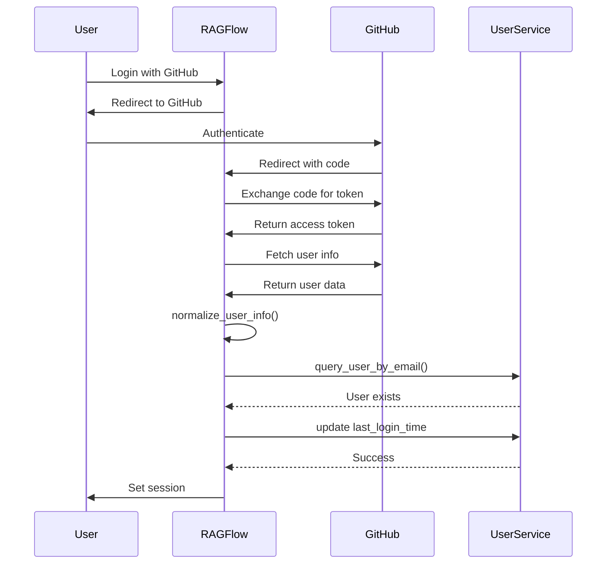

**Diagram sources**
- [github.py](file://api/apps/auth/github.py#L35-L88)
- [oauth.py](file://api/apps/auth/oauth.py#L114-L123)

When a user logs in with a third-party provider for the first time, the system creates a new user record if one doesn't exist. On subsequent logins, the system updates the user's last login time and session information. The user's email address from the third-party provider is used as their identifier within RAGFlow.

**Section sources**
- [tenant_app.py](file://api/apps/tenant_app.py#L48-L101)
- [routes.py](file://admin/server/routes.py#L76-L96)
- [github.py](file://api/apps/auth/github.py#L35-L88)

## User Activity Tracking

RAGFlow includes mechanisms for tracking user activity and system usage, providing insights into platform utilization and user behavior.

### Activity Monitoring
The system tracks various user activities through service endpoints and database records:

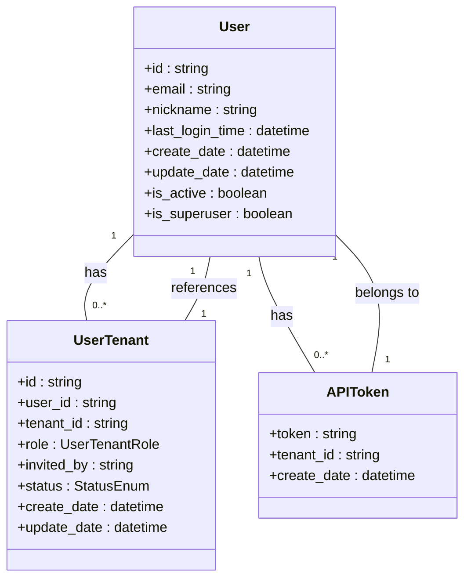

**Diagram sources**
- [db_models.py](file://api/db/db_models.py#L24-L25)
- [user_service.py](file://api/db/services/user_service.py#L33-L42)

Key activity tracking fields include:
- **last_login_time**: Timestamp of the user's most recent login
- **create_date** and **update_date**: Creation and modification timestamps for user records
- **is_active**: Indicates whether the user account is active
- **UserTenant records**: Track user membership in tenants, including invitation and acceptance dates

### System Usage Statistics
The admin interface provides endpoints for retrieving system usage statistics:

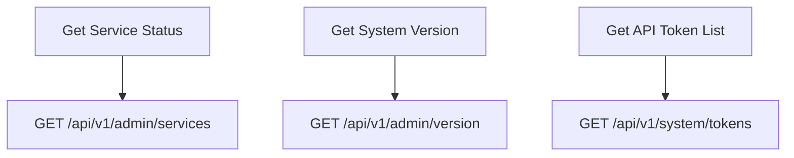

**Diagram sources**
- [routes.py](file://admin/server/routes.py#L198-L229)
- [system_app.py](file://api/apps/system_app.py#L285-L313)

The service status endpoint returns information about all configured services, including their current status. The system version endpoint provides the current RAGFlow version. The API token endpoint allows users to manage their API tokens, which are used for programmatic access to the system.

### Audit Trail
The system maintains an audit trail through database operations and service logs:

```python
# Pseudocode representation of audit trail
def update_user(user_id, user_dict):
    with DB.atomic():
        if user_dict:
            user_dict["update_time"] = current_timestamp()
            user_dict["update_date"] = datetime_format(datetime.now())
            User.update(user_dict).where(User.id == user_id).execute()
```

**Section sources**
- [user_service.py](file://api/db/services/user_service.py#L134-L142)
- [routes.py](file://admin/server/routes.py#L198-L229)

Database updates include timestamps that create a natural audit trail of changes. The system uses atomic transactions to ensure data consistency during updates. Service operations are logged for monitoring and troubleshooting purposes.

## Security Model Integration

The user management system is tightly integrated with RAGFlow's overall security model, providing authentication, authorization, and access control for all system components.

### Authentication Integration
The authentication system is integrated with Flask-Login and uses token-based authentication:

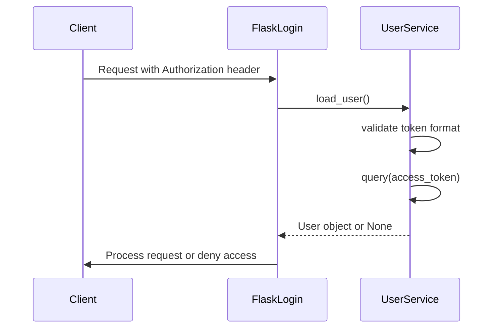

**Diagram sources**
- [auth.py](file://admin/server/auth.py#L38-L68)
- [user_service.py](file://api/db/services/user_service.py#L44-L64)

The `setup_auth` function configures Flask-Login's request loader to validate tokens from the Authorization header. The token validation process checks for proper UUID format, rejects empty or invalid tokens, and queries the database for a matching user. This integration ensures that all authenticated requests are properly validated.

### Role-Based Access Control
The system implements role-based access control through decorators and middleware:

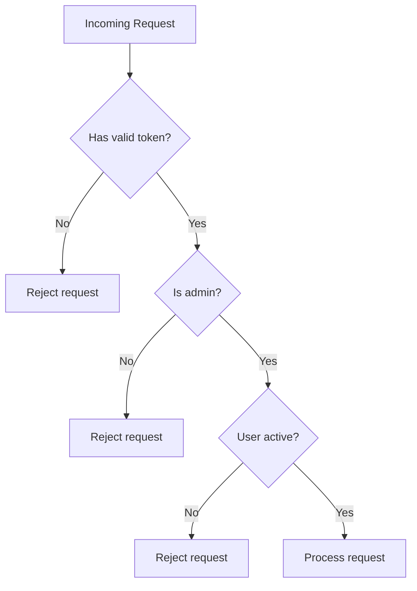

**Diagram sources**
- [auth.py](file://admin/server/auth.py#L92-L105)
- [routes.py](file://admin/server/routes.py#L67-L68)

The `check_admin_auth` decorator verifies that a user is authenticated, is a superuser (admin), and has an active account. This decorator is applied to all admin endpoints to ensure only authorized users can perform administrative operations.

### Tenant Isolation
The security model enforces tenant isolation to prevent unauthorized access to resources:

```python
# Pseudocode representation of tenant isolation
def user_list(tenant_id):
    if current_user.id != tenant_id:
        return "No authorization"
    
    users = UserTenantService.get_by_tenant_id(tenant_id)
    return users
```

**Section sources**
- [auth.py](file://admin/server/auth.py#L38-L105)
- [tenant_app.py](file://api/apps/tenant_app.py#L31-L44)

Tenant isolation is enforced at the API level by verifying that the requesting user has the appropriate permissions for the target tenant. The system uses the UserTenant junction table to manage user membership and roles within tenants, ensuring that users can only access resources within their authorized tenants.

## API Examples

This section provides practical examples of using the RAGFlow user management API for common operations.

### Creating a User
To create a new user through the admin API:

```http
POST /api/v1/admin/users
Content-Type: application/json
Authorization: Bearer <admin_token>

{
  "username": "user@example.com",
  "password": "secure_password",
  "role": "user"
}
```

The response will contain the created user's information (excluding the password):

```json
{
  "code": 0,
  "message": "User created successfully",
  "data": {
    "email": "user@example.com",
    "nickname": "",
    "create_date": "2025-01-01T00:00:00",
    "is_active": true,
    "is_superuser": false
  }
}
```

### Inviting a User to a Tenant
To invite an existing user to join a tenant:

```http
POST /api/v1/tenant/{tenant_id}/user
Content-Type: application/json
Authorization: Bearer <owner_token>

{
  "email": "existing_user@example.com"
}
```

The response will confirm the invitation:

```json
{
  "code": 0,
  "message": "Success",
  "data": {
    "id": "user_id",
    "avatar": "avatar_url",
    "email": "existing_user@example.com",
    "nickname": "Existing User"
  }
}
```

### User Login
To authenticate a user and obtain an access token:

```http
POST /api/v1/admin/login
Content-Type: application/json

{
  "email": "user@example.com",
  "password": "user_password"
}
```

The response will include the authentication token:

```json
{
  "code": 0,
  "message": "Welcome back!",
  "data": {
    "email": "user@example.com",
    "nickname": "User",
    "last_login_time": "2025-01-01T00:00:00",
    "is_active": true,
    "is_superuser": false,
    "create_date": "2025-01-01T00:00:00"
  },
  "auth": "generated_uuid_token"
}
```

The returned token should be included in the Authorization header for subsequent requests.

**Section sources**
- [routes.py](file://admin/server/routes.py#L32-L117)
- [tenant_app.py](file://api/apps/tenant_app.py#L48-L101)
- [user_app.py](file://api/apps/user_app.py#L486-L505)