# Backend Architecture

<cite>
**Referenced Files in This Document**
- [api/ragflow_server.py](file://api/ragflow_server.py)
- [api/settings.py](file://api/settings.py)
- [api/db/__init__.py](file://api/db/__init__.py)
- [api/db/services/document_service.py](file://api/db/services/document_service.py)
- [api/db/services/common_service.py](file://api/db/services/common_service.py)
- [api/db/services/task_service.py](file://api/db/services/task_service.py)
- [api/db/db_models.py](file://api/db/db_models.py)
- [api/apps/__init__.py](file://api/apps/__init__.py)
- [api/apps/api_app.py](file://api/apps/api_app.py)
- [api/apps/kb_app.py](file://api/apps/kb_app.py)
- [admin/server/admin_server.py](file://admin/server/admin_server.py)
- [admin/server/routes.py](file://admin/server/routes.py)
- [common/settings.py](file://common/settings.py)
- [common/log_utils.py](file://common/log_utils.py)
- [rag/utils/redis_conn.py](file://rag/utils/redis_conn.py)
- [docker/docker-compose.yml](file://docker/docker-compose.yml)
</cite>

## Table of Contents
1. [Introduction](#introduction)
2. [System Overview](#system-overview)
3. [Technology Stack](#technology-stack)
4. [Architecture Components](#architecture-components)
5. [Service Pattern Implementation](#service-pattern-implementation)
6. [Database Layer Architecture](#database-layer-architecture)
7. [API Gateway and Routing](#api-gateway-and-routing)
8. [Event-Driven Architecture](#event-driven-architecture)
9. [Authentication and Authorization](#authentication-and-authorization)
10. [Configuration Management](#configuration-management)
11. [Logging and Monitoring](#logging-and-monitoring)
12. [Deployment Topology](#deployment-topology)
13. [Performance Optimization](#performance-optimization)
14. [Cross-Cutting Concerns](#cross-cutting-concerns)
15. [Development Workflow](#development-workflow)

## Introduction

RAGFlow is a sophisticated Retrieval-Augmented Generation (RAG) platform built on a Flask-based microservices architecture. The backend implements a modern service-oriented architecture with clear separation of concerns, robust database operations, and event-driven processing capabilities. The system is designed to handle large-scale document processing, knowledge base management, and AI-powered content generation while maintaining high availability and scalability.

The backend architecture emphasizes modularity, extensibility, and maintainability through well-defined service boundaries, dependency injection patterns, and comprehensive error handling mechanisms. It supports multiple deployment scenarios from single-instance setups to distributed cloud deployments.

## System Overview

RAGFlow's backend follows a layered architecture pattern with distinct service layers, each responsible for specific functional domains:

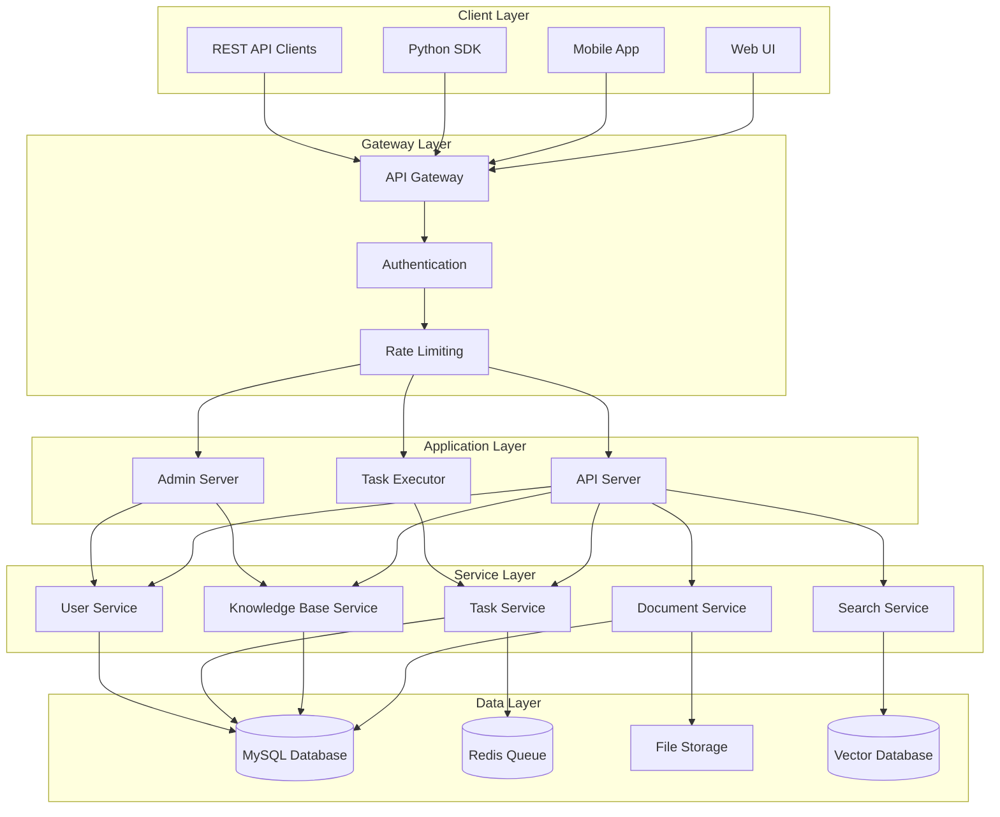

**Diagram sources**
- [api/ragflow_server.py](file://api/ragflow_server.py#L33-L40)
- [admin/server/admin_server.py](file://admin/server/admin_server.py#L51-L58)
- [api/apps/__init__.py](file://api/apps/__init__.py#L43-L46)

**Section sources**
- [api/ragflow_server.py](file://api/ragflow_server.py#L1-L167)
- [admin/server/admin_server.py](file://admin/server/admin_server.py#L1-L83)

## Technology Stack

RAGFlow's backend leverages a modern Python-based technology stack optimized for performance, scalability, and maintainability:

### Core Technologies
- **Flask Framework**: Microservices framework providing RESTful API capabilities
- **Quart**: Asynchronous web framework for improved concurrency
- **Peewee ORM**: Lightweight ORM for database operations with connection pooling
- **Valkey/Redis**: Message queue and caching system for task distribution
- **MySQL/PostgreSQL**: Primary relational database for persistent storage
- **Asyncio**: Asynchronous programming model for I/O intensive operations

### Third-Party Dependencies
- **Flask-Login**: User session management and authentication
- **Flask-Mail**: Email notification system
- **Flasgger**: API documentation generation
- **Quart-Auth**: Authentication for asynchronous applications
- **Tenacity**: Retry mechanisms for resilient operations
- **Pydantic**: Data validation and serialization

### Infrastructure Components
- **Docker**: Containerization for consistent deployment
- **Nginx**: Reverse proxy and load balancing
- **Prometheus/Grafana**: Monitoring and observability
- **Valkey**: High-performance in-memory data store

**Section sources**
- [common/settings.py](file://common/settings.py#L1-L340)
- [docker/docker-compose.yml](file://docker/docker-compose.yml#L1-L135)

## Architecture Components

### API Server Architecture

The API server serves as the primary entry point for all client interactions, implementing a modular blueprint-based architecture:

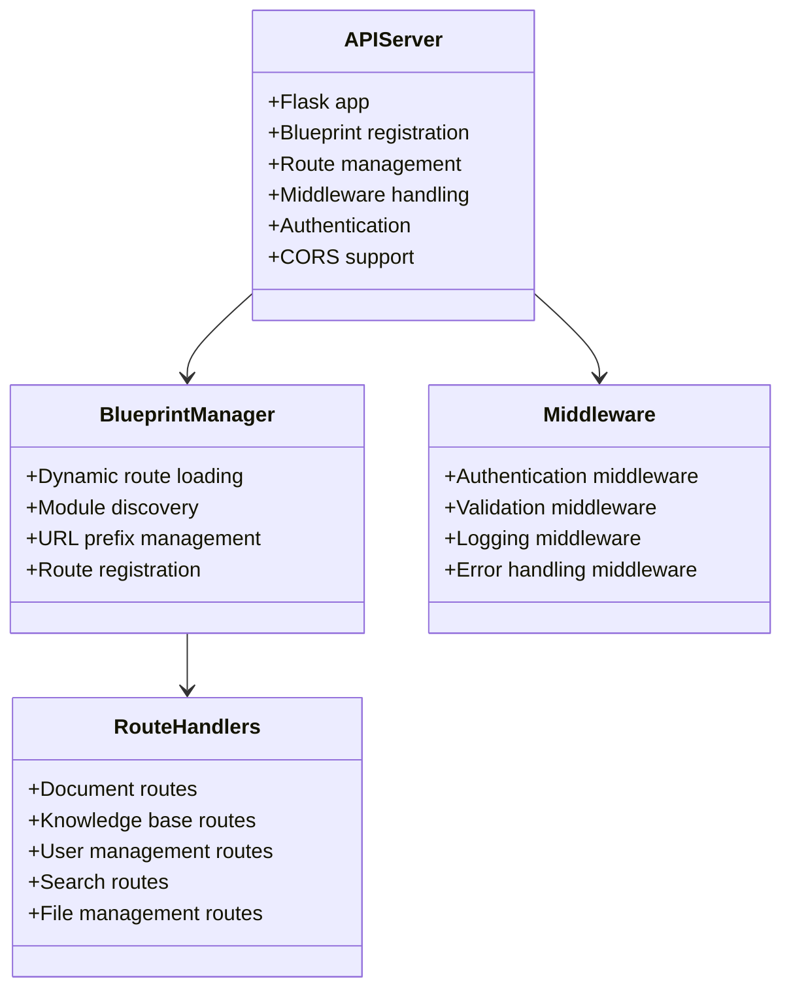

**Diagram sources**
- [api/apps/__init__.py](file://api/apps/__init__.py#L244-L265)
- [api/apps/api_app.py](file://api/apps/api_app.py#L1-L118)
- [api/apps/kb_app.py](file://api/apps/kb_app.py#L1-L800)

### Admin Server Architecture

The admin server provides centralized management capabilities with dedicated administrative functions:

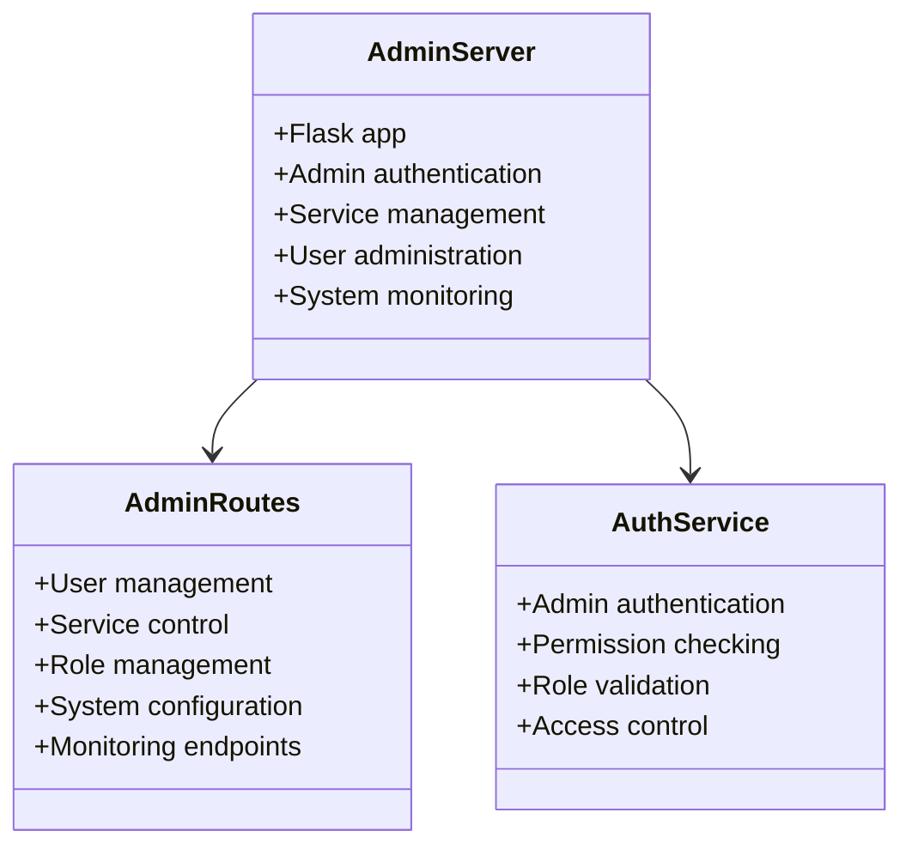

**Diagram sources**
- [admin/server/admin_server.py](file://admin/server/admin_server.py#L51-L58)
- [admin/server/routes.py](file://admin/server/routes.py#L1-L383)

**Section sources**
- [api/apps/__init__.py](file://api/apps/__init__.py#L1-L284)
- [admin/server/admin_server.py](file://admin/server/admin_server.py#L1-L83)

## Service Pattern Implementation

RAGFlow implements a comprehensive service pattern that provides consistent data access and business logic encapsulation across all backend modules.

### Common Service Base Class

The `CommonService` class serves as the foundation for all service implementations, providing standardized CRUD operations:

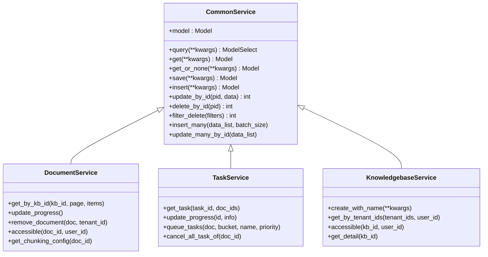

**Diagram sources**
- [api/db/services/common_service.py](file://api/db/services/common_service.py#L37-L347)
- [api/db/services/document_service.py](file://api/db/services/document_service.py#L45-L800)
- [api/db/services/task_service.py](file://api/db/services/task_service.py#L57-L524)

### Service Implementation Patterns

Each service implements specific business logic while inheriting common database operations:

#### Document Service Features
- Document lifecycle management
- Progress tracking and status updates
- Access control and permissions
- Chunk management and metadata handling
- Storage integration for file operations

#### Task Service Capabilities
- Asynchronous task queuing
- Progress monitoring and reporting
- Retry mechanisms with exponential backoff
- Resource allocation and priority handling
- Cancellation and cleanup operations

**Section sources**
- [api/db/services/common_service.py](file://api/db/services/common_service.py#L1-L347)
- [api/db/services/document_service.py](file://api/db/services/document_service.py#L1-L800)
- [api/db/services/task_service.py](file://api/db/services/task_service.py#L1-L524)

## Database Layer Architecture

RAGFlow implements a robust database layer with connection pooling, transaction management, and retry mechanisms for reliability.

### Database Connection Management

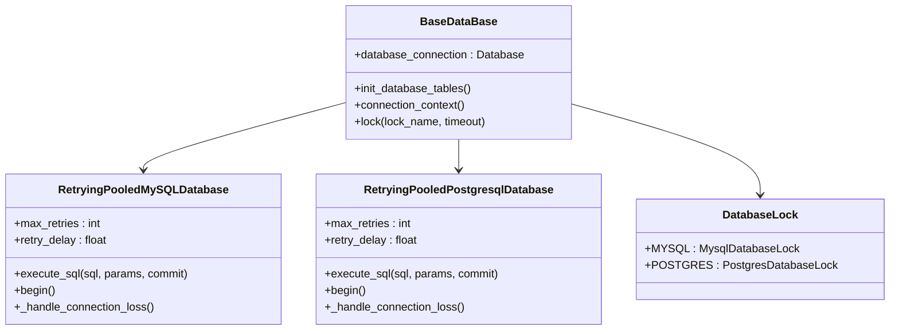

**Diagram sources**
- [api/db/db_models.py](file://api/db/db_models.py#L388-L548)

### Data Models and Relationships

The database schema supports complex relationships between documents, knowledge bases, users, and processing tasks:

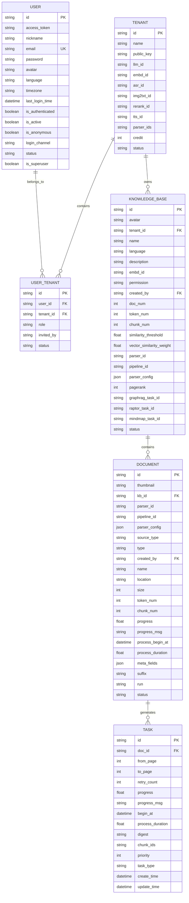

**Diagram sources**
- [api/db/db_models.py](file://api/db/db_models.py#L598-L1297)

### Database Operations and Transactions

The database layer implements sophisticated retry mechanisms and connection management:

#### Connection Pooling Strategy
- Automatic connection recovery with exponential backoff
- Transaction isolation with retry logic
- Deadlock detection and resolution
- Connection health monitoring

#### Data Serialization
- JSON field support for complex configurations
- Pickle serialization for binary data
- Custom field types for specific data requirements

**Section sources**
- [api/db/db_models.py](file://api/db/db_models.py#L1-L800)
- [api/db/services/common_service.py](file://api/db/services/common_service.py#L25-L347)

## API Gateway and Routing

RAGFlow implements a sophisticated routing system that dynamically loads and registers API endpoints based on the application structure.

### Dynamic Route Registration

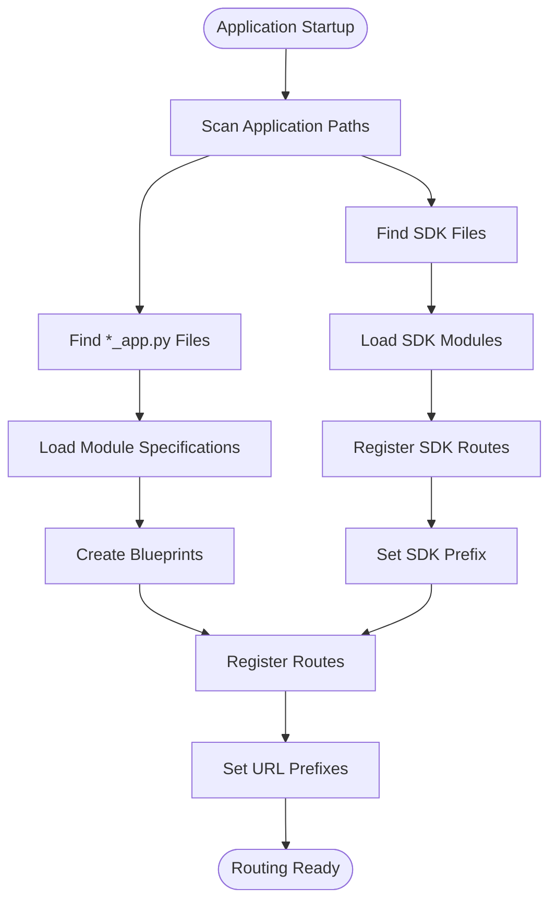

**Diagram sources**
- [api/apps/__init__.py](file://api/apps/__init__.py#L233-L265)

### Route Organization and Security

The routing system implements comprehensive security measures:

#### Authentication Middleware
- JWT token validation
- API key authentication
- Session-based authentication
- Permission-based access control

#### Request Validation
- Input sanitization and validation
- Content type checking
- Size limits and rate limiting
- CORS policy enforcement

**Section sources**
- [api/apps/__init__.py](file://api/apps/__init__.py#L1-L284)
- [api/apps/api_app.py](file://api/apps/api_app.py#L1-L118)

## Event-Driven Architecture

RAGFlow employs a Redis-based message queue system for asynchronous task processing and event coordination.

### Message Queue Architecture

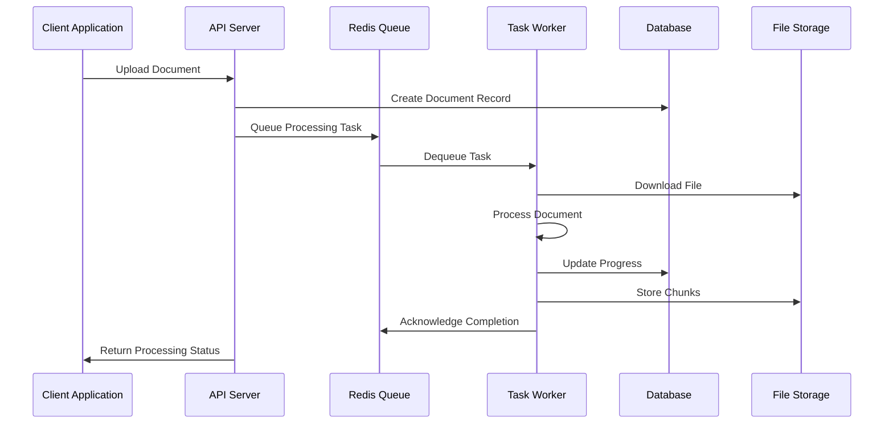

**Diagram sources**
- [rag/utils/redis_conn.py](file://rag/utils/redis_conn.py#L245-L303)
- [api/db/services/task_service.py](file://api/db/services/task_service.py#L326-L430)

### Task Processing Pipeline

The task system implements a sophisticated pipeline for document processing:

#### Task Types and Priorities
- **High Priority**: Real-time processing tasks
- **Normal Priority**: Standard document processing
- **Background Priority**: Batch operations and maintenance

#### Task Lifecycle Management
- Task queuing with priority handling
- Progress tracking and reporting
- Retry mechanisms with exponential backoff
- Cancellation and cleanup procedures

**Section sources**
- [rag/utils/redis_conn.py](file://rag/utils/redis_conn.py#L1-L412)
- [api/db/services/task_service.py](file://api/db/services/task_service.py#L1-L524)

## Authentication and Authorization

RAGFlow implements a multi-layered authentication and authorization system supporting various authentication methods and granular permission controls.

### Authentication Systems

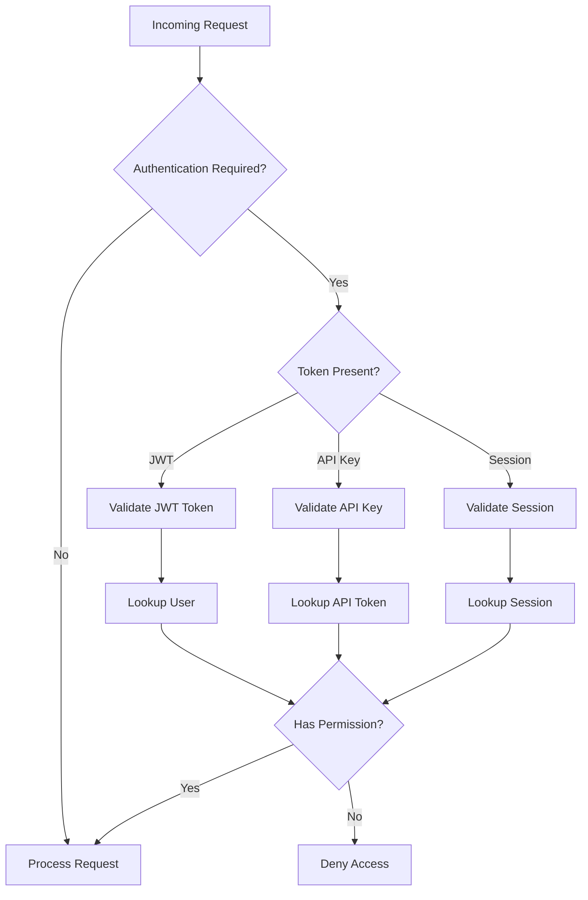

**Diagram sources**
- [api/apps/__init__.py](file://api/apps/__init__.py#L108-L142)
- [admin/server/auth.py](file://admin/server/auth.py#L38-L66)

### Permission Management

The system implements role-based access control (RBAC) with tenant isolation:

#### User Roles and Permissions
- **Owner**: Full administrative control
- **Admin**: Administrative privileges within tenant
- **Normal**: Standard user permissions
- **Invite**: Limited access for invited users

#### Tenant Isolation
- Multi-tenant architecture with data segregation
- Cross-tenant access restrictions
- Permission inheritance and delegation

**Section sources**
- [api/apps/__init__.py](file://api/apps/__init__.py#L147-L207)
- [admin/server/auth.py](file://admin/server/auth.py#L1-L66)

## Configuration Management

RAGFlow implements a comprehensive configuration management system supporting multiple environments and runtime customization.

### Configuration Architecture

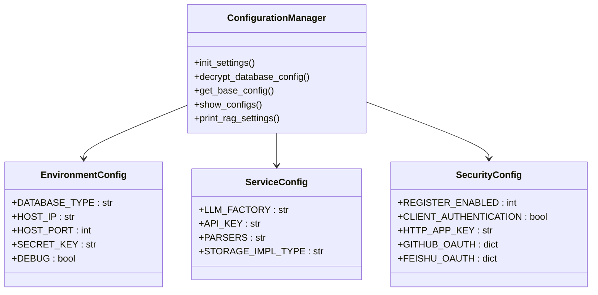

**Diagram sources**
- [common/settings.py](file://common/settings.py#L162-L339)

### Configuration Sources

The system supports multiple configuration sources with precedence:

1. **Environment Variables**: Runtime overrides
2. **Configuration Files**: YAML and JSON files
3. **Database Settings**: Persistent configuration storage
4. **Default Values**: Built-in fallbacks

**Section sources**
- [common/settings.py](file://common/settings.py#L1-L340)

## Logging and Monitoring

RAGFlow implements comprehensive logging and monitoring capabilities for operational visibility and troubleshooting.

### Logging Architecture

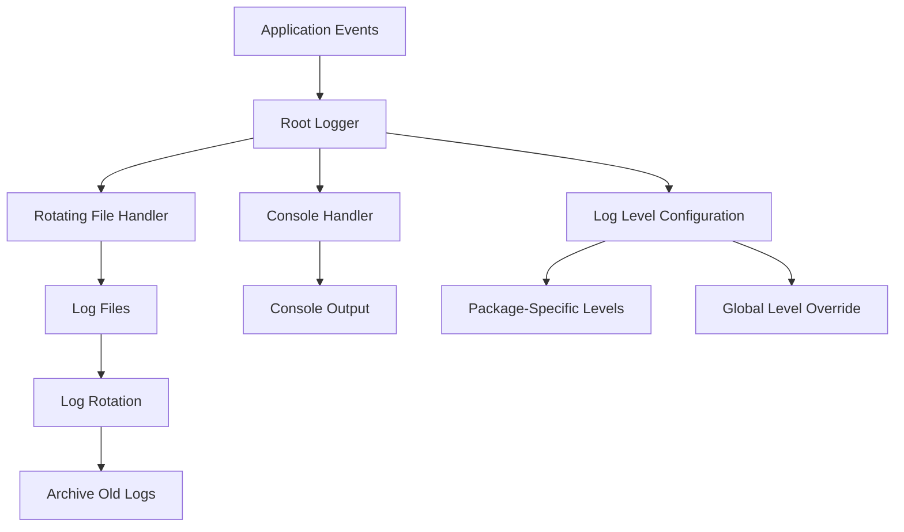

**Diagram sources**
- [common/log_utils.py](file://common/log_utils.py#L25-L84)

### Monitoring and Metrics

The system provides extensive monitoring capabilities:

#### Health Checks
- Database connectivity monitoring
- Redis queue health verification
- External service availability checks
- Resource utilization tracking

#### Performance Metrics
- Request latency tracking
- Database query performance
- Task processing throughput
- Memory and CPU utilization

**Section sources**
- [common/log_utils.py](file://common/log_utils.py#L1-L84)

## Deployment Topology

RAGFlow supports multiple deployment scenarios optimized for different use cases and scale requirements.

### Single-Instance Deployment

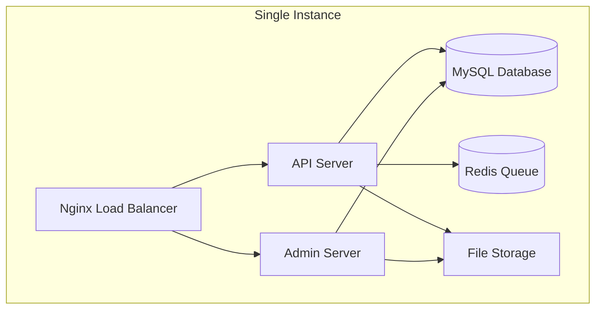

### Distributed Deployment

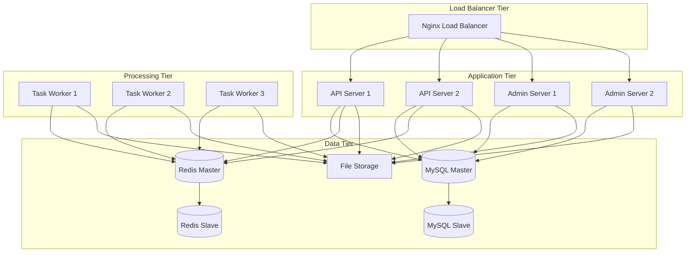

### Container Orchestration

The system supports Kubernetes deployment with horizontal pod autoscaling:

#### Kubernetes Resources
- Deployments for stateless services
- StatefulSets for databases
- Services for internal communication
- ConfigMaps for configuration management
- Secrets for sensitive data

**Section sources**
- [docker/docker-compose.yml](file://docker/docker-compose.yml#L1-L135)

## Performance Optimization

RAGFlow implements several performance optimization strategies to handle high-throughput document processing and concurrent user requests.

### Database Optimization

#### Connection Pooling
- Automatic connection management
- Health check and recovery mechanisms
- Configurable pool sizes based on workload

#### Query Optimization
- Indexing strategies for frequently queried fields
- Batch operations for bulk data processing
- Connection context management for transaction isolation

### Caching Strategies

#### Redis Integration
- Session storage and caching
- Task queue management
- Temporary data storage
- Distributed locks for synchronization

#### Application-Level Caching
- Model instance caching
- Query result caching
- Computed value caching

### Asynchronous Processing

#### Task Queuing
- Priority-based task scheduling
- Parallel processing capabilities
- Retry mechanisms with exponential backoff
- Progress tracking and reporting

**Section sources**
- [api/db/db_models.py](file://api/db/db_models.py#L242-L375)
- [rag/utils/redis_conn.py](file://rag/utils/redis_conn.py#L60-L412)

## Cross-Cutting Concerns

RAGFlow addresses several cross-cutting concerns through well-designed architectural patterns and implementation strategies.

### Error Handling and Resilience

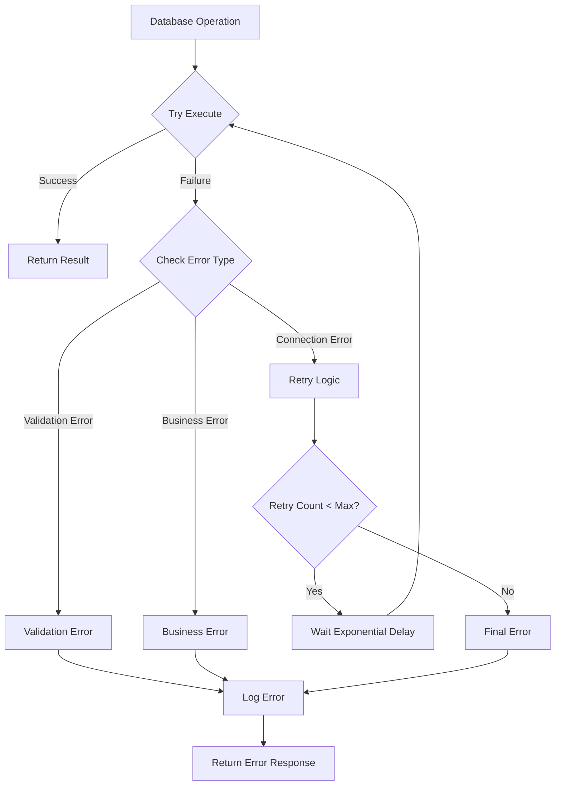

### Security Measures

#### Data Protection
- Encryption at rest and in transit
- Secure credential management
- Audit logging for sensitive operations
- Input validation and sanitization

#### Access Control
- Multi-factor authentication support
- Role-based permissions
- Tenant isolation
- API rate limiting

### Scalability Considerations

#### Horizontal Scaling
- Stateless service design
- Shared database architecture
- Load balancer integration
- Auto-scaling policies

#### Vertical Scaling
- Resource monitoring and alerting
- Performance tuning guidelines
- Capacity planning strategies

## Development Workflow

RAGFlow follows modern development practices emphasizing quality, maintainability, and collaboration.

### Code Organization Principles

#### Modular Design
- Clear separation of concerns
- Well-defined service boundaries
- Dependency injection patterns
- Interface-based programming

#### Testing Strategy
- Unit testing for individual components
- Integration testing for service interactions
- End-to-end testing for complete workflows
- Performance testing for scalability validation

### Continuous Integration

#### Automated Testing Pipeline
- Code quality checks
- Unit test execution
- Integration test automation
- Security vulnerability scanning

#### Deployment Automation
- Container image building
- Environment-specific configuration
- Rolling deployment strategies
- Health check validation

### Development Guidelines

#### Code Standards
- Consistent naming conventions
- Comprehensive documentation
- Error handling patterns
- Performance considerations

#### Best Practices
- Defensive programming techniques
- Resource cleanup and disposal
- Logging and monitoring integration
- Configuration management

**Section sources**
- [api/ragflow_server.py](file://api/ragflow_server.py#L1-L167)
- [common/settings.py](file://common/settings.py#L1-L340)