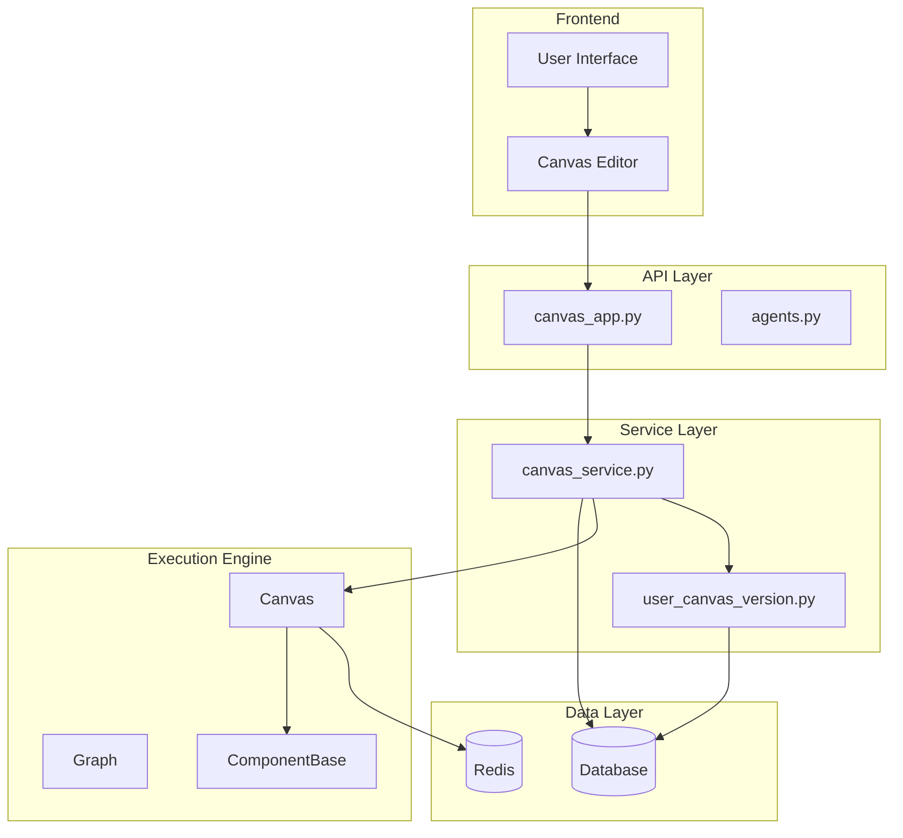
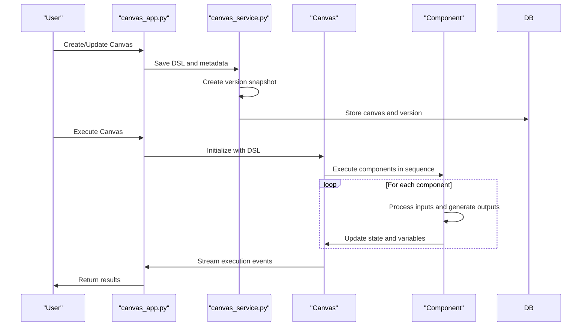
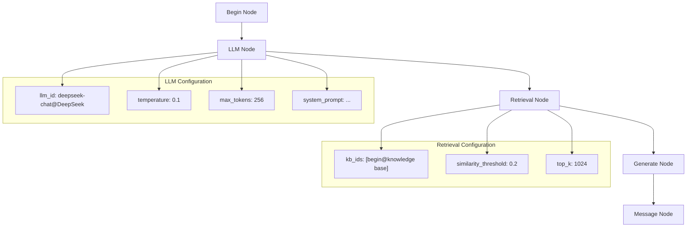
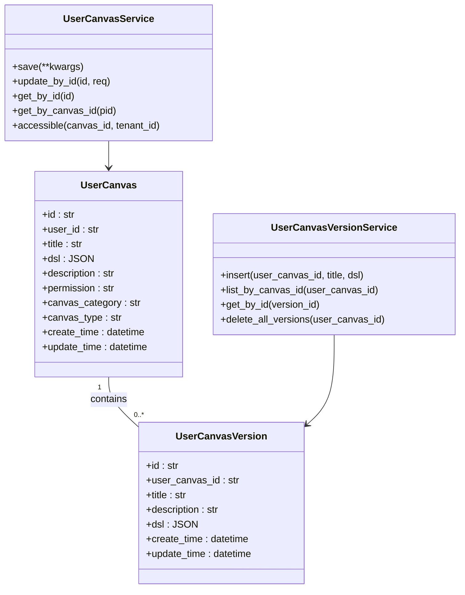
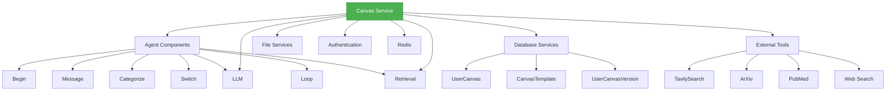

# Canvas Service

<cite>
**Referenced Files in This Document**   
- [canvas.py](file://agent/canvas.py)
- [canvas_app.py](file://api/apps/canvas_app.py)
- [canvas_service.py](file://api/db/services/canvas_service.py)
- [user_canvas_version.py](file://api/db/services/user_canvas_version.py)
- [db_models.py](file://api/db/db_models.py)
- [base.py](file://agent/component/base.py)
</cite>

## Table of Contents
1. [Introduction](#introduction)
2. [Architecture Overview](#architecture-overview)
3. [Core Components](#core-components)
4. [Agent Workflow Management](#agent-workflow-management)
5. [Node Configuration and Execution](#node-configuration-and-execution)
6. [Version Control System](#version-control-system)
7. [Service Interfaces and Usage Patterns](#service-interfaces-and-usage-patterns)
8. [Relationships with Other Components](#relationships-with-other-components)
9. [Common Issues and Solutions](#common-issues-and-solutions)
10. [Conclusion](#conclusion)

## Introduction
The Canvas Service is a core component of the RAGFlow system that enables the creation and execution of complex agent workflows through a visual programming interface. It provides a comprehensive framework for orchestrating multi-step processes that combine various AI components, tools, and data sources to accomplish sophisticated tasks. The service supports both simple conversational agents and complex multi-agent systems that can perform deep research, data analysis, and decision-making processes.

The Canvas Service operates by interpreting a Domain-Specific Language (DSL) that defines the structure and behavior of agent workflows. These workflows consist of interconnected nodes representing different components such as LLMs, retrieval systems, conditional logic, and data processing tools. The service manages the execution flow, handles variable passing between components, maintains state across interactions, and provides version control for workflow evolution.

This documentation provides a comprehensive overview of the Canvas Service implementation, detailing its architecture, core components, workflow management capabilities, and integration patterns within the broader agent orchestration system.

## Architecture Overview



**Diagram sources**
- [canvas_app.py](file://api/apps/canvas_app.py#L1-L545)
- [canvas_service.py](file://api/db/services/canvas_service.py#L1-L353)
- [user_canvas_version.py](file://api/db/services/user_canvas_version.py#L1-L62)
- [canvas.py](file://agent/canvas.py#L1-L793)
- [base.py](file://agent/component/base.py#L1-L583)

**Section sources**
- [canvas_app.py](file://api/apps/canvas_app.py#L1-L545)
- [canvas_service.py](file://api/db/services/canvas_service.py#L1-L353)

## Core Components

The Canvas Service is built around several key components that work together to enable agent workflow creation and execution. At the heart of the system is the Canvas class, which extends the Graph class to provide specialized functionality for agent orchestration. The Canvas class manages the execution state, handles variable passing between components, and maintains conversation history and retrieval context.

The service integrates with a comprehensive component system that includes various building blocks for agent workflows, such as Begin, LLM, Retrieval, Message, Categorize, Switch, and Loop components. Each component is implemented as a separate class that inherits from the ComponentBase class, providing a consistent interface for configuration, execution, and state management.

The Canvas Service also includes a version control system that automatically tracks changes to agent workflows, allowing users to revert to previous versions and maintain a history of workflow evolution. This is implemented through the UserCanvasVersion model and associated service, which stores snapshots of workflow configurations at different points in time.

**Section sources**
- [canvas.py](file://agent/canvas.py#L1-L793)
- [base.py](file://agent/component/base.py#L1-L583)
- [db_models.py](file://api/db/db_models.py#L927-L956)

## Agent Workflow Management

The Canvas Service provides sophisticated workflow management capabilities that enable the creation of complex agent behaviors. Workflows are defined using a visual programming interface where users connect different components to create a directed graph of execution. The service manages the execution flow through the `path` attribute in the Canvas class, which maintains the current execution sequence of components.

The workflow execution follows a step-by-step process where each component is invoked in sequence, with the output of one component potentially serving as input to subsequent components. The service handles branching logic through components like Categorize and Switch, which can dynamically alter the execution path based on runtime conditions. For example, the Categorize component can classify input into different categories and route the workflow to different branches accordingly.



**Diagram sources**
- [canvas.py](file://agent/canvas.py#L363-L631)
- [canvas_app.py](file://api/apps/canvas_app.py#L125-L179)
- [canvas_service.py](file://api/db/services/canvas_service.py#L180-L238)

**Section sources**
- [canvas.py](file://agent/canvas.py#L363-L631)
- [canvas_app.py](file://api/apps/canvas_app.py#L125-L179)

## Node Configuration and Execution

The Canvas Service supports a rich set of node types that can be configured and connected to create sophisticated agent workflows. Each node represents a specific functionality and exposes configurable parameters through its parameter class. The base ComponentParamBase class provides common functionality for parameter validation, type checking, and value constraints, ensuring that node configurations are valid before execution.

Nodes are configured through a JSON-based DSL that defines their properties and connections. The DSL includes a `components` section that specifies each node's configuration, including its component name, parameters, and connection metadata. For example, an LLM node might be configured with parameters for the specific language model to use, temperature settings, and prompt templates, while a Retrieval node would specify knowledge base IDs and similarity thresholds.



**Diagram sources**
- [canvas.py](file://agent/canvas.py#L81-L149)
- [base.py](file://agent/component/base.py#L37-L382)
- [deep_research.json](file://agent/templates/deep_research.json#L1-L854)

**Section sources**
- [canvas.py](file://agent/canvas.py#L81-L149)
- [base.py](file://agent/component/base.py#L37-L382)

## Version Control System

The Canvas Service includes a comprehensive version control system that automatically tracks changes to agent workflows. Whenever a canvas is updated, a new version snapshot is created and stored in the database, preserving the complete workflow configuration at that point in time. This enables users to maintain a history of workflow evolution, compare different versions, and revert to previous configurations if needed.

The version control system is implemented through the UserCanvasVersion model, which stores the DSL, title, and metadata for each version of a canvas. The UserCanvasVersionService provides methods for listing versions by canvas ID, retrieving specific versions, and managing version history. To prevent database bloat, the system automatically deletes older versions when more than 20 versions exist for a single canvas, keeping only the most recent versions.



**Diagram sources**
- [db_models.py](file://api/db/db_models.py#L948-L956)
- [user_canvas_version.py](file://api/db/services/user_canvas_version.py#L1-L62)
- [canvas_app.py](file://api/apps/canvas_app.py#L66-L91)

**Section sources**
- [db_models.py](file://api/db/db_models.py#L948-L956)
- [user_canvas_version.py](file://api/db/services/user_canvas_version.py#L1-L62)

## Service Interfaces and Usage Patterns

The Canvas Service exposes a comprehensive set of interfaces for creating, managing, and executing agent workflows. These interfaces are available through both HTTP API endpoints and Python SDK methods, providing flexibility for different integration scenarios. The primary operations include creating and updating canvases, executing workflows, managing versions, and retrieving execution results.

The service follows a pattern of separating canvas definition from execution state. The canvas definition (DSL) is stored in the database and represents the static structure of the workflow, while execution state is maintained in memory during runtime and includes variables, conversation history, and retrieval context. This separation allows the same canvas to be executed multiple times with different inputs and maintain independent state for each execution.

```mermaid
flowchart TD
A[Client Application] --> B[HTTP API or SDK]
B --> C{Operation Type}
C --> D[Create Canvas]
C --> E[Update Canvas]
C --> F[Execute Canvas]
C --> G[List Canvases]
C --> H[Get Canvas]
C --> I[Delete Canvas]
C --> J[Manage Versions]
D --> K[canvas_service.save()]
E --> L[canvas_service.update_by_id()]
F --> M[canvas.run()]
G --> N[canvas_service.get_list()]
H --> O[canvas_service.get_by_id()]
I --> P[canvas_service.delete_by_id()]
J --> Q[version_service.list_by_canvas_id()]
K --> R[Database]
L --> R
M --> S[Execution Engine]
N --> R
O --> R
P --> R
Q --> R
```

**Diagram sources**
- [canvas_app.py](file://api/apps/canvas_app.py#L46-L538)
- [canvas_service.py](file://api/db/services/canvas_service.py#L41-L240)
- [canvas.py](file://agent/canvas.py#L363-L631)

**Section sources**
- [canvas_app.py](file://api/apps/canvas_app.py#L46-L538)
- [canvas_service.py](file://api/db/services/canvas_service.py#L41-L240)

## Relationships with Other Components

The Canvas Service integrates closely with several other components in the RAGFlow system to provide a comprehensive agent orchestration platform. It relies on the agent component system for the building blocks of workflows, uses the database services for persistence, and leverages external tools for specialized functionality.

The service has a particularly strong relationship with the LLM system, as many canvas workflows center around language model interactions. It also integrates with retrieval systems to access knowledge bases, with file services for handling document processing, and with authentication services to manage access control. The canvas execution engine uses Redis for real-time communication and state management, enabling features like streaming responses and task cancellation.



**Diagram sources**
- [canvas.py](file://agent/canvas.py#L29-L38)
- [canvas_service.py](file://api/db/services/canvas_service.py#L21-L25)
- [canvas_app.py](file://api/apps/canvas_app.py#L21-L37)

**Section sources**
- [canvas.py](file://agent/canvas.py#L29-L38)
- [canvas_service.py](file://api/db/services/canvas_service.py#L21-L25)

## Common Issues and Solutions

The Canvas Service addresses several common challenges in agent workflow management through its design and implementation. One frequent issue is maintaining workflow consistency across executions, which is solved through the use of the `reset()` method that clears component state and restores initial conditions. This ensures that each execution starts with a clean slate, preventing state leakage between sessions.

Another common issue is handling errors and exceptions during workflow execution. The service provides robust error handling through the exception_handler mechanism, which allows components to define custom error recovery strategies. Components can specify alternative execution paths (goto) or default values to return when errors occur, enabling graceful degradation rather than complete failure.

Workflow versioning presents challenges in terms of storage and performance, which are addressed through the automatic cleanup of older versions. By limiting the number of stored versions to 20 per canvas, the system maintains a useful history while preventing database bloat. The versioning system also supports meaningful titles that include timestamps, making it easier to identify and select specific versions.

For complex workflows with many interconnected components, debugging can be challenging. The service addresses this through detailed logging and tracing capabilities, including the ability to debug individual components in isolation. The input_form endpoint allows clients to retrieve the configuration interface for specific components, facilitating dynamic form generation in user interfaces.

**Section sources**
- [canvas.py](file://agent/canvas.py#L131-L139)
- [canvas.py](file://agent/canvas.py#L542-L552)
- [user_canvas_version.py](file://api/db/services/user_canvas_version.py#L47-L57)
- [canvas_app.py](file://api/apps/canvas_app.py#L258-L276)

## Conclusion

The Canvas Service provides a powerful and flexible framework for creating and managing agent workflows in the RAGFlow system. Its visual programming interface, combined with a robust execution engine and comprehensive version control, enables users to build sophisticated AI applications without requiring extensive programming knowledge.

The service's architecture balances flexibility with reliability, allowing for complex workflows while providing mechanisms to ensure consistency, handle errors gracefully, and maintain a history of changes. Its integration with other system components creates a cohesive platform for agent development and deployment, supporting use cases ranging from simple conversational agents to complex multi-agent research systems.

By providing both HTTP API and SDK interfaces, the Canvas Service accommodates different integration scenarios, from web-based user interfaces to programmatic workflow creation and execution. The combination of a rich component library, powerful variable system, and execution control mechanisms makes it a versatile tool for building intelligent applications that can adapt to diverse requirements and use cases.