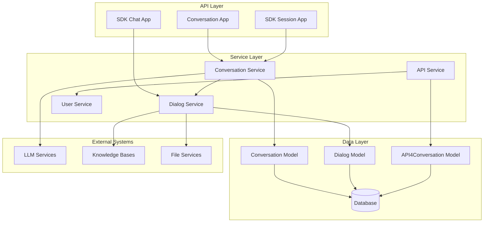
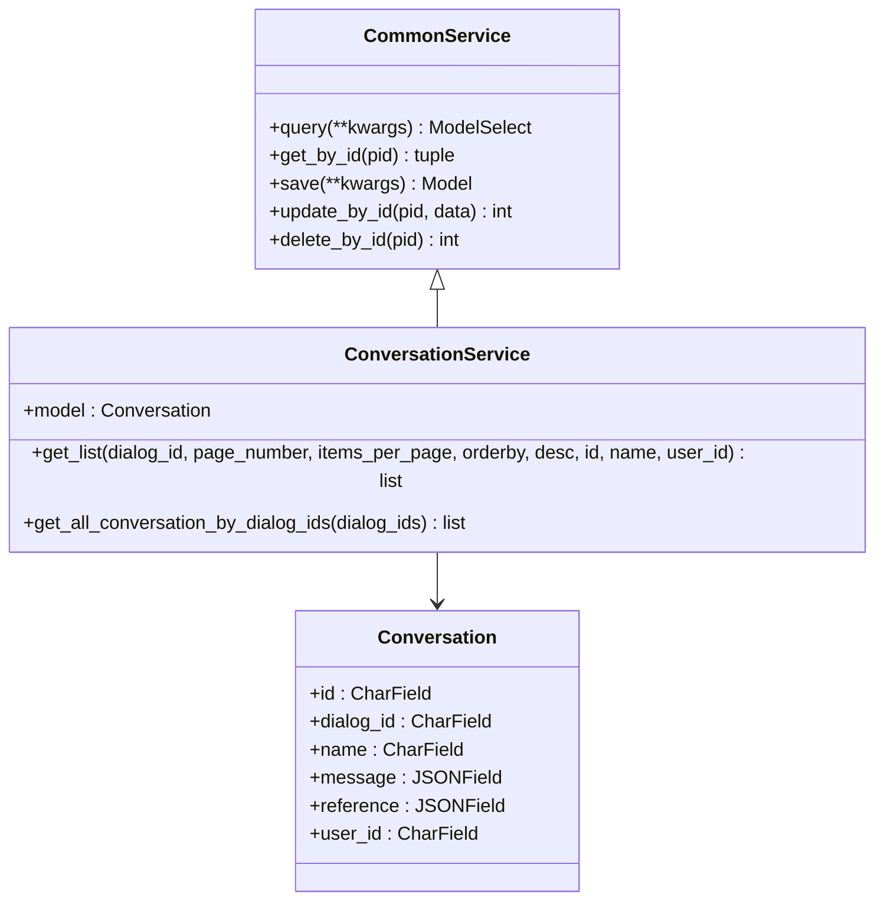
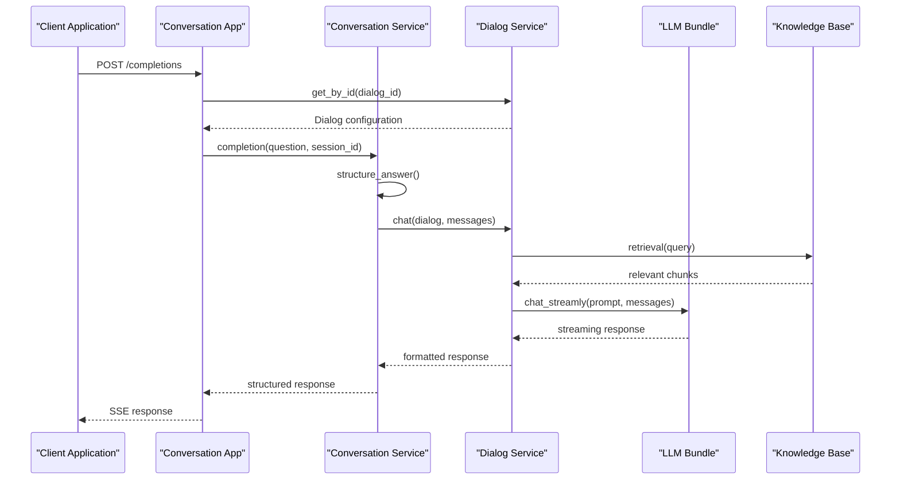
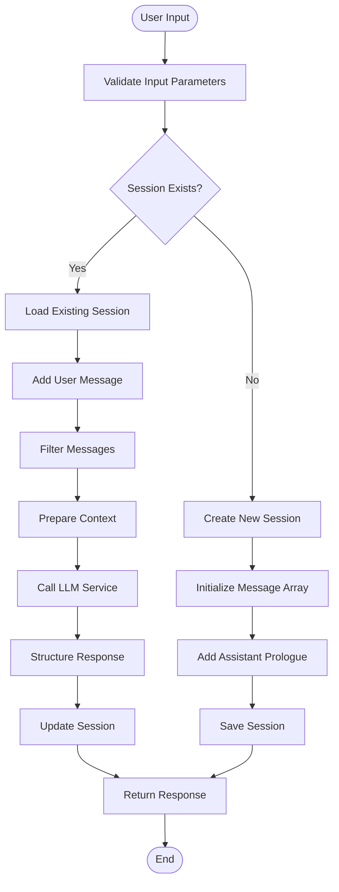
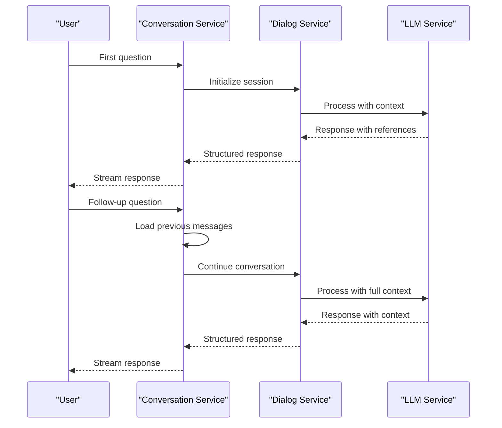
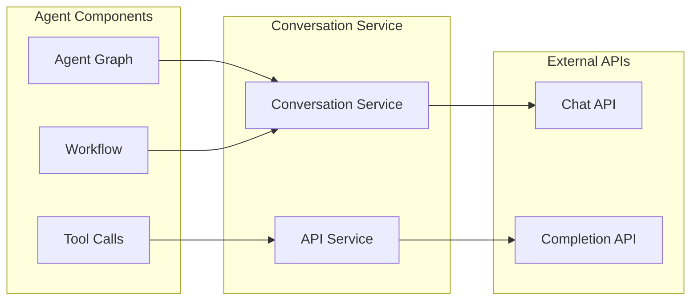

# Conversation Service

<cite>
**Referenced Files in This Document**
- [conversation_service.py](file://api/db/services/conversation_service.py)
- [conversation_app.py](file://api/apps/conversation_app.py)
- [dialog_service.py](file://api/db/services/dialog_service.py)
- [common_service.py](file://api/db/services/common_service.py)
- [api_service.py](file://api/db/services/api_service.py)
- [chat.py](file://api/apps/sdk/chat.py)
- [db_models.py](file://api/db/db_models.py)
- [session.py](file://api/apps/sdk/session.py)
</cite>

## Table of Contents
1. [Introduction](#introduction)
2. [System Architecture](#system-architecture)
3. [Core Components](#core-components)
4. [Domain Model](#domain-model)
5. [Service Interfaces](#service-interfaces)
6. [Implementation Details](#implementation-details)
7. [Usage Patterns](#usage-patterns)
8. [Integration with Other Components](#integration-with-other-components)
9. [Common Issues and Solutions](#common-issues-and-solutions)
10. [Best Practices](#best-practices)
11. [Troubleshooting Guide](#troubleshooting-guide)
12. [Conclusion](#conclusion)

## Introduction

The Conversation Service is a core component of the RAGFlow platform that manages chat sessions, message persistence, and context handling for AI-powered conversations. It provides a robust framework for maintaining conversation state, handling multi-turn dialogues, and integrating with knowledge bases to deliver intelligent responses.

This service acts as the central hub for conversation management, coordinating between user interactions, knowledge retrieval systems, and AI model responses. It supports both streaming and non-streaming conversation modes, handles conversation history effectively, and maintains context across multiple interactions.

## System Architecture

The Conversation Service follows a layered architecture that separates concerns between data persistence, business logic, and API interfaces:



**Diagram sources**
- [conversation_service.py](file://api/db/services/conversation_service.py#L29-L31)
- [conversation_app.py](file://api/apps/conversation_app.py#L25-L26)
- [dialog_service.py](file://api/db/services/dialog_service.py#L50-L52)

## Core Components

### Conversation Service Class

The `ConversationService` class serves as the primary interface for conversation management, inheriting from `CommonService` to provide standardized database operations.



**Diagram sources**
- [conversation_service.py](file://api/db/services/conversation_service.py#L29-L31)
- [common_service.py](file://api/db/services/common_service.py#L37-L49)
- [db_models.py](file://api/db/db_models.py#L877-L886)

### Dialog Service Integration

The Conversation Service integrates closely with the Dialog Service, which manages chat assistants and their configurations:



**Diagram sources**
- [conversation_service.py](file://api/db/services/conversation_service.py#L93-L168)
- [dialog_service.py](file://api/db/services/dialog_service.py#L351-L636)

**Section sources**
- [conversation_service.py](file://api/db/services/conversation_service.py#L29-L243)
- [dialog_service.py](file://api/db/services/dialog_service.py#L50-L636)

## Domain Model

The conversation system uses several interconnected models to represent different aspects of the conversation lifecycle:

### Conversation Model

The core `Conversation` model stores individual chat sessions with their complete message history and references:

| Field | Type | Description | Constraints |
|-------|------|-------------|-------------|
| `id` | CharField(32) | Unique conversation identifier | Primary Key |
| `dialog_id` | CharField(32) | Associated dialog/chat assistant ID | Not Null, Indexed |
| `name` | CharField(255) | Human-readable conversation name | Nullable, Indexed |
| `message` | JSONField | Complete message history with roles | Nullable |
| `reference` | JSONField | Knowledge base references and citations | Default: [] |
| `user_id` | CharField(255) | User identifier for ownership | Nullable, Indexed |

### API4Conversation Model

The `API4Conversation` model extends conversation capabilities for external API integrations:

| Field | Type | Description | Constraints |
|-------|------|-------------|-------------|
| `id` | CharField(32) | Unique conversation identifier | Primary Key |
| `dialog_id` | CharField(32) | Associated dialog ID | Not Null, Indexed |
| `user_id` | CharField(255) | User identifier | Not Null, Indexed |
| `message` | JSONField | Message history | Nullable |
| `reference` | JSONField | References and citations | Default: [] |
| `tokens` | IntegerField | Token usage count | Default: 0 |
| `source` | CharField(16) | API source type | Nullable, Indexed |
| `dsl` | JSONField | Workflow DSL configuration | Default: {} |
| `duration` | FloatField | Response duration | Default: 0 |
| `round` | IntegerField | Conversation round count | Default: 0 |
| `thumb_up` | IntegerField | User feedback count | Default: 0 |
| `errors` | TextField | Error messages | Nullable |

**Section sources**
- [db_models.py](file://api/db/db_models.py#L877-L916)

## Service Interfaces

### Core Service Methods

The Conversation Service provides several key methods for conversation management:

#### Session Management

```python
# Create new conversation session
@classmethod
def get_list(cls, dialog_id, page_number, items_per_page, orderby, desc, id, name, user_id=None)

# Retrieve all conversations for dialog IDs
@classmethod
def get_all_conversation_by_dialog_ids(cls, dialog_ids)
```

#### Message Operations

```python
# Complete conversation with streaming
def completion(tenant_id, chat_id, question, name="New session", session_id=None, stream=True, **kwargs)

# Handle iframe-based conversations
def iframe_completion(dialog_id, question, session_id=None, stream=True, **kwargs)
```

#### Utility Functions

```python
# Structure response with references
def structure_answer(conv, ans, message_id, session_id)

# Append messages to conversation
def append_message(cls, id, conversation)
```

### API Service Integration

The service also provides specialized methods for API-driven conversations:

```python
# Get conversation list with filtering
@classmethod
def get_list(cls, dialog_id, tenant_id, page_number, items_per_page, orderby, desc, id, user_id=None, include_dsl=True, keywords="", from_date=None, to_date=None)

# Append message with round increment
@classmethod
def append_message(cls, id, conversation)
```

**Section sources**
- [conversation_service.py](file://api/db/services/conversation_service.py#L32-L243)
- [api_service.py](file://api/db/services/api_service.py#L48-L113)

## Implementation Details

### Message Structure and Context Handling

The conversation system maintains sophisticated message structures that preserve context across multiple turns:



**Diagram sources**
- [conversation_service.py](file://api/db/services/conversation_service.py#L93-L168)

### Streaming vs Non-Streaming Responses

The service supports both streaming and non-streaming response modes:

#### Streaming Mode
- Uses Server-Sent Events (SSE) for real-time response delivery
- Processes LLM responses incrementally
- Updates conversation state progressively
- Provides immediate user feedback

#### Non-Streaming Mode
- Waits for complete LLM response
- Returns single consolidated response
- Simpler client-side handling
- Suitable for batch processing scenarios

### Reference and Citation Management

The system maintains detailed references for knowledge base citations:

```python
def structure_answer(conv, ans, message_id, session_id):
    # Extract and format references
    reference = ans["reference"]
    if not isinstance(reference, dict):
        reference = {}
        ans["reference"] = {}
    
    # Format chunks for display
    chunk_list = chunks_format(reference)
    reference["chunks"] = chunk_list
    
    # Add message metadata
    ans["id"] = message_id
    ans["session_id"] = session_id
    
    # Update conversation history
    if conv and conv.message:
        if conv.message[-1].get("role", "") != "assistant":
            conv.message.append({
                "role": "assistant", 
                "content": ans["answer"], 
                "created_at": time.time(), 
                "id": message_id
            })
        else:
            conv.message[-1] = {
                "role": "assistant", 
                "content": ans["answer"], 
                "created_at": time.time(), 
                "id": message_id
            }
    
    return ans
```

**Section sources**
- [conversation_service.py](file://api/db/services/conversation_service.py#L67-L90)
- [conversation_service.py](file://api/db/services/conversation_service.py#L93-L168)

## Usage Patterns

### Creating Conversations

Conversations can be created through multiple interfaces:

#### Web Interface Pattern
```python
# Using conversation app endpoint
POST /api/v1/chats/{chat_id}/sessions
{
    "name": "New Conversation",
    "user_id": "user123"
}
```

#### SDK Pattern
```python
# Using SDK chat service
chat_service.create_conversation(
    tenant_id="tenant123",
    chat_id="dialog456",
    name="My Conversation"
)
```

### Managing Conversation History

The service provides comprehensive history management:

```python
# Get conversation list with pagination
conversations = ConversationService.get_list(
    dialog_id="dialog123",
    page_number=1,
    items_per_page=20,
    orderby="create_time",
    desc=True
)

# Retrieve specific conversation
success, conversation = ConversationService.get_by_id("session789")
```

### Multi-Turn Conversations

The system maintains conversation context across multiple turns:



**Diagram sources**
- [conversation_service.py](file://api/db/services/conversation_service.py#L121-L140)
- [dialog_service.py](file://api/db/services/dialog_service.py#L351-L400)

**Section sources**
- [conversation_app.py](file://api/apps/conversation_app.py#L37-L78)
- [chat.py](file://api/apps/sdk/chat.py#L27-L141)

## Integration with Other Components

### Agent System Integration

The Conversation Service integrates seamlessly with the agent system for automated workflows:



**Diagram sources**
- [conversation_service.py](file://api/db/services/conversation_service.py#L29-L31)
- [api_service.py](file://api/db/services/api_service.py#L44-L46)

### Knowledge Base Integration

Conversations leverage knowledge bases for informed responses:

```python
# Knowledge base retrieval process
def chat(dialog, messages, stream=True, **kwargs):
    # Extract questions from conversation history
    questions = [m["content"] for m in messages if m["role"] == "user"][-3:]
    
    # Retrieve relevant knowledge
    kbinfos = retriever.retrieval(
        " ".join(questions),
        embd_mdl,
        tenant_ids,
        dialog.kb_ids,
        1,
        dialog.top_n,
        dialog.similarity_threshold,
        dialog.vector_similarity_weight,
        doc_ids=attachments,
        top=dialog.top_k,
        rerank_mdl=rerank_mdl
    )
    
    # Format knowledge for LLM
    knowledges = kb_prompt(kbinfos, max_tokens)
```

### File and Attachment Handling

The service supports file attachments and processing:

```python
# File attachment processing
if "files" in messages[-1]:
    attachments = "\n\n".join(FileService.get_files(messages[-1]["files"]))
    if attachments and msg:
        msg[-1]["content"] += attachments
```

**Section sources**
- [dialog_service.py](file://api/db/services/dialog_service.py#L351-L400)
- [dialog_service.py](file://api/db/services/dialog_service.py#L182-L196)

## Common Issues and Solutions

### Conversation History Management

**Issue**: Conversation history becomes too long, affecting performance
**Solution**: Implement message truncation and summarization

```python
# Message history optimization
def optimize_message_history(messages, max_tokens=4000):
    # Keep system messages
    system_msgs = [m for m in messages if m["role"] == "system"]
    
    # Keep recent user-assistant pairs
    user_msgs = [m for m in messages if m["role"] == "user"]
    assistant_msgs = [m for m in messages if m["role"] == "assistant"]
    
    # Limit conversation length
    if len(user_msgs) > 10:
        user_msgs = user_msgs[-5:]
        assistant_msgs = assistant_msgs[-5:]
    
    return system_msgs + user_msgs + assistant_msgs
```

### Memory Management

**Issue**: Large conversations consume excessive memory
**Solution**: Implement periodic cleanup and compression

```python
# Conversation cleanup strategy
def cleanup_conversation(conversation, max_rounds=20):
    if conversation.round > max_rounds:
        # Compress older messages
        compressed = compress_old_messages(conversation.message)
        conversation.message = compressed
        
        # Update reference counts
        conversation.reference = compress_references(conversation.reference)
        
        # Reset round counter
        conversation.round = len(compressed) // 2
```

### Concurrent Access Issues

**Issue**: Race conditions in multi-user environments
**Solution**: Implement database-level locking

```python
# Database transaction for atomic operations
@DB.connection_context()
def update_conversation_safely(conversation_id, updates):
    with DB.atomic():
        conversation = Conversation.get_by_id(conversation_id)
        conversation.update(updates)
        conversation.save()
```

### Reference Integrity

**Issue**: Broken citations and references
**Solution**: Implement reference validation and repair

```python
# Reference integrity checking
def validate_references(conversation):
    for ref in conversation.reference:
        if not ref.get("chunks"):
            continue
            
        # Verify chunk IDs exist
        valid_chunks = []
        for chunk in ref["chunks"]:
            if is_valid_chunk(chunk):
                valid_chunks.append(chunk)
                
        ref["chunks"] = valid_chunks
```

**Section sources**
- [conversation_service.py](file://api/db/services/conversation_service.py#L121-L140)
- [dialog_service.py](file://api/db/services/dialog_service.py#L351-L400)

## Best Practices

### Conversation Design Patterns

1. **Session Naming**: Use descriptive names for conversations
2. **Context Preservation**: Maintain relevant context across turns
3. **Reference Tracking**: Always track knowledge base sources
4. **Error Handling**: Implement robust error recovery

### Performance Optimization

1. **Pagination**: Use pagination for large conversation lists
2. **Lazy Loading**: Load conversation history on demand
3. **Compression**: Compress old conversation data
4. **Caching**: Cache frequently accessed conversations

### Security Considerations

1. **Access Control**: Verify user ownership of conversations
2. **Input Validation**: Sanitize user inputs
3. **Audit Logging**: Log conversation activities
4. **Data Retention**: Implement appropriate data retention policies

### Scalability Guidelines

1. **Database Indexing**: Properly index conversation fields
2. **Connection Pooling**: Use connection pooling for database access
3. **Async Processing**: Use asynchronous operations where possible
4. **Resource Limits**: Implement rate limiting and quotas

## Troubleshooting Guide

### Common Error Scenarios

#### Conversation Not Found
**Error**: `Conversation not found!`
**Cause**: Invalid conversation ID or user lacks permissions
**Solution**: Verify conversation ID and user permissions

#### Session Creation Failure
**Error**: `Dialog not found`
**Cause**: Invalid dialog ID or dialog not owned by user
**Solution**: Check dialog existence and ownership

#### Streaming Issues
**Error**: Connection timeouts during streaming
**Cause**: Long-running LLM responses or network issues
**Solution**: Implement connection retry logic and timeout handling

### Debugging Techniques

#### Enable Debug Logging
```python
import logging
logging.getLogger('api.db.services.conversation_service').setLevel(logging.DEBUG)
```

#### Monitor Database Queries
```python
# Enable SQL query logging
import logging
logging.getLogger('peewee').setLevel(logging.DEBUG)
```

#### Validate Conversation State
```python
def validate_conversation_state(conversation):
    # Check message structure
    if not isinstance(conversation.message, list):
        return False
        
    # Verify reference format
    if not isinstance(conversation.reference, list):
        return False
        
    # Check for orphaned references
    for ref in conversation.reference:
        if not ref.get("chunks"):
            return False
            
    return True
```

### Performance Monitoring

#### Track Conversation Metrics
```python
# Monitor conversation performance
def monitor_conversation_performance(conversation):
    metrics = {
        "message_count": len(conversation.message),
        "reference_count": len(conversation.reference),
        "round_count": conversation.round,
        "duration": conversation.duration,
        "token_usage": conversation.tokens
    }
    return metrics
```

**Section sources**
- [conversation_app.py](file://api/apps/conversation_app.py#L80-L108)
- [conversation_service.py](file://api/db/services/conversation_service.py#L121-L140)

## Conclusion

The Conversation Service provides a comprehensive foundation for managing AI-powered conversations in the RAGFlow platform. Its robust architecture supports complex multi-turn dialogues, integrates seamlessly with knowledge bases, and provides flexible interfaces for various use cases.

Key strengths of the system include:

- **Flexible Architecture**: Supports both streaming and non-streaming modes
- **Rich Context Management**: Maintains conversation history and references
- **Scalable Design**: Handles large volumes of conversations efficiently
- **Integration Friendly**: Works well with agents, knowledge bases, and external APIs
- **Production Ready**: Includes error handling, logging, and monitoring capabilities

The service continues to evolve with new features like conversation feedback, advanced citation management, and improved performance optimizations. Its modular design ensures maintainability while supporting the growing complexity of AI-powered conversational applications.

For developers working with the Conversation Service, following the established patterns and best practices will ensure reliable, scalable, and maintainable implementations. The comprehensive API surface and extensive documentation make it accessible to both beginners and experienced developers.