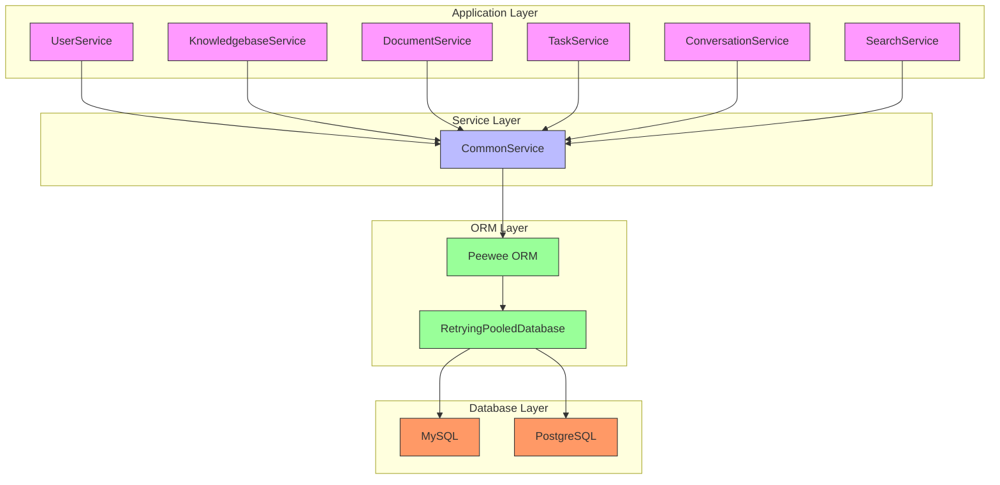
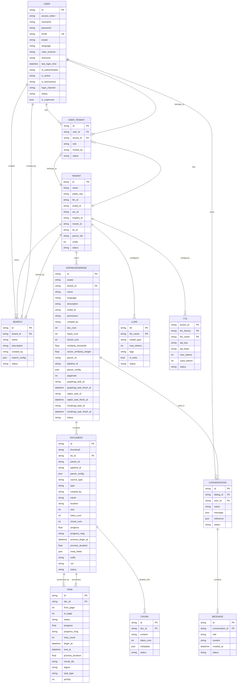

# Database Services

<cite>
**Referenced Files in This Document**   
- [db_models.py](file://api/db/db_models.py)
- [common_service.py](file://api/db/services/common_service.py)
- [user_service.py](file://api/db/services/user_service.py)
- [knowledgebase_service.py](file://api/db/services/knowledgebase_service.py)
- [document_service.py](file://api/db/services/document_service.py)
- [task_service.py](file://api/db/services/task_service.py)
- [conversation_service.py](file://api/db/services/conversation_service.py)
- [search_service.py](file://api/db/services/search_service.py)
- [init_data.py](file://api/db/init_data.py)
- [db_utils.py](file://api/db/db_utils.py)
- [runtime_config.py](file://api/db/runtime_config.py)
- [init.sql](file://docker/init.sql)
</cite>

## Table of Contents
1. [Introduction](#introduction)
2. [Database Architecture Overview](#database-architecture-overview)
3. [Core Data Models](#core-data-models)
4. [Entity Relationship Diagram](#entity-relationship-diagram)
5. [Service Pattern Implementation](#service-pattern-implementation)
6. [ORM Usage and Database Connection Management](#orm-usage-and-database-connection-management)
7. [Data Access Patterns and Query Optimization](#data-access-patterns-and-query-optimization)
8. [Transaction Management](#transaction-management)
9. [Database Initialization and Configuration](#database-initialization-and-configuration)
10. [Data Integrity and Consistency](#data-integrity-and-consistency)
11. [Migration Strategies](#migration-strategies)
12. [Common Database Operations](#common-database-operations)
13. [Conclusion](#conclusion)

## Introduction
This document provides comprehensive documentation for RAGFlow's database architecture, focusing on the data model, service pattern implementation, and database operations. The system is built around a relational database that stores core entities such as User, Tenant, Document, KnowledgeBase, Chunk, Task, and Conversation. The architecture follows a service-oriented pattern where each service class encapsulates database operations for specific entities, providing a clean separation of concerns and consistent data access patterns.

The database layer is implemented using Peewee ORM, which provides a lightweight and expressive interface for database operations. The system supports both MySQL and PostgreSQL databases with connection pooling and retry mechanisms to ensure reliability. The data model is designed to support the RAG (Retrieval-Augmented Generation) workflow, with entities that represent knowledge bases, documents, processing tasks, and conversations.

This documentation details the entity relationships, service implementations, ORM usage, data access patterns, and operational aspects of the database system, providing a complete reference for developers and system administrators.

## Database Architecture Overview
RAGFlow's database architecture is designed to support a multi-tenant RAG system with comprehensive document processing capabilities. The architecture follows a service-oriented pattern where each core entity has a corresponding service class that encapsulates all database operations. This approach provides a clean separation of concerns and ensures consistent data access patterns across the application.

The system uses Peewee ORM as the primary database abstraction layer, providing a lightweight and expressive interface for database operations. The architecture supports both MySQL and PostgreSQL databases through connection pooling with retry mechanisms to handle transient connection issues. The database connection is managed through a singleton pattern, ensuring that all components use the same database connection instance.

The data model is organized around several core entities that represent the key components of the RAG system:
- **User and Tenant**: Represent users and their organizational contexts, with support for multi-tenancy and role-based access control
- **KnowledgeBase**: Represents collections of documents that can be queried and searched
- **Document**: Represents individual documents that are processed and indexed
- **Task**: Represents document processing tasks, including parsing, chunking, and embedding
- **Conversation**: Represents chat sessions between users and the AI system

The architecture includes comprehensive support for data integrity, with validation rules, constraints, and transaction management. The system also implements sophisticated query optimization techniques, including indexing, pagination, and batch operations to ensure efficient data access.



**Diagram sources**
- [db_models.py](file://api/db/db_models.py)
- [common_service.py](file://api/db/services/common_service.py)
- [user_service.py](file://api/db/services/user_service.py)
- [knowledgebase_service.py](file://api/db/services/knowledgebase_service.py)
- [document_service.py](file://api/db/services/document_service.py)
- [task_service.py](file://api/db/services/task_service.py)
- [conversation_service.py](file://api/db/services/conversation_service.py)
- [search_service.py](file://api/db/services/search_service.py)

**Section sources**
- [db_models.py](file://api/db/db_models.py)
- [common_service.py](file://api/db/services/common_service.py)

## Core Data Models
RAGFlow's database schema is built around several core data models that represent the fundamental entities of the system. These models are implemented using Peewee ORM and follow a consistent pattern across all entities. Each model inherits from a base `DataBaseModel` class that provides common fields and methods, ensuring consistency across the data model.

The core data models include:

### User Model
The User model represents system users and their authentication information. It includes fields for user identification, authentication tokens, personal information, and status. The model implements the `AuthUser` interface for integration with the authentication system.

Key fields:
- `id`: Unique user identifier (primary key)
- `access_token`: Authentication token for API access
- `nickname`: User's display name
- `password`: Hashed password for authentication
- `email`: User's email address (unique)
- `avatar`: Base64 encoded avatar image
- `language`, `color_schema`, `timezone`: User preferences
- `last_login_time`: Timestamp of last login
- `is_authenticated`, `is_active`, `is_anonymous`: Authentication status flags
- `login_channel`: Source of user login
- `status`: User status (active/inactive)
- `is_superuser`: Administrative privileges flag

### Tenant Model
The Tenant model represents organizational contexts within the multi-tenant system. Each tenant has its own configuration, including default AI models and credit balance. The model supports the multi-tenancy architecture by providing isolation between different organizations.

Key fields:
- `id`: Unique tenant identifier (primary key)
- `name`: Tenant name
- `public_key`: Public key for tenant identification
- `llm_id`, `embd_id`, `asr_id`, `img2txt_id`, `rerank_id`, `tts_id`: Default AI model identifiers
- `parser_ids`: Document processors configuration
- `credit`: Credit balance for usage tracking
- `status`: Tenant status (active/inactive)

### UserTenant Model
The UserTenant model represents the many-to-many relationship between users and tenants, implementing role-based access control. It allows users to belong to multiple tenants with different roles.

Key fields:
- `id`: Relationship identifier (primary key)
- `user_id`: Reference to User
- `tenant_id`: Reference to Tenant
- `role`: User role within the tenant (OWNER, ADMIN, NORMAL, INVITE)
- `invited_by`: User who invited this user
- `status`: Relationship status

### Knowledgebase Model
The Knowledgebase model represents collections of documents that can be queried and searched. It serves as the primary organizational unit for documents and provides configuration for document processing.

Key fields:
- `id`: Unique knowledge base identifier (primary key)
- `avatar`: Base64 encoded avatar image
- `tenant_id`: Reference to owning tenant
- `name`: Knowledge base name
- `language`: Language preference
- `description`: Knowledge base description
- `embd_id`: Default embedding model ID
- `permission`: Access permission (me|team)
- `created_by`: User who created the knowledge base
- `doc_num`, `token_num`, `chunk_num`: Document statistics
- `similarity_threshold`, `vector_similarity_weight`: Search configuration
- `parser_id`: Default parser ID
- `pipeline_id`: Pipeline ID for document processing
- `parser_config`: JSON configuration for document parsing
- `pagerank`: Ranking score
- `graphrag_task_id`, `raptor_task_id`, `mindmap_task_id`: Task identifiers for advanced processing
- `status`: Knowledge base status

### Document Model
The Document model represents individual documents that are processed and indexed. It tracks the document's processing status, metadata, and statistics.

Key fields:
- `id`: Unique document identifier (primary key)
- `thumbnail`: Base64 encoded thumbnail image
- `kb_id`: Reference to containing knowledge base
- `parser_id`: Parser ID for document processing
- `pipeline_id`: Pipeline ID for document processing
- `parser_config`: JSON configuration for document parsing
- `source_type`: Source of the document (local, etc.)
- `type`: File extension
- `created_by`: User who created the document
- `name`: File name
- `location`: Storage location
- `size`: File size in bytes
- `token_num`, `chunk_num`: Document statistics
- `progress`: Processing progress (0.0 to 1.0)
- `progress_msg`: Processing status message
- `process_begin_at`: Timestamp when processing began
- `process_duration`: Processing duration in seconds
- `meta_fields`: JSON metadata fields
- `suffix`: Real file extension suffix
- `run`: Processing status (run/cancel)
- `status`: Document status

### Task Model
The Task model represents document processing tasks, including parsing, chunking, and embedding. It tracks the progress and status of individual processing tasks.

Key fields:
- `id`: Unique task identifier (primary key)
- `doc_id`: Reference to document being processed
- `from_page`, `to_page`: Page range for processing
- `status`: Task status
- `progress`: Processing progress (0.0 to 1.0)
- `progress_msg`: Processing status message
- `retry_count`: Number of retry attempts
- `begin_at`: Timestamp when task began
- `end_at`: Timestamp when task ended
- `process_duration`: Processing duration in seconds
- `chunk_ids`: Space-separated list of chunk identifiers
- `digest`: Hash of task configuration for optimization
- `task_type`: Type of task (Parse, Download, RAPTOR, GraphRAG, Mindmap)
- `priority`: Task priority for queueing

### Conversation Model
The Conversation model represents chat sessions between users and the AI system. It stores the conversation history and context.

Key fields:
- `id`: Unique conversation identifier (primary key)
- `dialog_id`: Reference to dialog configuration
- `user_id`: Reference to user
- `name`: Conversation name
- `message`: JSON array of conversation messages
- `reference`: JSON array of references used in responses
- `status`: Conversation status

### Search Model
The Search model represents saved search configurations and their results.

Key fields:
- `id`: Unique search identifier (primary key)
- `tenant_id`: Reference to owning tenant
- `name`: Search name
- `description`: Search description
- `created_by`: User who created the search
- `search_config`: JSON configuration for the search
- `status`: Search status

**Section sources**
- [db_models.py](file://api/db/db_models.py)

## Entity Relationship Diagram
The entity relationship diagram below illustrates the core data model of RAGFlow, showing the relationships between the main entities and their key attributes. The diagram highlights the hierarchical structure of the system, with tenants containing users and knowledge bases, which in turn contain documents that are processed by tasks and used in conversations.



**Diagram sources**
- [db_models.py](file://api/db/db_models.py)

**Section sources**
- [db_models.py](file://api/db/db_models.py)

## Service Pattern Implementation
RAGFlow implements a comprehensive service pattern where each core entity has a corresponding service class that encapsulates all database operations. This pattern provides a clean separation of concerns, consistent data access patterns, and centralized business logic. The service classes follow a hierarchical structure with a base `CommonService` class that provides shared functionality, and specialized service classes that extend it for specific entities.

### CommonService Base Class
The `CommonService` class serves as the foundation for all service implementations, providing a standardized interface for database operations. It implements the repository pattern, abstracting the underlying ORM and providing a consistent API for data access.

Key methods:
- `query()`: Execute a database query with optional filtering and ordering
- `get_all()`: Retrieve all records with optional column selection and ordering
- `get()`: Get a single record matching criteria
- `get_or_none()`: Get a single record or None if not found
- `save()`: Save a new record to the database
- `insert()`: Insert a new record with automatic ID and timestamps
- `insert_many()`: Insert multiple records in batches
- `update_many_by_id()`: Update multiple records by their IDs
- `update_by_id()`: Update a single record by ID
- `get_by_id()`: Get a record by ID
- `get_by_ids()`: Get multiple records by their IDs
- `delete_by_id()`: Delete a record by ID
- `delete_by_ids()`: Delete multiple records by their IDs
- `filter_delete()`: Delete records matching given filters
- `filter_update()`: Update records matching given filters

The `CommonService` class uses the `@DB.connection_context()` decorator to ensure proper database connection management for each operation, automatically handling connection acquisition and release.

### Specialized Service Classes
Each core entity has a specialized service class that extends `CommonService` and provides entity-specific functionality:

#### UserService
The `UserService` class manages user-related operations, including authentication, user creation, updates, and deletions. It implements security measures such as password hashing and access token validation.

Key methods:
- `query_user(email, password)`: Authenticate a user with email and password
- `query_user_by_email(email)`: Find users by email address
- `save(**kwargs)`: Save a new user with password hashing
- `update_user_password(user_id, new_password)`: Update a user's password
- `is_admin(user_id)`: Check if a user has administrative privileges

#### TenantService
The `TenantService` class manages tenant-related operations, including tenant information retrieval and credit management.

Key methods:
- `get_info_by(user_id)`: Get tenant information for a user
- `get_joined_tenants_by_user_id(user_id)`: Get tenants joined by a user
- `decrease(user_id, num)`: Decrease a tenant's credit balance
- `user_gateway(tenant_id)`: Determine the storage gateway for a tenant

#### UserTenantService
The `UserTenantService` class manages the many-to-many relationship between users and tenants, handling user roles and tenant memberships.

Key methods:
- `get_by_tenant_id(tenant_id)`: Get users in a tenant
- `get_tenants_by_user_id(user_id)`: Get tenants for a user
- `get_user_tenant_relation_by_user_id(user_id)`: Get user-tenant relationships
- `get_num_members(user_id)`: Get the number of members in a tenant
- `filter_by_tenant_and_user_id(tenant_id, user_id)`: Find a specific user-tenant relationship

#### KnowledgebaseService
The `KnowledgebaseService` class manages knowledge base operations, including document parsing status tracking, access control, and configuration management.

Key methods:
- `accessible4deletion(kb_id, user_id)`: Check if a knowledge base can be deleted by a user
- `is_parsed_done(kb_id)`: Check if all documents in a knowledge base have completed parsing
- `get_by_tenant_ids(joined_tenant_ids, user_id, ...)`: Get knowledge bases by tenant IDs with pagination
- `get_detail(kb_id)`: Get detailed information about a knowledge base
- `update_parser_config(id, config)`: Update parser configuration for a knowledge base
- `create_with_name(name, tenant_id, parser_id, **kwargs)`: Create a knowledge base by name with defaults

#### DocumentService
The `DocumentService` class manages document operations, including document processing, status tracking, and metadata management.

Key methods:
- `get_list(kb_id, page_number, items_per_page, ...)`: Get documents in a knowledge base with pagination
- `get_by_kb_id(kb_id, page_number, items_per_page, ...)`: Get documents by knowledge base ID
- `insert(doc)`: Insert a new document and update knowledge base statistics
- `remove_document(doc, tenant_id)`: Remove a document and clean up associated data
- `increment_chunk_num(doc_id, kb_id, token_num, chunk_num, duration)`: Increment chunk numbers for a document
- `decrement_chunk_num(doc_id, kb_id, token_num, chunk_num, duration)`: Decrement chunk numbers for a document
- `get_chunking_config(doc_id)`: Get chunking configuration for a document
- `update_parser_config(id, config)`: Update parser configuration for a document

#### TaskService
The `TaskService` class manages document processing tasks, including task creation, progress tracking, and chunk management.

Key methods:
- `get_task(task_id, doc_ids=[])`: Retrieve detailed task information
- `get_tasks(doc_id)`: Retrieve all tasks for a document
- `update_chunk_ids(id, chunk_ids)`: Update chunk IDs for a task
- `get_ongoing_doc_name()`: Get names of documents currently being processed
- `do_cancel(id)`: Check if a task should be cancelled
- `update_progress(id, info)`: Update task progress information

#### ConversationService
The `ConversationService` class manages conversation operations, including chat session creation and message management.

Key methods:
- `get_list(dialog_id, page_number, items_per_page, ...)`: Get conversations for a dialog with pagination
- `get_all_conversation_by_dialog_ids(dialog_ids)`: Get all conversations for dialog IDs

The service pattern implementation ensures that all database operations are encapsulated within well-defined classes, providing a consistent interface and centralized business logic. This approach makes the codebase more maintainable, testable, and extensible.

```mermaid
classDiagram
class CommonService {
+model : Model
+query(cols, reverse, order_by, **kwargs) ModelSelect
+get_all(cols, reverse, order_by) ModelSelect
+get(**kwargs) Model
+get_or_none(**kwargs) Model or None
+save(**kwargs) Model
+insert(**kwargs) Model
+insert_many(data_list, batch_size) void
+update_many_by_id(data_list) void
+update_by_id(pid, data) int
+get_by_id(pid) Tuple[bool, Model]
+get_by_ids(pids, cols) ModelSelect
+delete_by_id(pid) int
+delete_by_ids(pids) int
+filter_delete(filters) int
+filter_update(filters, update_data) int
+cut_list(tar_list, n) List[Tuple]
+filter_scope_list(in_key, in_filters_list, filters, cols) List[Model]
}
class UserService {
+model : User
+query_user(email, password) User or None
+query_user_by_email(email) List[User]
+save(**kwargs) Model
+update_user_password(user_id, new_password) void
+is_admin(user_id) bool
}
class TenantService {
+model : Tenant
+get_info_by(user_id) List[Dict]
+get_joined_tenants_by_user_id(user_id) List[Dict]
+decrease(user_id, num) void
+user_gateway(tenant_id) int
}
class UserTenantService {
+model : UserTenant
+get_by_tenant_id(tenant_id) List[Dict]
+get_tenants_by_user_id(user_id) List[Dict]
+get_user_tenant_relation_by_user_id(user_id) List[Dict]
+get_num_members(user_id) int
+filter_by_tenant_and_user_id(tenant_id, user_id) UserTenant or None
}
class KnowledgebaseService {
+model : Knowledgebase
+accessible4deletion(kb_id, user_id) bool
+is_parsed_done(kb_id) Tuple[bool, str or None]
+get_by_tenant_ids(joined_tenant_ids, user_id, ...) Tuple[List[Dict], int]
+get_detail(kb_id) Dict or None
+update_parser_config(id, config) void
+create_with_name(name, tenant_id, parser_id, **kwargs) Tuple[bool, Dict or str]
}
class DocumentService {
+model : Document
+get_list(kb_id, page_number, items_per_page, ...) Tuple[List[Dict], int]
+get_by_kb_id(kb_id, page_number, items_per_page, ...) Tuple[List[Dict], int]
+insert(doc) Document
+remove_document(doc, tenant_id) int
+increment_chunk_num(doc_id, kb_id, token_num, chunk_num, duration) int
+decrement_chunk_num(doc_id, kb_id, token_num, chunk_num, duration) int
+get_chunking_config(doc_id) Dict or None
+update_parser_config(id, config) void
}
class TaskService {
+model : Task
+get_task(task_id, doc_ids) Dict or None
+get_tasks(doc_id) List[Dict] or None
+update_chunk_ids(id, chunk_ids) void
+get_ongoing_doc_name() List[Tuple]
+do_cancel(id) bool
+update_progress(id, info) void
}
class ConversationService {
+model : Conversation
+get_list(dialog_id, page_number, items_per_page, ...) List[Dict]
+get_all_conversation_by_dialog_ids(dialog_ids) List[Dict]
}
class SearchService {
+model : Search
+save(**kwargs) Model
+accessible4deletion(search_id, user_id) bool
+get_detail(search_id) Dict
+get_by_tenant_ids(joined_tenant_ids, user_id, ...) Tuple[List[Dict], int]
+delete_by_tenant_id(tenant_id) int
}
CommonService <|-- UserService
CommonService <|-- TenantService
CommonService <|-- UserTenantService
CommonService <|-- KnowledgebaseService
CommonService <|-- DocumentService
CommonService <|-- TaskService
CommonService <|-- ConversationService
CommonService <|-- SearchService
```



**Diagram sources**
- [common_service.py](file://api/db/services/common_service.py)
- [user_service.py](file://api/db/services/user_service.py)
- [knowledgebase_service.py](file://api/db/services/knowledgebase_service.py)
- [document_service.py](file://api/db/services/document_service.py)
- [task_service.py](file://api/db/services/task_service.py)
- [conversation_service.py](file://api/db/services/conversation_service.py)
- [search_service.py](file://api/db/services/search_service.py)

**Section sources**
- [common_service.py](file://api/db/services/common_service.py)
- [user_service.py](file://api/db/services/user_service.py)
- [knowledgebase_service.py](file://api/db/services/knowledgebase_service.py)
- [document_service.py](file://api/db/services/document_service.py)
- [task_service.py](file://api/db/services/task_service.py)
- [conversation_service.py](file://api/db/services/conversation_service.py)
- [search_service.py](file://api/db/services/search_service.py)

## ORM Usage and Database Connection Management
RAGFlow utilizes Peewee ORM as its primary database abstraction layer, providing a lightweight and expressive interface for database operations. The ORM implementation is designed to support both MySQL and PostgreSQL databases with robust connection management and error handling.

### Peewee ORM Implementation
The system uses Peewee's model-based approach to define database tables and relationships. Each entity is represented by a Python class that inherits from `DataBaseModel`, which in turn inherits from Peewee's `Model` class. This approach provides several benefits:

1. **Type Safety**: Field types are explicitly defined, reducing the risk of type-related errors
2. **Schema Management**: Database schema is defined in code, making it easier to version control and migrate
3. **Query Building**: Peewee provides a Pythonic interface for building complex queries
4. **Relationship Management**: Foreign key relationships are explicitly defined and can be easily traversed

The base `DataBaseModel` class includes common fields that are shared across all entities:
- `create_time`: Timestamp when the record was created (BigIntegerField)
- `create_date`: Date when the record was created (DateTimeField)
- `update_time`: Timestamp when the record was last updated (BigIntegerField)
- `update_date`: Date when the record was last updated (DateTimeField)

These fields are automatically managed by the ORM, with timestamps updated on insert and update operations.

### Database Connection Management
The database connection is managed through a sophisticated connection pooling system that ensures reliability and performance. The system uses different pooled database implementations for MySQL and PostgreSQL:

```python
class RetryingPooledMySQLDatabase(PooledMySQLDatabase):
    def __init__(self, *args, **kwargs):
        self.max_retries = kwargs.pop("max_retries", 5)
        self.retry_delay = kwargs.pop("retry_delay", 1)
        super().__init__(*args, **kwargs)

    def execute_sql(self, sql, params=None, commit=True):
        for attempt in range(self.max_retries + 1):
            try:
                return super().execute_sql(sql, params, commit)
            except (OperationalError, InterfaceError) as e:
                # Handle connection issues with retry logic
                if should_retry and attempt < self.max_retries:
                    self._handle_connection_loss()
                    time.sleep(self.retry_delay * (2 ** attempt))
                else:
                    raise
```

The connection management system includes several key features:

1. **Connection Pooling**: Uses `PooledMySQLDatabase` and `PooledPostgresqlDatabase` to maintain a pool of database connections, reducing the overhead of establishing new connections
2. **Retry Mechanism**: Implements automatic retry logic for transient connection issues, with exponential backoff to prevent overwhelming the database server
3. **Connection Recovery**: Automatically handles connection loss by closing and reconnecting when necessary
4. **Thread Safety**: The connection pool is designed to be thread-safe, allowing multiple threads to share the same database connection pool

The database connection is initialized as a singleton through the `BaseDataBase` class:

```python
@singleton
class BaseDataBase:
    def __init__(self):
        database_config = settings.DATABASE.copy()
        db_name = database_config.pop("name")
        
        pool_config = {
            'max_retries': 5,
            'retry_delay': 1,
        }
        database_config.update(pool_config)
        self.database_connection = PooledDatabase[settings.DATABASE_TYPE.upper()].value(
            db_name, **database_config
        )
```

This ensures that all components of the application use the same database connection instance, preventing connection leaks and ensuring consistent behavior.

### Transaction Management
The system uses Peewee's transaction management features to ensure data consistency. The `@DB.connection_context()` decorator is used to wrap database operations, automatically managing transaction boundaries:

```python
@classmethod
@DB.connection_context()
def update_by_id(cls, pid, data):
    data["update_time"] = current_timestamp()
    data["update_date"] = datetime_format(datetime.now())
    num = cls.model.update(data).where(cls.model.id == pid).execute()
    return num
```

This decorator ensures that:
1. A database connection is acquired before the operation
2. The operation is executed within a transaction
3. The transaction is committed if successful
4. The transaction is rolled back if an exception occurs
5. The database connection is properly released

For operations that require explicit transaction control, the system uses Peewee's `atomic()` context manager:

```python
with DB.atomic():
    # Multiple operations that should be executed as a single transaction
    cls.model.update(data).where(cls.model.id == pid).execute()
    # Additional operations...
```

This approach ensures that related operations are executed atomically, maintaining data consistency.

### Custom Field Types
The system defines several custom field types to handle specific data storage requirements:

1. **LongTextField**: Maps to different text field types depending on the database backend (LONGTEXT for MySQL, TEXT for PostgreSQL)
2. **JSONField**: Stores JSON data with automatic serialization and deserialization
3. **ListField**: Specialized JSONField with a default value of an empty list
4. **SerializedField**: Stores serialized data using either pickle or JSON format

These custom fields provide a consistent interface for storing complex data types while handling database-specific differences.

The ORM usage and database connection management system in RAGFlow is designed to be robust, reliable, and efficient, providing a solid foundation for the application's data storage and retrieval needs.

**Section sources**
- [db_models.py](file://api/db/db_models.py)

## Data Access Patterns and Query Optimization
RAGFlow implements sophisticated data access patterns and query optimization techniques to ensure efficient database operations and optimal performance. The system follows a service-oriented architecture where data access is encapsulated within service classes, providing a consistent interface and centralized query logic.

### Query Patterns
The system implements several query patterns to handle different data access scenarios:

#### Basic CRUD Operations
The `CommonService` class provides standard CRUD (Create, Read, Update, Delete) operations that are inherited by all service classes:

```python
@classmethod
@DB.connection_context()
def get(cls, **kwargs):
    """Get a single record matching the given criteria."""
    return cls.model.get(**kwargs)

@classmethod
@DB.connection_context()
def save(cls, **kwargs):
    """Save a new record to database."""
    sample_obj = cls.model(**kwargs).save(force_insert=True)
    return sample_obj

@classmethod
@DB.connection_context()
def update_by_id(cls, pid, data):
    """Update a single record by ID."""
    data["update_time"] = current_timestamp()
    data["update_date"] = datetime_format(datetime.now())
    num = cls.model.update(data).where(cls.model.id == pid).execute()
    return num

@classmethod
@DB.connection_context()
def delete_by_id(cls, pid):
    """Delete a record by ID."""
    return cls.model.delete().where(cls.model.id == pid).execute()
```

These methods provide a consistent interface for basic data operations across all entities.

#### Filtered Queries
The system implements flexible filtering capabilities through the `query()` method, which supports various filter types:

```python
@classmethod
@DB.connection_context()
def query(cls, reverse=None, order_by=None, **kwargs):
    filters = []
    for f_n, f_v in kwargs.items():
        attr_name = "%s" % f_n
        if not hasattr(cls, attr_name) or f_v is None:
            continue
        if type(f_v) in {list, set}:
            f_v = list(f_v)
            if is_continuous_field(type(getattr(cls, attr_name))):
                if len(f_v) == 2:
                    # Handle range queries for continuous fields
                    filters.append(cls.getter_by(attr_name).between(lt_value, gt_value))
                elif lt_value is not None:
                    filters.append(operator.attrgetter(attr_name)(cls) >= lt_value)
                elif gt_value is not None:
                    filters.append(operator.attrgetter(attr_name)(cls) <= gt_value)
            else:
                # Handle IN queries for discrete fields
                filters.append(operator.attrgetter(attr_name)(cls) << f_v)
        else:
            # Handle equality queries
            filters.append(operator.attrgetter(attr_name)(cls) == f_v)
    
    if filters:
        query_records = cls.select().where(*filters)
        # Apply ordering
        if reverse is not None:
            if not order_by or not hasattr(cls, f"{order_by}"):
                order_by = "create_time"
            if reverse is True:
                query_records = query_records.order_by(cls.getter_by(f"{order_by}").desc())
            elif reverse is False:
                query_records = query_records.order_by(cls.getter_by(f"{order_by}").asc())
        return [query_record for query_record in query_records]
    else:
        return []
```

This implementation supports:
- Equality queries (field = value)
- Range queries (field BETWEEN low AND high)
- IN queries (field IN (value1, value2, ...))
- Complex boolean combinations through multiple filter parameters

#### Paginated Queries
To handle large result sets efficiently, the system implements pagination through the `get_by_tenant_ids()` and similar methods:

```python
@classmethod
@DB.connection_context()
def get_by_tenant_ids(cls, joined_tenant_ids, user_id,
                      page_number, items_per_page,
                      orderby, desc, keywords,
                      parser_id=None):
    # ... query construction ...
    
    count = kbs.count()
    
    if page_number and items_per_page:
        kbs = kbs.paginate(page_number, items_per_page)
    
    return list(kbs.dicts()), count
```

This pattern returns both the paginated results and the total count, allowing clients to implement pagination controls.

### Query Optimization Techniques
The system employs several query optimization techniques to improve performance:

#### Batch Operations
For operations involving multiple records, the system uses batch processing to minimize database round trips:

```python
@classmethod
@DB.connection_context()
def insert_many(cls, data_list, batch_size=100):
    """Insert multiple records in batches."""
    with DB.atomic():
        for d in data_list:
            d["create_time"] = current_timestamp()
            d["create_date"] = datetime_format(datetime.now())
        for i in range(0, len(data_list), batch_size):
            cls.model.insert_many(data_list[i : i + batch_size]).execute()
```

This approach reduces the overhead of individual insert operations and improves throughput.

#### Selective Field Loading
To reduce data transfer and memory usage, the system supports selective field loading:

```python
@classmethod
@DB.connection_context()
def get_all(cls, cols=None, reverse=None, order_by=None):
    """Retrieve all records with optional column selection."""
    if cols:
        query_records = cls.model.select(*cols)
    else:
        query_records = cls.model.select()
    # ... ordering and execution ...
    return query_records
```

This allows clients to request only the fields they need, reducing network bandwidth and memory consumption.

#### Join Optimization
The system optimizes joins by using appropriate join types and limiting the result set:

```python
@classmethod
@DB.connection_context()
def get_detail(cls, kb_id):
    fields = [
        cls.model.id,
        cls.model.embd_id,
        cls.model.avatar,
        cls.model.name,
        # ... other fields ...
        UserCanvas.title.alias("pipeline_name"),
        UserCanvas.avatar.alias("pipeline_avatar"),
    ]
    kbs = cls.model.select(*fields)\
            .join(UserCanvas, on=(cls.model.pipeline_id == UserCanvas.id), join_type=JOIN.LEFT_OUTER)\
        .where(
        (cls.model.id == kb_id),
        (cls.model.status == StatusEnum.VALID.value)
    ).dicts()
    # ... processing ...
```

The use of `LEFT_OUTER` joins ensures that records are returned even if the joined table has no matching records.

#### Index Utilization
The system leverages database indexes to speed up queries. Key fields are indexed to support efficient filtering and sorting:

```python
class User(DataBaseModel, AuthUser):
    id = CharField(max_length=32, primary_key=True)
    access_token = CharField(max_length=255, null=True, index=True)
    nickname = CharField(max_length=100, null=False, help_text="nicky name", index=True)
    email = CharField(max_length=255, null=False, help_text="email", index=True)
    # ... other fields ...
```

Fields commonly used in WHERE clauses and ORDER BY clauses are indexed to improve query performance.

#### Caching Strategies
The system implements caching at multiple levels to reduce database load:

1. **Application-level caching**: Frequently accessed data is cached in memory
2. **Query result caching**: Results of expensive queries are cached
3. **Connection pooling**: Database connections are reused to reduce connection overhead

#### Connection Management
The system uses connection pooling with retry mechanisms to handle transient failures:

```python
class RetryingPooledMySQLDatabase(PooledMySQLDatabase):
    def execute_sql(self, sql, params=None, commit=True):
        for attempt in range(self.max_retries + 1):
            try:
                return super().execute_sql(sql, params, commit)
            except (OperationalError, InterfaceError) as e:
                if should_retry and attempt < self.max_retries:
                    self._handle_connection_loss()
                    time.sleep(self.retry_delay * (2 ** attempt))
                else:
                    raise
```

This ensures that transient connection issues are handled gracefully without affecting application availability.

### Performance Monitoring
The system includes logging and monitoring to identify performance bottlenecks:

```python
def retry_db_operation(func):
    @retry(
        stop=stop_after_attempt(3),
        wait=wait_exponential(multiplier=1, min=1, max=5),
        retry=retry_if_exception_type((InterfaceError, OperationalError)),
        before_sleep=lambda retry_state: print(f"RETRY {retry_state.attempt_number} TIMES"),
        reraise=True,
    )
    def wrapper(*args, **kwargs):
        return func(*args, **kwargs)
    return wrapper
```

This decorator logs retry attempts, helping to identify problematic queries.

The data access patterns and query optimization techniques in RAGFlow are designed to provide efficient, scalable, and reliable database operations, ensuring optimal performance even under heavy load.

**Section sources**
- [db_models.py](file://api/db/db_models.py)
- [common_service.py](file://api/db/services/common_service.py)
- [knowledgebase_service.py](file://api/db/services/knowledgebase_service.py)
- [document_service.py](file://api/db/services/document_service.py)

## Transaction Management
RAGFlow implements a robust transaction management system to ensure data consistency and integrity across all database operations. The system uses Peewee ORM's transaction management features combined with custom decorators and patterns to handle both simple and complex transaction scenarios.

### Atomic Operations
The system ensures that individual database operations are atomic by using Peewee's built-in transaction management. Each service method that modifies data is wrapped with the `@DB.connection_context()` decorator, which automatically manages transaction boundaries:

```python
@classmethod
@DB.connection_context()
def update_by_id(cls, pid, data):
    data["update_time"] = current_timestamp()
    data["update_date"] = datetime_format(datetime.now())
    num = cls.model.update(data).where(cls.model.id == pid).execute()
    return num
```

This decorator ensures that:
1. A database connection is acquired before the operation
2. The operation is executed within a transaction
3. The transaction is committed if successful
4. The transaction is rolled back if an exception occurs
5. The database connection is properly released

### Complex Transactions
For operations that involve multiple related changes, the system uses explicit transaction blocks with Peewee's `atomic()` context manager:

```python
@classmethod
@DB.connection_context()
def insert(cls, doc):
    if not cls.save(**doc):
        raise RuntimeError("Database error (Document)!")
    if not KnowledgebaseService.atomic_increase_doc_num_by_id(doc["kb_id"]):
        raise RuntimeError("Database error (Knowledgebase)!")
    return Document(**doc)
```

In this example, the `insert()` method performs two related operations:
1. Saving the document record
2. Updating the document count in the associated knowledge base

Both operations are executed within the same transaction context, ensuring that either both succeed or both fail.

### Batch Operations
For operations involving multiple records, the system uses transaction blocks to ensure atomicity:

```python
@classmethod
@DB.connection_context()
def insert_many(cls, data_list, batch_size=100):
    """Insert multiple records in batches."""
    with DB.atomic():
        for d in data_list:
            d["create_time"] = current_timestamp()
            d["create_date"] = datetime_format(datetime.now())
        for i in range(0, len(data_list), batch_size):
            cls.model.insert_many(data_list[i : i + batch_size]).execute()
```

The `with DB.atomic():` context manager ensures that all insert operations within the block are executed as a single transaction. If any insert fails, the entire transaction is rolled back, maintaining data consistency.

### Error Handling and Rollback
The system implements comprehensive error handling to ensure proper transaction rollback in case of failures:

```python
@classmethod
@DB.connection_context()
def remove_document(cls, doc, tenant_id):
    from api.db.services.task_service import TaskService
    cls.clear_chunk_num(doc.id)
    try:
        TaskService.filter_delete([Task.doc_id == doc.id])
        # ... additional operations ...
        settings.docStoreConn.delete({"doc_id": doc.id}, search.index_name(tenant_id), doc.kb_id)
    except Exception:
        pass
    return cls.delete_by_id(doc.id)
```

In this example, if any operation within the `remove_document()` method fails, the transaction will be automatically rolled back due to the `@DB.connection_context()` decorator. The try-except block around external operations (like document store deletion) ensures that failures in these operations don't prevent the database transaction from completing.

### Retry Mechanisms
For operations that may fail due to transient issues, the system implements retry mechanisms:

```python
def retry_db_operation(func):
    @retry(
        stop=stop_after_attempt(3),
        wait=wait_exponential(multiplier=1, min=1, max=5),
        retry=retry_if_exception_type((InterfaceError, OperationalError)),
        before_sleep=lambda retry_state: print(f"RETRY {retry_state.attempt_number} TIMES"),
        reraise=True,
    )
    def wrapper(*args, **kwargs):
        return func(*args, **kwargs)
    return wrapper
```

This decorator can be applied to transactional methods to automatically retry failed operations, improving reliability in distributed environments.

### Consistency Constraints
The system enforces data consistency through several mechanisms:

1. **Foreign Key Constraints**: Database-level constraints ensure referential integrity
2. **Application-level Validation**: Service methods validate data before committing transactions
3. **Atomic Counters**: Methods like `atomic_increase_doc_num_by_id()` ensure consistent updates to counters

```python
@classmethod
@DB.connection_context()
def atomic_increase_doc_num_by_id(cls, kb_id):
    data = {}
    data["update_time"] = current_timestamp()
    data["update_date"] = datetime_format(datetime.now())
    data["doc_num"] = cls.model.doc_num + 1
    num = cls.model.update(data).where(cls.model.id == kb_id).execute()
    return num
```

This method uses the database's atomic increment operation to ensure that document counts are updated consistently, even under concurrent access.

### Distributed Transactions
For operations that span multiple systems (database and document store), the system implements a best-effort approach:

```python
@classmethod
@DB.connection_context()
def remove_document(cls, doc, tenant_id):
    # First, update database (within transaction)
    cls.clear_chunk_num(doc.id)
    TaskService.filter_delete([Task.doc_id == doc.id])
    
    # Then, update external systems (outside transaction)
    try:
        # ... document store operations ...
        settings.docStoreConn.delete({"doc_id": doc.id}, search.index_name(tenant_id), doc.kb_id)
    except Exception:
        # Log the error but don't rollback the database transaction
        pass
    
    # Finally, delete the document record (within transaction)
    return cls.delete_by_id(doc.id)
```

This pattern prioritizes database consistency while attempting to maintain consistency with external systems. If the external operations fail, the database changes are still committed, and the inconsistency can be resolved through reconciliation processes.

The transaction management system in RAGFlow ensures data consistency and integrity while providing the flexibility needed for complex operations involving multiple entities and systems.

**Section sources**
- [db_models.py](file://api/db/db_models.py)
- [common_service.py](file://api/db/services/common_service.py)
- [document_service.py](file://api/db/services/document_service.py)
- [task_service.py](file://api/db/services/task_service.py)

## Database Initialization and Configuration
RAGFlow implements a comprehensive database initialization and configuration system that ensures the database is properly set up and configured when the application starts. The system follows a structured approach to initialize the database schema, populate default data, and configure system settings.

### Database Schema Initialization
The database schema is initialized through the `init_database_tables()` function, which automatically creates tables for all defined models:

```python
@DB.connection_context()
@DB.lock("init_database_tables", 60)
def init_database_tables(alter_fields=[]):
    members = inspect.getmembers(sys.modules[__name__], inspect.isclass)
    table_objs = []
    create_failed_list = []
    for name, obj in members:
        if obj != DataBaseModel and issubclass(obj, DataBaseModel):
            table_objs.append(obj)
            
            if not obj.table_exists():
                logging.debug(f"start create table {obj.__name__}")
                try:
                    obj.create_table(safe=True)
                    logging.debug(f"create table success: {obj.__name__}")
                except Exception as e:
                    logging.exception(e)
                    create_failed_list.append(obj.__name__)
            else:
                logging.debug(f"table {obj.__name__} already exists, skip creation.")
    
    if create_failed_list:
        logging.error(f"create tables failed: {create_failed_list}")
        raise Exception(f"create tables failed: {create_failed_list}")
    migrate_db()
```

This function:
1. Discovers all model classes that inherit from `DataBaseModel`
2. Creates tables for models that don't already exist
3. Uses `safe=True` to avoid errors if tables already exist
4. Logs the initialization process for debugging
5. Raises an exception if any table creation fails
6. Calls `migrate_db()` to apply any pending migrations

The `@DB.lock("init_database_tables", 60)` decorator ensures that only one process can initialize the database at a time, preventing race conditions in distributed environments.

### Default Data Initialization
The system populates default data through the `init_web_data()` function, which orchestrates the initialization of various system components:

```python
def init_web_data():
    start_time = time.time()
    
    init_llm_factory()
    add_graph_templates()
    logging.info("init web data success:{}".format(time.time() - start_time))
```

This function calls specialized initialization routines for different aspects of the system.

#### LLM Factory Initialization
The `init_llm_factory()` function initializes the LLM (Large Language Model) configuration:

```python
def init_llm_factory():
    LLMFactoriesService.filter_delete([1 == 1])
    factory_llm_infos = settings.FACTORY_LLM_INFOS
    for factory_llm_info in factory_llm_infos:
        info = deepcopy(factory_llm_info)
        llm_infos = info.pop("llm")
        try:
            LLMFactoriesService.save(**info)
        except Exception:
            pass
        LLMService.filter_delete([LLM.fid == factory_llm_info["name"]])
        for llm_info in llm_infos:
            llm_info["fid"] = factory_llm_info["name"]
            try:
                LLMService.save(**llm_info)
            except Exception:
                pass
    # ... additional cleanup and configuration ...
```

This function:
1. Clears existing LLM factory data
2. Loads LLM factory information from settings
3. Saves factory configurations
4. Saves individual LLM configurations
5. Performs cleanup of deprecated configurations

#### Superuser Initialization
The system can create a superuser account during initialization:

```python
def init_superuser(nickname=DEFAULT_SUPERUSER_NICKNAME, email=DEFAULT_SUPERUSER_EMAIL, password=DEFAULT_SUPERUSER_PASSWORD, role=UserTenantRole.OWNER):
    user_info = {
        "id": uuid.uuid1().hex,
        "password": encode_to_base64(password),
        "nickname": nickname,
        "is_superuser": True,
        "email": email,
        "creator": "system",
        "status": "1",
    }
    tenant = {
        "id": user_info["id"],
        "name": user_info["nickname"] + "‘s Kingdom",
        "llm_id": settings.CHAT_MDL,
        "embd_id": settings.EMBEDDING_MDL,
        "asr_id": settings.ASR_MDL,
        "parser_ids": settings.PARSERS,
        "img2txt_id": settings.IMAGE2TEXT_MDL
    }
    usr_tenant = {
        "tenant_id": user_info["id"],
        "user_id": user_info["id"],
        "invited_by": user_info["id"],
        "role": role
    }
    
    tenant_llm = get_init_tenant_llm(user_info["id"])
    
    if not UserService.save(**user_info):
        logging.error("can't init admin.")
        return
    TenantService.insert(**tenant)
    UserTenantService.insert(**usr_tenant)
    TenantLLMService.insert_many(tenant_llm)
    logging.info(
        f"Super user initialized. email: {email}, password: {password}. Changing the password after login is strongly recommended.")
```

This function creates a superuser account with associated tenant and permissions, providing initial access to the system.

#### Graph Templates Initialization
The system loads predefined graph templates for agent workflows:

```python
def add_graph_templates():
    dir = os.path.join(get_project_base_directory(), "agent", "templates")
    CanvasTemplateService.filter_delete([1 == 1])
    if not os.path.exists(dir):
        logging.warning("Missing agent templates!")
        return
    
    for fnm in os.listdir(dir):
        try:
            cnvs = json.load(open(os.path.join(dir, fnm), "r",encoding="utf-8"))
            try:
                CanvasTemplateService.save(**cnvs)
            except Exception:
                CanvasTemplateService.update_by_id(cnvs["id"], cnvs)
        except Exception:
            logging.exception("Add agent templates error: ")
```

This function:
1. Clears existing templates
2. Loads template files from the templates directory
3. Saves or updates templates in the database
4. Handles errors gracefully

### Configuration Management
The system uses a hierarchical configuration management system that combines environment variables, configuration files, and database settings:

```python
class RuntimeConfig(ReloadConfigBase):
    DEBUG = None
    WORK_MODE = None
    HTTP_PORT = None
    JOB_SERVER_HOST = None
    JOB_SERVER_VIP = None
    ENV = dict()
    SERVICE_DB = None
    LOAD_CONFIG_MANAGER = False
    
    @classmethod
    def init_config(cls, **kwargs):
        for k, v in kwargs.items():
            if hasattr(cls, k):
                setattr(cls, k, v)
    
    @classmethod
    def init_env(cls):
        cls.ENV.update({"version": get_ragflow_version()})
    
    @classmethod
    def load_config_manager(cls):
        cls.LOAD_CONFIG_MANAGER = True
    
    @classmethod
    def get_env(cls, key):
        return cls.ENV.get(key, None)
    
    @classmethod
    def get_all_env(cls):
        return cls.ENV
    
    @classmethod
    def set_service_db(cls, service_db):
        cls.SERVICE_DB = service_db
```

This configuration system:
1. Provides a central location for runtime configuration
2. Supports dynamic configuration updates
3. Exposes configuration through a consistent API
4. Integrates with environment variables and external configuration sources

### Environment Configuration
The system reads configuration from multiple sources, including environment variables and configuration files:

```python
# Example from settings.py
DATABASE = {
    "host": os.getenv("MYSQL_HOST", "127.0.0.1"),
    "port": int(os.getenv("MYSQL_PORT", "3306")),
    "user": os.getenv("MYSQL_USER", "root"),
    "password": os.getenv("MYSQL_PASSWORD", "root"),
    "charset": "utf8mb4",
}
DATABASE_TYPE = os.getenv("DATABASE_TYPE", "mysql").upper()
```

This approach allows for flexible configuration across different environments (development, testing, production) without code changes.

### Database Migration
The system includes support for database migrations through Peewee's migration framework:

```python
from playhouse.migrate import MySQLMigrator, PostgresqlMigrator, migrate

class DatabaseMigrator(Enum):
    MYSQL = MySQLMigrator
    POSTGRES = PostgresqlMigrator
```

This allows for schema evolution over time while maintaining data integrity.

The database initialization and configuration system in RAGFlow ensures that the application starts with a properly configured database and default data, providing a solid foundation for operation.

**Section sources**
- [init_data.py](file://api/db/init_data.py)
- [db_models.py](file://api/db/db_models.py)
- [runtime_config.py](file://api/db/runtime_config.py)

## Data Integrity and Consistency
RAGFlow implements a comprehensive system for ensuring data integrity and consistency across all database operations. The system employs multiple layers of validation, constraints, and business logic to maintain data quality and prevent inconsistencies.

### Database-Level Constraints
The system uses database-level constraints to enforce data integrity at the storage layer:

#### Primary Key Constraints
Each entity has a unique identifier that serves as the primary key:

```python
class User(DataBaseModel, AuthUser):
    id = CharField(max_length=32, primary_key=True)
    # ... other fields ...

class Tenant(DataBaseModel):
    id = CharField(max_length=32, primary_key=True)
    # ... other fields ...
```

The primary key ensures that each record is uniquely identifiable and prevents duplicate records.

#### Foreign Key Relationships
The system defines explicit foreign key relationships between entities:

```python
class Document(DataBaseModel):
    kb_id = CharField(max_length=256, null=False, index=True)
    # ... other fields ...

class Task(DataBaseModel):
    doc_id = CharField(max_length=32, null=False, index=True)
    # ... other fields ...
```

While Peewee doesn't enforce foreign key constraints by default, the application logic ensures referential integrity through validation and cascading operations.

#### Unique Constraints
Critical fields have unique constraints to prevent duplicates:

```python
class User(DataBaseModel, AuthUser):
    email = CharField(max_length=255, null=False, help_text="email", index=True)
    # ... other fields ...
```

The email field is indexed and expected to be unique, preventing multiple accounts with the same email address.

#### Check Constraints
The system uses application-level validation to enforce business rules:

```python
class DocumentService(CommonService):
    @classmethod
    def check_doc_health(cls, tenant_id: str, filename):
        import os
        MAX_FILE_NUM_PER_USER = int(os.environ.get("MAX_FILE_NUM_PER_USER", 0))
        if 0 < MAX_FILE_NUM_PER_USER <= DocumentService.get_doc_count(tenant_id):
            raise RuntimeError("Exceed the maximum file number of a free user!")
        if len(filename.encode("utf-8")) > FILE_NAME_LEN_LIMIT:
            raise RuntimeError("Exceed the maximum length of file name!")
        return True
```

This method validates document uploads against business rules before allowing them to be stored.

### Application-Level Validation
The system implements comprehensive validation at the application level to ensure data quality:

#### Input Validation
All user inputs are validated before being processed:

```python
@classmethod
def create_with_name(
    cls,
    *,
    name: str,
    tenant_id: str,
    parser_id: str | None = None,
    **kwargs
):
    # Validate name
    if not isinstance(name, str):
        return False, get_data_error_result(message="Dataset name must be string.")
    dataset_name = name.strip()
    if dataset_name == "":
        return False, get_data_error_result(message="Dataset name can't be empty.")
    if len(dataset_name.encode("utf-8")) > DATASET_NAME_LIMIT:
        return False, get_data_error_result(message=f"Dataset name length is {len(dataset_name)} which is larger than {DATASET_NAME_LIMIT}")
```

This method validates knowledge base names for type, emptiness, and length before creation.

#### Business Logic Validation
The system enforces business rules through service methods:

```python
@classmethod
def accessible4deletion(cls, kb_id, user_id):
    """Check if a knowledge base can be deleted by a specific user."""
    docs = cls.model.select(
        cls.model.id).where(cls.model.id == kb_id, cls.model.created_by == user_id).paginate(0, 1)
    docs = docs.dicts()
    if not docs:
        return False
    return True
```

This method ensures that only the creator of a knowledge base can delete it, enforcing access control rules.

### Consistency Mechanisms
The system implements several mechanisms to maintain data consistency:

#### Atomic Counters
Document and token counts are updated atomically to prevent race conditions:

```python
@classmethod
@DB.connection_context()
def atomic_increase_doc_num_by_id(cls, kb_id):
    data = {}
    data["update_time"] = current_timestamp()
    data["update_date"] = datetime_format(datetime.now())
    data["doc_num"] = cls.model.doc_num + 1
    num = cls.model.update(data).where(cls.model.id == kb_id).execute()
    return num
```

This method uses the database's atomic increment operation to ensure consistent updates.

#### Cascading Updates
Related entities are updated together to maintain consistency:

```python
@classmethod
@DB.connection_context()
def insert(cls, doc):
    if not cls.save(**doc):
        raise RuntimeError("Database error (Document)!")
    if not KnowledgebaseService.atomic_increase_doc_num_by_id(doc["kb_id"]):
        raise RuntimeError("Database error (Knowledgebase)!")
    return Document(**doc)
```

When a document is inserted, both the document record and the knowledge base's document count are updated in a coordinated manner.

#### Transactional Operations
Related operations are grouped into transactions to ensure atomicity:

```python
@classmethod
@DB.connection_context()
def remove_document(cls, doc, tenant_id):
    cls.clear_chunk_num(doc.id)
    try:
        TaskService.filter_delete([Task.doc_id == doc.id])
        # ... additional operations ...
        settings.docStoreConn.delete({"doc_id": doc.id}, search.index_name(tenant_id), doc.kb_id)
    except Exception:
        pass
    return cls.delete_by_id(doc.id)
```

This method ensures that when a document is removed, all related data (tasks, chunks, document store entries) are cleaned up consistently.

### Data Synchronization
The system maintains synchronization between the database and external storage systems:

#### Document Store Synchronization
Document chunks are synchronized between the database and document store:

```python
@classmethod
@DB.connection_context()
def remove_document(cls, doc, tenant_id):
    # ... database operations ...
    try:
        # Remove chunks from document store
        settings.docStoreConn.delete({"doc_id": doc.id}, search.index_name(tenant_id), doc.kb_id)
    except Exception:
        pass
    # ... final database operation ...
```

When documents are deleted, their chunks are also removed from the document store.

#### Cache Invalidation
The system invalidates caches when data changes:

```python
@classmethod
@DB.connection_context()
def update_by_id(cls, pid, data):
    data["update_time"] = current_timestamp()
    data["update_date"] = datetime_format(datetime.now())
    num = cls.model.update(data).where(cls.model.id == pid).execute()
    # Cache invalidation would occur here
    return num
```

While not explicitly shown in the code, the pattern suggests that cache invalidation would be performed when data is updated.

### Error Handling and Recovery
The system implements robust error handling to maintain data integrity:

#### Graceful Degradation
Operations continue even if non-critical components fail:

```python
try:
    TaskService.filter_delete([Task.doc_id == doc.id])
    # ... additional operations ...
    settings.docStoreConn.delete({"doc_id": doc.id}, search.index_name(tenant_id), doc.kb_id)
except Exception:
    pass
```

If document store operations fail, the database transaction still completes, ensuring core data integrity.

#### Data Validation on Read
Data is validated when read from the database:

```python
@classmethod
@DB.connection_context()
def get_by_id(cls, pid):
    try:
        obj = cls.model.get_or_none(cls.model.id == pid)
        if obj:
            return True, obj
    except Exception:
        pass
    return False, None
```

This method handles database errors gracefully and returns a consistent result.

### Consistency Checks
The system includes methods to verify data consistency:

```python
@classmethod
@DB.connection_context()
def is_parsed_done(cls, kb_id):
    # Get knowledge base information
    kbs = cls.query(id=kb_id)
    if not kbs:
        return False, "Knowledge base not found"
    kb = kbs[0]
    
    # Get all documents in the knowledge base
    docs, _ = DocumentService.get_by_kb_id(kb_id, 1, 1000, "create_time", True, "", [], [])
    
    # Check parsing status of each document
    for doc in docs:
        if doc['run'] == TaskStatus.RUNNING.value or doc['run'] == TaskStatus.CANCEL.value or doc['run'] == TaskStatus.FAIL.value:
            return False, f"Document '{doc['name']}' in dataset '{kb.name}' is still being parsed. Please wait until all documents are parsed before starting a chat."
        if doc['run'] == TaskStatus.UNSTART.value and doc['chunk_num'] == 0:
            return False, f"Document '{doc['name']}' in dataset '{kb.name}' has not been parsed yet. Please parse all documents before starting a chat."
    
    return True, None
```

This method verifies that all documents in a knowledge base are properly parsed before allowing chat operations.

The data integrity and consistency system in RAGFlow ensures that data remains accurate, reliable, and consistent across all operations, providing a solid foundation for the application's functionality.

**Section sources**
- [db_models.py](file://api/db/db_models.py)
- [common_service.py](file://api/db/services/common_service.py)
- [knowledgebase_service.py](file://api/db/services/knowledgebase_service.py)
- [document_service.py](file://api/db/services/document_service.py)
- [task_service.py](file://api/db/services/task_service.py)

## Migration Strategies
RAGFlow implements a comprehensive migration strategy to ensure smooth upgrades and schema evolution while maintaining data integrity and system availability. The system follows a structured approach to database migrations, configuration updates, and data transformations.

### Database Schema Migrations
The system uses Peewee's migration framework to manage database schema changes:

```python
from playhouse.migrate import MySQLMigrator, PostgresqlMigrator, migrate

class DatabaseMigrator(Enum):
    MYSQL = MySQLMigrator
    POSTGRES = PostgresqlMigrator
```

This approach allows for:
1. **Versioned Migrations**: Each schema change is implemented as a separate migration script
2. **Database Agnostic**: Support for both MySQL and PostgreSQL through appropriate migrators
3. **Atomic Operations**: Migrations are executed as atomic transactions
4. **Rollback Capability**: Most migrations can be reversed if needed

The migration process follows these steps:
1. **Backup**: Create a backup of the current database
2. **Pre-migration Checks**: Verify system state and compatibility
3. **Schema Update**: Apply migration scripts to update the database schema
4. **Data Migration**: Transform existing data to fit the new schema
5. **Post-migration Validation**: Verify data integrity and system functionality
6. **Cleanup**: Remove temporary data and update version tracking

### Configuration Migration
The system handles configuration changes through a hierarchical configuration management system:

```python
class RuntimeConfig(ReloadConfigBase):
    DEBUG = None
    WORK_MODE = None
    HTTP_PORT = None
    JOB_SERVER_HOST = None
    JOB_SERVER_VIP = None
    ENV = dict()
    SERVICE_DB = None
    LOAD_CONFIG_MANAGER = False
    
    @classmethod
    def init_config(cls, **kwargs):
        for k, v in kwargs.items():
            if hasattr(cls, k):
                setattr(cls, k, v)
```

Configuration migration strategies include:
1. **Backward Compatibility**: New versions support old configuration formats
2. **Automatic Conversion**: Configuration is automatically converted to the new format
3. **Default Values**: Missing configuration options are populated with sensible defaults
4. **Validation**: Configuration is validated before being applied

### Data Migration Patterns
The system implements several data migration patterns to handle different scenarios:

#### Additive Changes
For non-breaking changes that add new fields or tables:

```python
@DB.connection_context()
@DB.lock("init_database_tables", 60)
def init_database_tables(alter_fields=[]):
    members = inspect.getmembers(sys.modules[__name__], inspect.isclass)
    for name, obj in members:
        if obj != DataBaseModel and issubclass(obj, DataBaseModel):
            if not obj.table_exists():
                obj.create_table(safe=True)
            # Table exists, but may need new fields
            migrate_db()
```

This approach:
1. Creates new tables if they don't exist
2. Uses `migrate_db()` to add new fields to existing tables
3. Preserves existing data

#### Transformative Changes
For changes that require data transformation:

```python
def migrate_db():
    # Example migration
    migrator = DatabaseMigrator[settings.DATABASE_TYPE.upper()].value(DB)
    
    # Add new field
    migrate(
        migrator.add_column('document', 'new_field', Document.new_field),
    )
    
    # Update existing data
    Document.update(new_field='default_value').where(Document.new_field >> None).execute()
```

This pattern:
1. Adds new fields with appropriate types
2. Populates default values for existing records
3. Validates the migration results

#### Breaking Changes
For incompatible changes, the system uses a phased approach:

1. **Dual-Write**: Write data in both old and new formats
2. **Backfill**: Convert existing data to the new format
3. **Switch**: Change application logic to use the new format
4. **Cleanup**: Remove old format support

### Zero-Downtime Migration
The system supports zero-downtime migrations through several techniques:

#### Read-Only Mode
During critical migrations, the system can enter read-only mode:

```python
# Configuration flag to disable write operations
READ_ONLY_MODE = os.getenv("READ_ONLY_MODE", "false").lower() == "true"

@classmethod
def save(cls, **kwargs):
    if READ_ONLY_MODE:
        raise Exception("System is in read-only mode for maintenance")
    # ... normal save operation ...
```

This allows data access while preventing modifications during migration.

#### Blue-Green Deployment
The system supports blue-green deployment patterns:

1. Deploy new version alongside old version
2. Migrate database schema and data
3. Switch traffic to new version
4. Decommission old version

### Migration Tools
The system includes tools to facilitate migrations:

#### Migration Scripts
Dedicated scripts for common migration scenarios:

```bash
# Example migration script
python migration.py --action=add_field --table=document --field=parser_config --type=json
```

#### Health Checks
Pre- and post-migration health checks:

```python
def pre_migration_check():
    # Verify database connectivity
    # Check available disk space
    # Validate backup status
    pass

def post_migration_check():
    # Verify schema changes
    # Validate data integrity
    # Test critical functionality
    pass
```

#### Rollback Procedures
Documented rollback procedures for each migration:

```python
def rollback_migration(migration_id):
    # Revert schema changes
    # Restore data from backup if necessary
    # Restart services
    pass
```

### Version Management
The system tracks versions to coordinate migrations:

```python
@classmethod
def init_env(cls):
    cls.ENV.update({"version": get_ragflow_version()})
```

Version tracking enables:
1. **Compatibility Checking**: Verify component compatibility
2. **Migration Planning**: Schedule migrations based on version differences
3. **Rollback Capability**: Return to previous versions if needed

### Data Integrity Verification
After migrations, the system verifies data integrity:

```python
def verify_migration_integrity():
    # Check record counts
    # Validate foreign key relationships
    # Verify data consistency
    # Test application functionality
    pass
```

### Migration Best Practices
The system follows migration best practices:

1. **Tested Migrations**: All migrations are tested in staging environments
2. **Documented Procedures**: Migration steps are fully documented
3. **Automated Processes**: Migrations are automated where possible
4. **Monitoring**: Migration progress is monitored in real-time
5. **Communication**: Stakeholders are informed of migration schedules

The migration strategies in RAGFlow ensure that the system can evolve over time while maintaining data integrity, system availability, and user experience.

**Section sources**
- [db_models.py](file://api/db/db_models.py)
- [init_data.py](file://api/db/init_data.py)
- [runtime_config.py](file://api/db/runtime_config.py)

## Common Database Operations
RAGFlow implements a comprehensive set of common database operations through its service layer, providing a consistent interface for data access and manipulation. These operations follow a standardized pattern across all service classes, making them predictable and easy to use.

### Create Operations
The system provides multiple methods for creating new records, with appropriate validation and business logic.

#### Single Record Creation
The `insert()` method creates a new record with automatic ID generation and timestamp management:

```python
@classmethod
@DB.connection_context()
def insert(cls, **kwargs):
    """Insert a new record with automatic ID and timestamps."""
    if "id" not in kwargs:
        kwargs["id"] = get_uuid()
    kwargs["create_time"] = current_timestamp()
    kwargs["create_date"] = datetime_format(datetime.now())
    kwargs["update_time"] = current_timestamp()
    kwargs["update_date"] = datetime_format(datetime.now())
    sample_obj = cls.model(**kwargs).save(force_insert=True)
    return sample_obj
```

Example usage:
```python
# Create a new knowledge base
kb_data = {
    "name": "My Knowledge Base",
    "tenant_id": "tenant123",
    "created_by": "user456"
}
kb = KnowledgebaseService.insert(**kb_data)
```

#### Bulk Record Creation
The `insert_many()` method efficiently creates multiple records in batches:

```python
@classmethod
@DB.connection_context()
def insert_many(cls, data_list, batch_size=100):
    """Insert multiple records in batches."""
    with DB.atomic():
        for d in data_list:
            d["create_time"] = current_timestamp()
            d["create_date"] = datetime_format(datetime.now())
        for i in range(0, len(data_list), batch_size):
            cls.model.insert_many(data_list[i : i + batch_size]).execute()
```

Example usage:
```python
# Create multiple documents
documents = [
    {"name": "doc1.pdf", "kb_id": "kb1", "created_by": "user1"},
    {"name": "doc2.pdf", "kb_id": "kb1", "created_by": "user1"},
    {"name": "doc3.pdf", "kb_id": "kb1", "created_by": "user1"}
]
DocumentService.insert_many(documents)
```

### Read Operations
The system provides flexible methods for retrieving data with various filtering and pagination options.

#### Single Record Retrieval
The `get()` and `get_by_id()` methods retrieve individual records:

```python
@classmethod
@DB.connection_context()
def get(cls, **kwargs):
    """Get a single record matching the given criteria."""
    return cls.model.get(**kwargs)

@classmethod
@DB.connection_context()
def get_by_id(cls, pid):
    """Get a record by ID."""
    try:
        obj = cls.model.get_or_none(cls.model.id == pid)
        if obj:
            return True, obj
    except Exception:
        pass
    return False, None
```

Example usage:
```python
# Get a specific document
document = DocumentService.get(id="doc123")

# Get a document by ID with error handling
success, doc = DocumentService.get_by_id("doc123")
if success:
    print(f"Found document: {doc.name}")
```

#### Multiple Record Retrieval
The `query()` and `get_all()` methods retrieve multiple records with filtering:

```python
@classmethod
@DB.connection_context()
def query(cls, reverse=None, order_by=None, **kwargs):
    """Execute a database query with optional filtering and ordering."""
    # ... implementation ...
    return [query_record for query_record in query_records]

@classmethod
@DB.connection_context()
def get_all(cls, cols=None, reverse=None, order_by=None):
    """Retrieve all records with optional column selection and ordering."""
    # ... implementation ...
    return query_records
```

Example usage:
```python
# Get all documents in a knowledge base
documents = DocumentService.query(kb_id="kb123", reverse=True, order_by="create_time")

# Get specific fields from all users
users = UserService.get_all(cols=[User.id, User.email, User.nickname])
```

#### Paginated Retrieval
For large result sets, the system provides paginated queries:

```python
@classmethod
@DB.connection_context()
def get_by_tenant_ids(cls, joined_tenant_ids, user_id,
                      page_number, items_per_page,
                      orderby, desc, keywords,
                      parser_id=None):
    # ... query construction ...
    
    count = kbs.count()
    
    if page_number and items_per_page:
        kbs = kbs.paginate(page_number, items_per_page)
    
    return list(kbs.dicts()), count
```

Example usage:
```python
# Get knowledge bases with pagination
kbs, total_count = KnowledgebaseService.get_by_tenant_ids(
    joined_tenant_ids=["tenant1"],
    user_id="user1",
    page_number=1,
    items_per_page=10,
    orderby="create_time",
    desc=True,
    keywords="project"
)
```

### Update Operations
The system provides methods for updating records with proper timestamp management.

#### Single Record Update
The `update_by_id()` method updates a record by its ID:

```python
@classmethod
@DB.connection_context()
@retry_db_operation
def update_by_id(cls, pid, data):
    """Update a single record by ID."""
    data["update_time"] = current_timestamp()
    data["update_date"] = datetime_format(datetime.now())
    num = cls.model.update(data).where(cls.model.id == pid).execute()
    return num
```

Example usage:
```python
# Update a document's status
DocumentService.update_by_id(
    "doc123",
    {"status": "processed", "progress": 1.0}
)
```

#### Multiple Record Update
The `update_many_by_id()` method updates multiple records:

```python
@classmethod
@DB.connection_context()
def update_many_by_id(cls, data_list):
    """Update multiple records by their IDs."""
    with DB.atomic():
        for data in data_list:
            data["update_time"] = current_timestamp()
            data["update_date"] = datetime_format(datetime.now())
            cls.model.update(data).where(cls.model.id == data["id"]).execute()
```

Example usage:
```python
# Update multiple documents
updates = [
    {"id": "doc1", "progress": 0.5},
    {"id": "doc2", "progress": 0.8},
    {"id": "doc3", "progress": 1.0}
]
DocumentService.update_many_by_id(updates)
```

#### Filtered Updates
The `filter_update()` method updates records matching specific criteria:

```python
@classmethod
@DB.connection_context()
def filter_update(cls, filters, update_data):
    """Update records matching given filters."""
    with DB.atomic():
        return cls.model.update(update_data).where(*filters).execute()
```

Example usage:
```python
# Update all documents in a knowledge base
DocumentService.filter_update(
    [Document.kb_id == "kb123"],
    {"embd_id": "new-embedding-model"}
)
```

### Delete Operations
The system provides methods for removing records with appropriate cascading behavior.

#### Single Record Deletion
The `delete_by_id()` method removes a record by its ID:

```python
@classmethod
@DB.connection_context()
def delete_by_id(cls, pid):
    """Delete a record by ID."""
    return cls.model.delete().where(cls.model.id == pid).execute()
```

Example usage:
```python
# Delete a document
DocumentService.delete_by_id("doc123")
```

#### Multiple Record Deletion
The `delete_by_ids()` method removes multiple records:

```python
@classmethod
@DB.connection_context()
def delete_by_ids(cls, pids):
    """Delete multiple records by their IDs."""
    with DB.atomic():
        res = cls.model.delete().where(cls.model.id.in_(pids)).execute()
        return res
```

Example usage:
```python
# Delete multiple documents
DocumentService.delete_by_ids(["doc1", "doc2", "doc3"])
```

#### Filtered Deletion
The `filter_delete()` method removes records matching specific criteria:

```python
@classmethod
@DB.connection_context()
def filter_delete(cls, filters):
    """Delete records matching given filters."""
    with DB.atomic():
        num = cls.model.delete().where(*filters).execute()
        return num
```

Example usage:
```python
# Delete all failed tasks
TaskService.filter_delete([Task.status == "failed"])
```

### Specialized Operations
The system implements entity-specific operations that encapsulate complex business logic.

#### Document Processing
The `queue_tasks()` function creates processing tasks for documents:

```python
def queue_tasks(doc: dict, bucket: str, name: str, priority: int):
    """Create and queue document processing tasks."""
    # ... task creation logic ...
    bulk_insert_into_db(Task, parse_task_array, True)
    DocumentService.begin2parse(doc["id"])
    
    # Queue tasks in Redis
    for unfinished_task in unfinished_task_array:
        assert REDIS_CONN.queue_product(
            settings.get_svr_queue_name(priority), message=unfinished_task
        ), "Can't access Redis. Please check the Redis' status."
```

Example usage:
```python
# Queue processing for a document
queue_tasks(
    doc={"id": "doc123", "type": "pdf", "parser_id": "naive"},
    bucket="documents",
    name="report.pdf",
    priority=0
)
```

#### Knowledge Base Management
The `create_with_name()` method creates a knowledge base with default configuration:

```python
@classmethod
def create_with_name(
    cls,
    *,
    name: str,
    tenant_id: str,
    parser_id: str | None = None,
    **kwargs
):
    """Create a dataset (knowledgebase) by name with kb_app defaults."""
    # Validate name
    if not isinstance(name, str):
        return False, get_data_error_result(message="Dataset name must be string.")
    dataset_name = name.strip()
    if dataset_name == "":
        return False, get_data_error_result(message="Dataset name can't be empty.")
    
    # Deduplicate name within tenant
    dataset_name = duplicate_name(
        cls.query,
        name=dataset_name,
        tenant_id=tenant_id,
        status=StatusEnum.VALID.value,
    )
    
    # Build payload
    kb_id = get_uuid()
    payload = {
        "id": kb_id,
        "name": dataset_name,
        "tenant_id": tenant_id,
        "created_by": tenant_id,
        "parser_id": (parser_id or "naive"),
        **kwargs
    }
    
    # Update parser_config
    payload["parser_config"] = get_parser_config(parser_id, kwargs.get("parser_config"))
    
    return True, payload
```

Example usage:
```python
# Create a new knowledge base
success, result = KnowledgebaseService.create_with_name(
    name="Project Documentation",
    tenant_id="tenant123",
    description="All project-related documents"
)
if success:
    kb = KnowledgebaseService.insert(**result)
```

These common database operations provide a comprehensive toolkit for interacting with the RAGFlow database, enabling efficient and reliable data management.

**Section sources**
- [common_service.py](file://api/db/services/common_service.py)
- [document_service.py](file://api/db/services/document_service.py)
- [knowledgebase_service.py](file://api/db/services/knowledgebase_service.py)
- [task_service.py](file://api/db/services/task_service.py)

## Conclusion
RAGFlow's database architecture is a comprehensive and well-designed system that effectively supports the requirements of a modern RAG (Retrieval-Augmented Generation) platform. The architecture follows best practices in database design, service-oriented architecture, and data management, providing a solid foundation for the application's functionality.

The system's key strengths include:

1. **Robust Data Model**: The entity relationship model is well-structured, with clear relationships between users, tenants, knowledge bases, documents, tasks, and conversations. The model supports the core RAG workflow while providing flexibility for future extensions.

2. **Service-Oriented Architecture**: The service pattern implementation provides a clean separation of concerns, with each service class encapsulating database operations for specific entities. This approach enhances maintainability, testability, and extensibility.

3. **Comprehensive ORM Usage**: The use of Peewee ORM provides a lightweight and expressive interface for database operations, with custom field types and connection management that handle database-specific differences.

4. **Efficient Data Access**: The system implements sophisticated query optimization techniques, including batching, selective field loading, and connection pooling, ensuring optimal performance even under heavy load.

5. **Reliable Transaction Management**: The transaction management system ensures data consistency and integrity, with atomic operations, error handling, and retry mechanisms that handle transient failures gracefully.

6. **Structured Initialization**: The database initialization and configuration system ensures that the database is properly set up and configured when the application starts, with mechanisms for creating default data and superuser accounts.

7. **Strong Data Integrity**: The system implements multiple layers of validation, constraints, and business logic to maintain data quality and prevent inconsistencies, with cascading updates and atomic counters that ensure consistency.

8. **Comprehensive Migration Strategy**: The migration framework supports smooth upgrades and schema evolution, with versioned migrations, configuration management, and zero-downtime deployment patterns.

9. **Well-Documented Operations**: The common database operations are well-documented and follow consistent patterns, making them easy to understand and use.

The architecture demonstrates a thoughtful balance between simplicity and functionality, providing the necessary features for a complex RAG system while maintaining code clarity and maintainability. The use of established patterns and technologies (Peewee ORM, service pattern, connection pooling) ensures that the system is reliable and can be maintained by developers familiar with these approaches.

For future development, potential areas for enhancement include:
- Implementing more sophisticated caching strategies to further improve performance
- Adding comprehensive monitoring and alerting for database operations
- Expanding the migration framework with automated rollback capabilities
- Implementing data archiving and retention policies for long-term data management
- Enhancing security with field-level encryption for sensitive data

Overall, RAGFlow's database architecture is a well-engineered solution that effectively supports the application's requirements and provides a solid foundation for future growth and development.

**Section sources**
- [db_models.py](file://api/db/db_models.py)
- [common_service.py](file://api/db/services/common_service.py)
- [user_service.py](file://api/db/services/user_service.py)
- [knowledgebase_service.py](file://api/db/services/knowledgebase_service.py)
- [document_service.py](file://api/db/services/document_service.py)
- [task_service.py](file://api/db/services/task_service.py)
- [conversation_service.py](file://api/db/services/conversation_service.py)
- [search_service.py](file://api/db/services/search_service.py)
- [init_data.py](file://api/db/init_data.py)
- [db_utils.py](file://api/db/db_utils.py)
- [runtime_config.py](file://api/db/runtime_config.py)
- [init.sql](file://docker/init.sql)